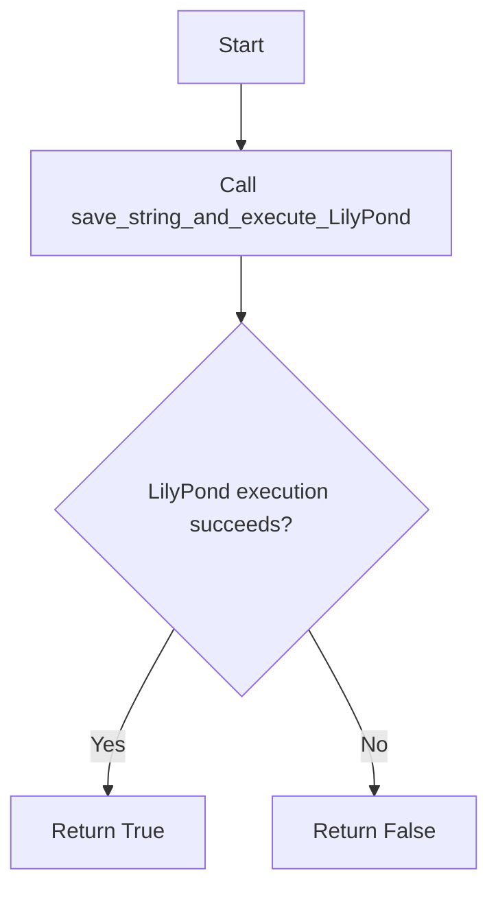
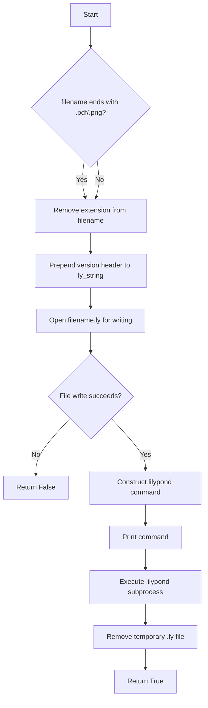

# `lilypond.py`

## `mingus.extra.lilypond.from_Note` · *function*

## Summary:
Converts a mingus Note object into a LilyPond-compatible string representation.

## Description:
Transforms a musical Note object into a format suitable for LilyPond music notation software. This function handles note names, accidentals, and octave adjustments to produce proper LilyPond syntax. The function is designed to be a utility for converting mingus Note objects into the string format expected by LilyPond engraving tools.

The logic is extracted into a separate function to maintain clean separation between musical data representation and formatting for external notation systems, allowing the same Note object to be converted to different output formats without modifying the core Note class.

## Args:
    note (Note): A mingus Note object containing name and octave attributes
    process_octaves (bool): When True, adjusts octave indicators (' and ,) based on the note's octave value relative to middle C (C4). Defaults to True.
    standalone (bool): When True, wraps the result in curly braces { }. Defaults to True.

## Returns:
    str or bool: A LilyPond-formatted string representation of the note when successful, or False if the note object lacks a name attribute.

## Raises:
    None explicitly raised by this function

## Constraints:
    Preconditions:
    - The note parameter must be a valid mingus Note object with a name attribute
    - The note.name must be a valid note name string (e.g., "C", "D#", "Eb")
    - The note.octave must be a valid integer

    Postconditions:
    - Returns a properly formatted LilyPond note string when note has valid name attribute
    - Returns False when note.name is missing or invalid
    - The returned string follows LilyPond syntax conventions for note names and octave indicators

## Side Effects:
    None

## Control Flow:
```mermaid
flowchart TD
    A[Start from_Note] --> B{note has name attribute?}
    B -->|No| C[Return False]
    B -->|Yes| D[Initialize result with note.name[0].lower()]
    D --> E[Process accidentals in note.name[1:]]
    E --> F{process_octaves?}
    F -->|No| G[Skip octave processing]
    F -->|Yes| H[Process octave adjustments]
    H --> G
    G --> I{standalone?}
    I -->|No| J[Return result]
    I -->|Yes| K[Wrap result in { } and return]
```

## Examples:
    # Basic usage with a simple note
    note = Note("C4")
    lilypond_note = from_Note(note)
    # Returns: "{ c' }"
    
    # With accidentals
    note = Note("D#5")
    lilypond_note = from_Note(note)
    # Returns: "{ dis'' }"
    
    # Without octave processing
    note = Note("Eb3")
    lilypond_note = from_Note(note, process_octaves=False)
    # Returns: "{ es }"
    
    # Standalone=False
    note = Note("F4")
    lilypond_note = from_Note(note, standalone=False)
    # Returns: "f'"
```

## `mingus.extra.lilypond.from_NoteContainer` · *function*

## Summary:
Converts a mingus NoteContainer object into LilyPond-compatible musical notation string.

## Description:
Transforms a NoteContainer (which may contain one or more notes) into a string representation suitable for LilyPond music notation software. This function handles various container states including empty containers, single notes, and chord-like containers with multiple notes. The logic is extracted into a separate function to maintain clean separation between musical data representation and formatting for external notation systems, allowing NoteContainer objects to be converted to LilyPond format without modifying the core container classes.

## Args:
    nc (NoteContainer or None): A mingus NoteContainer object containing notes, or None
    duration (float or None): Optional duration value to append to the note representation
    standalone (bool): When True, wraps the result in curly braces { }; defaults to True

## Returns:
    str or bool: A LilyPond-formatted string representation of the container when successful, or False if nc is not a valid NoteContainer object

## Raises:
    None explicitly raised by this function

## Constraints:
    Preconditions:
    - If nc is not None, it must have a 'notes' attribute
    - The duration parameter, if provided, must be compatible with value.determine function
    
    Postconditions:
    - Returns a properly formatted LilyPond string when nc is valid
    - Returns False when nc is not a valid NoteContainer object (has no 'notes' attribute)
    - Returns "r" for None or empty containers
    - Returns properly formatted note/chord representations for containers with notes

## Side Effects:
    None

## Control Flow:
```mermaid
flowchart TD
    A[Start from_NoteContainer] --> B{nc is not None AND has no notes attribute?}
    B -->|Yes| C[Return False]
    B -->|No| D{nc is None OR len(nc.notes) == 0?}
    D -->|Yes| E[result = "r"]
    D -->|No| F{len(nc.notes) == 1?}
    F -->|Yes| G[result = from_Note(nc.notes[0], standalone=False)]
    F -->|No| H[result = "<"]
    H --> I[Loop through nc.notes]
    I --> J[result += from_Note(notes, standalone=False) + " "]
    J --> K[result = result[:-1] + ">"]
    K --> L{duration != None?}
    L -->|Yes| M[parsed_value = value.determine(duration)]
    M --> N[dur = parsed_value[0]]
    N --> O{dur == value.longa?}
    O -->|Yes| P[result += "\\longa"]
    O -->|No| Q{dur == value.breve?}
    Q -->|Yes| R[result += "\\breve"]
    Q -->|No| S[result += str(int(parsed_value[0]))]
    S --> T[Add dots for parsed_value[1]]
    T --> U[End duration processing]
    U --> V{standalone?}
    V -->|No| W[Return result]
    V -->|Yes| X[Return "{ %s }" % result]
```

## Examples:
    # Empty container
    result = from_NoteContainer(None)
    # Returns: "{ r }"
    
    # Single note container
    note_container = NoteContainer([Note("C4")])
    result = from_NoteContainer(note_container)
    # Returns: "{ c' }"
    
    # Chord container
    note_container = NoteContainer([Note("C4"), Note("E4"), Note("G4")])
    result = from_NoteContainer(note_container)
    # Returns: "{ < c' e' g' > }"
    
    # With duration
    note_container = NoteContainer([Note("D5")])
    result = from_NoteContainer(note_container, duration=1.0)
    # Returns: "{ d'' \\breve }"
    
    # Non-standalone
    note_container = NoteContainer([Note("F4")])
    result = from_NoteContainer(note_container, standalone=False)
    # Returns: "f'"

## `mingus.extra.lilypond.from_Bar` · *function*

## Summary:
Converts a mingus Bar object into a LilyPond music notation string with optional key and time signature information.

## Description:
Transforms a musical Bar object (containing notes, key, and meter information) into a string representation compatible with LilyPond music notation software. This function generates properly formatted LilyPond syntax including key signatures, time signatures, and rhythmic groupings using \times commands for tuplets.

The logic is extracted into a separate function to maintain clean separation between musical data representation and formatting for external notation systems, allowing Bar objects to be converted to LilyPond format without modifying the core Bar class.

## Args:
    bar (object): A mingus Bar object containing musical data including notes, key, and meter information
    showkey (bool): When True, includes key signature information in the output. Defaults to True
    showtime (bool): When True, includes time signature information in the output. Defaults to True

## Returns:
    str or bool: A LilyPond-formatted string representation of the bar when successful, or False if the bar object lacks a "bar" attribute

## Raises:
    None explicitly raised by this function

## Constraints:
    Preconditions:
    - The bar parameter must be a valid mingus Bar object with the following attributes:
      * bar.bar (list of musical entries)
      * bar.key (Key object with key and mode attributes)
      * bar.meter (tuple representing time signature as (numerator, denominator))
    - Each entry in bar.bar should be a list with structure [beat_position, duration, note_container]
    - The note_container should be a valid NoteContainer or None

    Postconditions:
    - Returns a properly formatted LilyPond string when bar has valid structure
    - Returns False when bar does not have a "bar" attribute
    - Generated string follows LilyPond syntax conventions for key signatures, time signatures, and note durations

## Side Effects:
    None

## Control Flow:
```mermaid
flowchart TD
    A[Start from_Bar] --> B{bar has bar attribute?}
    B -->|No| C[Return False]
    B -->|Yes| D{showkey?}
    D -->|No| E[Set result = ""]
    D -->|Yes| F[Create key signature]
    F --> E
    E --> G[Initialize latest_ratio = (1,1)]
    G --> H[Initialize ratio_has_changed = False]
    H --> I[Loop through bar.bar entries]
    I --> J[Parse duration with value.determine]
    J --> K[Extract ratio from parsed value]
    K --> L{ratio == latest_ratio?}
    L -->|Yes| M[Append note container with from_NoteContainer]
    L -->|No| N{ratio_has_changed?}
    N -->|Yes| O[Close previous tuplet group with }]
    O --> P[Open new tuplet group with \\times]
    P --> M
    M --> Q[Update latest_ratio]
    Q --> R[Set ratio_has_changed = True]
    R --> S[Next bar entry]
    S --> I
    I --> T[End loop]
    T --> U{ratio_has_changed?}
    U -->|Yes| V[Close final tuplet group with }]
    V --> W[Process time signature]
    W --> X{showtime?}
    X -->|No| Y[Return wrapped result]
    X -->|Yes| Z[Add time signature and return]
    Z --> Y
```

## Examples:
    # Basic usage with key and time signature
    bar = Bar("C", (4, 4))
    # Add some notes to the bar...
    lilypond_output = from_Bar(bar)
    # Returns: "{ \\key c \\major \\time 4/4 { c' d' e' f' } }"
    
    # Without key signature
    lilypond_output = from_Bar(bar, showkey=False)
    # Returns: "{ \\time 4/4 { c' d' e' f' } }"
    
    # Without time signature
    lilypond_output = from_Bar(bar, showtime=False)
    # Returns: "{ \\key c \\major { c' d' e' f' } }"
    
    # With tuplets
    lilypond_output = from_Bar(bar_with_tuplets)
    # Returns: "{ \\key c \\major \\time 4/4 { \\times 3/2 { c' d' e' } } }"

## `mingus.extra.lilypond.from_Track` · *function*

## Summary:
Converts a mingus Track object into a LilyPond music notation string by processing each bar with conditional key and time signature display.

## Description:
Transforms a musical Track object (containing multiple bars) into a LilyPond-compatible string representation. This function iterates through each bar in the track, determining when to display key signatures and time signatures based on changes between consecutive bars. It leverages the `from_Bar` function to convert individual bars into LilyPond notation while managing display flags to minimize redundant key/time signature information.

This logic is extracted into its own function to separate the concerns of track-level organization from bar-level formatting, enabling clean conversion of musical tracks to external notation systems without modifying core data structures.

## Args:
    track (object): A mingus Track object containing musical data with bars attribute. Must have a bars attribute that is iterable containing Bar objects with key and meter attributes.

## Returns:
    str or bool: A LilyPond-formatted string enclosed in curly braces when successful, or False if the track object lacks a "bars" attribute.

## Raises:
    None explicitly raised by this function

## Constraints:
    Preconditions:
    - The track parameter must be a valid object with a "bars" attribute
    - Each item in track.bars must be a Bar object with key and meter attributes
    - Bar.key must be a Key object with comparable properties
    - Bar.meter must be a tuple representing a valid time signature (numerator, denominator)

    Postconditions:
    - Returns a properly formatted LilyPond string when track has valid structure
    - Returns False when track does not have a "bars" attribute
    - Generated string follows LilyPond syntax conventions for musical notation

## Side Effects:
    None

## Control Flow:
```mermaid
flowchart TD
    A[Start from_Track] --> B{track has bars attribute?}
    B -->|No| C[Return False]
    B -->|Yes| D[Initialize lastkey = Key("C"), lasttime = (4,4)]
    D --> E[Initialize result = ""]
    E --> F[Loop through track.bars]
    F --> G{lastkey != bar.key?}
    G -->|Yes| H[Set showkey = True]
    G -->|No| H[Set showkey = False]
    H --> I{lasttime != bar.meter?}
    I -->|Yes| J[Set showtime = True]
    I -->|No| J[Set showtime = False]
    J --> K[Call from_Bar(bar, showkey, showtime)]
    K --> L[Append result with from_Bar output + " "]
    L --> M[Update lastkey = bar.key]
    M --> N[Update lasttime = bar.meter]
    N --> O[Next bar]
    O --> F
    F --> P[End loop]
    P --> Q[Return "{ %s}" % result]
```

## Examples:
    # Basic usage with a track containing multiple bars
    track = Track()
    # Add bars to track...
    lilypond_output = from_Track(track)
    # Returns: "{ \\key c \\major \\time 4/4 { c' d' e' f' } \\key g \\major \\time 4/4 { g' a' b' c' } }"
    
    # Track with no bars attribute
    bad_track = object()
    result = from_Track(bad_track)
    # Returns: False

## `mingus.extra.lilypond.from_Composition` · *function*

## Summary:
Converts a mingus Composition object into a LilyPond music notation string by generating a header and processing each track.

## Description:
Transforms a musical Composition object (containing multiple tracks) into a LilyPond-compatible string representation. This function first validates that the composition has the required "tracks" attribute, then generates a LilyPond header with title, author, and subtitle information, followed by processing each track using the supporting `from_Track` function.

This logic is extracted into its own function to separate the concerns of composition-level organization from track-level formatting, enabling clean conversion of musical compositions to external notation systems without modifying core data structures.

## Args:
    composition (object): A mingus Composition object that must have the following attributes:
        - title (str): The composition's title
        - author (str): The composition's author/composer
        - subtitle (str): The composition's subtitle
        - tracks (iterable): An iterable collection of Track objects with bars attribute

## Returns:
    str or bool: A LilyPond-formatted string containing the complete composition when successful, or False if the composition object lacks a "tracks" attribute.

## Raises:
    None explicitly raised by this function

## Constraints:
    Preconditions:
    - The composition parameter must be a valid object with a "tracks" attribute
    - The composition must have title, author, and subtitle attributes
    - Each item in composition.tracks must be a Track object with a bars attribute
    - Track objects must be compatible with the from_Track function

    Postconditions:
    - Returns a properly formatted LilyPond string when composition has valid structure
    - Returns False when composition does not have a "tracks" attribute
    - Generated string follows LilyPond syntax conventions for headers and track organization

## Side Effects:
    None

## Control Flow:
```mermaid
flowchart TD
    A[Start from_Composition] --> B{composition has tracks attribute?}
    B -->|No| C[Return False]
    B -->|Yes| D[Create header with title, author, subtitle]
    D --> E[Initialize result with header]
    E --> F[Loop through composition.tracks]
    F --> G[Call from_Track(track)]
    G --> H[Append result with from_Track output + " "]
    H --> I[Next track]
    I --> F
    F --> J[End loop]
    J --> K[Return result[:-1]]
```

## Examples:
    # Basic usage with a valid composition
    composition = Composition()
    composition.title = "My Great Piece"
    composition.author = "Composer Name"
    composition.subtitle = "A wonderful composition"
    # Add tracks to composition...
    lilypond_output = from_Composition(composition)
    # Returns: "\\header { title = \"My Great Piece\" composer = \"Composer Name\" opus = \"A wonderful composition\" } track1_content track2_content ..."
    
    # Invalid composition (missing tracks attribute)
    bad_composition = object()
    result = from_Composition(bad_composition)
    # Returns: False
```

## `mingus.extra.lilypond.from_Suite` · *function*

## Summary:
Converts a mingus Suite object into a LilyPond music notation string by generating a header and processing each composition in the suite.

## Description:
Transforms a musical Suite object (containing multiple compositions) into a LilyPond-compatible string representation. This function first validates that the suite has the required "compositions" attribute, then generates a LilyPond header with suite metadata such as title, author, and subtitle, followed by processing each composition using the supporting `from_Composition` function.

This logic is extracted into its own function to separate the concerns of suite-level organization from composition-level formatting, enabling clean conversion of musical suites to external notation systems without modifying core data structures.

## Args:
    suite (object): A mingus Suite object that must have the following attributes:
        - title (str): The suite's main title
        - author (str): The suite's author/composer  
        - subtitle (str): The suite's subtitle
        - compositions (iterable): An iterable collection of Composition objects with tracks attribute

## Returns:
    str or bool: A LilyPond-formatted string containing the complete suite when successful, or False if the suite object lacks a "compositions" attribute.

## Raises:
    None explicitly raised by this function

## Constraints:
    Preconditions:
    - The suite parameter must be a valid object with a "compositions" attribute
    - The suite must have title, author, and subtitle attributes (can be empty strings)
    - Each item in suite.compositions must be a Composition object with a tracks attribute
    - Composition objects must be compatible with the from_Composition function

    Postconditions:
    - Returns a properly formatted LilyPond string when suite has valid structure
    - Returns False when suite does not have a "compositions" attribute
    - Generated string follows LilyPond syntax conventions for headers and composition organization

## Side Effects:
    None

## Control Flow:
```mermaid
flowchart TD
    A[Start from_Suite] --> B{suite has compositions attribute?}
    B -->|No| C[Return False]
    B -->|Yes| D[Create header with title, author, subtitle]
    D --> E[Initialize result with header]
    E --> F[Loop through suite.compositions]
    F --> G[Call from_Composition(composition)]
    G --> H[Append result with from_Composition output + " "]
    H --> I[Next composition]
    I --> F
    F --> J[End loop]
    J --> K[Return result[:-1]]
```

## `mingus.extra.lilypond.to_png` · *function*

## Summary:
Converts a LilyPond music notation string into a PNG image file.

## Description:
Generates a PNG image from a LilyPond music notation string by invoking the LilyPond command-line tool. This function serves as a convenience wrapper that internally calls save_string_and_execute_LilyPond with the appropriate PNG output flag.

## Args:
    ly_string (str): The LilyPond music notation string to be converted to PNG
    filename (str): The base filename for the output PNG file (extension is optional)

## Returns:
    bool: True if the PNG generation was successful, False if file writing fails

## Raises:
    None explicitly raised, though IOError may occur during file operations in the underlying implementation

## Constraints:
    Preconditions:
    - ly_string must be a valid string containing LilyPond notation
    - filename must be a valid string that can be used as a filesystem path
    - LilyPond must be installed and available in the system PATH
    
    Postconditions:
    - If successful, a PNG file is generated in the working directory with the specified filename
    - A temporary .ly file is created and immediately removed during processing

## Side Effects:
    - Creates a temporary .ly file in the current working directory
    - Executes an external subprocess command (lilypond)
    - Removes the temporary .ly file after execution
    - Prints the executed command to stdout

## Control Flow:


## Examples:
    # Basic usage
    success = to_png("\\relative c' { c d e f }", "my_music")
    
    # With explicit PNG extension
    success = to_png("\\relative c' { c d e f }", "my_music.png")

## `mingus.extra.lilypond.to_pdf` · *function*

## Summary:
Generates a PDF file from a LilyPond music notation string by invoking the LilyPond command-line tool.

## Description:
This function provides a convenient interface for generating PDF output from LilyPond music notation strings. It internally calls the more general `save_string_and_execute_LilyPond` function with the appropriate command-line flag ("-fpdf") to specify PDF generation. This abstraction allows users to generate PDFs without needing to construct the full LilyPond command manually.

The function is particularly useful in music notation applications where PDF output is required for publication or sharing purposes. It handles the temporary file creation, LilyPond execution, and cleanup automatically.

## Args:
    ly_string (str): The LilyPond music notation string to be converted to PDF
    filename (str): The base filename for the output PDF (extension is optional, will be added automatically if missing)

## Returns:
    bool: True if PDF generation was successful, False if file writing failed or LilyPond execution encountered issues

## Raises:
    None explicitly raised by this function, though underlying file I/O operations may raise IOError

## Constraints:
    Preconditions:
    - ly_string must contain valid LilyPond music notation
    - filename must be a valid string that can be used as a filesystem path
    - LilyPond must be installed and available in the system PATH
    
    Postconditions:
    - A temporary .ly file is created and immediately removed
    - If successful, a .pdf file is generated in the current working directory with the specified filename

## Side Effects:
    - Creates a temporary .ly file in the current working directory
    - Executes an external subprocess command (lilypond)
    - Removes the temporary .ly file after execution
    - Prints the executed command to stdout

## Control Flow:
```mermaid
flowchart TD
    A[Start to_pdf()] --> B[Call save_string_and_execute_LilyPond()]
    B --> C[Pass ly_string, filename, "-fpdf"]
    C --> D{Execution successful?}
    D -->|Yes| E[Return True]
    D -->|No| F[Return False]
```

## Examples:
    # Generate a PDF from a simple melody
    success = to_pdf("\\relative c' { c d e f }", "my_melody")
    if success:
        print("PDF generated successfully")
    else:
        print("Failed to generate PDF")
        
    # Generate PDF with explicit filename extension
    success = to_pdf("\\relative c' { c d e f }", "my_melody.pdf")
    if success:
        print("PDF generated successfully")
    else:
        print("Failed to generate PDF")

## `mingus.extra.lilypond.save_string_and_execute_LilyPond` · *function*

## Summary:
Writes a LilyPond music notation string to a temporary file and executes the LilyPond command to generate output files.

## Description:
This function serves as a utility for generating LilyPond output files by creating a temporary .ly file from a LilyPond string, executing the LilyPond command, and cleaning up the temporary file. It's designed to abstract away the file I/O and subprocess execution logic for LilyPond processing.

## Args:
    ly_string (str): The LilyPond music notation string to be processed
    filename (str): The base filename for output (can include .pdf or .png extension)
    command (str): Additional command-line arguments to pass to LilyPond

## Returns:
    bool: True if successful, False if file writing fails

## Raises:
    None explicitly raised, though IOError may occur during file operations

## Constraints:
    Preconditions:
    - ly_string must be a valid string containing LilyPond notation
    - filename must be a valid string that can be used as a filesystem path
    - command must be a valid string of additional LilyPond command arguments
    - LilyPond must be installed and available in the system PATH
    
    Postconditions:
    - A temporary .ly file is created and immediately removed
    - If successful, LilyPond output files (e.g., .pdf, .png) are generated in the working directory

## Side Effects:
    - Creates a temporary .ly file in the current working directory
    - Executes an external subprocess command (lilypond)
    - Removes the temporary .ly file after execution
    - Prints the executed command to stdout

## Control Flow:


## Examples:
    # Basic usage to generate PDF
    success = save_string_and_execute_LilyPond("\\relative c' { c d e f }", "test", "-f pdf")
    
    # Usage with PNG output
    success = save_string_and_execute_LilyPond("\\relative c' { c d e f }", "test.png", "-f png")

