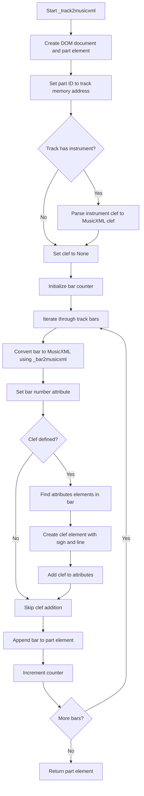
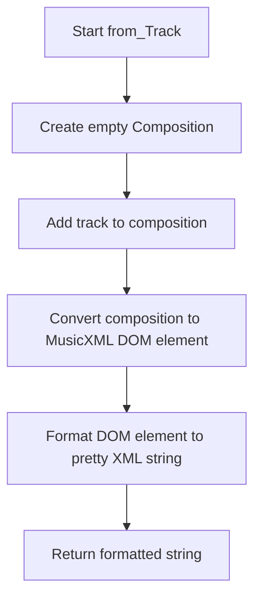
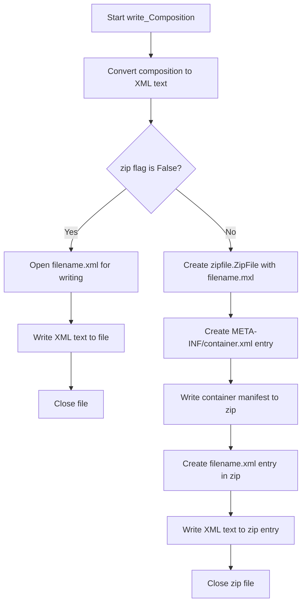

# `musicxml.py`

## `mingus.extra.musicxml._gcd` · *function*

## Summary:
Computes the greatest common divisor (GCD) of two numbers or a list of numbers using the Euclidean algorithm.

## Description:
Implements the Euclidean algorithm to calculate the greatest common divisor of two integers. Can also compute the GCD of multiple numbers by applying the algorithm recursively. This utility function is used for mathematical operations involving musical rhythms and timing calculations in MusicXML processing.

## Args:
    a (int, optional): First integer for GCD calculation. Defaults to None.
    b (int, optional): Second integer for GCD calculation. Defaults to None.
    terms (list[int], optional): List of integers to compute GCD for. Defaults to None.

## Returns:
    int: The greatest common divisor of the input numbers. When terms is provided, returns the GCD of all numbers in the list. When a and b are provided, returns the GCD of a and b. When terms is None and a and b are both None, returns None.

## Raises:
    TypeError: If non-numeric values are passed as arguments.

## Constraints:
    Preconditions:
    - When using a and b parameters, both should be integers
    - When using terms parameter, all elements should be integers
    - Function expects at least one valid number to process
    
    Postconditions:
    - Returns an integer representing the GCD
    - For empty terms list, returns None

## Side Effects:
    None

## Control Flow:
```mermaid
flowchart TD
    A[Start _gcd] --> B{terms provided?}
    B -- Yes --> C[reduce(lambda a,b: _gcd(a,b), terms)]
    B -- No --> D[while b ≠ 0]
    D --> E[a = b]
    E --> F[b = a mod b]
    F --> G{b ≠ 0?}
    G -- Yes --> D
    G -- No --> H[return a]
```

## Examples:
    # Calculate GCD of two numbers
    result = _gcd(12, 8)  # Returns 4
    
    # Calculate GCD of multiple numbers
    result = _gcd(terms=[12, 8, 16])  # Returns 4
    
    # Edge case with empty terms
    result = _gcd(terms=[])  # Returns None
    
    # Edge case with None values
    result = _gcd(None, None)  # Returns None

## `mingus.extra.musicxml._lcm` · *function*

## Summary:
Computes the least common multiple (LCM) of two numbers or a list of numbers using the mathematical relationship between LCM and GCD.

## Description:
Implements the least common multiple calculation using the formula LCM(a,b) = (a*b)/GCD(a,b). When provided with a list of numbers via the `terms` parameter, it recursively computes the LCM of all numbers in the list. This utility function is used for musical rhythm and timing calculations in MusicXML processing, particularly when determining common time signatures or synchronizing multiple musical elements.

## Args:
    a (int, optional): First integer for LCM calculation. Must be provided when terms is None.
    b (int, optional): Second integer for LCM calculation. Must be provided when terms is None.
    terms (list[int], optional): List of integers to compute LCM for. Takes precedence over a and b parameters.

## Returns:
    int: The least common multiple of the input numbers. When terms is provided, returns the LCM of all numbers in the list. When a and b are provided, returns the LCM of a and b.

## Raises:
    TypeError: If non-numeric values are passed as arguments.
    ZeroDivisionError: If GCD(a,b) equals zero (which happens when both a and b are zero).
    ValueError: If neither terms nor both a and b are provided.

## Constraints:
    Preconditions:
    - When using a and b parameters, both should be integers and provided together
    - When using terms parameter, all elements should be integers
    - Function expects either terms parameter or both a and b parameters to be provided
    
    Postconditions:
    - Returns an integer representing the LCM
    - For empty terms list, returns None (though this case isn't handled in current implementation)

## Side Effects:
    None

## Control Flow:
```mermaid
flowchart TD
    A[Start _lcm] --> B{terms provided?}
    B -- Yes --> C[reduce(lambda a,b: _lcm(a,b), terms)]
    B -- No --> D{a and b both provided?}
    D -- Yes --> E[(a * b) / _gcd(a, b)]
    D -- No --> F[raise ValueError]
    E --> G[return result]
```

## Examples:
    # Calculate LCM of two numbers
    result = _lcm(4, 6)  # Returns 12
    
    # Calculate LCM of multiple numbers
    result = _lcm(terms=[4, 6, 8])  # Returns 24

## `mingus.extra.musicxml._note2musicxml` · *function*

## Summary:
Converts a note object into a MusicXML note element node for inclusion in MusicXML documents.

## Description:
This function transforms a note object into its corresponding MusicXML representation by creating appropriate XML elements. When the note is None, it generates a rest element; otherwise, it constructs pitch information including step, octave, and accidental modifiers. This extraction allows for clean separation of note-to-MusicXML conversion logic from higher-level composition processing.

## Args:
    note: A note object with name and octave attributes, or None to represent a rest. The note object's name attribute should follow standard musical notation (e.g., "C", "D#", "Eb"), where the first character is the step and subsequent characters indicate accidentals.

## Returns:
    A DOM Element node representing the MusicXML note structure, containing either a rest element or pitch information with step, octave, and optional alter elements

## Raises:
    None explicitly raised

## Constraints:
    Preconditions:
    - If note is not None, the note object must have a name attribute that follows standard musical notation conventions (first character is step letter, followed by accidentals like '#' or 'b')
    - If note is not None, the note object must have an octave attribute that is a valid integer
    
    Postconditions:
    - Always returns a DOM Element node representing a MusicXML note structure
    - The returned node will contain either a "rest" child element or a "pitch" child element with proper step, octave, and alter elements

## Side Effects:
    None

## Control Flow:
```mermaid
flowchart TD
    A[Start _note2musicxml] --> B{note == None?}
    B -- Yes --> C[Create rest element]
    B -- No --> D[Create pitch element]
    C --> E[Return note_node]
    D --> F[Extract step from note.name[:1]]
    F --> G[Create octave element]
    G --> H[Add octave to pitch]
    H --> I[Process accidentals in note.name[1:]]
    I --> J{count != 0?}
    J -- Yes --> K[Create alter element]
    K --> L[Add alter to pitch]
    L --> M[Add pitch to note_node]
    J -- No --> M
    M --> E
    E --> END
```

## Examples:
    # Creating a rest note
    rest_note = _note2musicxml(None)
    # Result: <note><rest/></note>
    
    # Creating a regular note
    note_obj = SomeNoteClass(name="C#", octave=4)
    xml_note = _note2musicxml(note_obj)
    # Result: <note><pitch><step>C</step><octave>4</octave><alter>1</alter></pitch></note>
    
    # Creating a flat note
    note_obj = SomeNoteClass(name="Eb", octave=5)
    xml_note = _note2musicxml(note_obj)
    # Result: <note><pitch><step>E</step><octave>5</octave><alter>-1</alter></pitch></note>

## `mingus.extra.musicxml._bar2musicxml` · *function*

## Summary
Converts a musical bar (measure) into a MusicXML measure element node for XML-based musical notation representation.

## Description
Transforms a musical bar containing notes and timing information into a structured XML element that conforms to the MusicXML standard. This function extracts musical attributes like key signature, time signature, and note durations to construct a complete measure representation. It's part of the MusicXML export functionality in the mingus library, enabling conversion of internal musical representations to standardized XML format.

The function is designed to handle complex musical elements including chords, dotted rhythms, and tuplets by calculating appropriate timing relationships and musical attributes. It separates concerns by delegating individual note conversion to the `_note2musicxml` helper function.

## Args
    bar: A musical bar object that must be iterable and contain musical events. Each event in the bar should be a sequence with the following structure:
        - Index 0: Timing information (used to determine note duration)
        - Index 1: Note container or note information  
        - Index 2: Additional note information (typically a container for chords or None)
        
    The bar object must also have the following attributes:
        - key: A key object with attributes 'key', 'signature', and 'mode'
        - meter: A tuple containing time signature information (beats, beat type)

## Returns
    A DOM Element node representing a MusicXML measure element containing:
    - Attributes section with divisions, key signature, and time signature
    - Note elements for each musical event in the bar
    - Properly formatted duration, type, and rhythmic modification elements

## Raises
    None explicitly raised in the function body

## Constraints
    Preconditions:
    - The bar parameter must be iterable and contain musical events
    - Each musical event in the bar must have at least two elements (timing info and note container)
    - The bar.key.key must be a valid key (either in major_keys or minor_keys)
    - The bar.meter must be a tuple with two numeric elements representing beats and beat type
    - The value.determine function must properly process timing information from bar events
    - The bar must contain valid musical content that can be processed by _note2musicxml
    - Note containers should be either None or contain valid note objects

    Postconditions:
    - Returns a properly structured DOM Element representing a MusicXML measure
    - All musical elements in the bar are converted to equivalent MusicXML elements
    - Musical timing relationships are preserved through calculated divisions and durations

## Side Effects
    None

## Control Flow
```mermaid
flowchart TD
    A[Start _bar2musicxml] --> B[Create DOM document and measure element]
    B --> C[Initialize attributes section]
    C --> D[Calculate LCM of note durations]
    D --> E[Create divisions element]
    E --> F[Add divisions to attributes]
    F --> G{Key is valid major/minor?}
    G -- Yes --> H[Create key element]
    H --> I[Add key signature and mode]
    I --> J[Add key to attributes]
    G -- No --> J
    J --> K[Create time element]
    K --> L[Add beats and beat-type]
    L --> M[Add time to attributes]
    M --> N[Add attributes to measure]
    N --> O[Create chord element]
    O --> P[Iterate through bar events]
    P --> Q{Has note container?}
    Q -- Yes --> R[Check if chord]
    Q -- No --> S[Set note container to [None]]
    R --> T{Is chord?}
    T -- Yes --> U[Mark note as chord]
    T -- No --> U
    U --> V[Process each note in container]
    V --> W[Convert note to MusicXML]
    W --> X[Calculate duration]
    X --> Y[Add dots based on rhythmic modifiers]
    Y --> Z{Beat in value.musicxml?}
    Z -- Yes --> AA[Add type element]
    AA --> AB[Add time modification if needed]
    AB --> AC[Add note to measure]
    Z -- No --> AC
    AC --> AD[Next note]
    AD --> AE[Next bar event]
    AE --> AF[Return measure element]
```

## Examples
    # Basic usage in MusicXML export workflow
    from mingus.containers import Bar
    from xml.dom.minidom import Document
    
    # Assuming bar is populated with musical content
    bar = Bar()
    # ... populate bar with notes ...
    
    # Convert bar to MusicXML
    measure_xml = _bar2musicxml(bar)
    
    # The resulting measure_xml can be incorporated into a complete MusicXML document
    doc = Document()
    root = doc.createElement("score-partwise")
    doc.appendChild(root)
    root.appendChild(measure_xml)

## `mingus.extra.musicxml._track2musicxml` · *function*

## Summary:
Converts a musical track into a MusicXML part element with proper clef information and bar structure.

## Description:
Transforms a Track object containing musical bars into a structured MusicXML part element that can be embedded in a complete MusicXML document. This function handles the conversion of track-level metadata such as instrument clef information and processes each bar in the track using the helper function `_bar2musicxml`.

The function attempts to infer the appropriate musical clef from the track's instrument specification, mapping common clef names to standard MusicXML clef definitions. It then iterates through all bars in the track, converting each to its MusicXML representation and applying the determined clef information to the attributes section of each bar.

This extraction into a separate function allows for clean separation of concerns in the MusicXML export pipeline, where track-level processing is separated from bar-level and note-level conversions.

## Args:
    track (Track): A mingus Track object containing musical bars and optional instrument information. The track must have a bars attribute containing Bar objects and may optionally have an instrument attribute with a clef property.

## Returns:
    Element: A DOM Element node representing a MusicXML part element that contains all bars in the track with appropriate clef information applied to each bar's attributes section.

## Raises:
    None explicitly raised in the function body

## Constraints:
    Preconditions:
    - The track parameter must be a valid Track object from the mingus library
    - The track must have a bars attribute containing iterable bar objects
    - Each bar in track.bars must be compatible with the _bar2musicxml function
    - The track may optionally have an instrument attribute with a clef property

    Postconditions:
    - Returns a properly structured DOM Element representing a MusicXML part
    - All bars in the track are converted to MusicXML measure elements
    - Clef information is appropriately added to each bar's attributes section when applicable
    - The returned element has a unique ID attribute based on the track's memory address

## Side Effects:
    None

## Control Flow:


## Examples:
    # Basic usage in MusicXML export workflow
    from mingus.containers import Track
    from mingus.extra.musicxml import _track2musicxml
    from xml.dom.minidom import Document
    
    # Create a track with content
    track = Track()
    # ... add bars to track ...
    
    # Convert track to MusicXML part
    part_xml = _track2musicxml(track)
    
    # The resulting part_xml can be incorporated into a complete MusicXML document
    doc = Document()
    root = doc.createElement("score-partwise")
    doc.appendChild(root)
    root.appendChild(part_xml)

## `mingus.extra.musicxml._composition2musicxml` · *function*

## Summary:
Converts a mingus Composition object into a MusicXML score-partwise DOM element structure.

## Description:
Transforms a musical composition containing tracks and metadata (title, author) into a structured MusicXML document fragment that follows the score-partwise format version 2.0. This function handles the top-level composition metadata and creates the structural foundation for a complete MusicXML document by processing each track in the composition.

The function creates the core MusicXML elements including identification information, part lists, and individual score-part elements for each track. It delegates the conversion of individual tracks to the `_track2musicxml` helper function and incorporates instrument information when available.

This extraction into a dedicated function enables clean separation of concerns in the MusicXML export pipeline, where composition-level processing is separated from track-level and bar-level conversions.

## Args:
    comp (Composition): A mingus Composition object containing tracks, metadata (title, author), and optional instrument information. Must be a valid Composition instance with tracks attribute containing Track objects. The composition's title and author attributes are accessed directly to populate the MusicXML identification section.

## Returns:
    xml.dom.minidom.Element: A DOM Element node representing the root "score-partwise" element of a MusicXML document structure. This element contains all composition metadata, part lists, and track information but requires additional wrapping to form a complete MusicXML document.

## Raises:
    None explicitly raised in the function body

## Constraints:
    Preconditions:
    - The comp parameter must be a valid Composition object from the mingus library
    - The composition must have a tracks attribute containing iterable Track objects
    - Each track in comp must be compatible with the _track2musicxml function
    - The composition may optionally have title and author attributes

    Postconditions:
    - Returns a properly structured DOM Element representing a MusicXML score-partwise structure
    - All tracks in the composition are processed and converted to score-part elements
    - Metadata (title, author) is properly encoded into the identification section
    - Instrument information is included when available in tracks
    - The returned element is ready to be incorporated into a complete MusicXML document

## Side Effects:
    None

## Control Flow:
```mermaid
flowchart TD
    A[Start _composition2musicxml] --> B[Create DOM document and score element]
    B --> C[Set score version to 2.0]
    C --> D{Composition has title?}
    D -- Yes --> E[Create movement-title element]
    E --> F[Add title text to element]
    F --> G[Append title to score]
    D -- No --> G
    G --> H[Create identification element]
    H --> I{Composition has author?}
    I -- Yes --> J[Create creator element]
    J --> K[Set creator type to composer]
    K --> L[Add author text to element]
    L --> M[Append creator to identification]
    I -- No --> M
    M --> N[Create encoding element]
    N --> O[Create software element]
    O --> P[Set software text to "mingus"]
    P --> Q[Append software to encoding]
    Q --> R[Create encoding-date element]
    R --> S[Set date to today]
    S --> T[Append encoding-date to encoding]
    T --> U[Append encoding to identification]
    U --> V[Append identification to score]
    V --> W[Create part-list element]
    W --> X[Append part-list to score]
    X --> Y[Iterate through composition tracks (comp)]
    Y --> Z[Call _track2musicxml for each track]
    Z --> AA[Create score-part element]
    AA --> AB[Set track ID attributes]
    AB --> AC[Create part-name element]
    AC --> AD[Add track name to part-name]
    AD --> AE[Append part-name to score-part]
    AE --> AF{Track has instrument?}
    AF -- Yes --> AG[Create score-instrument element]
    AG --> AH[Set instrument ID]
    AH --> AI[Create instrument-name element]
    AI --> AJ[Add instrument name to element]
    AJ --> AK[Append instrument-name to score-instrument]
    AK --> AL[Append score-instrument to score-part]
    AL --> AM{Instrument is MidiInstrument?}
    AM -- Yes --> AN[Create midi-instrument element]
    AN --> AO[Set midi ID]
    AO --> AP[Create midi-channel element]
    AP --> AQ[Set channel to 1]
    AQ --> AR[Create midi-program element]
    AR --> AS[Add instrument number to midi-program]
    AS --> AT[Append midi-channel and midi-program to midi-instrument]
    AT --> AU[Append midi-instrument to score-part]
    AM -- No --> AV[Skip midi-instrument creation]
    AV --> AW[Append score-part to part-list]
    AW --> AX[Set track ID on track element]
    AX --> AY[Append track to score]
    AY --> AZ[Increment track counter]
    AZ --> BA{More tracks?}
    BA -- Yes --> Y
    BA -- No --> BB[Return score element]
```

## Examples:
    # Basic usage in MusicXML export workflow
    from mingus.containers import Composition
    from mingus.extra.musicxml import _composition2musicxml
    from xml.dom.minidom import Document
    
    # Create a composition with tracks
    comp = Composition()
    comp.set_title("My Symphony")
    comp.set_author("Jane Smith")
    # ... add tracks to composition ...
    
    # Convert composition to MusicXML structure
    score_xml = _composition2musicxml(comp)
    
    # The resulting score_xml can be incorporated into a complete MusicXML document
    doc = Document()
    doc.appendChild(score_xml)
    # ... continue with document completion ...

## `mingus.extra.musicxml.from_Note` · *function*

## Summary
Converts a single musical note into a complete MusicXML score representation.

## Description
Transforms a mingus Note object into a complete MusicXML document string by wrapping it in a minimal composition structure. This function provides a convenient way to generate MusicXML output for individual notes without requiring full composition structures.

The function creates a new Composition object, adds the provided note to it, and then leverages the existing MusicXML conversion pipeline (_composition2musicxml) to generate a properly formatted MusicXML document. The resulting XML is formatted with proper indentation for readability.

This extraction into a dedicated function enables users to quickly generate MusicXML representations of individual notes while maintaining consistency with the broader MusicXML export capabilities of the mingus library.

## Args
    note (Note): A mingus Note object representing a single musical note. The note should have valid name and octave attributes following standard musical notation conventions.

## Returns
    str: A formatted MusicXML document string containing the note in a complete score structure. The output includes proper XML declaration, score-partwise structure, and formatted indentation for readability.

## Raises
    None explicitly raised by this function, though underlying conversion functions may raise exceptions if the note object is malformed or incompatible with the MusicXML conversion pipeline.

## Constraints
    Preconditions:
    - The note parameter must be a valid mingus Note object with proper name and octave attributes
    - The note should follow standard musical notation conventions (e.g., "C", "D#", "Eb")
    
    Postconditions:
    - Returns a valid XML string that conforms to MusicXML score-partwise format
    - The XML string is properly indented for human readability
    - The resulting document contains the note in a complete musical context

## Side Effects
    None

## Control Flow
```mermaid
flowchart TD
    A[Start from_Note] --> B[Create empty Composition]
    B --> C[Add note to composition]
    C --> D[Convert composition to MusicXML structure]
    D --> E[Format XML with toprettyxml()]
    E --> F[Return formatted XML string]
```

## Examples
    # Convert a single note to MusicXML
    from mingus.containers import Note
    from mingus.extra.musicxml import from_Note
    
    # Create a note
    note = Note("C4")
    
    # Convert to MusicXML
    xml_output = from_Note(note)
    print(xml_output)
    # Output will be a formatted XML string representing the note
    
    # Convert a sharp note
    sharp_note = Note("D#5")
    xml_sharp = from_Note(sharp_note)
    print(xml_sharp)
    # Output will be a formatted XML string with sharp notation
```

## `mingus.extra.musicxml.from_Bar` · *function*

## Summary
Converts a single musical bar into a formatted MusicXML string representation.

## Description
Transforms a mingus Bar object into a complete MusicXML score-partwise document structure. This function serves as a convenience wrapper that creates a minimal musical composition containing only the provided bar, then converts it to MusicXML format for export or further processing.

The function is designed to handle individual musical bars independently, making it useful for batch processing or when working with isolated musical fragments. It creates a composition with a single track containing the specified bar, then leverages the existing composition-to-MusicXML conversion infrastructure.

Known callers within the codebase:
- This function appears to be a utility function primarily used internally for MusicXML export operations
- It's likely called when converting individual bars to MusicXML format without requiring a full composition structure

This logic is extracted into its own function rather than being inlined because:
- It provides a clean abstraction for converting individual bars to MusicXML
- It separates the concern of bar-to-MusicXML conversion from composition management
- It allows reuse of the existing composition-to-MusicXML conversion pipeline
- It maintains consistency with the broader MusicXML export architecture

## Args
    bar (Bar): A mingus Bar object containing musical content (notes, rests) to be converted to MusicXML format. The bar must be a valid Bar instance with proper musical content and meter/key information.

## Returns
    str: A formatted, pretty-printed MusicXML string representing the musical content of the provided bar. The output follows the MusicXML score-partwise format version 2.0 specification and includes proper XML declaration and indentation for readability.

## Raises
    None explicitly raised by this function, though underlying functions may raise exceptions if the bar parameter is malformed or incompatible with the conversion process.

## Constraints
    Preconditions:
    - The bar parameter must be a valid mingus Bar object instance
    - The bar should contain valid musical content (notes, rests) that can be processed by the MusicXML conversion pipeline
    - The bar must have proper meter and key information for meaningful MusicXML output
    
    Postconditions:
    - Returns a well-formed MusicXML string with proper XML formatting
    - The returned XML represents a complete score-partwise structure with appropriate metadata
    - The output is indented and readable for human consumption
    - The resulting XML can be saved to a file or embedded in larger MusicXML documents

## Side Effects
    None

## Control Flow
```mermaid
flowchart TD
    A[Start from_Bar] --> B[Create empty Composition]
    B --> C[Create empty Track]
    C --> D[Add bar to track using track.add_bar()]
    D --> E[Add track to composition using composition.add_track()]
    E --> F[Convert composition to MusicXML using _composition2musicxml()]
    F --> G[Format XML with toprettyxml()]
    G --> H[Return formatted XML string]
```

## Examples
```python
# Basic usage with a populated bar
from mingus.containers import Bar
from mingus.extra.musicxml import from_Bar

# Create a bar with musical content
bar = Bar()
bar.place_notes("C4 E4 G4", 4)  # Add a C major triad for one beat

# Convert to MusicXML
xml_output = from_Bar(bar)
print(xml_output)
# Output would be a formatted MusicXML string representing the bar

# Usage in a batch processing scenario
bars = [Bar(), Bar(), Bar()]  # Array of bars
xml_files = [from_Bar(b) for b in bars]  # Convert all bars to XML

# Working with a bar that has specific meter and key
from mingus.core import keys
bar_with_key = Bar(key="G", meter=(3, 4))
bar_with_key.place_notes("D4 F#4 A4", 2)  # Add a D minor triad for half a beat
xml_with_metadata = from_Bar(bar_with_key)
```

## `mingus.extra.musicxml.from_Track` · *function*

## Summary:
Converts a single musical track into a formatted MusicXML string representation.

## Description:
Transforms a mingus Track object into a complete MusicXML score-partwise document string. This function serves as a convenience wrapper that creates a Composition containing only the provided track and then converts it to MusicXML format. It's designed for exporting individual tracks rather than full compositions.

The function is typically called when users want to export a single track as a standalone MusicXML file, bypassing the need to manually create a Composition object. It leverages the existing composition-to-MusicXML conversion infrastructure while providing a simpler interface for track-level exports.

## Args:
    track (Track): A mingus Track object containing musical content to be exported. The track must be a valid Track instance from the mingus library with properly structured bars and notes.

## Returns:
    str: A formatted MusicXML string representing the track as a complete score-partwise document. The string includes proper XML declaration, encoding, and indentation for human readability.

## Raises:
    None explicitly raised by this function. However, underlying functions may raise exceptions if:
    - The track parameter is not a valid Track object
    - The track contains invalid musical content that cannot be converted to MusicXML

## Constraints:
    Preconditions:
    - The track parameter must be a valid Track object from the mingus library
    - The track should contain properly structured musical content (bars with notes)
    
    Postconditions:
    - Returns a valid, well-formed MusicXML string
    - The returned string is properly formatted with indentation and XML declaration

## Side Effects:
    None

## Control Flow:


## Examples:
```python
# Basic usage - export a single track
from mingus.containers import Track
from mingus.extra.musicxml import from_Track

# Create a track with some musical content
track = Track()
# ... add bars and notes to track ...

# Export track as MusicXML
xml_string = from_Track(track)
print(xml_string)  # Prints formatted MusicXML string

# Save to file
with open('my_track.xml', 'w') as f:
    f.write(xml_string)
```

## `mingus.extra.musicxml.from_Composition` · *function*

## Summary:
Converts a mingus Composition object into a formatted MusicXML string representation.

## Description:
Transforms a musical composition containing tracks and metadata into a complete, human-readable MusicXML document string. This function serves as the primary interface for exporting mingus compositions to MusicXML format, handling the conversion process from the internal Composition structure to standardized MusicXML markup.

The function internally delegates to `_composition2musicxml()` to generate the XML structure and then formats it with proper indentation using `toprettyxml()` for readability.

## Args:
    comp (Composition): A valid mingus Composition object containing tracks, metadata (title, author), and optional instrument information. Must be an instance of the Composition class from mingus.containers.composition.

## Returns:
    str: A formatted MusicXML string representing the entire composition in score-partwise format. The string includes proper XML declaration, encoding, and indentation for human readability.

## Raises:
    AttributeError: If the comp parameter lacks required attributes or methods expected by the internal conversion functions (e.g., missing tracks attribute).
    TypeError: If the comp parameter is not a valid Composition object.
    Exception: Any exception that might occur during XML generation or formatting by the underlying DOM processing.

## Constraints:
    Preconditions:
    - The comp parameter must be a valid Composition object from the mingus library
    - The composition must have a tracks attribute containing iterable Track objects
    - Each track in comp must be compatible with the internal conversion functions

    Postconditions:
    - Returns a properly formatted XML string compliant with MusicXML 2.0 specification
    - The returned string is human-readable with appropriate indentation
    - All composition metadata (title, author) and track information are preserved

## Side Effects:
    None

## Control Flow:
```mermaid
flowchart TD
    A[Start from_Composition] --> B[Validate comp parameter]
    B --> C[Call _composition2musicxml(comp)]
    C --> D[Get DOM Element from conversion]
    D --> E[Call toprettyxml() on DOM Element]
    E --> F[Return formatted XML string]
```

## Examples:
    # Basic usage for exporting a composition
    from mingus.containers import Composition
    from mingus.extra.musicxml import from_Composition
    
    # Create a composition
    comp = Composition()
    comp.set_title("My Symphony")
    comp.set_author("Jane Smith")
    # ... add tracks and notes to composition ...
    
    # Export to MusicXML string
    xml_string = from_Composition(comp)
    print(xml_string)
    
    # Save to file
    with open('my_composition.xml', 'w') as f:
        f.write(xml_string)

## `mingus.extra.musicxml.write_Composition` · *function*

## Summary:
Writes a mingus Composition object to a MusicXML file in either plain XML or compressed MXL format.

## Description:
Exports a musical Composition object to a file containing MusicXML markup. This function converts the composition to MusicXML format using the internal `from_Composition` function and saves it to disk as either a plain .xml file or a compressed .mxl file (which is essentially a ZIP archive containing the XML file and a container manifest).

The function is designed to separate the concerns of composition-to-XML conversion from file I/O operations, allowing for flexible export options while maintaining clean code organization.

## Args:
    composition (Composition): A mingus Composition object containing tracks and metadata to be exported. Must be a valid Composition instance from mingus.containers.composition.
    filename (str): Base name for the output file. The actual file extension will be determined by the zip parameter (.xml or .mxl).
    zip (bool): Flag indicating whether to write as compressed MXL format (True) or plain XML format (False). Defaults to False.

## Returns:
    None: This function does not return any value. It performs file I/O operations directly.

## Raises:
    IOError: When unable to create or write to the specified file path.
    Exception: Any exception that might occur during file operations or XML generation by the underlying functions.

## Constraints:
    Preconditions:
    - The composition parameter must be a valid Composition object from the mingus library
    - The composition must have a tracks attribute containing iterable Track objects
    - The filename parameter must be a valid string that can be used as a file path
    - The composition must be compatible with the internal conversion functions in the musicxml module

    Postconditions:
    - A file is created at the specified location with the appropriate extension
    - The file contains valid MusicXML markup representing the composition
    - If zip=True, the file is a valid MXL (compressed MusicXML) archive

## Side Effects:
    - Creates a file on the filesystem at the specified location
    - Writes XML content to disk (either .xml or .mxl format)
    - May create directory structure if needed for the file path

## Control Flow:


## Examples:
    # Export composition as plain XML file
    from mingus.containers import Composition
    from mingus.extra.musicxml import write_Composition
    
    comp = Composition()
    comp.set_title("My Symphony")
    comp.set_author("Jane Smith")
    # ... add tracks and notes to composition ...
    
    # Write to XML file
    write_Composition(comp, "my_composition", zip=False)
    # Creates my_composition.xml file
    
    # Export composition as compressed MXL file
    write_Composition(comp, "my_composition", zip=True)
    # Creates my_composition.mxl file (compressed)

