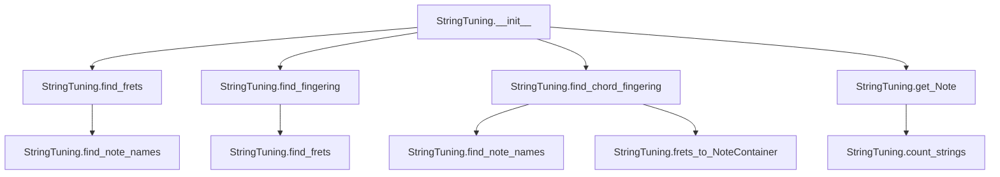
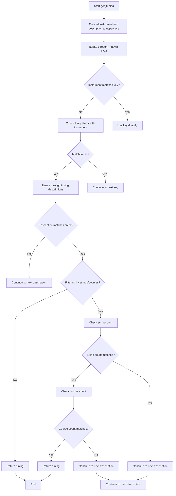

# `tunings.py`

## `mingus.extra.tunings.StringTuning` · *class*

## Summary:
Represents a musical instrument tuning configuration with methods for finding fret positions and optimal fingerings.

## Description:
The StringTuning class models musical instrument tunings, particularly for stringed instruments. It stores tuning information and provides functionality to calculate fret positions for specific notes, find optimal fingerings for chords, and convert between fret numbers and musical notes. This abstraction allows for standardized handling of different instrument tunings in music applications.

## State:
- instrument (object): The musical instrument associated with this tuning configuration
- tuning (list): List of Note objects representing the open string frequencies; each entry can be a single Note or a list of Notes for multi-course strings
- description (str): Human-readable description of this tuning

## Lifecycle:
- Creation: Instantiate with instrument, description, and tuning parameters where tuning entries can be Note objects or string representations that get converted to Notes
- Usage: Call methods like find_frets(), find_fingering(), find_chord_fingering() to analyze notes and fingering options
- Destruction: No special cleanup required; standard Python object lifecycle applies

## Method Map:


## Raises:
- RangeError: When attempting to access a fret or string that is outside the valid range in get_Note method

## Example:
```python
# Create a tuning for a guitar
tuning = StringTuning("Guitar", "Standard Tuning", ["E", "A", "D", "G", "B", "E"])
print(tuning.count_strings())  # Output: 6
frets = tuning.find_frets("C")
print(frets)  # Output: fret positions for C on each string

# Find optimal fingering for a chord
chord_fingering = tuning.find_chord_fingering(["C", "E", "G"])
print(chord_fingering)  # Output: optimal fingerings for the C major chord

# Get a specific note from fret position
note = tuning.get_Note(0, 3)  # Get note on string 0, fret 3
print(note)  # Output: the note at that position
```

### `mingus.extra.tunings.StringTuning.__init__` · *method*

## Summary:
Initializes a StringTuning object with instrument, description, and note-based tuning specifications.

## Description:
Configures a StringTuning instance by storing the instrument name, processing and converting raw tuning specifications into Note objects, and assigning a descriptive label. This method serves as the constructor for the StringTuning class, preparing the object's internal state for representing musical instrument tunings.

## Args:
    instrument (str): Name or identifier of the musical instrument this tuning represents.
    description (str): Human-readable description of the tuning configuration.
    tuning (list): Collection of note specifications that define the tuning. Each element can be either:
        - A string representing a single note (e.g., "C4")
        - A list of strings representing multiple notes for a single string (e.g., ["C4", "E4"])

## Returns:
    None: This method initializes the object's state and does not return a value.

## Raises:
    NoteFormatError: When invalid note representations are provided in the tuning parameter.
    ValueError: When channel or velocity values in Note objects exceed valid MIDI ranges.

## State Changes:
    Attributes READ: None
    Attributes WRITTEN: 
    - self.instrument: Set to the provided instrument parameter
    - self.tuning: Initialized as empty list, populated with Note objects or lists of Note objects derived from tuning parameter
    - self.description: Set to the provided description parameter

## Constraints:
    Preconditions:
    - The tuning parameter must be iterable containing valid note specifications
    - Note specifications must be convertible to Note objects (strings, integers, or Note objects)
    
    Postconditions:
    - self.instrument is assigned the provided instrument value
    - self.tuning contains properly initialized Note objects or lists of Note objects
    - self.description is assigned the provided description value

## Side Effects:
    None: This method performs no I/O operations or external service calls. It only manipulates internal object state.

### `mingus.extra.tunings.StringTuning.count_strings` · *method*

## Summary:
Returns the total number of strings in the tuning configuration.

## Description:
This method provides the count of strings in the musical instrument tuning. It is primarily used for validating string indices when accessing notes on specific strings. The method serves as a clean abstraction over the internal `self.tuning` list length, making the code more readable and maintainable.

## Args:
    None

## Returns:
    int: The number of strings in the tuning, which corresponds to the length of the internal `self.tuning` list.

## Raises:
    None

## State Changes:
    Attributes READ: self.tuning
    Attributes WRITTEN: None

## Constraints:
    Preconditions: The object must be properly initialized with a valid tuning list.
    Postconditions: The returned integer is always non-negative and represents the actual count of strings.

## Side Effects:
    None

### `mingus.extra.tunings.StringTuning.count_courses` · *method*

## Summary:
Calculates the average number of courses (notes) per string in the tuning configuration.

## Description:
This method computes the arithmetic mean of courses (individual notes or note groups) across all strings in the tuning. Each string in the tuning can represent either a single note or multiple notes (courses), particularly in multi-course instruments like guitar strings with multiple strings per course. The method iterates through each string, counting courses appropriately (single notes contribute 1, lists of notes contribute their length), then divides by the total number of strings to compute the average.

## Args:
    None

## Returns:
    float: Average number of courses per string in the tuning configuration.

## Raises:
    None explicitly raised

## State Changes:
    Attributes READ: self.tuning
    Attributes WRITTEN: None

## Constraints:
    Preconditions: 
    - self.tuning must be iterable
    - Each element in self.tuning must be either a Note instance or a list of Note instances
    Postconditions:
    - Returns a float value representing the average courses per string
    - The returned value is always >= 1.0 when there is at least one string

## Side Effects:
    None

### `mingus.extra.tunings.StringTuning.find_frets` · *method*

## Summary:
Calculates fret positions for a given note across all strings in the tuning, returning None for unreachable notes.

## Description:
Determines the fret positions where a specified note can be played on each string of the tuning. For each string, it calculates the interval (in semitones) between the string's base note and the target note using the Note.measure() method. If the resulting fret position falls within the maximum allowed fret range, it's returned; otherwise, None is returned for that string.

This method is used in guitar and similar stringed instrument fingering calculations to determine playable positions for notes across multiple strings.

## Args:
    note: Either a string representation of a note (e.g., "C", "D#") or a Note object to find fret positions for
    maxfret: Maximum allowable fret position (default: 24). Fret positions beyond this limit return None

## Returns:
    list[int or None]: A list where each element corresponds to a string in the tuning. Each element is either:
        - An integer representing the fret position where the note can be played on that string
        - None if the note cannot be played on that string within the maximum fret range

## Raises:
    None explicitly raised - though underlying Note creation may raise exceptions for invalid note strings

## State Changes:
    Attributes READ: self.tuning
    Attributes WRITTEN: None

## Constraints:
    Preconditions:
    - The note parameter must be a valid note representation (string or Note object)
    - The maxfret parameter must be a non-negative integer
    - The tuning must be properly initialized with valid note representations
    
    Postconditions:
    - Returns a list with length equal to the number of strings in the tuning
    - Each element is either an integer in range [0, maxfret] or None
    - The method does not modify any instance attributes

## Side Effects:
    None - This method performs no I/O operations or external service calls

### `mingus.extra.tunings.StringTuning.find_fingering` · *method*

## Summary:
Finds optimal fingerings for a sequence of musical notes on a stringed instrument, considering string constraints and maximum finger distance.

## Description:
This method recursively explores all possible combinations of (string, fret) positions for a given sequence of musical notes. It uses a backtracking algorithm to find valid fingerings while respecting constraints such as maximum distance between fingers and avoiding previously used strings. The method returns fingerings sorted by total frets used, making it suitable for finding efficient playing positions.

## Args:
    notes (list): A list of musical notes to find fingerings for. Can be None or empty.
    max_distance (int): Maximum allowed distance between the highest and lowest frets in a fingering. Defaults to 4.
    not_strings (list): List of string numbers that should not be used in the current fingering. Defaults to empty list.

## Returns:
    list: A list of fingerings, where each fingering is a list of (string, fret) tuples representing valid positions on the instrument. Fingerings are sorted by total frets used.

## Raises:
    None explicitly raised. May raise exceptions from underlying methods like find_frets().

## State Changes:
    Attributes READ: None (relies on self.find_frets() method)
    Attributes WRITTEN: None

## Constraints:
    Preconditions:
        - Notes should be valid musical note representations
        - Max_distance should be a non-negative integer
        - Not_strings should contain valid string indices
    Postconditions:
        - Returns a list of valid fingerings
        - Each fingering contains valid (string, fret) combinations
        - Results are sorted by total frets used in ascending order

## Side Effects:
    None directly. Relies on self.find_frets() method which may have side effects.

### `mingus.extra.tunings.StringTuning.find_chord_fingering` · *method*

## Summary:
Finds optimal fingerings for a chord on a multi-string instrument by analyzing possible fret positions that cover all required notes within specified constraints.

## Description:
This method computes viable fingering patterns for playing a given chord on a stringed instrument like a guitar. It searches through combinations of fret positions across all strings to find patterns that cover all required notes while respecting physical limitations such as maximum fret distance, maximum fingers used, and maximum fret number. The algorithm uses dynamic programming approaches with lookup tables to efficiently explore possible combinations.

The method is designed to work with the StringTuning class which represents instrument tunings and provides methods for finding note positions on specific strings. It returns multiple valid fingering options sorted by preference, with the option to return results as NoteContainer objects for easier manipulation.

## Args:
    notes (list[str] or NoteContainer): List of note names or a NoteContainer containing notes to be played
    max_distance (int): Maximum fret distance allowed between the highest and lowest fretted strings. Defaults to 4
    maxfret (int): Maximum fret number to consider. Defaults to 18
    max_fingers (int): Maximum number of fingers allowed to be used. Defaults to 4
    return_best_as_NoteContainer (bool): If True, returns the best fingering as a NoteContainer with note names; if False, returns a list of tuples. Defaults to False

## Returns:
    list[list[tuple[int, str]]] or NoteContainer: When return_best_as_NoteContainer is False, returns a list of fingering patterns where each pattern is a list of (string_number, note_name) tuples. When True, returns a NoteContainer with notes having their string and fret information populated along with note names. Each tuple represents (string_index, note_name) for a fretted string. Returns an empty list when no valid fingering patterns exist.

## Raises:
    None explicitly raised in the method body, though underlying methods may raise RangeError

## State Changes:
    Attributes READ: 
    - self.tuning: The instrument tuning configuration
    - self.find_note_names: Method to find note positions on strings
    - self.frets_to_NoteContainer: Method to convert fret positions to NoteContainer
    
    Attributes WRITTEN: 
    - None: This method is read-only and doesn't modify instance state

## Constraints:
    Preconditions:
    - The notes parameter must be either a list of note names or a NoteContainer
    - The number of notes must be greater than 0 and not exceed the number of strings
    - max_distance, maxfret, and max_fingers must be non-negative integers
    - The method assumes self.tuning contains valid tuning information
    
    Postconditions:
    - Returns a list of valid fingering patterns that cover all requested notes
    - All returned patterns respect the max_distance constraint
    - All returned patterns use no more than max_fingers
    - If return_best_as_NoteContainer is True, the first pattern is converted to NoteContainer format with proper note names assigned
    - Returns empty list when no valid fingering patterns exist (no notes, too many notes, or no solutions found)

## Side Effects:
    None: This method performs no I/O operations or external service calls. It only processes data internally and returns computed results.

### `mingus.extra.tunings.StringTuning.frets_to_NoteContainer` · *method*

## Summary:
Converts a fingering list of fret positions into a NoteContainer with properly annotated Note objects.

## Description:
Transforms a list representing finger positions on strings (where each element corresponds to a string's fret number) into a NoteContainer containing Note objects with attached string and fret metadata. This method is used to convert abstract fingering representations into concrete musical note objects that can be further processed or analyzed.

## Args:
    fingering (list[int|None]): A list where each element represents the fret position on a corresponding string. None values indicate open strings or muted strings that should be skipped.

## Returns:
    NoteContainer: A container object holding Note objects, each with string and fret attributes set according to the input fingering.

## Raises:
    RangeError: When any string or fret index in the fingering is out of valid range, as determined by the underlying get_Note method.

## State Changes:
    Attributes READ: self.tuning, self.count_strings()
    Attributes WRITTEN: None

## Constraints:
    Preconditions: 
    - The fingering list length must match the number of strings in the tuning
    - Each fret value must be either None or a valid integer within the tuning's range
    - String indices must be valid (0 to count_strings()-1)
    
    Postconditions:
    - Returns a NoteContainer with one Note per non-None fret position
    - Each Note object has string and fret attributes properly set
    - The returned NoteContainer is ordered by the string order

## Side Effects:
    None

### `mingus.extra.tunings.StringTuning.find_note_names` · *method*

## Summary:
Finds all fret positions on a specified string where notes from a given list appear.

## Description:
This method determines which fret positions on a particular string of a tuning contain notes from the provided note list. It accepts either a list of note names (as strings) or a NoteContainer object, converts note names to integer representations for efficient comparison, and returns tuples of (fret_position, note_name) for all matching notes within the specified fret range. The method handles empty note lists gracefully by returning an empty result.

## Args:
    notelist (list[str] or NoteContainer): A list of note names (as strings) or a NoteContainer object containing notes to search for.
    string (int): Index of the string in the tuning to analyze. Defaults to 0.
    maxfret (int): Maximum fret position to check. Defaults to 24.

## Returns:
    list[tuple[int, str]]: A list of tuples where each tuple contains (fret_position, note_name) for matching notes. Returns an empty list if no matches are found or if notelist is empty.

## Raises:
    None explicitly raised in the code shown.

## State Changes:
    Attributes READ: self.tuning
    Attributes WRITTEN: None

## Constraints:
    Preconditions: 
    - The notelist parameter must be either a list of strings or a NoteContainer instance
    - The string index must be valid for the tuning array
    - The maxfret parameter should be a non-negative integer
    - If notelist is a list, it should not be empty when it contains strings
    
    Postconditions:
    - Returns a list of tuples with valid fret positions and note names
    - All returned fret positions are within the [0, maxfret] range
    - If no matches are found, returns an empty list
    - If notelist is empty, returns an empty list

## Side Effects:
    None

### `mingus.extra.tunings.StringTuning.get_Note` · *method*

## Summary:
Returns a musical Note object corresponding to the specified string and fret position on the tuning.

## Description:
Converts a string and fret position into a musical Note object by calculating the appropriate MIDI note number based on the tuning configuration. This method serves as the primary interface for mapping physical guitar/fretboard positions to musical notes within the tuning system.

The method performs validation on both string and fret indices to ensure they fall within acceptable ranges before performing the calculation. It is commonly used in chord finding, fingering algorithms, and note lookup operations within the tuning system.

## Args:
    string (int): The string number (0-indexed) to query. Defaults to 0.
    fret (int): The fret number to query. Defaults to 0.
    maxfret (int): Maximum allowed fret value for validation. Defaults to 24.

## Returns:
    Note: A Note object representing the musical note at the specified string and fret position.

## Raises:
    RangeError: When the string index is outside the valid range [0, count_strings()) or when the fret is outside the valid range [0, maxfret].

## State Changes:
    Attributes READ: self.tuning, self.count_strings()
    Attributes WRITTEN: None

## Constraints:
    Preconditions: 
    - String index must be within [0, self.count_strings())
    - Fret must be within [0, maxfret]
    - self.tuning must be properly initialized with valid note data
    
    Postconditions:
    - Returns a valid Note object with string and fret attributes set
    - Note object represents the correct musical pitch based on tuning and position

## Side Effects:
    None

## `mingus.extra.tunings.fingers_needed` · *function*

## Summary:
Calculates the minimum number of fingers required to play a given fingering pattern for musical instruments.

## Description:
This function determines the number of fingers needed to execute a specific fingering pattern, typically used in guitar or similar string instrument fingering calculations. It analyzes a sequence of finger positions and accounts for special cases like open strings and index finger usage. The algorithm treats the minimum non-zero finger number as the index finger and applies specific counting rules.

## Args:
    fingering (iterable): A sequence of integers representing finger positions for each string. Zero indicates an open string, while positive integers represent finger numbers (typically 1-4 for thumb to pinky).

## Returns:
    int: The minimum number of fingers required to execute the fingering pattern.

## Raises:
    None explicitly raised in the function body.

## Constraints:
    Preconditions:
    - The fingering parameter must be iterable
    - Finger positions should be non-negative integers
    - The sequence should represent a valid fingering pattern for an instrument
    
    Postconditions:
    - Returns a non-negative integer representing finger count
    - The result is always less than or equal to the length of the fingering sequence

## Side Effects:
    None

## Control Flow:
```mermaid
flowchart TD
    A[Start] --> B[Initialize split=False, indexfinger=False, result=0]
    B --> C[Find minimum finger position (excluding 0) - this is the index finger]
    C --> D[Iterate through fingering in reverse order]
    D --> E{Current finger == 0?}
    E -- Yes --> F[Set split=True - subsequent strings cannot be barred]
    E -- No --> G{split is False AND finger == minimum?}
    G -- Yes --> H{indexfinger is False?}
    H -- Yes --> I[Increment result, set indexfinger=True]
    H -- No --> J[Increment result]
    G -- No --> K[Increment result]
    J --> L[Continue loop]
    I --> L
    F --> L
    K --> L
    L --> M{End of iteration?}
    M -- No --> D
    M -- Yes --> N[Return result]
```

## Examples:
    >>> fingers_needed([0, 2, 3, 4])  # Open string, then fingers 2,3,4
    3
    >>> fingers_needed([1, 2, 3, 4])  # All fingers 1,2,3,4
    4
    >>> fingers_needed([0, 0, 0, 0])  # All open strings
    0
    >>> fingers_needed([1, 0, 3, 4])  # Finger 1, open string, fingers 3,4
    3

## `mingus.extra.tunings.add_tuning` · *function*

## Summary:
Registers a new musical instrument tuning configuration into the global tuning registry.

## Description:
This function adds a new string instrument tuning to the global registry, making it available for use in musical applications. It creates a StringTuning object from the provided parameters and stores it in a hierarchical dictionary structure under the global `_known` variable. The function enables dynamic addition of custom instrument tunings to the system.

## Args:
    instrument (str): Name of the musical instrument (e.g., "Guitar", "Banjo"). Case-insensitive when stored.
    description (str): Human-readable description of the tuning (e.g., "Standard Tuning", "Open G"). Case-insensitive when stored.
    tuning (list): List of note specifications representing the open string frequencies. Each entry can be a Note object or string representation that gets converted to Notes.

## Returns:
    None: This function does not return any value.

## Raises:
    None explicitly raised by this function. However, underlying operations may raise exceptions from StringTuning construction or _known dictionary operations.

## Constraints:
    Preconditions:
    - The instrument parameter must be a non-empty string
    - The description parameter must be a non-empty string  
    - The tuning parameter must be a valid list of note specifications
    - The global variable `_known` must be initialized as a mutable mapping structure
    
    Postconditions:
    - The provided tuning is stored in the global `_known` registry
    - The tuning is accessible via the instrument and description keys (case-insensitive)
    - The global `_known` dictionary is modified to include the new tuning

## Side Effects:
    - Modifies the global `_known` dictionary by adding or updating entries
    - Creates a new StringTuning object instance

## Control Flow:
```mermaid
flowchart TD
    A[add_tuning called] --> B[Create StringTuning instance]
    B --> C[Convert instrument to uppercase]
    C --> D{Is instrument in _known?}
    D -- Yes --> E[Access existing instrument entry]
    E --> F[Convert description to uppercase]
    F --> G[Store tuning in _known[instrument][1][description]]
    D -- No --> H[Create new instrument entry]
    H --> I[Set _known[instrument] = (instrument, {description: tuning})]
```

## Examples:
```python
# Add a standard guitar tuning
add_tuning("Guitar", "Standard Tuning", ["E", "A", "D", "G", "B", "E"])

# Add a custom banjo tuning
add_tuning("Banjo", "Open G", ["G", "D", "G", "B", "G"])

# Add another guitar tuning
add_tuning("Guitar", "Drop D Tuning", ["D", "A", "D", "G", "B", "E"])
```

## `mingus.extra.tunings.get_tuning` · *function*

## Summary:
Retrieves a musical tuning configuration based on instrument type, description, and optional string/course specifications.

## Description:
Searches through predefined tuning configurations to find a matching tuning for a given instrument and description. The function supports filtering results by the number of strings or courses in the tuning, making it useful for selecting specific tuning variations.

This function is extracted from inline logic to provide a centralized interface for accessing musical tunings, allowing callers to search for tunings without implementing the complex lookup and filtering logic themselves.

## Args:
    instrument (str): The instrument name to search for (case-insensitive partial match).
    description (str): The tuning description to search for (case-insensitive prefix match).
    nr_of_strings (int, optional): Filter results to only return tunings with this exact number of strings. Defaults to None.
    nr_of_courses (int, optional): Filter results to only return tunings with this exact number of courses. Defaults to None.

## Returns:
    Tuning object or None: A tuning configuration matching the search criteria. Returns the first matching tuning when no filters are applied, or a tuning that matches both the instrument/description and the specified string/course counts. Returns None if no matching tuning is found.

## Raises:
    None explicitly raised in the provided code.

## Constraints:
    Preconditions:
    - The instrument and description parameters should be valid string representations
    - The _known global dictionary must be properly initialized with tuning data
    - If nr_of_strings or nr_of_courses are provided, they must be positive integers
    
    Postconditions:
    - Returns a tuning object that matches the search criteria, or None if no match found
    - When filtering by strings/courses, the returned tuning will have the exact specified counts

## Side Effects:
    None explicitly mentioned in the code.

## Control Flow:


## Examples:
```python
# Find any tuning for guitar with standard description
tuning = get_tuning("guitar", "standard")

# Find a 6-string guitar tuning
tuning = get_tuning("guitar", "standard", nr_of_strings=6)

# Find a 4-course tuning for a specific instrument
tuning = get_tuning("lute", "baroque", nr_of_courses=4)

# Find any tuning matching instrument prefix
tuning = get_tuning("guit", "standard")  # Would match "guitar"
```

## `mingus.extra.tunings.get_tunings` · *function*

## Summary:
Filters and retrieves musical tunings from an internal registry based on instrument name and string/course count criteria.

## Description:
This function searches through an internal registry of musical instrument tunings (_known) and returns tunings that match specified filtering criteria. It supports filtering by instrument name (using case-insensitive prefix matching) and optionally by the number of strings or courses in the tuning.

The function is designed to provide flexible access to predefined musical tunings while maintaining separation between data storage and retrieval logic. It enables applications to find appropriate tunings for specific instruments or tuning configurations.

## Args:
    instrument (str, optional): Name of the instrument to filter by. If provided, results will match this instrument name using case-insensitive prefix matching. If None, no instrument filtering is applied. Defaults to None.
    nr_of_strings (int, optional): Number of strings to filter by. If provided, only tunings with this many strings will be returned. If None, no string count filtering is applied. Defaults to None.
    nr_of_courses (int, optional): Number of courses to filter by. If provided, only tunings with this many courses will be returned. If None, no course count filtering is applied. Defaults to None.

## Returns:
    list: A list of tuning objects that match the specified filtering criteria. The exact type of these objects depends on the internal _known structure, but they are expected to be musical tuning configurations that support count_strings() and count_courses() methods.

## Raises:
    None explicitly documented in the function

## Constraints:
    Preconditions:
    - The global variable _known must be properly initialized with tuning data
    - When both nr_of_strings and nr_of_courses are provided, they should be non-negative integers
    - Instrument names should be compatible with the internal lookup mechanism
    
    Postconditions:
    - Returns a list of tuning objects (possibly empty)
    - All returned tuning objects satisfy the filtering criteria

## Side Effects:
    None

## Control Flow:
```mermaid
flowchart TD
    A[Start get_tunings] --> B{instrument is not None?}
    B -->|Yes| C[search = str.upper(instrument)]
    B -->|No| D[search = ""]
    C --> E[Get keys from _known]
    F[Check if search in keys]
    E --> F
    F --> G{instrument is None OR not inkeys AND x.find(search)==0 OR inkeys AND search==x}
    G -->|True| H{nr_of_strings is None AND nr_of_courses is None?}
    H -->|Yes| I[Add all tunings for instrument]
    H -->|No| J{nr_of_strings is not None AND nr_of_courses is None?}
    J -->|Yes| K[Filter by nr_of_strings]
    J -->|No| L{nr_of_strings is None AND nr_of_courses is not None?}
    L -->|Yes| M[Filter by nr_of_courses]
    L -->|No| N[Filter by both nr_of_strings AND nr_of_courses]
    I --> O[Return result]
    K --> O
    M --> O
    N --> O
    G -->|False| O
    O[Return result]
```

## Examples:
```python
# Get all tunings for guitar (prefix matching)
guitar_tunings = get_tunings(instrument="guitar")

# Get all 6-string tunings regardless of instrument
all_6_string_tunings = get_tunings(nr_of_strings=6)

# Get all 4-course tunings for harpsichord
harpsichord_4_course = get_tunings(instrument="harpsichord", nr_of_courses=4)

# Get all tunings (no filtering)
all_tunings = get_tunings()

# Get specific tuning for violin with 4 strings
violin_tuning = get_tunings(instrument="violin", nr_of_strings=4)
```

## `mingus.extra.tunings.get_instruments` · *function*

## Summary:
Returns a sorted list of all known instrument names from the tunings module's internal registry.

## Description:
This function provides access to the collection of all supported instruments that are registered in the tunings system. It extracts instrument names from the internal `_known` registry and returns them in alphabetical order.

## Args:
    None

## Returns:
    list[str]: A sorted list of instrument names (strings) that are recognized by the tunings system.

## Raises:
    KeyError: If any key in the `_known` dictionary doesn't have the expected structure with at least one element at index [0].

## Constraints:
    Preconditions:
        - The global variable `_known` must be defined and accessible
        - Each key in `_known` must map to a sequence-like object with at least one element
    Postconditions:
        - Returns a list of strings in ascending alphabetical order
        - The returned list contains no duplicates

## Side Effects:
    None

## Control Flow:
```mermaid
flowchart TD
    A[get_instruments() called] --> B{Iterate _known keys}
    B --> C[Access _known[key][0] for each key]
    C --> D[Collect all instrument names]
    D --> E[Sort list alphabetically]
    E --> F[Return sorted list]
```

## Examples:
```python
# Typical usage
instruments = get_instruments()
print(instruments)
# Output might be: ['accordion', 'banjo', 'guitar', 'piano', ...]
```

