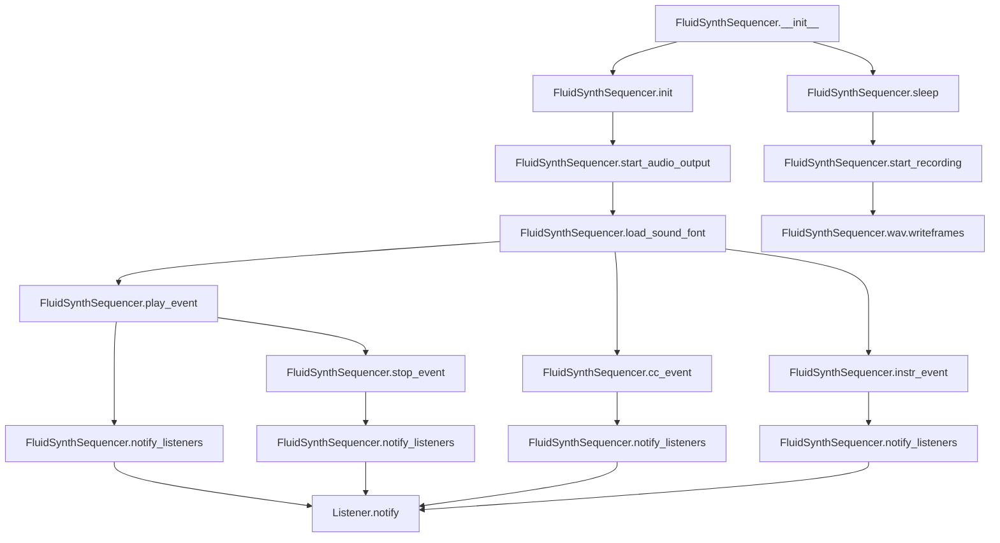
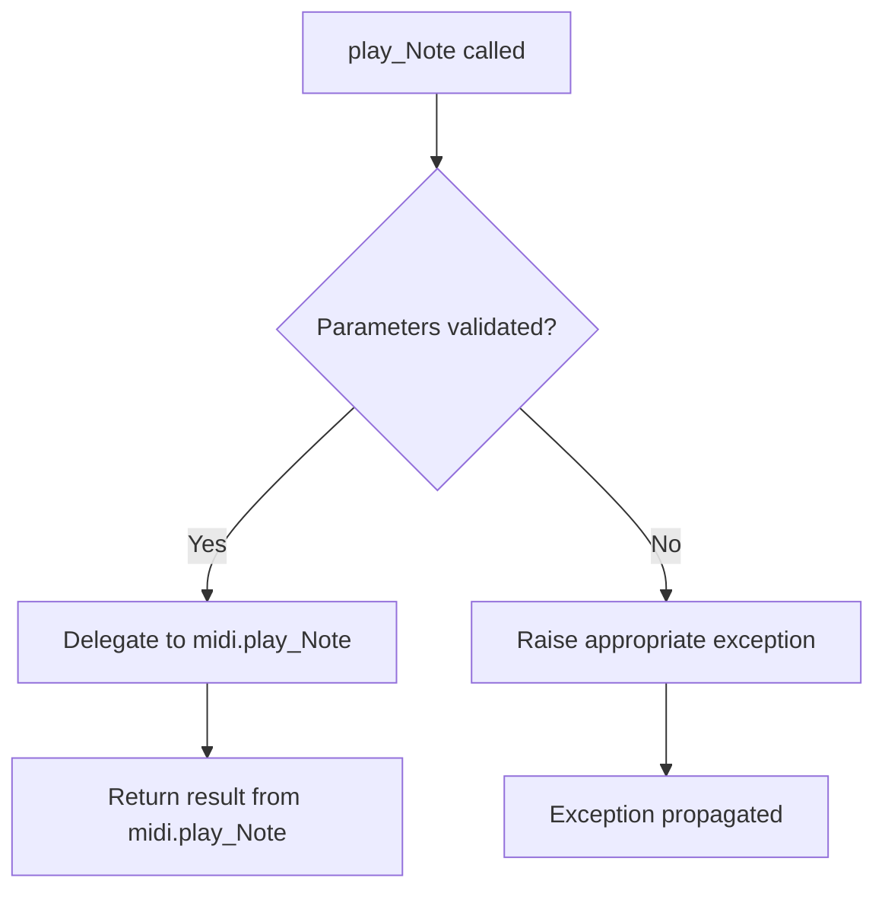
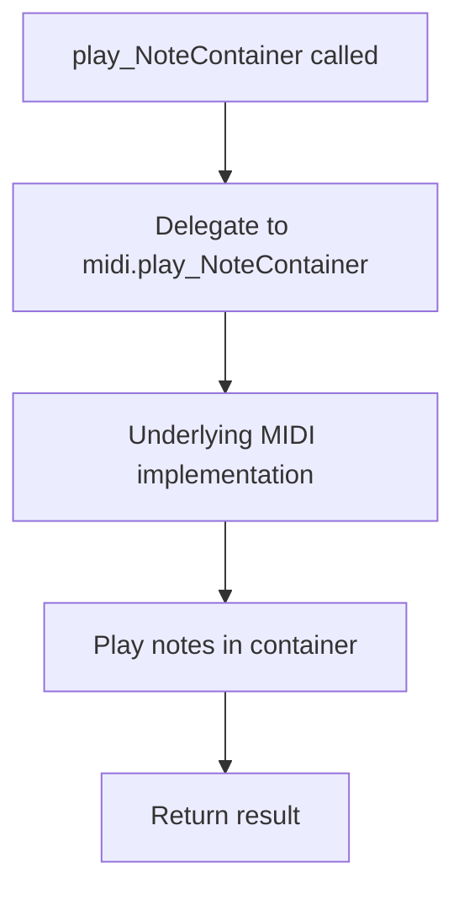
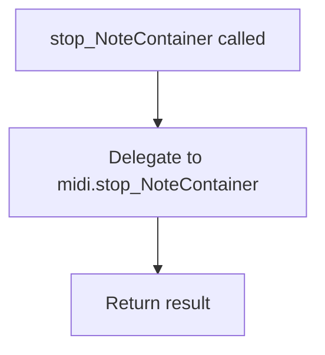
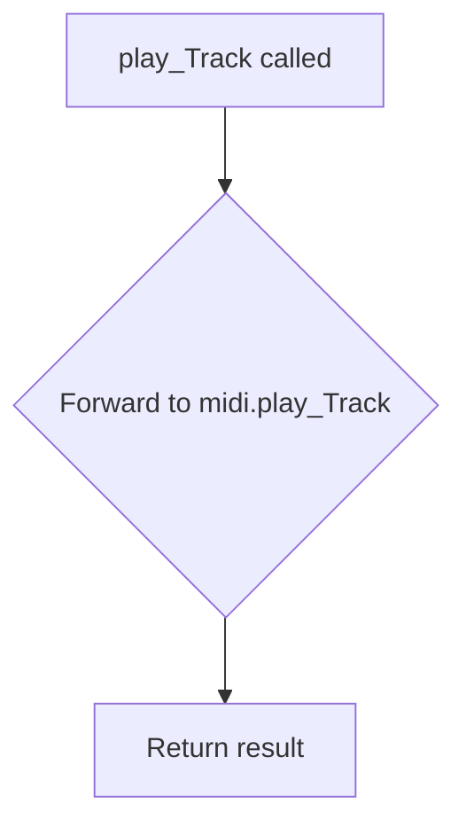
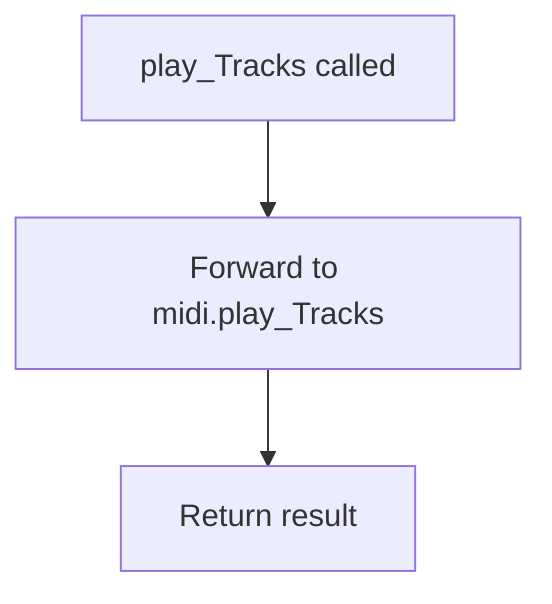
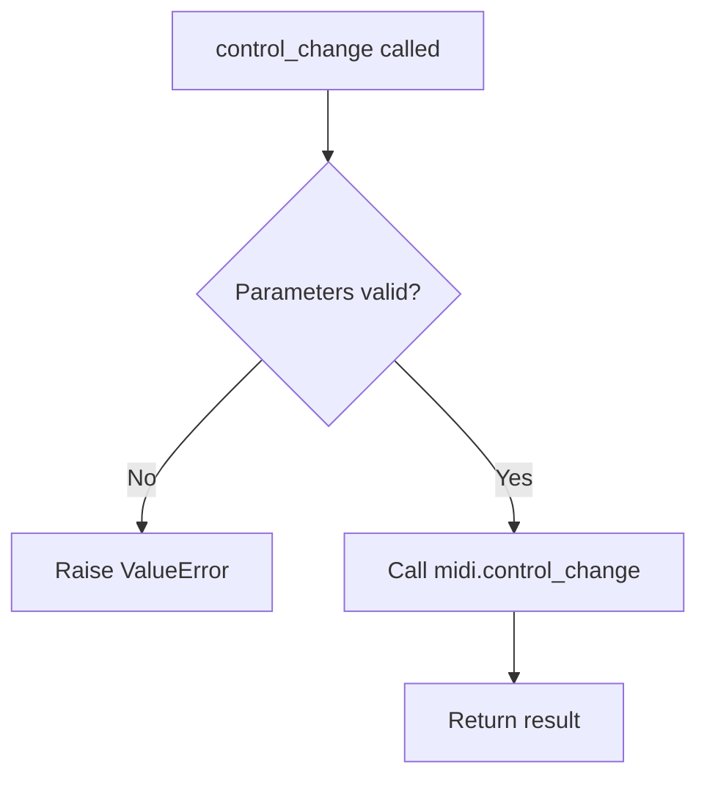

# `fluidsynth.py`

## `mingus.midi.fluidsynth.FluidSynthSequencer` · *class*

## Summary:
A MIDI sequencer implementation that uses FluidSynth for audio synthesis and playback.

## Description:
The FluidSynthSequencer class provides a concrete implementation of the MIDI sequencer interface using the FluidSynth library for audio synthesis. It enables playback of musical sequences through FluidSynth's software synthesizer, supporting note events, control changes, instrument selection, and audio recording capabilities.

This class serves as a bridge between the abstract MIDI sequencing interface defined by the Sequencer base class and the concrete FluidSynth audio synthesis engine. It handles the low-level FluidSynth operations required for musical playback while maintaining compatibility with the higher-level sequencing abstractions.

## State:
- fs (fs.Synth): FluidSynth synthesizer instance created during initialization
- sfid (int): Sound font ID loaded via load_sound_font() method
- wav (wave.Wave_write): Wave file object used for audio recording when started via start_recording()
- output (None): Class attribute inherited from Sequencer base class, initially None

## Lifecycle:
- Creation: Instantiate using FluidSynthSequencer() constructor, which calls init() to create the FluidSynth instance
- Usage: Call methods in sequence - initialize with init(), load sound font with load_sound_font(), start audio output with start_audio_output(), then play musical events
- Destruction: Automatically cleans up FluidSynth resources via __del__ method when the object is garbage collected

## Method Map:


## Raises:
- __del__: May raise AttributeError if fs attribute doesn't exist during deletion
- load_sound_font: Returns False if sound font loading fails (sfid == -1)
- start_audio_output: May raise RuntimeError if audio driver initialization fails

## Example:
```python
# Create and initialize the sequencer
sequencer = FluidSynthSequencer()

# Initialize FluidSynth
sequencer.init()

# Load a sound font
success = sequencer.load_sound_font("/path/to/soundfont.sf2")
if not success:
    raise Exception("Failed to load sound font")

# Start audio output
sequencer.start_audio_output()

# Start recording audio (optional)
sequencer.start_recording("output.wav")

# Play a note
sequencer.play_event(note=60, channel=0, velocity=100)

# Stop the note
sequencer.stop_event(note=60, channel=0)

# Change control value
sequencer.cc_event(channel=0, control=7, value=127)

# Change instrument
sequencer.instr_event(channel=0, instr=0, bank=0)

# Sleep for 1 second with audio capture
sequencer.sleep(1.0)

# Cleanup happens automatically when object is deleted
```

### `mingus.midi.fluidsynth.FluidSynthSequencer.init` · *method*

## Summary:
Initializes the FluidSynth synthesizer instance for MIDI audio synthesis.

## Description:
This method creates and assigns a new FluidSynth synthesizer instance to the object's `fs` attribute. It is automatically invoked during object initialization as part of the Sequencer base class lifecycle, specifically called by `Sequencer.__init__()`. This method establishes the underlying FluidSynth engine that handles MIDI-to-audio conversion, making subsequent MIDI operations possible.

The method serves as a dedicated initialization point for the FluidSynth backend, ensuring proper setup before any MIDI events can be processed or audio can be generated.

## Args:
    None

## Returns:
    None

## Raises:
    None

## State Changes:
    Attributes READ: None
    Attributes WRITTEN: self.fs (assigns new FluidSynth synthesizer instance)

## Constraints:
    Preconditions: None
    Postconditions: The `self.fs` attribute contains a valid FluidSynth synthesizer instance ready for MIDI operations

## Side Effects:
    None

### `mingus.midi.fluidsynth.FluidSynthSequencer.__del__` · *method*

## Summary:
Cleans up fluidsynth resources when the sequencer object is destroyed.

## Description:
This destructor method ensures proper cleanup of fluidsynth audio synthesis resources by calling the delete method on the underlying Synth instance. It is automatically invoked when the object is about to be garbage collected, releasing memory and system resources associated with the fluidsynth engine.

## Args:
    None

## Returns:
    None

## Raises:
    None explicitly raised

## State Changes:
    Attributes READ: self.fs
    Attributes WRITTEN: None

## Constraints:
    Preconditions: The object must have been initialized (self.fs must exist)
    Postconditions: All fluidsynth resources associated with this instance are released

## Side Effects:
    I/O operations: Calls native fluidsynth C library functions to release audio drivers, synth instances, and settings
    Resource cleanup: Frees memory allocated for audio processing and MIDI synthesis

### `mingus.midi.fluidsynth.FluidSynthSequencer.start_audio_output` · *method*

## Summary:
Starts the audio output for the FluidSynth sequencer by initializing the audio driver.

## Description:
This method initializes the audio output system for the FluidSynth sequencer by creating an audio driver. It serves as a wrapper around the underlying fluidsynth library's start method, allowing the sequencer to produce audible sound output. The method should be called after the sequencer has been initialized and sound fonts have been loaded.

## Args:
    driver (str, optional): Audio driver to use for output. Must be one of 'alsa', 'oss', 'jack', 'portaudio', 'sndmgr', 'coreaudio', 'Direct Sound', 'dsound', or 'pulseaudio'. If None, uses the default audio driver.

## Returns:
    None: This method does not return a value.

## Raises:
    AssertionError: If the specified driver is not in the list of supported audio drivers.

## State Changes:
    Attributes READ: self.fs
    Attributes WRITTEN: self.fs.audio_driver

## Constraints:
    Preconditions: 
    - The FluidSynthSequencer must be initialized (fs attribute must exist)
    - The fs attribute must be a valid pyfluidsynth.Synth instance
    - The driver parameter, if provided, must be one of the supported audio drivers
    
    Postconditions:
    - The audio driver is initialized and ready for audio output
    - The self.fs.audio_driver attribute is set to the newly created audio driver

## Side Effects:
    - Creates an audio driver instance using the fluidsynth library
    - May initiate audio hardware access depending on the selected driver
    - Can potentially block or consume system resources while initializing audio driver

### `mingus.midi.fluidsynth.FluidSynthSequencer.start_recording` · *method*

## Summary:
Initializes a WAV file for audio recording with standard CD-quality audio settings.

## Description:
Sets up a stereo WAV file with 16-bit samples at 44.1 kHz sampling rate for capturing audio output from the FluidSynth synthesizer. This method prepares the recording environment by opening a wave file in write-binary mode and configuring it with professional audio standards. The method is typically called before starting playback operations that should be recorded.

The method is separated from other initialization logic to provide a clean interface for audio recording setup, allowing users to specify a custom output filename while maintaining consistent audio quality parameters.

## Args:
    file (str): Path to the output WAV file. Defaults to "mingus_dump.wav".

## Returns:
    None: This method does not return a value.

## Raises:
    None explicitly raised

## State Changes:
    Attributes READ: None
    Attributes WRITTEN: self.wav (assigned the opened wave file object)

## Constraints:
    Preconditions:
    - The FluidSynthSequencer instance must be initialized
    - The specified file path must be writable
    - The file extension should be ".wav" for proper format handling
    
    Postconditions:
    - A wave file object is assigned to self.wav
    - The wave file is configured with 2 channels, 2-byte samples, and 44100 Hz sampling rate
    - The wave file is opened in write-binary mode

## Side Effects:
    - File I/O operation: Opens a file for writing
    - Memory allocation: Creates a wave file object in memory

### `mingus.midi.fluidsynth.FluidSynthSequencer.load_sound_font` · *method*

## Summary:
Loads a SoundFont file into the FluidSynth synthesizer and stores its identifier for later use in instrument selection.

## Description:
This method initializes a SoundFont file within the FluidSynth synthesizer instance, making its instruments available for MIDI playback. It serves as a critical setup step in the MIDI audio pipeline, enabling subsequent instrument selection and playback operations. The method is typically called once during initialization or when switching sound fonts during runtime.

The method encapsulates the FluidSynth sound font loading operation and provides a clean interface for error handling, returning a boolean status indicating whether the operation was successful.

## Args:
    sf2 (str): Path to the SoundFont (.sf2) file to be loaded into the synthesizer

## Returns:
    bool: True if the sound font was successfully loaded (sfid != -1), False otherwise

## Raises:
    AttributeError: If self.fs is not properly initialized or does not have an sfload method
    FileNotFoundError: If the specified sound font file path is invalid or inaccessible

## State Changes:
    Attributes READ: self.fs
    Attributes WRITTEN: self.sfid (stores the sound font identifier returned by FluidSynth)

## Constraints:
    Preconditions:
    - The FluidSynth synthesizer instance (`self.fs`) must be initialized
    - The specified file path must point to a valid SoundFont (.sf2) file
    - The file must be readable by the application process
    
    Postconditions:
    - If successful, `self.sfid` contains a valid sound font identifier for use in `instr_event()`
    - If failed, `self.sfid` is set to -1 (indicating no valid sound font is loaded)

## Side Effects:
    - Invokes the FluidSynth library's sfload function to load the sound font file
    - May cause temporary performance overhead during file I/O and memory allocation
    - May increase memory usage proportional to the size of the loaded sound font

### `mingus.midi.fluidsynth.FluidSynthSequencer.play_event` · *method*

## Summary:
Plays a musical note using the FluidSynth synthesizer by sending a note-on message.

## Description:
This method implements the abstract play_event method from the Sequencer base class, sending a note-on event to the FluidSynth synthesizer instance to trigger audio playback of the specified musical note. It is part of the FluidSynthSequencer implementation of the abstract Sequencer interface.

## Args:
    note (int): The MIDI note number to play (typically 0-127)
    channel (int): The MIDI channel number (typically 0-15)  
    velocity (int): The velocity/force of the note (typically 0-127)

## Returns:
    None: This method does not return any value

## Raises:
    AttributeError: If self.fs has not been initialized (i.e., if the synthesizer hasn't been started)

## State Changes:
    Attributes READ: self.fs
    Attributes WRITTEN: None

## Constraints:
    Preconditions: 
    - self.fs must be initialized (the FluidSynth synthesizer must be created via init())
    - note must be a valid MIDI note number (typically 0-127)
    - channel must be a valid MIDI channel (typically 0-15)
    - velocity must be a valid velocity value (typically 0-127)

    Postconditions:
    - The FluidSynth synthesizer will receive a note-on command
    - No changes are made to the FluidSynthSequencer object's state

## Side Effects:
    - Calls the underlying FluidSynth API (fs.noteon)
    - May produce audible sound through the system's audio output
    - May cause I/O operations if audio is being recorded to a WAV file

### `mingus.midi.fluidsynth.FluidSynthSequencer.stop_event` · *method*

## Summary:
Stops a MIDI note event by sending a note-off message to the FluidSynth synthesizer.

## Description:
This method sends a note-off command to the FluidSynth synthesizer for a specific note and channel. It is part of the sequencer's event handling system, allowing for precise control over MIDI note playback termination. The method delegates to the underlying FluidSynth library's noteoff functionality.

## Args:
    note (int): The MIDI note number to stop (typically 0-127)
    channel (int): The MIDI channel number (typically 0-15)

## Returns:
    bool: True if the note-off command was successfully sent, False if validation failed due to invalid parameters

## Raises:
    None explicitly raised, though underlying FluidSynth operations may raise exceptions not caught here

## State Changes:
    Attributes READ: self.fs
    Attributes WRITTEN: None

## Constraints:
    Preconditions: 
    - Note must be between 0 and 127 (inclusive)
    - Channel must be non-negative
    - FluidSynth synthesizer must be initialized
    
    Postconditions:
    - The specified note on the specified channel will cease playing
    - No change to the FluidSynthSequencer object's state beyond the note-off command

## Side Effects:
    - Calls the underlying FluidSynth library's noteoff function
    - May produce audible sound changes in the audio output if the note was currently playing

### `mingus.midi.fluidsynth.FluidSynthSequencer.cc_event` · *method*

## Summary:
Sends a MIDI control change message to the fluidsynth synthesizer for a specific channel and control number.

## Description:
This method acts as a bridge between the MIDI sequencer interface and the fluidsynth library's control change functionality. It forwards control change messages to the underlying fluidsynth instance, enabling real-time modification of MIDI instrument parameters such as volume, pan, or modulation.

## Args:
    channel (int): The MIDI channel number (0-15) to send the control change to
    control (int): The control change number (0-127) specifying which parameter to modify
    value (int): The control change value (0-127) representing the new parameter setting

## Returns:
    None: This method does not return a value.

## Raises:
    AttributeError: If self.fs does not have a cc method or if self.fs is not properly initialized.

## State Changes:
    Attributes READ: self.fs
    Attributes WRITTEN: None

## Constraints:
    Preconditions: 
    - self.fs must be initialized and have a cc method
    - channel must be in the range [0, 15] (standard MIDI channel range)
    - control must be in the range [0, 127] (standard MIDI control number range)
    - value must be in the range [0, 127] (standard MIDI control value range)
    
    Postconditions: 
    - The control change message is transmitted to the fluidsynth synthesizer
    - No modifications occur to the FluidSynthSequencer object's state

## Side Effects:
    - Invokes the fluidsynth library's cc method to send MIDI control change message
    - May affect audio output if the synthesizer is currently playing notes
    - May cause performance overhead due to external library call

### `mingus.midi.fluidsynth.FluidSynthSequencer.instr_event` · *method*

## Summary:
Sets a musical instrument program on a specified MIDI channel using the FluidSynth synthesizer.

## Description:
Configures a specific instrument program on the given MIDI channel by selecting it from the loaded sound font. This method serves as a bridge to the underlying FluidSynth API's program_select functionality, allowing the sequencer to assign instruments to MIDI channels for playback.

## Args:
    channel (int): The MIDI channel number (typically 0-15) to assign the instrument to.
    instr (int): The instrument program number to select from the sound font.
    bank (int): The bank number to use when selecting the instrument program.

## Returns:
    None: This method does not return any value.

## Raises:
    None: This method does not explicitly raise exceptions, though underlying FluidSynth operations may raise errors.

## State Changes:
    Attributes READ: self.fs, self.sfid
    Attributes WRITTEN: None

## Constraints:
    Preconditions: 
    - The FluidSynth synthesizer (`self.fs`) must be initialized
    - A sound font must be loaded (i.e., `self.sfid` must be valid)
    - Channel, instrument, and bank values must be within valid ranges for FluidSynth
    
    Postconditions:
    - The specified MIDI channel will be configured to use the selected instrument program
    - The configuration persists until changed by another instrument selection

## Side Effects:
    - Calls the FluidSynth API's program_select method
    - May cause audio synthesis changes when the channel is subsequently used for playback

### `mingus.midi.fluidsynth.FluidSynthSequencer.sleep` · *method*

## Summary:
Pauses execution for the specified duration while capturing audio samples when recording is active.

## Description:
Overrides the base Sequencer.sleep() method to provide proper audio handling during playback. When audio recording is active (indicated by the presence of a wav attribute), this method captures audio samples from the synthesizer and writes them to the WAV file instead of simply sleeping. When not recording, it behaves like standard time.sleep().

This method is called during playback operations such as play_Bar, play_Bars, play_Track, and play_Tracks to manage timing between musical events while ensuring audio recording accuracy.

## Args:
    seconds (float): Number of seconds to pause execution

## Returns:
    None: This method does not return a value

## Raises:
    None explicitly raised

## State Changes:
    Attributes READ: self.wav, self.fs
    Attributes WRITTEN: self.wav (via writeframes method)

## Constraints:
    Preconditions: 
    - If recording is active, self.wav must be a valid wave file object with writeframes method
    - If recording is active, self.fs must be a valid fluidsynth synthesizer instance
    - seconds must be a positive number
    
    Postconditions:
    - Execution pauses for the specified duration
    - If recording, audio samples are written to the WAV file
    - If not recording, standard sleep behavior occurs

## Side Effects:
    - I/O operation: Writes audio frames to WAV file when recording
    - External service call: Calls fluidsynth's get_samples and raw_audio_string functions
    - Standard time.sleep() when not recording

## `mingus.midi.fluidsynth.init` · *function*

## Summary:
Initializes a FluidSynth-based MIDI system for audio output or recording with a specified sound font.

## Description:
Configures the global MIDI synthesizer instance for either audio output or file recording, loads a sound font, and prepares the system for MIDI operations. This function ensures the MIDI system is properly initialized only once, making it safe to call multiple times without side effects.

## Args:
    sf2 (str): Path to the SoundFont2 (.sf2) file to load for MIDI synthesis
    driver (str, optional): Audio driver to use for output (e.g., 'alsa', 'pulseaudio'). Defaults to None, which uses the default driver
    file (str, optional): Path to a WAV file for recording MIDI output. If provided, recording mode is enabled instead of audio output. Defaults to None

## Returns:
    bool: True if initialization succeeds, False if the sound font fails to load

## Raises:
    None explicitly raised by this function

## Constraints:
    Preconditions:
    - The `sf2` parameter must be a valid path to a SoundFont2 file
    - Either `file` or `driver` must be specified (or both can be None for default behavior)
    
    Postconditions:
    - Global `midi` object is initialized with audio output or recording capability
    - Global `initialized` flag is set to True after successful initialization
    - Sound font is loaded and program reset is performed

## Side Effects:
    - Creates or opens audio output device via the underlying FluidSynth library
    - May create or overwrite a WAV file if recording mode is enabled
    - Sets global state variables `midi` and `initialized`
    - Calls methods on the global `midi` object that may interact with system audio drivers

## Control Flow:
```mermaid
flowchart TD
    A[init called] --> B{initialized?}
    B -- No --> C{file provided?}
    C -- Yes --> D[midi.start_recording(file)]
    C -- No --> E[midi.start_audio_output(driver)]
    D --> F[midi.load_sound_font(sf2)]
    E --> F
    F --> G{load_sound_font success?}
    G -- No --> H[return False]
    G -- Yes --> I[midi.fs.program_reset()]
    I --> J[initialized = True]
    J --> K[return True]
    B -- Yes --> L[return True]
```

## Examples:
```python
# Initialize with default audio output and default sound font
success = init("/usr/share/sounds/sf2/FluidR3_GM.sf2")

# Initialize with specific audio driver
success = init("/path/to/soundfont.sf2", driver="pulseaudio")

# Initialize for recording MIDI output to WAV file
success = init("/path/to/soundfont.sf2", file="/tmp/midi_output.wav")
```

## `mingus.midi.fluidsynth.play_Note` · *function*

## Summary:
Plays a single MIDI note using the fluidsynth audio synthesis system with configurable channel and velocity parameters.

## Description:
This function provides a simplified interface for playing individual MIDI notes through the fluidsynth audio backend. It serves as a thin wrapper that delegates note playback operations to the underlying MIDI implementation, specifically designed for use within the fluidsynth module ecosystem.

## Args:
    note (any): The MIDI note to be played. Accepts note names (e.g., 'C-4') or MIDI note numbers, depending on the underlying implementation.
    channel (int): The MIDI channel number on which to play the note. Defaults to 1. Valid range is typically 1-16 for standard MIDI channels.
    velocity (int): The velocity (loudness) of the note playback. Defaults to 100, representing maximum velocity. Valid range is typically 0-127.

## Returns:
    Returns the result from the underlying `midi.play_Note` implementation. The exact return type and meaning depend on the specific implementation being delegated to, but typically returns None or a status indicator.

## Raises:
    Any exceptions that may be raised by the underlying `midi.play_Note` implementation, including but not limited to:
    - ValueError: If the note parameter is invalid or unsupported
    - RuntimeError: If fluidsynth fails to initialize or play the note
    - TypeError: If the note parameter is of an incompatible type

## Constraints:
    Preconditions:
    - The fluidsynth audio system must be properly initialized and configured
    - The note parameter must be compatible with the underlying MIDI implementation
    - Channel must be within the valid MIDI channel range (typically 1-16)
    - Velocity must be within the valid MIDI velocity range (0-127)

    Postconditions:
    - The note will be played through the fluidsynth audio system
    - No state changes occur in the calling application beyond audio playback

## Side Effects:
    - Audio output through the system's default audio device
    - Potential initialization of fluidsynth audio subsystem if not already running
    - Possible blocking behavior while audio is being processed

## Control Flow:


## Examples:
    # Play middle C on channel 1 with default velocity
    play_Note('C-4')
    
    # Play a note on a specific channel with custom velocity
    play_Note('E-5', channel=2, velocity=80)
    
    # Play a note with minimal velocity
    play_Note('A-3', velocity=30)

## `mingus.midi.fluidsynth.stop_Note` · *function*

## Summary:
Stops a musical note on a specified MIDI channel by delegating to the underlying MIDI implementation.

## Description:
This function provides a standardized interface for stopping musical notes in the fluidsynth MIDI system. It acts as a thin wrapper that forwards note stopping requests to the underlying MIDI implementation (`midi.stop_Note`). This abstraction layer ensures consistent behavior across different MIDI backends while maintaining simplicity for users.

## Args:
    note (int or str): The musical note to stop. Can be a numeric MIDI note value (0-127) or note name string (e.g., 'C4', 'A#5').
    channel (int): The MIDI channel number on which to stop the note. Defaults to 1. Valid range is typically 1-16.

## Returns:
    Returns the result from the underlying `midi.stop_Note` function call. The exact return type depends on the MIDI implementation.

## Raises:
    Exceptions raised by the underlying MIDI implementation when:
    - Invalid note or channel parameters are provided
    - The MIDI system is not properly initialized
    - Communication errors occur with the MIDI synthesizer

## Constraints:
    Preconditions:
    - The fluidsynth MIDI system must be initialized before calling this function
    - The note parameter must represent a valid musical note
    - The channel parameter must be within the valid MIDI channel range
    
    Postconditions:
    - The specified note is stopped on the given channel
    - No errors occur if parameters are valid

## Side Effects:
    - Communicates with the fluidsynth MIDI synthesizer engine
    - May modify internal MIDI state
    - May cause audio output to cease for the specified note/channel

## Control Flow:
```mermaid
flowchart TD
    A[stop_Note called] --> B[Validate parameters]
    B --> C{Parameters valid?}
    C -- No --> D[Raise exception]
    C -- Yes --> E[Call midi.stop_Note(note, channel)]
    E --> F[Return result]
```

## Examples:
    # Stop middle C (MIDI note 60) on default channel 1
    stop_Note(60)
    
    # Stop A#5 on channel 2
    stop_Note('A#5', channel=2)
    
    # Stop note with error handling
    try:
        result = stop_Note(72, channel=1)
        print("Note stopped successfully")
    except Exception as e:
        print(f"Failed to stop note: {e}")

## `mingus.midi.fluidsynth.play_NoteContainer` · *function*

## Summary:
Delegates the playback of a NoteContainer to the underlying MIDI system implementation.

## Description:
This function acts as a simple wrapper that forwards NoteContainer playback requests to the underlying MIDI implementation. It takes a NoteContainer object along with optional channel and velocity parameters and delegates the actual playback operation to `midi.play_NoteContainer`.

The function serves as an interface between the fluidsynth module and the underlying MIDI system, providing a consistent way to play note collections through the fluidsynth backend.

## Args:
    nc (NoteContainer or None): The container holding the notes to be played, or None to return immediately
    channel (int): MIDI channel number to use for playback (defaults to 1)
    velocity (int): MIDI velocity value for playback (defaults to 100)

## Returns:
    Returns the result of the underlying `midi.play_NoteContainer` call, which is typically a boolean indicating success/failure.

## Raises:
    Propagates any exceptions raised by the underlying `midi.play_NoteContainer` implementation.

## Constraints:
    Preconditions:
    - The `midi` module must be properly imported and initialized
    - nc should be a valid NoteContainer or None
    - channel should be a valid MIDI channel number
    - velocity should be a valid MIDI velocity value
    
    Postconditions:
    - Delegates to the underlying MIDI system for actual note playback
    - Returns the result from the underlying implementation

## Side Effects:
    - Invokes the underlying MIDI system to play notes through fluidsynth
    - May cause MIDI output generation through fluidsynth
    - Potential external state changes through MIDI device interactions

## Control Flow:


## `mingus.midi.fluidsynth.stop_NoteContainer` · *function*

## Summary:
Stops MIDI note playback for a NoteContainer on a specified channel.

## Description:
This function provides a standardized interface for halting MIDI note playback associated with a NoteContainer. It acts as a bridge to the underlying MIDI system's stop functionality, typically used during MIDI playback termination or when releasing active notes. The function delegates to an internal midi.stop_NoteContainer implementation.

## Args:
    nc (NoteContainer): The NoteContainer object containing notes to be stopped.
    channel (int): The MIDI channel number to stop notes on. Defaults to 1.

## Returns:
    The return value is determined by the underlying midi.stop_NoteContainer implementation, which typically indicates success or failure status of the stopping operation.

## Raises:
    Exceptions may be raised by the underlying midi.stop_NoteContainer function, though specific exception types cannot be determined from the available source code.

## Constraints:
    Preconditions:
    - The nc parameter must be a valid NoteContainer object
    - The channel parameter must be a valid MIDI channel identifier
    
    Postconditions:
    - The operation delegates to midi.stop_NoteContainer with the provided arguments

## Side Effects:
    - Interacts with the underlying MIDI system through the midi module
    - May affect MIDI playback state in the connected synthesizer

## Control Flow:


## Examples:
    # Stop a NoteContainer on default channel (1)
    result = stop_NoteContainer(note_container)
    
    # Stop a NoteContainer on specific channel
    result = stop_NoteContainer(note_container, channel=2)

## `mingus.midi.fluidsynth.play_Bar` · *function*

## Summary:
Plays a musical bar using the fluidsynth MIDI system with configurable channel and tempo settings.

## Description:
This function provides a simplified interface for playing musical bars through the fluidsynth MIDI playback system. It acts as a thin wrapper that forwards the bar, channel, and BPM parameters to the underlying MIDI implementation. The function serves as a convenient entry point for MIDI playback of musical bars in applications using the mingus library with fluidsynth backend.

## Args:
    bar: A musical bar structure containing note containers to be played
    channel (int): MIDI channel number to play the notes on, defaults to 1
    bpm (int): Beats per minute for playback timing, defaults to 120

## Returns:
    Returns whatever value is returned by the underlying `midi.play_Bar` implementation. The exact return type and meaning depend on the specific MIDI backend being used.

## Raises:
    Exceptions are propagated from the underlying `midi.play_Bar` implementation, which may include MIDI-related errors or parameter validation failures depending on the specific backend.

## Constraints:
    Preconditions:
    - The bar parameter must be a valid musical bar structure compatible with the MIDI system
    - Channel must be a valid MIDI channel number (typically 1-16)
    - BPM must be a positive integer representing tempo in beats per minute

    Postconditions:
    - The musical bar is played through the fluidsynth MIDI system
    - Playback occurs on the specified channel at the specified tempo

## Side Effects:
    - Initiates MIDI playback through fluidsynth
    - May cause audio output through the system's audio subsystem
    - Communicates with the MIDI synthesizer to play notes

## Control Flow:
```mermaid
flowchart TD
    A[play_Bar called] --> B{Parameters validated}
    B -->|Valid| C[Call midi.play_Bar(bar, channel, bpm)]
    C --> D[Return result from midi.play_Bar]
    B -->|Invalid| E[Propagate exception]
```

## Examples:
```python
# Play a bar on default channel 1 at 120 BPM
play_Bar(my_bar)

# Play a bar on channel 2 at 100 BPM
play_Bar(my_bar, channel=2, bpm=100)
```

## `mingus.midi.fluidsynth.play_Bars` · *function*

## Summary:
Plays musical bars using FluidSynth audio synthesis with configurable tempo and channel settings.

## Description:
This function provides a FluidSynth-based interface for playing musical bar structures. It serves as a convenience wrapper that delegates the actual MIDI playback implementation to the core `midi.play_Bars` function, enabling audio playback of musical compositions through FluidSynth synthesis.

## Args:
    bars: Musical bar structures containing musical data to be played
    channels: Audio channel configuration specifying how to route audio signals
    bpm (int, optional): Tempo in beats per minute. Defaults to 120.

## Returns:
    The return value is determined by the underlying `midi.play_Bars` implementation, typically indicating successful playback initiation or execution status.

## Raises:
    Exception: May propagate exceptions from the underlying `midi.play_Bars` implementation, though specific exception types are not defined in this wrapper.

## Constraints:
    Preconditions:
    - The `bars` parameter must contain valid musical bar structures compatible with the MIDI system
    - The `channels` parameter must specify valid audio channel configurations
    - The `bpm` parameter should be a positive integer representing tempo
    
    Postconditions:
    - Audio playback will be initiated through FluidSynth synthesis
    - The playback will occur at the specified tempo setting

## Side Effects:
    - Initiates audio playback through FluidSynth audio synthesis
    - May involve system resource allocation for audio processing
    - Could affect global audio system state

## Control Flow:
```mermaid
flowchart TD
    A[play_Bars called] --> B{Validate parameters}
    B --> C[midi.play_Bars(bars, channels, bpm)]
    C --> D[Return result]
```

## Examples:
    # Play musical bars with default tempo
    play_Bars(music_bars, audio_channels)
    
    # Play musical bars at custom tempo
    play_Bars(music_bars, audio_channels, bpm=140)
``

## `mingus.midi.fluidsynth.play_Track` · *function*

## Summary:
Delegates track playback to the underlying MIDI system with specified channel and tempo settings.

## Description:
A thin wrapper function that forwards track playback requests to the core MIDI playback implementation. This function serves as an interface layer for FluidSynth-based track playback, providing a consistent method signature for initiating musical track playback with configurable MIDI channel and tempo parameters.

This function exists to provide a standardized entry point for track-level playback within the FluidSynth subsystem, maintaining compatibility with the broader MIDI framework while abstracting away the specific implementation details of the underlying playback mechanism.

## Args:
    track: The musical track to be played, typically containing sequential musical bars or notes
    channel (int): MIDI channel number to use for playback, defaults to 1
    bpm (int): Beats per minute tempo setting for playback, defaults to 120

## Returns:
    The return value is returned directly from the underlying `midi.play_Track` implementation

## Raises:
    Exceptions that may be raised by the underlying `midi.play_Track` implementation

## Constraints:
    Preconditions:
    - The track parameter must be compatible with the underlying MIDI playback system
    - Channel must be a valid MIDI channel identifier
    - BPM must be a positive integer representing tempo in beats per minute
    
    Postconditions:
    - Track playback is initiated with specified channel and tempo settings
    - Function returns control to caller once delegation is complete

## Side Effects:
    - Invokes the underlying MIDI playback system
    - May involve system resource allocation for audio processing
    - Could potentially modify global audio state through the underlying MIDI system

## Control Flow:


## Examples:
```python
# Play a track on default channel with default tempo
play_Track(my_track)

# Play a track on channel 2 with 140 BPM
play_Track(my_track, channel=2, bpm=140)
```

## `mingus.midi.fluidsynth.play_Tracks` · *function*

## Summary:
Delegates MIDI track playback to the core MIDI system with FluidSynth audio synthesis.

## Description:
This function acts as a thin wrapper that forwards MIDI track playback requests to the underlying MIDI system. It accepts MIDI tracks, channel configurations, and tempo settings, then delegates the actual playback operation to `midi.play_Tracks`. This abstraction allows for consistent MIDI playback interface while maintaining flexibility in the underlying implementation.

## Args:
    tracks (list): Collection of MIDI track objects to be played
    channels (list): Channel configuration specifying how tracks should be mapped to audio channels
    bpm (int, optional): Tempo setting in beats per minute. Defaults to 120.

## Returns:
    Returns the result of calling `midi.play_Tracks(tracks, channels, bpm)`.

## Raises:
    Any exceptions that may be raised by the underlying `midi.play_Tracks` implementation.

## Constraints:
    Preconditions:
    - Tracks must be valid MIDI track objects
    - Channels must be properly configured for the audio system
    - BPM value should be within reasonable musical tempo ranges
    
    Postconditions:
    - The underlying MIDI playback system is invoked with the provided parameters

## Side Effects:
    - May initiate audio playback through the underlying audio system
    - Interacts with system resources required for MIDI playback

## Control Flow:


## Examples:
```python
# Basic usage with default tempo
tracks = [track1, track2, track3]
channels = [0, 1, 2]
result = play_Tracks(tracks, channels)

# Usage with custom tempo
tracks = [track1, track2]
channels = [0, 1]
result = play_Tracks(tracks, channels, bpm=140)
```

## `mingus.midi.fluidsynth.control_change` · *function*

## Summary:
Sends a MIDI control change message to a specific channel with the specified control number and value.

## Description:
This function provides an interface for sending MIDI control change messages to a FluidSynth synthesizer instance. Control change messages are used to modify various aspects of sound synthesis such as volume, pan, modulation, and other controller parameters. The function acts as a thin wrapper around the underlying MIDI control change implementation, providing a clean interface for MIDI controller manipulation within the mingus framework.

## Args:
    channel (int): The MIDI channel number (0-15) to send the control change on.
    control (int): The control number (0-127) specifying which controller parameter to modify.
    value (int): The control value (0-127) to set for the specified control.

## Returns:
    The return value is forwarded from the underlying midi.control_change implementation, which typically indicates the success status or processed MIDI message.

## Raises:
    This function may raise exceptions depending on the underlying implementation, including:
    - ValueError: If channel, control, or value are outside their valid ranges (0-15, 0-127, 0-127 respectively)
    - RuntimeError: If the MIDI synthesizer is not properly initialized or available for communication

## Constraints:
    Preconditions:
    - Channel must be in the range [0, 15]
    - Control must be in the range [0, 127]  
    - Value must be in the range [0, 127]
    - The MIDI synthesizer must be initialized and available

    Postconditions:
    - The control change message is sent to the appropriate MIDI channel
    - The specified control parameter is updated to the given value

## Side Effects:
    - Communicates with the underlying FluidSynth synthesizer instance
    - May cause real-time audio synthesis changes
    - Involves system-level MIDI communication operations

## Control Flow:


## Examples:
```python
# Set volume to maximum on channel 0
control_change(0, 7, 127)

# Set pan to center on channel 1  
control_change(1, 10, 64)

# Set modulation wheel to half position on channel 2
control_change(2, 1, 64)
```

## `mingus.midi.fluidsynth.set_instrument` · *function*

## Summary:
Configures a MIDI instrument program for a specified channel using the FluidSynth MIDI backend.

## Description:
Sets the instrument program for a given MIDI channel by delegating to the underlying MIDI implementation. This function provides a standardized interface for instrument configuration within the FluidSynth MIDI system, allowing users to assign musical instruments to specific MIDI channels.

Known callers include:
- Playback methods in the FluidSynth sequencer system - when preparing instrument assignments before playing musical sequences
- Direct user code - when manually configuring instruments for specific MIDI channels

This logic is extracted into its own function to provide a clean abstraction layer between the high-level MIDI interface and the low-level FluidSynth implementation, enabling consistent instrument configuration across different playback contexts while maintaining separation of concerns.

## Args:
    channel (int): The MIDI channel number (typically 0-15) to assign the instrument to.
    midi_instr (int): The MIDI instrument program number to select (0-127).
    bank (int): The bank number to use when selecting the instrument program. Defaults to 0.

## Returns:
    The return value is returned directly from the underlying `midi.set_instrument` implementation, which typically indicates the success or failure of the instrument configuration operation.

## Raises:
    Exception: May raise exceptions from the underlying MIDI implementation if invalid parameters are provided or if the MIDI system encounters errors during instrument configuration.

## Constraints:
    Preconditions:
    - The FluidSynth MIDI system must be properly initialized
    - The channel, instrument, and bank values should be valid for the FluidSynth system
    - The underlying MIDI implementation must support the requested instrument configuration
    
    Postconditions:
    - The specified MIDI channel will be configured to use the selected instrument program
    - The instrument change will be applied to the FluidSynth MIDI output

## Side Effects:
    - Communicates with the FluidSynth MIDI backend to configure instrument settings
    - May trigger internal MIDI system updates or notifications

## Control Flow:
```mermaid
flowchart TD
    A[set_instrument called] --> B{Parameters valid?}
    B -->|No| C[Raise exception]
    B -->|Yes| D[Call midi.set_instrument(channel, midi_instr, bank)]
    D --> E[Return result]
```

## Examples:
```python
# Configure channel 0 to use piano (instrument 0)
set_instrument(0, 0)

# Configure channel 1 to use electric guitar (instrument 25) with bank 0
set_instrument(1, 25, 0)

# Configure channel 2 to use violin (instrument 41) with bank 1
set_instrument(2, 41, 1)
```

## `mingus.midi.fluidsynth.stop_everything` · *function*

## Summary:
Stops all currently playing MIDI events by delegating to the underlying MIDI system's stop functionality.

## Description:
This function serves as a simple wrapper that delegates MIDI stop operations to the underlying `midi` module's `stop_everything()` method. It provides a convenient way to terminate all active MIDI playback without needing to directly access the lower-level MIDI system.

The function is typically called during cleanup operations, application shutdown, or when resetting the MIDI playback state to ensure no residual audio or MIDI events continue running.

## Args:
    None

## Returns:
    The return value is directly returned from the underlying `midi.stop_everything()` implementation, which typically indicates the success status or state of the stop operation.

## Raises:
    Exception: May raise exceptions from the underlying MIDI system if stop operations fail or are not properly supported.

## Constraints:
    Preconditions:
    - The underlying `midi` module must be properly initialized
    - Active MIDI playback operations must exist to stop
    
    Postconditions:
    - All active MIDI events should be terminated
    - Playback state should be reset to idle

## Side Effects:
    - Stops all active MIDI playback
    - May close or reset MIDI output connections
    - Clears any pending MIDI events in the queue
    - Could potentially affect audio output if active

## Control Flow:
```mermaid
flowchart TD
    A[stop_everything called] --> B[Delegate to midi.stop_everything()]
    B --> C[Return result from underlying function]
```

## Examples:
```python
# Basic usage for cleanup
stop_everything()

# Usage during application shutdown
def shutdown_application():
    # Clean up MIDI resources
    stop_everything()
    # Continue with other shutdown procedures
```

## `mingus.midi.fluidsynth.modulation` · *function*

## Summary:
Delegates a modulation command to the underlying MIDI system for a specified channel.

## Description:
This function acts as a wrapper that forwards modulation commands to the MIDI subsystem. It provides a simplified interface for setting modulation values on MIDI channels without exposing the underlying implementation details.

## Args:
    channel (int): The MIDI channel number to apply modulation to.
    value (int): The modulation value to set.

## Returns:
    The return value of the underlying midi.modulation() function call.

## Raises:
    Exceptions may be raised by the underlying MIDI implementation depending on invalid inputs or system errors.

## Constraints:
    Preconditions:
    - The channel parameter should be a valid MIDI channel identifier
    - The value parameter should be a valid modulation value
    
    Postconditions:
    - The modulation command is forwarded to the MIDI system for the specified channel

## Side Effects:
    - Communicates with MIDI hardware or software synthesizer
    - May modify MIDI channel state in the underlying system

## Control Flow:
```mermaid
flowchart TD
    A[modulation(channel, value)] --> B[Call midi.modulation(channel, value)]
    B --> C[Return result]
```

## Examples:
    # Apply maximum modulation to channel 1
    modulation(0, 127)
    
    # Apply minimum modulation to channel 2
    modulation(1, 0)

## `mingus.midi.fluidsynth.pan` · *function*

## Summary:
Sets the pan position for a MIDI channel in the fluidsynth audio engine.

## Description:
This function configures the stereo panning position for a specified MIDI channel within the fluidsynth audio system. It acts as a bridge to the underlying MIDI pan functionality, enabling control over audio spatial positioning between left and right speakers.

## Args:
    channel (int): The MIDI channel number to configure for panning.
    value (float): The pan position value, typically controlling stereo positioning.

## Returns:
    The return value is determined by the underlying midi.pan() implementation.

## Raises:
    Exceptions may be raised by the underlying midi.pan() function depending on invalid inputs or system states.

## Constraints:
    Preconditions:
    - The MIDI synthesizer must be properly initialized
    - Channel and value parameters must be compatible with the underlying MIDI implementation
    
    Postconditions:
    - The specified channel's pan setting is updated according to the provided value

## Side Effects:
    - Modifies the audio synthesis state of the fluidsynth engine
    - May affect the stereo positioning of audio output for the specified channel

## Control Flow:
```mermaid
flowchart TD
    A[pan(channel, value)] --> B[Delegate to midi.pan(channel, value)]
    B --> C[Return result]
```

## Examples:
    # Set channel 0 to center position
    pan(0, 0.0)
    
    # Set channel 1 to full right
    pan(1, 1.0)
    
    # Set channel 2 to full left
    pan(2, -1.0)
```

## `mingus.midi.fluidsynth.main_volume` · *function*

## Summary:
Sets the main volume for a MIDI channel in the fluidsynth system.

## Description:
This function provides an interface for controlling the main volume level of a specific MIDI channel within the fluidsynth audio synthesis environment. It delegates the actual volume setting operation to the underlying MIDI implementation.

## Args:
    channel (int): The MIDI channel number (typically 0-15) to modify.
    value (int): The volume level to set (typically 0-127, where 0 is silent and 127 is maximum).

## Returns:
    The return value is determined by the underlying MIDI implementation, typically indicating success or the updated volume setting.

## Raises:
    Exceptions raised depend on the underlying `midi.main_volume` implementation.

## Constraints:
    Preconditions:
    - The fluidsynth MIDI system must be properly initialized
    - Channel parameter must be within valid MIDI channel range
    - Value parameter must be within valid volume range
    
    Postconditions:
    - The specified MIDI channel's volume is updated in the fluidsynth system

## Side Effects:
    - Modifies the volume state of the specified MIDI channel
    - May cause audible changes in real-time audio output if notes are currently playing

## Control Flow:
```mermaid
flowchart TD
    A[main_volume called] --> B{Parameters validated}
    B -->|Yes| C[Call midi.main_volume(channel, value)]
    C --> D[Return result]
    B -->|No| E[Exception or error handling]
```

## Examples:
```python
# Set channel 0 to maximum volume
main_volume(0, 127)

# Set channel 1 to half volume  
main_volume(1, 64)

# Silence channel 2
main_volume(2, 0)
```

