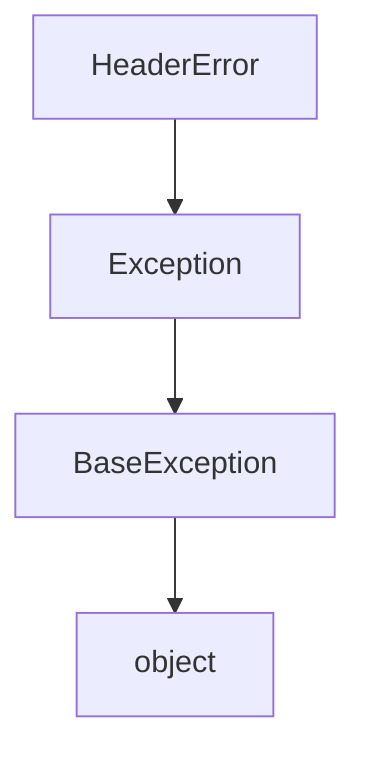
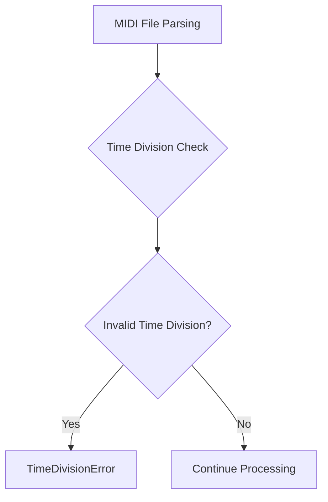
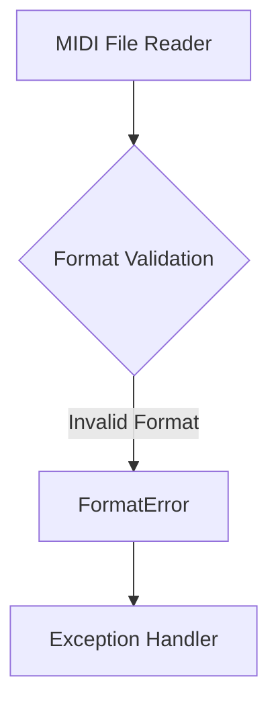
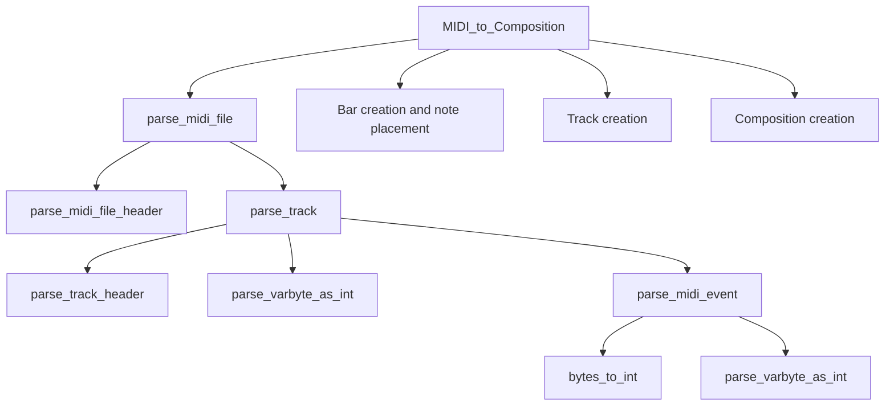

# `midi_file_in.py`

## `mingus.midi.midi_file_in.MIDI_to_Composition` · *function*

## Summary:
Converts a MIDI file into a mingus Composition object with tracks, bars, and notes by delegating to the MidiFile parser from midi_file_out.

## Description:
This function serves as a convenience wrapper that creates a MidiFile instance from the midi_file_out module and converts a MIDI file into a mingus Composition object. It provides a simple interface for loading MIDI files and translating their contents into structured musical data that can be manipulated within the mingus framework. The function delegates to the MidiFile.MIDI_to_Composition method in the midi_file_out module, which handles the actual MIDI parsing and conversion process.

## Args:
    file (str or file-like object): Path to the MIDI file or a file object containing MIDI data

## Returns:
    tuple: A tuple containing (Composition, bpm) where Composition is a mingus Composition object with tracks and bars, and bpm is an integer representing the tempo in beats per minute calculated from MIDI tempo meta events

## Raises:
    Exceptions are propagated from the underlying MidiFile.MIDI_to_Composition method in midi_file_out module. These may include:
    - IOError: When the input file cannot be opened or read from
    - HeaderError: When MIDI file header is invalid
    - FormatError: When MIDI file format is unsupported (not 0, 1, or 2)
    - TimeDivisionError: When SMPTE frame rate in time division is invalid

## Constraints:
    Preconditions:
    - Input file must be a valid MIDI file
    - The MIDI file should not have fps (frames per second) set in header
    - The method assumes standard MIDI event formats
    
    Postconditions:
    - Returns a valid Composition object with populated tracks
    - Returns a bpm value calculated from MIDI tempo meta events
    - All musical data from the MIDI file is converted to mingus containers

## Side Effects:
    - Reads from the input file (file I/O)
    - May print warning messages for unsupported MIDI events or meta events
    - Calls methods from the MidiFile class in midi_file_out module

## Control Flow:
```mermaid
flowchart TD
    A[Call MIDI_to_Composition] --> B[Create MidiFile instance from midi_file_out]
    B --> C[Call m.MIDI_to_Composition(file)]
    C --> D[Parse MIDI file using midi_file_out.MidiFile]
    D --> E[Extract tracks, notes, and metadata]
    E --> F[Create Composition object]
    F --> G[Return (Composition, bpm) tuple]
```

## Examples:
```python
# Basic usage
composition, tempo = MIDI_to_Composition('example.mid')
print(f"Loaded composition with {len(composition.tracks)} tracks at {tempo} BPM")

# With error handling
try:
    composition, tempo = MIDI_to_Composition('/path/to/music.mid')
    print(f"Successfully loaded: {tempo} BPM composition")
except IOError as e:
    print(f"Failed to read MIDI file: {e}")
except Exception as e:
    print(f"MIDI parsing error: {e}")
```

## `mingus.midi.midi_file_in.HeaderError` · *class*

## Summary:
Represents an exception that occurs when processing MIDI file headers during input operations.

## Description:
The HeaderError exception is raised when there are issues with parsing or validating the header section of a MIDI file during input operations. This custom exception inherits from Python's built-in Exception class and serves as a specialized error type for MIDI header-related problems.

This class exists as a distinct abstraction to allow callers to specifically catch and handle MIDI header parsing errors separately from other types of MIDI processing errors. It provides semantic clarity in error handling when working with MIDI files.

## State:
The class has no instance attributes beyond those inherited from Exception. As a minimal exception class, it doesn't maintain any state beyond the standard exception information (message, args, etc.).

## Lifecycle:
Creation: Instances are created by raising the exception directly or through exception propagation from lower-level functions that encounter header-related issues.

Usage: Typically caught by exception handlers in MIDI file processing code to provide specific error handling for header validation failures.

Destruction: Automatically handled by Python's garbage collector when the exception object goes out of scope.

## Method Map:


## Raises:
This class itself doesn't raise any exceptions. It is raised by other components in the MIDI file input processing pipeline when header validation fails.

## Example:
```python
try:
    # Attempt to parse MIDI file header
    midi_header = parse_midi_header(file_data)
except HeaderError as e:
    print(f"MIDI header error occurred: {e}")
    # Handle header-specific error
```

## `mingus.midi.midi_file_in.TimeDivisionError` · *class*

## Summary:
Represents an error that occurs when encountering an invalid or unsupported time division value while processing MIDI files.

## Description:
The TimeDivisionError exception is raised during MIDI file parsing when the time division value in the MIDI header cannot be properly interpreted or is outside the supported range. This typically happens when reading MIDI files with malformed time division specifications or when encountering time division formats that the library doesn't support.

This exception serves as a distinct error type to differentiate time division-related issues from other MIDI parsing errors, allowing callers to handle these specific cases appropriately.

## State:
The class inherits directly from Exception and has no additional attributes or state. It functions purely as an exception marker with no internal state to manage.

## Lifecycle:
- Creation: Instantiated when invalid time division data is detected during MIDI file parsing
- Usage: Raised by MIDI file parsing functions when time division values are invalid
- Destruction: Automatically handled by Python's exception mechanism when caught

## Method Map:


## Raises:
- TimeDivisionError: Raised when MIDI file contains invalid time division specification during parsing

## Example:
```python
try:
    midi_data = read_midi_file("example.mid")
except TimeDivisionError as e:
    print(f"MIDI time division error: {e}")
    # Handle invalid time division case
```

## `mingus.midi.midi_file_in.FormatError` · *class*

## Summary:
Represents an exception raised when a MIDI file format error occurs during file reading operations.

## Description:
The FormatError exception is used to indicate that a MIDI file being processed has an invalid or unsupported format. This exception is raised by the MIDI file input system when parsing fails due to format violations, such as malformed headers, incorrect chunk sizes, or unsupported MIDI specifications.

This class serves as a distinct abstraction for MIDI format-related errors, allowing callers to differentiate format issues from other types of MIDI processing errors like runtime errors or resource issues.

## State:
This is a simple exception class with no instance attributes. It inherits all behavior from the base Exception class.

## Lifecycle:
- Creation: Instantiated when a MIDI file format violation is detected during file parsing
- Usage: Raised by MIDI file reading functions when format validation fails
- Destruction: Handled by exception handlers in calling code

## Method Map:


## Raises:
This exception is raised by MIDI file reading functions when:
- MIDI file header is malformed
- Chunk sizes are incorrect
- Unsupported MIDI format versions are encountered
- File structure violates MIDI specification requirements

## Example:
```python
try:
    midi_data = midi_file_in.read_midi_file("song.mid")
except FormatError as e:
    print(f"MIDI file format error: {e}")
    # Handle invalid MIDI file
```

## `mingus.midi.midi_file_in.MidiFile` · *class*

## Summary:
Parses MIDI files and converts them into mingus Composition objects with Tracks, Bars, and Notes.

## Description:
The MidiFile class provides functionality to read MIDI files and translate their contents into mingus container objects (Composition, Track, Bar, Note). It handles standard MIDI file format parsing including headers, tracks, events, and metadata. This class serves as the primary interface for converting MIDI data into a format suitable for music manipulation and composition within the mingus framework. The class maintains parsing state through class variables that are shared across all instances and updated during processing.

## State:
- bpm (int): Current tempo in beats per minute, defaults to 120; updated during parsing based on MIDI tempo meta events (note: this is a class variable shared across all instances)
- meter (tuple): Time signature as (numerator, denominator), defaults to (4, 4); updated during parsing based on MIDI time signature meta events (note: this is a class variable shared across all instances)
- bytes_read (int): Counter tracking total bytes read during parsing operations; reset to 0 at start of each parse operation (note: this is a class variable shared across all instances)

## Lifecycle:
- Creation: Instantiate without arguments; the class is stateful and maintains parsing state between operations through class variables
- Usage: Call MIDI_to_Composition() with a file path to convert MIDI to Composition; the method updates class variables like bpm and meter
- Destruction: No explicit cleanup required; uses standard file handling

## Method Map:


## Raises:
- IOError: When files cannot be opened or read from
- HeaderError: When MIDI file header is invalid
- FormatError: When MIDI file format is unsupported (not 0, 1, or 2)
- TimeDivisionError: When SMPTE frame rate in time division is invalid

## Example:
```python
# Create MidiFile instance and convert MIDI to Composition
midi_file = MidiFile()
composition, tempo = midi_file.MIDI_to_Composition('example.mid')
print(f"Loaded composition with {len(composition.tracks)} tracks at {tempo} BPM")

# Access parsed data
for i, track in enumerate(composition.tracks):
    print(f"Track {i}: {getattr(track, 'name', 'Unnamed')}")
    for bar in track.bars:
        print(f"  Bar: {bar}")
```

### `mingus.midi.midi_file_in.MidiFile.MIDI_to_Composition` · *method*

## Summary:
Converts a MIDI file into a mingus Composition object with tracks, bars, and notes while extracting timing and musical metadata.

## Description:
This method is part of the MidiFile class and parses a MIDI file, translating its contents into a structured composition object that represents musical data in terms of tracks, bars, and notes. It handles various MIDI events including note-on/off events (event type 9), instrument changes (event type 12), and meta-events for tempo (meta-event 81), time signature (meta-event 88), and key (meta-event 89). The method processes each track separately, building bars with appropriate note durations and musical context. Unsupported events are logged via print statements.

## Args:
    file (str or file-like object): Path to the MIDI file or a file object containing MIDI data

## Returns:
    tuple: A tuple containing (Composition, bpm) where Composition is a mingus Composition object with tracks and bars, and bpm is an integer representing the tempo in beats per minute calculated from MIDI tempo meta events

## Raises:
    None explicitly raised, though print statements occur for unsupported MIDI events or meta events

## State Changes:
    Attributes READ: None directly read from self
    Attributes WRITTEN: None directly written to self

## Constraints:
    Preconditions: 
    - Input file must be a valid MIDI file
    - The MIDI file should not have fps (frames per second) set in header
    - The method assumes standard MIDI event formats
    
    Postconditions:
    - Returns a valid Composition object with populated tracks
    - Returns a bpm value calculated from MIDI tempo meta events
    - All musical data from the MIDI file is converted to mingus containers

## Side Effects:
    - Reads from the input file (file I/O)
    - Prints warning messages for unsupported MIDI events or meta events
    - Calls class methods parse_midi_file and bytes_to_int
    - May modify global state through mingus container operations

### `mingus.midi.midi_file_in.MidiFile.parse_midi_file_header` · *method*

## Summary:
Parses the MIDI file header to extract format type, number of tracks, and time division information.

## Description:
This method reads and validates the standard MIDI file header structure, extracting essential metadata about the MIDI file's organization and timing. It verifies the presence of the "MThd" identifier, reads the chunk size, and parses the format type, number of tracks, and time division parameters according to the MIDI specification.

Known callers:
- `MidiFile.parse_midi_file` - Called during the main MIDI file parsing workflow to extract header information before processing individual tracks
- `MidiFile.MIDI_to_Composition` - Invoked when converting MIDI files to musical compositions to obtain structural metadata

This logic is separated into its own method to provide a clean abstraction layer for MIDI header parsing, allowing the rest of the system to work with structured header data rather than raw binary data. It encapsulates the complex binary parsing logic required to properly interpret MIDI file headers.

## Args:
    fp (file-like object): A file pointer positioned at the beginning of the MIDI file header

## Returns:
    tuple or bool: When successful, returns a tuple containing (format_type, number_of_tracks, time_division). When the chunk size is less than 6, returns False.

## Raises:
    IOError: When unable to read from the file pointer or when encountering invalid data during parsing
    HeaderError: When the file does not begin with the expected "MThd" identifier
    FormatError: When encountering invalid MIDI format types (not 0, 1, or 2) or malformed header structure

## State Changes:
    Attributes READ: self.bytes_read
    Attributes WRITTEN: self.bytes_read (incremented as bytes are read)

## Constraints:
    Preconditions: The file pointer must be positioned at the start of a valid MIDI file header
    Postconditions: The file pointer position advances by the size of the header data read

## Side Effects:
    I/O operations: Reads from the provided file pointer
    File pointer advancement: The file pointer moves forward by the amount of header data processed

### `mingus.midi.midi_file_in.MidiFile.bytes_to_int` · *method*

## Summary:
Converts binary bytes or integer values to their corresponding integer representation for MIDI file parsing operations.

## Description:
This method serves as a utility for converting binary data to integers during MIDI file parsing. It handles both binary byte sequences and direct integer inputs, making it useful for processing various binary fields in MIDI files such as chunk sizes, event parameters, and timing information. The method is primarily used internally by the MidiFile parser to ensure consistent conversion of binary data to numeric representations.

## Args:
    _bytes (bytes or int): Binary data to convert to integer, or an integer to return as-is

## Returns:
    int: The integer representation of the input bytes, or the input integer unchanged

## Raises:
    TypeError: When _bytes is neither binary_type nor int

## State Changes:
    Attributes READ: None
    Attributes WRITTEN: None

## Constraints:
    Preconditions: _bytes must be either bytes (binary_type) or int
    Postconditions: Returns an integer value representing the input data

## Side Effects:
    None

### `mingus.midi.midi_file_in.MidiFile.parse_time_division` · *method*

## Summary:
Parses MIDI time division data from binary bytes into a structured format indicating either ticks-per-beat or SMPTE frame specifications.

## Description:
This method processes MIDI file time division data, which can represent either ticks per beat (for musical timing) or SMPTE frames (for video timing). It interprets the 2-byte time division value according to MIDI specification and returns appropriate metadata. The method is called during MIDI file header parsing to extract timing information that determines how MIDI events are interpreted in terms of time.

## Args:
    bytes (bytes): A 2-byte sequence containing the time division data from a MIDI file header

## Returns:
    dict: Either:
        - {"fps": False, "ticks_per_beat": int}: For standard MIDI timing with ticks per beat
        - {"fps": True, "SMPTE_frames": int, "clock_ticks": int}: For SMPTE timing with frame rate and clock ticks

## Raises:
    TimeDivisionError: When SMPTE frame rate is not one of the valid values [24, 25, 29, 30]

## State Changes:
    Attributes READ: None
    Attributes WRITTEN: None

## Constraints:
    Preconditions: Input bytes must be exactly 2 bytes long
    Postconditions: Returns a dictionary with proper keys based on the time division format

## Side Effects:
    None

### `mingus.midi.midi_file_in.MidiFile.parse_track` · *method*

## Summary:
Parses MIDI track data from a file pointer and returns a list of timestamped events.

## Description:
This method reads and parses the entire content of a single MIDI track from a file pointer. It processes the track header to determine the track size, then iterates through the track data parsing variable-length delta times and MIDI events until the track is fully consumed. The method is part of the MIDI file parsing pipeline that converts binary MIDI data into structured event data for further processing.

Known callers:
- `parse_midi_file()` in the same class, which calls this method for each track in a MIDI file
- This method is invoked during the MIDI file parsing process to extract track-specific event data

This logic is its own method rather than being inlined because it encapsulates the complex parsing of MIDI track data with variable-length encoding, making the code more modular and reusable. It separates concerns from the higher-level file parsing logic.

## Args:
    fp (file-like object): File pointer positioned at the beginning of a MIDI track

## Returns:
    list[list]: A list of events, where each event is a list containing [delta_time, event_dict], 
                where delta_time is an integer representing time elapsed since previous event, 
                and event_dict contains the parsed MIDI event data

## Raises:
    IOError: When unable to read required bytes from the file pointer
    FormatError: When encountering invalid MIDI format or unsupported event types

## State Changes:
    Attributes READ: self.bytes_read (read only for diagnostic purposes in error case)
    Attributes WRITTEN: None (self.bytes_read is modified by called methods: parse_track_header, parse_varbyte_as_int, parse_midi_event)

## Constraints:
    Preconditions: File pointer must be positioned at the beginning of a valid MIDI track
    Postconditions: File pointer is advanced by the total number of bytes consumed by the track

## Side Effects:
    Reads from the provided file pointer
    Prints diagnostic message to stdout if chunk_size becomes negative (indicating parsing issue)

### `mingus.midi.midi_file_in.MidiFile.parse_midi_event` · *method*

## Summary:
Parses a single MIDI event from a file pointer and returns the event data along with the chunk size consumed.

## Description:
This method reads and interprets MIDI events from a file pointer, handling different MIDI event types according to the MIDI specification. It processes the event type and channel information from the first byte, then reads additional parameters based on the event type. The method is called during the MIDI file parsing process to extract individual events from tracks.

Known callers:
- `parse_track()` in the same class, which calls this method repeatedly while parsing track data
- This method is part of the MIDI file parsing pipeline that converts binary MIDI data into structured event data

This logic is separated into its own method because MIDI events have varying formats and require different parsing strategies based on event type, making it cleaner to encapsulate this complex parsing logic rather than inlining it within the track parsing loop.

## Args:
    fp (file-like object): File pointer positioned at the start of a MIDI event

## Returns:
    tuple: A tuple containing:
        dict: Event data dictionary with keys based on event type:
            - For meta events (event_type 0x0F): "event", "meta_event", "data"
            - For controller events (event_type 12, 13): "event", "channel", "param1"  
            - For note events and others: "event", "channel", "param1", "param2"
        int: Number of bytes consumed from the file pointer for this event

## Raises:
    IOError: When unable to read required bytes from the file pointer
    FormatError: When encountering unknown event types (event_type < 8) or invalid MIDI format

## State Changes:
    Attributes READ: None
    Attributes WRITTEN: self.bytes_read (incremented by the number of bytes consumed)

## Constraints:
    Preconditions: File pointer must be positioned at the beginning of a valid MIDI event
    Postconditions: File pointer is advanced by the number of bytes consumed by the event

## Side Effects:
    Reads from the provided file pointer
    Modifies the self.bytes_read attribute to track parsing progress

### `mingus.midi.midi_file_in.MidiFile.parse_track_header` · *method*

## Summary:
Parses the track header from a MIDI file and extracts the track chunk size.

## Description:
Reads and validates the track header identifier "MTrk" from the file pointer, then reads and converts the track chunk size. This method is a crucial part of the MIDI file parsing pipeline, specifically designed to handle the structural header of individual tracks within a MIDI file.

Known callers:
- `parse_track()` in the same class, which calls this method at the beginning of each track parsing operation
- This method is invoked during the MIDI file parsing process to prepare for track data extraction

This logic is its own method rather than being inlined because it encapsulates the specific parsing requirements for MIDI track headers, separating the concern of header validation from the general track parsing logic and making the code more readable and maintainable.

## Args:
    fp (file-like object): File pointer positioned at the beginning of a MIDI track header. Must support read() method returning 4 bytes.

## Returns:
    int: The track chunk size in bytes, indicating the total size of the track data that follows this header

## Raises:
    IOError: When unable to read the required bytes from the file pointer
    HeaderError: When the track header identifier is not "MTrk" (i.e., not a valid track header)

## State Changes:
    Attributes READ: self.bytes_read (read for error reporting purposes)
    Attributes WRITTEN: self.bytes_read (incremented by 8 bytes total - 4 bytes for header + 4 bytes for chunk size)

## Constraints:
    Preconditions: File pointer must be positioned at the beginning of a valid MIDI track header
    Postconditions: File pointer is advanced by 8 bytes (4 bytes for header identifier + 4 bytes for chunk size)
    The method assumes that the file pointer is positioned correctly and that the underlying file is accessible

## Side Effects:
    Reads 8 bytes from the provided file pointer
    Modifies the self.bytes_read attribute to track parsing progress

### `mingus.midi.midi_file_in.MidiFile.parse_midi_file` · *method*

## Summary:
Parses a complete MIDI file and returns structured header and track event data.

## Description:
This method serves as the main entry point for parsing MIDI files. It opens the specified file in binary mode, reads and validates the MIDI header, then sequentially parses each track in the file. The method coordinates the parsing process by delegating to specialized parsing functions for headers and tracks.

Known callers:
- `MidiFile.MIDI_to_Composition` - This method is called by the composition conversion process to parse MIDI files into musical compositions.

This logic is separated into its own method to provide a clean interface for MIDI file parsing, allowing the rest of the system to work with structured data rather than raw binary data. It encapsulates the file opening, header parsing, and track iteration logic in a single cohesive unit.

## Args:
    file (str): Path to the MIDI file to be parsed

## Returns:
    tuple: A tuple containing (header_info, track_events_list) where:
        - header_info is a tuple with (format_type, number_of_tracks, time_division)
        - track_events_list is a list of parsed track events

## Raises:
    IOError: When the specified file cannot be opened or read

## State Changes:
    Attributes READ: None
    Attributes WRITTEN: self.bytes_read (reset to 0 at start of parsing)

## Constraints:
    Preconditions: The file parameter must be a valid path to an existing MIDI file
    Postconditions: The method returns parsed header and track data in standard format

## Side Effects:
    I/O operations: Opens and reads from the specified file
    File handle management: Opens file in binary read mode and closes it after parsing

### `mingus.midi.midi_file_in.MidiFile.parse_varbyte_as_int` · *method*

## Summary:
Parses a variable-length integer from a MIDI file stream according to MIDI's variable-length quantity format.

## Description:
This method decodes variable-length quantities used in MIDI files, where integers are encoded using 7-bit chunks with continuation bits. The method reads bytes sequentially from the file pointer until it encounters a byte without the most significant bit set, indicating the end of the encoded value. This is a fundamental operation in MIDI file parsing for reading delta times, event lengths, and other variable-sized data fields.

## Args:
    fp (file-like object): File pointer from which to read bytes
    return_bytes_read (bool): If True, returns tuple of (parsed_value, bytes_read); if False, returns only parsed_value

## Returns:
    int or tuple: If return_bytes_read is False, returns the parsed integer value. If True, returns a tuple of (parsed_integer, bytes_read).

## Raises:
    IOError: When unable to read from the file pointer, typically due to EOF or file corruption

## State Changes:
    Attributes READ: None
    Attributes WRITTEN: self.bytes_read (incremented by 1 for each byte read)

## Constraints:
    Preconditions: File pointer must be seekable and readable
    Postconditions: File pointer position advances by the number of bytes read

## Side Effects:
    I/O: Reads bytes from the provided file pointer
    Mutates: Increments self.bytes_read counter

