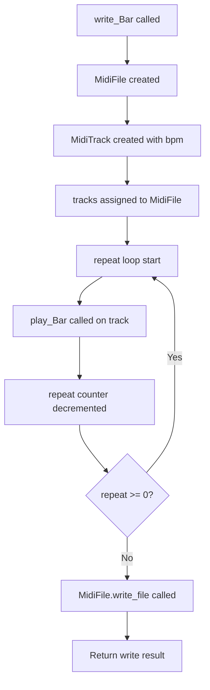
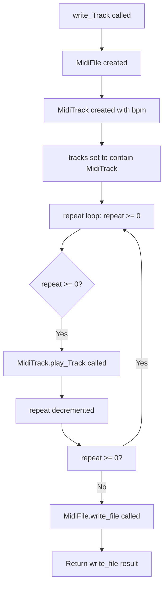
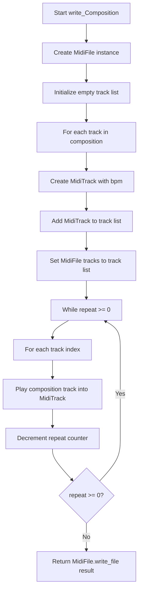

# `midi_file_out.py`

## `mingus.midi.midi_file_out.MidiFile` · *class*

## Summary:
Represents a MIDI file container that manages multiple MIDI tracks and provides functionality for generating MIDI data and writing to files.

## Description:
The MidiFile class serves as a container for MIDI tracks and handles the creation of proper MIDI file format data. It is responsible for assembling individual track data into a complete MIDI file structure with appropriate headers and managing the file writing process. This class acts as the main interface for creating MIDI files from musical data structures like tracks, bars, and notes.

## State:
- tracks: list of MidiTrack objects (class attribute, shared among all instances, initialized to empty list)
- time_division: bytes object representing the time division (class attribute, default b'\x00H' which equals 72 ticks per beat)

## Lifecycle:
- Creation: Instantiate with optional list of tracks; if no tracks provided, creates empty list. During initialization, reset() is called which operates on the class tracks attribute (empty list) before the instance tracks attribute is set.
- Usage: Call get_midi_data() to generate MIDI data, or write_file() to write directly to disk
- Destruction: No explicit cleanup required; relies on Python's garbage collection

## Method Map:
```mermaid
graph TD
    A[MidiFile.__init__] --> B[MidiFile.reset]
    B --> C[MidiFile.tracks = tracks]
    A --> D[MidiFile.header]
    D --> E[MidiFile.get_midi_data]
    E --> F[MidiFile.write_file]
    F --> G[open(file, "wb")]
    G --> H[f.write(dat)]
    H --> I[print("Written X bytes")]
```

## Raises:
- IOError when trying to open a file for writing (printed to stderr)
- IOError when trying to write data to file (printed to stderr)

## Example:
```python
# Create a MidiFile with tracks
track1 = MidiTrack()
# ... add data to track1 ...
midi_file = MidiFile([track1])

# Get MIDI data
midi_data = midi_file.get_midi_data()

# Write to file
success = midi_file.write_file("output.mid", verbose=True)
```

### `mingus.midi.midi_file_out.MidiFile.__init__` · *method*

## Summary:
Initializes a MidiFile object with optional tracks and resets existing track state.

## Description:
The MidiFile constructor creates a new MIDI file representation with an optional list of tracks. It ensures proper initialization by resetting any existing track state before assigning the provided tracks. This method is called during object instantiation to prepare the MidiFile for MIDI data processing and output generation.

## Args:
    tracks (list[MidiTrack], optional): A list of MidiTrack objects to initialize the file with. Defaults to None, which results in an empty track list.

## Returns:
    None: This method does not return a value.

## Raises:
    None: This method does not explicitly raise exceptions.

## State Changes:
    Attributes READ: None
    Attributes WRITTEN: self.tracks, self.time_division

## Constraints:
    Preconditions: The tracks parameter should contain valid MidiTrack objects if provided.
    Postconditions: The MidiFile instance will have its tracks initialized to the provided list (or empty list) and all existing tracks will have been reset.

## Side Effects:
    None: This method only modifies the internal state of the MidiFile instance.

### `mingus.midi.midi_file_out.MidiFile.get_midi_data` · *method*

## Summary:
Generates complete MIDI file data by combining the file header with processed track data from all non-empty tracks.

## Description:
This method orchestrates the creation of complete MIDI file data by collecting processed MIDI data from all tracks in the file and prepending the appropriate MIDI file header. It filters out empty tracks to avoid including unused track sections in the final output. The method is called during MIDI file serialization processes, particularly when writing MIDI files to disk.

## Args:
    None

## Returns:
    bytes: Complete MIDI file data containing header followed by all non-empty track data

## Raises:
    None explicitly raised

## State Changes:
    Attributes READ: 
    - self.tracks: List of MidiTrack objects containing track data
    - self.time_division: Time division setting for the MIDI file
    Attributes WRITTEN: 
    - None

## Constraints:
    Preconditions:
    - self.tracks must be a list of MidiTrack objects
    - Each track in self.tracks must have a track_data attribute
    - self.header() method must be callable and return valid MIDI header bytes
    Postconditions:
    - Returns complete MIDI file data with proper header and track sections
    - Empty tracks (with track_data == b"") are excluded from the result

## Side Effects:
    None

### `mingus.midi.midi_file_out.MidiFile.header` · *method*

## Summary:
Constructs and returns the MIDI file header containing metadata about the file structure and timing information.

## Description:
Generates a standard MIDI file header that includes the file identifier, format type, number of tracks, and time division information. This method is called by `get_midi_data()` to create the complete MIDI file structure. The header follows the standard MIDI file format specification where the track count is calculated by counting non-empty tracks (those with non-empty track_data).

The header structure consists of:
- "MThd" identifier (4 bytes)
- Header size (4 bytes, always 6 for this format)
- Format type (2 bytes, always 1 for multi-track files)
- Number of tracks (2 bytes, encoded as big-endian)
- Time division (2 bytes)

## Args:
    None

## Returns:
    bytes: A byte string representing the complete MIDI file header, consisting of:
        - "MThd" (4-byte identifier)
        - Fixed header size (4 bytes)
        - Format type (2 bytes, always 1 for this implementation)
        - Number of tracks (2 bytes, encoded as big-endian)
        - Time division (2 bytes)

## Raises:
    None explicitly raised

## State Changes:
    - Attributes READ: self.tracks, self.time_division
    - Attributes WRITTEN: None

## Constraints:
    - Preconditions: self.tracks must be a list of objects with track_data attribute
    - Postconditions: Returns a properly formatted MIDI header byte string

## Side Effects:
    None

### `mingus.midi.midi_file_out.MidiFile.reset` · *method*

## Summary:
Resets all tracks in the MIDI file by clearing their accumulated MIDI data and resetting delta time counters.

## Description:
Clears the internal state of all tracks managed by this MIDI file, preparing them for new MIDI data collection. This method is typically called during initialization and when reusing a MidiFile instance to ensure clean state before adding new track data.

## Args:
    None

## Returns:
    None

## Raises:
    None

## State Changes:
    Attributes READ: self.tracks
    Attributes WRITTEN: Each track's track_data and delta_time attributes are modified

## Constraints:
    Preconditions: self.tracks must be iterable and contain objects with a reset() method
    Postconditions: All tracks in self.tracks will have their track_data cleared and delta_time reset to b"\x00"

## Side Effects:
    None

### `mingus.midi.midi_file_out.MidiFile.write_file` · *method*

## Summary:
Writes the MIDI data contained in this MidiFile object to a specified file on disk.

## Description:
This method serializes the MIDI data stored in the MidiFile object and writes it to a file in binary format. It is designed to persist MIDI compositions to disk for later playback or editing. The method handles file opening, writing, and closing operations while providing basic error handling and optional verbose output.

## Args:
    file (str): Path to the output file where MIDI data will be written
    verbose (bool): If True, prints diagnostic information about the write operation including byte count and file name. Defaults to False

## Returns:
    bool: True if the write operation completed successfully, False if file opening or writing failed

## Raises:
    None explicitly raised, but underlying file operations may raise IOError or other file-related exceptions

## State Changes:
    Attributes READ: 
    - self.tracks: Used indirectly through get_midi_data() method
    - self.time_division: Used indirectly through get_midi_data() method
    
    Attributes WRITTEN: None

## Constraints:
    Preconditions:
    - The MidiFile object must have been properly initialized with tracks
    - The file path must be writable and the parent directory must exist
    - The get_midi_data() method must return valid MIDI data
    
    Postconditions:
    - If successful, the specified file will contain valid MIDI data
    - If unsuccessful, no changes are made to the MidiFile object state

## Side Effects:
    - Performs file I/O operations (opening, writing, closing files)
    - May produce console output when verbose=True
    - May raise file system related exceptions if file permissions or disk space are insufficient

## `mingus.midi.midi_file_out.write_Note` · *function*

## Summary:
Creates a MIDI file containing a single note played for a specified number of repetitions.

## Description:
Generates a MIDI file with a single note that is played and stopped repeatedly based on the repeat parameter. This function constructs a minimal MIDI structure with one track and writes the resulting MIDI data to the specified file. It's primarily used for creating simple test MIDI files or individual note representations.

Known callers within the codebase:
- This function appears to be a standalone utility function and doesn't seem to be called by other functions in the provided codebase context.

This logic is extracted into its own function rather than being inlined because it encapsulates the complete workflow of creating a MIDI file with a single note, including track setup, note playback, timing control, and file writing. This promotes code reuse and makes the process of generating single-note MIDI files more modular and testable.

## Args:
    file (str): Path to the output MIDI file to be created
    note (mingus.containers.note.Note): A musical note object containing note information including pitch, channel, and velocity
    bpm (int): Tempo in beats per minute for the MIDI track. Defaults to 120
    repeat (int): Number of times to repeat the note playback. Defaults to 0 (plays once). When negative, no repetitions occur.
    verbose (bool): If True, prints diagnostic information about the write operation. Defaults to False

## Returns:
    bool: True if the MIDI file was written successfully, False otherwise

## Raises:
    IOError: When the file cannot be opened or written to (propagated from MidiFile.write_file)

## Constraints:
    Preconditions:
    - The note parameter must be a valid Note object with proper channel and velocity attributes
    - The file path must be writable and the parent directory must exist
    - The bpm parameter should be a positive integer

    Postconditions:
    - A MIDI file will be created at the specified path with the note data
    - The MIDI file will contain a single track with the note played and stopped

## Side Effects:
    - Creates a file on disk at the specified location
    - May produce console output when verbose=True
    - Uses the MidiFile and MidiTrack classes to construct MIDI data

## Control Flow:
```mermaid
flowchart TD
    A[write_Note called] --> B[Create MidiFile instance]
    B --> C[Create MidiTrack with bpm]
    C --> D[Set tracks on MidiFile]
    D --> E[Loop while repeat >= 0]
    E --> F[Set deltatime to 0]
    F --> G[Play note]
    G --> H[Set deltatime to 72 (0x48)]
    H --> I[Stop note]
    I --> J[Decrement repeat]
    J --> K{repeat >= 0?}
    K -- Yes --> E
    K -- No --> L[Write MIDI file]
    L --> M[Return write result]
```

## Examples:
    # Create a MIDI file with middle C played once
    write_Note("test.mid", Note("C-4"))
    
    # Create a MIDI file with middle C played 3 times
    write_Note("test.mid", Note("C-4"), repeat=3)
    
    # Create a MIDI file with a note at 150 BPM
    write_Note("test.mid", Note("E-5"), bpm=150)
    
    # Create a MIDI file with verbose output
    write_Note("test.mid", Note("A-3"), verbose=True)

## `mingus.midi.midi_file_out.write_NoteContainer` · *function*

## Summary:
Writes a NoteContainer to a MIDI file with configurable tempo, repetition, and verbosity options.

## Description:
Creates a MIDI file containing the specified note container data, allowing for configurable playback tempo, repetition count, and output verbosity. This function serves as a convenient interface for generating MIDI files from note containers without requiring explicit track or file management.

The function constructs a MidiFile with a single MidiTrack, processes the note container by playing and stopping notes with appropriate timing, and writes the result to the specified file. It's particularly useful for quickly generating MIDI representations of musical note sequences or chords.

Known callers within the codebase:
- Direct usage in various MIDI generation contexts where a simple note container to MIDI file conversion is needed
- Likely used in testing and demonstration scenarios for quick MIDI file creation

This logic is extracted into its own function to provide a clean, reusable interface for MIDI file generation from note containers, encapsulating the complexity of track management and file writing while exposing only the essential parameters needed for common use cases.

## Args:
    file (str): Path to the output MIDI file to be created
    notecontainer (NoteContainer): Container holding the notes to be written to the MIDI file
    bpm (int, optional): Tempo in beats per minute. Defaults to 120
    repeat (int, optional): Number of times to repeat the note container playback. Defaults to 0 (single playback)
    verbose (bool, optional): If True, prints detailed information about the file writing process. Defaults to False

## Returns:
    bool: True if the MIDI file was successfully written, False otherwise. The function returns the result of MidiFile.write_file().

## Raises:
    IOError: When the file cannot be opened or written to (propagated from MidiFile.write_file)

## Constraints:
    Preconditions:
    - The file path must be writable and the parent directory must exist
    - The notecontainer must be a valid container supporting iteration and indexing operations
    - The bpm parameter should be a positive integer representing tempo
    - The repeat parameter should be a non-negative integer

    Postconditions:
    - A valid MIDI file will be created at the specified file path if successful
    - The MidiFile object will contain exactly one track with the note data
    - The track will have proper timing synchronization between notes

## Side Effects:
    - Creates a new MIDI file at the specified file path
    - Performs file I/O operations (opening, writing, closing files)
    - May produce console output when verbose=True
    - Modifies the internal state of MidiTrack objects during processing

## Control Flow:
```mermaid
flowchart TD
    A[Start write_NoteContainer] --> B[Create MidiFile instance]
    B --> C[Create MidiTrack with bpm]
    C --> D[Set MidiFile tracks to single MidiTrack]
    D --> E[While repeat >= 0]
    E --> F[Set deltatime to b"\\x00"]
    F --> G[Play notecontainer with MidiTrack]
    G --> H[Set deltatime to b"\\x48"]
    H --> I[Stop notecontainer with MidiTrack]
    I --> J[Decrement repeat]
    J --> K{repeat >= 0?}
    K -->|Yes| E
    K -->|No| L[Return MidiFile.write_file()]
    L --> M[End]
```

## Examples:
```python
# Basic usage - write a single note container to MIDI file
from mingus.containers import NoteContainer
from mingus.midi import midi_file_out

notes = NoteContainer(['C-4', 'E-4', 'G-4'])  # C major chord
midi_file_out.write_NoteContainer('chord.mid', notes)

# Write with custom tempo and repetition
midi_file_out.write_NoteContainer('repeated_chord.mid', notes, bpm=140, repeat=2)

# Write with verbose output
midi_file_out.write_NoteContainer('verbose_chord.mid', notes, verbose=True)
```

## `mingus.midi.midi_file_out.write_Bar` · *function*

## Summary:
Writes a musical bar to a MIDI file with configurable tempo, repetition, and output verbosity.

## Description:
Converts a musical bar into a complete MIDI file by creating a MIDI track, playing the bar on that track, and writing the resulting MIDI data to disk. The function supports configurable tempo, repetition of the bar, and verbose output for debugging purposes. This utility function abstracts the process of creating MIDI files from individual musical bars, making it easier to generate MIDI output for testing or playback.

## Args:
    file (str): Path to the output MIDI file to be created
    bar (Bar): Musical bar object containing the notes and timing information to be written to MIDI
    bpm (int, optional): Tempo in beats per minute for the MIDI output. Defaults to 120
    repeat (int, optional): Number of additional times to repeat the bar in the output (0 = play once, 1 = play twice, etc.). Defaults to 0 (no repetition)
    verbose (bool, optional): If True, prints detailed information about the file writing process. Defaults to False

## Returns:
    bool: True if the MIDI file was successfully written, False otherwise

## Raises:
    IOError: When the file cannot be opened or written to (propagated from MidiFile.write_file)

## Constraints:
    Preconditions:
    - The bar parameter must be iterable and yield tuples with at least 3 elements in the format (event_type, duration, note_container)
    - Each event tuple must be compatible with MidiTrack.play_Bar method requirements
    - The bar must have meter and key attributes that can be processed by MidiTrack.set_meter and MidiTrack.set_key
    - The file path must be writable and the parent directory must exist

    Postconditions:
    - If successful, the specified file will contain a valid MIDI representation of the bar
    - The file will contain the bar played exactly (repeat + 1) times
    - The MIDI file will be created with the specified tempo

## Side Effects:
    - Creates a new file at the specified path
    - Writes binary MIDI data to disk
    - May produce console output when verbose=True
    - Uses file system I/O operations

## Control Flow:


## Examples:
```python
# Basic usage - write a single bar to MIDI file
from mingus.containers import Bar
from mingus.midi import write_Bar

my_bar = Bar()
# ... populate bar with notes ...
write_Bar("output.mid", my_bar)

# Write with custom tempo and repetition
write_Bar("repeated.mid", my_bar, bpm=140, repeat=3, verbose=True)
```

## `mingus.midi.midi_file_out.write_Track` · *function*

## Summary:
Writes a musical track to a MIDI file by converting the track data into MIDI events and serializing them to disk.

## Description:
This function serves as a convenience wrapper for converting a musical track object into a complete MIDI file. It creates a MIDI file structure, processes the input track through a MIDI track processor, and writes the resulting MIDI data to disk. The function supports repeated playback of the track and provides verbose output options for debugging.

## Args:
    file (str): Path to the output MIDI file to be created
    track: A musical track object containing bars and notes to be converted to MIDI events
    bpm (int, optional): Tempo in beats per minute for the MIDI output. Defaults to 120
    repeat (int, optional): Number of times to repeat the track playback. Defaults to 0 (single playback)
    verbose (bool, optional): If True, prints diagnostic information about the write operation. Defaults to False

## Returns:
    bool: True if the MIDI file was written successfully, False otherwise

## Raises:
    IOError: When the file cannot be opened or written to (propagated from underlying file operations)

## Constraints:
    Preconditions:
    - The track parameter must be a valid musical track object that can be processed by MidiTrack.play_Track
    - The file path must be writable and the parent directory must exist
    - The repeat parameter should be a non-negative integer
    
    Postconditions:
    - A valid MIDI file will be created at the specified file path if successful
    - The MidiFile object will contain properly formatted MIDI data

## Side Effects:
    - Creates a new MIDI file at the specified file path
    - Performs file I/O operations (writing to disk)
    - May produce console output when verbose=True

## Control Flow:


## Examples:
```python
# Basic usage - write a single track to MIDI file
from mingus.containers import Track
from mingus.midi import write_Track

track = Track()
# ... add bars and notes to track ...
write_Track("output.mid", track)

# Write with custom tempo and verbose output
write_Track("output.mid", track, bpm=140, verbose=True)

# Write with repeated playback
write_Track("output.mid", track, repeat=3)
```

## `mingus.midi.midi_file_out.write_Composition` · *function*

## Summary:
Writes a musical composition to a MIDI file by converting tracks into MIDI data and serializing to disk.

## Description:
Converts a mingus Composition object into a MIDI file format by creating MIDI tracks, playing composition data into those tracks, and writing the resulting MIDI data to disk. This function abstracts the complexity of MIDI file generation by handling track creation, data playback, and file I/O operations internally.

The function is designed to separate the concerns of composition-to-MIDI conversion from file I/O, enabling reusable MIDI generation logic while providing flexibility in output destination and behavior through optional parameters. It processes each track in the composition sequentially, applying the specified tempo and optionally repeating the playback.

## Args:
    file (str): Path to the output MIDI file to be created. Must be a valid file path string.
    composition (Composition): A mingus Composition object containing tracks to be converted to MIDI format. Must have a tracks attribute with iterable Track objects.
    bpm (int): Tempo in beats per minute for the MIDI output. Defaults to 120.
    repeat (int): Number of times to repeat the composition playback. Defaults to 0 (single playback). Note: Negative values will cause infinite looping due to flawed implementation logic.
    verbose (bool): Whether to print detailed output during file writing. Defaults to False.

## Returns:
    bool: True if the MIDI file was successfully written, False otherwise.

## Raises:
    IOError: When unable to create or write to the specified file path during the write_file operation.

## Constraints:
    Preconditions:
    - The composition parameter must be a valid Composition object from the mingus library
    - The composition must have a tracks attribute containing iterable Track objects
    - The file parameter must be a valid string that can be used as a file path
    - The bpm parameter must be a positive integer
    - The repeat parameter should be non-negative for normal operation (though negative values are accepted due to flawed logic)

    Postconditions:
    - A MIDI file is created at the specified location
    - The file contains valid MIDI data representing the composition
    - All tracks from the composition are processed and included in the output

## Side Effects:
    - Creates a file on the filesystem at the specified location
    - Writes MIDI data to disk
    - May print verbose output to console if verbose=True

## Control Flow:


## Examples:
    # Basic usage - write composition to MIDI file
    from mingus.containers import Composition
    from mingus.midi import write_Composition
    
    comp = Composition()
    # ... add tracks and notes to composition ...
    
    # Write to MIDI file with default settings
    success = write_Composition("output.mid", comp)
    
    # Write with custom tempo and verbose output
    success = write_Composition("output.mid", comp, bpm=140, verbose=True)
    
    # Write with repeated playback
    success = write_Composition("output.mid", comp, repeat=2)
```

