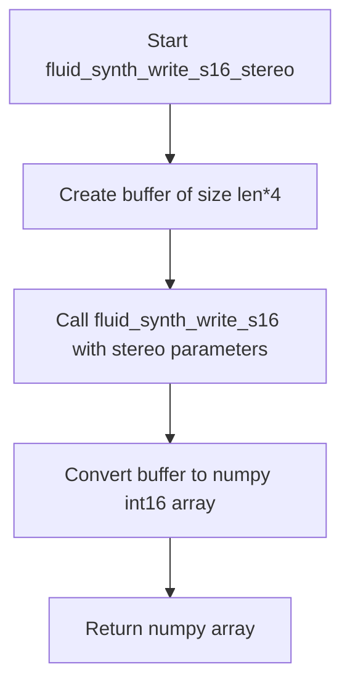
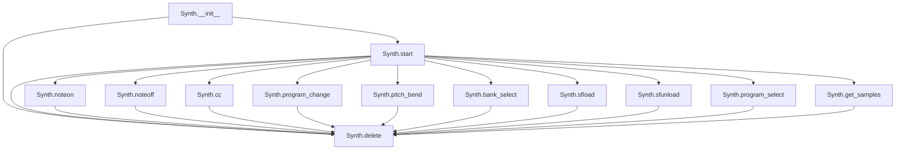
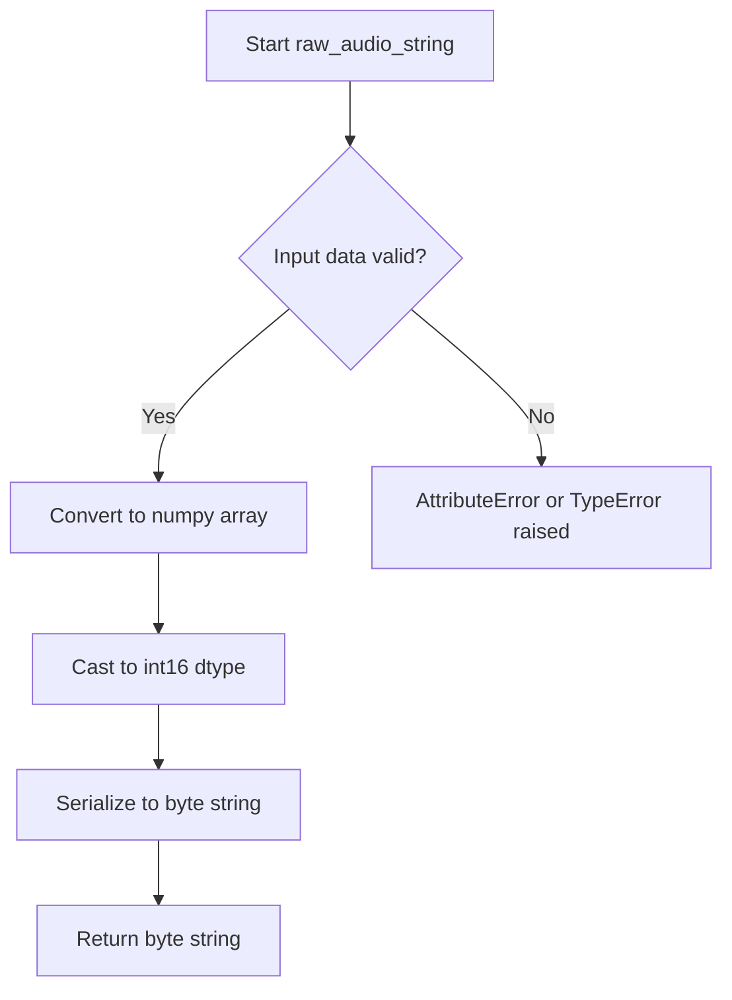

# `pyfluidsynth.py`

## `mingus.midi.pyfluidsynth.cfunc` · *function*

## Summary:
Creates a ctypes function prototype for interfacing with C library functions using a foreign function interface.

## Description:
This helper function constructs a ctypes function prototype by processing argument specifications and returning a callable function type that can interface with C libraries. It's designed to simplify the creation of ctypes function signatures for foreign function interfaces, particularly when working with fluidsynth or similar C libraries.

## Args:
    name (str): Name of the C function to be wrapped
    result (type): Return type of the C function (e.g., c_int, c_void_p)
    *args: Variable length argument specification tuples, each containing:
        - arg[0] (str): Argument name
        - arg[1] (type): Argument type (ctypes type such as c_int, c_float)
        - arg[2] (int): Argument flag indicating input/output behavior (1 for input, 2 for output, etc.)
        - arg[3:] (tuple): Additional flags or metadata for the argument

## Returns:
    ctypes.CFUNCTYPE: A callable ctypes function type that can be used to create function pointers to C library functions. When instantiated with appropriate arguments, it creates callable C function wrappers.

## Raises:
    None explicitly raised in the function body

## Constraints:
    Preconditions:
    - The `_fl` variable must be defined in the calling scope (typically a loaded C library handle)
    - Each arg in *args must be a tuple with at least 3 elements: (name, type, flag)
    - The CFUNCTYPE constructor must be able to process the provided parameters
    
    Postconditions:
    - Returns a valid ctypes function type that can be used to create function pointers
    - The returned type matches the specified result type and argument types

## Side Effects:
    None directly, but the returned function type may be used to create function pointers that could have side effects when called

## Control Flow:
```mermaid
flowchart TD
    A[Start cfunc] --> B{Process args}
    B --> C[Extract atypes from arg[1]]
    B --> D[Transform aflags from arg[2], arg[0], arg[3:]]
    C --> E[Create CFUNCTYPE with result and atypes]
    D --> E
    E --> F[Return CFUNCTYPE]
```

## Examples:
```python
# Typical usage would be:
# Assuming _fl is a loaded library handle (e.g., from cdll.LoadLibrary)
func_type = cfunc("my_c_function", c_int, ("param1", c_float, 1, 0))
# This creates a function type that can be instantiated later:
# my_func = func_type(("my_c_function", _fl), (1, "param1"))
# Where the first tuple contains (function_name, library_handle)
# And the second tuple contains argument flags
```

## `mingus.midi.pyfluidsynth.fluid_synth_write_s16_stereo` · *function*

## Summary:
Writes stereo 16-bit audio samples from a FluidSynth synthesizer instance into a NumPy array.

## Description:
This function generates stereo audio output from a FluidSynth synthesizer instance by allocating a buffer, calling the underlying fluid_synth_write_s16 function to fill it with audio data, and then converting the raw bytes into a NumPy array of signed 16-bit integers. It's designed to provide a convenient interface for extracting audio samples from a synthesizer for further processing or playback.

## Args:
    synth: FluidSynth synthesizer instance to read audio from
    len: Number of audio frames to generate (not samples)

## Returns:
    numpy.ndarray: Array of signed 16-bit integers representing stereo audio samples, with shape (len, 2) where each row contains left and right channel samples

## Raises:
    None explicitly documented in the source code

## Constraints:
    Preconditions:
    - synth must be a valid FluidSynth synthesizer instance
    - len must be a positive integer representing number of audio frames
    
    Postconditions:
    - Returns a numpy array with dtype=int16
    - Array length equals the input len parameter
    - Array has two columns representing left and right channels

## Side Effects:
    None explicitly documented in the source code

## Control Flow:


## Examples:
```python
# Basic usage
synth = fluid_synth_new()
# ... initialize synth ...
audio_frames = fluid_synth_write_s16_stereo(synth, 1024)
print(f"Generated {len(audio_frames)} audio frames")
print(f"Audio shape: {audio_frames.shape}")
```

## `mingus.midi.pyfluidsynth.str_binary` · *function*

## Summary:
Converts text strings to binary encoding while preserving existing binary data.

## Description:
This utility function ensures proper string encoding for compatibility between Python versions or when interfacing with C libraries that require binary data. It checks if the input is a text type and encodes it to bytes, otherwise returns the input unchanged.

## Args:
    s (str or bytes): Input string that may be either text or binary data

## Returns:
    bytes: Binary representation of the input string if it was text, otherwise returns the input unchanged

## Raises:
    None explicitly raised

## Constraints:
    Preconditions:
        - Input parameter `s` can be of any type
    Postconditions:
        - If input is text type, result is encoded bytes
        - If input is already bytes, result is identical to input

## Side Effects:
    None

## Control Flow:
```mermaid
flowchart TD
    A[Input s] --> B{isinstance(s, six.text_type)?}
    B -- Yes --> C[s.encode()]
    B -- No --> D[s]
    C --> E[Return bytes]
    D --> E
```

## Examples:
    # Converting text to binary
    result = str_binary("hello")  # Returns b"hello" in Python 3
    
    # Preserving binary data
    result = str_binary(b"hello")  # Returns b"hello" unchanged
```

## `mingus.midi.pyfluidsynth.Synth` · *class*

## Summary:
A wrapper class for FluidSynth MIDI synthesizer that provides audio synthesis capabilities through the C-based FluidSynth library.

## Description:
The Synth class serves as a Python interface to the FluidSynth library, enabling MIDI note playback, sound font management, and audio output generation. It encapsulates the low-level FluidSynth C API calls into a more Pythonic interface. This class is typically instantiated by the mingus library's MIDI subsystem when audio synthesis is required.

## State:
- settings: ctypes pointer to FluidSynth settings object
- synth: ctypes pointer to FluidSynth synthesizer object  
- audio_driver: ctypes pointer to audio driver object (initially None)

## Lifecycle:
Creation: Instantiate with optional gain (default 0.2) and samplerate (default 44100) parameters
Usage: Call start() to initialize audio output, then use various MIDI control methods
Destruction: Call delete() method to properly clean up resources

## Method Map:


## Raises:
- AssertionError: When an invalid audio driver is specified in start() method
- Various exceptions from underlying FluidSynth C library calls (not explicitly handled)

## Example:
```python
# Create synthesizer instance
synth = Synth(gain=0.5, samplerate=48000)

# Start audio output with ALSA driver
synth.start(driver=b"alsa")

# Load a sound font
sfid = synth.sfload("soundfont.sf2")

# Play a note
synth.noteon(0, 60, 100)  # Channel 0, Middle C, velocity 100

# Get audio samples
samples = synth.get_samples(len=2048)

# Clean up
synth.delete()
```

### `mingus.midi.pyfluidsynth.Synth.__init__` · *method*

## Summary:
Initializes a FluidSynth synthesizer with configurable audio settings and prepares the underlying audio infrastructure.

## Description:
The `__init__` method constructs a new FluidSynth synthesizer instance by creating and configuring the underlying FluidSynth C library settings. It establishes the core audio parameters including gain level, sample rate, and MIDI channel count, then initializes the synthesizer and audio driver objects. This method serves as the primary constructor for the Synth class, setting up all necessary components for subsequent MIDI synthesis operations.

Known callers:
- Direct instantiation: `synth = Synth(gain=0.2, samplerate=44100)` during object creation
- Object construction phase: Called automatically by Python's object creation mechanism when instantiating Synth objects

This method exists as a dedicated initialization routine rather than being inlined because it encapsulates the complex setup of the FluidSynth C library components and ensures consistent initialization of all required attributes. It separates the concerns of object creation from the business logic of audio synthesis, making the class easier to use and maintain.

## Args:
    gain (float): Audio gain level for the synthesizer, controlling overall volume output. Defaults to 0.2.
    samplerate (int): Audio sample rate in Hz for the synthesizer. Defaults to 44100.

## Returns:
    None: This method initializes the object's state and does not return a value.

## Raises:
    None: This method does not explicitly raise exceptions, though underlying FluidSynth C library calls may raise errors.

## State Changes:
    Attributes READ: None
    Attributes WRITTEN: 
    - self.settings: Set to a new FluidSynth settings object configured with gain, sample rate, and MIDI channels
    - self.synth: Set to a new FluidSynth synthesizer object created from the settings
    - self.audio_driver: Set to None (initially unconfigured)

## Constraints:
    Preconditions:
    - The FluidSynth C library must be properly installed and accessible
    - The gain parameter should be a valid numeric value
    - The samplerate parameter should be a valid positive integer
    
    Postconditions:
    - All FluidSynth components are properly initialized
    - The synthesizer is ready for audio output configuration via start() method
    - The audio driver remains uninitialized until start() is called

## Side Effects:
    None: This method performs no I/O operations or external service calls. It only initializes internal object state and creates C library objects through ctypes bindings.

### `mingus.midi.pyfluidsynth.Synth.start` · *method*

## Summary:
Initializes and configures the audio driver for the FluidSynth synthesizer instance.

## Description:
Configures the audio output driver for the FluidSynth synthesizer. This method allows specifying which audio driver backend to use (such as ALSA, JACK, or PulseAudio) and initializes the audio driver for audio output. The method is typically called after the synthesizer has been configured but before audio playback begins.

## Args:
    driver (str or bytes, optional): Audio driver name to use for output. Valid options include "alsa", "oss", "jack", "portaudio", "sndmgr", "coreaudio", "Direct Sound", "dsound", "pulseaudio". If None, uses the default audio driver.

## Returns:
    None: This method does not return a value.

## Raises:
    AssertionError: If the specified driver is not in the list of supported audio drivers.

## State Changes:
    Attributes READ: self.settings, self.synth
    Attributes WRITTEN: self.audio_driver

## Constraints:
    Preconditions:
        - self.settings must be a valid FluidSynth settings instance
        - self.synth must be a valid FluidSynth synthesizer instance
        - driver, when specified, must be one of the supported audio driver names
        
    Postconditions:
        - If driver is specified, the audio driver setting is updated in self.settings
        - self.audio_driver is assigned a new FluidSynth audio driver instance

## Side Effects:
    - Creates a new audio driver instance via C library call
    - May initiate audio system initialization depending on the selected driver
    - Modifies the internal state of the FluidSynth synthesizer by setting audio driver configuration

### `mingus.midi.pyfluidsynth.Synth.sfload` · *method*

## Summary:
Loads a SoundFont file into the synthesizer and returns its identifier.

## Description:
This method provides an interface to load SoundFont files into the FluidSynth synthesizer instance. It converts the filename to binary encoding for C library compatibility and delegates to the underlying FluidSynth C library function.

## Args:
    filename (str): Path to the SoundFont file to load
    update_midi_preset (int, optional): Flag indicating whether to update MIDI presets. Defaults to 0 (false).

## Returns:
    int: Identifier for the loaded SoundFont, or error code if loading fails

## Raises:
    None explicitly raised

## State Changes:
    Attributes READ: self.synth
    Attributes WRITTEN: None

## Constraints:
    Preconditions:
        - The Synth instance must be properly initialized
        - The filename must point to a valid SoundFont file
    Postconditions:
        - The SoundFont file is loaded into the synthesizer
        - A valid SoundFont identifier is returned

## Side Effects:
    - I/O operation to read the SoundFont file from disk
    - Potential modification of the synthesizer's sound font database

### `mingus.midi.pyfluidsynth.Synth.sfunload` · *method*

## Summary:
Unloads a SoundFont from the synthesizer using its identifier.

## Description:
This method removes a previously loaded SoundFont from the FluidSynth synthesizer instance using the SoundFont identifier returned by the sfload method. It serves as the counterpart to sfload for managing SoundFont resources in the synthesizer.

## Args:
    sfid (int): The identifier of the SoundFont to unload, obtained from sfload method
    update_midi_preset (int, optional): Flag indicating whether to update MIDI presets after unloading. Defaults to 0 (false).

## Returns:
    int: Return code from the underlying FluidSynth C library function, typically 0 for success

## Raises:
    None explicitly raised

## State Changes:
    Attributes READ: self.synth
    Attributes WRITTEN: None

## Constraints:
    Preconditions:
        - The Synth instance must be properly initialized
        - The sfid must correspond to a currently loaded SoundFont
    Postconditions:
        - The SoundFont identified by sfid is removed from the synthesizer
        - Resources associated with that SoundFont are freed

## Side Effects:
    - Calls to the FluidSynth C library function fluid_synth_sfunload
    - Potential modification of the synthesizer's sound font database

### `mingus.midi.pyfluidsynth.Synth.program_select` · *method*

## Summary:
Selects a complete program (soundfont, bank, and preset) for a specific MIDI channel on the synthesizer.

## Description:
Configures a MIDI channel to use a specific soundfont, bank, and preset combination for instrument selection. This method provides fine-grained control over instrument assignment by specifying all components of a program: the soundfont identifier, bank number, and preset number. It serves as a wrapper around the FluidSynth C library's fluid_synth_program_select function.

## Args:
    chan (int): MIDI channel number (typically 0-15) to configure for program selection
    sfid (int): Soundfont identifier to select from loaded soundfonts
    bank (int): Bank number within the selected soundfont (typically 0-127)
    preset (int): Preset number within the selected bank (typically 0-127)

## Returns:
    int: Return value from the underlying FluidSynth C library function, typically indicating success (0) or failure (-1)

## Raises:
    None explicitly raised by this method, though the underlying C function may raise errors depending on invalid parameters or uninitialized synthesizer state

## State Changes:
    Attributes READ: self.synth
    Attributes WRITTEN: None

## Constraints:
    Preconditions: 
    - The synth instance must be initialized and valid
    - Channel number should be within valid MIDI channel range (typically 0-15)
    - Soundfont ID should correspond to a previously loaded soundfont
    - Bank and preset numbers should be within valid ranges for the selected soundfont
    
    Postconditions:
    - The specified MIDI channel will be configured with the requested soundfont, bank, and preset
    - The program selection takes effect immediately in the synthesizer

## Side Effects:
    - Calls into the FluidSynth C library
    - May affect audio output if the channel is currently playing notes

### `mingus.midi.pyfluidsynth.Synth.noteon` · *method*

## Summary:
Sends a MIDI note-on message to the synthesizer for a specific channel, key, and velocity.

## Description:
This method sends a MIDI note-on command to the fluidsynth synthesizer instance. It validates the channel, key, and velocity parameters before forwarding the command to the underlying C library function. This method is part of the MIDI control interface for the Synth class, allowing precise control over musical notes in a synthesizer context.

## Args:
    chan (int): MIDI channel number, must be non-negative (0-16 typically)
    key (int): MIDI note key number, must be between 0 and 128 inclusive (0-127 for standard MIDI)
    vel (int): MIDI velocity value, must be between 0 and 128 inclusive (0-127 for standard MIDI)

## Returns:
    bool: True if the operation was successful, False if validation failed due to invalid parameters

## Raises:
    None explicitly raised, but may raise exceptions from underlying C library

## State Changes:
    Attributes READ: self.synth
    Attributes WRITTEN: None

## Constraints:
    Preconditions: 
    - Channel number must be non-negative
    - Key number must be between 0 and 128 inclusive
    - Velocity value must be between 0 and 128 inclusive
    Postconditions:
    - Returns False for invalid parameters
    - Calls fluid_synth_noteon with valid parameters

## Side Effects:
    - Makes a call to the fluidsynth C library
    - May produce audio output depending on synthesizer state and loaded soundfonts

### `mingus.midi.pyfluidsynth.Synth.noteoff` · *method*

## Summary:
Sends a MIDI note off message to the synthesizer for a specific channel and key.

## Description:
This method sends a MIDI note off command to the fluidsynth synthesizer instance. It validates the channel and key parameters before forwarding the command to the underlying C library function. This method is part of the MIDI control interface for the Synth class.

## Args:
    chan (int): MIDI channel number, must be non-negative
    key (int): MIDI note key number, must be between 0 and 128 inclusive

## Returns:
    bool: True if the operation was successful, False if validation failed

## Raises:
    None explicitly raised, but may raise exceptions from underlying C library

## State Changes:
    Attributes READ: self.synth
    Attributes WRITTEN: None

## Constraints:
    Preconditions: 
    - Channel number must be non-negative
    - Key number must be between 0 and 128 inclusive
    Postconditions:
    - Returns False for invalid parameters
    - Calls fluid_synth_noteoff with valid parameters

## Side Effects:
    - Makes a call to the fluidsynth C library
    - May produce audio output depending on synthesizer state

### `mingus.midi.pyfluidsynth.Synth.pitch_bend` · *method*

## Summary:
Adjusts the pitch of a MIDI channel by applying a pitch bend value to the synthesizer.

## Description:
This method applies a pitch bend modification to the specified MIDI channel using the FluidSynth synthesizer. It serves as a wrapper around the fluid_synth_pitch_bend C library function, converting the input value to the appropriate range expected by FluidSynth by adding 8192 to the provided value. This method is part of the MIDI control interface for the Synth class, enabling dynamic pitch modification of musical notes.

## Args:
    chan (int): MIDI channel number (typically 0-15 for standard MIDI channels)
    val (int): Pitch bend value, typically ranging from -8192 to +8191, where 0 represents no pitch bend

## Returns:
    int: Return value from the underlying fluid_synth_pitch_bend C function call, indicating success or failure status

## Raises:
    None explicitly raised, but may raise exceptions from underlying C library

## State Changes:
    Attributes READ: self.synth
    Attributes WRITTEN: None

## Constraints:
    Preconditions: 
    - self.synth must be initialized (not None)
    - Channel numbers are typically 0-15 for standard MIDI channels
    - Pitch bend value should be within typical MIDI pitch bend range (-8192 to +8191)
    
    Postconditions:
    - The pitch bend message is sent to the synthesizer
    - Return value reflects the success/failure status from the C library call

## Side Effects:
    - Calls into the FluidSynth C library
    - May affect audio output by modifying the pitch of notes on the specified channel

### `mingus.midi.pyfluidsynth.Synth.cc` · *method*

## Summary:
Sends a MIDI control change message to the synthesizer.

## Description:
This method transmits a MIDI control change message to the specified channel with the given controller number and value. It serves as a wrapper around the FluidSynth C library's fluid_synth_cc function, allowing programmatic control of synthesizer parameters such as volume, pan, modulation, and other controller settings.

## Args:
    chan (int): MIDI channel number (typically 0-15)
    ctrl (int): Controller number (typically 0-127)
    val (int): Controller value (typically 0-127)

## Returns:
    int: Return value from the underlying fluid_synth_cc C function call

## Raises:
    None explicitly documented - depends on underlying C library behavior

## State Changes:
    Attributes READ: self.synth
    Attributes WRITTEN: None

## Constraints:
    Preconditions: 
    - self.synth must be initialized (not None)
    - chan, ctrl, and val should be within typical MIDI ranges (0-127 for most parameters)
    - Channel numbers are typically 0-15 for standard MIDI channels
    
    Postconditions:
    - The control change message is sent to the synthesizer
    - Return value reflects the success/failure status from the C library call

## Side Effects:
    - Calls into the FluidSynth C library
    - May affect audio output if the control change modifies synthesizer parameters

### `mingus.midi.pyfluidsynth.Synth.program_change` · *method*

## Summary:
Changes the program (instrument) assigned to a MIDI channel on the synthesizer.

## Description:
Sets the program number for a specific MIDI channel, effectively changing the instrument that will play notes on that channel. This method wraps the FluidSynth C library function `fluid_synth_program_change` to provide a Python interface for MIDI program changes.

## Args:
    chan (int): The MIDI channel number (typically 0-15) to change the program for.
    prg (int): The program number (instrument index) to assign to the channel (typically 0-127).

## Returns:
    int: Return value from the underlying FluidSynth C function, typically indicating success or failure status.

## Raises:
    None explicitly documented - depends on underlying FluidSynth library behavior.

## State Changes:
    Attributes READ: self.synth
    Attributes WRITTEN: None

## Constraints:
    Preconditions: 
    - The synth instance must be initialized and active
    - Channel number should be within valid MIDI channel range (typically 0-15)
    - Program number should be within valid program range (typically 0-127)
    
    Postconditions:
    - The specified MIDI channel will be assigned the requested program number
    - No other channels or synthesizer state is affected

## Side Effects:
    - Calls into the FluidSynth C library
    - May affect audio output if the channel is currently playing notes

### `mingus.midi.pyfluidsynth.Synth.bank_select` · *method*

## Summary:
Selects a bank for the specified MIDI channel in the FluidSynth synthesizer.

## Description:
Sets the bank number for a given MIDI channel, allowing selection of different sound banks for instrument programming. This method wraps the FluidSynth C library function `fluid_synth_bank_select` to provide MIDI bank selection functionality.

## Args:
    chan (int): MIDI channel number (typically 0-15) to select bank for.
    bank (int): Bank number to select (typically 0-127).

## Returns:
    int: Return value from the underlying FluidSynth C library function, typically indicating success (0) or failure (-1).

## Raises:
    None explicitly raised by this method, though the underlying C function may raise errors.

## State Changes:
    Attributes READ: self.synth
    Attributes WRITTEN: None

## Constraints:
    Preconditions: 
    - The synth instance must be initialized and valid
    - Channel number should be within valid MIDI channel range (typically 0-15)
    - Bank number should be within valid bank range (typically 0-127)
    
    Postconditions:
    - The specified MIDI channel will have its bank set to the provided value
    - The change takes effect immediately in the synthesizer

## Side Effects:
    None beyond the internal state change in the FluidSynth synthesizer instance.

### `mingus.midi.pyfluidsynth.Synth.sfont_select` · *method*

## Summary:
Selects a soundfont for a specific MIDI channel on the synthesizer.

## Description:
Configures a MIDI channel to use a specific soundfont for instrument selection. This method allows assigning a previously loaded soundfont (identified by sfid) to a particular MIDI channel. It serves as a wrapper around the FluidSynth C library's fluid_synth_sfont_select function, providing access to soundfont selection capabilities from the Python interface.

## Args:
    chan (int): MIDI channel number to configure for soundfont selection
    sfid (int): Soundfont identifier to select from loaded soundfonts

## Returns:
    int: Return value from the underlying FluidSynth C library function, typically indicating success (0) or failure (-1)

## Raises:
    None explicitly raised by this method, though the underlying C function may raise errors depending on invalid parameters or uninitialized synthesizer state

## State Changes:
    Attributes READ: self.synth
    Attributes WRITTEN: None

## Constraints:
    Preconditions:
    - The synth instance must be initialized and valid
    - Channel number should be within valid MIDI channel range
    - Soundfont ID should correspond to a previously loaded soundfont
    
    Postconditions:
    - The specified MIDI channel will be configured to use the requested soundfont
    - The soundfont selection takes effect immediately in the synthesizer

## Side Effects:
    - Calls into the FluidSynth C library
    - May affect audio output if the channel is currently playing notes

### `mingus.midi.pyfluidsynth.Synth.program_reset` · *method*

## Summary:
Resets the program (instrument) settings for all MIDI channels to their default values.

## Description:
This method resets all program (instrument) selections for all MIDI channels back to their default state. It serves as a cleanup operation that restores the synthesizer's channel program assignments to factory defaults. This is commonly used when switching between different soundfonts or when resetting the synthesizer state between musical compositions.

## Args:
    None

## Returns:
    Return value depends on the underlying fluid_synth_program_reset C function implementation. Typically returns an integer status code indicating success (0) or failure (non-zero).

## Raises:
    None explicitly raised. Behavior depends on the underlying C library implementation.

## State Changes:
    Attributes READ: self.synth
    Attributes WRITTEN: None

## Constraints:
    Preconditions: The Synth instance must be properly initialized with a valid synth handle.
    Postconditions: All MIDI channels will have their program (instrument) settings reset to defaults.

## Side Effects:
    Calls the FluidSynth C library function fluid_synth_program_reset, which may involve system calls to the audio subsystem or internal state management within the FluidSynth engine.

### `mingus.midi.pyfluidsynth.Synth.system_reset` · *method*

## Summary:
Resets the FluidSynth synthesizer system to its initial state.

## Description:
This method sends a system reset command to the underlying FluidSynth synthesizer instance, clearing all active notes and resetting the synthesizer to its default state. It is typically used to cleanly reset the synthesizer when switching between different sound fonts or when recovering from error states.

## Args:
    None

## Returns:
    The return value depends on the underlying FluidSynth C function `fluid_synth_system_reset`, which typically returns an integer status code indicating success (0) or failure (non-zero).

## Raises:
    None explicitly raised, though the underlying C function may raise errors depending on the state of the synthesizer.

## State Changes:
    Attributes READ: self.synth
    Attributes WRITTEN: None

## Constraints:
    Preconditions: The Synth instance must be properly initialized with a valid FluidSynth synthesizer object (`self.synth` must not be None)
    Postconditions: The FluidSynth synthesizer is reset to its initial state, clearing active notes and resetting internal state.

## Side Effects:
    Calls to the FluidSynth C library which may involve system-level operations for audio processing.

### `mingus.midi.pyfluidsynth.Synth.get_samples` · *method*

## Summary:
Calls the FluidSynth library to generate stereo audio samples.

## Description:
This method provides access to the FluidSynth C library's stereo audio sample generation functionality. It wraps the `fluid_synth_write_s16_stereo` function to produce audio samples from the current synthesizer state.

## Args:
    len (int): Number of samples to generate. Defaults to 1024.

## Returns:
    The return value from the underlying `fluid_synth_write_s16_stereo` C library function call.

## Raises:
    None explicitly defined in the method signature.

## State Changes:
    Attributes READ: self.synth
    Attributes WRITTEN: None

## Constraints:
    Preconditions: The `self.synth` attribute must reference a valid FluidSynth synthesizer instance.
    Postconditions: The method returns whatever value the underlying C library function returns.

## Side Effects:
    External service calls: Invokes the FluidSynth C library function which may involve system-level audio operations.

## `mingus.midi.pyfluidsynth.raw_audio_string` · *function*

## Summary:
Converts audio data to a raw audio string representation in 16-bit signed integer format.

## Description:
This function takes audio data and converts it to a raw binary string format suitable for audio processing. It specifically converts the input data to 16-bit signed integers and then serializes it to a byte string. This is commonly used when interfacing with audio libraries or APIs that require raw audio data in a specific binary format.

## Args:
    data (numpy.ndarray or array-like): Audio data to be converted. Must be compatible with numpy array operations and contain numeric values representing audio samples that can be cast to 16-bit signed integers.

## Returns:
    bytes: Raw binary string representation of the audio data in 16-bit signed integer format.

## Raises:
    AttributeError: If the input data does not have the required numpy array methods (astype, tostring).
    TypeError: If the input data cannot be converted to a numpy array or cast to int16.

## Constraints:
    Preconditions:
        - Input data must be compatible with numpy array operations
        - Input data should contain numeric values that can be represented as 16-bit signed integers (-32768 to 32767)
    Postconditions:
        - Output is a byte string containing 16-bit signed integer values
        - The conversion preserves the relative amplitude relationships between samples

## Side Effects:
    None

## Control Flow:


## Examples:
    # Basic usage with numpy array
    import numpy as np
    audio_data = np.array([0.5, -0.3, 0.8, -0.1], dtype=np.float32)
    raw_string = raw_audio_string(audio_data)
    # Returns bytes object containing 16-bit integer representations
    
    # Usage with list of values
    audio_list = [0.1, -0.5, 0.9, -0.2]
    raw_string = raw_audio_string(np.array(audio_list))
    # Returns bytes object with 16-bit integer values

