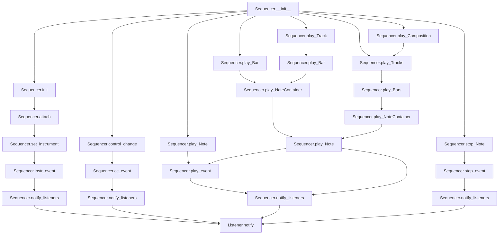

# `sequencer.py`

## `mingus.midi.sequencer.Sequencer` · *class*

## Summary:
A MIDI sequencer abstract base class that manages playback of musical elements including notes, bars, tracks, and compositions through event-based messaging.

## Description:
The Sequencer class serves as an abstract base class for MIDI sequencers, providing a framework for playing musical sequences through MIDI events. It defines the interface for MIDI playback operations and supports various musical constructs from individual notes to complete compositions. Concrete implementations must override the abstract methods to provide actual MIDI functionality.

The class implements a listener pattern where registered listeners receive notifications about playback events through the notify_listeners method. This allows for monitoring and logging of MIDI playback activities without tightly coupling the sequencer logic to specific notification mechanisms.

## State:
- listeners (list): Collection of listener objects that receive notifications about playback events
- output (object): Class attribute representing the MIDI output device (initially None, to be set by subclasses)
- MSG_* constants: Integer identifiers for different message types used in the notification system:
  - MSG_PLAY_INT = 0, MSG_STOP_INT = 1, MSG_CC = 2, MSG_INSTR = 3, MSG_SLEEP = 4
  - MSG_PLAY_NOTE = 5, MSG_STOP_NOTE = 6, MSG_PLAY_NC = 7, MSG_STOP_NC = 8
  - MSG_PLAY_BAR = 9, MSG_PLAY_BARS = 10, MSG_PLAY_TRACK = 11, MSG_PLAY_TRACKS = 12
  - MSG_PLAY_COMPOSITION = 13

## Lifecycle:
- Creation: Instantiate using Sequencer() constructor, which initializes empty listeners list and calls init()
- Usage: Subclasses must implement abstract methods (play_event, stop_event, cc_event, instr_event, sleep) to provide actual MIDI functionality
- Destruction: No explicit cleanup required; relies on Python garbage collection

## Method Map:


## Raises:
- control_change method returns False if control or value parameters are outside valid MIDI range (0-127)
- No explicit exceptions raised by __init__ or other methods

## Example:
```python
# Basic usage pattern for a concrete implementation
class MyMIDISequencer(Sequencer):
    def play_event(self, note, channel, velocity):
        # Implement actual MIDI note playing
        print(f"Playing note {note} on channel {channel} with velocity {velocity}")
        
    def stop_event(self, note, channel):
        # Implement actual MIDI note stopping
        print(f"Stopping note {note} on channel {channel}")
        
    def cc_event(self, channel, control, value):
        # Implement MIDI control change
        print(f"Control change: channel {channel}, control {control}, value {value}")
        
    def instr_event(self, channel, instr, bank):
        # Implement MIDI instrument change
        print(f"Instrument change: channel {channel}, instrument {instr}, bank {bank}")
        
    def sleep(self, seconds):
        # Implement timing delay
        import time
        time.sleep(seconds)

# Create and use the sequencer
sequencer = MyMIDISequencer()

# Register a listener for notifications
class MyListener:
    def notify(self, msg_type, params):
        print(f"MIDI Event: {msg_type}, Details: {params}")

listener = MyListener()
sequencer.attach(listener)

# Play a simple note
sequencer.play_Note("C4", channel=1, velocity=100)
```

### `mingus.midi.sequencer.Sequencer.__init__` · *method*

## Summary:
Initializes a MIDI sequencer instance by setting up an empty listeners list and performing additional initialization.

## Description:
The `__init__` method configures the sequencer's initial state by creating an empty listeners list and invoking the initialization routine. This method establishes the foundation for the sequencer's operation by preparing the listener infrastructure and triggering any additional setup required by the sequencer's implementation.

This method is called automatically during object instantiation and should not be called manually except in special circumstances. The separation of concerns between setting up the listeners list and calling `init()` allows for proper initialization sequencing while maintaining clean object construction.

## Args:
    None

## Returns:
    None

## Raises:
    None explicitly raised by this method

## State Changes:
    Attributes READ: None
    Attributes WRITTEN: 
    - self.listeners: Set to an empty list to prepare for listener registration

## Constraints:
    Preconditions: None
    Postconditions: 
    - self.listeners is initialized as an empty list
    - Additional initialization is performed via self.init() call

## Side Effects:
    None

### `mingus.midi.sequencer.Sequencer.init` · *method*

## Summary:
Initializes the sequencer instance and prepares it for MIDI event processing.

## Description:
This method serves as a placeholder initialization hook that is called during the construction of a Sequencer instance. It is intended to be overridden by subclasses to perform specific initialization tasks. The method currently performs no operations but follows the standard pattern of calling parent initialization methods in inheritance hierarchies.

## Args:
    None

## Returns:
    None

## Raises:
    None

## State Changes:
    Attributes READ: None
    Attributes WRITTEN: None

## Constraints:
    Preconditions: The Sequencer instance must be properly constructed before calling this method.
    Postconditions: The sequencer is initialized and ready for MIDI event processing, though no specific initialization occurs in the base implementation.

## Side Effects:
    None

### `mingus.midi.sequencer.Sequencer.play_event` · *method*

*No documentation generated.*

### `mingus.midi.sequencer.Sequencer.stop_event` · *method*

*No documentation generated.*

### `mingus.midi.sequencer.Sequencer.cc_event` · *method*

## Summary:
Handles MIDI Control Change events by processing channel, control number, and value parameters.

## Description:
This method serves as an abstract interface for handling MIDI Control Change events within the sequencer framework. It is called by the `control_change` method when a valid MIDI control change message is received. The method is intended to be overridden by subclasses to implement specific MIDI control change handling logic.

## Args:
    channel (int): MIDI channel number (0-15)
    control (int): MIDI control number (0-127) 
    value (int): Control value (0-127)

## Returns:
    None: This method does not return any value.

## Raises:
    None: This method does not explicitly raise exceptions, though subclasses may raise exceptions based on their implementation.

## State Changes:
    Attributes READ: None
    Attributes WRITTEN: None

## Constraints:
    Preconditions: 
    - Channel must be between 0 and 15 (inclusive)
    - Control must be between 0 and 127 (inclusive)
    - Value must be between 0 and 127 (inclusive)
    
    Postconditions: 
    - The method is called as part of the control_change workflow
    - Subclasses must implement this method to handle actual MIDI control change processing

## Side Effects:
    None: This method itself does not have side effects. However, subclasses implementing this method may perform MIDI I/O operations or other side effects as part of their control change handling.

### `mingus.midi.sequencer.Sequencer.instr_event` · *method*

*No documentation generated.*

### `mingus.midi.sequencer.Sequencer.sleep` · *method*

## Summary:
Pauses execution for the specified duration in seconds, providing timing control for MIDI sequencing operations.

## Description:
This method provides timing control for MIDI sequencers by temporarily halting execution for a specified period. It is designed to be a blocking operation that prevents further execution until the specified time has elapsed. The method is typically used to create delays between musical events or to synchronize playback with tempo settings.

## Args:
    seconds (float): Number of seconds to pause execution.

## Returns:
    None: This method does not return any value.

## Raises:
    None explicitly documented: Based on the implementation, no exceptions are raised by this method.

## State Changes:
    Attributes READ: None
    Attributes WRITTEN: None

## Constraints:
    Preconditions: 
    - seconds parameter should be a numeric value (int or float)
    
    Postconditions:
    - Execution is suspended for approximately the specified number of seconds
    - Method completes without returning a value

## Side Effects:
    I/O: May involve system timer operations or thread suspension
    External service calls: Potentially interacts with system timing services

### `mingus.midi.sequencer.Sequencer.attach` · *method*

## Summary:
Adds a listener to the sequencer's notification list if it's not already registered.

## Description:
This method implements the observer pattern by registering a listener object to receive notifications when MIDI events occur. The listener must implement a `notify` method that accepts message type and parameters. This method prevents duplicate registrations by checking if the listener is already in the listeners list before appending it.

## Args:
    listener: An object that implements a `notify(msg_type, params)` method to receive event notifications.

## Returns:
    None

## Raises:
    None

## State Changes:
    Attributes READ: self.listeners
    Attributes WRITTEN: self.listeners

## Constraints:
    Preconditions: The listener parameter must be a valid object that can be compared with list members.
    Postconditions: The listener will be added to self.listeners if it was not already present.

## Side Effects:
    None

### `mingus.midi.sequencer.Sequencer.detach` · *method*

*No documentation generated.*

### `mingus.midi.sequencer.Sequencer.notify_listeners` · *method*

## Summary:
Notifies all registered listeners of a MIDI event by invoking their notify method with the message type and parameters.

## Description:
Implements the core broadcasting mechanism of the Observer pattern in the Sequencer class. This method iterates through all currently attached listeners and invokes their notify method with the provided message type and parameters. It serves as the central point for disseminating MIDI events throughout the system to interested observers.

Known callers include:
- `set_instrument()` - notifies listeners of instrument change events
- `control_change()` - notifies listeners of control change events  
- `play_Note()` - notifies listeners of note play events
- Various other playback methods that broadcast MIDI events

This logic is separated into its own method to avoid code duplication and maintain clean separation of concerns, allowing the sequencer to focus on event handling while delegating notification responsibilities to this dedicated method.

## Args:
    msg_type (int): The type of MIDI message being broadcast (e.g., MSG_PLAY_INT, MSG_CC, MSG_INSTR)
    params (dict): A dictionary containing event-specific parameters relevant to the message type

## Returns:
    None

## Raises:
    AttributeError: If any registered listener does not implement a notify method

## State Changes:
    Attributes READ: self.listeners
    Attributes WRITTEN: None

## Constraints:
    Preconditions: 
    - self.listeners must be iterable (list-like structure)
    - Each listener in self.listeners must implement a notify method
    - msg_type and params should be appropriately formatted for the listeners' notify method
    
    Postconditions:
    - All registered listeners will have their notify method called once
    - No modifications are made to the sequencer's internal state

## Side Effects:
    - Invokes external methods on listener objects (their notify methods)
    - Potential side effects depend on the implementation of individual listeners

### `mingus.midi.sequencer.Sequencer.set_instrument` · *method*

## Summary:
Configures a MIDI instrument program for a specified channel and notifies all registered listeners of the change.

## Description:
Sets the instrument program for the given MIDI channel and broadcasts an instrument change event to all registered listeners. This method serves as the primary interface for assigning musical instruments to MIDI channels within the sequencer system.

Known callers include:
- `play_Tracks()` - called when setting up instrument assignments for each track channel before playback begins
- Direct user code - when manually configuring instruments for specific channels

This logic is separated into its own method to maintain clean separation of concerns, avoiding code duplication in various playback contexts, and providing a centralized point for instrument assignment that can trigger appropriate notifications.

## Args:
    channel (int): The MIDI channel number (typically 0-15) to assign the instrument to.
    instr (int): The instrument program number to select.
    bank (int): The bank number to use when selecting the instrument program. Defaults to 0.

## Returns:
    None: This method does not return any value.

## Raises:
    None: This method does not explicitly raise exceptions, though underlying implementations may raise errors.

## State Changes:
    Attributes READ: self.listeners, self.MSG_INSTR
    Attributes WRITTEN: None

## Constraints:
    Preconditions: 
    - The sequencer must be properly initialized
    - The channel, instrument, and bank values should be valid for the underlying MIDI system
    - The instrument event handler (`instr_event`) must be properly implemented in subclasses
    
    Postconditions:
    - The specified MIDI channel will be configured to use the selected instrument program
    - All registered listeners will be notified of the instrument change via MSG_INSTR message

## Side Effects:
    - Invokes the instrument event handler (`instr_event`) to configure the underlying MIDI system
    - Calls the notification system (`notify_listeners`) which may invoke external methods on listener objects

### `mingus.midi.sequencer.Sequencer.control_change` · *method*

## Summary:
Sets a MIDI control change message for a specified channel with given control number and value, notifying attached listeners of the change.

## Description:
This method sends a MIDI control change message to a specific channel with the provided control number and value. It validates that both control and value parameters are within the valid MIDI range [0, 128], and if valid, dispatches the control change event to the sequencer's event handler and notifies all registered listeners. This method serves as the core implementation for MIDI control change messages and is used by convenience methods like modulation(), main_volume(), and pan().

## Args:
    channel (int): The MIDI channel number to send the control change to
    control (int): The control number (0-128) specifying which parameter to change  
    value (int): The control value (0-128) specifying the new parameter value

## Returns:
    bool: True if the control change was successfully sent, False if either control or value was outside the valid range [0, 128]

## Raises:
    None explicitly raised - returns False for invalid inputs instead

## State Changes:
    Attributes READ: self.MSG_CC
    Attributes WRITTEN: None directly, but indirectly affects sequencer state through method calls

## Constraints:
    Preconditions: 
    - Channel should be a valid MIDI channel number
    - Control must be in range [0, 128] inclusive
    - Value must be in range [0, 128] inclusive
    
    Postconditions:
    - If inputs are valid, the control change event is dispatched via self.cc_event()
    - If inputs are valid, listeners are notified with MSG_CC message
    - If inputs are invalid, no changes occur and False is returned

## Side Effects:
    - Calls self.cc_event() to process the MIDI control change event
    - Calls self.notify_listeners() to broadcast the control change to registered listeners
    - May cause external MIDI hardware or software to respond to the control change

### `mingus.midi.sequencer.Sequencer.play_Note` · *method*

*No documentation generated.*

### `mingus.midi.sequencer.Sequencer.stop_Note` · *method*

## Summary:
Stops a MIDI note event and notifies registered listeners of the note stopping.

## Description:
This method terminates a MIDI note playback by sending a stop event to the sequencer backend and notifying all attached listeners of the note stopping. It handles both integer note values and note objects with channel properties, normalizing the note value by adding 12 (to convert from internal representation to standard MIDI note numbers) before processing.

## Args:
    note (int or object): The MIDI note to stop. Can be an integer representing the note number or an object with a note attribute.
    channel (int, optional): The MIDI channel number. Defaults to 1. If the note parameter has a channel attribute, this is overridden.

## Returns:
    bool: Always returns True to indicate successful processing of the stop command.

## Raises:
    None explicitly raised by this method.

## State Changes:
    Attributes READ: None
    Attributes WRITTEN: None

## Constraints:
    Preconditions:
    - The note parameter must be convertible to an integer
    - The channel parameter must be convertible to an integer
    - The sequencer must have a valid stop_event method implemented
    - The sequencer must have valid message constants MSG_STOP_INT and MSG_STOP_NOTE defined

    Postconditions:
    - The specified note on the specified channel will cease playing
    - Two notification events will be sent to registered listeners
    - The method will return True regardless of success/failure of underlying operations

## Side Effects:
    - Calls the underlying sequencer's stop_event method to terminate the note
    - Sends notification messages to all attached listeners via notify_listeners
    - May produce audible sound changes in the audio output if the note was currently playing

### `mingus.midi.sequencer.Sequencer.stop_everything` · *method*

## Summary:
Stops all active MIDI notes across all 16 channels by sending stop commands for 118 possible note values on each channel.

## Description:
This method provides a mechanism to immediately halt all currently playing MIDI notes across all available channels. It systematically sends stop commands for each note value (0-117) on each channel (0-15), effectively clearing the entire MIDI playback state. This is particularly useful for emergency stops, resetting the sequencer state, or ensuring clean termination of MIDI sequences.

## Args:
    None

## Returns:
    None

## Raises:
    None explicitly raised

## State Changes:
    Attributes READ: None
    Attributes WRITTEN: None

## Constraints:
    Preconditions: The Sequencer instance must be properly initialized and connected to a MIDI output device
    Postconditions: All MIDI notes across all channels are stopped, though the actual MIDI messages may not be sent immediately due to buffering or processing delays

## Side Effects:
    I/O: Sends MIDI stop messages to the connected MIDI output device for each note/channel combination
    External service calls: Communicates with the underlying MIDI system through the stop_event method

### `mingus.midi.sequencer.Sequencer.play_NoteContainer` · *method*

## Summary:
Plays all notes contained in a NoteContainer by notifying listeners and sequentially playing each note.

## Description:
This method serves as the primary interface for playing a collection of musical notes stored in a NoteContainer. It broadcasts a notification to all registered listeners about the upcoming note container playback, then iterates through each note in the container and plays them individually using the existing play_Note method. This approach ensures consistent event notification and proper playback sequencing.

Known callers include:
- Various playback methods that need to process collections of notes rather than individual notes
- Higher-level music composition or sequencing functions that work with NoteContainers

This logic is separated into its own method rather than being inlined because it provides a clean abstraction for playing note collections while maintaining consistency with the observer pattern through listener notifications, and it allows for centralized error handling when individual note playback fails.

## Args:
    nc (NoteContainer or None): The container holding the notes to be played, or None to return immediately
    channel (int): MIDI channel number to use for playback (defaults to 1)
    velocity (int): MIDI velocity value for playback (defaults to 100)

## Returns:
    bool: True if all notes were successfully played or if nc is None, False if any note playback failed

## Raises:
    None explicitly raised, but may propagate exceptions from underlying play_Note calls

## State Changes:
    Attributes READ: self.listeners, self.MSG_PLAY_NC
    Attributes WRITTEN: None

## Constraints:
    Preconditions:
    - self.listeners must be iterable and contain objects with notify methods
    - nc should be a valid NoteContainer or None
    - channel should be a valid MIDI channel number
    - velocity should be a valid MIDI velocity value
    
    Postconditions:
    - All registered listeners will be notified of the note container playback
    - If nc is not None, all notes in the container will be processed
    - If any note fails to play, the method returns False immediately

## Side Effects:
    - Invokes notify_listeners() which may cause external methods to be called on listener objects
    - May invoke play_Note() for each note in the container, causing additional notifications
    - Potential MIDI output generation through underlying MIDI system calls

### `mingus.midi.sequencer.Sequencer.stop_NoteContainer` · *method*

## Summary:
Stops all notes contained in a NoteContainer and notifies listeners of the operation.

## Description:
This method terminates playback of all notes within a given NoteContainer by sending individual stop commands to each note and broadcasting a notification to all registered listeners. It serves as a batch operation for stopping multiple notes simultaneously, making it efficient for stopping chords or multi-note musical events.

Known callers include:
- Various playback methods that need to stop groups of notes
- Music composition or sequencing systems that manage note containers

This logic is separated into its own method rather than being inlined because it provides a reusable interface for stopping collections of notes, reducing code duplication and enabling consistent notification behavior across different stopping scenarios.

## Args:
    nc (NoteContainer or None): The container of notes to stop. If None, the method returns immediately with True.
    channel (int, optional): The MIDI channel number to use for stopping notes. Defaults to 1.

## Returns:
    bool: True if all notes in the container were successfully stopped, False if any individual note stop operation failed.

## Raises:
    None explicitly raised by this method.

## State Changes:
    Attributes READ: self.listeners (via notify_listeners)
    Attributes WRITTEN: None

## Constraints:
    Preconditions:
    - The sequencer must have a valid notify_listeners method implemented
    - The sequencer must have a valid stop_Note method implemented
    - The MSG_STOP_NC constant must be defined in the class
    - If nc is not None, it must be iterable and contain valid note objects or integers

    Postconditions:
    - All notes in the container will have their stop operations invoked
    - A notification will be sent to all registered listeners about the note container stop event
    - The method will return True if all individual note stops succeeded, False otherwise

## Side Effects:
    - Invokes the stop_Note method for each note in the container
    - Calls notify_listeners with MSG_STOP_NC message type
    - May produce audible sound changes in the audio output if notes were currently playing

### `mingus.midi.sequencer.Sequencer.play_Bar` · *method*

## Summary:
Plays a musical bar by sequentially processing its note containers with proper timing and tempo handling.

## Description:
This method plays a sequence of musical notes contained in a bar structure, sending appropriate MIDI events and managing timing between notes. It handles tempo changes that may occur within the bar and notifies attached listeners of playback events.

## Args:
    bar: A sequence of note containers representing musical notes in the bar
    channel (int): MIDI channel number to play the notes on, defaults to 1
    bpm (int): Initial beats per minute for playback timing, defaults to 120

## Returns:
    dict: A dictionary containing the final BPM value after processing the bar

## Raises:
    None explicitly raised in the method body

## State Changes:
    Attributes READ: 
    - self.listeners (for notification purposes)
    - self.MSG_PLAY_BAR (message constant)
    - self.MSG_SLEEP (message constant)
    
    Attributes WRITTEN: 
    - None directly modified

## Constraints:
    Preconditions:
    - The bar parameter must be iterable containing note container elements
    - Each element in the bar must be accessible via indexing with [1] and [2] indices
    - The bar elements must have valid timing information in index [1] and note containers in index [2]
    
    Postconditions:
    - All note containers in the bar are played and stopped appropriately
    - The final BPM value reflects any tempo changes that occurred during playback

## Side Effects:
    - Sends MIDI events through play_NoteContainer and stop_NoteContainer
    - Calls sleep() method to pause execution between notes
    - Notifies attached listeners of playback events (MSG_PLAY_BAR, MSG_SLEEP)
    - May modify the bpm variable during execution if tempo changes are detected in note containers

### `mingus.midi.sequencer.Sequencer.play_Bars` · *method*

## Summary:
Plays multiple musical bars in parallel with synchronized timing and BPM adjustments.

## Description:
This method orchestrates the simultaneous playback of multiple musical bars (sequences of note containers) across different MIDI channels. It manages complex timing calculations to ensure proper synchronization between concurrent musical elements, handling dynamic BPM changes within note containers and maintaining precise temporal relationships between notes.

The method is typically called by higher-level playback functions such as `play_Tracks` and `play_Composition` when playing multi-track musical compositions. It serves as the core timing engine for parallel musical execution, managing the lifecycle of note containers and ensuring proper timing synchronization.

## Args:
    bars (list): List of bar objects containing note containers to be played in parallel
    channels (list): List of MIDI channels corresponding to each bar
    bpm (int, optional): Beats per minute for the playback timing. Defaults to 120

## Returns:
    dict: Dictionary containing the final BPM value after playback completion

## Raises:
    None explicitly raised - though underlying methods may raise exceptions

## State Changes:
    Attributes READ: 
        - self.listeners (for notification purposes)
        - self.MSG_PLAY_BARS (message type constant)
        - self.MSG_SLEEP (message type constant)
    
    Attributes WRITTEN:
        - None directly modified (though indirectly affects playback state through method calls)

## Constraints:
    Preconditions:
        - All bars must have the same length property
        - Bars must contain valid note container data structures
        - Channels list must match the number of bars
        - Each bar must contain note containers with proper timing data
    
    Postconditions:
        - All note containers in the bars will be played and stopped appropriately
        - The final BPM value reflects any dynamic BPM changes that occurred during playback

## Side Effects:
    - Calls to `play_NoteContainer` which may generate MIDI events
    - Calls to `stop_NoteContainer` which may generate MIDI stop events  
    - Calls to `sleep` which pauses execution for timing precision
    - Notifications sent to attached listeners via `notify_listeners`
    - Potential MIDI output generation through underlying MIDI system

### `mingus.midi.sequencer.Sequencer.play_Track` · *method*

## Summary:
Plays a sequence of musical bars from a track with proper tempo management and listener notifications.

## Description:
Processes each bar in a musical track sequentially, playing them with appropriate timing and handling tempo changes that may occur within the track. This method notifies attached listeners of the track playback event and delegates individual bar playback to the `play_Bar` method. The method supports dynamic tempo adjustments by updating the BPM value based on changes detected in individual bars.

Known callers include:
- `play_Tracks()` - when processing individual tracks within a collection
- `play_Composition()` - when playing compositions that contain tracks

This logic is separated into its own method to encapsulate the track-level playback behavior, providing a clean interface for playing complete musical sequences while maintaining consistency with the existing bar-based playback architecture.

## Args:
    track: An iterable sequence of musical bars to be played
    channel (int): MIDI channel number to play the track on, defaults to 1
    bpm (int): Initial beats per minute for track playback, defaults to 120

## Returns:
    dict: A dictionary containing the final BPM value after processing all bars in the track

## Raises:
    None explicitly raised in the method body

## State Changes:
    Attributes READ: 
    - self.listeners (for notification purposes)
    - self.MSG_PLAY_TRACK (message constant)
    
    Attributes WRITTEN: 
    - None directly modified

## Constraints:
    Preconditions:
    - The track parameter must be iterable containing bar elements
    - Each bar in the track must be compatible with the `play_Bar` method's expectations
    - The channel parameter should be a valid MIDI channel number
    - The bpm parameter should be a positive integer representing beats per minute
    
    Postconditions:
    - All bars in the track are processed sequentially
    - The final BPM value reflects any tempo changes that occurred during playback

## Side Effects:
    - Notifies attached listeners of track playback events (MSG_PLAY_TRACK)
    - Calls `play_Bar` method for each bar in the track
    - May call `sleep()` method through `play_Bar` to manage timing between bars
    - May modify the bpm variable during execution if tempo changes are detected in individual bars

### `mingus.midi.sequencer.Sequencer.play_Tracks` · *method*

## Summary:
Plays multiple MIDI tracks simultaneously across specified channels, setting appropriate instruments and managing BPM changes during playback.

## Description:
This method orchestrates the simultaneous playback of multiple MIDI tracks across different channels. It first configures the appropriate instruments for each channel based on the track's instrument definition, then plays the tracks bar-by-bar using the parallel bar playback mechanism. The method notifies attached listeners of the playback operation and handles dynamic BPM adjustments that may occur during playback.

This logic is separated into its own method rather than being inlined because it represents a distinct orchestration pattern for multi-track MIDI playback that differs from single-track playback or composition-level playback.

## Args:
    tracks (list): A list of track objects to be played simultaneously
    channels (list): A list of MIDI channel numbers corresponding to each track
    bpm (int, optional): Initial beats per minute for playback. Defaults to 120

## Returns:
    dict: A dictionary containing the final BPM value, or an empty dict if playback was interrupted

## Raises:
    None explicitly raised - however, underlying methods may raise exceptions if the MIDI system is not properly initialized

## State Changes:
    Attributes READ: 
        - self.listeners (for notification purposes)
        - self.MSG_PLAY_TRACKS (notification message type)
    
    Attributes WRITTEN:
        - Calls self.set_instrument() which modifies instrument settings for channels
        - Calls self.notify_listeners() which interacts with the listener system

## Constraints:
    Preconditions:
        - Tracks list must not be empty
        - Channels list must have the same length as tracks list
        - All tracks must have the same number of bars (max_bar determination)
        - Tracks must have valid instrument definitions
    
    Postconditions:
        - All specified channels will have their instruments configured appropriately
        - All tracks will be played completely or until interruption
        - Final BPM value will reflect any changes made during playback

## Side Effects:
    - Notifies attached listeners of playback events
    - Sets MIDI instrument configurations for specified channels
    - Invokes play_Bars method which likely performs actual MIDI output operations
    - May modify global BPM state during playback

### `mingus.midi.sequencer.Sequencer.play_Composition` · *method*

## Summary:
Plays a musical composition by notifying listeners and delegating to the track playback system with appropriate channel assignment.

## Description:
Initiates playback of a musical composition by broadcasting a notification to all registered listeners and then delegating to the underlying track playback mechanism. When no explicit channel mapping is provided, it automatically assigns sequential MIDI channels to each track in the composition.

This method serves as a high-level interface for composition playback, abstracting away the complexity of channel management while maintaining consistency with the sequencer's observer pattern architecture.

Known callers include:
- Direct API calls from user applications wanting to play compositions
- Higher-level music processing pipelines that orchestrate composition playback

This logic is separated into its own method rather than being inlined because it provides a clean abstraction layer between the composition-level interface and the track-level playback implementation, making it easier to extend or modify composition-specific behavior without affecting track-level operations.

## Args:
    composition: The musical composition object to play, expected to have a tracks attribute that is iterable
    channels (list[int], optional): List of MIDI channel numbers to assign to each track. If None, automatically assigns channels 1 through n where n is the number of tracks. Defaults to None.
    bpm (int, optional): Beats per minute tempo for playback. Defaults to 120.

## Returns:
    dict: Dictionary containing the final BPM value after playback ({"bpm": value}) or empty dict if playback fails

## Raises:
    Exception: May propagate exceptions from delegated methods (play_Tracks, notify_listeners)

## State Changes:
    Attributes READ: self.listeners, self.MSG_PLAY_COMPOSITION
    Attributes WRITTEN: None

## Constraints:
    Preconditions:
    - composition must have a tracks attribute that is iterable
    - composition.tracks must contain valid track objects compatible with play_Tracks
    - channels, if provided, must be a list of integers representing valid MIDI channels
    
    Postconditions:
    - All registered listeners will be notified of the composition playback start
    - The composition's tracks will be played sequentially using the specified or auto-assigned channels
    - The method returns the final BPM value used during playback

## Side Effects:
    - Notifies all registered listeners via the observer pattern
    - May cause MIDI output through the underlying MIDI system
    - Triggers playback of notes and musical events through delegated methods

### `mingus.midi.sequencer.Sequencer.modulation` · *method*

## Summary:
Sets the modulation wheel value for a specified MIDI channel, sending a MIDI control change message to adjust the modulation parameter.

## Description:
This method provides a convenient interface for setting the modulation wheel value on a specific MIDI channel. It internally calls the generic control_change method with controller number 1, which corresponds to the modulation wheel in standard MIDI specification. This allows instruments to adjust their modulation parameters such as vibrato depth or pitch bend sensitivity.

## Args:
    channel (int): The MIDI channel number (typically 0-15) to send the modulation change to
    value (int): The modulation value (0-127) representing the modulation intensity

## Returns:
    bool: True if the modulation change was successfully sent, False if the value was outside the valid range [0, 127]

## Raises:
    None explicitly raised - returns False for invalid inputs instead

## State Changes:
    Attributes READ: None
    Attributes WRITTEN: None directly, but indirectly affects sequencer state through control_change method calls

## Constraints:
    Preconditions: 
    - Channel should be a valid MIDI channel number
    - Value must be in range [0, 127] inclusive
    
    Postconditions:
    - If inputs are valid, the modulation change is dispatched via control_change method
    - If inputs are valid, listeners are notified of the modulation change
    - If inputs are invalid, no changes occur and False is returned

## Side Effects:
    - Calls control_change method which may cause external MIDI hardware or software to respond to the modulation change
    - May trigger notification of registered listeners through the sequencer's event system

### `mingus.midi.sequencer.Sequencer.main_volume` · *method*

## Summary:
Sets the main volume for a specified MIDI channel using controller 7.

## Description:
This method provides a convenient interface for setting the main volume of a MIDI channel. It internally calls the control_change method with controller number 7, which is the standard MIDI controller for channel volume. This method is typically used during MIDI sequence playback to adjust volume levels dynamically.

## Args:
    channel (int): The MIDI channel number (0-15) to set the volume for.
    value (int): The volume level to set (0-127, where 0 is silence and 127 is maximum volume).

## Returns:
    The return value of the underlying control_change method call.

## Raises:
    This method raises any exceptions that may be raised by the control_change method.

## State Changes:
    Attributes READ: None
    Attributes WRITTEN: None

## Constraints:
    Preconditions: 
    - Channel must be a valid MIDI channel number (0-15)
    - Value must be within the valid MIDI volume range (0-127)
    
    Postconditions: 
    - The specified MIDI channel's volume is set to the provided value

## Side Effects:
    This method may cause I/O operations if the sequencer sends MIDI messages to a hardware device or software synthesizer.

### `mingus.midi.sequencer.Sequencer.pan` · *method*

## Summary:
Sets the pan position for a MIDI channel using controller 10.

## Description:
This method configures the stereo pan position for a specified MIDI channel. It serves as a convenience wrapper around the general-purpose control_change method, specifically setting controller number 10 which is the standard MIDI pan controller. The pan position determines the spatial placement of the audio signal between left and right speakers.

## Args:
    channel (int): The MIDI channel number (typically 1-16) to set the pan for.
    value (int): The pan value, ranging from 0 (full left) to 127 (full right), with 64 being center.

## Returns:
    bool: True if the pan change was successfully processed, False if invalid parameters were provided.

## Raises:
    None explicitly raised, but invalid parameters may cause the underlying control_change method to return False.

## State Changes:
    Attributes READ: None
    Attributes WRITTEN: None

## Constraints:
    Preconditions: 
    - Channel must be a valid integer representing a MIDI channel
    - Value must be an integer between 0 and 127 inclusive
    
    Postconditions:
    - The pan setting for the specified channel is updated
    - If valid parameters are provided, the underlying control_change method is called

## Side Effects:
    - Calls the underlying control_change method which may result in MIDI output
    - Notifies registered listeners of the control change event

