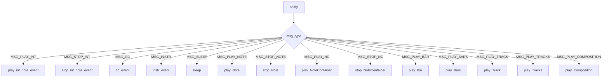

# `sequencer_observer.py`

## `mingus.midi.sequencer_observer.SequencerObserver` · *class*

## Summary:
An abstract observer class that handles MIDI event notifications from a sequencer, defining callback methods for various musical playback events.

## Description:
The SequencerObserver class implements the observer pattern for MIDI sequencer events. It provides a set of abstract methods that concrete implementations must override to handle different types of MIDI events such as note playback, control changes, instrument changes, and timing events. The notify method serves as a central dispatcher that routes incoming messages to the appropriate handler methods based on message type.

This class enables decoupling between the sequencer logic and the specific MIDI event processing, allowing different observers to react to playback events without modifying the sequencer implementation itself.

## State:
- No instance state variables. All behavior is defined through method overrides.

## Lifecycle:
- Creation: Instances are created by subclassing SequencerObserver and implementing the required handler methods
- Usage: Typically used as a listener in a sequencer's notification system, where the notify method is called by the sequencer with message types and parameters
- Destruction: Standard Python object destruction via garbage collection

## Method Map:


## Raises:
- No explicit exceptions raised by __init__ or notify method
- Concrete implementations may raise exceptions based on their MIDI processing logic

## Example:
```python
class MyMIDIPlayer(SequencerObserver):
    def play_int_note_event(self, int_note, channel, velocity):
        # Play a MIDI note using integer note representation
        print(f"Playing note {int_note} on channel {channel} with velocity {velocity}")
        
    def stop_int_note_event(self, int_note, channel):
        # Stop a MIDI note
        print(f"Stopping note {int_note} on channel {channel}")
        
    def cc_event(self, channel, control, value):
        # Handle MIDI control change
        print(f"Control change: channel {channel}, control {control}, value {value}")
        
    def instr_event(self, channel, instr, bank):
        # Handle instrument change
        print(f"Instrument change: channel {channel}, instrument {instr}, bank {bank}")
        
    def sleep(self, seconds):
        # Handle timing delay
        import time
        time.sleep(seconds)
        
    def play_Note(self, note, channel, velocity):
        # Play a Note object
        print(f"Playing note {note} on channel {channel} with velocity {velocity}")

# Usage with a sequencer
player = MyMIDIPlayer()
# Sequencer would call player.notify(msg_type, params) when events occur
```

### `mingus.midi.sequencer_observer.SequencerObserver.play_int_note_event` · *method*

## Summary:
Plays a MIDI note represented as an integer value on a specified channel with given velocity.

## Description:
This method serves as an observer callback that processes integer note playback events. When notified by a sequencer about an integer note to play, this method receives the note number, channel, and velocity parameters to handle the note event appropriately. It is part of the observer pattern implementation where concrete subclasses override this method to provide actual MIDI note playing functionality.

The method is called internally by the Sequencer when it receives a MSG_PLAY_INT message type, which occurs when a sequence contains integer note events that need to be played.

## Args:
    int_note (int): The MIDI note number to play (typically 0-127, where 60 = Middle C)
    channel (int): The MIDI channel number (typically 0-15) on which to play the note
    velocity (int): The velocity (volume) of the note playback, typically in range 0-127

## Returns:
    None: This method does not return any value

## Raises:
    NotImplementedError: This is an abstract method that must be implemented by concrete subclasses

## State Changes:
    Attributes READ: None - This method only processes incoming parameters
    Attributes WRITTEN: None - This method does not modify instance state

## Constraints:
    Preconditions: 
    - The int_note parameter must represent a valid MIDI note number
    - The channel parameter must be a valid MIDI channel (typically 0-15)
    - The velocity parameter must be within valid MIDI velocity range (0-127)
    
    Postconditions: 
    - The method should initiate the appropriate MIDI note playback operation
    - The method should not modify the observer's internal state

## Side Effects:
    I/O: This method typically results in MIDI output operations to play the specified note
    External service calls: May interact with MIDI hardware or software synthesizer

### `mingus.midi.sequencer_observer.SequencerObserver.stop_int_note_event` · *method*

## Summary:
Stops a previously played integer note event on the specified MIDI channel.

## Description:
This method handles the stopping of a MIDI note event represented as an integer value. It is called by the sequencer's notification system when a stop note event is received, specifically when the message type matches Sequencer.MSG_STOP_INT. The method is part of the observer pattern implementation that allows external listeners to react to MIDI playback events.

## Args:
    int_note (int): The integer representation of the MIDI note to stop (typically 0-127)
    channel (int): The MIDI channel number (typically 0-15) on which the note was playing

## Returns:
    None: This method does not return any value

## Raises:
    None: This method does not explicitly raise any exceptions

## State Changes:
    Attributes READ: None
    Attributes WRITTEN: None

## Constraints:
    Preconditions: 
    - The int_note parameter should be a valid MIDI note number (typically 0-127)
    - The channel parameter should be a valid MIDI channel number (typically 0-15)
    - The note should have been previously started with a corresponding play_int_note_event call
    
    Postconditions:
    - The specified note event is stopped on the given channel
    - No further note events should be generated for this note/channel combination

## Side Effects:
    None: This method does not perform any I/O operations or mutate external state

### `mingus.midi.sequencer_observer.SequencerObserver.cc_event` · *method*

## Summary:
Handles MIDI Control Change events by processing channel, control number, and value parameters.

## Description:
This method is invoked when a MIDI Control Change (CC) message is received from a sequencer. It serves as a callback interface for observers to react to MIDI control changes, such as volume adjustments, modulation, or other controller inputs. The method is part of the observer pattern implementation where sequencer events are notified to registered listeners.

This method is called during the sequencer's notification cycle when a control change message is processed, specifically when the message type equals `Sequencer.MSG_CC`.

## Args:
    channel (int): MIDI channel number (typically 0-15, though some implementations support 0-127)
    control (int): Control number identifier (0-127, per MIDI specification)
    value (int): Control value (0-127, per MIDI specification)

## Returns:
    None: This method does not return any value.

## Raises:
    None: This method does not explicitly raise exceptions, though concrete implementations may raise exceptions for invalid parameters.

## State Changes:
    Attributes READ: None
    Attributes WRITTEN: None

## Constraints:
    Preconditions:
    - Channel parameter should typically be in the range 0-15 for standard MIDI channels
    - Control parameter should be in the range 0-127 according to MIDI specification
    - Value parameter should be in the range 0-127 according to MIDI specification
    - The method should be implemented by concrete subclasses to provide actual MIDI functionality

    Postconditions:
    - The method should process the control change event appropriately without modifying the observer's internal state
    - Concrete implementations should handle the control change according to MIDI standards or application-specific requirements

## Side Effects:
    None: This method does not directly perform I/O operations or modify external state. However, concrete implementations may perform MIDI output operations or other side effects as part of their control change handling.

### `mingus.midi.sequencer_observer.SequencerObserver.instr_event` · *method*

## Summary:
Handles MIDI instrument change events by processing channel, instrument, and bank parameters for instrument configuration.

## Description:
Processes instrument change notifications received from a MIDI sequencer. This method is invoked by the Sequencer's notification system when an instrument change message (MSG_INSTR) is received. It serves as a callback interface for observers to respond to MIDI instrument selection events.

The method follows the observer pattern where concrete implementations can define how instrument change events should be handled, such as updating internal state, sending MIDI commands, or logging the event.

## Args:
    channel (int): MIDI channel number (typically 0-15) where the instrument change occurs
    instr (int): MIDI instrument program number (typically 0-127) to change to
    bank (int): MIDI bank number (typically 0-127) for the instrument bank selection

## Returns:
    None: This method does not return any value

## Raises:
    None: This method does not explicitly raise exceptions

## State Changes:
    Attributes READ: None - This method does not read any instance attributes
    Attributes WRITTEN: None - This method does not modify any instance attributes

## Constraints:
    Preconditions: 
    - Channel parameter should be a valid MIDI channel (typically 0-15)
    - Instrument parameter should be a valid MIDI program number (typically 0-127)
    - Bank parameter should be a valid MIDI bank number (typically 0-127)
    
    Postconditions: 
    - Method completes without error for valid parameters
    - No observable state changes to the SequencerObserver instance

## Side Effects:
    None: This method does not perform I/O operations or mutate external state

### `mingus.midi.sequencer_observer.SequencerObserver.sleep` · *method*

## Summary:
Pauses execution for the specified number of seconds, implementing timing control in MIDI playback sequences.

## Description:
This method implements a timing delay that is triggered by the MSG_SLEEP message type from the sequencer's notification system. It is part of the Observer pattern implementation in SequencerObserver, where it handles sleep events during MIDI playback sequences. The method is designed to be overridden by concrete implementations to provide actual sleep functionality.

When the sequencer encounters a sleep command in a playback sequence, it sends a MSG_SLEEP notification to all attached observers, which then invoke this method to pause execution for the specified duration.

## Args:
    seconds (float): Number of seconds to pause execution. Must be non-negative and typically a positive number.

## Returns:
    None: This method does not return a value.

## Raises:
    None: This method does not explicitly raise exceptions, though underlying sleep implementations may raise exceptions for invalid arguments.

## State Changes:
    Attributes READ: None
    Attributes WRITTEN: None

## Constraints:
    Preconditions: The seconds argument must be a non-negative number.
    Postconditions: Execution is paused for the specified duration before continuing.

## Side Effects:
    I/O: Calls the system sleep function, which may cause the process to yield control temporarily.
    External service calls: Uses system-level sleep functionality.

### `mingus.midi.sequencer_observer.SequencerObserver.play_Note` · *method*

## Summary:
Handles the notification of a note playback event by receiving note information and channel data to process the note event.

## Description:
This method serves as an observer callback that processes note playback events. When notified by a sequencer about a note to play, this method receives the note specification, channel number, and velocity parameters to handle the note event appropriately. It is part of the observer pattern implementation where concrete subclasses override this method to provide actual MIDI note playing functionality.

## Args:
    note (str or int): The musical note to play, either as a string representation (e.g., "C4") or integer MIDI note number
    channel (int): The MIDI channel number (typically 0-15) on which to play the note
    velocity (int): The velocity (volume) of the note playback, typically in range 0-127

## Returns:
    None: This method does not return any value

## Raises:
    NotImplementedError: This is an abstract method that must be implemented by concrete subclasses

## State Changes:
    Attributes READ: None - This method only processes incoming parameters
    Attributes WRITTEN: None - This method does not modify instance state

## Constraints:
    Preconditions: 
    - The note parameter must represent a valid musical note
    - The channel parameter must be a valid MIDI channel (typically 0-15)
    - The velocity parameter must be within valid MIDI velocity range (0-127)
    
    Postconditions: 
    - The method should initiate the appropriate MIDI note playback operation
    - The method should not modify the observer's internal state

## Side Effects:
    I/O: This method typically results in MIDI output operations to play the specified note
    External service calls: May interact with MIDI hardware or software synthesizer

### `mingus.midi.sequencer_observer.SequencerObserver.stop_Note` · *method*

## Summary:
Stops a MIDI note event on the specified channel as part of the observer pattern.

## Description:
This method implements the observer interface for handling MIDI note stopping events. It is designed to be overridden by concrete implementations to process requests to stop a specific note on a given MIDI channel. When invoked by the sequencer's notification system, it allows observers to respond appropriately to note stopping events.

## Args:
    note (int or object): The MIDI note to stop. Can be an integer representing the note number or an object with a note attribute.
    channel (int): The MIDI channel number on which to stop the note.

## Returns:
    None: This method does not return a value.

## Raises:
    None explicitly raised by this method.

## State Changes:
    Attributes READ: None
    Attributes WRITTEN: None

## Constraints:
    Preconditions:
    - The note parameter must be convertible to an integer
    - The channel parameter must be convertible to an integer

    Postconditions:
    - The method completes without error
    - The note stopping request is processed by the observer

## Side Effects:
    None: This method does not have observable side effects in its current implementation.

### `mingus.midi.sequencer_observer.SequencerObserver.play_NoteContainer` · *method*

## Summary:
Plays a collection of musical notes contained in a NoteContainer on the specified MIDI channel.

## Description:
This method serves as an observer callback that processes note container playback events. When notified by a sequencer about a group of notes to play, this method receives the note container and channel information to handle the playback operation. It is designed to be overridden by concrete implementations to provide actual MIDI note playing functionality.

Known callers include:
- `SequencerObserver.notify()` when `msg_type == Sequencer.MSG_PLAY_NC`
- Called during playback of musical bars, tracks, or compositions that contain note containers

This logic is separated into its own method rather than being inlined because it provides a clean abstraction for handling note container playback while maintaining consistency with the observer pattern through proper method delegation.

## Args:
    notes (NoteContainer or iterable): A collection of musical note objects to be played together
    channel (int): The MIDI channel number on which to play the notes (typically 0-15)

## Returns:
    None: This is an abstract method that must be implemented by concrete subclasses

## Raises:
    NotImplementedError: This is an abstract method that must be implemented by concrete subclasses

## State Changes:
    Attributes READ: None - This method only processes incoming parameters
    Attributes WRITTEN: None - This method does not modify instance state

## Constraints:
    Preconditions:
    - The notes parameter must be iterable containing valid note objects
    - The channel parameter must be a valid MIDI channel number (typically 0-15)
    - Concrete implementations must provide a working play_Note method
    - The observer must be properly initialized for MIDI operations
    
    Postconditions:
    - Concrete implementations should play all notes in the container through the observer's play_Note method
    - The method should not modify the observer's internal state

## Side Effects:
    I/O: This method typically results in MIDI output operations to play the specified notes
    External service calls: May interact with MIDI hardware or software synthesizer

### `mingus.midi.sequencer_observer.SequencerObserver.stop_NoteContainer` · *method*

## Summary:
Stops all notes contained in a NoteContainer on the specified MIDI channel by processing each note individually.

## Description:
This method implements the observer pattern callback for stopping a collection of musical notes. When notified by a sequencer that a NoteContainer should be stopped, this method iterates through all notes in the container and stops each one individually using the existing stop_Note mechanism. This approach maintains consistency with the observer pattern and ensures proper MIDI note termination.

Known callers include:
- `SequencerObserver.notify()` when `msg_type == Sequencer.MSG_STOP_NC`
- Called during playback of musical bars, tracks, or compositions that contain note containers requiring termination

This logic is separated into its own method rather than being inlined because it provides a clean abstraction for handling note container stopping while maintaining consistency with the observer pattern through proper method delegation. It also allows for centralized processing of note container events without duplicating the iteration logic.

## Args:
    notes (NoteContainer or iterable): A collection of musical note objects to be stopped together
    channel (int): The MIDI channel number on which to stop the notes (typically 0-15)

## Returns:
    None: This method does not return a value.

## Raises:
    None explicitly raised by this method, but may propagate exceptions from underlying stop_Note calls

## State Changes:
    Attributes READ: None - This method only processes incoming parameters
    Attributes WRITTEN: None - This method does not modify instance state

## Constraints:
    Preconditions:
    - The notes parameter must be iterable containing valid note objects
    - The channel parameter must be a valid MIDI channel number (typically 0-15)
    - Concrete implementations must provide a working stop_Note method
    - The observer must be properly initialized for MIDI operations
    
    Postconditions:
    - All notes in the container will be processed for stopping
    - Individual notes will be stopped through the observer's stop_Note method
    - The method should not modify the observer's internal state

## Side Effects:
    I/O: This method typically results in MIDI output operations to stop the specified notes
    External service calls: May interact with MIDI hardware or software synthesizer through the stop_Note method

### `mingus.midi.sequencer_observer.SequencerObserver.play_Bar` · *method*

## Summary:
Plays a single musical bar (measure) on the specified MIDI channel with the given tempo.

## Description:
This method executes the playback of a single musical bar (measure) using the MIDI sequencer system. It is designed to be called by the sequencer's notification system when a MSG_PLAY_BAR event is received, typically as part of a larger playback operation involving tracks or compositions. The method processes the bar's musical content on the specified MIDI channel at the provided tempo rate.

Known callers include:
- `notify()` method when receiving Sequencer.MSG_PLAY_BAR messages
- Indirectly called by `play_Track()` when processing individual bars in a track sequence

This logic is separated into its own method to provide a clean abstraction for bar-level playback operations while maintaining consistency with the existing sequencer architecture that handles note containers, tracks, and compositions through similar patterns.

## Args:
    bar: A musical bar/measure object containing note data to be played
    channel (int): MIDI channel number (typically 1-16) on which to play the bar
    bpm (int): Beats per minute tempo setting for the bar playback, typically 40-240

## Returns:
    None: This method performs playback operations but does not return a value

## Raises:
    None explicitly raised by this method - though underlying MIDI operations may raise exceptions

## State Changes:
    Attributes READ: 
        - None directly accessed (method is stateless in terms of object attributes)
    
    Attributes WRITTEN:
        - None directly modified (though indirectly affects playback state through MIDI operations)

## Constraints:
    Preconditions:
        - The bar parameter must contain valid musical data compatible with MIDI playback
        - The channel parameter must be a valid MIDI channel number (typically 1-16)
        - The bpm parameter should be a positive integer representing tempo in beats per minute
    
    Postconditions:
        - The bar's musical content is played through MIDI output on the specified channel
        - Playback occurs at the specified tempo rate

## Side Effects:
    - Generates MIDI events through underlying MIDI system
    - May cause timing delays through sleep operations for tempo synchronization
    - Triggers MIDI output generation through the sequencer's MIDI interface
    - May notify attached listeners of playback events

### `mingus.midi.sequencer_observer.SequencerObserver.play_Bars` · *method*

## Summary:
Plays multiple musical bars sequentially on assigned MIDI channels with specified tempo.

## Description:
Executes playback of multiple musical bars by sequentially processing each bar with its corresponding MIDI channel and BPM setting. This method serves as a listener callback that handles MSG_PLAY_BARS notifications from the Sequencer. It iterates through the provided bars list and plays each bar on its designated channel while maintaining proper timing and tempo control.

The method is part of the observer pattern implementation where the Sequencer notifies registered listeners about playback events. It enables playback monitoring and execution for multiple bars in sequence rather than in parallel.

## Args:
    bars (list): List of musical bar objects to be played sequentially
    channels (list): List of MIDI channel numbers corresponding to each bar in the bars list
    bpm (int): Beats per minute tempo setting for the playback, defaults to 120

## Returns:
    None: This method does not return any value

## Raises:
    None explicitly raised by this method

## State Changes:
    Attributes READ: 
    - None directly accessed

    Attributes WRITTEN:
    - None directly modified

## Constraints:
    Preconditions:
    - The bars list must contain valid musical bar objects
    - The channels list must contain the same number of elements as the bars list
    - Each channel in the channels list must be a valid MIDI channel number
    - The bpm parameter should be a positive integer representing tempo

    Postconditions:
    - Each bar in the bars list will be played using the play_Bar method
    - Each bar will be played on its corresponding channel from the channels list
    - Playback timing will respect the provided BPM setting

## Side Effects:
    - Invokes play_Bar method for each bar with its corresponding channel and BPM
    - May generate MIDI events through the underlying play_Bar implementation
    - Causes temporary blocking during playback due to timing requirements

### `mingus.midi.sequencer_observer.SequencerObserver.play_Track` · *method*

## Summary:
Plays a sequence of musical bars from a track with proper tempo management and listener notifications.

## Description:
Processes each bar in a musical track sequentially, playing them with appropriate timing and handling tempo changes that may occur within the track. This method notifies attached listeners of the track playback event and delegates individual bar playback to the `play_Bar` method. The method supports dynamic tempo adjustments by updating the BPM value based on changes detected in individual bars.

Known callers include:
- `play_Tracks()` - when processing individual tracks within a collection
- `play_Composition()` - when playing compositions that contain tracks

This logic is separated into its own method to encapsulate the track-level playback behavior, providing a clean interface for playing complete musical sequences while maintaining consistency with the existing bar-based playback architecture.

## Args:
    track: An iterable sequence of musical bars to be played
    channel (int): MIDI channel number to play the track on, defaults to 1
    bpm (int): Initial beats per minute for track playback, defaults to 120

## Returns:
    dict: A dictionary containing the final BPM value after processing all bars in the track

## Raises:
    None explicitly raised in the method body

## State Changes:
    Attributes READ: 
    - self.listeners (for notification purposes)
    - self.MSG_PLAY_TRACK (message constant)
    
    Attributes WRITTEN: 
    - None directly modified

## Constraints:
    Preconditions:
    - The track parameter must be iterable containing bar elements
    - Each bar in the track must be compatible with the `play_Bar` method's expectations
    - The channel parameter should be a valid MIDI channel number
    - The bpm parameter should be a positive integer representing beats per minute
    
    Postconditions:
    - All bars in the track are processed sequentially
    - The final BPM value reflects any tempo changes that occurred during playback

## Side Effects:
    - Notifies attached listeners of track playback events (MSG_PLAY_TRACK)
    - Calls `play_Bar` method for each bar in the track
    - May call `sleep()` method through `play_Bar` to manage timing between bars
    - May modify the bpm variable during execution if tempo changes are detected in individual bars

### `mingus.midi.sequencer_observer.SequencerObserver.play_Tracks` · *method*

## Summary:
Plays multiple musical tracks sequentially on assigned MIDI channels with specified tempo.

## Description:
Executes playback of multiple musical tracks by processing each track with its corresponding MIDI channel and BPM setting. This method is designed to handle MSG_PLAY_TRACKS notifications from the Sequencer, enabling sequential playback of multiple musical tracks.

The method follows a pattern consistent with other playback methods in the SequencerObserver class such as play_Bars and play_Track, suggesting it processes collections of musical elements sequentially.

## Args:
    tracks (list): List of musical track objects to be played sequentially
    channels (list): List of MIDI channel numbers corresponding to each track in the tracks list
    bpm (int): Beats per minute tempo setting for the playback

## Returns:
    None: This method does not return any value

## Raises:
    None explicitly raised by this method

## State Changes:
    Attributes READ: 
    - None directly accessed

    Attributes WRITTEN:
    - None directly modified

## Constraints:
    Preconditions:
    - The tracks list must contain valid musical track objects
    - The channels list must contain the same number of elements as the tracks list
    - Each channel in the channels list must be a valid MIDI channel number
    - The bpm parameter should be a positive integer representing tempo

    Postconditions:
    - Each track in the tracks list should be processed for playback
    - Each track should be played on its corresponding channel from the channels list
    - Playback timing should respect the provided BPM setting

## Side Effects:
    - May invoke other playback methods (such as play_Track) for individual track processing
    - May generate MIDI events through underlying playback mechanisms
    - Causes temporary blocking during playback due to timing requirements

### `mingus.midi.sequencer_observer.SequencerObserver.play_Composition` · *method*

## Summary:
Plays a musical composition by notifying listeners and delegating to the track playback system with appropriate channel assignment.

## Description:
Initiates playback of a musical composition by broadcasting a notification to all registered listeners and then delegating to the underlying track playback mechanism. When no explicit channel mapping is provided, it automatically assigns sequential MIDI channels to each track in the composition.

This method serves as a high-level interface for composition playback, abstracting away the complexity of channel management while maintaining consistency with the sequencer's observer pattern architecture.

Known callers include:
- Direct API calls from user applications wanting to play compositions
- Higher-level music processing pipelines that orchestrate composition playback

This logic is separated into its own method rather than being inlined because it provides a clean abstraction layer between the composition-level interface and the track-level playback implementation, making it easier to extend or modify composition-specific behavior without affecting track-level operations.

## Args:
    composition: The musical composition object to play, expected to have a tracks attribute that is iterable
    channels (list[int], optional): List of MIDI channel numbers to assign to each track. If None, automatically assigns channels 1 through n where n is the number of tracks. Defaults to None.
    bpm (int, optional): Beats per minute tempo for playback. Defaults to 120.

## Returns:
    dict: Dictionary containing the final BPM value after playback ({"bpm": value}) or empty dict if playback fails

## Raises:
    Exception: May propagate exceptions from delegated methods (play_Tracks, notify_listeners)

## State Changes:
    Attributes READ: self.listeners, self.MSG_PLAY_COMPOSITION
    Attributes WRITTEN: None

## Constraints:
    Preconditions:
    - composition must have a tracks attribute that is iterable
    - composition.tracks must contain valid track objects compatible with play_Tracks
    - channels, if provided, must be a list of integers representing valid MIDI channels
    
    Postconditions:
    - All registered listeners will be notified of the composition playback start
    - The composition's tracks will be played sequentially using the specified or auto-assigned channels
    - The method returns the final BPM value used during playback

## Side Effects:
    - Notifies all registered listeners via the observer pattern
    - May cause MIDI output through the underlying MIDI system
    - Triggers playback of notes and musical events through delegated methods

### `mingus.midi.sequencer_observer.SequencerObserver.notify` · *method*

## Summary:
Routes MIDI sequencer messages to appropriate event handlers based on message type.

## Description:
This method serves as a message dispatcher for the SequencerObserver, routing different MIDI sequencer events to their corresponding handler methods. It receives a message type identifier and associated parameters, then invokes the appropriate handler method based on the message type. This design enables the observer to respond to various MIDI events such as note playback, control changes, instrument changes, and timing events without requiring separate notification methods for each event type.

The method is called by the Sequencer's notification system when various MIDI events occur, allowing observers to react to playback activities in a standardized way.

## Args:
    msg_type (int): Identifier indicating the type of MIDI event being notified. Must correspond to one of the Sequencer.MSG_* constants.
    params (dict): Dictionary containing event-specific parameters required by the target handler method.

## Returns:
    None: This method does not return any value.

## Raises:
    KeyError: If the params dictionary is missing required keys for a particular message type.
    AttributeError: If the Sequencer class or its MSG_* constants are not properly imported or defined.

## State Changes:
    Attributes READ: None - This method does not read any instance attributes of SequencerObserver.
    Attributes WRITTEN: None - This method does not modify any instance attributes of SequencerObserver.

## Constraints:
    Preconditions:
    - msg_type must be one of the predefined Sequencer.MSG_* constants
    - params must contain all required keys for the specified message type
    - The Sequencer class and its MSG_* constants must be properly imported
    - All handler methods (play_int_note_event, stop_int_note_event, etc.) must be implemented by concrete subclasses

    Postconditions:
    - The appropriate handler method is called with the correct parameters
    - No modifications are made to the SequencerObserver's internal state
    - The method completes execution without returning a value

## Side Effects:
    None: This method itself does not perform I/O operations or modify external state. However, the handler methods it calls may perform MIDI output operations or other side effects as part of their implementation.

