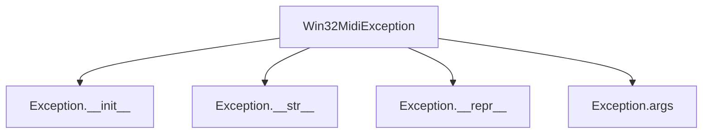
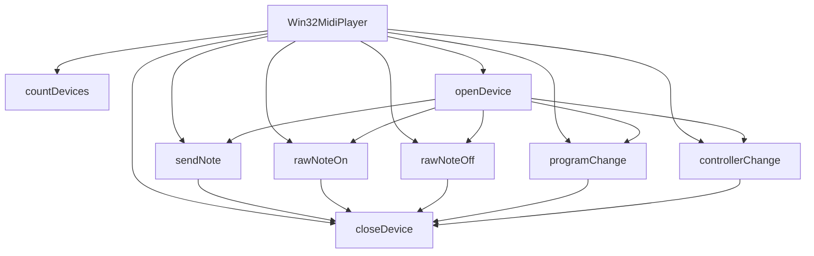

# `win32midi.py`

## `mingus.midi.win32midi.Win32MidiException` · *class*

## Summary:
Custom exception class for Win32 MIDI-related errors in the mingus library.

## Description:
Win32MidiException is a specialized exception type designed to handle errors that occur during Windows MIDI operations within the mingus music library. This exception serves as a distinct error type that allows callers to differentiate MIDI-specific failures from general Python exceptions. It inherits from Python's standard Exception class, providing all standard exception functionality while maintaining semantic clarity for MIDI-related issues.

This exception is typically raised when Windows MIDI API calls fail or when MIDI operations encounter problems specific to the Windows platform. Known callers include various MIDI operation functions within the win32midi module that interface with Windows' MIDI subsystem through ctypes.

## State:
The class has no instance attributes beyond those inherited from Exception. As a minimal exception class, it doesn't maintain any internal state that affects its behavior or validity.

## Lifecycle:
Creation: Instances are created by raising the exception directly (e.g., raise Win32MidiException("message")) or through exception propagation from underlying MIDI operations. No special instantiation requirements exist beyond standard exception creation patterns.

Usage: Once created, the exception follows normal Python exception handling patterns - it can be caught using try/except blocks, re-raised, or allowed to propagate up the call stack. The exception object itself is immutable once created.

Destruction: Like all Python exceptions, cleanup is automatic when the exception object goes out of scope or is handled by an exception handler.

## Method Map:


## Raises:
This class itself does not raise any exceptions during initialization or usage. However, instances of this exception may be raised by other components in the win32midi module when Windows MIDI operations fail, such as:
- When MIDI device opening fails
- When MIDI message sending operations fail
- When Windows MIDI API calls return error codes

## Example:
```python
try:
    # Some Windows MIDI operation
    midi_device = open_midi_device("MIDI-Out")
    send_midi_message(midi_device, note_on_message)
except Win32MidiException as e:
    print(f"MIDI operation failed: {e}")
    # Handle MIDI-specific error appropriately
```

## `mingus.midi.win32midi.Win32MidiPlayer` · *class*

## Summary:
A Windows MIDI player that interfaces with the Windows multimedia API to send MIDI messages to connected MIDI devices.

## Description:
This class provides a high-level interface for playing MIDI notes and sending MIDI control messages on Windows systems using the winmm.dll library. It abstracts the complexity of Windows MIDI API calls and provides convenient methods for common MIDI operations like playing notes, changing programs, and sending controller messages. The class is designed to work with Windows systems that have MIDI support through the Windows Multimedia API.

## State:
- `midiOutOpenErrorCodes` (dict): Maps MIDI error codes to descriptive error messages for device opening operations
- `midiOutShortErrorCodes` (dict): Maps MIDI error codes to descriptive error messages for short message operations  
- `winmm` (ctypes.windll): Reference to the Windows multimedia DLL for making MIDI API calls
- `hmidi` (c_void_p): Handle to the opened MIDI device, set during `openDevice()` call

## Lifecycle:
1. **Creation**: Instantiate with `Win32MidiPlayer()`
2. **Usage**: 
   - Call `openDevice()` to connect to a MIDI device
   - Use methods like `sendNote()`, `rawNoteOn()`, `rawNoteOff()`, `programChange()`, `controllerChange()` to send MIDI messages
   - Call `closeDevice()` to cleanly disconnect from the MIDI device
3. **Destruction**: The class doesn't require explicit cleanup beyond calling `closeDevice()`

## Method Map:


## Raises:
- `Win32MidiException`: Raised when MIDI operations fail due to device errors, invalid handles, or other MIDI-related issues. The exception includes descriptive error messages based on the Windows MIDI error codes.

## Example:
```python
# Create a MIDI player instance
player = Win32MidiPlayer()

# Open the default MIDI device
player.openDevice()

# Play a middle C note for 1 second at medium volume
player.sendNote(60, duration=1.0, volume=60)

# Send a program change to switch to piano sound
player.programChange(0, channel=1)

# Close the device when done
player.closeDevice()
```

### `mingus.midi.win32midi.Win32MidiPlayer.__init__` · *method*

## Summary:
Initializes a Win32MidiPlayer instance by setting up error code mappings and Windows multimedia API references for MIDI operations.

## Description:
The constructor method prepares a Win32MidiPlayer instance for MIDI operations by initializing error code dictionaries and establishing a reference to the Windows multimedia API. This method is automatically called when creating a new Win32MidiPlayer instance and sets up the foundational state required for subsequent MIDI operations.

This logic is separated from other initialization logic to provide a clean constructor that focuses specifically on setting up error handling and system API access, rather than device connection or other operational aspects.

## Args:
    None: This method takes no arguments beyond the implicit self parameter.

## Returns:
    None: This method does not return a value.

## Raises:
    None: This method does not raise any exceptions.

## State Changes:
    Attributes READ: None
    Attributes WRITTEN: 
        - self.midiOutOpenErrorCodes: Dictionary mapping MIDI error codes to descriptive messages for device opening operations
        - self.midiOutShortErrorCodes: Dictionary mapping MIDI error codes to descriptive messages for short message operations  
        - self.winmm: Reference to the Windows multimedia DLL (windll.winmm) for making MIDI API calls

## Constraints:
    Preconditions: None
    Postconditions: 
        - The instance has error code dictionaries populated for MIDI operation error handling
        - The instance has a valid reference to the Windows multimedia API
        - The instance is ready for subsequent MIDI operations that require error code lookup or API calls

## Side Effects:
    None: This method performs no I/O operations or external service calls. It only initializes internal state attributes.

### `mingus.midi.win32midi.Win32MidiPlayer.countDevices` · *method*

## Summary:
Returns the total number of MIDI output devices available on the Windows system.

## Description:
This method provides a count of all MIDI output devices installed on the Windows system by calling the Windows Multimedia API function midiOutGetNumDevs(). It serves as a utility method to enumerate available MIDI hardware before attempting to open and use specific devices. This information is useful for applications that need to select from multiple MIDI output devices or validate device availability.

The method is typically used during initialization or setup phases of MIDI applications to determine what MIDI output devices are accessible to the user's system. It's separated from inline code to provide a clean abstraction layer for Windows MIDI device enumeration and to centralize the Windows API interaction.

## Args:
    None

## Returns:
    int: The number of MIDI output devices available on the system. Returns 0 if no MIDI output devices are found.

## Raises:
    None

## State Changes:
    Attributes READ: self.winmm
    Attributes WRITTEN: None

## Constraints:
    Preconditions:
    - The Win32MidiPlayer instance must be properly initialized
    - The self.winmm attribute must be correctly set to windll.winmm
    - The Windows system must support the Multimedia API
    
    Postconditions:
    - The method does not modify any instance attributes
    - The method returns a non-negative integer representing device count

## Side Effects:
    External Service Call: Makes a Windows API call to the multimedia MIDI subsystem via ctypes
    I/O: Accesses system MIDI device enumeration through Windows winmm.dll

### `mingus.midi.win32midi.Win32MidiPlayer.openDevice` · *method*

## Summary:
Opens a MIDI output device for playback using Windows multimedia API, storing the device handle for subsequent MIDI operations.

## Description:
Initializes a connection to a MIDI output device through the Windows multimedia API. This method prepares the Win32MidiPlayer instance for sending MIDI messages by establishing a device handle. When deviceNumber is -1, it uses the default MIDI mapper device configured in the system, which is typically the recommended approach for most applications.

## Args:
    deviceNumber (int): MIDI device identifier to open. Defaults to -1, which selects the default device via the MIDI mapper. Valid values are typically 0 to (countDevices() - 1) for specific devices, or -1 for the system default.

## Returns:
    None: This method does not return a value. On success, it sets the internal self.hmidi attribute to reference the opened device handle.

## Raises:
    Win32MidiException: Raised when the Windows MIDI API call to midiOutOpen fails. The exception message includes specific error information from self.midiOutOpenErrorCodes mapping based on the returned error code.

## State Changes:
    Attributes READ: self.winmm, self.midiOutOpenErrorCodes
    Attributes WRITTEN: self.hmidi

## Constraints:
    Preconditions: 
    - The Win32MidiPlayer instance must be initialized (has self.winmm attribute)
    - The deviceNumber must be a valid integer or -1 (default)
    - The Windows multimedia system must be available and properly configured
    
    Postconditions:
    - On successful execution, self.hmidi contains a valid handle to the opened MIDI device
    - The device handle is ready for use in subsequent MIDI operations like sendNote, rawNoteOn, etc.

## Side Effects:
    I/O: Makes a system call to the Windows multimedia API (midiOutOpen) which may involve hardware I/O operations.
    Resource allocation: Allocates system resources for the MIDI device handle.

### `mingus.midi.win32midi.Win32MidiPlayer.closeDevice` · *method*

## Summary:
Closes the currently opened MIDI output device and releases associated system resources.

## Description:
The closeDevice method terminates the connection to a previously opened MIDI output device by calling the Windows multimedia MIDI API function midiOutClose. This method is part of the Win32MidiPlayer class's lifecycle management, ensuring proper cleanup of MIDI device resources when they are no longer needed. The method should be called after completing MIDI operations to prevent resource leaks and ensure the MIDI device becomes available for other applications.

This method is typically called during object cleanup or when transitioning between different MIDI operations. It's separated from inline code to provide a clean abstraction layer for MIDI device management and to centralize error handling for device closure operations.

## Args:
    None

## Returns:
    None

## Raises:
    Win32MidiException: Raised when the Windows MIDI API call to midiOutClose returns a non-zero error code, indicating failure to properly close the MIDI device.

## State Changes:
    Attributes READ: self.winmm, self.hmidi
    Attributes WRITTEN: None

## Constraints:
    Preconditions: 
    - The MIDI device must have been previously opened using the openDevice method
    - The self.hmidi attribute must contain a valid MIDI device handle
    - The self.winmm attribute must be properly initialized (typically set to windll.winmm)
    
    Postconditions:
    - The MIDI device handle (self.hmidi) remains accessible but becomes invalid for further MIDI operations
    - System resources associated with the MIDI device are released back to the operating system
    - The method does not modify any other instance attributes

## Side Effects:
    I/O: Makes a Windows API call to the multimedia MIDI subsystem via ctypes
    Resource Management: Releases system resources associated with the MIDI output device
    External Service Call: Calls Windows winmm.dll API function midiOutClose

### `mingus.midi.win32midi.Win32MidiPlayer.sendNote` · *method*

## Summary:
Sends a complete MIDI note message with specified pitch, duration, channel, and volume by transmitting a note-on message followed by a note-off message after the specified duration.

## Description:
This method provides a convenient way to play a single MIDI note for a specified duration. It automatically handles the complete note playback cycle by sending a note-on message, waiting for the specified duration, and then sending a note-off message. This is the primary method for playing individual notes in the Win32MidiPlayer system.

The method is called during the music playback lifecycle when individual notes need to be triggered. It's particularly useful for simple melody playback or basic musical composition where each note needs to be played for a specific amount of time.

This logic is separated from inline code to provide a clean abstraction for complete note playback and to avoid code duplication. It encapsulates the common pattern of sending a note-on message, sleeping for the duration, and then sending a note-off message.

## Args:
    pitch (int): The MIDI pitch value (0-127) for the note to be played. Defaults to 60 (middle C).
    duration (float): The duration in seconds to hold the note. Defaults to 1.0 seconds.
    channel (int): The MIDI channel number (1-16) to send the message on. Defaults to 1.
    volume (int): The velocity value (0-127) for the note. Defaults to 60.

## Returns:
    None: This method does not return any value.

## Raises:
    Win32MidiException: Raised when either the note-on or note-off MIDI message cannot be sent successfully. The exception includes specific error information from the Windows MIDI API error codes mapping.

## State Changes:
    Attributes READ: 
        - self.winmm: Reference to the Windows multimedia MIDI DLL
        - self.hmidi: Handle to the currently opened MIDI device
        - self.midiOutShortErrorCodes: Dictionary mapping error codes to descriptions
    
    Attributes WRITTEN: 
        - None: This method does not modify any instance attributes.

## Constraints:
    Preconditions:
        - A MIDI device must be opened via the `openDevice()` method before calling this method
        - The pitch value must be between 0 and 127
        - The channel value must be between 1 and 16
        - The volume value must be between 0 and 127
        - The duration must be a positive number
    
    Postconditions:
        - The note-on message is sent to the MIDI device
        - The method waits for the specified duration
        - The note-off message is sent to the MIDI device
        - If successful, the note will be audible for the specified duration

## Side Effects:
    - Makes two Windows API calls to the multimedia MIDI API (midiOutShortMsg) 
    - May cause audible sound output if a MIDI synthesizer is connected
    - Performs I/O operations to communicate with the Windows MIDI subsystem
    - Sleeps for the specified duration, blocking execution during that time

### `mingus.midi.win32midi.Win32MidiPlayer.rawNoteOn` · *method*

## Summary:
Sends a raw MIDI note-on message to the currently opened MIDI device.

## Description:
This method constructs and transmits a MIDI note-on message using the Windows multimedia MIDI API. It provides a low-level interface for direct MIDI message control without automatic note-off handling. This method is typically used when fine-grained control over MIDI events is required, such as in real-time MIDI sequencing or custom MIDI applications.

## Args:
    pitch (int): The MIDI pitch value (0-127) for the note to be played.
    channel (int): The MIDI channel number (1-16), defaults to 1.
    v (int): The velocity value (0-127) for the note, defaults to 60.

## Returns:
    None: This method does not return any value.

## Raises:
    Win32MidiException: When the MIDI message cannot be sent successfully, with detailed error information from the Windows MIDI API.

## State Changes:
    Attributes READ: 
        - self.winmm: Reference to the Windows multimedia MIDI DLL
        - self.hmidi: Handle to the currently opened MIDI device
        - self.midiOutShortErrorCodes: Dictionary mapping error codes to descriptions
    
    Attributes WRITTEN: 
        - None: This method does not modify any instance attributes.

## Constraints:
    Preconditions:
        - A MIDI device must be opened using the `openDevice()` method before calling this method.
        - The pitch value must be between 0 and 127.
        - The channel value must be between 1 and 16.
        - The velocity value must be between 0 and 127.
    
    Postconditions:
        - The MIDI note-on message is sent to the device.
        - If successful, the note will begin playing on the specified channel.
        - If an error occurs, a Win32MidiException is raised with specific error details.

## Side Effects:
    - Makes a system call to the Windows multimedia MIDI API (midiOutShortMsg)
    - May cause audible sound output if a MIDI synthesizer is connected
    - No external service calls beyond the Windows API

### `mingus.midi.win32midi.Win32MidiPlayer.rawNoteOff` · *method*

## Summary:
Sends a MIDI note off message to stop a previously played note on the specified channel.

## Description:
The rawNoteOff method constructs and sends a MIDI short message with the note off status byte (0x80) to terminate a note that was previously started with rawNoteOn. This method is typically used internally by the sendNote method to complete a note playback cycle, or can be called directly when precise MIDI control is needed.

This method is separated from inline code to provide a clean abstraction for MIDI note termination and to maintain consistency with the rawNoteOn method, which performs the corresponding note on operation. The separation allows for better code organization and makes it easier to extend note-off functionality independently.

## Args:
    pitch (int): The MIDI pitch value (0-127) of the note to stop.
    channel (int): The MIDI channel number (1-16) to send the message on. Defaults to 1.

## Returns:
    None: This method does not return any value.

## Raises:
    Win32MidiException: Raised when the Windows MIDI API fails to send the note off message, with an error message indicating the specific failure reason from the MIDI error codes mapping.

## State Changes:
    Attributes READ: 
        - self.winmm: Reference to the Windows multimedia MIDI library
        - self.hmidi: Handle to the opened MIDI device
        - self.midiOutShortErrorCodes: Dictionary mapping MIDI error codes to descriptive messages
    
    Attributes WRITTEN: 
        - None: This method does not modify any instance attributes.

## Constraints:
    Preconditions:
        - The MIDI device must be opened via openDevice() before calling this method
        - The pitch value must be within the valid MIDI range (0-127)
        - The channel value must be within the valid MIDI channel range (1-16)
    
    Postconditions:
        - A MIDI note off message is sent to the currently opened device
        - The method either completes successfully or raises a Win32MidiException

## Side Effects:
    - Makes a Windows API call to midiOutShortMsg through the winmm library
    - May cause audible sound changes on the connected MIDI device
    - Performs I/O operations to communicate with the Windows MIDI subsystem

### `mingus.midi.win32midi.Win32MidiPlayer.programChange` · *method*

## Summary:
Changes the MIDI program (instrument) on a specified channel by sending a program change message to the MIDI device.

## Description:
This method sends a MIDI program change message to the currently opened MIDI device, allowing the user to switch instruments or programs on a specific MIDI channel. The method constructs a standard MIDI program change message using the Windows Multimedia API and handles any errors that may occur during transmission.

## Args:
    program (int): The program number (0-127) to select as the new instrument. Valid range is typically 0-127 for standard GM instruments.
    channel (int): The MIDI channel number (1-16) to send the program change message to. Defaults to 1.

## Returns:
    None: This method does not return any value.

## Raises:
    Win32MidiException: Raised when the Windows MIDI API fails to send the program change message. The exception includes detailed error information from the MIDI error codes dictionary.

## State Changes:
    Attributes READ: 
        - self.winmm: Windows Multimedia API library reference
        - self.hmidi: MIDI device handle
        - self.midiOutShortErrorCodes: Dictionary mapping MIDI error codes to human-readable descriptions
    
    Attributes WRITTEN: None

## Constraints:
    Preconditions:
        - The MIDI device must be opened via `openDevice()` before calling this method
        - Program number must be in range [0, 127]
        - Channel must be in range [1, 16]
    
    Postconditions:
        - The program change message is sent to the MIDI device
        - If successful, the instrument on the specified channel is changed
        - If failed, a Win32MidiException is raised with error details

## Side Effects:
    - Makes a system call to the Windows Multimedia API (via ctypes)
    - May cause real-time changes to MIDI device instrument settings

### `mingus.midi.win32midi.Win32MidiPlayer.controllerChange` · *method*

## Summary:
Sends a MIDI controller change message to modify real-time controller settings on a specified MIDI channel.

## Description:
This method constructs and transmits a MIDI controller change message using the Windows Multimedia API. It allows modification of various controller parameters such as volume, pan, modulation, and other real-time controller settings. The method follows the standard MIDI controller change message format (status byte 0xB0) and is part of the Win32MidiPlayer's interface for low-level MIDI control.

## Args:
    controller (int): The controller number (0-127) to change. Common controllers include 1 (modulation), 7 (volume), 10 (pan), 11 (expression), etc.
    val (int): The controller value (0-127) to set for the specified controller.
    channel (int): The MIDI channel number (1-16) to send the message to. Defaults to 1.

## Returns:
    None: This method does not return any value.

## Raises:
    Win32MidiException: Raised when the Windows MIDI API fails to send the controller change message. The exception includes detailed error information from the MIDI error codes dictionary.

## State Changes:
    Attributes READ: 
        - self.winmm: Windows Multimedia API library reference
        - self.hmidi: MIDI device handle
        - self.midiOutShortErrorCodes: Dictionary mapping MIDI error codes to human-readable descriptions
    
    Attributes WRITTEN: None

## Constraints:
    Preconditions:
        - The MIDI device must be opened via `openDevice()` before calling this method
        - Controller number must be in range [0, 127]
        - Value must be in range [0, 127]
        - Channel must be in range [1, 16]
    
    Postconditions:
        - The controller change message is sent to the MIDI device
        - If successful, the controller setting is updated on the specified channel
        - If failed, a Win32MidiException is raised with error details

## Side Effects:
    - Makes a system call to the Windows Multimedia API (via ctypes)
    - May cause real-time changes to MIDI device settings
    - Blocks execution while waiting for the MIDI message to be processed

