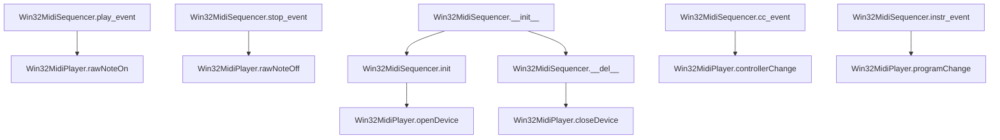

# `win32midisequencer.py`

## `mingus.midi.win32midisequencer.Win32MidiSequencer` · *class*

## Summary:
A Windows-specific MIDI sequencer implementation that translates MIDI events into native Windows MIDI operations.

## Description:
The Win32MidiSequencer class provides a concrete implementation of the MIDI sequencer interface specifically designed for Windows platforms. It inherits from the abstract Sequencer base class and implements the required abstract methods (play_event, stop_event, cc_event, instr_event) to provide actual MIDI functionality on Windows systems.

This class should only be instantiated on Windows systems (win32 platform) as it relies on Windows-specific MIDI functionality. It bridges the abstract MIDI event handling defined by the Sequencer base class with the actual Windows MIDI API through the Win32MidiPlayer wrapper.

The class exists to provide platform-specific MIDI playback capabilities while maintaining the same interface as other sequencer implementations, allowing applications to switch between different MIDI backends seamlessly.

## State:
- midplayer (Win32MidiPlayer): Instance of the Windows MIDI player that handles actual hardware communication
- output: Class attribute (inherited from Sequencer) representing the MIDI output device (initially None)

## Lifecycle:
- Creation: Instantiate using Win32MidiSequencer() constructor, which automatically calls init() to initialize the Windows MIDI player
- Usage: Call methods like play_event, stop_event, cc_event, and instr_event to send MIDI messages to the Windows MIDI subsystem
- Destruction: Automatically closes the MIDI device when the object is deleted via __del__ method

## Method Map:


## Raises:
- RuntimeError: Raised during initialization if the platform is not Windows (sys.platform != "win32")

## Example:
```python
# Create a Win32MidiSequencer instance
sequencer = Win32MidiSequencer()

# Play a note (C4 on channel 1 with velocity 100)
sequencer.play_event("C4", channel=1, velocity=100)

# Stop the note
sequencer.stop_event("C4", channel=1)

# Change controller value (volume control)
sequencer.cc_event(channel=1, control=7, value=100)

# Change instrument (piano on channel 1)
sequencer.instr_event(channel=1, instr=0, bank=0)
```

### `mingus.midi.win32midisequencer.Win32MidiSequencer.init` · *method*

## Summary:
Initializes the Windows MIDI sequencer by creating and opening a MIDI player device for Windows platforms.

## Description:
Configures the Win32MidiSequencer instance for MIDI playback by instantiating a Windows-specific MIDI player and opening a MIDI device. This method ensures platform compatibility and sets up the underlying MIDI infrastructure required for playing musical notes and events.

## Args:
    None: This method takes no arguments beyond the implicit self parameter.

## Returns:
    None: This method does not return a value.

## Raises:
    RuntimeError: Raised when the method is called on a non-Windows platform (sys.platform != "win32").

## State Changes:
    Attributes READ: None
    Attributes WRITTEN: self.midplayer (set to a new Win32MidiPlayer instance)

## Constraints:
    Preconditions:
    - Must be running on a Windows (win32) platform
    - The Windows multimedia system must be available and properly configured
    
    Postconditions:
    - self.midplayer is initialized as a Win32MidiPlayer instance
    - The MIDI device is opened and ready for use

## Side Effects:
    I/O: Makes system calls to the Windows multimedia API to open a MIDI device handle.
    Resource allocation: Allocates system resources for the MIDI device connection.

### `mingus.midi.win32midisequencer.Win32MidiSequencer.__del__` · *method*

## Summary:
Cleans up the MIDI device connection when the Win32MidiSequencer object is being destroyed.

## Description:
This special destructor method ensures proper cleanup of the underlying Windows MIDI device connection by calling the closeDevice() method on the midplayer instance. It is automatically invoked by Python's garbage collector when the object is about to be destroyed, helping prevent resource leaks from unreleased MIDI device handles.

## Args:
    None

## Returns:
    None

## Raises:
    AttributeError: If self.midplayer is None (when the object was not properly initialized)
    Win32MidiException: If the MIDI device fails to close properly (when midplayer.closeDevice() raises this exception)

## State Changes:
    Attributes READ: 
    - self.midplayer: The Win32MidiPlayer instance managing the MIDI device connection
    Attributes WRITTEN: None

## Constraints:
    Preconditions: 
    - The object should have been properly initialized (midplayer should be set)
    - The midplayer instance should support the closeDevice() method
    Postconditions: 
    - The MIDI device connection is closed and resources are released
    - The midplayer handle is invalidated

## Side Effects:
    I/O: Calls the Windows multimedia API to close the MIDI device handle
    Resource Management: Releases the MIDI device resource back to the operating system

### `mingus.midi.win32midisequencer.Win32MidiSequencer.play_event` · *method*

## Summary:
Invokes the rawNoteOn method on the internal MIDI player to play a MIDI note.

## Description:
This method provides the core implementation for playing individual MIDI notes within the Win32MidiSequencer. It serves as a bridge between the sequencer's abstract interface and the concrete Windows MIDI API implementation. When called, it directly invokes the rawNoteOn method on the internal midplayer object with the provided note, channel, and velocity parameters.

## Args:
    note (int): MIDI note number to play
    channel (int): MIDI channel to send the note on  
    velocity (int): Note velocity (attack strength) to use

## Returns:
    None: This method does not return any value

## Raises:
    AttributeError: If self.midplayer does not have a rawNoteOn method
    TypeError: If arguments are not compatible with the underlying MIDI implementation

## State Changes:
    Attributes READ: self.midplayer
    Attributes WRITTEN: None

## Constraints:
    Preconditions:
    - self.midplayer must be properly initialized with a rawNoteOn method
    - Arguments must be compatible with the rawNoteOn method signature

    Postconditions:
    - The MIDI note-on event is forwarded to the underlying MIDI player implementation

## Side Effects:
    - Direct invocation of the midplayer's rawNoteOn method
    - Interaction with Windows MIDI API through the midplayer
    - Potential audible output through system MIDI device

### `mingus.midi.win32midisequencer.Win32MidiSequencer.stop_event` · *method*

## Summary:
Stops a MIDI note by sending a note-off message to the Windows MIDI player on the specified channel.

## Description:
This method implements the abstract stop_event interface from the Sequencer base class. It sends a MIDI note-off message to terminate a previously played note, allowing the sequencer to properly release musical notes. This method is called during the normal playback lifecycle when a note needs to be stopped, typically as part of the note container or bar playback process.

The method delegates to the underlying Windows MIDI player's rawNoteOff method, which handles the actual communication with the Windows MIDI subsystem. This separation allows for clean abstraction of MIDI operations while maintaining platform-specific implementation details.

## Args:
    note (int): The MIDI note value (0-127) to stop
    channel (int): The MIDI channel number (1-16) to send the note-off message on

## Returns:
    None: This method does not return any value

## Raises:
    Win32MidiException: Raised when the Windows MIDI API fails to send the note-off message, typically due to invalid parameters or closed MIDI device

## State Changes:
    Attributes READ: 
        - self.midplayer: Reference to the Windows MIDI player instance
        
    Attributes WRITTEN: 
        - None: This method does not modify any instance attributes directly

## Constraints:
    Preconditions:
        - The MIDI device must be opened via init() or __del__() before calling this method
        - The note value must be within the valid MIDI range (0-127)
        - The channel value must be within the valid MIDI channel range (1-16)
    
    Postconditions:
        - A MIDI note-off message is sent to the currently opened device
        - The specified note is terminated on the given channel

## Side Effects:
    - Makes a Windows API call to midiOutShortMsg through the winmm library
    - May cause audible sound changes on the connected MIDI device
    - Performs I/O operations to communicate with the Windows MIDI subsystem

### `mingus.midi.win32midisequencer.Win32MidiSequencer.cc_event` · *method*

## Summary:
Sends a MIDI controller change message to modify real-time controller settings on a specified MIDI channel.

## Description:
This method serves as a bridge between the MIDI sequencer interface and the Windows MIDI player's controller change functionality. It forwards control change messages to the underlying Windows MIDI device, enabling real-time modification of MIDI instrument parameters such as volume, pan, or modulation. The method follows the standard MIDI sequencer interface where parameters are ordered as (channel, control, value) rather than the underlying Windows MIDI API's parameter order.

## Args:
    channel (int): The MIDI channel number (0-15) to send the control change to. This follows standard MIDI channel numbering where 0 represents channel 1.
    control (int): The control change number (0-127) specifying which parameter to modify. Common controls include 1 (modulation), 7 (volume), 10 (pan), 11 (expression), etc.
    value (int): The control change value (0-127) representing the new parameter setting.

## Returns:
    None: This method does not return any value.

## Raises:
    Win32MidiException: Raised when the Windows MIDI API fails to send the controller change message. The exception includes detailed error information from the MIDI error codes dictionary.

## State Changes:
    Attributes READ: 
        - self.midplayer: The Windows MIDI player instance that handles the actual MIDI communication
        
    Attributes WRITTEN: None

## Constraints:
    Preconditions:
        - The MIDI device must be opened via `init()` before calling this method
        - Channel must be in the range [0, 15] (standard MIDI channel range)
        - Control must be in the range [0, 127] (standard MIDI control number range)
        - Value must be in the range [0, 127] (standard MIDI control value range)
    
    Postconditions:
        - The controller change message is sent to the MIDI device
        - If successful, the controller setting is updated on the specified channel
        - If failed, a Win32MidiException is raised with error details

## Side Effects:
    - Makes a system call to the Windows Multimedia API (via ctypes) through the underlying midplayer
    - May cause real-time changes to MIDI device settings
    - Blocks execution while waiting for the MIDI message to be processed

### `mingus.midi.win32midisequencer.Win32MidiSequencer.instr_event` · *method*

## Summary:
Changes the MIDI instrument on a specified channel by sending a program change message to the MIDI device, ignoring the bank parameter.

## Description:
This method provides a concrete implementation of the abstract instrument event handler defined in the base Sequencer class. It sends a MIDI program change message to switch the instrument on the specified channel. While the base class interface expects three parameters (channel, instr, bank), this implementation only uses the first two parameters as the underlying Windows MIDI API (win32midi) does not support bank selection in its programChange method. The bank parameter is intentionally ignored in this implementation.

This method exists as a separate implementation to fulfill the contract defined by the Sequencer abstract base class, ensuring that all concrete sequencer implementations provide the required instrument change functionality.

## Args:
    channel (int): The MIDI channel number (1-16) to send the program change message to.
    instr (int): The program number (0-127) to select as the new instrument.
    bank (int): The MIDI bank number (typically 0-127) - this parameter is unused in this implementation.

## Returns:
    None: This method does not return any value.

## Raises:
    Win32MidiException: Raised when the Windows MIDI API fails to send the program change message. This occurs when the MIDI device is not properly opened or when invalid parameters are provided.

## State Changes:
    Attributes READ: 
        - self.midplayer: Reference to the Win32MidiPlayer instance used for MIDI operations
        
    Attributes WRITTEN: None

## Constraints:
    Preconditions:
        - The MIDI device must be opened via `self.midplayer.openDevice()` before calling this method
        - Channel must be in range [1, 16]
        - Instrument number must be in range [0, 127]
    
    Postconditions:
        - The program change message is sent to the MIDI device
        - If successful, the instrument on the specified channel is changed
        - If failed, a Win32MidiException is raised with error details

## Side Effects:
    - Makes a system call to the Windows Multimedia API (via ctypes)
    - May cause real-time changes to MIDI device instrument settings

