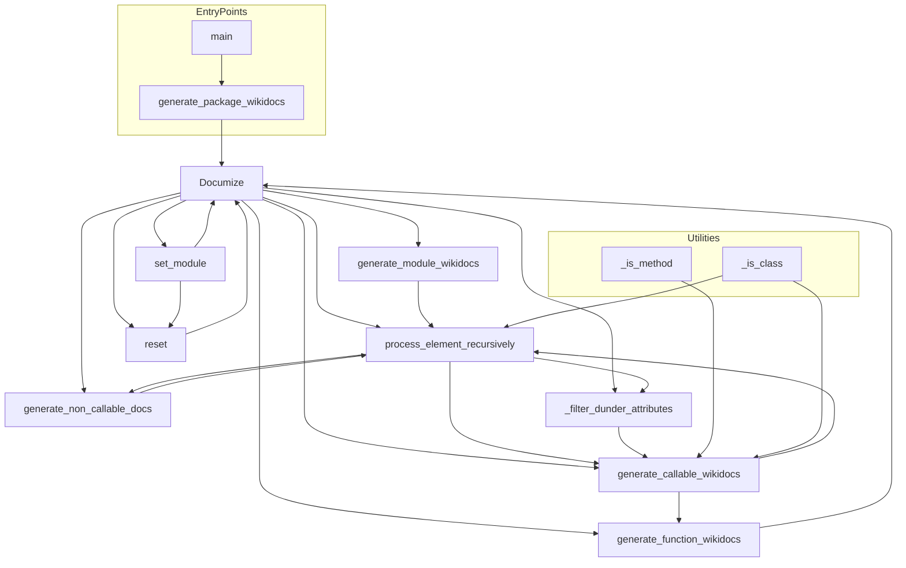

# `scripts`

## Tree:
```
scripts/
└── api_doc_generator.py
```

## Role:
Generates comprehensive reStructuredText API documentation for Python modules through recursive introspection and automated documentation generation.

## Description:
The scripts module provides tools for automatically generating API documentation for Python packages. It focuses on creating structured, wiki-friendly documentation that can be easily integrated into documentation systems like Sphinx. The primary use case is generating documentation for the mingus music library, but the tools are general-purpose and can be applied to any Python package.

This module is organized around a recursive documentation generation approach that traverses module hierarchies, analyzing classes, functions, and attributes to produce comprehensive API documentation. The module is designed to be used as both a standalone script and as a library for documentation generation workflows.

## Components:
*   `Documize` - Main class for recursively generating reStructuredText API documentation for Python modules
*   `generate_package_wikidocs` - Generates wiki-formatted documentation files for all attributes of a specified Python package
*   `main` - Entry point for generating API documentation for mingus library packages
*   `_is_method` - Utility function to identify method types for documentation inclusion
*   `_is_class` - Utility function to filter classes suitable for API documentation inclusion



## Public API:
*   `Documize(module_string='')` - Constructor for documentation generator, accepts optional module string to document
*   `Documize.output_wiki()` - Generates complete wiki-formatted documentation for the configured module
*   `generate_package_wikidocs(package_string, file_prefix='ref', file_suffix='.wiki')` - Generates individual wiki documentation files for package attributes
*   `main()` - Command-line entry point for generating documentation for mingus packages
*   `_is_method(obj)` - Utility function to identify method objects for documentation processing
*   `_is_class(cls)` - Utility function to filter classes suitable for documentation inclusion

## Dependencies:
*   Internal: None (all components are self-contained within this module)
*   External: Standard library modules (sys, os, inspect, types, etc.) for introspection and file operations

## Constraints:
*   Security: Uses `eval()` for dynamic module loading, which can pose security risks with untrusted input
*   Performance: Recursive processing can be slow for deeply nested modules
*   Thread Safety: Not thread-safe due to shared state in Documize instances
*   Input Validation: Requires valid Python module identifiers for proper operation
*   File I/O: Requires write permissions to the output directory specified in command-line arguments

---

## Files

- [`api_doc_generator.py`](scripts/api_doc_generator.md)

