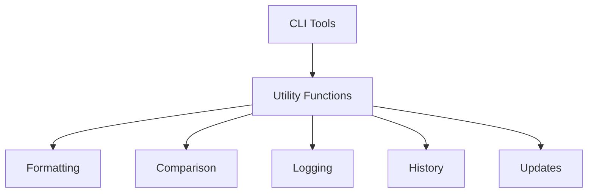

# `online-judge-tools`

## Repository Overview

### Tree Structure
```
online-judge-tools/
└── onlinejudge_command/
    ├── download_history.py
    ├── format_utils.py
    ├── log_formatter.py
    ├── output_comparators.py
    ├── pretty_printers.py
    ├── update_checking.py
    └── utils.py
```

### Purpose
The online-judge-tools repository contains command-line interface utilities and helper functions for online judge operations. The `onlinejudge_command` module specifically provides a collection of utility functions and classes that support command-line interface functionality for online judge systems.

### Target Users
- Users of command-line tools for online judge platforms
- Competitive programmers who prefer terminal-based workflows
- Developers working with online judge automation tools

### Position in Ecosystem
This appears to be a component of a larger online judge tooling system, providing utility functions and helpers for command-line operations.

### Architecture



### Entry Points

#### Importable APIs
The module exposes several utility modules that can be imported:
- `onlinejudge_command.download_history`: Functions for managing problem download records
- `onlinejudge_command.format_utils`: Formatting utilities for CLI output
- `onlinejudge_command.log_formatter`: Custom logging formatters
- `onlinejudge_command.output_comparators`: Utilities for comparing outputs
- `onlinejudge_command.pretty_printers`: Enhanced printing capabilities
- `onlinejudge_command.update_checking`: Update checking mechanisms
- `onlinejudge_command.utils`: General utility functions

### Core Features

1. **Download History Management** - Functions for saving, loading, and managing problem download records
   - Implemented in: `download_history.py`

2. **Output Formatting** - Formatting utilities for command-line output and display
   - Implemented in: `format_utils.py`

3. **Logging Formatters** - Custom logging formatters for structured command-line output
   - Implemented in: `log_formatter.py`

4. **Output Comparison** - Utilities for comparing program outputs against expected results
   - Implemented in: `output_comparators.py`

5. **Pretty Printing** - Enhanced pretty printing capabilities for data structures in CLI
   - Implemented in: `pretty_printers.py`

6. **Update Checking** - Mechanisms for checking updates to the online judge tools
   - Implemented in: `update_checking.py`

7. **General Utilities** - General-purpose utilities supporting CLI operations
   - Implemented in: `utils.py`

### Dependencies

- **Internal**: Standard library modules (logging, json, os, sys)
- **External**: Potentially third-party CLI libraries (not specified)

### Configuration

Configuration aspects are not detailed in the provided information. Typically, such tools might use:
- Environment variables for tool configuration
- Runtime parameters for CLI behavior
- Persistent storage for history data

### Extension Points

Extension points would likely include:
- Adding new utility functions to existing modules
- Creating new modules for additional functionality
- Extending existing formatter or comparator logic

---

## Modules

- [`onlinejudge_command`](onlinejudge_command.md)

