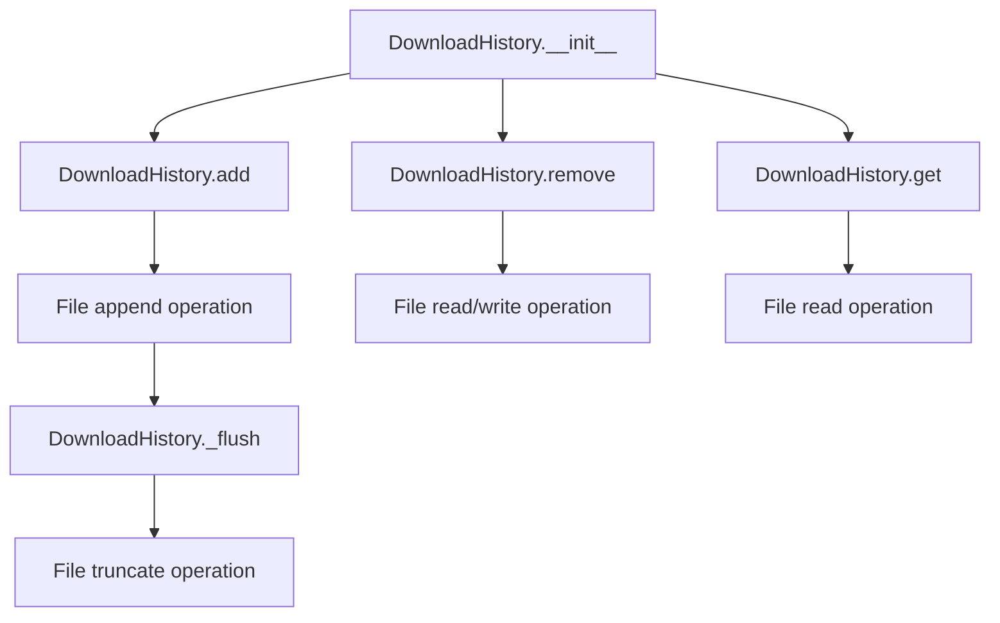

# `download_history.py`

## `onlinejudge_command.download_history.DownloadHistory` · *class*

## Summary:
Manages download history for competitive programming problems in JSONL format, tracking problem URLs by download directory.

## Description:
The DownloadHistory class provides persistent storage for tracking which competitive programming problems have been downloaded to specific directories. It maintains a JSON Lines file where each line represents a download event with timestamp, directory path, and problem URL. This allows tools to avoid re-downloading problems and track download history across sessions.

The class is typically instantiated by the download command implementation and used internally by the onlinejudge command framework to manage download state. It's designed to be lightweight and efficient for tracking download metadata.

## State:
- `path` (pathlib.Path): Path to the JSONL file storing download history. Defaults to `utils.user_cache_dir / 'download-history.jsonl'`. Must be writable and the parent directory must exist or be creatable. Each line in this file contains a JSON object with 'timestamp', 'directory', and 'url' fields.

## Lifecycle:
- Creation: Instantiate with optional custom path. Default path uses user cache directory via `utils.user_cache_dir`.
- Usage: Call `add()` to record downloads, `get()` to retrieve history for a directory, `remove()` to clear history for a directory. The `_flush()` method is called internally when file size exceeds 1MB.
- Destruction: No explicit cleanup required; file is managed automatically.

## Method Map:


## Raises:
- `OSError`: When file operations fail due to permission issues, disk full errors, or path access problems
- `json.decoder.JSONDecodeError`: When reading corrupted history entries (handled gracefully by skipping malformed lines)

## Example:
```python
# Create history tracker
history = DownloadHistory()

# Add a download entry
problem = Problem("https://example.com/problem")
history.add(problem, directory=pathlib.Path("/tmp/problems"))

# Get history for a directory
urls = history.get(directory=pathlib.Path("/tmp/problems"))

# Remove history for a directory
history.remove(directory=pathlib.Path("/tmp/problems"))
```

### `onlinejudge_command.download_history.DownloadHistory.__init__` · *method*

## Summary:
Initializes a DownloadHistory object with a specified file path for storing download history data.

## Description:
Configures the DownloadHistory instance to use the provided file path for persisting download records. When no path is specified, defaults to a JSONL file in the user's cache directory.

## Args:
    path (pathlib.Path): Absolute path to the download history file. Defaults to `utils.user_cache_dir / 'download-history.jsonl'`.

## Returns:
    None: This method initializes the object's state but does not return a value.

## Raises:
    None: This method does not explicitly raise exceptions.

## State Changes:
    Attributes READ: None
    Attributes WRITTEN: self.path

## Constraints:
    Preconditions: The path parameter must be a valid pathlib.Path object.
    Postconditions: The instance will have its path attribute set to the provided path or the default cache path.

## Side Effects:
    None: This method performs no I/O operations or external service calls. It only stores the path for later use.

### `onlinejudge_command.download_history.DownloadHistory.add` · *method*

## Summary:
Appends a download history entry containing timestamp, directory, and problem URL to the history file.

## Description:
Adds a new entry to the download history file with information about a downloaded problem. The entry includes the current timestamp, the directory where the problem was downloaded, and the URL of the problem. This method ensures the history file directory exists and flushes the history after writing to maintain file size limits.

## Args:
    problem (Problem): The problem object containing metadata including the URL.
    directory (pathlib.Path): The filesystem path where the problem was downloaded.

## Returns:
    None

## Raises:
    OSError: When file operations fail due to permission issues, disk full errors, or other I/O problems during file creation, opening, or writing.
    FileNotFoundError: When the parent directory of the history file cannot be created or accessed.

## State Changes:
    Attributes READ: self.path
    Attributes WRITTEN: None

## Constraints:
    Preconditions: The `problem` argument must be a valid Problem instance with a working `get_url()` method.
    Postconditions: A new JSON line is appended to the file at `self.path` containing the timestamp, directory, and URL.

## Side Effects:
    I/O operations: Creates parent directories if needed, opens and appends to the history file, and calls `_flush()` to potentially truncate the file if it exceeds 1MB.
    External service calls: None
    Mutations to objects outside self: Writes to the file at `self.path` and potentially modifies the file content via `_flush()` if file size exceeds 1MB.

### `onlinejudge_command.download_history.DownloadHistory.remove` · *method*

## Summary:
Removes all download history entries associated with a specific directory from the history file.

## Description:
This method clears the downloading history for a given directory by filtering out entries that match the specified directory path. It reads the entire history file, filters out matching entries, and writes the remaining entries back to the file. This method is typically called when cleaning up downloaded files or when a directory's download history needs to be reset.

The method is separated from other logic because it performs a specific cleanup operation that could be reused independently, and it's part of the history management system that maintains metadata about downloaded problems.

## Args:
    directory (pathlib.Path): The directory path whose history entries should be removed from the history file.

## Returns:
    None: This method does not return any value.

## Raises:
    None: This method does not explicitly raise exceptions, though underlying file I/O operations may raise IOError or similar exceptions.

## State Changes:
    Attributes READ: self.path
    Attributes WRITTEN: None (the method modifies the file content, not instance attributes)

## Constraints:
    Preconditions: The history file must be readable and writable if it exists.
    Postconditions: All entries in the history file matching the given directory are removed, and the file is updated accordingly.

## Side Effects:
    I/O: Reads from and writes to the file specified by self.path
    External service calls: None
    Mutations to objects outside self: Modifies the contents of the history file on disk

### `onlinejudge_command.download_history.DownloadHistory._flush` · *method*

## Summary:
Truncates the history file to half its size when it exceeds 1MB to prevent excessive growth.

## Description:
This method implements automatic cleanup of the download history file by halving its content when the file size reaches or exceeds 1MB. It's designed to prevent the history file from growing indefinitely and consuming excessive disk space. The method is typically called during download operations to maintain reasonable file sizes.

## Args:
    None

## Returns:
    None

## Raises:
    OSError: When file operations fail due to permission issues, disk full errors, or other I/O problems.
    FileNotFoundError: When the history file does not exist.

## State Changes:
    Attributes READ: self.path
    Attributes WRITTEN: None

## Constraints:
    Preconditions: The history file must exist and be readable/writable.
    Postconditions: If the file size was >= 1MB, the file will be truncated to half its previous size.

## Side Effects:
    I/O operations: Reads entire history file and writes back half of its contents to the same file path.
    External service calls: None
    Mutations to objects outside self: Modifies the file at self.path

### `onlinejudge_command.download_history.DownloadHistory.get` · *method*

## Summary:
Retrieves a list of problem URLs from the download history that match the specified directory.

## Description:
This method reads a JSONL-formatted history file and filters entries to return only those that were downloaded to the specified directory. It's designed to help identify previously downloaded problems for a given location, supporting features like avoiding redundant downloads.

## Args:
    directory (pathlib.Path): The directory path to filter history entries by.

## Returns:
    list[str]: A list of unique problem URLs that were previously downloaded to the specified directory. Returns an empty list if the history file doesn't exist.

## Raises:
    None explicitly raised, though JSON decode errors are logged and skipped.

## State Changes:
    Attributes READ: self.path
    Attributes WRITTEN: None

## Constraints:
    Preconditions: The method assumes self.path exists and contains properly formatted JSONL data.
    Postconditions: The returned list contains unique URLs and maintains the order of discovery.

## Side Effects:
    I/O operations: Reads from the file specified by self.path
    External service calls: None
    Mutations to objects outside self: None

