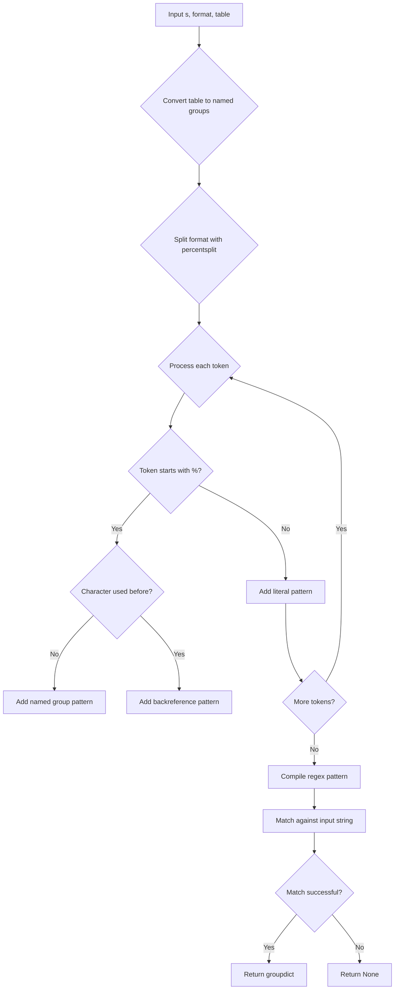
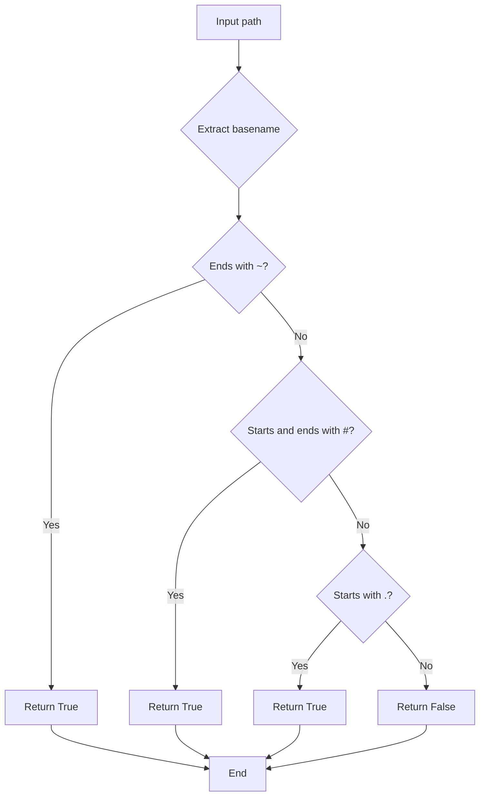

# `format_utils.py`

## `onlinejudge_command.format_utils.percentsplit` · *function*

## Summary:
Splits a string into individual characters and percent-escaped sequences while preserving percent escapes.

## Description:
This function processes a string and yields individual characters and percent-escaped sequences (like "%s", "%d") as separate elements. It's designed to handle strings that may contain percent escape sequences that should not be split further, making it useful for parsing format strings or processing text with embedded escape sequences.

## Args:
    s (str): Input string to be processed

## Returns:
    Generator[str, None, None]: A generator yielding individual characters and percent-escaped sequences from the input string

## Raises:
    None explicitly raised

## Constraints:
    Preconditions:
    - Input must be a string
    
    Postconditions:
    - Each yielded element is either a single character or a percent-escaped sequence starting with '%'
    - The concatenation of all yielded elements equals the original input string

## Side Effects:
    None

## Control Flow:
```mermaid
flowchart TD
    A[Input String s] --> B{Apply regex [^%]|%(.)}
    B --> C{Match found?}
    C -->|Yes| D[Yield m.group(0)]
    D --> E{More matches?}
    E -->|Yes| B
    E -->|No| F[End Generator]
    C -->|No| G[End Generator]
```

## Examples:
    >>> list(percentsplit("Hello %s world"))
    ['H', 'e', 'l', 'l', 'o', ' ', '%s', ' ', 'w', 'o', 'r', 'l', 'd']
    
    >>> list(percentsplit("Test %% escaped"))
    ['T', 'e', 's', 't', ' ', '%%', ' ', 'e', 's', 'c', 'a', 'p', 'e', 'd']
    
    >>> list(percentsplit("%"))
    ['%']
    
    >>> list(percentsplit(""))
    []
    
    >>> list(percentsplit("No escapes here"))
    ['N', 'o', ' ', 'e', 's', 'c', 'a', 'p', 'e', 's', ' ', 'h', 'e', 'r', 'e']
```

## `onlinejudge_command.format_utils.percentformat` · *function*

## Summary:
Formats a string by replacing percent-escaped placeholders with values from a lookup table.

## Description:
Processes a string containing percent-escaped placeholders (like "%s", "%d") and substitutes them with corresponding values from a provided lookup table. This function is designed to handle format strings where placeholders are prefixed with a percent sign and replaced with values from a dictionary mapping placeholder characters to their replacement strings.

## Args:
    s (str): Input string containing percent-escaped placeholders to be formatted
    table (Dict[str, str]): Lookup table mapping placeholder characters to their replacement strings

## Returns:
    str: Formatted string with percent-escaped placeholders replaced by their corresponding values from the table

## Raises:
    AssertionError: When the table contains a '%' key that doesn't map to '%' itself

## Constraints:
    Preconditions:
    - Input string `s` must be a valid string
    - Table dictionary must contain mappings for all placeholder characters referenced in the string
    - Table must have a '%' key that maps to '%' if '%' is present in the table
    
    Postconditions:
    - The returned string is constructed by replacing each '%X' with table['X'] where X is a character
    - All non-percent-escaped characters are preserved in their original positions

## Side Effects:
    None

## Control Flow:
```mermaid
flowchart TD
    A[Start percentformat(s, table)] --> B{Assert table['%'] == '%'}
    B --> C{Set table['%'] = '%'}
    C --> D[Initialize result = '']
    D --> E[For each c in percentsplit(s)]
    E --> F{Does c start with '%'}
    F -->|Yes| G[Append table[c[1]] to result]
    G --> H[Continue loop]
    F -->|No| I[Append c to result]
    I --> H
    H --> J{More tokens?}
    J -->|Yes| E
    J -->|No| K[Return result]
```

## Examples:
    >>> percentformat("Hello %s, you have %d messages", {'s': 'World', 'd': '5'})
    'Hello World, you have 5 messages'
    
    >>> percentformat("Price: %c%d.%02d", {'c': '$', 'd': '19', '0': '99'})
    'Price: $19.99'
    
    >>> percentformat("Test %% escaped", {'%': '%'})
    'Test % escaped'
```

## `onlinejudge_command.format_utils.percentparse` · *function*

## Summary:
Parses a string according to a format specification with named capture groups and backreferences.

## Description:
Parses an input string against a format specification that contains percent placeholders (%s, %d, etc.) and extracts named groups into a dictionary. This function enables flexible string parsing with support for repeated field references via backreferences. The format string is processed using `percentsplit` to properly handle percent escapes, and the table maps placeholder characters to regex patterns for capturing values.

## Args:
    s (str): The input string to parse
    format (str): Format string containing percent placeholders like "%s", "%d" that specify field positions
    table (Dict[str, str]): Mapping from placeholder characters to regex patterns for capturing values

## Returns:
    Optional[Dict[str, str]]: Dictionary mapping placeholder names to captured values, or None if the input doesn't match the format

## Raises:
    None explicitly raised

## Constraints:
    Preconditions:
    - All placeholder characters in format must exist as keys in the table
    - The input string must match the constructed regex pattern
    - Format string must be valid (properly escaped percent signs)
    
    Postconditions:
    - If successful, returned dict contains all unique placeholder names from format
    - If unsuccessful, returns None

## Side Effects:
    None

## Control Flow:


## Examples:
    >>> table = {'s': '[a-zA-Z]+', 'd': '\\d+'}
    >>> percentparse('hello 123', '%s %d', table)
    {'s': 'hello', 'd': '123'}
    
    >>> table = {'s': '[a-zA-Z]+'}
    >>> percentparse('test test', '%s %s', table)
    {'s': 'test'}
    
    >>> percentparse('no match', '%s %d', table)
    None

## `onlinejudge_command.format_utils.glob_with_format` · *function*

## Summary:
Finds files in a directory that match a format pattern with special wildcard placeholders.

## Description:
Scans a specified directory for files matching a format string that contains special placeholders ('s' and 'e') which are converted to glob wildcards. This function is used to locate test cases or files with specific naming conventions in competitive programming environments. The function handles platform-specific path separators and converts special format placeholders into standard glob patterns.

## Args:
    directory (pathlib.Path): The directory path to search for matching files
    format (str): Format string containing special placeholders ('s' and 'e') that are converted to glob wildcards. Forward slashes in the format string are converted to backslashes on Windows systems.

## Returns:
    List[pathlib.Path]: A list of file paths that match the constructed glob pattern, sorted in filesystem order

## Raises:
    OSError: If directory does not exist or is not readable
    glob.error: If glob pattern is malformed

## Constraints:
    Preconditions:
    - Directory must exist and be readable
    - Format string should contain valid characters for glob pattern construction
    - On Windows systems, forward slashes in format string are converted to backslashes
    
    Postconditions:
    - Returns a list of pathlib.Path objects representing matching files
    - All returned paths are absolute paths (as converted by glob.glob and pathlib.Path)
    - Function performs no modifications to the filesystem

## Side Effects:
    - Writes debug log messages to the module's logger with file paths that match the pattern
    - Performs filesystem I/O operations to scan directory contents

## Control Flow:
```mermaid
flowchart TD
    A[Start glob_with_format(directory, format)] --> B{Is Windows OS?}
    B -->|Yes| C[Replace '/' with '\\' in format]
    B -->|No| C[Skip replacement]
    C --> D[Create table mapping 's' to '*']
    D --> E[Create table mapping 'e' to '*']
    E --> F[Escape directory path and separator]
    F --> G[Escape format string]
    G --> H[Replace escaped '%' with unescaped '%']
    H --> I[Apply percentformat to format string with table]
    I --> J[Construct glob pattern]
    J --> K[Execute glob.glob(pattern)]
    K --> L[Convert results to pathlib.Path objects]
    L --> M[Log each matched path]
    M --> N[Return list of matched paths]
```

## Examples:
    >>> glob_with_format(pathlib.Path('/problems/prob1/testcases'), 'input%s.txt')
    [Path('/problems/prob1/testcases/input1.txt'), Path('/problems/prob1/testcases/input2.txt')]
    
    >>> glob_with_format(pathlib.Path('/problems/prob1/testcases'), 'output%e.txt')
    [Path('/problems/prob1/testcases/output1.txt'), Path('/problems/prob1/testcases/output2.txt')]
    
    >>> glob_with_format(pathlib.Path('/problems/prob1/testcases'), 'sample*.txt')
    [Path('/problems/prob1/testcases/sample1.txt'), Path('/problems/prob1/testcases/sample2.txt')]
```

## `onlinejudge_command.format_utils.match_with_format` · *function*

## Summary:
Matches a file path against a format pattern to validate test case file naming conventions.

## Description:
Validates whether a given file path conforms to a specified format pattern, commonly used in competitive programming environments to verify test case file names. The function supports platform-specific path separators and recognizes special format specifiers for capturing problem names and file extensions.

## Args:
    directory (pathlib.Path): The base directory path to match against
    format (str): Format string containing placeholders for file naming patterns
    path (pathlib.Path): The file path to validate against the format

## Returns:
    Optional[Match[str]]: A regex match object if the path matches the format pattern, or None if no match is found

## Raises:
    None explicitly raised

## Constraints:
    Preconditions:
    - All arguments must be properly initialized pathlib.Path objects or strings
    - The format string should contain valid percent-format placeholders ('s' and 'e')
    - Directory and path arguments should represent valid filesystem paths
    
    Postconditions:
    - Returns a regex match object with named groups 'name' and 'ext' when successful
    - The match object will contain captured groups for the problem name and file extension

## Side Effects:
    None

## Control Flow:
```mermaid
flowchart TD
    A[Start match_with_format] --> B{Is Windows platform?}
    B -->|Yes| C[Replace / with \\ in format]
    C --> D[Create lookup table]
    D --> E[Define s → (?P<name>.+)]
    E --> F[Define e → (?P<ext>in|out)]
    F --> G[Escape directory path]
    G --> H[Combine with separator]
    H --> I[Process format with percentformat]
    I --> J[Compile regex pattern]
    J --> K[Match against resolved path]
    K --> L[Return match result]
```

## Examples:
    >>> import pathlib
    >>> directory = pathlib.Path("/problems/sample")
    >>> format_str = "%s.%e"
    >>> path = pathlib.Path("/problems/sample/input.in")
    >>> result = match_with_format(directory, format_str, path)
    >>> if result:
    ...     print(f"Name: {result.group('name')}, Extension: {result.group('ext')}")
    ...     # Output: Name: input, Extension: in
    
    >>> # Non-matching case
    >>> path = pathlib.Path("/problems/sample/input.txt")
    >>> result = match_with_format(directory, format_str, path)
    >>> print(result)  # Output: None

## `onlinejudge_command.format_utils.path_from_format` · *function*

## Summary:
Constructs a file path by formatting a template string with name and extension placeholders and joining it with a directory path.

## Description:
Creates a file path by replacing '%s' and '%e' placeholders in a format string with the provided name and extension values, then joins the result with a directory path. This function is used to generate standardized file paths based on configurable naming patterns.

## Args:
    directory (pathlib.Path): The base directory path where the file should reside
    format (str): Format string containing '%s' (for name) and '%e' (for extension) placeholders
    name (str): Value to substitute for '%s' placeholder in the format string
    ext (str): Value to substitute for '%e' placeholder in the format string

## Returns:
    pathlib.Path: A new path object representing the full file path constructed by joining directory with the formatted filename

## Raises:
    AssertionError: When the internal percentformat function's table contains a '%' key that doesn't map to '%' itself

## Constraints:
    Preconditions:
    - directory must be a valid pathlib.Path object
    - format must be a valid string containing only '%s', '%e', or other valid percentformat placeholders
    - name and ext must be valid strings
    
    Postconditions:
    - The returned path is a combination of directory and formatted filename
    - The format string is processed by percentformat function which replaces '%s' with name and '%e' with ext

## Side Effects:
    None

## Control Flow:
```mermaid
flowchart TD
    A[Start path_from_format] --> B[Create table dict with 's':name, 'e':ext]
    B --> C[Call percentformat(format, table)]
    C --> D[Join directory with formatted result using / operator]
    D --> E[Return pathlib.Path result]
```

## Examples:
    >>> directory = pathlib.Path('/home/user/problems')
    >>> path = path_from_format(directory, 'input_%s.%e', 'sample', 'txt')
    >>> print(path)
    /home/user/problems/input_sample.txt
    
    >>> directory = pathlib.Path('tests')
    >>> path = path_from_format(directory, 'output_%s_%e', 'test', 'out')
    >>> print(path)
    tests/output_test_out
```

## `onlinejudge_command.format_utils.is_backup_or_hidden_file` · *function*

## Summary:
Determines whether a file path corresponds to a backup or hidden file based on filename patterns.

## Description:
This function identifies files that are typically considered backup or hidden files in Unix-like systems and development environments. It checks the basename of the provided path against common patterns used to mark such files.

The function is called by the online judge command utilities when processing file lists to exclude backup and hidden files from operations like formatting or submission.

## Args:
    path (pathlib.Path): The file path to check for backup or hidden file status

## Returns:
    bool: True if the file is a backup or hidden file, False otherwise

## Raises:
    None

## Constraints:
    Preconditions:
    - The input path must be a valid pathlib.Path object
    - The path should represent an existing or non-existing file
    
    Postconditions:
    - The function always returns a boolean value
    - The result is determined solely by the basename of the path

## Side Effects:
    None

## Control Flow:


## Examples:
    >>> import pathlib
    >>> is_backup_or_hidden_file(pathlib.Path("test.cpp~"))
    True
    >>> is_backup_or_hidden_file(pathlib.Path("#temp#"))
    True
    >>> is_backup_or_hidden_file(pathlib.Path(".hidden"))
    True
    >>> is_backup_or_hidden_file(pathlib.Path("main.py"))
    False
```

## `onlinejudge_command.format_utils.drop_backup_or_hidden_files` · *function*

## Summary:
Filters out backup and hidden files from a list of file paths.

## Description:
Removes files that are identified as backup or hidden files from the provided list of file paths. This function processes each path in the input list and excludes those that match patterns commonly associated with backup files (ending with ~) or hidden files (starting with .) or temporary files (enclosed in #).

The filtering logic is delegated to the `is_backup_or_hidden_file` helper function, which determines whether a file should be excluded based on its basename. When a file is filtered out, a warning message is logged to indicate that the file was ignored.

This function is typically called during file processing operations in the online judge command utilities to ensure that backup and hidden files are not included in operations like formatting, submission, or file listing.

## Args:
    paths (List[pathlib.Path]): A list of file paths to filter

## Returns:
    List[pathlib.Path]: A new list containing only the paths that are not identified as backup or hidden files

## Raises:
    None

## Constraints:
    Preconditions:
    - The input `paths` parameter must be a list of pathlib.Path objects
    - Each path in the list should be a valid pathlib.Path object
    
    Postconditions:
    - The returned list contains only paths that are not backup or hidden files
    - The original input list is not modified (immutable operation)
    - The order of paths in the returned list matches their order in the input list

## Side Effects:
    - Logs warning messages via the module's logger when backup or hidden files are encountered
    - No modifications to external state or files

## Control Flow:
```mermaid
flowchart TD
    A[Input paths list] --> B{Iterate through paths}
    B --> C{is_backup_or_hidden_file(path)?}
    C -->|True| D[Log warning: ignore backup file]
    C -->|False| E[Include path in result]
    D --> F{Next path?}
    E --> F
    F --> G{More paths?}
    G -->|Yes| B
    G -->|No| H[Return filtered result]
```

## Examples:
    >>> import pathlib
    >>> paths = [pathlib.Path("main.py"), pathlib.Path("temp.cpp~"), pathlib.Path(".hidden")]
    >>> result = drop_backup_or_hidden_files(paths)
    >>> print(result)
    [PosixPath('main.py')]
    
    >>> paths = [pathlib.Path("#temp#"), pathlib.Path("README.md")]
    >>> result = drop_backup_or_hidden_files(paths)
    >>> print(result)
    [PosixPath('README.md')]
```

## `onlinejudge_command.format_utils.construct_relationship_of_files` · *function*

## Summary:
Constructs a hierarchical mapping of test case files by grouping input and output files by their common base names according to a specified naming format.

## Description:
Processes a list of file paths to create a nested dictionary structure where each test case is represented by its base name, with separate entries for input ('in') and output ('out') files. This function validates that all test cases have both input and output files, and ensures proper file naming conventions are followed.

The function is designed to work with competitive programming test case files that follow a specific naming convention (like "input.in", "output.out"). It serves as a utility for organizing test files into logical test cases that can be processed together.

## Args:
    paths (List[pathlib.Path]): List of file paths to process and organize into test cases
    directory (pathlib.Path): Base directory path used for validating file paths against the format pattern
    format (str): Format string specifying the expected naming pattern for test case files (e.g., "%s.%e")

## Returns:
    Dict[str, Dict[str, pathlib.Path]]: A nested dictionary mapping test case names to their file extensions and corresponding file paths. Each top-level key is a test case name, and each value is another dictionary mapping file extensions ('in', 'out') to their respective pathlib.Path objects.

## Raises:
    SystemExit: When encountering unrecognizable files, dangling output files, or when no valid test cases are found

## Constraints:
    Preconditions:
    - All paths in the input list must be valid file paths that conform to the specified format pattern
    - The format string must contain valid placeholders for name ('%s') and extension ('%e') capture groups
    - The directory parameter must be a valid directory path

    Postconditions:
    - All returned test cases will have both 'in' and 'out' file entries
    - The returned dictionary will not be empty
    - Each test case name will map to a dictionary containing at least one file extension entry

## Side Effects:
    - Writes error messages to stderr via the logger when invalid files are encountered
    - Terminates the program with exit code 1 when validation fails

## Control Flow:
```mermaid
flowchart TD
    A[Start construct_relationship_of_files] --> B[Initialize empty tests dict]
    B --> C[Process each path in paths]
    C --> D{Does path match format?}
    D -->|No| E[Log error and exit]
    D -->|Yes| F[Extract name and extension from match]
    F --> G[Assert extension not already present]
    G --> H[Store path in tests[name][ext]]
    H --> I[Check for dangling output files]
    I --> J{Is 'in' missing but 'out' present?}
    J -->|Yes| K[Log error and exit]
    J -->|No| L[Continue checking]
    L --> M{Are there any test cases?}
    M -->|No| N[Log error and exit]
    M -->|Yes| O[Log success message]
    O --> P[Return tests dictionary]
```

## Examples:
    >>> import pathlib
    >>> from onlinejudge_command.format_utils import construct_relationship_of_files
    >>> paths = [
    ...     pathlib.Path("sample/input.in"),
    ...     pathlib.Path("sample/output.out"),
    ...     pathlib.Path("sample/input2.in"),
    ...     pathlib.Path("sample/output2.out")
    ... ]
    >>> directory = pathlib.Path("sample")
    >>> format_str = "%s.%e"
    >>> result = construct_relationship_of_files(paths, directory, format_str)
    >>> print(result)
    {'input': {'in': PosixPath('sample/input.in'), 'out': PosixPath('sample/output.out')}, 
     'input2': {'in': PosixPath('sample/input2.in'), 'out': PosixPath('sample/output2.out')}}

