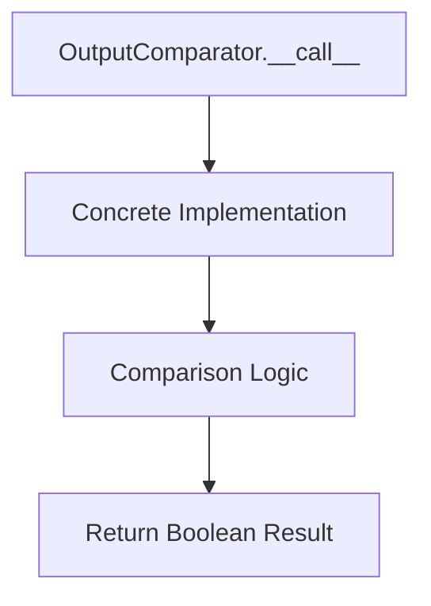
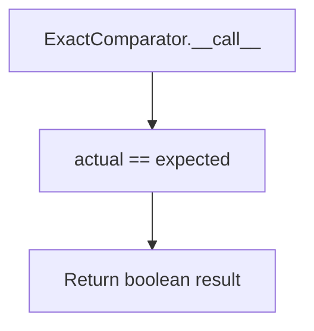
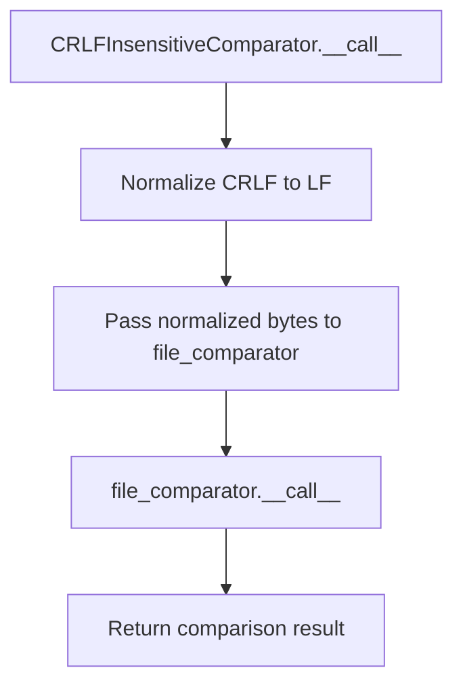
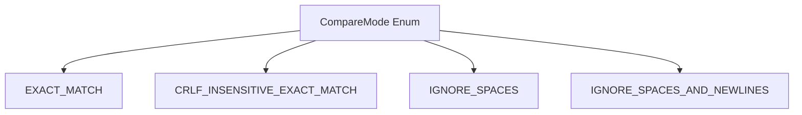

# `output_comparators.py`

## `onlinejudge_command.output_comparators.OutputComparator` · *class*

## Summary:
Abstract base class defining the interface for comparing program output with expected output in competitive programming contexts.

## Description:
The OutputComparator class serves as a foundation for implementing various output comparison strategies used in competitive programming platforms. It defines a standardized interface that concrete implementations must follow to compare actual program output (as bytes) with expected output (as bytes). This abstraction allows different comparison modes (exact match, floating-point tolerance, whitespace handling, etc.) to be implemented consistently.

This class is typically instantiated through its concrete subclasses rather than directly, as it defines an abstract interface that must be implemented by specific comparison strategies.

## State:
- No instance attributes are defined in this abstract base class
- The class itself has no state beyond the abstract method contract
- Concrete implementations will define their own state for storing comparison parameters (like tolerance values for floating-point comparisons)

## Lifecycle:
- Creation: Instances are created through concrete subclass constructors, not directly from this abstract class
- Usage: The `__call__` method is invoked with two byte arguments representing actual and expected output respectively
- Destruction: Cleanup is handled by Python's garbage collection or context managers if implemented by concrete subclasses

## Method Map:


## Raises:
- NotImplementedError: Raised when the abstract `__call__` method is not overridden in concrete subclasses

## Example:
```python
# Typical usage would involve creating a concrete subclass
class ExactOutputComparator(OutputComparator):
    def __call__(self, actual: bytes, expected: bytes) -> bool:
        return actual == expected

# Then using it
comparator = ExactOutputComparator()
result = comparator(b"hello world", b"hello world")  # Returns True
```

### `onlinejudge_command.output_comparators.OutputComparator.__call__` · *method*

## Summary:
Compares actual program output with expected output to determine if they match according to the specific comparison strategy.

## Description:
This abstract method defines the interface for comparing actual program output (as bytes) with expected output (as bytes). Concrete implementations define specific comparison strategies such as exact matching, token-based comparison, or floating-point tolerance checking. The method is invoked during the judging process to validate program correctness.

## Args:
    actual (bytes): The actual output produced by the submitted solution
    expected (bytes): The expected output that the solution should produce

## Returns:
    bool: True if the actual output matches the expected output according to the implementation's criteria, False otherwise

## Raises:
    NotImplementedError: This is an abstract method that must be implemented by subclasses

## State Changes:
    Attributes READ: None
    Attributes WRITTEN: None

## Constraints:
    Preconditions: Both `actual` and `expected` parameters must be bytes objects
    Postconditions: Returns a boolean value indicating match status

## Side Effects:
    None

## `onlinejudge_command.output_comparators.ExactComparator` · *class*

## Summary:
ExactComparator is a concrete implementation of OutputComparator that performs exact byte-by-byte comparison between actual and expected output.

## Description:
The ExactComparator class implements a strict equality comparison between program output and expected output. It is designed for competitive programming scenarios where output must match exactly, including whitespace and formatting. This comparator is typically used when the problem specification requires precise output matching without any tolerance for differences in formatting or floating-point precision.

The class is instantiated through its constructor and used by calling the instance with actual and expected output bytes. It follows the standard OutputComparator interface, making it interchangeable with other comparison strategies in the competitive programming framework.

## State:
- No instance attributes: This class maintains no internal state beyond what is required by the parent class interface
- The comparison operation is stateless and deterministic
- Parameters are passed at call time rather than being stored as instance attributes

## Lifecycle:
- Creation: Instantiated directly using `ExactComparator()` constructor
- Usage: Called with two byte arguments using the `__call__` method: `comparator(actual_bytes, expected_bytes)`
- Destruction: Handled automatically by Python's garbage collector

## Method Map:


## Raises:
- No exceptions are raised by this implementation
- All exceptions would be inherited from the parent OutputComparator class if any were to occur during instantiation

## Example:
```python
# Create an exact comparator instance
comparator = ExactComparator()

# Compare output bytes
actual_output = b"Hello World\n"
expected_output = b"Hello World\n"

result = comparator(actual_output, expected_output)
# Returns True because the bytes are identical

# Different output returns False
different_output = b"Hello World"
result = comparator(actual_output, different_output)
# Returns False because the bytes differ
```

### `onlinejudge_command.output_comparators.ExactComparator.__call__` · *method*

*No documentation generated.*

## `onlinejudge_command.output_comparators.FloatingPointNumberComparator` · *class*

## Summary:
A comparator that evaluates whether two byte sequences represent approximately equal floating-point numbers within specified relative and absolute tolerances.

## Description:
The FloatingPointNumberComparator provides a mechanism for comparing program output with expected output when dealing with floating-point numerical results. It attempts to convert both actual and expected outputs to floating-point numbers and uses math.isclose() for comparison with configurable relative and absolute tolerances. When conversion to float fails, it falls back to exact byte-string comparison.

This comparator is particularly useful in competitive programming contexts where small floating-point precision differences should be tolerated, such as when comparing results from mathematical computations or scientific calculations.

## State:
- rel_tol: float, relative tolerance for floating-point comparison, must be non-negative
- abs_tol: float, absolute tolerance for floating-point comparison, must be non-negative

## Lifecycle:
- Creation: Instantiate with keyword arguments rel_tol and abs_tol specifying the desired tolerances
- Usage: Call the instance with actual and expected byte sequences as arguments
- Destruction: Handled automatically by Python's garbage collector

## Method Map:
```mermaid
graph TD
    A[FloatingPointNumberComparator.__call__] --> B{Can Convert to Float?}
    B -->|Yes| C[math.isclose(x, y, rel_tol, abs_tol)]
    B -->|No| D[actual == expected]
    C --> E[Return Boolean]
    D --> E
```

## Raises:
- None explicitly raised by __init__
- Warning logged via logger.warning when max(rel_tol, abs_tol) > 1

## Example:
```python
# Create a comparator with 1e-9 relative tolerance and 1e-12 absolute tolerance
comparator = FloatingPointNumberComparator(rel_tol=1e-9, abs_tol=1e-12)

# Compare floating-point results
result1 = comparator(b"3.14159", b"3.14159")  # Returns True
result2 = comparator(b"1.000000000001", b"1.0")  # Returns True (within tolerance)
result3 = comparator(b"hello", b"world")  # Returns False (fallback to string comparison)
```

### `onlinejudge_command.output_comparators.FloatingPointNumberComparator.__init__` · *method*

## Summary:
Initializes a FloatingPointNumberComparator with relative and absolute tolerance parameters for floating-point number comparison.

## Description:
The __init__ method sets up the tolerance parameters for floating-point comparisons. It validates that the maximum tolerance is not greater than 1, issuing a warning if it is. This validation helps prevent overly loose comparisons that might mask significant errors. The method stores the provided tolerance values as instance attributes for use in subsequent floating-point comparisons.

## Args:
    rel_tol (float): Relative tolerance for floating-point comparison, must be non-negative
    abs_tol (float): Absolute tolerance for floating-point comparison, must be non-negative

## Returns:
    None: This method initializes instance attributes and does not return a value

## Raises:
    None: This method does not raise exceptions directly, though it logs warnings

## State Changes:
    Attributes READ: None
    Attributes WRITTEN: self.rel_tol, self.abs_tol

## Constraints:
    Preconditions: Both rel_tol and abs_tol must be non-negative floats
    Postconditions: self.rel_tol and self.abs_tol are set to the provided values, with warning logged if max(rel_tol, abs_tol) > 1

## Side Effects:
    I/O: Logs a warning message via logger.warning when tolerance values exceed 1

### `onlinejudge_command.output_comparators.FloatingPointNumberComparator.__call__` · *method*

## Summary:
Compares two byte sequences as floating-point numbers with configurable tolerance or as exact strings.

## Description:
This method attempts to parse both input byte sequences as floating-point numbers. If both conversions succeed, it compares them using `math.isclose()` with relative and absolute tolerance settings from `self.rel_tol` and `self.abs_tol`. If either conversion fails, it performs exact byte string comparison. This dual approach enables robust comparison of numerical outputs that may have minor floating-point precision differences while preserving exact matching for non-numerical content.

## Args:
    actual (bytes): The actual output to compare, typically from program execution
    expected (bytes): The expected output to compare against, typically from test cases

## Returns:
    bool: True if the values are considered equal according to the comparison logic, False otherwise

## Raises:
    None explicitly raised

## State Changes:
    Attributes READ: self.rel_tol, self.abs_tol
    Attributes WRITTEN: None

## Constraints:
    Preconditions: Both actual and expected parameters must be valid bytes objects that can be converted to strings
    Postconditions: Returns a boolean indicating equality based on the comparison strategy:
        - When both inputs are valid floating-point numbers: uses `math.isclose()` with configured tolerances
        - When either input is not a valid floating-point number: performs exact byte string comparison

## Side Effects:
    None

## `onlinejudge_command.output_comparators.SplitComparator` · *class*

## Summary:
A word-level output comparator that splits input byte strings into words and compares them using a delegated word comparator.

## Description:
The SplitComparator class implements a word-level comparison strategy by splitting both actual and expected output byte strings into sequences of words using whitespace as delimiters. It then applies a delegated word comparator to each corresponding pair of words. This approach enables flexible comparison strategies while ensuring structural consistency in word count between actual and expected outputs.

This class is typically used in competitive programming environments where output validation needs to handle varying whitespace formatting while maintaining semantic equivalence. It acts as a wrapper around other OutputComparator implementations to provide word-level granularity.

## State:
- word_comparator: OutputComparator instance used to compare individual words
  - Type: OutputComparator
  - Valid range: Any concrete implementation of OutputComparator
  - Invariant: Must be properly initialized during construction and remain immutable

## Lifecycle:
- Creation: Instantiate with a valid OutputComparator instance as the word_comparator parameter
- Usage: Call the instance with actual and expected byte strings to perform word-level comparison
- Destruction: Handled automatically by Python's garbage collection

## Method Map:
```mermaid
graph TD
    A[SplitComparator.__call__] --> B[actual.split()]
    A --> C[expected.split()]
    A --> D[len(actual_words) != len(expected_words)?]
    D -->|True| E[return False]
    D -->|False| F[for x,y in zip(actual_words, expected_words)]
    F --> G[word_comparator(x,y)]
    G --> H[return False if any mismatch]
    H --> I[return True]
```

## Raises:
- None explicitly raised by __init__
- The constructor accepts any OutputComparator instance, so errors would occur only if the provided comparator raises exceptions during its own operation

## Example:
```python
# Create a word comparator that ignores whitespace differences
from onlinejudge_command.output_comparators import SplitComparator, ExactOutputComparator

# Create a word-level comparator using exact matching for individual words
word_comparator = ExactOutputComparator()
split_comparator = SplitComparator(word_comparator)

# Compare outputs with different whitespace formatting
result1 = split_comparator(b"hello   world", b"hello world")  # True
result2 = split_comparator(b"hello world", b"hi world")       # False

# The comparison fails if word counts differ
result3 = split_comparator(b"hello world", b"hello world extra")  # False
```

### `onlinejudge_command.output_comparators.SplitComparator.__init__` · *method*

## Summary:
Initializes a SplitComparator instance with a word-level comparator for comparing split output sequences.

## Description:
Constructs a SplitComparator that splits input output into words and applies the provided word comparator to each corresponding pair of words. This implementation enables flexible word-based comparison strategies by delegating individual word comparisons to the supplied word_comparator.

The SplitComparator is typically used in competitive programming contexts where output needs to be compared word-by-word rather than as complete strings, allowing for more robust comparison that handles varying whitespace while maintaining strict word-level validation.

## Args:
    word_comparator (OutputComparator): A callable object implementing the OutputComparator interface that will be used to compare individual words extracted from the actual and expected outputs.

## Returns:
    None: This method initializes the instance and does not return a value.

## Raises:
    None: This method does not raise any exceptions under normal circumstances.

## State Changes:
    Attributes READ: None
    Attributes WRITTEN: 
        - self.word_comparator: Stores the provided word_comparator parameter as an instance attribute for later use in the __call__ method

## Constraints:
    Preconditions:
        - The word_comparator parameter must be a callable object that implements the OutputComparator interface
        - The word_comparator must accept two byte arguments and return a boolean value
    Postconditions:
        - The instance will have self.word_comparator set to the provided word_comparator parameter
        - The instance will be ready to process output comparisons via its __call__ method

## Side Effects:
    None: This method performs no I/O operations or external service calls. It only stores a reference to the provided comparator object.

### `onlinejudge_command.output_comparators.SplitComparator.__call__` · *method*

## Summary:
Compares two byte strings word-by-word using a delegated word comparator, returning True only if both strings have identical word counts and all corresponding word pairs match.

## Description:
This method implements word-level comparison logic by splitting both input byte strings into words using whitespace as delimiters, then applying the stored word_comparator to each corresponding pair of words. The comparison succeeds only when both strings contain the same number of words and every corresponding word pair passes the word-level comparison test.

This method is typically invoked during competitive programming problem evaluation when output needs to be validated word-by-word rather than as complete strings, enabling flexible comparison strategies while maintaining structural consistency.

## Args:
    actual (bytes): The actual output produced by a program, encoded as bytes
    expected (bytes): The expected output to compare against, encoded as bytes

## Returns:
    bool: True if both byte strings have equal word counts and all corresponding word pairs match according to the word_comparator; False otherwise

## Raises:
    None: This method does not explicitly raise exceptions, though underlying word_comparator calls may raise exceptions if improperly configured

## State Changes:
    Attributes READ:
        - self.word_comparator: Accessed to perform individual word comparisons
    Attributes WRITTEN: None

## Constraints:
    Preconditions:
        - Both actual and expected parameters must be valid byte strings
        - The instance must have been properly initialized with a valid word_comparator
    Postconditions:
        - The method returns a boolean indicating whether the word-level comparison succeeded
        - No modifications are made to the instance state

## Side Effects:
    None: This method performs no I/O operations or external service calls. It only uses the stored word_comparator for comparisons.

## `onlinejudge_command.output_comparators.SplitLinesComparator` · *class*

*No documentation generated.*

### `onlinejudge_command.output_comparators.SplitLinesComparator.__init__` · *method*

## Summary:
Initializes a SplitLinesComparator instance with a line comparator for comparing individual lines of output.

## Description:
This constructor method initializes a SplitLinesComparator object by assigning the provided line_comparator parameter to the instance attribute self.line_comparator. The SplitLinesComparator is designed to handle multi-line output comparison by delegating individual line comparisons to the provided line comparator.

## Args:
    line_comparator (OutputComparator): An instance of an output comparator class that will be used to compare individual lines of output. This parameter is stored as an instance attribute for later use in line-by-line comparison operations.

## Returns:
    None: This method initializes the object's state but does not return a value.

## Raises:
    None explicitly documented: Based on the source code, this method does not appear to raise any exceptions directly, though the underlying line_comparator implementation may raise exceptions during comparison operations.

## State Changes:
    Attributes READ: None
    Attributes WRITTEN: self.line_comparator

## Constraints:
    Preconditions: 
    - line_comparator must be a valid object that can be assigned to self.line_comparator
    - The caller should ensure line_comparator is compatible with the expected interface for line comparison operations
    
    Postconditions:
    - self.line_comparator is set to the provided line_comparator parameter
    - The object is properly initialized with the specified line comparison strategy

## Side Effects:
    None: This method performs no I/O operations or external service calls. It only assigns the provided parameter to an instance attribute.

### `onlinejudge_command.output_comparators.SplitLinesComparator.__call__` · *method*

## Summary:
Compares two byte sequences line by line using a configured line comparator.

## Description:
This method implements the core comparison logic for the SplitLinesComparator class. It splits both actual and expected byte sequences into lines, verifies they have the same number of lines, and then applies the configured line comparator to each corresponding line pair. This approach enables flexible line-by-line comparison strategies while maintaining the overall structure of line-based output comparison.

The method is typically invoked during competitive programming problem evaluation when comparing program output against expected results. It's designed to work with any line comparator implementation, making it highly extensible for different comparison requirements such as exact matching, floating-point tolerance, or whitespace normalization.

## Args:
    actual (bytes): The actual output produced by a program, encoded as bytes
    expected (bytes): The expected output to compare against, encoded as bytes

## Returns:
    bool: True if both sequences have the same number of lines and all corresponding line pairs match according to the configured line_comparator; False otherwise

## Raises:
    None: This method does not raise exceptions directly, though the underlying line_comparator may raise exceptions if it encounters invalid input

## State Changes:
    Attributes READ: self.line_comparator
    Attributes WRITTEN: None

## Constraints:
    Preconditions:
        - Both actual and expected parameters must be valid byte sequences
        - self.line_comparator must be a callable that accepts two byte arguments and returns a boolean
    Postconditions:
        - The method returns a boolean indicating whether the outputs match line-by-line
        - No modifications are made to the object's state

## Side Effects:
    None: This method performs no I/O operations or external service calls. It only processes the provided byte sequences and delegates line comparison to self.line_comparator.

## `onlinejudge_command.output_comparators.CRLFInsensitiveComparator` · *class*

## Summary:
A decorator comparator that normalizes CRLF line endings to LF before delegating comparison to another output comparator.

## Description:
The CRLFInsensitiveComparator implements the decorator pattern to wrap an existing OutputComparator instance. It normalizes Windows-style CRLF (\r\n) line endings to Unix-style LF (\n) line endings in both actual and expected output bytes before passing them to the wrapped comparator. This ensures that output comparison is insensitive to line ending differences between operating systems.

This comparator is typically used as a wrapper around other concrete OutputComparator implementations to add line ending normalization capability without modifying the underlying comparison logic.

## State:
- file_comparator: OutputComparator instance that performs the actual comparison after line ending normalization
  - Type: OutputComparator
  - Valid range: Any concrete implementation of OutputComparator
  - Invariant: Must be a valid OutputComparator instance that accepts bytes arguments

## Lifecycle:
- Creation: Instantiate with a valid OutputComparator instance as the file_comparator parameter
- Usage: Call the instance with actual and expected bytes arguments (typically from program execution and expected output)
- Destruction: Handled automatically by Python's garbage collection

## Method Map:


## Raises:
- TypeError: If file_comparator is not an instance of OutputComparator
- Any exceptions raised by the wrapped file_comparator during comparison operations

## Example:
```python
# Create a basic exact matcher
exact_matcher = ExactOutputComparator()

# Wrap it with CRLF insensitivity
crlf_insensitive = CRLFInsensitiveComparator(exact_matcher)

# Compare outputs with different line endings
actual_output = b"hello\r\nworld\r\n"
expected_output = b"hello\nworld\n"

result = crlf_insensitive(actual_output, expected_output)  # Returns True
```

### `onlinejudge_command.output_comparators.CRLFInsensitiveComparator.__init__` · *method*

## Summary:
Initializes a CRLFInsensitiveComparator with a delegate file comparator for handling line ending normalization.

## Description:
Constructs a CRLFInsensitiveComparator instance that wraps another OutputComparator to provide line ending insensitive comparison. This comparator normalizes CRLF (\\r\\n) line endings to LF (\\n) before delegating the actual comparison to the provided file_comparator.

## Args:
    file_comparator (OutputComparator): A delegate comparator that handles the actual comparison logic after line ending normalization. Must be a concrete implementation of OutputComparator.

## Returns:
    None: This method initializes the instance and does not return a value.

## Raises:
    None: This method does not raise any exceptions.

## State Changes:
    Attributes READ: None
    Attributes WRITTEN: self.file_comparator

## Constraints:
    Preconditions: The file_comparator parameter must be a valid OutputComparator instance.
    Postconditions: The instance will store the provided file_comparator for later use in comparison operations.

## Side Effects:
    None: This method performs no I/O operations or external service calls. It only stores a reference to the provided comparator.

### `onlinejudge_command.output_comparators.CRLFInsensitiveComparator.__call__` · *method*

## Summary:
Compares two byte sequences while treating CRLF and LF line endings equivalently by normalizing them before delegation.

## Description:
This method implements the core comparison logic for the CRLFInsensitiveComparator class. It normalizes both actual and expected byte sequences by converting all CRLF (\r\n) line endings to LF (\n) before delegating the comparison to the wrapped file_comparator. This ensures that output differences due to line ending conventions (common between Windows and Unix systems) don't affect the comparison result.

The method is part of the OutputComparator interface and is typically invoked during competitive programming problem evaluation when comparing program output with expected results. It acts as a wrapper that preprocesses input to handle cross-platform line ending differences while preserving the comparison logic of the underlying comparator.

## Args:
    actual (bytes): The actual output bytes from a program execution
    expected (bytes): The expected output bytes for the problem

## Returns:
    bool: True if the normalized actual and expected bytes are considered equivalent by the wrapped file_comparator, False otherwise

## Raises:
    Exception: May raise exceptions from the underlying file_comparator if it encounters invalid input or comparison issues

## State Changes:
    Attributes READ: self.file_comparator
    Attributes WRITTEN: None

## Constraints:
    Preconditions: Both actual and expected parameters must be bytes objects
    Postconditions: Returns a boolean value indicating equivalence after CRLF normalization

## Side Effects:
    None: This method is stateless and doesn't perform I/O operations or mutate external state

## `onlinejudge_command.output_comparators.CompareMode` · *class*

## Summary:
Defines different comparison modes for output validation in competitive programming problem solving.

## Description:
The CompareMode enum provides various strategies for comparing output strings when validating solutions against expected outputs. This abstraction allows the system to handle different formatting requirements and tolerance levels for output comparison, such as ignoring whitespace differences or handling different newline conventions.

## State:
- EXACT_MATCH: String comparison with exact character matching including whitespace and newlines
- CRLF_INSENSITIVE_EXACT_MATCH: Exact matching but treats CRLF (\r\n) and LF (\n) as equivalent
- IGNORE_SPACES: Compares strings while ignoring all space characters
- IGNORE_SPACES_AND_NEWLINES: Compares strings while ignoring all space and newline characters

## Lifecycle:
- Creation: Instantiated automatically when referenced by name (e.g., CompareMode.EXACT_MATCH)
- Usage: Used as an enumeration value to specify comparison strategy in output validation functions
- Destruction: Managed automatically by Python's garbage collection

## Method Map:


## Raises:
- No exceptions are raised during instantiation as this is a simple enum definition

## Example:
```python
# Using the enum to specify comparison mode
mode = CompareMode.IGNORE_SPACES
print(mode.value)  # Output: 'ignore-spaces'

# Typical usage in validation context
if mode == CompareMode.EXACT_MATCH:
    # Perform strict string comparison
    pass
elif mode == CompareMode.IGNORE_SPACES:
    # Perform comparison ignoring spaces
    pass
```

## `onlinejudge_command.output_comparators.check_lines_match` · *function*

## Summary:
Compares two string outputs using a specified comparison mode and returns whether they match.

## Description:
The check_lines_match function performs string comparison between two output strings using different comparison strategies defined by the CompareMode enumeration. It selects an appropriate comparator based on the specified mode and applies it to the encoded byte representations of the input strings. This function is designed specifically for competitive programming scenarios where output validation may require different tolerance levels for whitespace, line endings, or exact matching.

The function is typically used in test case validation workflows where programs' outputs need to be compared against expected results using various formatting tolerances. It encapsulates the logic for selecting and applying different comparison strategies, making the validation process more flexible and maintainable.

## Args:
    a (str): The first string to compare, typically representing actual program output
    b (str): The second string to compare, typically representing expected program output  
    compare_mode (CompareMode): The comparison strategy to use, determining how whitespace, newlines, and line endings are handled

## Returns:
    bool: True if the strings match according to the specified comparison mode, False otherwise

## Raises:
    RuntimeError: When CompareMode.IGNORE_SPACES_AND_NEWLINES is passed as the comparison mode, as this mode is not supported by this function

## Constraints:
    Preconditions:
    - Both input strings must be valid UTF-8 strings
    - The compare_mode parameter must be a valid CompareMode enum value
    - The function assumes that the strings represent textual output that can be meaningfully compared
    
    Postconditions:
    - The function always returns a boolean value
    - The comparison is performed on byte-encoded versions of the input strings
    - The returned value accurately reflects the comparison result according to the selected mode

## Side Effects:
    None: This function is pure and has no side effects beyond the comparison operation itself

## Control Flow:
```mermaid
flowchart TD
    A[check_lines_match called] --> B{compare_mode}
    B -->|EXACT_MATCH| C[Create ExactComparator]
    B -->|CRLF_INSENSITIVE_EXACT_MATCH| D[Create CRLFInsensitiveComparator(ExactComparator)]
    B -->|IGNORE_SPACES| E[Create SplitComparator(ExactComparator)]
    B -->|IGNORE_SPACES_AND_NEWLINES| F[raise RuntimeError]
    B -->|Invalid Mode| G[assert False]
    C --> H[comparator(a.encode(), b.encode())]
    D --> H
    E --> H
    F --> I[Return False]
    G --> I
    H --> I[Return comparison result]
```

## Examples:
```python
from onlinejudge_command.output_comparators import check_lines_match, CompareMode

# Exact matching - requires precise string equality
result = check_lines_match("hello world", "hello world", compare_mode=CompareMode.EXACT_MATCH)
# Returns True

# CRLF insensitive matching - handles Windows line endings
result = check_lines_match("hello\r\nworld", "hello\nworld", compare_mode=CompareMode.CRLF_INSENSITIVE_EXACT_MATCH)
# Returns True

# Space insensitive matching - ignores all whitespace differences
result = check_lines_match("hello   world", "hello world", compare_mode=CompareMode.IGNORE_SPACES)
# Returns True

# This will raise RuntimeError
try:
    check_lines_match("test", "test", compare_mode=CompareMode.IGNORE_SPACES_AND_NEWLINES)
except RuntimeError as e:
    print(e)  # "CompareMode.IGNORE_SPACES_AND_NEWLINES is not allowed for this function"
```

