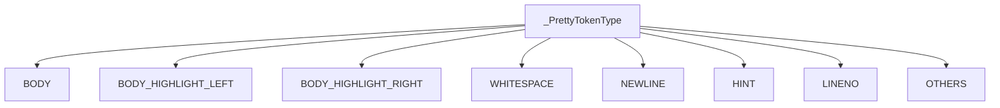
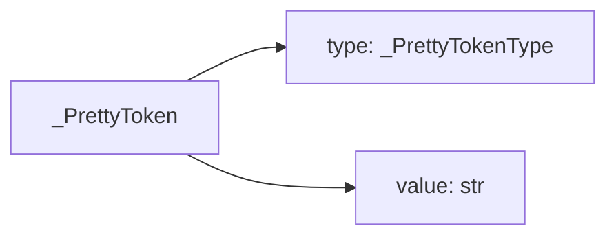
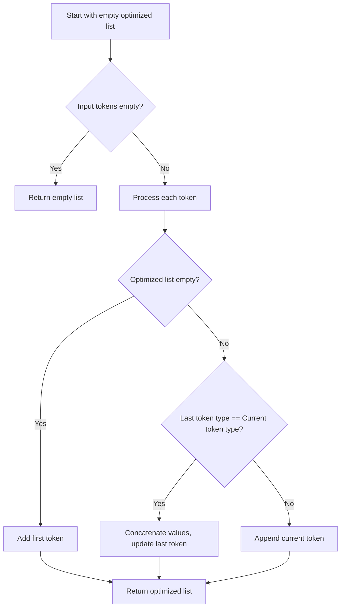
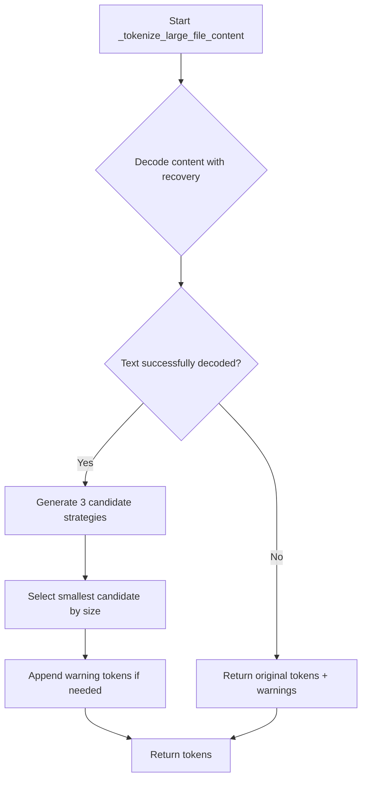
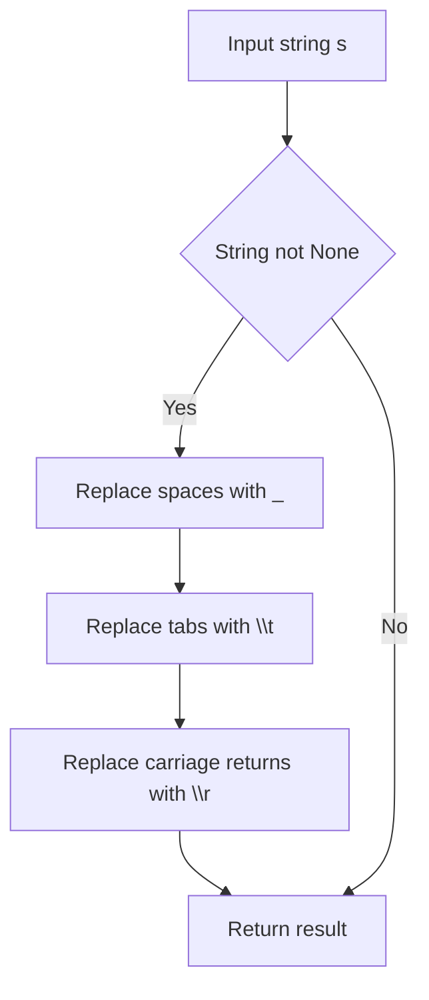
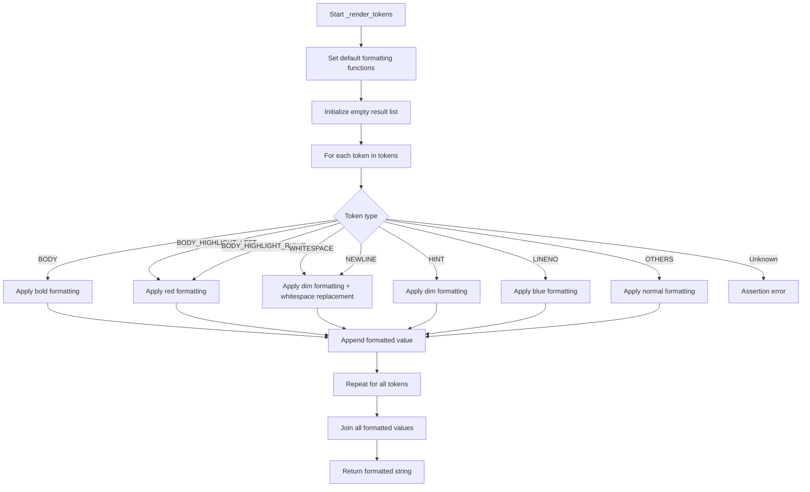
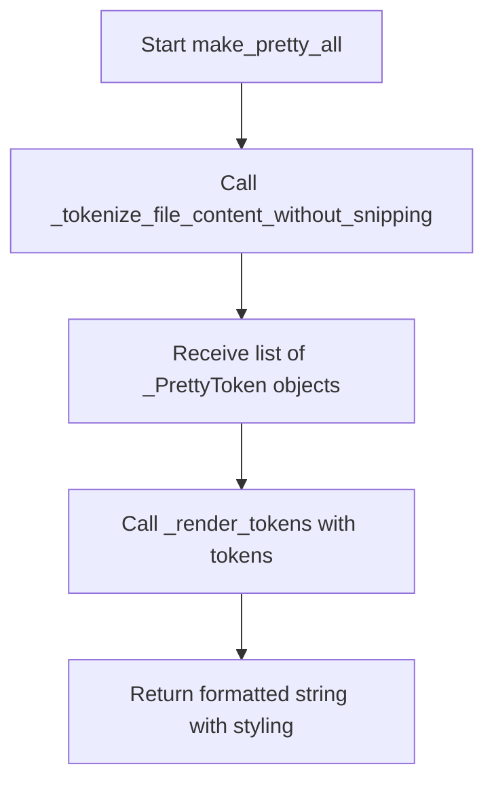

# `pretty_printers.py`

## `onlinejudge_command.pretty_printers._PrettyTokenType` · *class*

## Summary:
An enumeration representing different token types used for pretty printing and formatting output in the online judge command system.

## Description:
This internal enum defines various token types that are used to categorize different parts of formatted output during pretty printing operations. It serves as a classification system for different elements of text that may need special formatting or highlighting when displaying differences between expected and actual outputs. The enum is primarily used internally by the pretty printing system to determine how to format and display different components of output.

## State:
- All enum values are string constants with descriptive names indicating their purpose:
  - BODY: Regular body content
  - BODY_HIGHLIGHT_LEFT: Left portion of highlighted body content
  - BODY_HIGHLIGHT_RIGHT: Right portion of highlighted body content
  - WHITESPACE: Whitespace characters
  - NEWLINE: Newline characters
  - HINT: Hint messages or annotations
  - LINENO: Line numbers
  - OTHERS: Other unspecified token types

## Lifecycle:
- Creation: Instantiated automatically when the enum class is defined; no explicit instantiation required
- Usage: Used as a type-safe way to classify different parts of formatted output during pretty printing operations
- Destruction: Managed automatically by Python's garbage collection

## Method Map:


## Raises:
- No exceptions are raised during initialization as this is a simple enum definition

## Example:
```python
# Usage in pretty printing context
token_type = _PrettyTokenType.BODY_HIGHLIGHT_LEFT
print(token_type.value)  # Output: "BODY_HIGHLIGHT_LEFT"
```

## `onlinejudge_command.pretty_printers._PrettyToken` · *class*

## Summary:
A named tuple representing a formatted token used in pretty printing operations, consisting of a token type and its string value.

## Description:
The `_PrettyToken` class serves as a data structure for representing individual components of formatted output during pretty printing operations. It encapsulates both the semantic type of a text segment (using `_PrettyTokenType`) and the actual text content. This class is primarily used internally by the pretty printing system to categorize and format different parts of output, particularly when comparing expected vs actual results in competitive programming problem solving contexts.

The token system allows for sophisticated formatting and highlighting of differences between expected and actual outputs, enabling users to quickly identify discrepancies in their solutions.

## State:
- `type`: `_PrettyTokenType` - Represents the semantic category of the token (e.g., body content, whitespace, newlines, etc.)
- `value`: `str` - The actual string content of the token

## Lifecycle:
- Creation: Instantiated by passing a `_PrettyTokenType` and a string value to the constructor
- Usage: Typically used as part of sequences of tokens that represent formatted output, often processed by pretty printing functions
- Destruction: Managed automatically by Python's garbage collection

## Method Map:


## Raises:
- No exceptions are raised during instantiation as this is a simple NamedTuple

## Example:
```python
from onlinejudge_command.pretty_printers import _PrettyToken, _PrettyTokenType

# Create a pretty token for regular body content
token = _PrettyToken(_PrettyTokenType.BODY, "Hello World")
print(token.type)   # _PrettyTokenType.BODY
print(token.value)  # "Hello World"

# Create a pretty token for highlighted content
highlight_token = _PrettyToken(_PrettyTokenType.BODY_HIGHLIGHT_LEFT, "ERROR:")
print(highlight_token.type)   # _PrettyTokenType.BODY_HIGHLIGHT_LEFT
print(highlight_token.value)  # "ERROR:"

# Typical usage in a sequence of tokens for pretty printing
tokens = [
    _PrettyToken(_PrettyTokenType.LINENO, "1"),
    _PrettyToken(_PrettyTokenType.BODY, "Sample output"),
    _PrettyToken(_PrettyTokenType.NEWLINE, "\n"),
    _PrettyToken(_PrettyTokenType.HINT, "Expected: "),
    _PrettyToken(_PrettyTokenType.BODY_HIGHLIGHT_RIGHT, "Correct output")
]

for token in tokens:
    print(f"Type: {token.type}, Value: '{token.value}'")
```

## `onlinejudge_command.pretty_printers._optimize_tokens` · *function*

## Summary:
Merges consecutive tokens of the same type by concatenating their values to optimize token sequences.

## Description:
This function processes a list of `_PrettyToken` objects and optimizes them by merging adjacent tokens that have identical types. When two or more consecutive tokens share the same type, their string values are concatenated into a single token, reducing the total number of tokens while preserving semantic meaning. This optimization helps minimize token overhead in pretty printing operations.

The function is typically called during the processing of formatted output where consecutive text segments of the same semantic type (such as multiple lines of body content or consecutive whitespace) can be efficiently combined.

## Args:
    tokens (List[_PrettyToken]): A list of `_PrettyToken` objects to be optimized. Each token consists of a type (`_PrettyTokenType`) and a string value.

## Returns:
    List[_PrettyToken]: A new list containing the optimized tokens. Consecutive tokens of the same type have been merged into single tokens with concatenated values.

## Raises:
    None: This function does not raise any exceptions under normal operation.

## Constraints:
    Preconditions:
    - Input tokens list can be empty
    - Each token in the input list must be a valid `_PrettyToken` instance
    
    Postconditions:
    - The returned list contains the same semantic content as the input
    - No two consecutive tokens in the result have the same type
    - The total length of concatenated values in the result matches the input

## Side Effects:
    None: This function is pure and has no side effects.

## Control Flow:


## Examples:
```python
# Example 1: Basic optimization
from onlinejudge_command.pretty_printers import _PrettyToken, _PrettyTokenType

tokens = [
    _PrettyToken(_PrettyTokenType.BODY, "Hello "),
    _PrettyToken(_PrettyTokenType.BODY, "World"),
    _PrettyToken(_PrettyTokenType.NEWLINE, "\n"),
    _PrettyToken(_PrettyTokenType.BODY, "Test")
]

optimized = _optimize_tokens(tokens)
# Result: [
#     _PrettyToken(_PrettyTokenType.BODY, "Hello World"),
#     _PrettyToken(_PrettyTokenType.NEWLINE, "\n"),
#     _PrettyToken(_PrettyTokenType.BODY, "Test")
# ]

# Example 2: Empty input
empty_result = _optimize_tokens([])
# Result: []

# Example 3: Single token
single = _optimize_tokens([_PrettyToken(_PrettyTokenType.BODY, "Single")])
# Result: [_PrettyToken(_PrettyTokenType.BODY, "Single")]
```

## `onlinejudge_command.pretty_printers._tokenize_str` · *function*

## Summary:
Breaks a string into tokens based on consecutive whitespace and non-whitespace character groups.

## Description:
This private utility function processes a string by grouping consecutive whitespace characters (spaces and tabs) together as one token, and consecutive non-whitespace characters as another token. It's used internally by the pretty printing system to prepare text for formatted comparison and display operations.

The function is extracted into its own component to separate the text tokenization logic from the higher-level pretty printing logic, making the system more modular and testable. This separation allows the tokenization process to be reused in different contexts within the pretty printing system.

## Args:
    s (str): The input string to tokenize

## Returns:
    List[_PrettyToken]: A list of tokens where each token contains either whitespace or non-whitespace content, grouped consecutively

## Raises:
    None

## Constraints:
    Preconditions:
    - Input must be a string
    
    Postconditions:
    - All characters from the input string are included in the returned tokens
    - Tokens are ordered sequentially according to their position in the input string
    - Each token contains only one type of character (whitespace or non-whitespace)

## Side Effects:
    None

## Control Flow:
```mermaid
flowchart TD
    A[Start] --> B{len(s) > 0?}
    B -- Yes --> C[Initialize tokens=[], l=0]
    C --> D{l < len(s)?}
    D -- Yes --> E[r = l+1]
    E --> F{r < len(s) AND (s[l] in ' \\t') == (s[r] in ' \\t')?}
    F -- Yes --> G[r++]
    G --> F
    F -- No --> H{is whitespace?}
    H -- Yes --> I[typ = WHITESPACE]
    H -- No --> J[typ = BODY]
    I --> K[Create token(typ, s[l:r])]
    J --> K
    K --> L[tokens.append(token)]
    L --> M[l = r]
    M --> D
    D -- No --> N[Return tokens]
    B -- No --> N
```

## Examples:
    >>> _tokenize_str("hello world")
    [_PrettyToken(type=_PrettyTokenType.BODY, value="hello"), _PrettyToken(type=_PrettyTokenType.WHITESPACE, value=" "), _PrettyToken(type=_PrettyTokenType.BODY, value="world")]
    
    >>> _tokenize_str("  hello\t\tworld  ")
    [_PrettyToken(type=_PrettyTokenType.WHITESPACE, value="  "), _PrettyToken(type=_PrettyTokenType.BODY, value="hello"), _PrettyToken(type=_PrettyTokenType.WHITESPACE, value="\t\t"), _PrettyToken(type=_PrettyTokenType.BODY, value="world"), _PrettyToken(type=_PrettyTokenType.WHITESPACE, value="  ")]
    
    >>> _tokenize_str("")
    []
    
    >>> _tokenize_str("   ")
    [_PrettyToken(type=_PrettyTokenType.WHITESPACE, value="   ")]
    
    >>> _tokenize_str("a b c")
    [_PrettyToken(type=_PrettyTokenType.BODY, value="a"), _PrettyToken(type=_PrettyTokenType.WHITESPACE, value=" "), _PrettyToken(type=_PrettyTokenType.BODY, value="b"), _PrettyToken(type=_PrettyTokenType.WHITESPACE, value=" "), _PrettyToken(type=_PrettyTokenType.BODY, value="c")]
```

## `onlinejudge_command.pretty_printers._tokenize_line` · *function*

## Summary:
Breaks a line into tokens, separating body content from trailing newlines and whitespace.

## Description:
Processes a line string by splitting it into tokens that represent different components of the line: body content, trailing whitespace, and newline characters. This function is responsible for preparing lines for pretty printing by categorizing their structural elements into distinct token types.

The function extracts the body portion (everything before trailing newlines) and processes it using `_tokenize_str`. It then handles any trailing newline characters separately, treating different newline types (\n, \r\n) appropriately. If trailing whitespace exists after newlines, it's tokenized as WHITESPACE and a hint token is added to indicate the presence of trailing whitespace.

This logic is extracted into its own function to separate the concerns of line-level tokenization from the higher-level pretty printing logic, improving modularity and testability.

## Args:
    line (str): The input line string to tokenize, potentially containing trailing newlines and whitespace

## Returns:
    List[_PrettyToken]: A list of tokens representing the components of the line, including:
        - Body content tokens (BODY type) from `_tokenize_str`
        - Whitespace tokens (WHITESPACE type) for trailing whitespace
        - Newline tokens (NEWLINE type) for newline characters
        - Hint tokens (HINT type) for trailing whitespace indicators

## Raises:
    None

## Constraints:
    Preconditions:
    - Input must be a string
    
    Postconditions:
    - All characters from the input line are represented in the returned tokens
    - Tokens are ordered sequentially according to their position in the input line
    - The returned list is never None (empty list is acceptable)

## Side Effects:
    None

## Control Flow:
```mermaid
flowchart TD
    A[Start _tokenize_line(line)] --> B{line.rstrip() != line?}
    B -- Yes --> C[body = line.rstrip()]
    B -- No --> C[body = line]
    C --> D[newline = line[len(body):]]
    D --> E{body != ""?}
    E -- Yes --> F[tokens += _tokenize_str(body)]
    E -- No --> G[Skip body processing]
    F --> H[Goto I]
    G --> I{newline != ""?}
    I -- Yes --> J{newline in ('\n', '\r\n')?}
    J -- Yes --> K[tokens.append(_PrettyToken(_PrettyTokenType.NEWLINE, newline))]
    J -- No --> L[whitespace = newline.rstrip('\n')]
    L --> M[newline = newline[len(whitespace):]]
    M --> N{whitespace != ""?}
    N -- Yes --> O[tokens.append(_PrettyToken(_PrettyTokenType.WHITESPACE, whitespace))]
    N -- No --> P[Skip whitespace token]
    O --> Q[Add hint token]
    P --> Q
    Q --> R[tokens.append(_PrettyToken(_PrettyTokenType.HINT, "(trailing whitespace)"))]
    R --> S{newline != ""?}
    S -- Yes --> T[tokens.append(_PrettyToken(_PrettyTokenType.NEWLINE, newline))]
    S -- No --> U[Skip newline token]
    T --> U
    U --> V[Return tokens]
```

## Examples:
    >>> _tokenize_line("hello world\\n")
    [_PrettyToken(type=_PrettyTokenType.BODY, value="hello"), _PrettyToken(type=_PrettyTokenType.WHITESPACE, value=" "), _PrettyToken(type=_PrettyTokenType.BODY, value="world"), _PrettyToken(type=_PrettyTokenType.NEWLINE, value="\\n")]
    
    >>> _tokenize_line("test\\r\\n")
    [_PrettyToken(type=_PrettyTokenType.BODY, value="test"), _PrettyToken(type=_PrettyTokenType.NEWLINE, value="\\r\\n")]
    
    >>> _tokenize_line("trailing   \\n")
    [_PrettyToken(type=_PrettyTokenType.BODY, value="trailing"), _PrettyToken(type=_PrettyTokenType.WHITESPACE, value="   "), _PrettyToken(type=_PrettyTokenType.HINT, value="(trailing whitespace)"), _PrettyToken(type=_PrettyTokenType.NEWLINE, value="\\n")]
    
    >>> _tokenize_line("")
    []

## `onlinejudge_command.pretty_printers._decode_with_recovery` · *function*

## Summary:
Decodes binary content to text while providing recovery mechanisms for invalid UTF-8 sequences.

## Description:
This function attempts to decode bytes into a UTF-8 string. When encountering invalid UTF-8 sequences, it gracefully recovers by adding a hint token describing the decoding error and then decodes the content using error replacement strategy. This ensures that the function always returns valid text, even when the input contains malformed byte sequences.

The function is designed to handle binary content that may contain non-UTF-8 data gracefully, making it suitable for processing output from programs that might produce unexpected character encodings.

## Args:
    content (bytes): Binary data to be decoded into text

## Returns:
    Tuple[List[_PrettyToken], str]: A tuple containing:
        - List of _PrettyToken objects (empty if no decoding errors occurred, otherwise containing a HINT token with error details)
        - Decoded text string (with replacement characters for invalid sequences if errors occurred)

## Raises:
    None: This function handles all potential UnicodeDecodeError exceptions internally

## Constraints:
    Preconditions:
        - The `content` parameter must be of type `bytes`
    Postconditions:
        - The returned text string is always valid UTF-8
        - The returned tokens list may contain error hints when decoding issues occur
        - The function never raises exceptions

## Side Effects:
    None: This function performs no I/O operations or external state mutations

## Control Flow:
```mermaid
flowchart TD
    A[Start: _decode_with_recovery] --> B{Try decode()}
    B -->|Success| C[Return (tokens=[], text)]
    B -->|UnicodeDecodeError| D[Add HINT token with error]
    D --> E[Decode with errors='replace']
    E --> F[Return (tokens, text)]
```

## Examples:
```python
# Example 1: Valid UTF-8 content
content = b"Hello, world!"
tokens, text = _decode_with_recovery(content)
# tokens = [] (empty list)
# text = "Hello, world!"

# Example 2: Invalid UTF-8 content with recovery
content = b"Hello\xFFworld"
tokens, text = _decode_with_recovery(content)
# tokens = [_PrettyToken(_PrettyTokenType.HINT, "invalid start byte")]
# text = "Hello�world" (with replacement character)
```

## `onlinejudge_command.pretty_printers._warn_if_empty` · *function*

## Summary:
Adds contextual hint tokens to formatted output when the token sequence is empty or lacks proper trailing newlines.

## Description:
This utility function enhances formatted output by appending descriptive hint tokens when specific conditions are met. It serves as a diagnostic aid in pretty-printing operations, helping users understand the nature of output tokens when they might be ambiguous or incomplete. The function is designed to be called during the pretty-printing pipeline to provide additional context about the formatted content.

The function is typically invoked as part of the pretty printing process where formatted output tokens are being prepared for display or comparison. It's extracted into its own function to separate the concern of output diagnostics from the core formatting logic, promoting cleaner code organization and reusability.

## Args:
    tokens (List[_PrettyToken]): A list of formatted tokens representing output content. Each token consists of a type (_PrettyTokenType) and a string value.

## Returns:
    List[_PrettyToken]: The original list of tokens with additional hint tokens appended when appropriate. The returned list may contain one or more hint tokens that provide context about the output's characteristics.

## Raises:
    None explicitly raised by this function.

## Constraints:
    Preconditions:
    - The input `tokens` parameter must be a list (though the function handles empty lists gracefully)
    - Each item in the tokens list must be a valid `_PrettyToken` instance
    
    Postconditions:
    - The returned list contains all original tokens plus zero or more hint tokens
    - The original tokens list is not mutated; a new list is returned
    - All returned tokens maintain their original types and values

## Side Effects:
    None - This function performs no I/O operations or external state mutations.

## Control Flow:
```mermaid
flowchart TD
    A[Start: _warn_if_empty] --> B{Are tokens empty?}
    B -- Yes --> C[Return [(empty)] hint token]
    B -- No --> D[Check last token type]
    D --> E{Last token type == BODY?}
    E -- Yes --> F[Append (no trailing newline) hint]
    E -- No --> G[Skip trailing newline check]
    G --> H{All tokens NEWLINE?}
    H -- Yes --> I[Append (only newline) hint]
    H -- No --> J[Return original tokens]
    F --> J
    I --> J
    J --> K[End]
```

## Examples:
```python
# Example 1: Empty token list
from onlinejudge_command.pretty_printers import _warn_if_empty, _PrettyToken, _PrettyTokenType

empty_tokens = []
result = _warn_if_empty(empty_tokens)
# result = [_PrettyToken(_PrettyTokenType.HINT, '(empty)')]

# Example 2: Token list ending with BODY (missing trailing newline)
body_tokens = [
    _PrettyToken(_PrettyTokenType.BODY, "Hello"),
    _PrettyToken(_PrettyTokenType.NEWLINE, "\n")
]
result = _warn_if_empty(body_tokens)
# result = [
#     _PrettyToken(_PrettyTokenType.BODY, "Hello"),
#     _PrettyToken(_PrettyTokenType.NEWLINE, "\n"),
#     _PrettyToken(_PrettyTokenType.HINT, "(no trailing newline)")
# ]

# Example 3: Token list with only newlines
newline_tokens = [
    _PrettyToken(_PrettyTokenType.NEWLINE, "\n"),
    _PrettyToken(_PrettyTokenType.NEWLINE, "\n")
]
result = _warn_if_empty(newline_tokens)
# result = [
#     _PrettyToken(_PrettyTokenType.NEWLINE, "\n"),
#     _PrettyToken(_PrettyTokenType.NEWLINE, "\n"),
#     _PrettyToken(_PrettyTokenType.HINT, "(only newline)")
# ]
```

## `onlinejudge_command.pretty_printers._tokenize_large_file_content` · *function*

## Summary:
Processes large binary file content into formatted tokens with intelligent truncation strategies.

## Description:
Transforms binary file content into a list of formatted tokens suitable for pretty printing, applying intelligent truncation strategies when content exceeds specified limits. This function is designed to handle large output files efficiently by selecting the most compact representation among multiple truncation approaches.

The function implements three distinct strategies for handling large content:
1. Do-nothing approach: Processes all lines normally
2. Line-based approach: Shows head and tail lines with a hint about skipped lines
3. Character-based approach: Shows head and tail based on character count with a hint about skipped characters

It intelligently selects the most compact representation among these strategies to minimize output size while preserving important context.

Known callers within the codebase:
- Called by `onlinejudge_command.pretty_printers._print_diff` when processing large output files that exceed display limits
- Triggered during output comparison operations when content size exceeds configured thresholds

This logic is extracted into its own function rather than inlined because it encapsulates complex truncation logic with multiple strategies, making it reusable and testable. It separates the concerns of content processing from the higher-level pretty printing logic, improving modularity and maintainability.

## Args:
    content (bytes): Binary content to be tokenized and formatted
    limit (int): Maximum number of lines or characters to display before applying truncation
    head (int): Number of lines/characters to show from the beginning of content
    tail (int): Number of lines/characters to show from the end of content  
    char_in_line (int): Average number of characters per line used for character-based truncation calculation

## Returns:
    List[_PrettyToken]: A list of formatted tokens representing the processed content, including:
        - Normal tokens for body content, whitespace, and newlines
        - Hint tokens for truncated sections
        - Error tokens when decoding issues occur

## Raises:
    AssertionError: When head + tail >= limit, ensuring valid truncation parameters

## Constraints:
    Preconditions:
        - head + tail < limit must be true to avoid invalid truncation ranges
        - content must be of type bytes
        - limit, head, and tail must be non-negative integers
        - char_in_line must be positive
        
    Postconditions:
        - The returned list always contains valid _PrettyToken objects
        - Truncation strategies are applied consistently based on content size
        - Error recovery is handled gracefully through _decode_with_recovery

## Side Effects:
    None: This function performs no I/O operations or external state mutations

## Control Flow:


## Examples:
```python
# Example 1: Small content that doesn't require truncation
content = b"Line 1\nLine 2\nLine 3\n"
tokens = _tokenize_large_file_content(
    content=content,
    limit=10,
    head=3,
    tail=3,
    char_in_line=50
)
# Returns all tokens without truncation

# Example 2: Large content with line-based truncation
large_content = b"\n".join([f"Line {i}" for i in range(100)]) + b"\n"
tokens = _tokenize_large_file_content(
    content=large_content,
    limit=10,
    head=3,
    tail=3,
    char_in_line=50
)
# Returns head lines, hint about 94 skipped lines, and tail lines

# Example 3: Content that triggers character-based truncation
long_lines = b"X" * 1000 + b"\n" + b"Y" * 1000 + b"\n"
tokens = _tokenize_large_file_content(
    content=long_lines,
    limit=5,
    head=2,
    tail=2,
    char_in_line=100
)
# Returns head characters, hint about skipped characters, and tail characters
```

## `onlinejudge_command.pretty_printers._replace_whitespace` · *function*

## Summary:
Replaces common whitespace characters in a string with their visual representations for better display.

## Description:
Converts space, tab, and carriage return characters into underscore and escape sequences to make them visible for display purposes. This utility function is used to prepare strings for pretty printing or visualization where whitespace characters need to be clearly distinguishable.

## Args:
    s (str): Input string containing whitespace characters to be replaced

## Returns:
    str: A copy of the input string with:
        - Spaces (' ') replaced with underscores ('_')
        - Tabs ('\t') replaced with literal '\t' string
        - Carriage returns ('\r') replaced with literal '\r' string

## Raises:
    None: This function does not raise any exceptions

## Constraints:
    Preconditions:
        - Input parameter `s` must be a string type
    Postconditions:
        - Return value is always a string of the same length or shorter
        - Original input string is not modified (immutable operation)

## Side Effects:
    None: This function has no side effects

## Control Flow:


## Examples:
    >>> _replace_whitespace("hello world")
    'hello_world'
    
    >>> _replace_whitespace("line1\ttabbed")
    'line1\\ttabbed'
    
    >>> _replace_whitespace("carriage\rreturn")
    'carriage\\rreturn'
    
    >>> _replace_whitespace("mixed \t \r spaces")
    'mixed \\t \\r spaces'

## `onlinejudge_command.pretty_printers._render_tokens` · *function*

## Summary:
Formats a sequence of typed tokens into a colored, styled string representation for display.

## Description:
Processes a list of formatted tokens with associated types and applies appropriate styling based on token categories. This function serves as a core utility for pretty printing output in the online judge command system, particularly for displaying differences between expected and actual results with proper formatting and highlighting.

The function extracts formatting logic into a separate component to enable consistent styling across different display contexts while allowing customization of styling functions. This separation of concerns makes it easier to test the formatting logic independently and provides flexibility for different terminal environments.

## Args:
    tokens (List[_PrettyToken]): Sequence of token objects containing type and value pairs for formatting
    font_bold (Optional[Callable[[str], str]]): Function to apply bold formatting, defaults to colorama-based bold if None
    font_dim (Optional[Callable[[str], str]]): Function to apply dim/dimmed formatting, defaults to colorama-based dim if None  
    font_red (Optional[Callable[[str], str]]): Function to apply red color formatting, defaults to colorama-based red if None
    font_blue (Optional[Callable[[str], str]]): Function to apply blue color formatting, defaults to colorama-based blue if None
    font_normal (Optional[Callable[[str], str]]): Function to apply normal formatting, defaults to identity function if None

## Returns:
    str: A formatted string with appropriate styling applied to each token based on its type

## Raises:
    AssertionError: When an unexpected token type is encountered (should not happen with valid inputs)

## Constraints:
    Preconditions:
        - All tokens in the input list must be valid _PrettyToken instances with type and value attributes
        - Token types must be from the _PrettyTokenType enumeration
        - Each token's value must be a string
    Postconditions:
        - Returns a properly formatted string with all tokens processed
        - The returned string contains no invalid formatting sequences
        - All colorama formatting is properly reset

## Side Effects:
    None: This function has no side effects beyond returning a formatted string

## Control Flow:


## Examples:
    # Basic usage with default formatting
    tokens = [
        _PrettyToken(_PrettyTokenType.LINENO, "1"),
        _PrettyToken(_PrettyTokenType.BODY, "Expected output"),
        _PrettyToken(_PrettyTokenType.NEWLINE, "\n"),
        _PrettyToken(_PrettyTokenType.HINT, "Got: "),
        _PrettyToken(_PrettyTokenType.BODY_HIGHLIGHT_RIGHT, "Actual output")
    ]
    formatted = _render_tokens(tokens=tokens)
    # Returns a string with line numbers in blue, body in bold, 
    # newlines and hints in dim, and highlighted content in red
    
    # Usage with custom formatting functions
    def custom_bold(text):
        return f"**{text}**"
    
    def custom_red(text):
        return f"[RED]{text}[/RED]"
        
    formatted = _render_tokens(
        tokens=tokens,
        font_bold=custom_bold,
        font_red=custom_red
    )
    # Returns a string with custom formatting applied

## `onlinejudge_command.pretty_printers._get_terminal_size` · *function*

## Summary:
Returns the terminal width with a minimum constraint of 40 characters.

## Description:
Retrieves the character width of the current terminal and ensures it meets a minimum threshold of 40 characters. This utility function is used to provide consistent formatting for output display in command-line interfaces, preventing overly narrow displays.

## Args:
    None

## Returns:
    int: The terminal width in characters, guaranteed to be at least 40.

## Raises:
    OSError: When the terminal size cannot be determined, typically in non-interactive environments such as when running in a CI/CD pipeline or when the process is not connected to a terminal.

## Constraints:
    Precondition: The function assumes a valid terminal environment or fallback mechanism exists.
    Postcondition: The returned value is always >= 40.

## Side Effects:
    None

## Control Flow:
```mermaid
flowchart TD
    A[Call shutil.get_terminal_size()] --> B{Get terminal dimensions}
    B --> C[Extract width (char_in_line)]
    C --> D[Compare with 40]
    D --> E{char_in_line < 40?}
    E -->|Yes| F[Return 40]
    E -->|No| G[Return char_in_line]
    F --> H[End]
    G --> H
```

## Examples:
    >>> _get_terminal_size()
    80
    >>> _get_terminal_size()  # In narrow terminal or non-interactive environment
    40

## `onlinejudge_command.pretty_printers.make_pretty_large_file_content` · *function*

*No documentation generated.*

## `onlinejudge_command.pretty_printers._tokenize_file_content_without_snipping` · *function*

## Summary:
Converts binary file content into a sequence of formatted tokens for pretty printing, handling decoding errors gracefully and preserving line structure.

## Description:
Processes binary content by first decoding it into text (with recovery from invalid UTF-8 sequences), then tokenizing each line into structured components, and finally adding diagnostic hints for empty or incomplete output. This function serves as the core tokenization pipeline for formatted output presentation in competitive programming tools.

The function is designed to handle binary content that may contain non-UTF-8 data gracefully, ensuring that all output can be properly formatted for display or comparison. It separates the concerns of content decoding, line-level tokenization, and output diagnostics into distinct phases, making the pretty printing system more modular and maintainable.

## Args:
    content (bytes): Binary file content to be converted into tokens. This may contain valid UTF-8 or invalid byte sequences that require recovery handling.

## Returns:
    List[_PrettyToken]: A list of formatted tokens representing the decoded content. Each token contains a semantic type and its string value, enabling rich formatting and comparison operations. The returned list may include:
        - BODY tokens for content text
        - NEWLINE tokens for line endings
        - WHITESPACE tokens for spacing
        - HINT tokens for diagnostic information (empty output, missing newlines, etc.)
        - Error recovery tokens when invalid UTF-8 is encountered

## Raises:
    None: This function handles all potential decoding errors internally through the `_decode_with_recovery` helper.

## Constraints:
    Preconditions:
        - The `content` parameter must be of type `bytes`
        
    Postconditions:
        - The returned list of tokens is never None
        - All tokens in the returned list are valid `_PrettyToken` instances
        - The function always returns a complete token sequence representing the entire input content

## Side Effects:
    None: This function performs no I/O operations or external state mutations.

## Control Flow:
```mermaid
flowchart TD
    A[Start: _tokenize_file_content_without_snipping] --> B[Decode content with _decode_with_recovery]
    B --> C{Decoding successful?}
    C -->|Yes| D[Get tokens and text]
    C -->|No| D[Get tokens (with error hints) and text]
    D --> E[Split text into lines (keepends=True)]
    E --> F{Has lines?}
    F -->|Yes| G[Process each line with _tokenize_line]
    F -->|No| H[Skip line processing]
    G --> I[Accumulate line tokens]
    H --> I
    I --> J[Apply _warn_if_empty to add diagnostic hints]
    J --> K[Return final token list]
```

## Examples:
```python
# Example 1: Valid UTF-8 content
content = b"Hello, world!\nTest line\n"
tokens = _tokenize_file_content_without_snipping(content)
# Returns tokens representing: "Hello, world!", newline, "Test line", newline

# Example 2: Content with invalid UTF-8 requiring recovery
content = b"Valid text\xFFinvalid byte\n"
tokens = _tokenize_file_content_without_snipping(content)
# Returns tokens including error recovery hints and the decoded text with replacement characters

# Example 3: Empty content
content = b""
tokens = _tokenize_file_content_without_snipping(content)
# Returns tokens with an "(empty)" hint token
```

## `onlinejudge_command.pretty_printers.make_pretty_all` · *function*

## Summary:
Converts binary file content into a colored, formatted string representation for display.

## Description:
Processes binary file content by first decoding it into text (with recovery from invalid UTF-8 sequences), then tokenizing each line into structured components, and finally applying appropriate styling to create a visually formatted output. This function serves as the primary entry point for pretty printing raw binary content in the online judge command system.

The function is designed to handle binary content that may contain non-UTF-8 data gracefully, ensuring that all output can be properly formatted for display or comparison. It separates the concerns of content decoding, line-level tokenization, and output formatting into distinct phases, making the pretty printing system more modular and maintainable.

## Args:
    content (bytes): Binary file content to be converted into a pretty-printed string. This may contain valid UTF-8 or invalid byte sequences that require recovery handling.

## Returns:
    str: A formatted string with appropriate styling applied to the content, including line numbers, body text, whitespace, and newlines with proper terminal formatting.

## Raises:
    None: This function handles all potential decoding errors internally through the helper functions.

## Constraints:
    Preconditions:
        - The `content` parameter must be of type `bytes`
        
    Postconditions:
        - Returns a properly formatted string with all content processed
        - The returned string contains no invalid formatting sequences
        - All colorama formatting is properly reset

## Side Effects:
    None: This function performs no I/O operations or external state mutations.

## Control Flow:


## Examples:
    # Basic usage with valid UTF-8 content
    content = b"Hello, world!\nTest line\n"
    pretty_output = make_pretty_all(content)
    # Returns a formatted string with proper styling
    
    # Usage with content containing invalid UTF-8
    content = b"Valid text\xFFinvalid byte\n"
    pretty_output = make_pretty_all(content)
    # Returns a formatted string with error recovery hints and replacement characters
```

## `onlinejudge_command.pretty_printers._skip_whitespaces` · *function*

## Summary:
Skips whitespace characters in a string and converts them into formatted tokens for pretty printing.

## Description:
Processes consecutive whitespace characters (spaces, tabs, carriage returns, and newlines) starting at a given index in a string, converting each character into a `_PrettyToken` with appropriate type classification. The function continues processing until a non-whitespace character is encountered or the end of the string is reached. The resulting tokens are then optimized to merge consecutive tokens of the same type.

This function is typically used as part of a larger pretty printing pipeline where whitespace characters need to be identified and categorized separately from other content for proper formatting and comparison purposes.

## Args:
    i (int): The starting index in the string to process whitespace characters from.
    s (str): The input string being processed for whitespace characters.

## Returns:
    Tuple[int, List[_PrettyToken]]: A tuple containing:
        - The new index position after processing all consecutive whitespace characters
        - A list of `_PrettyToken` objects representing the whitespace characters, optimized for efficient processing

## Raises:
    None: This function does not explicitly raise any exceptions.

## Constraints:
    Preconditions:
    - The input index `i` must be a valid index within the bounds of string `s` (0 <= i <= len(s))
    - The input string `s` must be a valid string object
    
    Postconditions:
    - The returned index will be either the original index if no whitespace was found, or the index after the last processed whitespace character
    - The returned tokens list will contain properly typed tokens for whitespace characters
    - The tokens will be optimized to merge consecutive tokens of the same type

## Side Effects:
    None: This function is pure and has no side effects.

## Control Flow:
```mermaid
flowchart TD
    A[Start _skip_whitespaces(i, s)] --> B{i < len(s) AND s[i] in ' \\t\\r\\n'?}
    B -- No --> C[Return (i, _optimize_tokens([]))]
    B -- Yes --> D[Initialize empty tokens list]
    D --> E{Character is space or tab?}
    E -- Yes --> F[Set token type to WHITESPACE]
    E -- No --> G[Set token type to NEWLINE]
    F --> H[Add token to list]
    G --> H
    H --> I[Increment i]
    I --> J{Continue while i < len(s) AND s[i] in ' \\t\\r\\n'?}
    J -- Yes --> E
    J -- No --> K[Call _optimize_tokens(tokens)]
    K --> L[Return (i, _optimize_tokens(tokens))]
```

## Examples:
```python
from onlinejudge_command.pretty_printers import _skip_whitespaces

# Example 1: Skip leading whitespace
text = "   Hello World"
index, tokens = _skip_whitespaces(0, text)
print(f"New index: {index}")  # New index: 3
print(f"Tokens: {tokens}")    # Tokens: [PrettyToken(type=WHITESPACE, value='   ')]

# Example 2: Skip mixed whitespace
text = " \t\r\n Test"
index, tokens = _skip_whitespaces(0, text)
print(f"New index: {index}")  # New index: 4
print(f"Tokens: {tokens}")    # Tokens: [PrettyToken(type=WHITESPACE, value=' '), PrettyToken(type=NEWLINE, value='\t'), PrettyToken(type=NEWLINE, value='\r'), PrettyToken(type=NEWLINE, value='\n')]

# Example 3: No whitespace at start
text = "NoLeadingSpace"
index, tokens = _skip_whitespaces(0, text)
print(f"New index: {index}")  # New index: 0
print(f"Tokens: {tokens}")    # Tokens: []
```

## `onlinejudge_command.pretty_printers._make_diff_between_line_and_line_by_comparing_word_by_word` · *function*

## Summary:
Compares two strings word-by-word and generates tokenized representations with highlighting for differing words.

## Description:
This function performs a detailed word-by-word comparison between two strings, producing tokenized output for each string that preserves formatting while marking differences. It's designed to support pretty-printing of output comparisons in competitive programming environments where visual distinction between matching and mismatching words is important.

The function assumes both strings contain the same number of words (as validated by an assertion), and processes them character-by-character to identify word boundaries. When words differ between the two strings, they are marked with special highlight tokens to distinguish them visually.

This logic is extracted into its own function to separate the core word-comparison algorithm from higher-level pretty-printing concerns, making it reusable and testable independently.

## Args:
    a (str): First string to compare
    b (str): Second string to compare

## Returns:
    Tuple[List[_PrettyToken], List[_PrettyToken]]: A pair of lists containing tokenized representations of the two input strings. Each list contains `_PrettyToken` objects where:
    - Tokens with type `_PrettyTokenType.BODY` represent matching content
    - Tokens with type `_PrettyTokenType.BODY_HIGHLIGHT_LEFT` represent words from the first string that don't match the corresponding word in the second string  
    - Tokens with type `_PrettyTokenType.BODY_HIGHLIGHT_RIGHT` represent words from the second string that don't match the corresponding word in the first string
    - Whitespace and newline tokens are also included in the appropriate positions through the `_skip_whitespaces` helper function

## Raises:
    AssertionError: When the two input strings do not contain the same number of words after stripping whitespace

## Constraints:
    Preconditions:
    - Both input strings `a` and `b` must be valid string objects
    - Both strings must contain the same number of words (after stripping whitespace)
    
    Postconditions:
    - The returned token lists will contain exactly one token for each character in the respective input strings
    - All tokens in the returned lists will be properly typed according to their content
    - The function will process the entire length of both input strings

## Side Effects:
    None: This function is pure and has no side effects.

## Control Flow:
```mermaid
flowchart TD
    A[Start _make_diff_between_line_and_line_by_comparing_word_by_word(a, b)] --> B[Validate equal word counts]
    B --> C[Initialize empty token lists and position pointers]
    C --> D[Skip initial whitespaces using _skip_whitespaces]
    D --> E{Position < string length AND position < string length?}
    E -- No --> F[Assert final positions equal string lengths]
    F --> G[Return token lists]
    E -- Yes --> H[Find word boundary in string a (non-whitespace chars)]
    H --> I[Find word boundary in string b (non-whitespace chars)]
    I --> J[Extract words from both strings]
    J --> K{Words are equal?}
    K -- Yes --> L[Add BODY tokens to both lists]
    K -- No --> M[Add BODY_HIGHLIGHT_LEFT to first list, BODY_HIGHLIGHT_RIGHT to second list]
    L --> N[Advance positions to word boundaries]
    M --> N
    N --> O[Skip subsequent whitespaces using _skip_whitespaces]
    O --> P[Loop back to check conditions]
```

## Examples:
```python
from onlinejudge_command.pretty_printers import _make_diff_between_line_and_line_by_comparing_word_by_word

# Example 1: Identical strings
line1 = "hello world"
line2 = "hello world"
tokens_a, tokens_b = _make_diff_between_line_and_line_by_comparing_word_by_word(line1, line2)
# Both token lists will contain BODY tokens for "hello" and "world"

# Example 2: Different words
line1 = "hello world"
line2 = "hello there"
tokens_a, tokens_b = _make_diff_between_line_and_line_by_comparing_word_by_word(line1, line2)
# tokens_a will contain BODY tokens for "hello" and BODY for "world"
# tokens_b will contain BODY tokens for "hello" and BODY_HIGHLIGHT_RIGHT for "there"

# Example 3: Strings with whitespace differences
line1 = "hello   world"
line2 = "hello\tworld"
tokens_a, tokens_b = _make_diff_between_line_and_line_by_comparing_word_by_word(line1, line2)
# Both will contain matching words but potentially different whitespace tokens
```

## `onlinejudge_command.pretty_printers._tokenize_str_with_highlight` · *function*

## Summary:
Transforms a string into a list of formatted tokens with optional body content highlighting.

## Description:
Processes a string by first tokenizing it using `_tokenize_str`, then modifies BODY tokens to apply highlighting based on the `is_right` parameter. When `is_right` is True, BODY tokens are converted to `BODY_HIGHLIGHT_RIGHT` tokens; otherwise, they become `BODY_HIGHLIGHT_LEFT` tokens. This function enables visual distinction of content differences during output comparison operations.

The function is extracted to separate the highlighting logic from the basic tokenization process, allowing for reusable highlighting functionality while maintaining clean separation of concerns in the pretty printing system.

## Args:
    s (str): The input string to tokenize and highlight
    is_right (bool): Flag determining highlight direction - True for right-side highlighting, False for left-side highlighting

## Returns:
    List[_PrettyToken]: A list of formatted tokens where BODY tokens are replaced with appropriately highlighted versions based on the `is_right` flag

## Raises:
    None

## Constraints:
    Preconditions:
    - Input `s` must be a string
    - Input `is_right` must be a boolean value
    
    Postconditions:
    - All characters from the input string are preserved in the returned tokens
    - Non-BODY tokens remain unchanged
    - BODY tokens are converted to either `BODY_HIGHLIGHT_LEFT` or `BODY_HIGHLIGHT_RIGHT` based on the `is_right` flag

## Side Effects:
    None

## Control Flow:
```mermaid
flowchart TD
    A[Start _tokenize_str_with_highlight] --> B[Call _tokenize_str(s)]
    B --> C{Iterate through tokens}
    C --> D[token.type == BODY?]
    D -- Yes --> E[Select highlight type based on is_right]
    E --> F[Create new token with highlight type]
    F --> G[Add to result tokens]
    D -- No --> H[Add original token to result tokens]
    C --> I{More tokens?}
    I -- Yes --> C
    I -- No --> J[Return tokens]
```

## Examples:
    >>> _tokenize_str_with_highlight("hello world", is_right=True)
    [_PrettyToken(type=_PrettyTokenType.BODY_HIGHLIGHT_RIGHT, value="hello world")]

    >>> _tokenize_str_with_highlight("hello world", is_right=False)
    [_PrettyToken(type=_PrettyTokenType.BODY_HIGHLIGHT_LEFT, value="hello world")]

    >>> _tokenize_str_with_highlight("a b c", is_right=True)
    [_PrettyToken(type=_PrettyTokenType.BODY_HIGHLIGHT_RIGHT, value="a b c")]
```

## `onlinejudge_command.pretty_printers._make_diff_between_line_and_line_by_difflib` · *function*

## Summary:
Creates tokenized representations of two strings with highlighted differences using difflib for line-by-line comparison.

## Description:
Compares two strings character-by-character using difflib's SequenceMatcher to identify differences, then converts the differing portions into highlighted tokens for pretty printing. This function generates visually distinct representations of string differences, particularly useful for comparing expected vs actual output in competitive programming problem solving contexts.

The function extracts the logic of creating diff-based tokenized representations into its own component to enable reuse across different pretty printing scenarios while maintaining clean separation between the diff computation and tokenization processes. It specifically handles line-by-line comparisons by stripping trailing newlines before processing but preserving them in the final output.

## Args:
    a (str): First string to compare, typically representing expected output
    b (str): Second string to compare, typically representing actual output

## Returns:
    Tuple[List[_PrettyToken], List[_PrettyToken]]: A pair of lists containing tokenized representations of the two input strings. The first list corresponds to string 'a' with appropriate highlighting for differences, and the second list corresponds to string 'b' with appropriate highlighting for differences. Tokens are categorized by type (BODY, WHITESPACE, NEWLINE, etc.) and differences are visually highlighted using appropriate token types.

## Raises:
    AssertionError: When difflib produces unexpected opcodes (should never occur in normal operation)

## Constraints:
    Preconditions:
    - Both input strings must be valid Python strings
    - The function assumes standard string operations work correctly
    
    Postconditions:
    - All characters from both input strings are represented in the returned tokens
    - Tokens are properly categorized by type (BODY, WHITESPACE, NEWLINE, etc.)
    - Differences between strings are visually highlighted using appropriate token types
    - Trailing newlines at the end of strings are properly preserved in output tokens
    - The returned token lists are optimized to merge consecutive tokens of the same type
    - The function operates on line-by-line comparisons by stripping trailing newlines before processing

## Side Effects:
    None

## Control Flow:
```mermaid
flowchart TD
    A[Start _make_diff_between_line_and_line_by_difflib] --> B[Initialize empty token lists]
    B --> C[Create difflib.SequenceMatcher]
    C --> D[Set sequences to stripped strings (remove trailing newlines)]
    D --> E[Get opcodes from matcher]
    E --> F{Iterate through opcodes}
    F --> G{Opcode tag == 'replace'?}
    G -- Yes --> H[Tokenize difference portions with highlighting]
    H --> I[Extend tokens_a and tokens_b]
    G -- No --> J{Opcode tag == 'delete'?}
    J -- Yes --> K[Tokenize deleted portion with left highlighting]
    K --> L[Extend tokens_a]
    J -- No --> M{Opcode tag == 'insert'?}
    M -- Yes --> N[Tokenize inserted portion with right highlighting]
    N --> O[Extend tokens_b]
    M -- No --> P{Opcode tag == 'equal'?}
    P -- Yes --> Q[Tokenize equal portions normally]
    Q --> R[Extend tokens_a and tokens_b]
    P -- No --> S[Assert False - unexpected opcode]
    F --> T{More opcodes?}
    T -- Yes --> F
    T -- No --> U[Handle trailing newlines]
    U --> V[Append NEWLINE tokens if needed]
    V --> W[Optimize tokens in both lists]
    W --> X[Return token pairs]
```

## `onlinejudge_command.pretty_printers._make_diff_between_line_and_line` · *function*

## Summary:
Chooses between word-by-word or difflib-based diff algorithms based on word count equality to generate tokenized representations of string differences.

## Description:
This function serves as a dispatcher that selects the appropriate diff algorithm for comparing two strings based on their word count characteristics. When both strings contain the same number of words (after stripping whitespace), it uses a word-by-word comparison approach that provides fine-grained highlighting of individual word differences. When the word counts differ, it falls back to difflib-based line-by-line comparison which handles structural differences more robustly.

This logic is extracted into its own function to separate the decision-making process from the actual diff implementations, allowing for cleaner code organization and easier testing of different comparison strategies.

## Args:
    a (str): First string to compare, typically representing expected output
    b (str): Second string to compare, typically representing actual output

## Returns:
    Tuple[List[_PrettyToken], List[_PrettyToken]]: A pair of lists containing tokenized representations of the two input strings. The exact format depends on which algorithm is selected:
    - When word counts are equal: Uses word-by-word comparison returning tokens with detailed highlighting for individual word differences
    - When word counts differ: Uses difflib-based comparison returning tokens with broader highlighting for line-level differences

## Raises:
    No explicit exceptions are raised by this function, though the underlying helper functions may raise AssertionError if their preconditions aren't met.

## Constraints:
    Preconditions:
    - Both input strings `a` and `b` must be valid string objects
    - The function assumes that the helper functions handle their own validation appropriately
    
    Postconditions:
    - The returned tuple contains two lists of `_PrettyToken` objects
    - Each list represents the tokenized version of the corresponding input string
    - The tokenization preserves the structure and content of the original strings

## Side Effects:
    None: This function is pure and has no side effects.

## Control Flow:
```mermaid
flowchart TD
    A[Start _make_diff_between_line_and_line(a, b)] --> B{len(a.strip().split()) == len(b.strip().split())?}
    B -- Yes --> C[Call _make_diff_between_line_and_line_by_comparing_word_by_word(a, b)]
    B -- No --> D[Call _make_diff_between_line_and_line_by_difflib(a, b)]
    C --> E[Return word-by-word diff tokens]
    D --> E
```

## `onlinejudge_command.pretty_printers._LineDiffOp` · *class*

## Summary:
A named tuple representing a line-level difference operation in a diff comparison, storing line number and tokenized content for both sides.

## Description:
The `_LineDiffOp` class serves as a data structure for representing a single line-level difference operation during diff comparisons between expected and actual output in competitive programming contexts. It is used internally by the pretty printing system to track differences between lines of formatted output, particularly when comparing expected vs actual results.

This class enables sophisticated formatting and highlighting of differences by associating line numbers with tokenized representations of content from both sides of the comparison. The tokens allow for rich formatting and semantic highlighting of differences.

## State:
- `lineno`: `int` - Zero-based line number. This can represent an index for either the left side, right side, or both sides of a comparison
- `left`: `Optional[List[_PrettyToken]]` - Tokenized representation of the left side content for this line, or None if not applicable
- `right`: `Optional[List[_PrettyToken]]` - Tokenized representation of the right side content for this line, or None if not applicable

## Lifecycle:
- Creation: Instantiated by passing a zero-based line number and optional tokenized content for both sides
- Usage: Typically created by diff algorithms and consumed by pretty printing functions to format differences
- Destruction: Managed automatically by Python's garbage collection

## Method Map:
```mermaid
graph LR
    A[_LineDiffOp] --> B[lineno: int]
    A --> C[left: Optional[List[_PrettyToken]]]
    A --> D[right: Optional[List[_PrettyToken]]]
```

## Raises:
- No exceptions are raised during instantiation as this is a simple NamedTuple

## Example:
```python
from onlinejudge_command.pretty_printers import _LineDiffOp, _PrettyToken, _PrettyTokenType

# Create a line diff operation for a line with content on both sides
line_op = _LineDiffOp(
    lineno=5,
    left=[_PrettyToken(_PrettyTokenType.BODY, "Expected output")],
    right=[_PrettyToken(_PrettyTokenType.BODY_HIGHLIGHT_RIGHT, "Actual output")]
)

print(line_op.lineno)  # 5
print(len(line_op.left))  # 1
print(len(line_op.right))  # 1

# Create a line diff operation for a line that only exists on the left side
left_only_op = _LineDiffOp(
    lineno=10,
    left=[_PrettyToken(_PrettyTokenType.BODY, "Only in expected")],
    right=None
)

print(left_only_op.right)  # None
```

## `onlinejudge_command.pretty_printers._make_diff_between_file_and_file_by_comparing_line_by_line` · *function*

## Summary:
Compares two text files line-by-line and generates detailed difference operations for mismatched lines, including handling extra lines in either file.

## Description:
This function performs a line-by-line comparison between two text files (represented as strings) and identifies differences between them. It leverages the `check_lines_match` function to determine if individual lines match according to the specified comparison mode, and for mismatched lines, it uses `_make_diff_between_line_and_line` to generate detailed tokenized differences. The function also handles cases where files have different numbers of lines by including extra lines from either file in the output.

This logic is extracted into its own function to separate the file-level comparison logic from the line-level difference generation, enabling clean modularization and easier testing of the diff algorithm. The function is part of the pretty printing system used in competitive programming environments to display meaningful differences between expected and actual outputs.

## Args:
    a (str): First text file content as a string, typically representing expected output
    b (str): Second text file content as a string, typically representing actual output
    compare_mode (CompareMode): The comparison strategy to use for line-by-line matching, determining how whitespace, newlines, and line endings are handled

## Returns:
    List[_LineDiffOp]: A list of line difference operations describing mismatches and extra lines. Each operation contains:
        - Line number (zero-based index)
        - Tokenized representation of content from the first file (or None if line only exists in second file)
        - Tokenized representation of content from the second file (or None if line only exists in first file)
    
    For matched lines, no operations are generated. For mismatched lines, one operation is generated with both tokenized contents. For files with different lengths, extra lines are represented with one side being None.

## Raises:
    AssertionError: When compare_mode is set to CompareMode.IGNORE_SPACES_AND_NEWLINES, as this comparison mode is not supported for file-level comparisons
    AssertionError: When the number of lines in both files differs (after removing trailing newlines), as this function expects files to have the same number of lines for proper comparison

## Constraints:
    Preconditions:
    - Both input strings `a` and `b` must be valid string objects
    - The `compare_mode` parameter must be a valid CompareMode enum value
    - Both files must have the same number of lines (after stripping trailing newlines)
    - The `compare_mode` cannot be CompareMode.IGNORE_SPACES_AND_NEWLINES
    
    Postconditions:
    - The returned list contains only _LineDiffOp objects
    - Each _LineDiffOp represents a line that differs between the files or an extra line
    - The line numbers in the returned operations are zero-based indices

## Side Effects:
    None: This function is pure and has no side effects beyond the comparison operation itself

## Control Flow:
```mermaid
flowchart TD
    A[Start _make_diff_between_file_and_file_by_comparing_line_by_line(a, b, compare_mode)] --> B[Validate compare_mode != IGNORE_SPACES_AND_NEWLINES]
    B --> C[Validate same number of lines in both files]
    C --> D[Initialize empty ops list]
    D --> E[Split both files into lines keeping ends]
    E --> F[Iterate through lines up to minimum length]
    F --> G{Lines match according to compare_mode?}
    G -- No --> H[Call _make_diff_between_line_and_line for mismatched line]
    H --> I[Append _LineDiffOp to ops]
    G -- Yes --> J[Continue to next line]
    J --> K{End of shorter file?}
    K -- No --> F
    K -- Yes --> L{compare_mode in (EXACT_MATCH, CRLF_INSENSITIVE_EXACT_MATCH)?}
    L -- Yes --> M[Process extra lines from file a]
    L -- No --> N[Process extra lines from file b]
    M --> O[Process extra lines from file b]
    O --> P[Return ops list]
    N --> P
```

## `onlinejudge_command.pretty_printers._tokenize_line_with_highlight` · *function*

## Summary:
Transforms line tokens by applying highlight styling to body content based on the right-side flag.

## Description:
Processes a line string by tokenizing it and applying highlight styling to body content tokens. When a body token is encountered, it is converted to either a left-highlighted or right-highlighted variant depending on the `is_right` parameter. This function enables visual distinction between different portions of output during comparison operations, particularly useful for highlighting differences in competitive programming problem solving contexts.

The function delegates the initial tokenization to `_tokenize_line` and then selectively modifies BODY tokens to add highlighting context. This logic is extracted into its own function to separate the concern of token transformation from the core tokenization logic, improving modularity and reusability.

## Args:
    line (str): The input line string to process and tokenize
    is_right (bool): Flag indicating whether to apply right-side highlighting (True) or left-side highlighting (False)

## Returns:
    List[_PrettyToken]: A list of tokens where BODY tokens have been converted to appropriate highlight variants while preserving all other token types unchanged

## Raises:
    None

## Constraints:
    Preconditions:
    - Input line must be a string
    - Input line can be empty
    
    Postconditions:
    - All characters from the input line are represented in the returned tokens
    - The returned list is never None (empty list is acceptable)
    - Token ordering is preserved from the original tokenization

## Side Effects:
    None

## Control Flow:
```mermaid
flowchart TD
    A[Start _tokenize_line_with_highlight(line, is_right)] --> B[Call _tokenize_line(line)]
    B --> C[Iterate through tokens]
    C --> D{token.type == _PrettyTokenType.BODY?}
    D -- Yes --> E{is_right?}
    E -- Yes --> F[typ = _PrettyTokenType.BODY_HIGHLIGHT_RIGHT]
    E -- No --> G[typ = _PrettyTokenType.BODY_HIGHLIGHT_LEFT]
    F --> H[_PrettyToken(typ, token.value)]
    G --> H
    D -- No --> I[token]
    H --> J[Append to result]
    I --> J
    J --> K[Return tokens]
```

## `onlinejudge_command.pretty_printers._make_diff_between_file_and_file_by_difflib` · *function*

## Summary:
Generates a structured diff representation between two text strings using Python's difflib module.

## Description:
This function performs a line-by-line comparison between two text inputs and produces a list of operations that describe how the texts differ. It uses difflib.SequenceMatcher to identify insertions, deletions, replacements, and unchanged lines, then formats these differences into _LineDiffOp objects that include tokenized content for enhanced visualization.

## Args:
    a (str): First text content to compare
    b (str): Second text content to compare

## Returns:
    List[_LineDiffOp]: A list of operations describing the differences between the two inputs. Each operation represents a change (insertion, deletion, replacement) or equality between lines.

## Raises:
    AssertionError: When internal consistency checks fail during processing of diff operations, specifically when sequence boundary conditions are violated for 'delete' and 'insert' operations.

## Constraints:
    Preconditions:
        - Both input strings must be valid text content
        - Lines should be properly terminated with newline characters (as splitlines(keepends=True) preserves them)
    
    Postconditions:
        - All lines from both inputs will be represented in the returned operations
        - Operations will be ordered according to line positions in the first text

## Side Effects:
    None - This function is pure and has no side effects

## Control Flow:
```mermaid
flowchart TD
    A[Start function] --> B[Split both strings into lines with keepends=True]
    B --> C[Create SequenceMatcher instance]
    C --> D[Set sequences to line arrays]
    D --> E[Get opcodes from matcher]
    E --> F{Opcode tag}
    F -->|replace| G[Process replacement operations]
    F -->|delete| H[Process deletion operations]
    F -->|insert| I[Process insertion operations]
    F -->|equal| J[Skip equal lines]
    F -->|other| K[Assert False - Invalid opcode]
    G --> L[Build LineDiffOps for replacements]
    H --> M[Build LineDiffOps for deletions]
    I --> N[Build LineDiffOps for insertions]
    L --> O[Return ops list]
    M --> O
    N --> O
```

## Examples:
    # Basic usage
    diff_ops = _make_diff_between_file_and_file_by_difflib("line1\nline2", "line1\nline3")
    # Returns list of _LineDiffOp objects showing line 2 was replaced

## `onlinejudge_command.pretty_printers._make_diff_between_file_and_file` · *function*

## Summary:
Compares two text files and generates a structured diff representation highlighting line-level differences.

## Description:
This function performs a comparison between two text file contents and returns detailed difference operations. It intelligently selects between two comparison strategies based on whether the files have the same number of lines. When files have equal line counts, it uses line-by-line comparison with tokenization. When line counts differ, it falls back to a general diff algorithm using difflib.

The function is designed to handle various comparison modes and special cases like carriage returns in Windows-style line endings. It extracts this logic into a separate function to enable clean separation of concerns between file-level comparison strategy selection and the actual diff generation algorithms.

## Args:
    a (str): First text file content as a string, typically representing expected output
    b (str): Second text file content as a string, typically representing actual output  
    compare_mode (CompareMode): The comparison strategy to use for line-by-line matching, determining how whitespace, newlines, and line endings are handled

## Returns:
    List[_LineDiffOp]: A list of line difference operations describing mismatches and extra lines between the two files. Each operation contains:
        - Line number (zero-based index)
        - Tokenized representation of content from the first file (or None if line only exists in second file)
        - Tokenized representation of content from the second file (or None if line only exists in first file)

## Raises:
    AssertionError: When compare_mode is set to CompareMode.IGNORE_SPACES_AND_NEWLINES, as this comparison mode is not supported for file-level comparisons

## Constraints:
    Preconditions:
    - Both input strings `a` and `b` must be valid string objects
    - The `compare_mode` parameter must be a valid CompareMode enum value
    - The `compare_mode` cannot be CompareMode.IGNORE_SPACES_AND_NEWLINES
    
    Postconditions:
    - The returned list contains only _LineDiffOp objects
    - Each _LineDiffOp represents a line that differs between the files or an extra line
    - The line numbers in the returned operations are zero-based indices

## Side Effects:
    - Logs warning messages via the logger when switching comparison modes or removing carriage returns
    - No other side effects beyond the comparison operation itself

## Control Flow:
```mermaid
flowchart TD
    A[Start _make_diff_between_file_and_file(a, b, compare_mode)] --> B[Assert compare_mode != IGNORE_SPACES_AND_NEWLINES]
    B --> C{Same number of lines in both files?}
    C -- Yes --> D[Call _make_diff_between_file_and_file_by_comparing_line_by_line]
    C -- No --> E[Check if compare_mode needs adjustment]
    E --> F{compare_mode in (IGNORE_SPACES, IGNORE_SPACES_AND_NEWLINES)?}
    F -- Yes --> G[Warning: adjusting compare_mode to CRLF_INSENSITIVE_EXACT_MATCH]
    G --> H[Set compare_mode = CRLF_INSENSITIVE_EXACT_MATCH]
    F -- No --> I[Continue with existing compare_mode]
    H --> J{compare_mode == CRLF_INSENSITIVE_EXACT_MATCH?}
    J -- Yes --> K{Contains \\r characters?}
    K -- Yes --> L[Warning: removing \\r from diff]
    L --> M[Replace \\r\\n with \\n in both strings]
    M --> N[Call _make_diff_between_file_and_file_by_difflib]
    K -- No --> N
    J -- No --> N
    D --> O[Return result]
    N --> O
```

## `onlinejudge_command.pretty_printers._MergedDiffOp` · *class*

## Summary:
Represents a merged diff operation between two sequences of formatted tokens, containing line numbers, token lists, and difference indicators.

## Description:
The `_MergedDiffOp` class is a data structure used in the pretty printing system to represent a single operation in a diff between two sequences of formatted output tokens. It encapsulates information about corresponding lines from both sides of a comparison, including their line numbers, formatted token representations, and whether a difference exists between them.

This class is typically used in the context of comparing expected vs actual output in competitive programming problem solving, where formatted output needs to be displayed with visual indication of differences. The class enables sophisticated formatting and highlighting of discrepancies between sequences, making it easier for users to identify exactly where their solution differs from the expected result.

## State:
- `left_lineno`: Optional[int] - 0-based line number from the left sequence, or None if not applicable
- `left`: List[_PrettyToken] - List of formatted tokens representing the left-side content
- `right_lineno`: Optional[int] - 0-based line number from the right sequence, or None if not applicable  
- `right`: List[_PrettyToken] - List of formatted tokens representing the right-side content
- `has_diff`: bool - Indicates whether there is a meaningful difference between the left and right content

## Lifecycle:
- Creation: Instantiated by passing all five required arguments to the NamedTuple constructor
- Usage: Typically used as elements in sequences of diff operations returned by diff processing functions
- Destruction: Managed automatically by Python's garbage collection

## Method Map:
```mermaid
graph LR
    A[_MergedDiffOp] --> B[left_lineno: Optional[int]]
    A --> C[left: List[_PrettyToken]]
    A --> D[right_lineno: Optional[int]]
    A --> E[right: List[_PrettyToken]]
    A --> F[has_diff: bool]
```

## Raises:
- No exceptions are raised during instantiation as this is a simple NamedTuple

## Example:
```python
from onlinejudge_command.pretty_printers import _MergedDiffOp, _PrettyToken, _PrettyTokenType

# Create a diff operation representing a matching line
matching_op = _MergedDiffOp(
    left_lineno=0,
    left=[_PrettyToken(_PrettyTokenType.BODY, "Line 1 content")],
    right_lineno=0,
    right=[_PrettyToken(_PrettyTokenType.BODY, "Line 1 content")],
    has_diff=False
)

# Create a diff operation representing a differing line
diff_op = _MergedDiffOp(
    left_lineno=1,
    left=[_PrettyToken(_PrettyTokenType.BODY_HIGHLIGHT_LEFT, "Expected:")],
    right_lineno=1,
    right=[_PrettyToken(_PrettyTokenType.BODY_HIGHLIGHT_RIGHT, "Actual:")],
    has_diff=True
)
```

## `onlinejudge_command.pretty_printers._reconstruct_entire_diff` · *function*

## Summary:
Reconstructs a complete diff sequence from line-level diff operations and two text sequences by aligning operations with line positions.

## Description:
Processes line-level diff operations to create a complete sequence of merged diff operations that represent the full comparison between two text sequences. This function is used internally by the pretty printing system to convert low-level line operations into high-level diff operations suitable for display formatting.

The function implements a two-phase algorithm: first, it processes matching line operations from the stack (which are ordered in reverse) to align with the current line positions, and second, it processes remaining unmatched lines. It ensures that every line from both sequences is accounted for exactly once in the resulting diff operations.

## Args:
    a (str): First text sequence (typically expected output)
    b (str): Second text sequence (typically actual output) 
    ops (List[_LineDiffOp]): List of line-level diff operations to reconstruct into full diff operations. Operations are expected to be ordered by line number and represent differences at specific line positions.

## Returns:
    List[_MergedDiffOp]: A list of merged diff operations representing the complete diff between the two text sequences, where each operation contains line numbers, tokenized content, and difference indicators. The list maintains the same order as the lines in the input sequences.

## Raises:
    AssertionError: When the reconstruction process encounters inconsistent state or unhandled operation cases during the final cleanup phase, specifically when remaining operations don't align with current line positions.

## Constraints:
    Preconditions:
    - Both input strings `a` and `b` must be valid strings
    - The `ops` list must contain valid `_LineDiffOp` objects with appropriate line numbers and content
    - Operations in `ops` must be properly ordered and aligned with line positions
    
    Postconditions:
    - The returned list contains exactly one operation per line from both input sequences
    - All lines from both sequences are processed exactly once
    - The final state ensures `i_a == len(lines_a)` and `i_b == len(lines_b)`
    - All operations in the input `ops` list are consumed exactly once

## Side Effects:
    None

## Control Flow:
```mermaid
flowchart TD
    A[Start _reconstruct_entire_diff(a, b, ops)] --> B[Split a into lines_a, b into lines_b]
    B --> C[Initialize i_a=0, i_b=0, stk=reverse(ops), result=[]]
    C --> D{Both i_a < len(lines_a) AND i_b < len(lines_b)?}
    D -- No --> H[Process remaining operations in stack]
    D -- Yes --> E{Stack not empty AND matches current line?}
    E -- Yes --> F[Process matching operation from stack]
    F --> G[Update i_a, i_b, pop from stack]
    E -- No --> I[Process regular line comparison]
    I --> J[Increment i_a, i_b]
    G --> D
    J --> D
    H --> K{Stack not empty?}
    K -- Yes --> L[Process remaining stack operations]
    L --> M{Operation matches current position?}
    M -- No --> N[Assertion Error]
    M -- Yes --> O[Process operation, update counters]
    O --> K
    N --> P[Assertion Error]
    P --> Q[Return result]
```

## Examples:
    >>> # Basic usage with simple diff operations
    >>> from onlinejudge_command.pretty_printers import _LineDiffOp, _MergedDiffOp, _PrettyToken, _PrettyTokenType
    >>> 
    >>> # Create sample input strings
    >>> expected = "Line 1\\nLine 2\\n"
    >>> actual = "Line 1\\nLine 3\\n"
    >>> 
    >>> # Create sample operations (simplified)
    >>> ops = [_LineDiffOp(lineno=1, left=[_PrettyToken(_PrettyTokenType.BODY, "Line 2")], right=[_PrettyToken(_PrettyTokenType.BODY, "Line 3")])]
    >>> 
    >>> # Call the function
    >>> result = _reconstruct_entire_diff(expected, actual, ops=ops)
    >>> print(f"Reconstructed {len(result)} diff operations")
```

## `onlinejudge_command.pretty_printers._add_lines_around_diff_lines` · *function*

## Summary:
Enhances diff operations by adding contextual lines around differences to improve readability of formatted output comparisons.

## Description:
Processes a sequence of line diff operations and augments them with surrounding context lines to provide better visual understanding of differences in formatted output comparisons. This function is used internally by the pretty printing system to format output comparisons in competitive programming environments.

When a difference is detected (when `op.has_diff` is True), the function adds up to `size` lines of context from before the difference, then includes the difference operation itself, followed by `size` lines after the difference. For non-diff lines, they are either included immediately when in a "use" period or buffered for potential future context.

This function is extracted from the main diff processing pipeline to separate the concern of context enhancement from the core diff reconstruction logic, promoting cleaner code organization and better separation of concerns.

## Args:
    a (str): First text sequence (typically expected output)
    b (str): Second text sequence (typically actual output) 
    ops (List[_LineDiffOp]): List of line-level diff operations to enhance with context
    size (int): Number of contextual lines to show before and after diff operations

## Returns:
    List[_MergedDiffOp]: A list of merged diff operations with enhanced context around differences. Each operation contains line numbers, tokenized content, and difference indicators, with additional context lines strategically placed around diff operations.

## Raises:
    None explicitly raised by this function

## Constraints:
    Preconditions:
    - Both input strings `a` and `b` must be valid strings
    - The `ops` list must contain valid `_LineDiffOp` objects
    - The `size` parameter must be a non-negative integer
    
    Postconditions:
    - The returned list contains all diff operations from the input plus contextual lines
    - Context lines are properly positioned around diff operations
    - The order of operations is preserved in the output
    - All operations from the input `ops` list are processed exactly once

## Side Effects:
    None

## Control Flow:
```mermaid
flowchart TD
    A[Start _add_lines_around_diff_lines] --> B[Initialize result=[], unused=[], use=0]
    B --> C[Iterate through _reconstruct_entire_diff(a, b, ops)]
    C --> D{op.has_diff?}
    D -- Yes --> E[result += unused[-size:]]
    E --> F[unused = []]
    F --> G[result.append(op)]
    G --> H[use = size]
    D -- No --> I{use > 0?}
    I -- Yes --> J[result.append(op)]
    J --> K[use -= 1]
    I -- No --> L[unused.append(op)]
    K --> M[Next iteration]
    L --> M
    M --> N[Return result]
```

## Examples:
    >>> # Basic usage scenario
    >>> from onlinejudge_command.pretty_printers import _LineDiffOp, _MergedDiffOp, _PrettyToken, _PrettyTokenType
    >>> 
    >>> # Sample input strings
    >>> expected = "Line 1\\nLine 2\\nLine 3\\nLine 4\\n"
    >>> actual = "Line 1\\nLine 2\\nLine 3 modified\\nLine 4\\n"
    >>> 
    >>> # Sample diff operations (simplified)
    >>> ops = [_LineDiffOp(lineno=2, left=[_PrettyToken(_PrettyTokenType.BODY, "Line 3")], right=[_PrettyToken(_PrettyTokenType.BODY_HIGHLIGHT_RIGHT, "Line 3 modified")])]
    >>> 
    >>> # Call the function with size=1 to show 1 line of context
    >>> result = _add_lines_around_diff_lines(expected, actual, ops=ops, size=1)
    >>> print(f"Result contains {len(result)} diff operations with context")
```

## `onlinejudge_command.pretty_printers._add_dots_between_gaps` · *function*

*No documentation generated.*

## `onlinejudge_command.pretty_printers._len_of_tokens` · *function*

## Summary:
Calculates the effective character length of a sequence of formatted tokens, accounting for special whitespace and newline handling.

## Description:
Computes the total character count of formatted tokens, adjusting for whitespace and newline characters by replacing them with visual representations before counting. This function is used internally by the pretty printing system to accurately measure the display length of formatted output segments.

The function processes each token in the input list, applying different counting logic based on token type:
- WHITESPACE and NEWLINE tokens are processed through `_replace_whitespace()` to convert invisible characters into visible representations before length calculation
- All other token types are counted directly using their raw string length

This extraction into a separate function enables clean separation of concerns between token processing logic and display formatting logic, making the pretty printing system more modular and testable.

## Args:
    tokens (List[_PrettyToken]): A list of formatted tokens to calculate the total length for. Each token contains a type (`_PrettyTokenType`) and a string value.

## Returns:
    int: The total effective character count of all tokens, with special handling applied to whitespace and newline characters.

## Raises:
    None: This function does not explicitly raise exceptions, though underlying operations may raise exceptions if token values are not properly formatted strings.

## Constraints:
    Preconditions:
        - Input `tokens` must be a list of `_PrettyToken` objects
        - Each token's `value` field must be a string type
    Postconditions:
        - Return value is always a non-negative integer
        - Original token list is not modified

## Side Effects:
    None: This function has no side effects beyond standard Python operations.

## Control Flow:
```mermaid
flowchart TD
    A[Start _len_of_tokens] --> B[Initialize result = 0]
    B --> C[For each token in tokens]
    C --> D{token.type in (WHITESPACE, NEWLINE)?}
    D -- Yes --> E[Apply _replace_whitespace(token.value)]
    E --> F[Replace newlines with spaces]
    F --> G[Add length to result]
    D -- No --> H[Add raw token.value length to result]
    G --> I[Next token]
    H --> I
    I --> J{End of tokens?}
    J -- No --> C
    J -- Yes --> K[Return result]
```

## Examples:
    >>> from onlinejudge_command.pretty_printers import _PrettyToken, _PrettyTokenType, _len_of_tokens
    
    >>> # Basic usage with regular tokens
    >>> tokens = [
    ...     _PrettyToken(_PrettyTokenType.BODY, "Hello"),
    ...     _PrettyToken(_PrettyTokenType.BODY, "World")
    ... ]
    >>> _len_of_tokens(tokens)
    10
    
    >>> # Usage with whitespace tokens
    >>> tokens = [
    ...     _PrettyToken(_PrettyTokenType.WHITESPACE, "   "),
    ...     _PrettyToken(_PrettyTokenType.NEWLINE, "\n")
    ... ]
    >>> _len_of_tokens(tokens)
    4  # 3 spaces become 3 underscores + 1 newline becomes 1 space

## `onlinejudge_command.pretty_printers._tokens_from_line_diff_ops` · *function*

## Summary:
Converts a sequence of merged diff operations into a list of formatted pretty-printing tokens for displaying line-by-line differences.

## Description:
Transforms a list of `_MergedDiffOp` objects (representing line-by-line differences between expected and actual output) into a structured sequence of `_PrettyToken` objects suitable for rendering formatted diff output. This function handles the complex formatting logic for displaying differences with proper alignment, line numbers, and visual indicators.

The function is designed to be called by higher-level pretty printing functions that process diff operations and prepare them for display. It manages the layout of diff output by calculating appropriate column widths, handling special cases like ellipsis markers, and formatting both left (actual) and right (expected) sides of comparisons.

## Args:
    ops (List[_MergedDiffOp]): A list of merged diff operations to convert into pretty-printing tokens. Each operation represents a line or group of lines from either the actual or expected output, or a difference between them. May include special `_MergedDiffOpDots` sentinel objects to indicate ellipsis sections.
    char_in_line (int): The total width available for formatting the diff output, used to calculate column widths for left and right sides. Must be a positive integer.

## Returns:
    List[_PrettyToken]: A list of formatted tokens representing the pretty-printed diff output. These tokens can be rendered to display the diff with proper alignment, line numbers, and visual formatting. Returns a single hint token "(no diff)" when the input ops list is empty.

## Raises:
    AssertionError: When calculated column widths exceed available space, indicating insufficient character width for proper formatting. This occurs when line number widths plus separators exceed the allocated space.

## Constraints:
    Preconditions:
        - The `ops` list must be a valid sequence of `_MergedDiffOp` objects or `_MergedDiffOpDots` sentinel objects
        - The `char_in_line` parameter must be a positive integer
        - Each `_MergedDiffOp` in the list must have valid structure (line numbers and token lists)
    Postconditions:
        - The returned list of tokens will always contain at least one token
        - All tokens in the returned list will be properly formatted for display
        - The tokens will represent a complete formatted diff view

## Side Effects:
    None: This function has no side effects beyond standard Python operations.

## Control Flow:
```mermaid
flowchart TD
    A[Start _tokens_from_line_diff_ops] --> B{Empty ops?}
    B -- Yes --> C[Return hint token "(no diff)"]
    B -- No --> D[Calculate left_width = char_in_line // 2]
    D --> E[Find max line numbers]
    E --> F[Calculate line number widths]
    F --> G[Validate column widths]
    G --> H[Initialize tokens list]
    H --> I[Add header row]
    I --> J[Process each op in ops]
    J --> K{op == _MergedDiffOpDots?}
    K -- Yes --> L[Add ellipsis tokens]
    L --> M[Continue to next op]
    K -- No --> N{Has left_lineno?}
    N -- Yes --> O[Add left line number]
    O --> P[Add left separator "| "]
    P --> Q[Add left tokens]
    Q --> R[Calculate padding]
    R --> S{padding >= 0?}
    S -- Yes --> T[Add padding spaces]
    S -- No --> U[Add newline]
    T --> V[Set left_exists = True]
    U --> V
    N -- No --> W[Skip left side]
    W --> X[Check if left_exists]
    X --> Y{left_exists = False?}
    Y -- Yes --> Z[Add left padding spaces]
    Z --> AA[Add right line number]
    AA --> AB[Add right separator "| "]
    AB --> AC[Add right tokens]
    Y -- No --> AD[Add right line number]
    AD --> AE[Add right separator "| "]
    AE --> AF[Add right tokens]
    AF --> AG[Process next op]
    AG --> AH{End of ops?}
    AH -- No --> J
    AH -- Yes --> AI[Return tokens]
```

## Examples:
    >>> from onlinejudge_command.pretty_printers import _MergedDiffOp, _PrettyToken, _PrettyTokenType, _tokens_from_line_diff_ops
    
    >>> # Example with a simple matching line
    >>> matching_op = _MergedDiffOp(
    ...     left_lineno=0,
    ...     left=[_PrettyToken(_PrettyTokenType.BODY, "Line 1 content")],
    ...     right_lineno=0,
    ...     right=[_PrettyToken(_PrettyTokenType.BODY, "Line 1 content")],
    ...     has_diff=False
    ... )
    >>> tokens = _tokens_from_line_diff_ops([matching_op], char_in_line=80)
    >>> print(len(tokens))  # Should contain header and content tokens
    5
    
    >>> # Example with empty ops list
    >>> empty_tokens = _tokens_from_line_diff_ops([], char_in_line=80)
    >>> print(empty_tokens[0].value)  # Should be "(no diff)"
    "(no diff)"

## `onlinejudge_command.pretty_printers._summary_token_of_diff_ops` · *function*

## Summary:
Generates a summary token indicating the count of deleted and added lines from diff operations.

## Description:
This function processes a list of merged diff operations to count the number of lines that were deleted (from the left sequence) and added (to the right sequence). It returns a formatted hint token summarizing these counts when there are actual differences detected. This function is designed to provide a concise overview of the magnitude of changes in a diff operation sequence without displaying all individual differences.

The function is extracted into its own component to separate the counting logic from the presentation logic, allowing for cleaner separation of concerns in the pretty printing system. This makes it easier to test the counting behavior independently and reuse this summary generation logic elsewhere.

## Args:
    ops (List[_MergedDiffOp]): A list of merged diff operations to analyze. Each operation represents a comparison between two sequences of formatted tokens and indicates whether there's a difference.

## Returns:
    List[_PrettyToken]: A list containing a single hint token with a formatted summary message showing the count of deleted and added lines, or an empty list if no differences were detected.

## Raises:
    No exceptions are raised by this function under normal circumstances.

## Constraints:
    Preconditions:
    - The input list `ops` should contain valid `_MergedDiffOp` objects
    - Each `_MergedDiffOp` object should have proper fields (`has_diff`, `left_lineno`, `right_lineno`)
    
    Postconditions:
    - If no differences are detected (both removed and added counts are zero), an empty list is returned
    - Otherwise, a list with exactly one `_PrettyToken` of type `_PrettyTokenType.HINT` is returned

## Side Effects:
    No side effects. This is a pure function that only processes input and returns computed results.

## Control Flow:
```mermaid
flowchart TD
    A[Start with ops list] --> B{Any ops?}
    B -- No --> C[Return empty list]
    B -- Yes --> D[Initialize removed=0, added=0]
    D --> E[For each op in ops]
    E --> F{op.has_diff?}
    F -- No --> G[Continue to next op]
    F -- Yes --> H{op.left_lineno is not None?}
    H -- Yes --> I[removed += 1]
    H -- No --> J[Skip removed count]
    I --> K{op.right_lineno is not None?}
    J --> K
    K -- Yes --> L[added += 1]
    K -- No --> M[Skip added count]
    L --> N[Next op]
    M --> N
    N --> O{removed == 0 AND added == 0?}
    O -- Yes --> P[Return empty list]
    O -- No --> Q[Create hint token with counts]
    Q --> R[Return list with hint token]
```

## Examples:
```python
# Example 1: No differences detected
# When all operations have has_diff=False
ops = [
    _MergedDiffOp(left_lineno=0, left=[token1], right_lineno=0, right=[token2], has_diff=False),
    _MergedDiffOp(left_lineno=1, left=[token3], right_lineno=1, right=[token4], has_diff=False)
]
result = _summary_token_of_diff_ops(ops)
# Returns: []

# Example 2: Differences detected with deletions and additions
# When operations have has_diff=True and both left_lineno and right_lineno are not None
ops = [
    _MergedDiffOp(left_lineno=0, left=[token1], right_lineno=0, right=[token2], has_diff=True),  # match
    _MergedDiffOp(left_lineno=1, left=[token3], right_lineno=None, has_diff=True),  # deletion (removed=1)
    _MergedDiffOp(left_lineno=None, left=[], right_lineno=1, right=[token4], has_diff=True)  # addition (added=1)
]
result = _summary_token_of_diff_ops(ops)
# Returns: [_PrettyToken(_PrettyTokenType.HINT, "(also 1 lines are deleted and 1 lines are added...)")]

# Example 3: Only deletions
ops = [
    _MergedDiffOp(left_lineno=0, left=[token1], right_lineno=None, has_diff=True),  # deletion
    _MergedDiffOp(left_lineno=1, left=[token2], right_lineno=None, has_diff=True)   # deletion
]
result = _summary_token_of_diff_ops(ops)
# Returns: [_PrettyToken(_PrettyTokenType.HINT, "(also 2 lines are deleted and 0 lines are added...)")]
```

## `onlinejudge_command.pretty_printers._tokenize_pretty_diff` · *function*

## Summary:
Processes textual output and expected results to generate formatted diff tokens for pretty printing, including contextual lines and summary information.

## Description:
This function serves as the main entry point for generating formatted diff output for competitive programming problem testing. It takes raw output and expected strings, applies various diff processing steps including mode adjustment, contextual line addition, and token conversion, to produce a structured list of tokens suitable for display.

The function is designed to handle different comparison modes and provides enhanced readability by including surrounding context lines around differences. It also supports limiting the output length and adding summary information about the number of changes.

## Args:
    output (str): The actual output string to compare against expected results
    expected (str): The expected output string to compare against actual results
    compare_mode (CompareMode): The comparison strategy to use for line-by-line matching, determining how whitespace, newlines, and line endings are handled
    char_in_line (int): The total width available for formatting the diff output, used to calculate column widths for left and right sides
    limit (int): Maximum number of diff operations to include in the output (-1 means no limit)

## Returns:
    List[_PrettyToken]: A list of formatted tokens representing the pretty-printed diff output. These tokens can be rendered to display the diff with proper alignment, line numbers, and visual formatting. The list may include header rows, content tokens, ellipsis markers, and summary information.

## Raises:
    AssertionError: When compare_mode is set to CompareMode.IGNORE_SPACES_AND_NEWLINES, as this comparison mode is not supported for file-level comparisons (this is handled internally by switching to CompareMode.IGNORE_SPACES)

## Constraints:
    Preconditions:
    - Both input strings `output` and `expected` must be valid string objects
    - The `compare_mode` parameter must be a valid CompareMode enum value
    - The `char_in_line` parameter must be a positive integer
    - The `limit` parameter must be a non-negative integer or -1
    
    Postconditions:
    - The returned list contains only _PrettyToken objects
    - The tokens represent a complete formatted diff view with optional context and summary
    - When limit is specified, the output contains at most that many diff operations plus summary information

## Side Effects:
    - Logs warning messages via the logger when switching comparison modes from IGNORE_SPACES_AND_NEWLINES to IGNORE_SPACES
    - No other side effects beyond the processing operations

## Control Flow:
```mermaid
flowchart TD
    A[Start _tokenize_pretty_diff] --> B{compare_mode == IGNORE_SPACES_AND_NEWLINES?}
    B -- Yes --> C[Log warning and switch to IGNORE_SPACES]
    B -- No --> D[Continue with original compare_mode]
    C --> D
    D --> E[Call _make_diff_between_file_and_file]
    E --> F[Call _add_lines_around_diff_lines with size=4]
    F --> G[Call _add_dots_between_gaps]
    G --> H{limit != -1?}
    H -- Yes --> I[Truncate ops to limit]
    H -- No --> J[Use all ops]
    I --> J
    J --> K[Call _tokens_from_line_diff_ops]
    K --> L{limit != -1?}
    L -- Yes --> M[Append summary tokens from remaining ops]
    L -- No --> N[Skip summary]
    M --> N
    N --> O[Return tokens]
```

## Examples:
    >>> # Basic usage with limited output
    >>> from onlinejudge_command.pretty_printers import CompareMode
    >>> output = "Line 1\\nLine 2\\nLine 3\\n"
    >>> expected = "Line 1\\nLine 2 modified\\nLine 3\\n"
    >>> tokens = _tokenize_pretty_diff(output, expected=expected, compare_mode=CompareMode.EXACT, char_in_line=80, limit=10)
    >>> print(f"Generated {len(tokens)} tokens for pretty printing")
    
    >>> # Usage with mode adjustment
    >>> tokens = _tokenize_pretty_diff(output, expected=expected, compare_mode=CompareMode.IGNORE_SPACES_AND_NEWLINES, char_in_line=80, limit=-1)
    >>> # This will log a warning and automatically switch to IGNORE_SPACES mode

## `onlinejudge_command.pretty_printers.make_pretty_diff` · *function*

## Summary:
Creates a formatted, colorized diff display showing the difference between actual program output and expected output for competitive programming problem validation.

## Description:
This function serves as the main interface for generating human-readable diff output that highlights discrepancies between program execution results and expected outcomes. It processes binary output data, decodes it safely, determines terminal dimensions for proper formatting, generates structured diff tokens with context, and finally renders them into a styled string for display.

The function is typically called during competitive programming problem testing when a solution produces output that doesn't match the expected result. It orchestrates the entire pretty-printing pipeline by chaining together several specialized components that handle different aspects of the formatting process.

This logic is extracted into its own function rather than being inlined because it represents a complete workflow for creating user-friendly diff output, separating the orchestration logic from the individual processing steps. This modular approach enables better testing, reuse, and maintenance of the pretty-printing functionality.

## Args:
    output_bytes (bytes): Raw binary output from program execution that needs to be compared against expected results
    expected (str): The expected output string to compare against the actual program output
    compare_mode (CompareMode): Specifies how to compare lines, controlling behavior for whitespace, newlines, and line ending differences
    limit (int): Maximum number of diff operations to include in the output (-1 means no limit)

## Returns:
    str: A formatted, colorized string representation of the diff showing differences between actual and expected output, ready for display in terminal environments

## Raises:
    None: This function does not raise exceptions directly; all internal errors are handled by the component functions

## Constraints:
    Preconditions:
        - The `output_bytes` parameter must be of type `bytes`
        - The `expected` parameter must be a valid string
        - The `compare_mode` parameter must be a valid `CompareMode` enum value
        - The `limit` parameter must be a non-negative integer or -1
        
    Postconditions:
        - The returned string is properly formatted with colors and styling
        - The output represents a complete diff view with appropriate context
        - The function always returns a valid string, even when decoding errors occur

## Side Effects:
    None: This function has no side effects beyond returning a formatted string

## Control Flow:
```mermaid
flowchart TD
    A[Start make_pretty_diff] --> B[Call _decode_with_recovery]
    B --> C[Get terminal size with _get_terminal_size]
    C --> D[Call _tokenize_pretty_diff]
    D --> E[Call _render_tokens]
    E --> F[Return formatted string]
```

## Examples:
    >>> from onlinejudge_command.pretty_printers import CompareMode
    >>> output_bytes = b"Line 1\nLine 2 modified\nLine 3\n"
    >>> expected = "Line 1\nLine 2\nLine 3\n"
    >>> diff_output = make_pretty_diff(output_bytes, expected=expected, compare_mode=CompareMode.EXACT, limit=10)
    >>> print(diff_output)
    # Displays a colorized diff showing the modification in Line 2
    
    >>> # With limited output
    >>> diff_output = make_pretty_diff(output_bytes, expected=expected, compare_mode=CompareMode.IGNORE_SPACES, limit=5)
    >>> print(diff_output)
    # Displays a truncated diff with at most 5 diff operations

