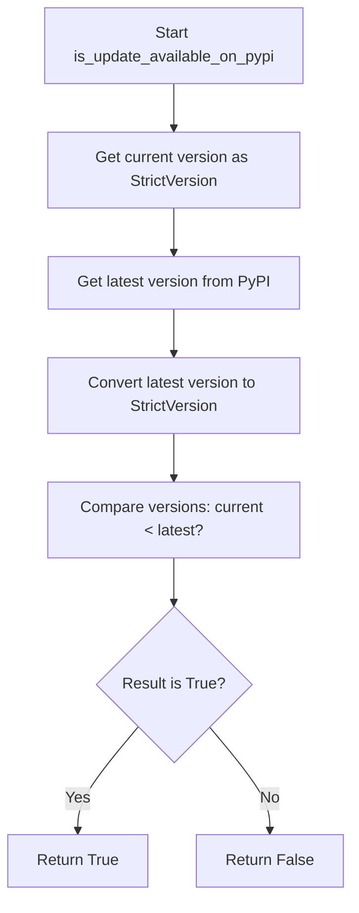
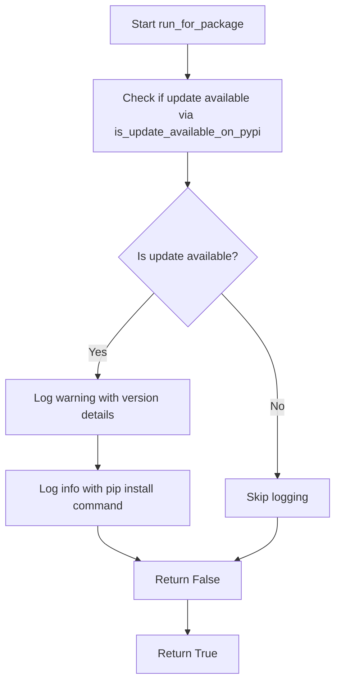

# `update_checking.py`

## `onlinejudge_command.update_checking.describe_status_code` · *function*

## Summary:
Returns a formatted string containing an HTTP status code and its standard descriptive message.

## Description:
This function formats an HTTP status code along with its corresponding standard message from the HTTP protocol specification. It is used to provide human-readable status information for HTTP responses.

## Args:
    status_code (int): An HTTP status code (e.g., 200, 404, 500). Must be a valid HTTP status code that exists in http.client.responses.

## Returns:
    str: A string in the format "{status_code} {status_message}" where status_message is the standard HTTP status message.

## Raises:
    KeyError: When the provided status_code is not found in http.client.responses dictionary.

## Constraints:
    Preconditions: The status_code argument must be an integer that exists as a key in http.client.responses.
    Postconditions: The returned string will always contain the status code followed by a space and then the standard HTTP status message.

## Side Effects:
    None: This function has no side effects and is purely a formatting utility.

## Control Flow:
```mermaid
flowchart TD
    A[Input status_code] --> B{Valid status_code?}
    B -->|Yes| C[Lookup http.client.responses[status_code]]
    C --> D[Format "{status_code} {message}"]
    D --> E[Return formatted string]
    B -->|No| F[KeyError raised]
```

## Examples:
    >>> describe_status_code(200)
    '200 OK'
    >>> describe_status_code(404)
    '404 Not Found'
    >>> describe_status_code(500)
    '500 Internal Server Error'

## `onlinejudge_command.update_checking.request` · *function*

## Summary:
Sends an HTTP request with enhanced logging and redirect handling capabilities.

## Description:
A wrapper around `requests.Session.request()` that provides standardized logging for HTTP operations and handles common request configuration. This function centralizes HTTP request logic with consistent logging behavior and redirect tracking.

## Args:
    method (str): HTTP method to use ('GET' or 'POST')
    url (str): Target URL for the HTTP request
    session (requests.Session): Session object to use for making the request
    raise_for_status (bool, optional): Whether to call `raise_for_status()` on the response. Defaults to True.
    **kwargs: Additional arguments passed to the underlying `session.request()` call

## Returns:
    requests.Response: The response object from the HTTP request

## Raises:
    requests.exceptions.RequestException: When `raise_for_status()` is True and the response indicates an error status code

## Constraints:
    Preconditions:
        - method must be either 'GET' or 'POST'
        - session must be a valid requests.Session object
    Postconditions:
        - Response object is returned with all standard requests.Response properties
        - All HTTP request logging occurs before returning

## Side Effects:
    - Writes log messages to the module's logger at INFO and DEBUG levels
    - Makes actual HTTP network requests via the provided session
    - May trigger HTTP redirects and update the response URL accordingly

## Control Flow:
```mermaid
flowchart TD
    A[Start request] --> B{Method valid?}
    B -- No --> C[AssertionError]
    B -- Yes --> D[Set default allow_redirects]
    D --> E[Log method and URL]
    E --> F{Data in kwargs?}
    F -- Yes --> G[Log request data]
    G --> H[Make HTTP request]
    F -- No --> H
    H --> I{Response redirected?}
    I -- Yes --> J[Log redirect URL]
    I -- No --> K[Skip redirect log]
    J --> K
    K --> L[Log status code]
    L --> M{raise_for_status enabled?}
    M -- Yes --> N[Call raise_for_status()]
    M -- No --> O[Return response]
    N --> O
```

## Examples:
```python
import requests
session = requests.Session()
response = request('GET', 'https://api.example.com/data', session)
# Logs the request and returns the response object

response = request('POST', 'https://api.example.com/submit', session, 
                   json={'key': 'value'}, raise_for_status=False)
# Sends POST request with JSON data, logs everything, but doesn't raise on errors
```

## `onlinejudge_command.update_checking.get_latest_version_from_pypi` · *function*

## Summary:
Retrieves the latest version of a specified package from PyPI with local caching to reduce network requests.

## Description:
Fetches the most recent version number of a given package from the Python Package Index (PyPI) API. This function implements a caching mechanism to avoid excessive network requests by storing version information locally for 8 hours. It serves as a utility for checking software updates in the online judge command-line tool.

This function was extracted from inline code to provide centralized version checking logic that can be reused across different parts of the application while maintaining consistent caching behavior and error handling.

## Args:
    package_name (str): The name of the PyPI package to check for updates. Must be a valid package identifier.

## Returns:
    str: The latest version string of the package. Returns '0.0.0' if the PyPI request fails, though this is treated as a non-critical failure.

## Raises:
    None explicitly raised - all exceptions are caught and logged internally.

## Constraints:
    Preconditions:
        - package_name must be a non-empty string representing a valid PyPI package name
        - Network connectivity must be available for PyPI requests (when cache is not valid)
    Postconditions:
        - The function always returns a version string (even if it's '0.0.0' on failure)
        - Cache file is updated with fresh timestamp and version information upon successful API call

## Side Effects:
    - Makes a network request to https://pypi.org/pypi/{package_name}/json
    - Reads from and writes to a local cache file at {user_cache_dir}/pypi.json
    - Logs debug messages when loading/storing cache
    - Logs warning messages when cache loading fails
    - Logs error messages when PyPI requests fail

## Control Flow:
```mermaid
flowchart TD
    A[Start get_latest_version_from_pypi] --> B{Cache file exists?}
    B -- No --> C[Make PyPI request]
    B -- Yes --> D[Load cache data]
    D --> E{Cache valid (within 8h)?}
    E -- Yes --> F[Return cached version]
    E -- No --> C
    C --> G{PyPI request successful?}
    G -- Yes --> H[Parse version from response]
    G -- No --> I[Set version to '0.0.0']
    H --> J[Update cache with new version]
    I --> J
    J --> K[Store updated cache to disk]
    K --> L[Return version]
```

## Examples:
```python
# Check the latest version of the onlinejudge package
latest_version = get_latest_version_from_pypi("onlinejudge")
print(f"Latest version: {latest_version}")

# Check the latest version of another package
latest_version = get_latest_version_from_pypi("requests")
print(f"Latest requests version: {latest_version}")
```

## `onlinejudge_command.update_checking.is_update_available_on_pypi` · *function*

## Summary:
Determines whether a newer version of a specified package is available on PyPI by comparing version strings.

## Description:
Checks if the currently installed version of a package is older than the latest version available on the Python Package Index (PyPI). This function is used to notify users when updates are available for the onlinejudge command-line tool or related packages.

The function extracts version information from PyPI using `get_latest_version_from_pypi()` and performs semantic version comparison using Python's `distutils.version.StrictVersion` class. This logic was extracted from inline code to provide a reusable utility for version checking throughout the application.

## Args:
    package_name (str): The name of the PyPI package to check for updates. Must be a valid package identifier.
    current_version (str): The currently installed version string of the package to compare against.

## Returns:
    bool: True if the current version is older than the latest available version on PyPI, False otherwise. Returns False if version comparison fails or if the latest version cannot be determined due to network issues or invalid version formats.

## Raises:
    None explicitly raised - version comparison errors are handled internally by the underlying version comparison logic.

## Constraints:
    Preconditions:
        - Both `package_name` and `current_version` must be non-empty strings
        - `current_version` must be a valid version string format compatible with `distutils.version.StrictVersion`
        - Network connectivity must be available for PyPI requests (when cache is not valid)
    Postconditions:
        - The function always returns a boolean value
        - No side effects occur beyond making network requests and version comparisons

## Side Effects:
    - Makes a network request to PyPI via `get_latest_version_from_pypi()` to fetch the latest version
    - May trigger cache operations in the underlying `get_latest_version_from_pypi()` function
    - Uses `distutils.version.StrictVersion` for version comparison

## Control Flow:


## Examples:
```python
# Check if the onlinejudge package has updates available
update_available = is_update_available_on_pypi("onlinejudge", "1.0.0")
if update_available:
    print("An update is available for onlinejudge!")

# Check if the onlinejudge-command package has updates available  
update_available = is_update_available_on_pypi("onlinejudge-command", "2.1.5")
if update_available:
    print("An update is available for onlinejudge-command!")
```

## `onlinejudge_command.update_checking.run_for_package` · *function*

## Summary:
Checks if a specified package is up-to-date by comparing its current version with the latest version available on PyPI, and logs appropriate messages if an update is available.

## Description:
This function determines whether the currently installed version of a package matches the latest version available on the Python Package Index (PyPI). When an update is detected, it logs a warning message with version details and an informational message with installation instructions. The function is designed to be called periodically to notify users about available updates for the onlinejudge command-line tool or related packages.

The logic for checking version availability and retrieving the latest version from PyPI is extracted into separate helper functions (`is_update_available_on_pypi` and `get_latest_version_from_pypi`) to promote code reuse and maintainability.

## Args:
    package_name (str): The name of the PyPI package to check for updates. Must be a valid package identifier.
    current_version (str): The currently installed version string of the package to compare against. Must be a valid version string format compatible with `distutils.version.StrictVersion`.

## Returns:
    bool: Returns True if the package is up-to-date (no newer version available), False if an update is available. The function returns False when version comparison fails or when the latest version cannot be determined due to network issues or invalid version formats.

## Raises:
    None explicitly raised - all exceptions from underlying functions are handled internally.

## Constraints:
    Preconditions:
        - Both `package_name` and `current_version` must be non-empty strings
        - `current_version` must be a valid version string format compatible with `distutils.version.StrictVersion`
        - Network connectivity must be available for PyPI requests (when cache is not valid)
    Postconditions:
        - The function always returns a boolean value
        - No side effects occur beyond making network requests, version comparisons, and logging

## Side Effects:
    - Makes a network request to PyPI via `get_latest_version_from_pypi()` to fetch the latest version
    - May trigger cache operations in the underlying `get_latest_version_from_pypi()` function
    - Uses `distutils.version.StrictVersion` for version comparison
    - Logs warning messages when updates are available (using `logger.warning()`)
    - Logs informational messages with installation commands (using `logger.info()`)

## Control Flow:


## Examples:
```python
# Check if the onlinejudge package is up-to-date
is_updated = run_for_package(package_name="onlinejudge", current_version="1.0.0")
if not is_updated:
    print("An update is available for onlinejudge!")

# Check if the onlinejudge-command package is up-to-date
is_updated = run_for_package(package_name="onlinejudge-command", current_version="2.1.5")
if not is_updated:
    print("An update is available for onlinejudge-command!")
```

## `onlinejudge_command.update_checking.run` · *function*

## Summary:
Checks for updates for both the main onlinejudge package and the API package, returning whether both are up-to-date.

## Description:
This function serves as the primary interface for performing update checks on the onlinejudge command-line tool and its associated API components. It orchestrates version checks for two distinct packages by calling the `run_for_package` function twice with different version modules. The function is designed to be called periodically to notify users about available updates while providing graceful error handling.

The logic for checking individual package updates is extracted into the `run_for_package` function to promote code reuse and maintainability. This function ensures that both the main onlinejudge package and the API package are checked for updates, returning a composite result indicating the overall update status.

## Args:
    None

## Returns:
    bool: Returns True if both the main onlinejudge package and the API package are up-to-date (no newer versions available). Returns False if either package has an update available. In case of any exception during the update check process, returns True to assume the packages are updated (fail-safe behavior).

## Raises:
    Exception: May raise any exception that occurs during network requests or version comparison operations within the underlying `run_for_package` function calls. These exceptions are caught and logged but do not propagate out of this function.

## Constraints:
    Preconditions:
        - The `version` and `api_version` modules must be properly configured with `__package_name__` and `__version__` attributes
        - Network connectivity must be available for PyPI requests during version checking
        - The `run_for_package` function must be properly implemented and accessible
    Postconditions:
        - The function always returns a boolean value
        - No side effects occur beyond making network requests, version comparisons, and logging

## Side Effects:
    - Makes network requests to PyPI via `get_latest_version_from_pypi()` for both packages
    - May trigger cache operations in the underlying version checking functions
    - Uses `distutils.version.StrictVersion` for version comparison
    - Logs warning messages when updates are available (using `logger.warning()`)
    - Logs informational messages with installation commands (using `logger.info()`)
    - Logs error messages when update checking fails (using `logger.error()`)

## Control Flow:
```mermaid
flowchart TD
    A[Start run()] --> B[Call run_for_package for main package]
    B --> C[Store result in is_updated]
    C --> D[Call run_for_package for API package]
    D --> E[Store result in is_api_updated]
    E --> F[Return is_updated AND is_api_updated]
    F --> G{Exception occurred?}
    G -- Yes --> H[Log error message]
    H --> I[Return True (assume updated)]
```

## Examples:
```python
# Basic usage - check if both packages are up-to-date
is_up_to_date = onlinejudge_command.update_checking.run()
if not is_up_to_date:
    print("One or both packages have updates available")

# This function is typically called automatically by the CLI tool
# and doesn't require manual invocation in normal usage
```

