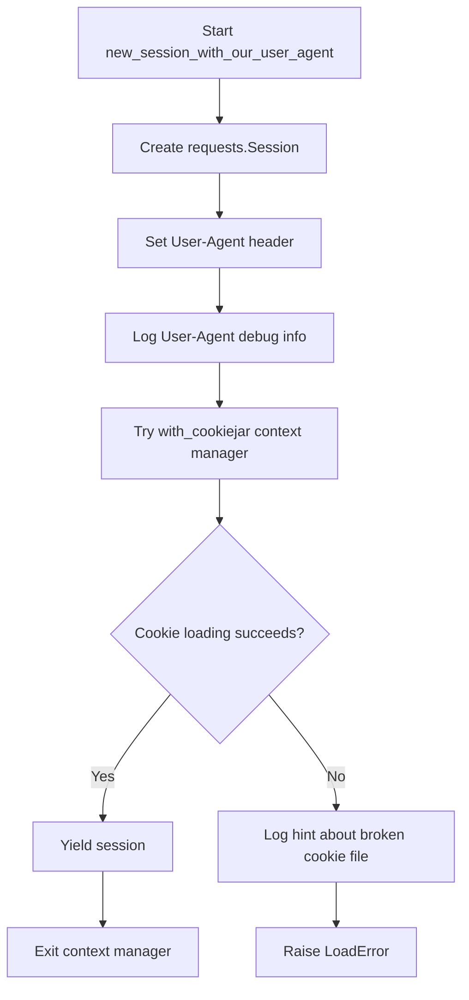
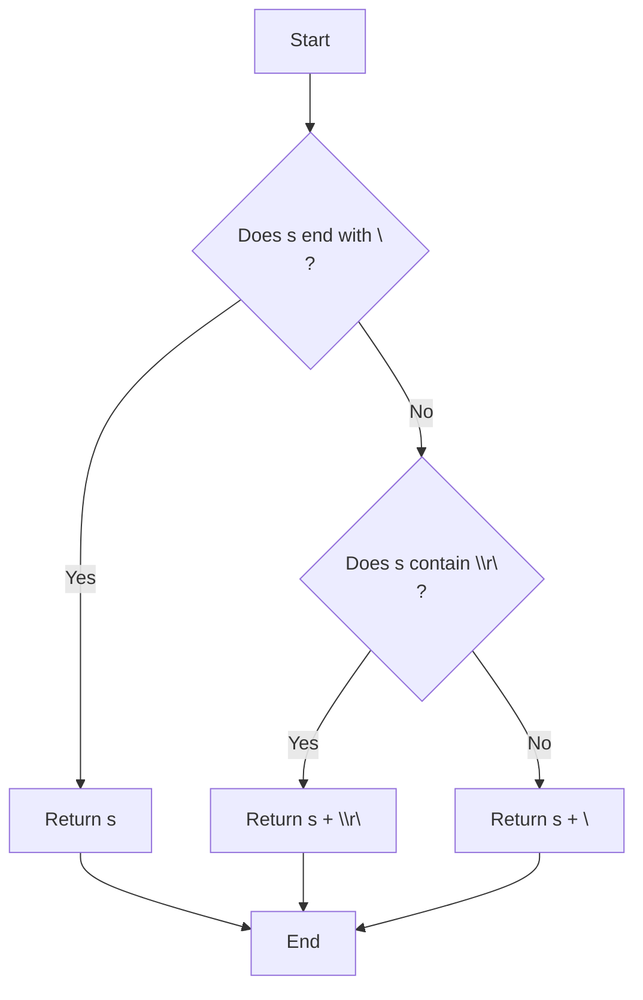
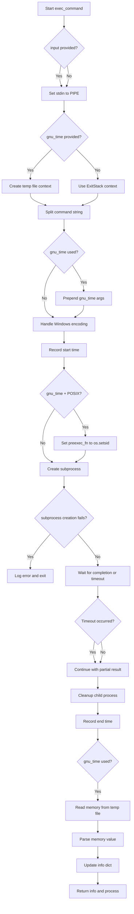
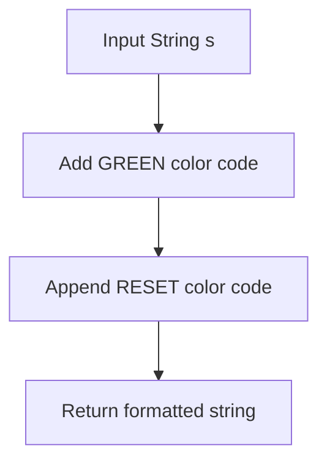
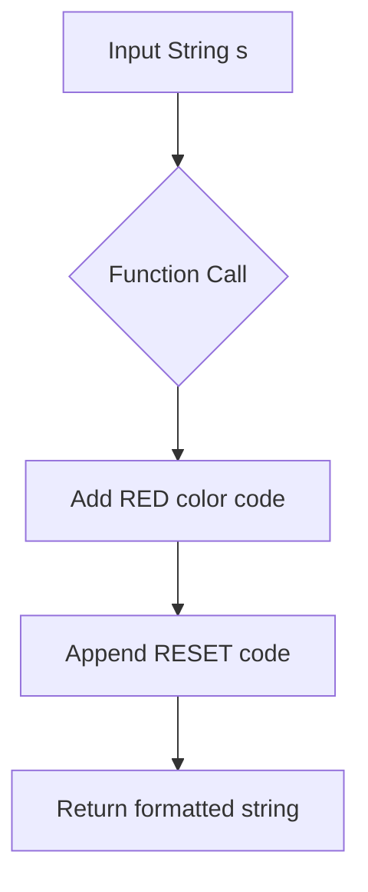
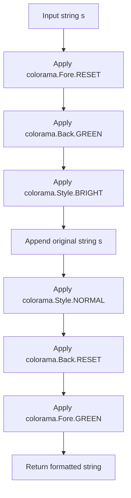
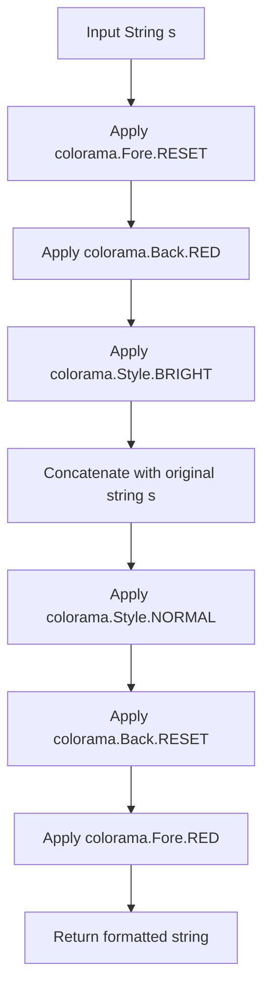
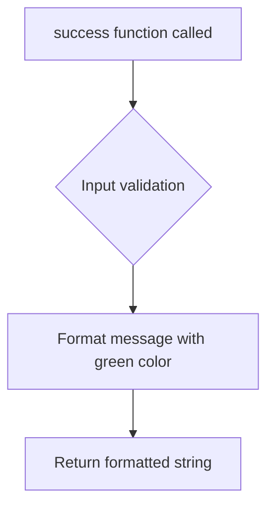
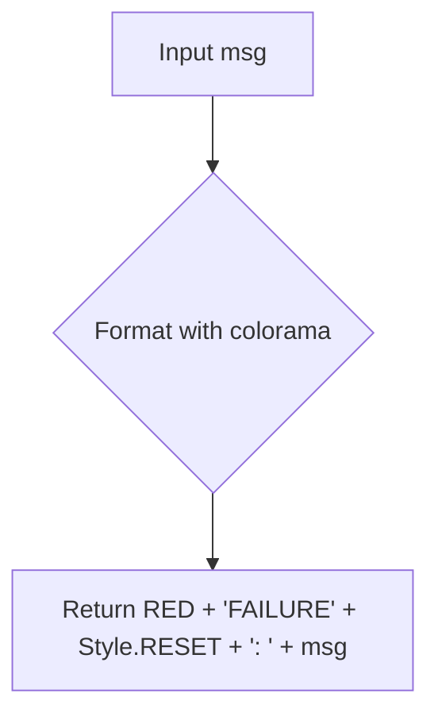

# `utils.py`

## `onlinejudge_command.utils.new_session_with_our_user_agent` · *function*

## Summary
Creates a configured HTTP session with a custom User-Agent header and cookie management.

## Description
This function initializes a requests.Session with a standardized User-Agent string that identifies the application version and URL. It wraps the session in a context manager that handles cookie persistence using a cookie jar file. The function ensures proper cleanup of session resources and provides informative error handling for corrupted cookie files.

## Args
    path (pathlib.Path): Path to the cookie jar file for persistent session storage

## Returns
    Iterator[requests.Session]: A context manager yielding a configured requests.Session instance

## Raises
    http.cookiejar.LoadError: When the cookie jar file cannot be loaded due to corruption or format issues

## Constraints
    Preconditions:
        - The path parameter must point to a valid filesystem location where cookies can be read/written
        - The cookie jar file may be created if it doesn't exist
    Postconditions:
        - The returned session has a properly formatted User-Agent header
        - Cookie persistence is handled through the provided file path
        - Session resources are properly managed via context manager

## Side Effects
    - Creates or modifies cookie jar file at the specified path
    - Makes network requests through the returned session
    - Logs debug information about the User-Agent header
    - May log informational messages about broken cookie files

## Control Flow


## Examples
```python
from pathlib import Path
import requests

# Basic usage
cookie_path = Path("cookies.jar")
with new_session_with_our_user_agent(path=cookie_path) as session:
    response = session.get("https://example.com")
    # Session automatically handles cookies and cleanup
```

## `onlinejudge_command.utils.textfile` · *function*

## Summary:
Ensures a string has a trailing newline character, normalizing line endings to Unix style unless Windows-style line endings are detected.

## Description:
This utility function standardizes text formatting by ensuring that strings end with a newline character. It detects existing line ending styles and preserves them appropriately while guaranteeing the presence of a trailing newline. This is particularly useful for text processing where consistent line termination is required.

## Args:
    s (str): Input string that may or may not have a trailing newline

## Returns:
    str: String guaranteed to end with a newline character ('\n'), preserving existing line ending style if Windows-style line endings ('\r\n') are detected

## Raises:
    None: This function does not raise any exceptions

## Constraints:
    Precondition: Input must be a string
    Postcondition: Output string will always end with '\n'

## Side Effects:
    None: This function has no side effects

## Control Flow:


## Examples:
    >>> textfile("hello")
    'hello\\n'
    
    >>> textfile("hello\\n")
    'hello\\n'
    
    >>> textfile("hello\\r\\n")
    'hello\\r\\n'
```

## `onlinejudge_command.utils.exec_command` · *function*

## Summary:
Executes shell commands with configurable input, timeout, and memory profiling capabilities while ensuring proper resource cleanup.

## Description:
This function provides a robust interface for executing shell commands with support for stdin input, execution timeouts, and memory usage measurement via GNU time. It handles cross-platform compatibility issues and ensures proper cleanup of child processes even when timeouts occur or errors are encountered.

The function is extracted from inline usage to centralize command execution logic, providing consistent error handling, resource management, and execution metadata collection across the application.

## Args:
    command_str (str): The shell command to execute as a string
    stdin (Optional[BinaryIO]): Input stream to connect to the process standard input
    input (Optional[bytes]): Input data to send to the process standard input
    timeout (Optional[float]): Maximum time in seconds to wait for command completion
    gnu_time (Optional[str]): Path to GNU time executable for memory profiling

## Returns:
    Tuple[Dict[str, Any], subprocess.Popen]: A tuple containing:
        - Execution information dictionary with keys:
          * 'answer' (Optional[bytes]): Output from the command
          * 'elapsed' (float): Execution time in seconds
          * 'memory' (Optional[float]): Memory usage in megabytes (when gnu_time is used)
        - The subprocess.Popen object representing the running process

## Raises:
    FileNotFoundError: When the command executable doesn't exist
    PermissionError: When the command executable lacks execution permissions

## Constraints:
    Preconditions:
        - command_str must be a valid shell command string
        - If input is provided, stdin must be None (they are mutually exclusive)
        - gnu_time path must be valid if specified
    Postconditions:
        - The process is properly terminated/cleaned up regardless of execution outcome
        - Execution timing is measured accurately
        - Memory usage is captured when gnu_time is available

## Side Effects:
    - Executes external shell commands
    - May create temporary files when gnu_time is used
    - Writes to standard error stream when errors occur
    - May terminate child processes via SIGTERM signal on POSIX systems
    - Modifies process group membership on POSIX systems when using gnu_time

## Control Flow:


## Examples:
```python
# Basic command execution
info, proc = exec_command("echo Hello World")

# Command with input
info, proc = exec_command("cat", input=b"Hello\nWorld\n")

# Command with timeout
info, proc = exec_command("sleep 10", timeout=5.0)

# Command with memory profiling
info, proc = exec_command("python script.py", gnu_time="/usr/bin/time")
```

## `onlinejudge_command.utils.green` · *function*

## Summary:
Returns a string with green color formatting applied for terminal output.

## Description:
Wraps the input string with ANSI color codes to display text in green in terminal environments. This function leverages the colorama library to ensure cross-platform compatibility for colored terminal output.

## Args:
    s (str): The input string to be formatted with green color.

## Returns:
    str: The input string with green color ANSI escape codes prepended and reset codes appended.

## Raises:
    None: This function does not raise any exceptions.

## Constraints:
    Preconditions:
        - Input must be a string
        - Colorama must be properly initialized in the environment
    Postconditions:
        - The returned string contains ANSI escape codes for green coloring
        - The original string content is preserved

## Side Effects:
    None: This function has no side effects beyond returning a formatted string.

## Control Flow:


## Examples:
    >>> green("Success!")
    '\x1b[32mSuccess!\x1b[0m'
    
    >>> print(green("Error occurred"))
    Error occurred  # Displayed in green in terminal

## `onlinejudge_command.utils.red` · *function*

## Summary:
Returns a string with ANSI red color formatting applied for terminal output.

## Description:
This function wraps the input string with colorama ANSI escape codes to display text in red color in terminal environments. It is used to provide visual emphasis or error highlighting in command-line interfaces.

The function is extracted as a separate utility to centralize color formatting logic and make terminal output styling consistent throughout the application. This approach allows easy modification of color schemes and ensures uniform presentation of colored text.

## Args:
    s (str): The input string to be formatted with red color

## Returns:
    str: The input string wrapped with ANSI red color escape codes followed by reset codes

## Raises:
    None: This function does not raise any exceptions

## Constraints:
    Preconditions:
        - Input must be a string
        - Colorama must be properly initialized in the environment
    
    Postconditions:
        - Output string contains proper ANSI escape codes for red text
        - Original string content is preserved with color formatting applied

## Side Effects:
    None: This function has no side effects beyond returning a formatted string

## Control Flow:


## Examples:
    >>> red("Error occurred")
    '\x1b[31mError occurred\x1b[0m'
    
    >>> print(red("Important message"))
    # Displays "Important message" in red in terminal

## `onlinejudge_command.utils.green_diff` · *function*

## Summary:
Formats a string with green background and bright text using ANSI color codes.

## Description:
This function applies ANSI terminal color codes to wrap a given string, producing output with a green background and bright text formatting. It's primarily used for highlighting successful test results or positive outcomes in terminal-based applications.

The function serves as a centralized utility for consistent colored output formatting, separating the presentation logic from business logic and making it easier to modify color schemes in the future.

## Args:
    s (str): The input string to be formatted with green background and bright text styling.

## Returns:
    str: The input string wrapped with ANSI escape sequences for terminal color formatting. The resulting string will display with green background and bright text when printed to a compatible terminal.

## Raises:
    None: This function does not raise any exceptions under normal circumstances.

## Constraints:
    Preconditions:
    - Input parameter `s` must be a string type
    - The colorama library must be properly initialized in the environment
    
    Postconditions:
    - The returned string contains ANSI escape sequences for terminal color formatting
    - The original string content is preserved within the color formatting codes
    - The formatted string is safe to print to terminals that support ANSI codes

## Side Effects:
    None: This function is pure and has no side effects beyond returning a formatted string.

## Control Flow:


## Examples:
```python
# Basic usage
result = green_diff("Test passed")
# Returns: "\x1b[0m\x1b[42m\x1b[1mTest passed\x1b[22m\x1b[49m\x1b[32m"

# In context of test result display
print(green_diff("All tests passed successfully"))
# Displays "All tests passed successfully" with green background and bright text
```

## `onlinejudge_command.utils.red_diff` · *function*

## Summary:
Applies red color formatting to a string for terminal output highlighting.

## Description:
This utility function wraps a string with ANSI color codes to display it in bright red text in terminal environments. It's designed to highlight differences or important information in command-line output, particularly useful for displaying error messages or contrasting text elements.

The function is typically used in command-line interfaces where visual distinction is needed for specific text elements, such as highlighting differences in output comparison or emphasizing important status information.

## Args:
    s (str): The input string to be formatted with red coloring.

## Returns:
    str: The input string wrapped with ANSI color codes to render in bright red text.

## Raises:
    None: This function does not raise any exceptions.

## Constraints:
    Preconditions:
    - Input must be a string type
    - Colorama library must be properly initialized in the environment
    
    Postconditions:
    - Output string contains ANSI escape sequences for red text formatting
    - Original string content is preserved, only formatting is added

## Side Effects:
    None: This function is pure and has no side effects beyond returning a formatted string.

## Control Flow:


## Examples:
```python
# Basic usage
formatted_text = red_diff("This is an error message")
print(formatted_text)  # Displays in bright red text

# In context of command-line output
error_msg = red_diff("ERROR: File not found")
print(f"Status: {error_msg}")
```

## `onlinejudge_command.utils.success` · *function*

## Summary:
Formats a success message with green color coding for terminal output.

## Description:
Returns a formatted string that displays a success indicator in green color followed by the provided message. This utility function is used to create visually distinct success messages in command-line interfaces.

## Args:
    msg (str): The success message to be displayed. This is the main content that follows the "SUCCESS:" prefix.

## Returns:
    str: A formatted string with the pattern "SUCCESS: <message>" where "SUCCESS" appears in green color using ANSI escape codes.

## Raises:
    None: This function does not raise any exceptions.

## Constraints:
    Preconditions:
    - The input message should be a string
    - Colorama must be properly initialized in the environment for color output to work
    
    Postconditions:
    - The returned string contains ANSI color codes for green text
    - The returned string starts with "SUCCESS: " followed by the original message

## Side Effects:
    None: This function has no side effects beyond returning a formatted string.

## Control Flow:


## Examples:
    >>> success("File downloaded successfully")
    'SUCCESS: File downloaded successfully'
    
    >>> success("Submission completed")
    'SUCCESS: Submission completed'

## `onlinejudge_command.utils.failure` · *function*

## Summary:
Formats an error message with red color coding for terminal display.

## Description:
Creates a colored error message prefix using colorama to indicate failure conditions in command-line output. This function extracts the formatting logic for consistent error messaging throughout the application.

## Args:
    msg (str): The error message to be formatted with red coloring.

## Returns:
    str: A formatted string with red color coding indicating FAILURE followed by the original message.

## Raises:
    None: This function does not raise any exceptions.

## Constraints:
    Preconditions: The input message must be a string.
    Postconditions: The returned string will always have red color coding applied via colorama.

## Side Effects:
    None: This function has no side effects beyond returning a formatted string.

## Control Flow:


## Examples:
    >>> failure("Connection failed")
    '\x1b[31mFAILURE\x1b[0m: Connection failed'
    
    >>> failure("Invalid input")
    '\x1b[31mFAILURE\x1b[0m: Invalid input'

## `onlinejudge_command.utils.remove_suffix` · *function*

## Summary:
Removes a specified suffix from the end of a string.

## Description:
This function takes a string and removes the specified suffix from its end. It is designed to be a safe utility that ensures the suffix exists before removal, making it suitable for cases where the suffix is known to be present.

## Args:
    s (str): The input string from which to remove the suffix. Must end with the specified suffix.
    suffix (str): The suffix to remove from the end of the string. Must be a non-empty string.

## Returns:
    str: A new string with the suffix removed from the end of the input string.

## Raises:
    AssertionError: When the input string `s` does not end with the specified `suffix`.

## Constraints:
    Preconditions:
        - The input string `s` must end with the specified `suffix`
        - Both `s` and `suffix` must be non-empty strings
    Postconditions:
        - The returned string will be exactly `len(s) - len(suffix)` characters long
        - The returned string will be identical to `s` except for the removed suffix

## Side Effects:
    None: This function has no side effects and is purely functional.

## Control Flow:
```mermaid
flowchart TD
    A[Start remove_suffix] --> B{Does s end with suffix?}
    B -- No --> C[AssertionError]
    B -- Yes --> D[Return s[:-len(suffix)]]
    C --> E[Exit with error]
    D --> F[End]
```

## Examples:
    >>> remove_suffix("example.txt", ".txt")
    'example'
    
    >>> remove_suffix("test_case_1", "_1")
    'test_case'
    
    >>> remove_suffix("hello", "lo")
    'hel'

## `onlinejudge_command.utils.is_windows_subsystem_for_linux` · *function*

## Summary:
Determines whether the current execution environment is running within Windows Subsystem for Linux.

## Description:
This function checks if the operating system is Linux and if the kernel release string contains the substring 'microsoft', which is characteristic of Windows Subsystem for Linux environments. This detection is commonly used to handle platform-specific behaviors in cross-platform applications.

## Args:
    None

## Returns:
    bool: True if running in Windows Subsystem for Linux, False otherwise.

## Raises:
    None

## Constraints:
    Preconditions:
    - The platform module must be available and functional
    - The system must support uname() function
    
    Postconditions:
    - Always returns a boolean value
    - The result is cached by the platform module internally

## Side Effects:
    None

## Control Flow:
```mermaid
flowchart TD
    A[Start] --> B{platform.uname().system == 'Linux'?}
    B -- No --> C[Return False]
    B -- Yes --> D{'microsoft' in platform.uname().release.lower()?}
    D -- No --> C
    D -- Yes --> E[Return True]
```

## Examples:
    >>> is_windows_subsystem_for_linux()
    True  # When running in WSL
    >>> is_windows_subsystem_for_linux()
    False # When running in regular Linux or Windows

## `onlinejudge_command.utils.webbrowser_register_explorer_exe` · *function*

## Summary:
Registers the Windows Explorer browser for use in Windows Subsystem for Linux environments.

## Description:
This function specifically configures the webbrowser module to use Windows Explorer as the default browser when running within Windows Subsystem for Linux (WSL). In WSL, the standard webbrowser module may not properly launch Windows applications, so this function registers 'explorer.exe' to ensure web links open correctly in the Windows GUI environment.

The function is extracted into its own utility to encapsulate platform-specific browser registration logic, separating concerns from the main application logic and making it easier to test and maintain platform-specific behavior. It only executes when running in WSL to avoid affecting other platforms.

## Args:
    None

## Returns:
    None

## Raises:
    None

## Constraints:
    Preconditions:
    - Must be running in a Windows Subsystem for Linux environment
    - The webbrowser module must be importable
    - Python version compatibility considerations apply (Python 3.6 vs 3.7+)

    Postconditions:
    - The 'explorer' browser is registered with the webbrowser module when in WSL
    - No changes occur when not running in WSL

## Side Effects:
    - Modifies the global webbrowser module's browser registry
    - May affect subsequent calls to webbrowser.open() in WSL environments by ensuring proper Windows integration

## Control Flow:
```mermaid
flowchart TD
    A[Start] --> B{is_windows_subsystem_for_linux()?}
    B -- No --> C[Return early]
    B -- Yes --> D[Create GenericBrowser('explorer.exe')]
    D --> E{Python version < 3.7?}
    E -- Yes --> F[webbrowser.register('explorer', None, instance)]
    E -- No --> G[webbrowser.register('explorer', None, instance, preferred=True)]
    F --> H[End]
    G --> H
```

## Examples:
    >>> webbrowser_register_explorer_exe()
    # In WSL environment: Registers explorer.exe as browser for launching Windows applications
    # In regular Linux/Windows: No-op, returns immediately

## `onlinejudge_command.utils.get_default_command` · *function*

## Summary:
Returns the default executable filename based on the operating system platform.

## Description:
This function provides platform-appropriate default executable names for compiled programs. It returns '.\\a.exe' on Windows systems and './a.out' on Unix-like systems (Linux, macOS, etc.). This abstraction allows the codebase to work consistently across different operating systems without hardcoding platform-specific paths.

## Args:
    None

## Returns:
    str: Platform-specific default executable path:
        - '.\\a.exe' on Windows systems
        - './a.out' on Unix-like systems (Linux, macOS, etc.)

## Raises:
    None

## Constraints:
    Preconditions:
        - The platform detection via `platform.system()` must work correctly
        - The function assumes standard compilation output filenames ('a.exe' on Windows, 'a.out' on Unix)
    
    Postconditions:
        - Always returns a string representing a valid executable path pattern
        - The returned path follows the appropriate OS convention for relative paths

## Side Effects:
    None

## Control Flow:
```mermaid
flowchart TD
    A[get_default_command] --> B{platform.system() == 'Windows'?}
    B -- Yes --> C[Return '.\\a.exe']
    B -- No --> D[Return './a.out']
```

## Examples:
    # On Windows
    >>> get_default_command()
    '.\\a.exe'
    
    # On Linux/macOS
    >>> get_default_command()
    './a.out'

