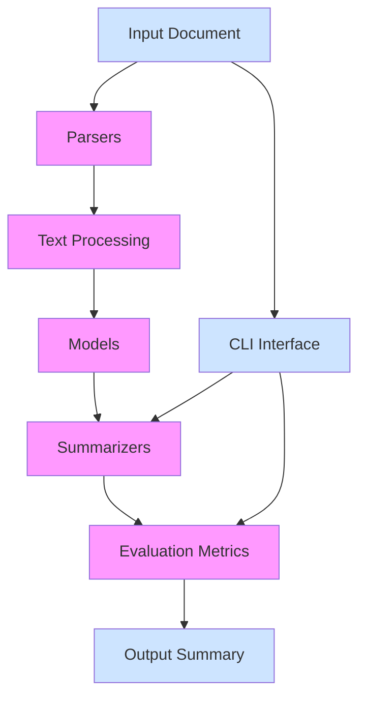

# `sumy`

## Repository Overview

### Tree Structure
```
sumy/
├── sumy/
│   ├── evaluation/
│   ├── models/
│   ├── nlp/
│   ├── parsers/
│   ├── summarizers/
│   ├── __main__.py
│   ├── _compat.py
│   └── utils.py
└── tasks.py
```

### Purpose
The sumy repository provides a comprehensive framework for automatic text summarization with support for multiple algorithms, evaluation metrics, and processing pipelines. It addresses the need for flexible, high-quality text summarization solutions that can be easily integrated into applications or used via command-line interface.

Target users include:
- Command-line users who want quick text summarization capabilities
- Developers integrating summarization features into larger applications
- Researchers evaluating different summarization approaches and metrics

The system positions itself as a versatile Python library that bridges the gap between academic research in natural language processing and practical application needs.

### Architecture


Key architectural patterns:
- **Modular Design**: Separation of concerns across distinct functional areas
- **Pipeline Architecture**: Sequential processing from input to output
- **Plugin-like Extensibility**: Support for various summarization algorithms and parsers
- **Cross-Version Compatibility**: Built-in utilities for Python 2/3 compatibility

### Entry Points
1. **CLI Interface**: `sumy` command-line tool for quick summarization tasks
   - Accepts various input formats and summarization parameters
   - Provides immediate text summarization output
   - Target audience: Quick users, command-line enthusiasts

2. **Python Library**: Importable modules for programmatic use
   - `sumy.summarizers` for algorithm implementations
   - `sumy.parsers` for document format handling
   - `sumy.evaluation` for quality assessment
   - Target audience: Developers integrating summarization into applications

3. **Task Automation**: Invoke-based tasks for development workflows
   - `invoke clean`, `invoke test`, `invoke install`, `invoke release`, `invoke docker`, `invoke bump`
   - Target audience: Developers managing the project lifecycle

### Core Features
1. **Multiple Summarization Algorithms**: Implements various approaches including TextRank, LSA, and others
   - Implemented in `sumy.summarizers/` module

2. **Format Support**: Handles multiple document input formats (HTML, plain text, etc.)
   - Implemented in `sumy.parsers/` module

3. **Evaluation Metrics**: Provides tools to assess summarization quality
   - Implemented in `sumy.evaluation/` module

4. **Natural Language Processing**: Tokenization, stemming, and stop word handling
   - Implemented in `sumy.nlp/` module

5. **Cross-Platform Compatibility**: Utilities for Python 2/3 compatibility
   - Implemented in `sumy._compat.py`

### Dependencies
- **Internal**: sumy modules (parsers, summarizers, models, nlp, evaluation)
- **External**: 
  - `requests` - For HTTP requests (fetching URLs)
  - `docopt` - For command-line argument parsing
  - `pycountry` - For language code normalization
  - `numpy` - For numerical computations (in some summarizers)
  - `nltk` - For natural language processing (in some components)

### Configuration
The system supports configuration through:
- Command-line arguments for CLI usage
- Environment variables for runtime settings
- Configuration files for persistent settings
- Runtime parameters for algorithm tuning

### Extension Points
1. **New Summarization Algorithms**: Implement new classes in `sumy.summarizers/`
2. **New Parsers**: Add new parser implementations in `sumy.parsers/`
3. **Custom Evaluation Metrics**: Extend `sumy.evaluation/` with new metric classes
4. **Language Support**: Add new language configurations for stop words and processing
5. **Plugin Architecture**: Custom components can be registered and used through the existing framework

---

## Modules

- [`sumy`](sumy.md)
- [`sumy/evaluation`](sumy/evaluation.md)
- [`sumy/models`](sumy/models.md)
- [`sumy/models/dom`](sumy/models/dom.md)
- [`sumy/nlp/stemmers`](sumy/nlp/stemmers.md)
- [`sumy/summarizers`](sumy/summarizers.md)

