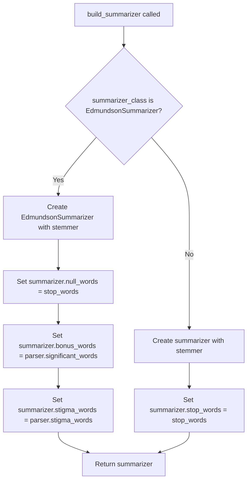

# `__main__.py`

## `sumy.__main__.main` · *function*

## Summary
Entry point for the command-line interface of the sumy text summarization tool that processes document arguments and outputs summarized sentences.

## Description
This function serves as the primary command-line interface entry point for the sumy library. It parses command-line arguments using docopt, initializes the summarization pipeline through handle_arguments, executes the summarization process, and outputs the results to standard output. The function orchestrates the entire summarization workflow from argument parsing to result display.

The logic is extracted into its own function to separate the command-line interface concerns from the core summarization logic, allowing for clean separation of concerns and easier testing of the CLI component independently.

## Args
    args (list[str], optional): Command-line arguments to parse. If None, sys.argv[1:] is used. Defaults to None.

## Returns
    int: Exit status code (0 for successful completion).

## Raises
    None explicitly raised - any exceptions would propagate from underlying components.

## Constraints
    Preconditions:
    - Command-line arguments must be properly formatted according to docopt specification
    - At least one input source (URL, file, text, or stdin) must be specified
    - Valid summarization method must be selected
    - Required parameters like --length, --language must be provided
    
    Postconditions:
    - Standard output contains the summarized sentences
    - Function returns successfully with exit code 0

## Side Effects
    - Reads from command-line arguments via docopt
    - May read from file system when --file argument is provided
    - May make HTTP requests when --url argument is provided
    - Reads from stdin when no input source is specified
    - Prints summarized sentences to standard output
    - May read from external files when --stopwords argument is provided

## Control Flow
```mermaid
flowchart TD
    A[main() called] --> B[Parse CLI args with docopt]
    B --> C[Call handle_arguments with parsed args]
    C --> D[Get summarizer, parser, items_count]
    D --> E[Execute summarizer on parser.document with items_count]
    E --> F{Sentence available?}
    F -- Yes --> G[Print sentence to stdout]
    G --> H[F]
    F -- No --> I[End execution]
```

## Examples
    # Basic usage with stdin input
    python -m sumy --length 5 --language english
    
    # Usage with file input
    python -m sumy --file document.txt --length 10 --language english --format plaintext
    
    # Usage with URL input
    python -m sumy --url https://example.com/article --length 7 --language english --format html
```

## `sumy.__main__.handle_arguments` · *function*

## Summary
Processes command-line arguments to configure and initialize the text summarization pipeline components.

## Description
This function serves as the argument processing and pipeline initialization layer for the text summarization application. It determines the input source (URL, file, text, or stdin), selects the appropriate document parser, extracts document content, configures stop words and language settings, and creates the requested summarizer instance. The function orchestrates the setup of all necessary components before passing them to the summarization process.

The logic is extracted into its own function to separate argument parsing and pipeline configuration concerns from the main execution flow, enabling cleaner code organization and easier testing of the initialization process.

## Args
    args (dict): Dictionary of command-line arguments parsed by docopt
    default_input_stream (TextIO, optional): Default input stream for reading from stdin. Defaults to sys.stdin

## Returns
    tuple: A tuple containing (summarizer, parser, items_count) where:
        - summarizer (AbstractSummarizer): Configured summarizer instance ready for text summarization
        - parser (DocumentParser): Parser instance containing the processed document content
        - items_count (ItemsCount): Configuration object for controlling summary length

## Raises
    ValueError: When an unsupported document format is specified in --format argument

## Constraints
    Preconditions:
    - args dictionary must contain all expected keys (--url, --file, --text, --format, --length, --language, --stopwords)
    - At least one of --url, --file, --text, or stdin input must be provided
    - If --format is specified, it must be one of the supported formats in PARSERS
    
    Postconditions:
    - Returns a fully configured summarizer instance
    - Returns a parser initialized with the document content
    - Returns an ItemsCount object configured with the requested summary length

## Side Effects
    - Reads from file system when --file argument is provided
    - Makes HTTP requests when --url argument is provided
    - Reads from stdin when no input source is specified
    - May read from external files when --stopwords argument is provided

## Control Flow
```mermaid
flowchart TD
    A[handle_arguments called] --> B{--url provided?}
    B -- Yes --> C[Select parser from PARSERS with format or html]
    C --> D[Fetch URL content with fetch_url]
    B -- No --> E{--file provided?}
    E -- Yes --> F[Select parser from PARSERS with format or plaintext]
    F --> G[Read file content in binary mode]
    E -- No --> H{--text provided?}
    H -- Yes --> I[Select parser from PARSERS with format or plaintext]
    I --> J[Use --text as content]
    H -- No --> K[Select parser from PARSERS with format or plaintext]
    K --> L[Read from default_input_stream]
    D --> M[Create ItemsCount from --length]
    G --> M
    J --> M
    L --> M
    M --> N{--stopwords provided?}
    N -- Yes --> O[Read stop words from file with read_stop_words]
    N -- No --> P[Get stop words for language with get_stop_words]
    O --> Q[Create parser instance with content and Tokenizer]
    P --> Q
    Q --> R[Create Stemmer for language]
    R --> S[Select summarizer class from AVAILABLE_METHODS]
    S --> T[Build summarizer with build_summarizer]
    T --> U[Return (summarizer, parser, items_count)]
```

## Examples
    # Basic usage with stdin input
    args = {"--url": None, "--file": None, "--text": None, "--format": None, "--length": "5", "--language": "english", "--stopwords": None}
    summarizer, parser, items_count = handle_arguments(args)
    
    # Usage with file input
    args = {"--url": None, "--file": "/path/to/document.txt", "--text": None, "--format": "plaintext", "--length": "10", "--language": "english", "--stopwords": None}
    summarizer, parser, items_count = handle_arguments(args)
    
    # Usage with URL input
    args = {"--url": "https://example.com/article", "--file": None, "--text": None, "--format": "html", "--length": "7", "--language": "english", "--stopwords": None}
    summarizer, parser, items_count = handle_arguments(args)

## `sumy.__main__.build_summarizer` · *function*

## Summary
Creates and configures a summarizer instance with appropriate settings based on the summarizer type.

## Description
This function acts as a factory method that instantiates and configures summarizer objects. It handles the special configuration requirements of different summarizer implementations, particularly setting different attributes for EdmundsonSummarizer versus other summarizer types. The function is called during the initialization phase of the summarization process to prepare the appropriate summarizer with its required parameters.

## Args
    summarizer_class (type): The class of the summarizer to instantiate (e.g., LuhnSummarizer, EdmundsonSummarizer)
    stop_words (frozenset): Collection of stop words to be used for filtering
    stemmer (Stemmer): Stemmer instance for word stemming operations
    parser (DocumentParser): Parser instance containing document data and word collections

## Returns
    AbstractSummarizer: Configured summarizer instance ready for use in the summarization process

## Raises
    None explicitly raised

## Constraints
    Preconditions:
    - summarizer_class must be a valid summarizer class that accepts a stemmer in its constructor
    - stop_words must be a frozenset or similar immutable collection
    - stemmer must be a valid Stemmer instance
    - parser must be a DocumentParser instance with significant_words and stigma_words properties
    
    Postconditions:
    - Returns a configured summarizer instance
    - EdmundsonSummarizer instances will have null_words, bonus_words, and stigma_words set
    - Other summarizer instances will have stop_words set

## Side Effects
    None

## Control Flow


## Examples
    # Creating a Luhn summarizer
    luhn_summarizer = build_summarizer(LuhnSummarizer, stop_words, stemmer, parser)
    
    # Creating an Edmundson summarizer  
    edmundson_summarizer = build_summarizer(EdmundsonSummarizer, stop_words, stemmer, parser)
```

