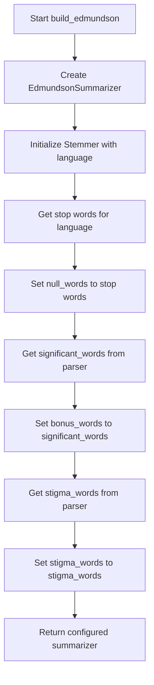
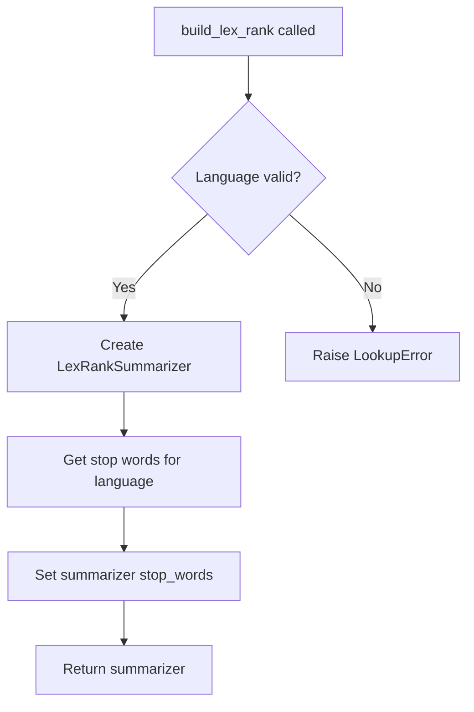
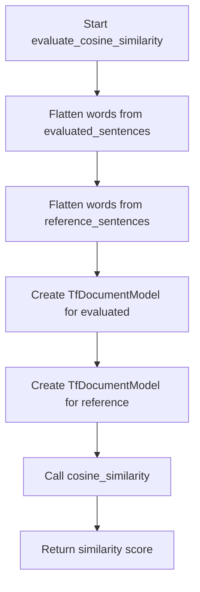
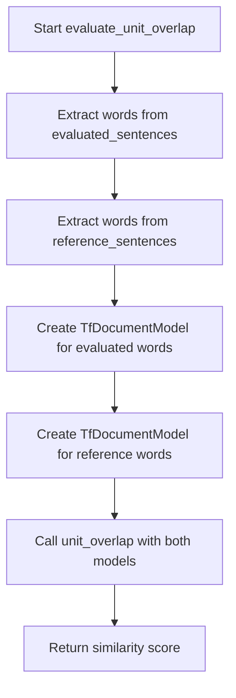

# `__main__.py`

## `sumy.evaluation.__main__.build_random` · *function*

## Summary:
Creates and returns a randomly configured summarizer instance without language-specific configuration.

## Description:
This function serves as a factory method for creating RandomSummarizer instances. It returns a basic RandomSummarizer without any language-specific configuration or initialization. The function maintains the same interface signature as other build functions (parser, language parameters) for consistency within the codebase, but these parameters are not utilized in the implementation.

The function extracts the RandomSummarizer creation logic into a dedicated component to enforce a clear responsibility boundary: separating the concerns of summarizer instantiation from the rest of the application logic. This promotes reusability and testability of the summarizer setup process.

## Args:
    parser: Document parser object (parameter accepted but not used in current implementation)
    language (str): Language code string (e.g., 'english', 'spanish') - parameter not used in implementation

## Returns:
    RandomSummarizer: A configured RandomSummarizer instance ready for text summarization

## Raises:
    None

## Constraints:
    Preconditions:
    - The function can be called with any parser and language parameters (they are ignored)
    - No validation is performed on the input parameters
    
    Postconditions:
    - Returns a RandomSummarizer instance with default configuration
    - The returned summarizer is ready to be called with document and sentences_count parameters

## Side Effects:
    None

## Control Flow:
```mermaid
flowchart TD
    A[build_random called] --> B[Create RandomSummarizer()]
    B --> C[Return configured summarizer]
```

## Examples:
```python
# Basic usage
parser = PlaintextParser.from_string("Sample text for summarization.", Tokenizer("english"))
summarizer = build_random(parser, "english")
summary = summarizer(document, 3)  # Get 3 sentences

# Usage in command-line context
# This function would typically be called by command-line argument handlers
# that select the appropriate builder function based on user input
```

## `sumy.evaluation.__main__.build_luhn` · *function*

## Summary:
Creates and configures a Luhn summarizer with language-specific stemming and stop words.

## Description:
This function serves as a factory for creating properly configured LuhnSummarizer instances. It initializes a Luhn summarizer with a stemmer appropriate for the specified language and configures it with language-specific stop words. This abstraction allows for consistent creation of Luhn summarizers across different parts of the application while maintaining clean separation of concerns.

The function follows a common builder pattern used throughout the codebase where similar functions (build_lex_rank, build_text_rank, etc.) share the same interface signature for uniformity, even though some parameters may not be used by all implementations.

## Args:
    parser: Document parser object (parameter not used in implementation, maintained for interface consistency)
    language (str): Language code string specifying the language for text processing (e.g., 'english', 'french')

## Returns:
    LuhnSummarizer: A configured instance of the Luhn summarizer with language-specific stemming and stop words

## Raises:
    LookupError: When the specified language is not supported or stop-words data is not available for the given language

## Constraints:
    Preconditions:
    - The language parameter must be a valid language identifier recognized by the system
    - Stop-word data files must exist for the specified language
    
    Postconditions:
    - Returns a fully initialized LuhnSummarizer instance
    - The returned summarizer has stop_words properly set for the specified language

## Side Effects:
    None

## Control Flow:
```mermaid
flowchart TD
    A[build_luhn called] --> B[Initialize LuhnSummarizer with Stemmer(language)]
    B --> C[Retrieve stop words for language]
    C --> D[Assign stop words to summarizer.stop_words]
    D --> E[Return configured summarizer]
```

## Examples:
```python
# Basic usage
parser = PlaintextParser.from_string("Sample text content", Tokenizer("english"))
summarizer = build_luhn(parser, "english")

# Usage in command-line context
# This function would typically be called by command-line argument handlers
# that select the appropriate builder function based on user input
```

## `sumy.evaluation.__main__.build_edmundson` · *function*

## Summary:
Configures and returns a pre-initialized Edmundson summarizer with language-specific stemming and document-based word lists.

## Description:
Creates an EdmundsonSummarizer instance with proper initialization including language-specific stemming and document analysis word lists. This function extracts the configuration logic for Edmundson summarization into a reusable component, separating the concerns of summarizer creation from the actual summarization process.

## Args:
    parser: Document parser object providing significant_words and stigma_words properties
        - Must have a significant_words property containing important words from the document
        - Must have a stigma_words property containing words to penalize in scoring
    language (str): Language code for stemmer initialization (e.g., 'english', 'french')

## Returns:
    EdmundsonSummarizer: Configured summarizer instance ready for text summarization

## Raises:
    LookupError: When stop-words data is not available for the specified language
    ValueError: When negative weights are provided to the summarizer (inherited from AbstractSummarizer)

## Constraints:
    Preconditions:
        - Parser must have significant_words and stigma_words properties
        - Language must be supported by the Stemmer class
        - Parser must be properly initialized with document content
    
    Postconditions:
        - Returned summarizer has null_words set to stop words for the language
        - Returned summarizer has bonus_words set to parser's significant_words
        - Returned summarizer has stigma_words set to parser's stigma_words
        - Returned summarizer uses appropriate stemmer for the language

## Side Effects:
    None

## Control Flow:


## Examples:
```python
# Basic usage with HTML parser
parser = HtmlParser.from_string(html_content, url, Tokenizer('english'))
summarizer = build_edmundson(parser, 'english')

# Basic usage with plaintext parser  
parser = PlaintextParser.from_string(text_content, Tokenizer('english'))
summarizer = build_edmundson(parser, 'english')
```

## `sumy.evaluation.__main__.build_lsa` · *function*

*No documentation generated.*

## `sumy.evaluation.__main__.build_text_rank` · *function*

## Summary:
Creates and configures a TextRank summarizer with language-specific stemming and stop words.

## Description:
This function serves as a factory method for creating properly initialized TextRankSummarizer instances. It takes a language specification and constructs a TextRankSummarizer with the appropriate stemmer and stop words for that language. This extraction allows for consistent initialization of TextRank summarizers across different parts of the application while maintaining clean separation of concerns. The parser parameter is accepted but not utilized in the current implementation.

## Args:
    parser (Parser): The document parser to be used for processing text input (currently unused in implementation)
    language (str): Language code specifying the language for stemming and stop words (e.g., 'english', 'french')

## Returns:
    TextRankSummarizer: A configured TextRankSummarizer instance ready for text summarization

## Raises:
    LookupError: When stop-words are not available for the specified language
    LookupError: When a stemmer is not available for the specified language

## Constraints:
    Preconditions:
        - The language parameter must be a valid language identifier recognized by the system
        - The parser parameter should be compatible with the TextRankSummarizer requirements (though not currently used)
    
    Postconditions:
        - Returns a fully configured TextRankSummarizer instance
        - The returned summarizer has stop_words properly set for the specified language
        - The returned summarizer uses the appropriate stemmer for the specified language

## Side Effects:
    None

## Control Flow:
```mermaid
flowchart TD
    A[build_text_rank called] --> B{parser and language provided}
    B --> C[Create TextRankSummarizer]
    C --> D[Initialize Stemmer(language)]
    D --> E[Get stop words for language]
    E --> F[Set summarizer.stop_words]
    F --> G[Return summarizer]
```

## Examples:
```python
# Basic usage
parser = PlaintextParser.from_string("Sample text content...", Tokenizer("english"))
summarizer = build_text_rank(parser, "english")

# Using with HTML parser
parser = HtmlParser.from_file("document.html", Tokenizer("english"))
summarizer = build_text_rank(parser, "english")
```

## `sumy.evaluation.__main__.build_lex_rank` · *function*

## Summary:
Creates and configures a LexRank summarizer with language-specific stemming and stop words.

## Description:
This function serves as a factory method for creating LexRankSummarizer instances with proper language configuration. It initializes the summarizer with a stemmer appropriate for the specified language and loads the corresponding stop words, making it ready for text summarization tasks. While the parser parameter is accepted as part of the function signature, it is not utilized in the current implementation.

## Args:
    parser: Parser object (parameter accepted but not used in current implementation)
    language (str): Language code string specifying the language for text processing (e.g., 'english', 'spanish')

## Returns:
    LexRankSummarizer: A configured LexRankSummarizer instance ready for summarization

## Raises:
    LookupError: When stop-words are not available for the specified language
    LookupError: When a stemmer is not available for the specified language

## Constraints:
    Preconditions:
    - The language parameter must be a valid language code recognized by the system
    - Stop-word files must exist for the specified language
    - NLTK stemmer classes must be available for the specified language (if not using special stemmers)

    Postconditions:
    - Returns a LexRankSummarizer instance with properly initialized stemmer and stop words
    - The returned summarizer is ready to be used for text summarization

## Side Effects:
    - Loads stop-word data from package resources
    - May raise LookupError exceptions if language resources are unavailable

## Control Flow:


## Examples:
```python
# Basic usage
parser = PlaintextParser.from_file("document.txt", Tokenizer("english"))
summarizer = build_lex_rank(parser, "english")

# Using with HTML parser
parser = HtmlParser.from_url("https://example.com/article", Tokenizer("english"))
summarizer = build_lex_rank(parser, "english")
```

## `sumy.evaluation.__main__.build_sum_basic` · *function*

## Summary:
Creates and configures a SumBasicSummarizer instance with language-specific stemming and stop words.

## Description:
This function serves as a factory method for creating SumBasicSummarizer instances. It initializes the summarizer with a stemmer appropriate for the specified language and configures it with the standard stop words for that language. The function encapsulates the setup logic for SumBasic summarization, making it easier to create properly configured summarizer objects throughout the application. The parser parameter is accepted for interface compatibility with other builder functions but is not utilized in the current implementation.

## Args:
    parser: The parser object (accepted for interface compatibility but unused)
    language (str): Language code string (e.g., 'english', 'spanish') used to select appropriate stemmer and stop words

## Returns:
    SumBasicSummarizer: A configured SumBasicSummarizer instance ready for text summarization

## Raises:
    LookupError: When the specified language is not supported for stemming or stop words are not available for that language

## Constraints:
    Preconditions:
    - The language parameter must be a valid language identifier recognized by the system
    - The language must have available stemmer and stop words data files
    
    Postconditions:
    - Returns a fully initialized SumBasicSummarizer instance
    - The returned summarizer has stop_words property properly configured
    - The summarizer uses the appropriate stemmer for the specified language

## Side Effects:
    None

## Control Flow:
```mermaid
flowchart TD
    A[build_sum_basic called] --> B{language parameter}
    B --> C[Create Stemmer(language)]
    C --> D[Create SumBasicSummarizer(Stemmer)]
    D --> E[Get stop words for language]
    E --> F[Set summarizer.stop_words]
    F --> G[Return summarizer]
```

## Examples:
```python
# Basic usage with plaintext parser
from parsers.plaintext import PlaintextParser
from nlp.tokenizers import Tokenizer
parser = PlaintextParser.from_string("Sample text for summarization.", Tokenizer("english"))
summarizer = build_sum_basic(parser, "english")

# Usage with HTML parser  
from parsers.html import HtmlParser
parser = HtmlParser.from_file("document.html", Tokenizer("english"))
summarizer = build_sum_basic(parser, "english")

# Usage with different language
summarizer = build_sum_basic(parser, "spanish")
```

## `sumy.evaluation.__main__.build_kl` · *function*

## Summary:
Creates and configures a Kullback-Leibler divergence-based summarizer with language-specific stemming and stop words.

## Description:
This function serves as a factory method for creating properly configured KLSummarizer instances. It initializes the summarizer with an appropriate stemmer for the specified language and loads the corresponding stop words, making it ready for document summarization tasks.

The function extracts the summarizer creation and configuration logic into a separate function to enforce a clear responsibility boundary: separating the concerns of summarizer instantiation from the rest of the application logic. This promotes reusability and testability of the summarizer setup process.

## Args:
    parser: Document parser object (unused in current implementation)
    language (str): Language code string (e.g., 'english', 'german') used to select appropriate stemmer and stop words

## Returns:
    KLSummarizer: A configured KLSummarizer instance ready for summarizing documents in the specified language

## Raises:
    LookupError: When the specified language does not have available stop-words or stemmer

## Constraints:
    Preconditions:
        - language parameter must be a valid language identifier recognized by the system
        - The language must have corresponding stop-word files and stemmer implementations available
    
    Postconditions:
        - Returned summarizer instance has properly initialized stemmer and stop_words
        - The summarizer is ready to be called with document and sentences_count parameters

## Side Effects:
    None

## Control Flow:
```mermaid
flowchart TD
    A[build_kl called] --> B{language parameter}
    B --> C[Create KLSummarizer with Stemmer(language)]
    C --> D[Get stop words for language]
    D --> E[Set summarizer.stop_words]
    E --> F[Return configured summarizer]
```

## Examples:
```python
# Basic usage
parser = PlaintextParser.from_string("Sample text for summarization.", Tokenizer("english"))
summarizer = build_kl(parser, "english")
summary = summarizer(document, 3)  # Get 3 sentences
```

## `sumy.evaluation.__main__.evaluate_cosine_similarity` · *function*

## Summary:
Computes the cosine similarity between two sets of sentences by converting them into TF document models and calculating their vector similarity.

## Description:
This function evaluates the semantic similarity between an evaluated set of sentences and a reference set of sentences using cosine similarity. It aggregates all words from each sentence collection into document models and computes their similarity score. This function is typically used in automatic summarization evaluation to measure how closely generated summaries match reference summaries.

## Args:
    evaluated_sentences (Iterable[Sentence]): Collection of sentence objects representing the evaluated text (e.g., generated summary). Each sentence must have a `words` attribute containing a sequence of words.
    reference_sentences (Iterable[Sentence]): Collection of sentence objects representing the reference text (e.g., ground truth summary). Each sentence must have a `words` attribute containing a sequence of words.

## Returns:
    float: Cosine similarity score between 0.0 and 1.0, where 1.0 indicates identical documents and 0.0 indicates no similarity. Returns 0.0 when there is no overlap between documents.

## Raises:
    ValueError: If either document model becomes empty (contains no words), causing division by zero in the cosine similarity calculation.

## Constraints:
    Preconditions:
        - Both `evaluated_sentences` and `reference_sentences` must be iterable collections of objects with a `words` attribute
        - Each sentence object must have a `words` attribute that returns a sequence of words
        - The `words` attribute of each sentence should contain textual tokens
    Postconditions:
        - Returns a floating-point value between 0.0 and 1.0 inclusive
        - Neither input parameter is modified
        - All sentence objects remain unchanged

## Side Effects:
    None

## Control Flow:


## Examples:
    # Basic usage with sentence objects
    similarity = evaluate_cosine_similarity(summary_sentences, reference_sentences)
    print(f"Similarity: {similarity:.3f}")
    
    # Usage in evaluation pipeline
    try:
        score = evaluate_cosine_similarity(generated_summary, gold_standard)
        if score >= 0.8:
            print("High similarity detected")
        else:
            print("Low similarity detected")
    except ValueError as e:
        print(f"Cannot compute similarity: {e}")

## `sumy.evaluation.__main__.evaluate_unit_overlap` · *function*

## Summary:
Computes the unit overlap similarity metric between two sets of sentences by converting them to TF document models and calculating term overlap.

## Description:
This function serves as an evaluation metric for comparing summarized text against reference text. It transforms sentence collections into TF (Term Frequency) document models and computes their similarity using the unit overlap formula, which measures the ratio of common terms to the total unique terms in both documents.

The function is designed to be used in automated evaluation pipelines where summarization systems need quantitative metrics to assess performance against reference summaries. It expects sentence objects with a `.words` attribute containing tokenized words.

## Args:
    evaluated_sentences (Iterable[Sentence]): Collection of sentence objects with `.words` attribute containing word sequences
    reference_sentences (Iterable[Sentence]): Collection of sentence objects with `.words` attribute containing word sequences

## Returns:
    float: Unit overlap similarity score in the range [0, 1], where:
        - 1.0 indicates identical term sets between documents  
        - 0.0 indicates no common terms between documents
        - Values in between represent proportional overlap

## Raises:
    ValueError: If the underlying TfDocumentModel construction fails due to invalid input
    ValueError: If the underlying unit_overlap function detects empty documents

## Constraints:
    Preconditions:
        - Both evaluated_sentences and reference_sentences must be iterable collections
        - Each sentence object must have a `.words` attribute containing a sequence of words
        - Words should be appropriately tokenized for meaningful comparison
        - The words sequence should not be empty for meaningful overlap calculation
    
    Postconditions:
        - Returns a float value in the range [0, 1]
        - The returned value represents the normalized overlap between the two document models according to the unit overlap formula

## Side Effects:
    None

## Control Flow:


## Examples:
```python
# Basic usage with sentence objects
from sumy.models import Sentence

evaluated = [
    Sentence("This is the first sentence."),
    Sentence("This is the second sentence.")
]
reference = [
    Sentence("This is the reference sentence.")
]
similarity = evaluate_unit_overlap(evaluated, reference)
print(f"Similarity: {similarity:.3f}")
```

## `sumy.evaluation.__main__.main` · *function*

## Summary
Evaluates text summarization results by comparing generated summaries against reference summaries using multiple evaluation metrics.

## Description
This function serves as the main entry point for running text summarization evaluations. It processes command-line arguments to configure the summarization pipeline, generates a summary using the selected method, and then evaluates the generated summary against either the original document or a reference summary using various evaluation metrics. The function prints the evaluation results for each metric to standard output.

The logic is extracted into its own function to separate the evaluation workflow from argument parsing and pipeline construction, allowing for cleaner code organization and easier testing of the evaluation process.

## Args
    args (list[str], optional): Command-line arguments to parse. If None, sys.argv[1:] is used. Defaults to None.
    This function expects command-line arguments that conform to the docopt specification defined in the module's docstring, including:
    - Input source specification: --url, --file, or stdin
    - Summarization method specification: --luhn, --text-rank, --lex-rank, etc.
    - Language specification: --language (default: "english")
    - Length specification: --length (number of sentences or percentage)
    - Reference summary file path (positional argument)
    - Optional format specification: --format

## Returns
    int: Exit status code (0 for successful completion).

## Raises
    None explicitly raised by this function, though underlying operations may raise exceptions during:
    - File I/O operations (when reading input documents or reference summaries)
    - Network requests (when fetching content from URLs)
    - Argument parsing errors (when command-line arguments are malformed)
    - Evaluation metric computation failures

## Constraints
    Preconditions:
    - Command-line arguments must be properly formatted according to the expected docopt specification
    - A valid summarization method must be specified via command-line flags
    - The reference summary file must exist and be readable
    - Input document must be available through URL, file, or stdin
    - Language and length parameters must be valid
    - At least one of --url, --file, or stdin must be provided for document input
    - The AVAILABLE_EVALUATIONS constant must be defined in the module scope
    - The __version__ variable must be defined in the module scope

    Postconditions:
    - Evaluation results for all available metrics are printed to stdout
    - Function returns successfully with exit code 0
    - All required components (summarizer, document, reference summary) are properly initialized

## Side Effects
    - Reads from stdin, files, or makes HTTP requests based on input arguments
    - Prints evaluation results to standard output
    - May read from external files for stop words or reference summaries
    - May perform network operations when fetching content from URLs

## Control Flow
```mermaid
flowchart TD
    A[main() called] --> B[Parse CLI args with docopt using __doc__ and __version__]
    B --> C[Call handle_arguments to configure pipeline]
    C --> D[Extract summarizer, document, items_count, reference_summary from handle_arguments result]
    D --> E[Generate summary sentences with summarizer(document, items_count)]
    E --> F[Parse reference_summary into sentences using PlaintextParser.from_string]
    F --> G[Iterate through AVAILABLE_EVALUATIONS]
    G --> H{evaluate_document flag set?}
    H -->|Yes| I[Apply evaluation against original document sentences]
    H -->|No| J[Apply evaluation against reference sentences]
    I --> K[Print evaluation result]
    J --> K
    K --> L{More evaluations?}
    L -->|Yes| G
    L -->|No| M[Return 0]
```

## Examples
    # Basic usage with stdin input and luhn summarizer
    echo "This is a sample document. It has multiple sentences." | python -m sumy.evaluation --luhn --length 5 reference_summary.txt
    
    # Usage with file input and text-rank summarizer
    python -m sumy.evaluation --text-rank --file document.txt --length 10 reference_summary.txt
    
    # Usage with URL input and lex-rank summarizer
    python -m sumy.evaluation --lex-rank --url https://example.com/article --length 7 reference_summary.txt

## `sumy.evaluation.__main__.handle_arguments` · *function*

## Summary:
Processes command-line arguments to configure document parsing, summarization method selection, and loads reference summary for evaluation.

## Description:
This function orchestrates the setup of all components needed for evaluating text summarization methods. It determines the appropriate document parser based on input source (URL, file, or stdin), selects the summarization method to use, configures the document processing pipeline, and loads the reference summary for comparison. The function acts as a central configuration manager that prepares all necessary components for the evaluation workflow.

The logic is extracted into its own function to separate argument processing concerns from the actual evaluation logic, making the code more modular and testable. It encapsulates the complex decision-making process for selecting parsers, summarizers, and handling different input sources.

## Args:
    args (dict): Dictionary containing parsed command-line arguments with keys:
        - "--format": Document format identifier (e.g., "html", "plaintext") - optional
        - "--url": URL of document to summarize - optional
        - "--file": Path to local file containing document - optional
        - "--language": Language of the document (default: "english")
        - "--length": Number of sentences in summary (can be integer or percentage like "50%")
        - "<reference_summary>": Path to reference summary file
        - Various boolean flags for different summarization methods (e.g., "--luhn", "--text-rank", "--lex-rank", etc.)

## Returns:
    tuple: Four-element tuple containing:
        - summarizer_builder: Callable that creates a summarizer instance with the selected method
        - document: Processed document object ready for summarization  
        - items_count: ItemsCount instance configured with desired summary length
        - reference_summmary: String content of the reference summary file

## Raises:
    ValueError: When an unsupported document format is specified in --format argument

## Constraints:
    Preconditions:
    - At least one of --url, --file, or stdin must be provided for document input
    - The reference_summary file must exist and be readable
    - Valid language identifier must be provided
    - Valid summarization method flag must be specified (defaults to "luhn" if none provided)

    Postconditions:
    - All returned components are properly initialized and ready for use
    - Parser is correctly instantiated with document content and tokenizer
    - Reference summary is loaded as UTF-8 decoded string

## Side Effects:
    - Reads from filesystem when --file is specified
    - Makes HTTP request when --url is specified via fetch_url()
    - Reads from stdin when neither --url nor --file is specified
    - Opens and reads reference summary file
    - May raise exceptions if files don't exist or network requests fail

## Control Flow:
```mermaid
flowchart TD
    A[Start handle_arguments] --> B{--format provided?}
    B -->|Yes| C{Format in PARSERS?}
    C -->|No| D[raise ValueError]
    C -->|Yes| E{--url provided?}
    B -->|No| F{--file provided?}
    F -->|Yes| G[Use PARSERS.get(format, PlaintextParser)]
    F -->|No| H[Use PARSERS["plaintext"]]
    E -->|Yes| I[Use PARSERS["html"]]
    E -->|No| J[Use PARSERS["plaintext"]]
    I --> K[fetch_url(--url)]
    G --> L[open(--file)]
    H --> M[sys.stdin.read()]
    K --> N[parser = parser(document_content, Tokenizer(--language))]
    L --> N
    M --> N
    N --> O{Method flags checked?}
    O -->|No| P[Check each method flag]
    P --> Q{Any method flag true?}
    Q -->|Yes| R[Set summarizer_builder = builder]
    Q -->|No| S[Default to AVAILABLE_METHODS["luhn"]]
    R --> T[items_count = ItemsCount(--length)]
    S --> T
    T --> U[Open reference_summary file]
    U --> V[return (summarizer_builder, parser.document, items_count, reference_summmary)]
```

## Examples:
    # Typical usage with file input
    args = {
        '--format': 'plaintext',
        '--file': '/path/to/document.txt',
        '--language': 'english',
        '--length': 5,
        '<reference_summary>': '/path/to/reference.txt',
        '--luhn': True
    }
    summarizer_builder, document, count, ref_summary = handle_arguments(args)
    # Later, create actual summarizer: summarizer = summarizer_builder(document, 'english')
    
    # Usage with URL input
    args = {
        '--url': 'https://example.com/article',
        '--language': 'english',
        '--length': '30%',
        '<reference_summary>': '/path/to/reference.txt',
        '--text-rank': True
    }
    summarizer_builder, document, count, ref_summary = handle_arguments(args)
    # Later, create actual summarizer: summarizer = summarizer_builder(document, 'english')

