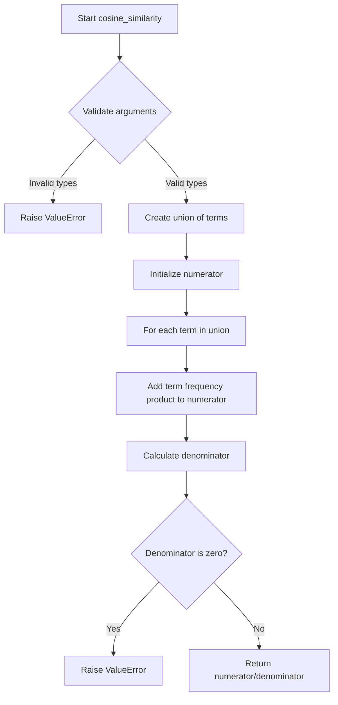
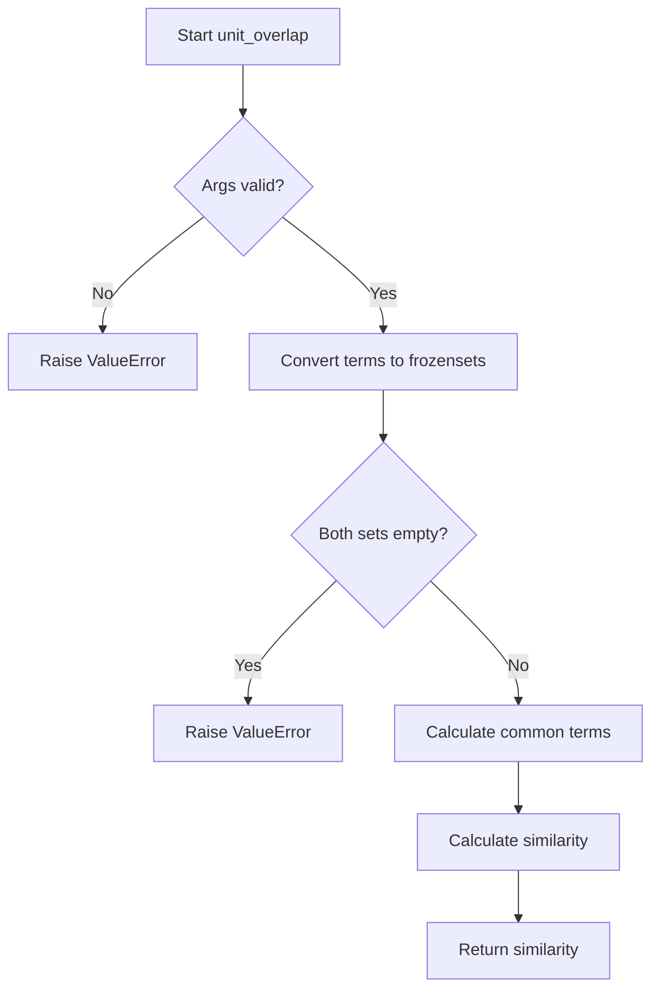

# `content_based.py`

## `sumy.evaluation.content_based.cosine_similarity` · *function*

## Summary:
Computes the cosine similarity between two document models based on their term frequencies.

## Description:
This function calculates the cosine similarity between two document representations, which is commonly used in text analysis and summarization to measure the similarity between documents. The similarity is computed using the dot product of term frequency vectors divided by the product of their magnitudes.

The function is designed to be used in evaluation metrics for automatic text summarization systems where document similarity needs to be quantified. It performs strict type checking to ensure both arguments are valid document models.

## Args:
    evaluated_model (TfDocumentModel): The document model to be evaluated, containing term frequencies and magnitude information
    reference_model (TfDocumentModel): The reference document model for comparison, containing term frequencies and magnitude information

## Returns:
    float: A similarity score between 0 and 1, where 1 indicates identical documents and 0 indicates no similarity

## Raises:
    ValueError: If either argument is not an instance of TfDocumentModel (as checked by isinstance), or if one of the document models has zero magnitude (empty document)

## Constraints:
    Preconditions:
        - Both arguments must be instances of TfDocumentModel (note: code contains a discrepancy - references TfModel but imports TfDocumentModel)
        - Neither document model should be empty (magnitude must be greater than 0)
    Postconditions:
        - Returns a float value between 0 and 1 inclusive
        - The computation uses the mathematical formula: (A·B)/(|A||B|) where A and B are the document vectors

## Side Effects:
    None

## Control Flow:


## Examples:
    # Basic usage
    similarity = cosine_similarity(doc_model1, doc_model2)
    
    # Error handling
    try:
        similarity = cosine_similarity(empty_doc_model, reference_model)
    except ValueError as e:
        print(f"Error: {e}")
```

## `sumy.evaluation.content_based.unit_overlap` · *function*

## Summary:
Calculates the unit overlap similarity between two document models using Jaccard coefficient.

## Description:
This function computes the similarity between two document representations by calculating the ratio of common terms to the total unique terms in both documents. It's commonly used in text summarization evaluation to measure how much of the vocabulary in two documents overlaps.

The function extracts terms from both document models, converts them to frozen sets for efficient set operations, and applies the Jaccard similarity formula: |A ∩ B| / (|A| + |B| - |A ∩ B|), which is equivalent to |A ∩ B| / |A ∪ B|.

Known callers within the codebase would likely include evaluation modules that compare generated summaries against reference summaries, particularly in text summarization systems where document similarity metrics are needed.

This logic is extracted into its own function to provide a reusable, well-defined similarity metric that can be easily tested and substituted with alternative similarity measures without affecting the broader evaluation framework.

## Args:
    evaluated_model (object): The document model to evaluate against the reference
    reference_model (object): The reference document model for comparison

## Returns:
    float: The unit overlap similarity score between 0 and 1, where 1 indicates identical vocabularies and 0 indicates no overlapping terms

## Raises:
    ValueError: If either argument fails the isinstance check against the expected model type, or if both documents are empty

## Constraints:
    Preconditions:
        - Both arguments must pass isinstance check against the expected model type (as defined in the source code)
        - Neither document model should be empty (contain no terms)
    
    Postconditions:
        - Returns a float value between 0 and 1 inclusive
        - The result represents the Jaccard similarity coefficient

## Side Effects:
    None

## Control Flow:


## Examples:
```python
# Basic usage with two document models
similarity = unit_overlap(evaluated_doc, reference_doc)
print(f"Similarity: {similarity:.3f}")

# Error case - invalid argument type
try:
    unit_overlap("invalid", reference_doc)
except ValueError as e:
    print(f"Error: {e}")

# Error case - empty documents
try:
    unit_overlap(empty_doc1, empty_doc2)
except ValueError as e:
    print(f"Error: {e}")
```

