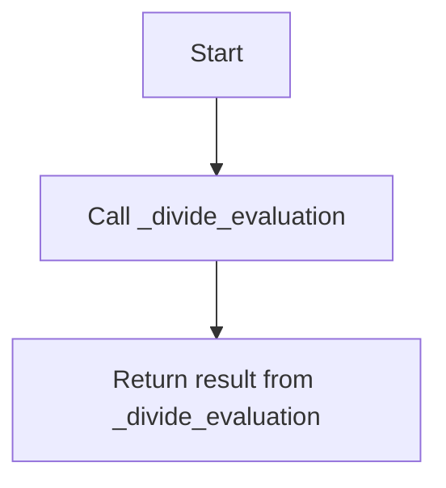

# `coselection.py`

## `sumy.evaluation.coselection.f_score` · *function*

## Summary:
Computes the F-score (F1-score) for evaluating sentence selection by combining precision and recall metrics with a configurable beta weight.

## Description:
This function implements the F-score calculation, which is a harmonic mean of precision and recall metrics commonly used in text summarization evaluation. It provides a balanced measure of sentence selection quality by considering both the relevance of chosen sentences (precision) and the completeness of relevant sentences captured (recall). The function internally calls the precision() and recall() functions to compute their respective metrics before combining them using the F-score formula.

## Args:
    evaluated_sentences (iterable): Collection of sentences that were selected or chosen by the system being evaluated
    reference_sentences (iterable): Collection of sentences considered as the reference or expected set
    weight (float): Beta parameter that controls the relative importance of recall versus precision. Default is 1.0 (equal weighting). Higher values favor recall, lower values favor precision.

## Returns:
    float: F-score value between 0 and 1, where 1.0 represents perfect evaluation and 0.0 represents worst performance. The score is computed using the formula: ((weight² + 1) × precision × recall) / (weight² × precision + recall)

## Raises:
    None explicitly raised by this function, though underlying precision() and recall() functions may raise ValueError if inputs are invalid.

## Constraints:
    Preconditions:
        - Both evaluated_sentences and reference_sentences must contain at least one element
        - Both parameters must be iterable objects that can be converted to frozensets
        - weight must be a non-negative number
    
    Postconditions:
        - Returns a float value in the range [0, 1]
        - If both precision and recall are zero, returns 0.0 to avoid division by zero

## Side Effects:
    None

## Control Flow:
```mermaid
flowchart TD
    A[Start f_score] --> B[Calculate precision]
    B --> C[Calculate recall]
    C --> D[Apply weight transformation: weight = weight²]
    D --> E[Calculate denominator: weight × precision + recall]
    E --> F{denominator == 0?}
    F -->|Yes| G[Return 0.0]
    F -->|No| H[Calculate F-score: ((weight+1) × precision × recall) / denominator]
    H --> I[Return F-score]
```

## Examples:
    >>> f_score(['a', 'b'], ['a', 'b', 'c'])
    1.0
    >>> f_score(['d', 'e'], ['a', 'b', 'c'])
    0.0
    >>> f_score(['a', 'd'], ['a', 'b', 'c'], weight=2.0)
    0.6666666666666666
```

## `sumy.evaluation.coselection.precision` · *function*

## Summary:
Computes the precision metric for sentence selection evaluation by measuring the proportion of relevant sentences among the chosen sentences.

## Description:
This function calculates precision by determining what fraction of the evaluated sentences (chosen set) are present in the reference sentences (expected set). It serves as a key evaluation metric in text summarization systems to assess how many of the selected sentences are actually relevant or present in the reference material. The function internally calls `_divide_evaluation` with the reference sentences as the numerator and evaluated sentences as the denominator.

## Args:
    evaluated_sentences (iterable): Collection of sentences that were selected or chosen by the system being evaluated
    reference_sentences (iterable): Collection of sentences considered as the reference or expected set

## Returns:
    float: Precision score between 0 and 1, representing the ratio of relevant sentences among chosen sentences. A score of 1.0 indicates all chosen sentences are relevant, while 0.0 indicates none are relevant.

## Raises:
    ValueError: When either evaluated_sentences or reference_sentences collection contains zero elements

## Constraints:
    Preconditions:
        - Both evaluated_sentences and reference_sentences must contain at least one element
        - Both parameters must be iterable objects that can be converted to frozensets
    
    Postconditions:
        - Returns a float value in the range [0, 1]
        - The result represents the precision of sentence selection

## Side Effects:
    None

## Control Flow:
```mermaid
flowchart TD
    A[Start] --> B[_divide_evaluation(reference_sentences, evaluated_sentences)]
    B --> C[Return precision score]
```

## Examples:
    >>> precision(['a', 'b'], ['a', 'b', 'c'])
    1.0
    >>> precision(['d', 'e'], ['a', 'b', 'c'])
    0.0
    >>> precision(['a', 'd'], ['a', 'b', 'c'])
    0.5

## `sumy.evaluation.coselection.recall` · *function*

## Summary:
Calculates a precision-like metric for sentence selection evaluation by determining the ratio of common sentences between evaluated and reference sets.

## Description:
This function computes the proportion of sentences in the reference set that appear in the evaluated set. It serves as a metric for evaluating how many of the selected sentences are actually present in the expected reference set. The function is typically used in text summarization evaluation to measure the accuracy of sentence selection.

## Args:
    evaluated_sentences (iterable): Collection of sentences considered as the chosen or selected set
    reference_sentences (iterable): Collection of sentences considered as the reference or expected set

## Returns:
    float: The ratio of common sentences to total reference sentences, representing a precision-like metric between 0 and 1

## Raises:
    ValueError: When either the evaluated_sentences or reference_sentences collection contains zero elements

## Constraints:
    Preconditions:
        - Both evaluated_sentences and reference_sentences must contain at least one element
        - Both parameters must be iterable objects that can be converted to frozensets
    
    Postconditions:
        - Returns a float value in the range [0, 1]
        - The result represents the proportion of relevant sentences among chosen sentences

## Side Effects:
    None

## Control Flow:


## Examples:
    >>> recall(['a', 'b', 'c'], ['a', 'b'])
    1.0
    >>> recall(['a', 'b', 'c'], ['d', 'e'])
    0.0
    >>> recall(['a', 'b', 'c'], ['a', 'd'])
    0.5
```

## `sumy.evaluation.coselection._divide_evaluation` · *function*

## Summary:
Calculates the ratio of common sentences between two collections, representing a precision-like metric for sentence selection evaluation.

## Description:
This function computes the proportion of sentences in the numerator collection that also appear in the denominator collection. It's designed to evaluate how many of the chosen sentences (denominator) are actually relevant or present in the expected set (numerator). The function serves as a utility for evaluating sentence selection accuracy in text summarization or similar applications.

## Args:
    numerator_sentences (iterable): Collection of sentences considered as the reference or expected set
    denominator_sentences (iterable): Collection of sentences considered as the chosen or selected set

## Returns:
    float: The ratio of common sentences to total chosen sentences, representing a precision-like metric between 0 and 1

## Raises:
    ValueError: When either the numerator_sentences or denominator_sentences collection contains zero elements

## Constraints:
    Preconditions:
        - Both numerator_sentences and denominator_sentences must contain at least one element
        - Both parameters must be iterable objects that can be converted to frozensets
    
    Postconditions:
        - Returns a float value in the range [0, 1]
        - The result represents the proportion of relevant sentences among chosen sentences

## Side Effects:
    None

## Control Flow:
```mermaid
flowchart TD
    A[Start] --> B{len(numerator_sentences) == 0 OR len(denominator_sentences) == 0?}
    B -- Yes --> C[raise ValueError]
    B -- No --> D[numerator_sentences = frozenset(numerator_sentences)]
    D --> E[denominator_sentences = frozenset(denominator_sentences)]
    E --> F[common_count = len(denominator_sentences & numerator_sentences)]
    F --> G[choosen_count = len(denominator_sentences)]
    G --> H[assert choosen_count != 0]
    H --> I[return common_count / choosen_count]
```

## Examples:
    >>> _divide_evaluation(['a', 'b', 'c'], ['a', 'b'])
    1.0
    >>> _divide_evaluation(['a', 'b', 'c'], ['d', 'e'])
    0.0
    >>> _divide_evaluation(['a', 'b', 'c'], ['a', 'd'])
    0.5

