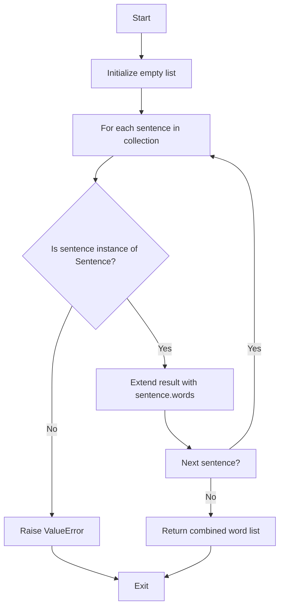
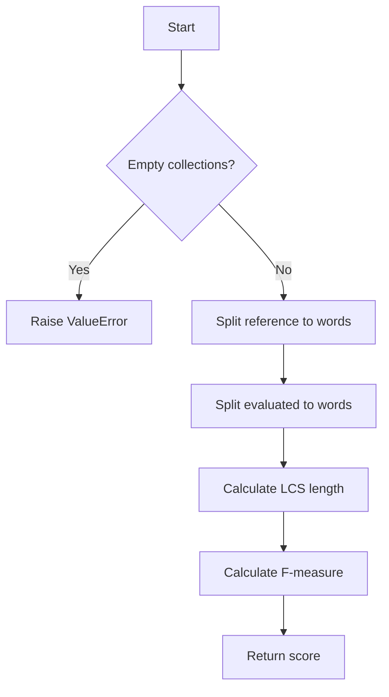

# `rouge.py`

## `sumy.evaluation.rouge._get_ngrams` · *function*

## Summary:
Generates a set of n-grams from a given text sequence by sliding a window of specified size across the text.

## Description:
Creates n-grams (contiguous sequences of n items) from the input text and returns them as a set of tuples. This utility function is commonly used in natural language processing tasks such as ROUGE evaluation metrics to compare overlapping word sequences between reference and candidate texts.

## Args:
    n (int): Size of the n-grams to generate. Must be a positive integer.
    text (iterable): Sequence of items (typically words or characters) from which to extract n-grams.

## Returns:
    set[tuple]: Set containing unique n-gram tuples extracted from the text. Empty set is returned when n is greater than text length.

## Raises:
    None explicitly raised by this function.

## Constraints:
    Preconditions:
    - n must be a positive integer (n > 0)
    - text must be iterable
    - When n > len(text), the result will be an empty set
    
    Postconditions:
    - Returned set contains only unique n-grams
    - Each n-gram is represented as a tuple of length n
    - All elements in the returned tuples are from the original text sequence

## Side Effects:
    None.

## Control Flow:
```mermaid
flowchart TD
    A[Start _get_ngrams(n, text)] --> B{len(text) >= n?}
    B -- No --> C[Return empty set]
    B -- Yes --> D[Initialize ngram_set = set()]
    D --> E[Set max_index_ngram_start = len(text) - n]
    E --> F[For i in range(0, max_index_ngram_start + 1)]
    F --> G[Add tuple(text[i:i+n]) to ngram_set]
    G --> H[Return ngram_set]
```

## Examples:
    >>> _get_ngrams(2, ['a', 'b', 'c', 'd'])
    {('a', 'b'), ('b', 'c'), ('c', 'd')}
    
    >>> _get_ngrams(3, ['x', 'y', 'z'])
    {('x', 'y', 'z')}
    
    >>> _get_ngrams(4, ['a', 'b', 'c'])
    set()
```

## `sumy.evaluation.rouge._split_into_words` · *function*

## Summary:
Converts a collection of Sentence objects into a single flat list of words.

## Description:
Processes a collection of Sentence objects by extracting all words from each sentence and combining them into a single list. This utility function is used in ROUGE evaluation to prepare text data for comparison operations.

## Args:
    sentences (iterable): An iterable collection of Sentence objects to process.

## Returns:
    list[str]: A flat list containing all words from all input sentences, in order.

## Raises:
    ValueError: If any object in the input collection is not of type Sentence.

## Constraints:
    Preconditions:
        - Input must be an iterable collection
        - All elements in the collection must be instances of Sentence class
    Postconditions:
        - Returns a list of strings representing words
        - Order of words is preserved from input sentences

## Side Effects:
    None

## Control Flow:


## Examples:
    >>> from sumy.models.dom import Sentence
    >>> from sumy.evaluation.rouge import _split_into_words
    >>> sentence1 = Sentence("Hello world", tokenizer)
    >>> sentence2 = Sentence("Goodbye world", tokenizer)
    >>> result = _split_into_words([sentence1, sentence2])
    >>> print(result)
    ['Hello', 'world', 'Goodbye', 'world']

## `sumy.evaluation.rouge._get_word_ngrams` · *function*

## Summary:
Generates a set of unique n-grams from a collection of sentences by splitting them into words and extracting contiguous sequences of specified length.

## Description:
This function serves as a utility for ROUGE evaluation metrics in natural language processing by creating a collection of unique n-grams from input sentences. It processes each sentence to extract individual words and then generates n-grams of the specified size from those words. The function is typically used to prepare text data for comparison operations in automatic summarization evaluation.

The function extracts n-grams by first converting sentences into word lists using `_split_into_words`, then applying `_get_ngrams` to generate the actual n-gram tuples. This approach allows for efficient comparison of overlapping word sequences between reference and candidate texts.

## Args:
    n (int): Size of the n-grams to generate. Must be a positive integer (> 0).
    sentences (iterable): Collection of Sentence objects to process. Must contain at least one sentence.

## Returns:
    set[tuple]: Set containing unique n-gram tuples extracted from all input sentences. Each n-gram is represented as a tuple of words of length n. Returns an empty set if no valid n-grams can be generated.

## Raises:
    AssertionError: When len(sentences) <= 0 (sentences is empty) or when n <= 0.

## Constraints:
    Preconditions:
    - n must be a positive integer (n > 0)
    - sentences must be a non-empty iterable
    - All elements in sentences must be valid Sentence objects
    
    Postconditions:
    - Returned set contains only unique n-grams
    - Each n-gram tuple contains exactly n words
    - All words in n-grams are from the original sentences

## Side Effects:
    None.

## Control Flow:
```mermaid
flowchart TD
    A[Start _get_word_ngrams(n, sentences)] --> B{len(sentences) > 0?}
    B -- No --> C[Assertion Error]
    B -- Yes --> D{n > 0?}
    D -- No --> E[Assertion Error]
    D -- Yes --> F[Initialize empty set words]
    F --> G[For each sentence in sentences]
    G --> H[Call _split_into_words([sentence])]
    H --> I[Call _get_ngrams(n, split_result)]
    I --> J[Update words set with n-grams]
    J --> K[Return words set]
```

## Examples:
    >>> from sumy.models.dom import Sentence
    >>> from sumy.evaluation.rouge import _get_word_ngrams
    >>> sentence1 = Sentence("The quick brown fox", tokenizer)
    >>> sentence2 = Sentence("jumps over the lazy dog", tokenizer)
    >>> result = _get_word_ngrams(2, [sentence1, sentence2])
    >>> print(result)
    {('The', 'quick'), ('quick', 'brown'), ('brown', 'fox'), ('jumps', 'over'), ('over', 'the'), ('the', 'lazy'), ('lazy', 'dog')}
    
    >>> # With 3-grams
    >>> result = _get_word_ngrams(3, [sentence1])
    >>> print(result)
    {('The', 'quick', 'brown'), ('quick', 'brown', 'fox')}
```

## `sumy.evaluation.rouge._get_index_of_lcs` · *function*

## Summary:
Returns the lengths of two input sequences as a tuple, though the function name suggests it should compute indices related to the longest common subsequence.

## Description:
This function is named "_get_index_of_lcs" which indicates it should compute indices related to the longest common subsequence (LCS) between two sequences. However, the current implementation simply returns the lengths of the input sequences rather than performing any actual LCS computation. This suggests the function may be incomplete or represents a placeholder that should be implemented with proper LCS index calculation logic.

The function is typically called within ROUGE evaluation routines where sequence alignment is needed for scoring text similarity between reference and candidate texts.

## Args:
    x (sequence): First input sequence, likely representing a reference text or sentence.
    y (sequence): Second input sequence, likely representing a candidate text or sentence.

## Returns:
    tuple[int, int]: A tuple containing the length of sequence x followed by the length of sequence y.

## Raises:
    None explicitly raised.

## Constraints:
    Preconditions:
    - Both x and y should be sequences (strings, lists, etc.) that support the len() function.
    - The function assumes both inputs are valid sequences.

    Postconditions:
    - The function always returns a tuple of two integers representing the lengths of the input sequences.

## Side Effects:
    None.

## Control Flow:
```mermaid
flowchart TD
    A[Start _get_index_of_lcs(x,y)] --> B{Input validation}
    B --> C[Return (len(x), len(y))]
    C --> D[End]
```

## Examples:
```python
# Basic usage
result = _get_index_of_lcs("hello", "world")
print(result)  # Output: (5, 5)

# With lists
result = _get_index_of_lcs([1,2,3], [3,4,5])
print(result)  # Output: (3, 3)
```

## `sumy.evaluation.rouge._len_lcs` · *function*

## Summary:
Computes and returns the length of the longest common subsequence (LCS) between two input sequences.

## Description:
This function implements the core logic for calculating the length of the longest common subsequence between two sequences. It leverages two helper functions: `_lcs` to compute the dynamic programming table and `_get_index_of_lcs` to determine the dimensions of the sequences. The function is typically called within ROUGE evaluation routines where text similarity between reference and candidate texts needs to be computed for scoring purposes.

This logic is extracted into its own function to separate the computation of LCS length from higher-level evaluation functions, making the code more modular and reusable.

## Args:
    x (sequence): First input sequence, typically representing a reference text or sentence.
    y (sequence): Second input sequence, typically representing a candidate text or sentence.

## Returns:
    int: The length of the longest common subsequence between sequences x and y.

## Raises:
    None explicitly raised.

## Constraints:
    Preconditions:
    - Both x and y should be sequences (strings, lists, etc.) that support indexing and length operations.
    - The sequences should be valid and not None.

    Postconditions:
    - The function returns a non-negative integer representing the length of the LCS.
    - The returned value corresponds to the entry in the LCS table at position (n,m) where n=len(x) and m=len(y).

## Side Effects:
    None.

## Control Flow:
```mermaid
flowchart TD
    A[Start _len_lcs(x, y)] --> B[table = _lcs(x, y)]
    B --> C[n, m = _get_index_of_lcs(x, y)]
    C --> D[Return table[n, m]]
```

## Examples:
```python
# Basic usage with strings
x = "ABCDGH"
y = "AEDFHR"
length = _len_lcs(x, y)
print(length)  # Output: 3 (common subsequence: ADH)

# Usage with lists
x = [1, 2, 3, 4]
y = [2, 3, 5, 6]
length = _len_lcs(x, y)
print(length)  # Output: 2 (common subsequence: [2, 3])
```

## `sumy.evaluation.rouge._lcs` · *function*

## Summary:
Computes the dynamic programming table for the longest common subsequence (LCS) between two sequences.

## Description:
Implements the classic dynamic programming algorithm to compute the longest common subsequence (LCS) table between two sequences. This table is used in various text evaluation metrics, particularly in ROUGE (Recall-Oriented Understudy for Gisting Evaluation) scoring systems. The function constructs a 2D table where each cell (i,j) contains the length of the LCS between the first i elements of sequence x and the first j elements of sequence y.

The function is typically called as part of larger ROUGE evaluation routines where text similarity between reference and candidate texts needs to be computed for scoring purposes. It's extracted into its own function to separate the core LCS computation logic from higher-level evaluation functions.

## Args:
    x (sequence): First input sequence, typically representing a reference text or sentence.
    y (sequence): Second input sequence, typically representing a candidate text or sentence.

## Returns:
    dict[tuple[int, int], int]: A dictionary representing the LCS table where keys are coordinate tuples (i,j) and values are the length of the longest common subsequence between x[:i] and y[:j].

## Raises:
    None explicitly raised.

## Constraints:
    Preconditions:
    - Both x and y should be sequences (strings, lists, etc.) that support indexing and length operations.
    - The sequences should be valid and not None.

    Postconditions:
    - The returned dictionary will have keys ranging from (0,0) to (n,m) where n=len(x) and m=len(y).
    - All values in the dictionary will be non-negative integers representing LCS lengths.

## Side Effects:
    None.

## Control Flow:
```mermaid
flowchart TD
    A[Start _lcs(x, y)] --> B[n, m = _get_index_of_lcs(x, y)]
    B --> C[Initialize empty table dict]
    C --> D[For i in range(n+1)]
    D --> E[For j in range(m+1)]
    E --> F{i == 0 or j == 0?}
    F -->|Yes| G[table[i,j] = 0]
    F -->|No| H[x[i-1] == y[j-1]?}
    H -->|Yes| I[table[i,j] = table[i-1,j-1] + 1]
    H -->|No| J[table[i,j] = max(table[i-1,j], table[i,j-1])]
    J --> K[Continue loop]
    G --> K
    I --> K
    K --> L[Return table]
```

## Examples:
```python
# Basic usage with strings
x = "ABCDGH"
y = "AEDFHR"
table = _lcs(x, y)
print(table[(3, 3)])  # Shows LCS length for first 3 chars of x and y

# Usage with lists
x = [1, 2, 3, 4]
y = [2, 3, 5, 6]
table = _lcs(x, y)
print(table[(2, 2)])  # Shows LCS length for first 2 elements of each list
```

## `sumy.evaluation.rouge._recon_lcs` · *function*

## Summary:
Reconstructs the longest common subsequence (LCS) from two input sequences using dynamic programming backtracking.

## Description:
Implements the backtracking algorithm to reconstruct the actual longest common subsequence (LCS) from the dynamic programming table computed by `_lcs`. This function is part of the ROUGE evaluation framework used for measuring text similarity between reference and candidate texts.

The function performs recursive backtracking through the LCS table to identify the actual subsequence elements that appear in both input sequences in the same relative order. It's extracted into its own function to separate the LCS reconstruction logic from the table computation and higher-level evaluation functions.

## Args:
    x (sequence): First input sequence, typically representing a reference text or sentence.
    y (sequence): Second input sequence, typically representing a candidate text or sentence.

## Returns:
    tuple: A tuple containing the elements of the longest common subsequence in order. Each element corresponds to an item that appears in both input sequences in the same relative order.

## Raises:
    None explicitly raised.

## Constraints:
    Preconditions:
    - Both x and y should be sequences (strings, lists, etc.) that support indexing and length operations.
    - The sequences should be valid and not None.
    - The `_lcs` function must be available and correctly compute the LCS table for these sequences.
    - The `_get_index_of_lcs` function should return valid indices for backtracking (though current implementation returns lengths).

    Postconditions:
    - The returned tuple will contain elements that form a valid subsequence of both input sequences.
    - The elements in the returned tuple will appear in the same relative order as they do in both input sequences.

## Side Effects:
    None.

## Control Flow:
```mermaid
flowchart TD
    A[Start _recon_lcs(x, y)] --> B[Compute LCS table with _lcs(x, y)]
    B --> C[Define _recon recursive function]
    C --> D[Get indices with _get_index_of_lcs(x, y)]
    D --> E[Call _recon(i, j) where i,j are returned indices]
    E --> F[Process result with map(lambda r: r[0], ...)]
    F --> G[Return reconstructed tuple]
```

## Examples:
```python
# Basic usage with strings
x = "ABCDGH"
y = "AEDFHR"
lcs = _recon_lcs(x, y)
print(lcs)  # Output: ('A', 'D', 'H')

# Usage with lists
x = [1, 2, 3, 4, 5]
y = [2, 3, 5, 6, 7]
lcs = _recon_lcs(x, y)
print(lcs)  # Output: (2, 3, 5)
```

## `sumy.evaluation.rouge.rouge_n` · *function*

## Summary:
Computes the ROUGE-N metric by calculating the ratio of overlapping n-grams between evaluated and reference sentence collections.

## Description:
This function implements the ROUGE-N evaluation metric, commonly used in automatic summarization to measure the overlap between generated text and reference text. It calculates the proportion of n-grams in the evaluated text that also appear in the reference text. The function is designed to be part of a larger ROUGE evaluation framework that includes various ROUGE variants (like ROUGE-L, ROUGE-W, etc.).

The ROUGE-N metric is particularly useful for evaluating the quality of automatic text summarization systems, where the goal is to assess how well the generated summary captures the key information from the original document. By comparing n-grams (contiguous sequences of n words) between the candidate and reference texts, it provides a quantitative measure of textual similarity.

The function extracts n-grams of specified order from both evaluated and reference sentences, then computes the ratio of overlapping n-grams to total reference n-grams. This provides a normalized similarity score between 0 and 1, where 1 indicates perfect overlap.

## Args:
    evaluated_sentences (iterable): Collection of Sentence objects representing the generated or evaluated text. Must contain at least one sentence.
    reference_sentences (iterable): Collection of Sentence objects representing the reference or ground truth text. Must contain at least one sentence.
    n (int): Size of n-grams to compare. Defaults to 2 (bigrams). Must be a positive integer.

## Returns:
    float: The ROUGE-N score as a ratio of overlapping n-grams to total reference n-grams. Returns 0.0 when there are no reference n-grams. The value ranges from 0.0 to 1.0, where higher values indicate better overlap.

## Raises:
    ValueError: When either evaluated_sentences or reference_sentences contains zero sentences.

## Constraints:
    Preconditions:
    - Both evaluated_sentences and reference_sentences must contain at least one Sentence object
    - n must be a positive integer (> 0)
    - All elements in both collections must be valid Sentence objects
    
    Postconditions:
    - Returns a floating-point value between 0.0 and 1.0 inclusive
    - Function is deterministic for identical inputs
    - No side effects occur during execution

## Side Effects:
    None.

## Control Flow:
```mermaid
flowchart TD
    A[Start rouge_n(evaluated_sentences, reference_sentences, n)] --> B{len(evaluated_sentences) <= 0 OR len(reference_sentences) <= 0?}
    B -- Yes --> C[Raise ValueError]
    B -- No --> D[Call _get_word_ngrams(n, evaluated_sentences)]
    D --> E[Call _get_word_ngrams(n, reference_sentences)]
    E --> F[Calculate reference_count = len(reference_ngrams)]
    F --> G[Calculate overlapping_ngrams = evaluated_ngrams ∩ reference_ngrams]
    G --> H[Calculate overlapping_count = len(overlapping_ngrams)]
    H --> I[Return overlapping_count / reference_count]
```

## Examples:
    >>> from sumy.models.dom import Sentence
    >>> from sumy.evaluation.rouge import rouge_n
    >>> 
    >>> # Simple example with bigrams
    >>> eval_sent = [Sentence("The cat sat on the mat")]
    >>> ref_sent = [Sentence("The cat sat on the mat")]
    >>> score = rouge_n(eval_sent, ref_sent, n=2)
    >>> print(score)  # Output: 1.0
    >>> 
    >>> # Example with partial overlap
    >>> eval_sent = [Sentence("The cat sat on the mat")]
    >>> ref_sent = [Sentence("The cat ran on the rug")]
    >>> score = rouge_n(eval_sent, ref_sent, n=2)
    >>> print(score)  # Output: 0.5 (overlapping bigrams: "The cat" and "on the")

## `sumy.evaluation.rouge.rouge_1` · *function*

## Summary:
Computes the ROUGE-1 metric by calculating the ratio of overlapping unigrams between evaluated and reference sentence collections.

## Description:
This function implements the ROUGE-1 evaluation metric, which measures the overlap of unigrams (single words) between generated text and reference text. It serves as a simplified interface for computing ROUGE-1 scores, which is commonly used in automatic summarization to evaluate how well generated summaries capture the key lexical items from reference documents.

The function delegates to the more general `rouge_n` implementation with n=1, making it a convenient shortcut for unigram-based evaluation without having to specify the n-parameter explicitly.

## Args:
    evaluated_sentences (iterable): Collection of Sentence objects representing the generated or evaluated text. Must contain at least one sentence.
    reference_sentences (iterable): Collection of Sentence objects representing the reference or ground truth text. Must contain at least one sentence.

## Returns:
    float: The ROUGE-1 score as a ratio of overlapping unigrams to total reference unigrams. Returns 0.0 when there are no reference unigrams. The value ranges from 0.0 to 1.0, where higher values indicate better overlap.

## Raises:
    ValueError: When either evaluated_sentences or reference_sentences contains zero sentences.

## Constraints:
    Preconditions:
    - Both evaluated_sentences and reference_sentences must contain at least one Sentence object
    - All elements in both collections must be valid Sentence objects
    
    Postconditions:
    - Returns a floating-point value between 0.0 and 1.0 inclusive
    - Function is deterministic for identical inputs
    - No side effects occur during execution

## Side Effects:
    None.

## Control Flow:
```mermaid
flowchart TD
    A[Start rouge_1(evaluated_sentences, reference_sentences)] --> B[Call rouge_n(evaluated_sentences, reference_sentences, 1)]
    B --> C[Return result from rouge_n]
```

## Examples:
    >>> from sumy.models.dom import Sentence
    >>> from sumy.evaluation.rouge import rouge_1
    >>> 
    >>> # Simple example with perfect overlap
    >>> eval_sent = [Sentence("The cat sat on the mat")]
    >>> ref_sent = [Sentence("The cat sat on the mat")]
    >>> score = rouge_1(eval_sent, ref_sent)
    >>> print(score)  # Output: 1.0
    >>> 
    >>> # Example with partial overlap
    >>> eval_sent = [Sentence("The cat sat on the mat")]
    >>> ref_sent = [Sentence("The cat ran on the rug")]
    >>> score = rouge_1(eval_sent, ref_sent)
    >>> print(score)  # Output: 0.5 (overlapping unigrams: "The", "cat", "on")

## `sumy.evaluation.rouge.rouge_2` · *function*

## Summary:
Computes the ROUGE-2 metric by calculating the ratio of overlapping bigrams between evaluated and reference sentence collections.

## Description:
This function implements the ROUGE-2 evaluation metric, which measures the overlap of bigrams (2-word sequences) between generated text and reference text. It serves as a specialized wrapper around the general ROUGE-N implementation, specifically configured for bigram analysis.

The ROUGE-2 metric is particularly useful for evaluating automatic text summarization systems where the goal is to assess how well the generated summary captures sequential word patterns from the original document. Bigram overlap provides insight into the preservation of local word sequences while being less sensitive to global structural differences compared to unigram-based metrics.

This function is extracted into its own implementation to provide a clean, semantically meaningful interface for bigram-based evaluation while maintaining consistency with the broader ROUGE evaluation framework that includes other variants like ROUGE-1, ROUGE-3, etc.

## Args:
    evaluated_sentences (iterable): Collection of Sentence objects representing the generated or evaluated text. Must contain at least one sentence.
    reference_sentences (iterable): Collection of Sentence objects representing the reference or ground truth text. Must contain at least one sentence.

## Returns:
    float: The ROUGE-2 score as a ratio of overlapping bigrams to total reference bigrams. Returns 0.0 when there are no reference bigrams. The value ranges from 0.0 to 1.0, where higher values indicate better bigram overlap.

## Raises:
    ValueError: When either evaluated_sentences or reference_sentences contains zero sentences.

## Constraints:
    Preconditions:
    - Both evaluated_sentences and reference_sentences must contain at least one Sentence object
    - All elements in both collections must be valid Sentence objects
    
    Postconditions:
    - Returns a floating-point value between 0.0 and 1.0 inclusive
    - Function is deterministic for identical inputs
    - No side effects occur during execution

## Side Effects:
    None.

## Control Flow:
```mermaid
flowchart TD
    A[Start rouge_2(evaluated_sentences, reference_sentences)] --> B{Validate input collections}
    B --> C[Call rouge_n(evaluated_sentences, reference_sentences, 2)]
    C --> D[Return result]
```

## Examples:
    >>> from sumy.models.dom import Sentence
    >>> from sumy.evaluation.rouge import rouge_2
    >>> 
    >>> # Simple example with perfect bigram overlap
    >>> eval_sent = [Sentence("The cat sat on the mat")]
    >>> ref_sent = [Sentence("The cat sat on the mat")]
    >>> score = rouge_2(eval_sent, ref_sent)
    >>> print(score)  # Output: 1.0
    >>> 
    >>> # Example with partial bigram overlap
    >>> eval_sent = [Sentence("The cat sat on the mat")]
    >>> ref_sent = [Sentence("The cat ran on the rug")]
    >>> score = rouge_2(eval_sent, ref_sent)
    >>> print(score)  # Output: 0.5 (overlapping bigrams: "The cat" and "on the")

## `sumy.evaluation.rouge._f_lcs` · *function*

*No documentation generated.*

## `sumy.evaluation.rouge.rouge_l_sentence_level` · *function*

## Summary:
Computes the ROUGE-L sentence-level evaluation score between two collections of sentences.

## Description:
Implements the ROUGE-L (Recall-Oriented Understudy for Gisting Evaluation - Longest Common Subsequence) metric for evaluating sentence-level text similarity. This function compares a collection of evaluated sentences against reference sentences by computing their longest common subsequence and deriving an F-measure score that balances recall and precision.

The function is typically called during automated text summarization evaluation pipelines where the quality of generated summaries is measured against reference summaries. It serves as a core component in ROUGE evaluation frameworks for assessing how well generated text captures the key information from reference text.

This logic is extracted into its own function to separate the core ROUGE-L computation from higher-level evaluation orchestration, enabling reuse across different evaluation contexts while maintaining clean separation of concerns.

## Args:
    evaluated_sentences (iterable): Collection of Sentence objects representing the generated/evaluated text to be compared.
    reference_sentences (iterable): Collection of Sentence objects representing the reference/text to compare against.

## Returns:
    float: The ROUGE-L F-measure score ranging from 0.0 to 1.0, where 1.0 indicates perfect overlap and 0.0 indicates no common subsequences.

## Raises:
    ValueError: If either evaluated_sentences or reference_sentences contains zero elements.

## Constraints:
    Preconditions:
        - Both evaluated_sentences and reference_sentences must contain at least one Sentence object
        - All elements in both collections must be instances of Sentence class
    Postconditions:
        - Returns a floating-point value between 0.0 and 1.0 inclusive
        - The score represents the harmonic mean of recall and precision for longest common subsequence matching

## Side Effects:
    None

## Control Flow:


## Examples:
    >>> from sumy.models.dom import Sentence
    >>> from sumy.evaluation.rouge import rouge_l_sentence_level
    >>> # Create sample sentences
    >>> sentence1 = Sentence("The cat sat on the mat", tokenizer)
    >>> sentence2 = Sentence("The dog ran in the park", tokenizer)
    >>> reference = [sentence1]
    >>> evaluated = [sentence2]
    >>> score = rouge_l_sentence_level(evaluated, reference)
    >>> print(f"ROUGE-L Score: {score:.4f}")
    ROUGE-L Score: 0.0000
```

## `sumy.evaluation.rouge._union_lcs` · *function*

## Summary:
Computes the union-based longest common subsequence (LCS) ratio between a reference sentence and multiple evaluated sentences.

## Description:
This function calculates a normalized LCS metric that measures text similarity between a reference sentence and a collection of evaluated sentences. It computes the union of all LCS elements found between the reference and each evaluated sentence, then normalizes this by the total count of LCS elements across all comparisons. This implementation is part of the ROUGE (Recall-Oriented Understudy for Gisting Evaluation) framework used for automatic evaluation of text summarization systems.

The function is extracted into its own utility to encapsulate the complex LCS union calculation logic, separating it from higher-level ROUGE scoring functions while providing a reusable component for computing LCS-based similarities.

## Args:
    evaluated_sentences (list): A list of Sentence objects to compare against the reference sentence. Must contain at least one sentence.
    reference_sentence (Sentence): A single Sentence object serving as the reference for comparison.

## Returns:
    float: The union-based LCS ratio, representing the normalized similarity between the reference sentence and the evaluated sentences. Value ranges from 0.0 to 1.0, where 1.0 indicates perfect match and 0.0 indicates no common elements.

## Raises:
    ValueError: If the evaluated_sentences collection contains zero elements.

## Constraints:
    Preconditions:
        - The evaluated_sentences list must contain at least one Sentence object
        - Both evaluated_sentences and reference_sentence must contain valid Sentence objects
        - Each Sentence object must have a valid words attribute that can be processed by _split_into_words
    
    Postconditions:
        - Returns a float value between 0.0 and 1.0 inclusive
        - The function will not modify any input parameters
        - The returned value represents a normalized similarity measure

## Side Effects:
    None

## Control Flow:
```mermaid
flowchart TD
    A[Start _union_lcs] --> B{evaluated_sentences empty?}
    B -- Yes --> C[Raise ValueError]
    B -- No --> D[Initialize lcs_union = set()]
    D --> E[Split reference sentence into words]
    E --> F[Initialize combined_lcs_length = 0]
    F --> G[For each evaluated sentence in evaluated_sentences]
    G --> H[Split evaluated sentence into words]
    H --> I[Find LCS between reference and evaluated words]
    I --> J[Add LCS length to combined_lcs_length]
    J --> K[Union LCS with lcs_union set]
    K --> L[Next evaluated sentence?]
    L -- Yes --> G
    L -- No --> M[Calculate union_lcs_count = len(lcs_union)]
    M --> N[Calculate union_lcs_value = union_lcs_count / combined_lcs_length]
    N --> O[Return union_lcs_value]
```

## Examples:
    >>> from sumy.models.dom import Sentence
    >>> from sumy.evaluation.rouge import _union_lcs
    >>> 
    >>> # Create sample sentences
    >>> ref_sentence = Sentence("The cat sat on the mat", tokenizer)
    >>> eval_sentences = [
    ...     Sentence("The cat was sitting on the mat", tokenizer),
    ...     Sentence("A cat sat on a mat", tokenizer)
    ... ]
    >>> 
    >>> # Calculate union LCS ratio
    >>> score = _union_lcs(eval_sentences, ref_sentence)
    >>> print(f"Union LCS Score: {score:.3f}")
    Union LCS Score: 0.833

## `sumy.evaluation.rouge.rouge_l_summary_level` · *function*

## Summary:
Computes the ROUGE-L summary-level evaluation metric by measuring the longest common subsequence between reference and evaluated sentences.

## Description:
Implements the ROUGE-L (Recall-Oriented Understudy for Gisting Evaluation) metric at summary level, which evaluates text summarization quality by calculating the longest common subsequence between reference and candidate summaries. This function aggregates LCS scores across all reference sentences to provide a comprehensive similarity measure.

The function is extracted into its own component to encapsulate the core ROUGE-L computation logic, separating it from higher-level evaluation frameworks while providing a reusable interface for computing summary-level text similarity metrics. This modular approach allows for easier testing and maintenance of the ROUGE-L algorithm implementation.

## Args:
    evaluated_sentences (list): A list of Sentence objects representing the candidate summary or text to evaluate. Must contain at least one sentence.
    reference_sentences (list): A list of Sentence objects representing the reference summary or ground truth. Must contain at least one sentence.

## Returns:
    float: The ROUGE-L F-measure score ranging from 0.0 to 1.0, where 1.0 indicates perfect overlap between evaluated and reference sentences, and 0.0 indicates no common elements.

## Raises:
    ValueError: If either evaluated_sentences or reference_sentences collection contains zero elements.

## Constraints:
    Preconditions:
        - Both evaluated_sentences and reference_sentences must be non-empty lists
        - All elements in both collections must be valid Sentence objects
        - Each Sentence object must have a valid words attribute that can be processed by _split_into_words
        
    Postconditions:
        - Returns a floating-point value between 0.0 and 1.0 inclusive
        - The function will not modify any input parameters
        - The returned value represents a normalized similarity measure

## Side Effects:
    None

## Control Flow:
```mermaid
flowchart TD
    A[Start rouge_l_summary_level] --> B{Empty collections?}
    B -- Yes --> C[Raise ValueError]
    B -- No --> D[Get reference word count (m)]
    D --> E[Get evaluated word count (n)]
    E --> F[Initialize union_lcs_sum = 0]
    F --> G[For each reference sentence]
    G --> H[Compute union LCS with evaluated sentences]
    H --> I[Add to union_lcs_sum]
    I --> J[Next reference sentence?]
    J -- Yes --> G
    J -- No --> K[Calculate final F-measure]
    K --> L[Return F-measure score]
```

## Examples:
    >>> from sumy.models.dom import Sentence
    >>> from sumy.evaluation.rouge import rouge_l_summary_level
    >>> 
    >>> # Create sample sentences
    >>> ref_sentences = [
    ...     Sentence("The cat sat on the mat", tokenizer),
    ...     Sentence("The dog ran in the park", tokenizer)
    ... ]
    >>> eval_sentences = [
    ...     Sentence("The cat was sitting on the mat", tokenizer),
    ...     Sentence("A dog ran in the park", tokenizer)
    ... ]
    >>> 
    >>> # Compute ROUGE-L score
    >>> score = rouge_l_summary_level(eval_sentences, ref_sentences)
    >>> print(f"ROUGE-L Score: {score:.3f}")
    ROUGE-L Score: 0.750

