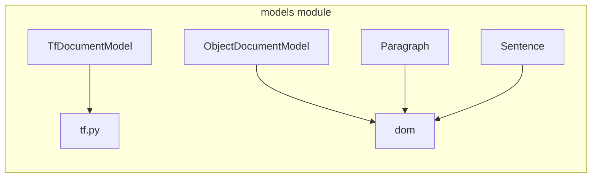

# `sumy.models`

## Tree:
models/
├── dom/
└── tf.py

## Role:
Provides foundational data structures for text processing, offering both hierarchical document modeling and term frequency-based representations.

## Description:
The models module serves as a core component library that defines fundamental data structures for text processing within the summarization system. It provides two complementary approaches to document representation: a hierarchical structure-based model through the dom submodule and a statistical term frequency model through the tf submodule.

The dom submodule implements a layered document model that organizes text content hierarchically from atomic sentences up to complete documents, enabling efficient processing while maintaining clear semantic boundaries. The tf submodule provides term frequency-based representations essential for information retrieval and statistical text analysis applications.

This module is consumed by various components throughout the summarization pipeline, including text processors, similarity calculators, and feature extractors that require structured document representations.

## Components:
- `dom`: Hierarchical document object model with Sentence, Paragraph, and ObjectDocumentModel classes
- `TfDocumentModel`: Term frequency-based document representation with statistical analysis capabilities

## Public API:
- `dom.ObjectDocumentModel(paragraphs)`: Constructor for creating document models from paragraph collections
- `dom.ObjectDocumentModel.paragraphs`: Property returning the stored paragraphs tuple
- `dom.ObjectDocumentModel.sentences`: Cached property returning flattened sentences from all paragraphs
- `dom.ObjectDocumentModel.headings`: Cached property returning flattened headings from all paragraphs  
- `dom.Paragraph(sentences)`: Constructor for creating paragraph objects from sentence collections
- `dom.Paragraph.sentences`: Property returning all non-heading sentences in the paragraph
- `dom.Paragraph.headings`: Property returning all heading sentences in the paragraph
- `dom.Sentence(text, tokenizer, is_heading=False)`: Constructor for creating sentence objects
- `dom.Sentence.is_heading`: Property indicating if the sentence is a heading
- `dom.Sentence.words`: Property returning tokenized words from the sentence text
- `TfDocumentModel(words, tokenizer=None)`: Constructor for creating term frequency models
- `TfDocumentModel.terms`: Property returning all unique terms in the document
- `TfDocumentModel.magnitude`: Property calculating the Euclidean norm of the term frequency vector
- `TfDocumentModel.term_frequency(term)`: Method returning frequency count of a specified term
- `TfDocumentModel.normalized_term_frequency(term, smooth=0.0)`: Method calculating normalized term frequency
- `TfDocumentModel.most_frequent_terms(count=0)`: Method returning most frequent terms sorted by frequency
- `TfDocumentModel.__repr__()`: Method returning string representation of the document model

## Dependencies:
- Internal: `sumy.models.dom` (for hierarchical document modeling)
- External: Various tokenizers and utility libraries required by the components

## Constraints:
- Callers must ensure proper initialization of all components before use
- Thread-safety is not guaranteed for mutable state; concurrent access should be externally synchronized
- All Sentence objects must have a tokenizer with a `to_words()` method available
- Callers must ensure that all paragraph objects passed to ObjectDocumentModel are valid Paragraph instances
- Callers must ensure that all sentence objects passed to Paragraph are valid Sentence instances
- When creating TfDocumentModel from a string, a tokenizer must be provided

---

## Files

- [`tf.py`](models/tf.md)

