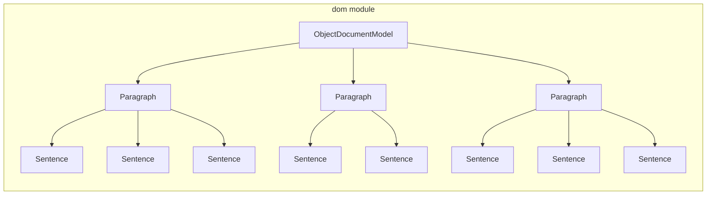

# `sumy.models.dom`

## Tree:
dom/
├── _document.py
├── _paragraph.py
└── _sentence.py

## Role:
Provides a hierarchical document object model for representing and processing text documents with clear separation between sentence-level content, paragraph-level organization, and document-level aggregation.

## Description:
The dom module implements a layered document model that organizes text content hierarchically from atomic sentences up to complete documents. This structure enables efficient processing of document content while maintaining clear semantic boundaries between different levels of granularity.

This module is primarily consumed by text summarization pipelines and document processing systems that require structured access to document components. The hierarchical nature of the model allows for flexible content extraction and analysis at various levels of granularity.

The cohesion of these components stems from their shared responsibility of modeling document structure: Sentence represents atomic text units, Paragraph groups sentences into logical blocks, and Document aggregates paragraphs into complete documents.

## Components:
- `ObjectDocumentModel`: Aggregates content from multiple paragraphs into unified collections of sentences, headings, and words
- `Paragraph`: Encapsulates a collection of sentences with efficient access to sentences, headings, and words
- `Sentence`: Represents a text sentence or heading with tokenized word access and equality comparison capabilities

## Public API:
- `ObjectDocumentModel(paragraphs)`: Constructor for creating document models from paragraph collections
- `ObjectDocumentModel.paragraphs`: Property returning the stored paragraphs tuple
- `ObjectDocumentModel.sentences`: Cached property returning flattened sentences from all paragraphs
- `ObjectDocumentModel.headings`: Cached property returning flattened headings from all paragraphs  
- `ObjectDocumentModel.words`: Cached property returning flattened words from all paragraphs
- `Paragraph(sentences)`: Constructor for creating paragraph objects from sentence collections
- `Paragraph.sentences`: Property returning all non-heading sentences in the paragraph
- `Paragraph.headings`: Property returning all heading sentences in the paragraph
- `Paragraph.words`: Property returning all words from all sentences in the paragraph
- `Sentence(text, tokenizer, is_heading=False)`: Constructor for creating sentence objects
- `Sentence.is_heading`: Property indicating if the sentence is a heading
- `Sentence.words`: Property returning tokenized words from the sentence text

## Dependencies:
- Internal: None (purely local module dependencies)
- External: Requires a tokenizer implementation that supports `to_words()` method for Sentence processing

## Constraints:
- Callers must ensure that all paragraph objects passed to ObjectDocumentModel are valid Paragraph instances
- Callers must ensure that all sentence objects passed to Paragraph are valid Sentence instances
- All Sentence objects must have a tokenizer with a `to_words()` method available
- The module assumes proper initialization of all components before use
- Thread-safety is not guaranteed; concurrent access to mutable state should be externally synchronized

---

## Files

- [`_document.py`](dom/_document.md)
- [`_paragraph.py`](dom/_paragraph.md)
- [`_sentence.py`](dom/_sentence.md)

