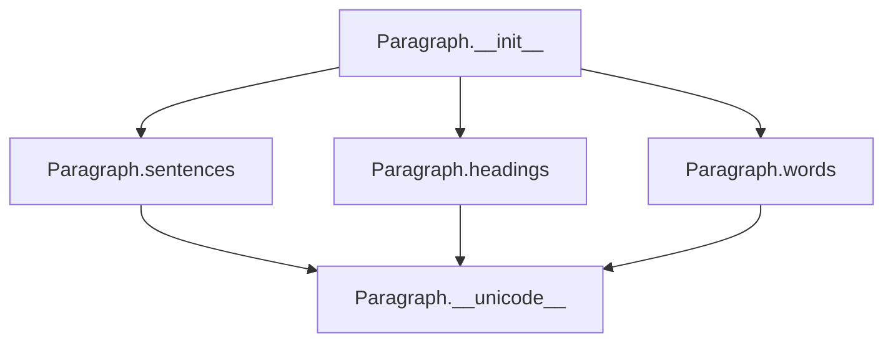

# `_paragraph.py`

## `sumy.models.dom._paragraph.Paragraph` · *class*

## Summary:
Represents a paragraph containing multiple sentences, providing access to sentences, headings, and words with efficient caching.

## Description:
The Paragraph class encapsulates a collection of Sentence objects and provides convenient access patterns for different types of content within a paragraph. It separates regular sentences from heading sentences and offers cached access to all words in the paragraph. This abstraction allows for efficient processing of document structure while maintaining clean separation between content types.

This class is typically instantiated by document parsers or text processors that construct document structures from raw text. It serves as a building block for higher-level document models.

## State:
- `_sentences` (tuple[Sentence]): Immutable collection of all sentences in the paragraph
- `_cached_property_sentences` (tuple[Sentence]): Cached result of filtered sentences (excluding headings)
- `_cached_property_headings` (tuple[Sentence]): Cached result of heading sentences
- `_cached_property_words` (tuple[str]): Cached result of all words from all sentences

The constructor requires a sequence of Sentence objects and validates that all items are indeed Sentence instances.

## Lifecycle:
Creation: Instantiate with a sequence of Sentence objects via `Paragraph(sentences)`. All sentences must be instances of the Sentence class.
Usage: Access cached properties `sentences`, `headings`, and `words` as needed. These properties are computed once and cached for subsequent accesses.
Destruction: No explicit cleanup required; standard Python garbage collection handles resource management.

## Method Map:


## Raises:
- `TypeError`: Raised during initialization if any item in the sentences sequence is not an instance of the Sentence class.

## Example:
```python
# Create sentences
sentence1 = Sentence("This is a regular sentence.", tokenizer)
heading1 = Sentence("Introduction", tokenizer, is_heading=True)
sentence2 = Sentence("This is another sentence.", tokenizer)

# Create paragraph
paragraph = Paragraph([sentence1, heading1, sentence2])

# Access content
print(paragraph.sentences)   # Regular sentences only
print(paragraph.headings)    # Heading sentences only
print(paragraph.words)       # All words from all sentences
print(repr(paragraph))       # String representation
```

### `sumy.models.dom._paragraph.Paragraph.__init__` · *method*

## Summary:
Initializes a Paragraph object with a collection of Sentence instances, validating and storing them as an immutable tuple.

## Description:
Constructs a Paragraph instance by converting the input sequence into an immutable tuple of Sentence objects. This method ensures type safety by verifying that all elements in the input sequence are instances of the Sentence class. The validated sentences are stored internally as an immutable tuple for efficient access and to prevent modification after construction.

This validation logic is encapsulated in its own method rather than being inlined because it performs a critical type check that could fail with a confusing error message if done implicitly. Separating this validation into its own method makes the error handling clearer and allows for consistent validation across different instantiation paths.

## Args:
    sentences (iterable[Sentence]): A sequence of Sentence objects to include in the paragraph. Each item must be an instance of the Sentence class.

## Returns:
    None: This method initializes the object's state but does not return a value.

## Raises:
    TypeError: Raised when any item in the sentences sequence is not an instance of the Sentence class.

## State Changes:
    Attributes READ: None
    Attributes WRITTEN: 
    - self._sentences: Stores the validated and converted tuple of Sentence objects

## Constraints:
    Preconditions:
    - All items in the sentences parameter must be instances of the Sentence class
    - The sentences parameter must be iterable
    
    Postconditions:
    - self._sentences is set to an immutable tuple of Sentence objects
    - All Sentence objects in the tuple are validated instances

## Side Effects:
    None: This method performs no I/O operations or external service calls. It only performs in-memory operations to validate and store the input data.

### `sumy.models.dom._paragraph.Paragraph.sentences` · *method*

## Summary:
Returns a tuple of all non-heading sentences contained in this paragraph.

## Description:
This cached property provides filtered access to the paragraph's sentences by excluding any sentences marked as headings. It's designed to separate content sentences from heading sentences for processing and analysis purposes.

The method is implemented as a cached property, ensuring that the filtering operation is performed only once per paragraph instance, with subsequent accesses returning a cached result for performance optimization.

## Args:
    None

## Returns:
    tuple[Sentence]: A tuple containing all Sentence objects in this paragraph that are not marked as headings (where `sentence.is_heading` is False).

## Raises:
    None

## State Changes:
    Attributes READ: 
    - self._sentences: The internal storage of all sentences in the paragraph
    - self._sentences.is_heading: Accesses the is_heading property of each sentence
    
    Attributes WRITTEN: 
    - None

## Constraints:
    Preconditions:
    - The paragraph must have been initialized with a valid tuple of Sentence objects
    - Each item in self._sentences must be an instance of the Sentence class
    
    Postconditions:
    - Returns a tuple of Sentence objects (never None)
    - All returned sentences have is_heading = False
    - The returned tuple is immutable (tuple type)

## Side Effects:
    None

### `sumy.models.dom._paragraph.Paragraph.headings` · *method*

## Summary:
Returns a tuple containing all sentences in the paragraph that are identified as headings.

## Description:
This property provides access to the heading sentences within a paragraph. It filters the paragraph's sentences to return only those marked as headings (where `is_heading` is True). The result is cached for performance optimization.

## Args:
    None

## Returns:
    tuple[Sentence]: A tuple of Sentence objects that are identified as headings within this paragraph.

## Raises:
    None

## State Changes:
    Attributes READ: self._sentences
    Attributes WRITTEN: None

## Constraints:
    Preconditions: The Paragraph instance must have been initialized with valid Sentence objects.
    Postconditions: The returned tuple contains only Sentence objects where `is_heading` is True.

## Side Effects:
    None

### `sumy.models.dom._paragraph.Paragraph.words` · *method*

## Summary:
Returns a flattened tuple of all word tokens from all sentences in the paragraph.

## Description:
This cached property provides access to all word tokens contained within the paragraph's constituent sentences. It aggregates words from all sentences (both headings and regular sentences) into a single flat tuple for efficient access.

The method is implemented as a cached property, meaning the result is computed once and stored for subsequent accesses, improving performance for repeated calls.

## Args:
    None

## Returns:
    tuple[str]: A tuple containing all word tokens from all sentences in the paragraph, in order. Empty tuple if no sentences exist.

## Raises:
    None

## State Changes:
    Attributes READ: self._sentences
    Attributes WRITTEN: None

## Constraints:
    Preconditions: 
    - The paragraph must have been initialized with valid Sentence objects
    - Each sentence in self._sentences must have a valid words property
    
    Postconditions:
    - Returns a tuple of strings representing all words in the paragraph
    - The returned tuple is immutable and contains all words in document order

## Side Effects:
    None

### `sumy.models.dom._paragraph.Paragraph.__unicode__` · *method*

## Summary:
Returns a string representation of the paragraph showing the count of headings and sentences it contains.

## Description:
This method provides a human-readable string representation of a Paragraph object, displaying the number of headings and sentences contained within it. It's designed to give a quick overview of the paragraph's composition for debugging and logging purposes.

The method is part of Python's string representation protocol and is typically called when str() or unicode() is invoked on a Paragraph instance, or when the object is printed.

## Args:
    None

## Returns:
    str: A formatted string in the format "<Paragraph with X headings & Y sentences>" where X is the count of heading sentences and Y is the count of regular sentences.

## Raises:
    None

## State Changes:
    Attributes READ: 
    - self.headings (cached property)
    - self.sentences (cached property)

## Constraints:
    Preconditions:
    - The Paragraph object must be properly initialized with sentences
    - The cached properties `headings` and `sentences` must be accessible
    
    Postconditions:
    - The returned string format is always consistent
    - The counts accurately reflect the number of headings and sentences in the paragraph

## Side Effects:
    None

### `sumy.models.dom._paragraph.Paragraph.__repr__` · *method*

## Summary:
Returns the string representation of the paragraph by delegating to the object's string conversion method.

## Description:
Implements the Python `__repr__` protocol by delegating to the object's `__str__` method. This method is part of the standard Python object protocol and ensures that the paragraph object can be represented as a string in debugging contexts, print statements, and other string conversion scenarios. When called, it invokes `self.__str__()` which will return the default object representation since no explicit `__str__` method is defined in this class.

## Args:
    None

## Returns:
    str: A string representation of the paragraph object, typically the default object representation when no custom `__str__` method is defined.

## Raises:
    None

## State Changes:
    Attributes READ: None
    Attributes WRITTEN: None

## Constraints:
    Preconditions: The object must be properly initialized with sentences.
    Postconditions: Returns a string representation of the paragraph object.

## Side Effects:
    None

