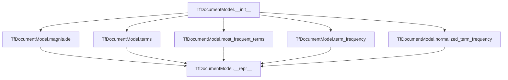

# `tf.py`

## `sumy.models.tf.TfDocumentModel` · *class*

## Summary:
Represents a document model based on term frequencies, providing methods to calculate and retrieve term frequency statistics.

## Description:
The TfDocumentModel class encapsulates a document's term frequency information, allowing for various frequency-based calculations and queries. It is designed to work with either a sequence of words or a string that requires tokenization. This abstraction enables efficient computation of term frequencies, normalized frequencies, and other statistical measures useful in text processing and information retrieval applications.

## State:
- `_terms`: Counter object containing lowercase terms as keys and their frequencies as values
- `_max_frequency`: Integer representing the maximum frequency of any term in the document, defaults to 1 when no terms exist

Initialization parameters:
- `words`: Either a sequence of words or a string to be tokenized (required)
- `tokenizer`: Tokenizer instance used to convert string input into word sequences (optional, required when words is a string)

Class invariants:
- All terms stored in `_terms` are converted to lowercase
- `_max_frequency` is always at least 1 (returns 1 when no terms exist)
- `_terms` is always a Counter object

## Lifecycle:
Creation: Instantiate with either a sequence of words or a string with a tokenizer. The constructor validates input types and processes the words accordingly.
Usage: Access properties like `magnitude` and `terms`, and call methods such as `term_frequency()`, `normalized_term_frequency()`, and `most_frequent_terms()`.
Destruction: No special cleanup required; standard Python garbage collection handles memory management.

## Method Map:


## Raises:
- ValueError: Raised during initialization when words is a string but tokenizer is None, or when words is neither a string nor a sequence.

## Example:
```python
# Create from a sequence of words
model1 = TfDocumentModel(['hello', 'world', 'hello'])

# Create from a string with tokenizer
from sumy.tokenizers import Tokenizer
tokenizer = Tokenizer("english")
model2 = TfDocumentModel("Hello world hello", tokenizer)

# Use the model
print(model1.magnitude)  # Calculate vector magnitude
print(model1.terms)      # Get all unique terms
print(model1.term_frequency('hello'))  # Get frequency of 'hello'
print(model1.normalized_term_frequency('hello'))  # Get normalized frequency
print(model1.most_frequent_terms(2))  # Get 2 most frequent terms
```

### `sumy.models.tf.TfDocumentModel.__init__` · *method*

## Summary:
Initializes a document model from words, converting strings to sequences using a tokenizer when needed and normalizing terms to lowercase.

## Description:
Constructs a TfDocumentModel instance by processing input words into a standardized format. The method accepts either a sequence of words or a string that requires tokenization, ensuring all terms are stored in lowercase for consistent frequency calculations. This validation and preprocessing logic is separated into its own method to ensure proper initialization state before other operations can be performed.

## Args:
    words (str or Sequence): Either a string to be tokenized or a sequence of words. Required parameter.
    tokenizer (object, optional): Tokenizer instance used to convert string input into word sequences. Required when words is a string.

## Returns:
    None: This method initializes the object's internal state and does not return a value.

## Raises:
    ValueError: Raised when words is a string but tokenizer is None, or when words is neither a string nor a sequence.

## State Changes:
    Attributes READ: None
    Attributes WRITTEN: 
    - self._terms: Set to a Counter object containing lowercase terms and their frequencies
    - self._max_frequency: Set to the maximum frequency value among all terms, or 1 if no terms exist

## Constraints:
    Preconditions:
    - If words is a string, tokenizer must be provided
    - If words is not a string, it must be a sequence-like object
    - Words parameter must be provided (no default value)

    Postconditions:
    - self._terms is always initialized as a Counter object
    - self._max_frequency is always at least 1 (returns 1 when no terms exist)
    - All terms in self._terms are converted to lowercase

## Side Effects:
    None

### `sumy.models.tf.TfDocumentModel.magnitude` · *method*

## Summary:
Calculates the Euclidean norm (magnitude) of the document's term frequency vector.

## Description:
This property computes the magnitude of the document model's term frequency representation using the formula √(Σt²) where t represents each term's frequency. This value is commonly used for normalizing document vectors in text processing and similarity calculations.

## Args:
    None

## Returns:
    float: The Euclidean norm of the term frequency vector. Returns 0.0 for empty documents.

## Raises:
    None

## State Changes:
    Attributes READ: self._terms
    Attributes WRITTEN: None

## Constraints:
    Preconditions: The object must have a valid `_terms` attribute containing numeric term frequencies.
    Postconditions: The returned value is always non-negative.

## Side Effects:
    None

### `sumy.models.tf.TfDocumentModel.terms` · *method*

## Summary:
Returns an iterator over all unique terms (words) present in the document model.

## Description:
Provides access to all unique terms stored in the document's term frequency collection. This method is commonly used in text processing pipelines to enumerate all words that appear in a document, enabling downstream operations such as term frequency analysis, vocabulary building, or document similarity computations.

The method is typically called during preprocessing or feature extraction stages where the complete vocabulary of a document needs to be accessed. It serves as a convenient interface to retrieve the set of terms without exposing the underlying Counter implementation.

## Args:
    None

## Returns:
    dict_keys: An iterator over the keys (unique terms) of the internal `_terms` Counter object. These represent all unique words present in the document.

## Raises:
    None

## State Changes:
    Attributes READ: self._terms
    Attributes WRITTEN: None

## Constraints:
    Preconditions:
    - The TfDocumentModel instance must be properly initialized with word data
    - The `_terms` attribute must be a dictionary-like object with terms as keys
    
    Postconditions:
    - Returns an iterator containing all unique terms in the document
    - The method does not modify the document model's state

## Side Effects:
    None

### `sumy.models.tf.TfDocumentModel.most_frequent_terms` · *method*

## Summary:
Returns the most frequent terms from the document model, sorted by frequency in descending order.

## Description:
This method retrieves terms from the document's term frequency collection and returns them sorted by frequency in descending order. It allows limiting the number of returned terms through the count parameter. This method is useful for extracting the most important terms from a document based on their frequency.

## Args:
    count (int): Maximum number of terms to return. If 0 (default), returns all terms. If positive, returns up to that many terms. If negative, raises ValueError.

## Returns:
    tuple[str]: A tuple of term strings sorted by frequency in descending order. Returns all terms if count is 0, or up to count terms if count is positive.

## Raises:
    ValueError: When count parameter is negative, indicating only non-negative values are allowed.

## State Changes:
    Attributes READ: self._terms
    Attributes WRITTEN: None

## Constraints:
    Preconditions: self._terms must be a dictionary-like object with terms as keys and frequencies as values
    Postconditions: Returns a tuple of strings representing terms sorted by frequency in descending order

## Side Effects:
    None

### `sumy.models.tf.TfDocumentModel.term_frequency` · *method*

## Summary:
Returns the frequency count of a specified term within the document model.

## Description:
Retrieves the term frequency for a given term from the document's term frequency counter. If the term is not present in the document, returns zero instead of raising an exception. This method provides a safe way to access term frequencies without requiring prior existence checks.

The method is typically called during text processing workflows where term frequencies are needed for document representation, similarity calculations, or statistical analysis. It serves as a fundamental building block for higher-level operations like normalized term frequency computation.

## Args:
    term (str): The term whose frequency is to be retrieved

## Returns:
    int: The frequency count of the specified term in the document, or 0 if the term is not present

## Raises:
    None

## State Changes:
    Attributes READ: self._terms
    Attributes WRITTEN: None

## Constraints:
    Preconditions:
    - The TfDocumentModel instance must be properly initialized with word data
    - The term parameter must be a string
    
    Postconditions:
    - Returns a non-negative integer representing the term frequency
    - The method does not modify the document model's state

## Side Effects:
    None

### `sumy.models.tf.TfDocumentModel.normalized_term_frequency` · *method*

## Summary:
Calculates the normalized term frequency of a given term with optional smoothing applied.

## Description:
Computes the normalized frequency of a term within the document by dividing its raw frequency by the maximum term frequency in the document. An optional smoothing factor can be applied to prevent zero frequencies for unseen terms.

This method is part of the TfDocumentModel class and is used in text processing pipelines to calculate term importance metrics. It's typically called during document representation or similarity calculation phases where normalized term frequencies are needed.

## Args:
    term (str): The term for which to calculate the normalized frequency
    smooth (float): Smoothing factor between 0.0 and 1.0 to prevent zero probabilities. Defaults to 0.0

## Returns:
    float: Normalized term frequency value between 0.0 and 1.0, inclusive

## Raises:
    None explicitly raised

## State Changes:
    Attributes READ: self._max_frequency, self._terms
    Attributes WRITTEN: None

## Constraints:
    Preconditions: 
    - The term parameter must be a string
    - The smooth parameter must be between 0.0 and 1.0
    - The TfDocumentModel instance must have been initialized with valid word data
    
    Postconditions:
    - Returns a float value in the range [0.0, 1.0]
    - The result represents the normalized frequency of the term in the document

## Side Effects:
    None

### `sumy.models.tf.TfDocumentModel.__repr__` · *method*

## Summary:
Returns a string representation of the TfDocumentModel instance showing its class name and formatted term frequencies.

## Description:
This method implements the standard Python `__repr__` protocol to provide a developer-friendly string representation of TfDocumentModel instances. It displays the class name followed by a formatted version of the internal `_terms` Counter, which contains lowercase words mapped to their frequency counts. This representation is particularly useful for debugging and logging purposes, allowing developers to quickly inspect the content and term distribution of a document model.

## Args:
    None

## Returns:
    str: A string in the format "<TfDocumentModel {formatted_terms}>" where formatted_terms is a pretty-printed representation of the internal Counter object containing word frequencies.

## Raises:
    None

## State Changes:
    Attributes READ: self._terms
    Attributes WRITTEN: None

## Constraints:
    Preconditions: The object must be properly initialized with a `_terms` attribute that is a Counter-like object.
    Postconditions: The returned string accurately represents the internal state of the document model's term frequencies.

## Side Effects:
    None

