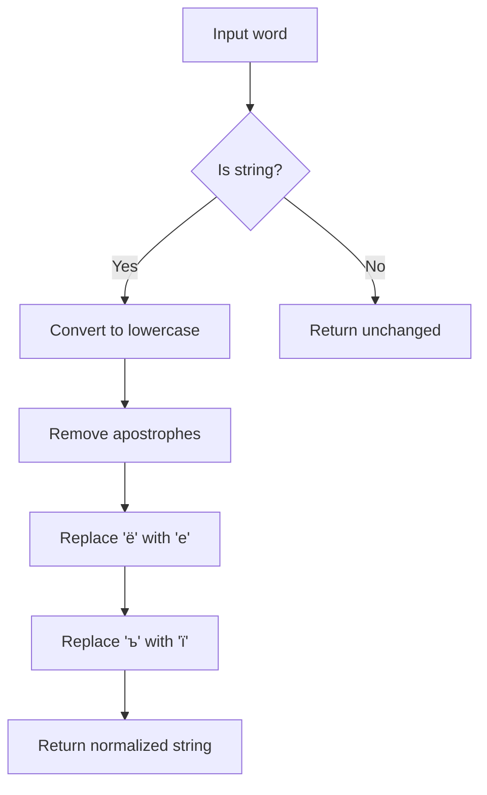

# `ukrainian.py`

## `sumy.nlp.stemmers.ukrainian.stem_word` · *function*

## Summary:
Applies Ukrainian word stemming by removing morphological suffixes and normalizing word forms to their base root.

## Description:
Implements a Ukrainian linguistic stemming algorithm that reduces words to their base morphological roots by systematically removing inflectional and derivational suffixes. This function serves as the core processing unit for Ukrainian text normalization in natural language processing pipelines.

The function follows a multi-stage approach:
1. Normalizes input text through preprocessing
2. Identifies vowel-containing words and applies RV-referent analysis
3. Applies sequential suffix removal based on morphological categories
4. Handles special cases like derivational suffixes and consonant clusters

This logic is extracted into its own function to encapsulate the complex Ukrainian stemming rules and provide a reusable interface for text preprocessing workflows.

## Args:
    word (str): The Ukrainian word to be stemmed. Must be a string containing Cyrillic characters.

## Returns:
    str: The stemmed version of the input word with morphological suffixes removed. Returns the original word unchanged if it contains no Ukrainian vowels or cannot be further reduced.

## Raises:
    None: This function does not explicitly raise exceptions, though underlying regex operations may raise re.error if malformed patterns are encountered.

## Constraints:
    Preconditions:
        - Input must be a string type
        - Word should contain valid Ukrainian Cyrillic characters
        - All required helper functions and constants must be available in scope
    
    Postconditions:
        - Output is a normalized Ukrainian word stem
        - The returned stem represents the base morphological form of the input word
        - Function preserves the original word if no stemming rules apply

## Side Effects:
    None: This function is pure and has no side effects.

## Control Flow:
```mermaid
flowchart TD
    A[Input word] --> B[_preprocess(word)]
    B --> C{Contains Ukrainian vowels?}
    C -->|No| D[Return word]
    C -->|Yes| E[Find _RVRE pattern]
    E --> F[Split into start and suffix]
    F --> G[Update suffix with _PERFECTIVE_GROUND]
    G --> H{Updated?}
    H -->|No| I[Update with _REFLEXIVE]
    I --> J[Update with _ADJECTIVE]
    J --> K{Updated?}
    K -->|Yes| L[Update with _PARTICIPLE]
    K -->|No| M[Update with _VERB]
    M --> N{Updated?}
    N -->|No| O[Update with _NOUN]
    O --> P[Update with 'и$']
    P --> Q{Matches _DERIVATIONAL?}
    Q -->|Yes| R[Update with 'ость$']
    R --> S[Update with 'ь$']
    S --> T{Updated?}
    T -->|Yes| U[Update with 'ейше?$']
    U --> V[Update with 'нн$']
    V --> W[Return start + suffix]
```

## Examples:
    >>> stem_word("програмування")
    'програмуван'
    
    >>> stem_word("містечко")
    'містечк'
    
    >>> stem_word("доброго")
    'добр'
    
    >>> stem_word("підприємство")
    'підприємств'
```

## `sumy.nlp.stemmers.ukrainian._preprocess` · *function*

## Summary:
Normalizes Ukrainian text by converting to lowercase and replacing specific Cyrillic characters with their standard equivalents.

## Description:
This function processes Ukrainian text by performing character normalization to ensure consistent representation. It converts all characters to lowercase, removes apostrophes, and replaces specific Cyrillic characters ('ё' and 'ъ') with their standard Ukrainian equivalents ('е' and 'ї'). This preprocessing step is essential for consistent stemming operations in Ukrainian text analysis.

## Args:
    word (str): The input word or text string to be normalized. Must be a string containing Cyrillic characters.

## Returns:
    str: The normalized string with lowercase conversion and character replacements applied. Returns an empty string if input is empty.

## Raises:
    None: This function does not raise any exceptions under normal operation.

## Constraints:
    Preconditions:
        - Input must be a string type
        - Function handles Unicode characters properly
    
    Postconditions:
        - Output string contains only standard Ukrainian characters
        - All characters are converted to lowercase
        - Apostrophes are completely removed from the string
        - Characters 'ё' and 'ъ' are replaced with 'е' and 'ї' respectively

## Side Effects:
    None: This function is pure and has no side effects.

## Control Flow:


## Examples:
    >>> _preprocess("Привіт'")
    'привіт'
    
    >>> _preprocess("Містечко")
    'містечко'
    
    >>> _preprocess("Світло'є")
    'світлоє'
    
    >>> _preprocess("Тестъ")
    'тестї'

## `sumy.nlp.stemmers.ukrainian._update_suffix` · *function*

## Summary:
Updates a suffix string by applying a regular expression pattern replacement and indicates whether any change occurred.

## Description:
This helper function performs pattern-based substitution on a suffix string commonly used in Ukrainian word stemming algorithms. It applies a regular expression pattern to replace matching portions of the suffix with a specified replacement string, returning both a boolean flag indicating whether modification occurred and the resulting string.

## Args:
    suffix (str): The suffix string to process and potentially modify
    pattern (str): Regular expression pattern to match against the suffix
    replacement (str): String to replace matched patterns with

## Returns:
    tuple[bool, str]: A tuple containing:
        - bool: True if the suffix was modified (changed) by the pattern replacement, False otherwise
        - str: The resulting string after applying the pattern replacement

## Raises:
    re.error: If the pattern argument contains invalid regular expression syntax

## Constraints:
    Preconditions:
        - suffix must be a string
        - pattern must be a valid regular expression string
        - replacement must be a string
    
    Postconditions:
        - The returned boolean accurately reflects whether suffix != result
        - The result string is the suffix with pattern replacements applied

## Side Effects:
    None

## Control Flow:
```mermaid
flowchart TD
    A[Input: suffix, pattern, replacement] --> B{Apply re.sub}
    B --> C[result = re.sub(pattern, replacement, suffix)]
    C --> D{Check if suffix != result}
    D -->|True| E[Return (True, result)]
    D -->|False| F[Return (False, result)]
```

## Examples:
    # Example 1: Suffix changes
    changed, new_suffix = _update_suffix("ing", "ing$", "e")
    # Returns: (True, "e")
    
    # Example 2: Suffix unchanged  
    changed, new_suffix = _update_suffix("ing", "ed$", "e")
    # Returns: (False, "ing")

