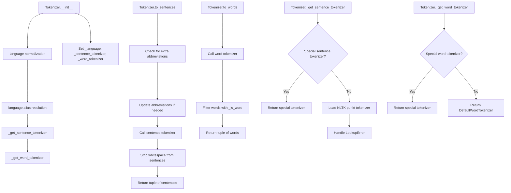

# `tokenizers.py`

## `sumy.nlp.tokenizers.DefaultWordTokenizer` · *class*

## Summary:
A default word tokenizer that utilizes NLTK's word_tokenize function for standard English text tokenization.

## Description:
The DefaultWordTokenizer serves as the baseline implementation for word tokenization in English text processing within the sumy library. It provides a simple interface that delegates tokenization tasks to NLTK's established word_tokenize method, making it suitable for general English text processing needs. This class is intended to be used as the default tokenizer when no language-specific or specialized tokenization is required, forming part of a broader tokenization framework that supports multiple languages and text processing requirements.

## State:
- No instance attributes beyond standard object attributes
- The class maintains no internal state between method calls
- The tokenize method operates purely on its input parameter

## Lifecycle:
- Creation: Instantiation requires no arguments and creates a stateless object
- Usage: Call the tokenize() method with a string argument to obtain a list of word tokens
- Destruction: No special cleanup is required as the class is stateless

## Method Map:
```mermaid
graph TD
    A[DefaultWordTokenizer] --> B[tokenize(text)]
    B --> C[nltk.word_tokenize(text)]
```

## Raises:
- No explicit exceptions are raised by the class itself
- Exceptions may be raised by NLTK's word_tokenize function when encountering invalid input types or other processing errors

## Example:
```python
from sumy.nlp.tokenizers import DefaultWordTokenizer

# Create tokenizer instance
tokenizer = DefaultWordTokenizer()

# Tokenize sample text
text = "Hello world! How are you?"
tokens = tokenizer.tokenize(text)
# Returns: ['Hello', 'world', '!', 'How', 'are', 'you', '?']

# Works with various English text formats
text2 = "It's a beautiful day, isn't it?"
tokens2 = tokenizer.tokenize(text2)
# Returns: ['It', "'s", 'a', 'beautiful', 'day', ',', 'isn', "'t", 'it', '?']
```

### `sumy.nlp.tokenizers.DefaultWordTokenizer.tokenize` · *method*

## Summary:
Tokenizes input text into individual words using NLTK's word tokenizer.

## Description:
This method performs word-level tokenization on the provided text using NLTK's built-in word tokenizer. It serves as the default implementation for splitting text into discrete tokens that can be processed further in natural language processing pipelines. This method is part of the DefaultWordTokenizer class and provides a standardized way to convert text into tokenized word sequences.

## Args:
    text (str): The input text string to be tokenized into individual words.

## Returns:
    list[str]: A list of tokenized words extracted from the input text, with punctuation properly separated.

## Raises:
    None explicitly raised by this method.

## State Changes:
    Attributes READ: None
    Attributes WRITTEN: None

## Constraints:
    Preconditions: The input text must be a valid string.
    Postconditions: The returned list contains individual word tokens with proper punctuation separated.

## Side Effects:
    None

## `sumy.nlp.tokenizers.HebrewWordTokenizer` · *class*

## Summary:
A Hebrew word tokenizer that processes Hebrew text by removing punctuation and extracting Hebrew character sequences.

## Description:
The HebrewWordTokenizer is a specialized text processing component designed to tokenize Hebrew text by removing punctuation marks and filtering for Hebrew character groups. It serves as a wrapper around the hebrew_tokenizer library to provide a clean interface for Hebrew text tokenization.

This class should be instantiated indirectly through its classmethod `tokenize()` rather than direct instantiation. It is typically used in natural language processing pipelines that require Hebrew text preprocessing.

The motivation for this abstraction is to provide a consistent interface for Hebrew tokenization while handling the dependency requirements and filtering of Hebrew character groups from mixed-language text.

## State:
- `_TRANSLATOR`: Class attribute of type `dict` created by `str.maketrans("", "", string.punctuation)` that maps punctuation characters to None for removal

## Lifecycle:
- Creation: Cannot be directly instantiated; use the classmethod `tokenize()` instead
- Usage: Call `HebrewWordTokenizer.tokenize(text)` with Hebrew text as input
- Destruction: No explicit cleanup required as it's a stateless utility class

## Method Map:
```mermaid
graph TD
    A[HebrewWordTokenizer.tokenize] --> B[text.translate(_TRANSLATOR)]
    B --> C[hebrew_tokenizer.tokenize(text)]
    C --> D{token in (HEBREW, HEBREW_1, HEBREW_2)}
    D --> E[Return filtered Hebrew words]
```

## Raises:
- `ValueError`: Raised when the `hebrew_tokenizer` library is not installed, with message "Hebrew tokenizer requires hebrew_tokenizer. Please, install it by command 'pip install hebrew_tokenizer'."

## Example:
```python
# Tokenizing Hebrew text
text = "שלום עולם! איך אתה?"
tokens = HebrewWordTokenizer.tokenize(text)
# Returns: ['שלום', 'עולם', 'איך', 'אתה']

# This would raise ValueError if hebrew_tokenizer is not installed
try:
    tokens = HebrewWordTokenizer.tokenize("טקסט בעברית")
except ValueError as e:
    print(f"Missing dependency: {e}")
```

### `sumy.nlp.tokenizers.HebrewWordTokenizer.tokenize` · *method*

## Summary:
Tokenizes Hebrew text into individual words by filtering Hebrew character tokens from the full tokenization result.

## Description:
This class method processes Hebrew text by first translating characters according to the class's translation table, then applying the Hebrew tokenizer to extract tokens. It filters the resulting tokens to include only those classified as Hebrew characters (HEBREW, HEBREW_1, or HEBREW_2 groups) and returns the corresponding words.

## Args:
    text (str): The Hebrew text to tokenize into individual words.

## Returns:
    list[str]: A list of individual Hebrew words extracted from the input text, filtered to include only Hebrew character tokens.

## Raises:
    ValueError: When the required 'hebrew_tokenizer' package is not installed, with instructions to install it via pip.

## State Changes:
    Attributes READ: cls._TRANSLATOR - used for character translation
    Attributes WRITTEN: None

## Constraints:
    Preconditions: 
    - The text parameter must be a string
    - The hebrew_tokenizer package must be installed
    - cls._TRANSLATOR must be properly initialized
    
    Postconditions:
    - Returns a list of strings containing only Hebrew words
    - The returned list may be empty if no Hebrew tokens are found

## Side Effects:
    None

## `sumy.nlp.tokenizers.JapaneseWordTokenizer` · *class*

## Summary:
JapaneseWordTokenizer is a text processing class that segments Japanese text into individual words using the tinysegmenter library.

## Description:
This class provides Japanese text tokenization functionality by leveraging the tinysegmenter library, which is specifically designed for Japanese word segmentation. It serves as a specialized tokenizer for Japanese language processing tasks within the Sumy library ecosystem.

The class is typically instantiated when Japanese text needs to be processed for summarization or other natural language processing tasks that require word-level analysis. It acts as a bridge between raw Japanese text and the tokenized word representations needed by downstream processing components.

## State:
- No instance attributes beyond the standard object attributes
- The class does not maintain any persistent state between method calls
- All processing is stateless and performed on-the-fly during tokenization

## Lifecycle:
- Creation: Instantiated without arguments (no constructor parameters required)
- Usage: Call the tokenize() method with a string argument containing Japanese text
- Destruction: Standard Python object cleanup via garbage collection

## Method Map:
```mermaid
graph TD
    A[JapaneseWordTokenizer] --> B[tokenize(text)]
    B --> C{tinysegmenter available?}
    C -->|No| D[ValueError]
    C -->|Yes| E[segmenter.tokenize(text)]
    E --> F[Return token list]
```

## Raises:
- ValueError: Raised when the tinysegmenter library is not installed, with a descriptive message instructing users to install it via 'pip install tinysegmenter'

## Example:
```python
# Create tokenizer instance
tokenizer = JapaneseWordTokenizer()

# Tokenize Japanese text
text = "こんにちは世界"
tokens = tokenizer.tokenize(text)
# Returns: ['こんにちは', '世界']
```

### `sumy.nlp.tokenizers.JapaneseWordTokenizer.tokenize` · *method*

## Summary:
Tokenizes Japanese text into word segments using the TinySegmenter library.

## Description:
This method performs Japanese word segmentation on the provided text using the TinySegmenter tokenizer. It is designed to handle Japanese text specifically, breaking it down into meaningful word units that can be processed further in natural language processing pipelines.

## Args:
    text (str): The Japanese text to be tokenized into word segments.

## Returns:
    list[str]: A list of tokenized Japanese words or morphemes extracted from the input text.

## Raises:
    ValueError: When the tinysegmenter library is not installed, providing a clear installation instruction.

## State Changes:
    Attributes READ: None
    Attributes WRITTEN: None

## Constraints:
    Preconditions: The input text must be a valid string containing Japanese characters.
    Postconditions: The returned list contains segmented Japanese words/morphemes.

## Side Effects:
    None

## `sumy.nlp.tokenizers.ChineseWordTokenizer` · *class*

## Summary:
Provides Chinese word tokenization using the jieba library.

## Description:
The ChineseWordTokenizer class implements word segmentation for Chinese text using the jieba library. This class serves as a wrapper around jieba's cutting functionality, providing a simple interface for splitting Chinese text into individual words or tokens. It is designed for use in natural language processing pipelines where Chinese text needs to be segmented into meaningful linguistic units.

The tokenizer is particularly important for Chinese text analysis because Chinese characters do not have inherent word boundaries like languages that use spaces (e.g., English). Proper word segmentation is essential for downstream NLP tasks such as sentiment analysis, topic modeling, and text summarization.

## State:
- No instance attributes maintained
- The class relies on the jieba library being available at runtime
- __init__ method is implicit (no explicit constructor needed)

## Lifecycle:
- Creation: Instantiation is straightforward with no required arguments
- Usage: Call the tokenize() method with a Unicode string containing Chinese text
- Destruction: No special cleanup required; uses standard Python garbage collection

## Method Map:
```mermaid
graph TD
    A[ChineseWordTokenizer] --> B[tokenize(text)]
    B --> C[jieba.cut(text)]
```

## Raises:
- ValueError: Raised when the jieba library is not installed, with a descriptive message instructing users to install it via 'pip install jieba'

## Example:
```python
tokenizer = ChineseWordTokenizer()
chinese_text = "这是一个测试句子"
tokens = tokenizer.tokenize(chinese_text)
# Note: jieba.cut returns a generator, so convert to list if needed
token_list = list(tokens)
print(token_list)
# Output might be: ['这是', '一个', '测试', '句子']
```

### `sumy.nlp.tokenizers.ChineseWordTokenizer.tokenize` · *method*

## Summary:
Tokenizes Chinese text into individual words using the jieba library.

## Description:
This method performs Chinese word segmentation on the provided text using the jieba library. It is designed to handle Chinese text specifically and returns a generator of tokens representing individual words or phrases. The method is part of the ChineseWordTokenizer class and follows the standard tokenization interface used throughout the sumy library for language-specific tokenizers.

## Args:
    text (str): The Chinese text to be tokenized into individual words or phrases.

## Returns:
    generator[str]: A generator yielding individual Chinese words or phrases extracted from the input text.

## Raises:
    ValueError: When the jieba library is not installed, with a descriptive message instructing the user to install it via 'pip install jieba'.

## State Changes:
    Attributes READ: None
    Attributes WRITTEN: None

## Constraints:
    Preconditions: 
    - The input text must be a string
    - The jieba library must be installed in the environment
    Postconditions:
    - The returned generator will yield individual Chinese words or phrases
    - Each yielded item will be a string representing a segmented word

## Side Effects:
    - Raises ImportError if jieba is not available (handled internally)
    - Depends on external jieba library installation

## `sumy.nlp.tokenizers.KoreanSentencesTokenizer` · *class*

## Summary:
A sentence tokenizer for Korean text that segments input text into individual sentences using the Kkma tokenizer from konlpy.

## Description:
This class provides sentence-level tokenization for Korean language text. It serves as a wrapper around the Kkma tokenizer from the konlpy library, specifically utilizing its sentence segmentation capabilities. The tokenizer is designed to handle Korean text input and split it into meaningful sentence units.

The class is intended to be used in natural language processing pipelines where Korean text needs to be segmented at the sentence level. It's typically instantiated when sentence-level analysis is required for Korean documents.

## State:
- No instance attributes maintained
- The class relies on the konlpy library's Kkma tokenizer internally
- Requires konlpy to be installed in the environment

## Lifecycle:
- Creation: Instantiated without arguments
- Usage: Call the tokenize() method with Korean text as input
- Destruction: No special cleanup required; relies on Python's garbage collection

## Method Map:
```mermaid
graph TD
    A[KoreanSentencesTokenizer] --> B[tokenize(text)]
    B --> C{konlpy available?}
    C -->|No| D[ValueError]
    C -->|Yes| E[Kkma().sentences(text)]
    E --> F[Return list of sentences]
```

## Raises:
- ValueError: Raised when the konlpy library is not installed, with a descriptive message instructing the user to install it via 'pip install konlpy'

## Example:
```python
tokenizer = KoreanSentencesTokenizer()
text = "안녕하세요. 저는 프로그래머입니다. 잘 부탁드립니다."
sentences = tokenizer.tokenize(text)
# Returns: ['안녕하세요.', '저는 프로그래머입니다.', '잘 부탁드립니다.']
```

### `sumy.nlp.tokenizers.KoreanSentencesTokenizer.tokenize` · *method*

## Summary:
Splits Korean text into individual sentences using the Kkma tokenizer.

## Description:
This method implements Korean sentence tokenization by utilizing the Kkma (Korean Natural Language Processing Toolkit) from the konlpy library. It is designed to break down Korean text into meaningful sentence units for further natural language processing tasks.

## Args:
    text (str): The Korean text to be tokenized into sentences.

## Returns:
    list[str]: A list of sentence strings extracted from the input text.

## Raises:
    ValueError: When the konlpy library is not installed, with a message instructing the user to install it via 'pip install konlpy'.

## State Changes:
    Attributes READ: None
    Attributes WRITTEN: None

## Constraints:
    Preconditions: The input text must be a valid string containing Korean characters.
    Postconditions: The returned list contains all sentences found in the input text, preserving their order.

## Side Effects:
    None

## `sumy.nlp.tokenizers.KoreanWordTokenizer` · *class*

## Summary:
Extracts Korean nouns from text using the Kkma morphological analyzer.

## Description:
The KoreanWordTokenizer is responsible for tokenizing Korean text by extracting noun terms using the Kkma (Korean Morphological Analyzer) from the konlpy library. This class serves as a specialized tokenizer for Korean language processing tasks where only noun extraction is required.

This class should be instantiated when processing Korean text for applications requiring noun-based tokenization, such as keyword extraction, topic modeling, or text summarization. It is typically used as part of a larger text preprocessing pipeline for Korean language documents.

## State:
- No instance attributes maintained
- The class does not store any persistent state between method calls
- __init__ method accepts no parameters and performs no initialization

## Lifecycle:
- Creation: Instantiate the class without arguments
- Usage: Call the tokenize() method with a string argument containing Korean text
- Destruction: No special cleanup required; Python's garbage collector handles memory management

## Method Map:
```mermaid
graph TD
    A[KoreanWordTokenizer] --> B[tokenize(text)]
    B --> C{konlpy import}
    C -->|Success| D[Kkma().nouns(text)]
    C -->|Failure| E[ValueError]
```

## Raises:
- ValueError: Raised when the konlpy library is not installed, with a message instructing users to install it via 'pip install konlpy'

## Example:
```python
tokenizer = KoreanWordTokenizer()
korean_text = "안녕하세요, 저는 프로그래밍을 좋아합니다."
nouns = tokenizer.tokenize(korean_text)
# Result would contain Korean nouns extracted from the text
```

### `sumy.nlp.tokenizers.KoreanWordTokenizer.tokenize` · *method*

## Summary:
Extracts Korean noun tokens from input text using the Kkma tokenizer.

## Description:
This method implements Korean word tokenization by leveraging the Kkma (Korean Morphological Analyzer) from the konlpy library. It processes the input text and returns a list of extracted noun tokens, which are useful for Korean text analysis and natural language processing tasks.

## Args:
    text (str): The Korean text to tokenize into noun components.

## Returns:
    list[str]: A list of Korean noun tokens extracted from the input text. Returns an empty list if no nouns are found or if the input is empty.

## Raises:
    ValueError: When the konlpy library is not installed, with a message instructing the user to install it via 'pip install konlpy'.

## State Changes:
    Attributes READ: None
    Attributes WRITTEN: None

## Constraints:
    Preconditions: 
    - Input text must be a string
    - The konlpy library must be installed in the environment
    
    Postconditions:
    - Returns a list of strings representing Korean noun tokens
    - Empty input text returns an empty list

## Side Effects:
    None

## `sumy.nlp.tokenizers.GreekSentencesTokenizer` · *class*

## Summary:
A sentence tokenizer specifically designed for Greek language text that splits text into individual sentences using NLTK with Greek language support.

## Description:
This class provides functionality to tokenize Greek text into individual sentences. It leverages NLTK's sentence tokenization capabilities with Greek language support, followed by additional processing to handle semicolon-separated clauses within sentences. The tokenizer is intended for use in natural language processing pipelines where Greek text needs to be segmented into sentences for further analysis.

## State:
- No instance attributes or state maintained
- The class operates purely on input text and returns processed results
- No initialization parameters required

## Lifecycle:
- Creation: The class is used directly via its classmethod without instantiation
- Usage: Call the `tokenize` classmethod with Greek text as argument
- Destruction: No cleanup required as it's a stateless utility class

## Method Map:
```mermaid
graph TD
    A[GreekSentencesTokenizer.tokenize] --> B[nltk.sent_tokenize]
    B --> C[re.split with regex pattern]
    C --> D[filter(None, ...)]
    D --> E[strip whitespace]
    E --> F[Return list of sentences]
```

## Raises:
- This class does not explicitly raise exceptions in its implementation
- However, underlying NLTK functions may raise exceptions if invalid text or language parameters are provided

## Example:
```python
from sumy.nlp.tokenizers import GreekSentencesTokenizer

text = "Αυτό είναι ένα παράδειγμα. Αυτό είναι ένα άλλο παράδειγμα;"
sentences = GreekSentencesTokenizer.tokenize(text)
# Returns: ['Αυτό είναι ένα παράδειγμα', 'Αυτό είναι ένα άλλο παράδειγμα']
```

### `sumy.nlp.tokenizers.GreekSentencesTokenizer.tokenize` · *method*

## Summary:
Splits Greek text into individual sentences using NLTK sentence tokenization with custom handling for semicolon-separated clauses.

## Description:
This method performs sentence segmentation on Greek text by first applying NLTK's sentence tokenizer configured for Greek language, then further processing each sentence to split on semicolons followed by whitespace. It filters out empty results and strips leading/trailing whitespace from resulting sentences.

## Args:
    text (str): Input Greek text to be segmented into sentences

## Returns:
    list[str]: List of individual sentences extracted from the input text, with empty entries filtered out and whitespace stripped

## Raises:
    None explicitly raised

## State Changes:
    None

## Constraints:
    Preconditions:
    - Input text must be a string
    - NLTK must be properly installed and configured with Greek language data
    
    Postconditions:
    - Returns a list of strings representing individual sentences
    - All returned sentences have leading/trailing whitespace stripped
    - Empty sentences are filtered out from results

## Side Effects:
    None

## `sumy.nlp.tokenizers.ArabicWordTokenizer` · *class*

## Summary:
Provides Arabic word tokenization functionality using the pyarabic library.

## Description:
The ArabicWordTokenizer class is responsible for splitting Arabic text into individual words (tokens) using the pyarabic library's tokenize function. This class serves as a wrapper around the pyarabic tokenizer to provide a consistent interface for Arabic text processing within the sumy library ecosystem.

This abstraction allows the rest of the system to tokenize Arabic text without needing to know about the underlying pyarabic dependency or handle its import errors directly.

## State:
- No instance attributes maintained
- The class does not store any state between method calls
- All operations are stateless and rely on the pyarabic library

## Lifecycle:
- Creation: Instantiation requires no arguments
- Usage: Call the `tokenize()` method with Arabic text as a string argument
- Destruction: No special cleanup required as it's a simple stateless class

## Method Map:
```mermaid
graph TD
    A[ArabicWordTokenizer] --> B[tokenize(text)]
```

## Raises:
- ValueError: Raised when the pyarabic library is not installed, with a helpful installation instruction message

## Example:
```python
from sumy.nlp.tokenizers import ArabicWordTokenizer

# Create tokenizer instance
tokenizer = ArabicWordTokenizer()

# Tokenize Arabic text
arabic_text = "هذا نص عربي للاختبار"
tokens = tokenizer.tokenize(arabic_text)
print(tokens)  # Output will be tokenized Arabic words
```

### `sumy.nlp.tokenizers.ArabicWordTokenizer.tokenize` · *method*

*No documentation generated.*

## `sumy.nlp.tokenizers.ArabicSentencesTokenizer` · *class*

## Summary:
Tokenizes Arabic text into individual sentences using the pyarabic library.

## Description:
The ArabicSentencesTokenizer class provides functionality to split Arabic text into meaningful sentences. It serves as a specialized tokenizer for Arabic language processing tasks within the sumy library ecosystem. This class is typically used when working with Arabic text summarization or analysis where sentence-level granularity is required.

## State:
- No instance attributes maintained
- The class is stateless and operates purely on input text
- All processing is done within the tokenize method

## Lifecycle:
- Creation: Instantiation requires no arguments
- Usage: Call the tokenize() method with Arabic text as parameter
- Destruction: No special cleanup required as it's stateless

## Method Map:
```mermaid
graph TD
    A[ArabicSentencesTokenizer] --> B[tokenize(text)]
    B --> C{pyarabic import}
    C -->|Success| D[sentence_tokenize(text)]
    C -->|Failure| E[ValueError]
```

## Raises:
- ValueError: Raised when the pyarabic library is not installed, with instruction to install via 'pip install pyarabic'

## Example:
```python
from sumy.nlp.tokenizers import ArabicSentencesTokenizer

tokenizer = ArabicSentencesTokenizer()
text = "مرحبا بالعالم. كيف حالك؟"
sentences = tokenizer.tokenize(text)
# Returns list of sentences: ['مرحبا بالعالم.', 'كيف حالك؟']
```

### `sumy.nlp.tokenizers.ArabicSentencesTokenizer.tokenize` · *method*

## Summary:
Tokenizes Arabic text into individual sentences using the pyarabic library.

## Description:
This method performs sentence segmentation on Arabic text by utilizing the `sentence_tokenize` function from the `pyarabic` library. It is designed to handle Arabic language text processing within a multi-language tokenization framework. The method is part of the `ArabicSentencesTokenizer` class and serves as the primary interface for Arabic sentence tokenization in the system.

## Args:
    text (str): The Arabic text to be tokenized into sentences.

## Returns:
    list[str]: A list of strings, where each string represents a sentence from the input text.

## Raises:
    ValueError: When the `pyarabic` library is not installed, providing a helpful installation instruction.

## State Changes:
    Attributes READ: None
    Attributes WRITTEN: None

## Constraints:
    Preconditions: The input text must be a valid string containing Arabic characters.
    Postconditions: The returned list contains properly segmented Arabic sentences.

## Side Effects:
    None

## `sumy.nlp.tokenizers.Tokenizer` · *class*

## Summary:
A multi-language text tokenizer that provides sentence and word tokenization capabilities for various languages including English, Hebrew, Japanese, Chinese, Korean, Greek, and Arabic.

## Description:
The Tokenizer class serves as a unified interface for text tokenization across multiple languages. It provides two primary functionalities: sentence segmentation and word tokenization. The class automatically selects appropriate tokenizers based on the specified language, using specialized implementations for Hebrew, Japanese, Chinese, Korean, Greek, and Arabic, while falling back to NLTK's punkt tokenizer for other languages.

This class is typically instantiated when text processing is required for summarization, natural language understanding, or other NLP tasks that need tokenized text. It's commonly used by higher-level components in the sumy library that require tokenized text input.

## State:
- `_language` (str): The language code for which this tokenizer is configured, set during initialization
- `_sentence_tokenizer`: An instance of a sentence tokenizer appropriate for the specified language
- `_word_tokenizer`: An instance of a word tokenizer appropriate for the specified language
- `_WORD_PATTERN` (re.Pattern): Compiled regular expression used to identify valid words
- `LANGUAGE_ALIASES` (dict): Maps language aliases to canonical language names
- `LANGUAGE_EXTRA_ABREVS` (dict): Contains additional abbreviations for specific languages to improve sentence tokenization accuracy
- `SPECIAL_SENTENCE_TOKENIZERS` (dict): Language-specific sentence tokenizers for languages requiring custom handling
- `SPECIAL_WORD_TOKENIZERS` (dict): Language-specific word tokenizers for languages requiring custom handling

## Lifecycle:
- Creation: Instantiate with a language parameter (e.g., Tokenizer('english'))
- Usage: Call `to_sentences()` for sentence-level tokenization, `to_words()` for word-level tokenization
- Destruction: Standard Python object cleanup via garbage collection

## Method Map:


## Raises:
- `LookupError`: Raised during initialization when NLTK tokenizers are missing or when a language is not supported, with a descriptive message indicating the issue and suggesting solutions

## Example:
```python
# Create a tokenizer for English text
tokenizer = Tokenizer('english')

# Tokenize a paragraph into sentences
paragraph = "Hello world. How are you today? I'm fine, thanks!"
sentences = tokenizer.to_sentences(paragraph)
# Returns: ('Hello world.', 'How are you today?', "I'm fine, thanks!")

# Tokenize a sentence into words
sentence = "Hello world!"
words = tokenizer.to_words(sentence)
# Returns: ('Hello', 'world')

# Create a tokenizer for Japanese text
japanese_tokenizer = Tokenizer('japanese')
text = "こんにちは世界"
words = japanese_tokenizer.to_words(text)
# Returns: ('こんにちは', '世界')
```

### `sumy.nlp.tokenizers.Tokenizer.__init__` · *method*

*No documentation generated.*

### `sumy.nlp.tokenizers.Tokenizer.language` · *method*

## Summary:
Returns the language identifier associated with this tokenizer instance.

## Description:
Provides access to the language setting that determines how text will be tokenized. This property is used internally by various tokenization methods to select appropriate language-specific tokenizers and processing rules. The language identifier is set during object initialization and remains constant throughout the object's lifetime.

Known callers:
- `to_sentences()` method: Uses the language to retrieve language-specific abbreviation lists for sentence tokenization
- `_get_sentence_tokenizer()` method: Uses the language to select appropriate sentence tokenizer implementations
- `_get_word_tokenizer()` method: Uses the language to select appropriate word tokenizer implementations

This method exists as a dedicated property rather than being inlined because it provides a clean abstraction for accessing the internal language state, making the code more readable and maintainable. It also allows for potential future enhancements to language handling without changing the public interface.

## Returns:
    str: The language identifier (e.g., 'english', 'french') that was specified during initialization

## State Changes:
    Attributes READ: self._language
    Attributes WRITTEN: None

## Constraints:
    Preconditions: The Tokenizer instance must have been properly initialized with a valid language identifier
    Postconditions: The returned value is identical to the language identifier provided during initialization

## Side Effects:
    None: This method performs no I/O operations or external service calls

### `sumy.nlp.tokenizers.Tokenizer._get_sentence_tokenizer` · *method*

## Summary:
Retrieves a sentence tokenizer for the specified language, using either a special implementation or NLTK's punkt tokenizer.

## Description:
This method acts as a factory for sentence tokenizers, prioritizing special language-specific implementations defined in SPECIAL_SENTENCE_TOKENIZERS before falling back to NLTK's punkt tokenizer system. It is called during the Tokenizer object initialization and is used by the to_sentences() method to process text into sentence segments.

## Args:
    language (str): Language code for which to retrieve a sentence tokenizer (e.g., 'english', 'french')

## Returns:
    Sentence tokenizer object appropriate for the specified language, either from SPECIAL_SENTENCE_TOKENIZERS or loaded via NLTK

## Raises:
    LookupError: When NLTK tokenizers are missing or the specified language is not supported

## State Changes:
    Attributes READ: self.SPECIAL_SENTENCE_TOKENIZERS
    Attributes WRITTEN: None

## Constraints:
    Preconditions: The language parameter must be a valid language identifier that either exists in SPECIAL_SENTENCE_TOKENIZERS or has an NLTK punkt tokenizer available
    Postconditions: Returns a valid sentence tokenizer object that can tokenize text into sentences

## Side Effects:
    May trigger NLTK data loading operations involving file system access or network I/O when loading punkt tokenizers

### `sumy.nlp.tokenizers.Tokenizer._get_word_tokenizer` · *method*

## Summary:
Selects an appropriate word tokenizer for the specified language, falling back to a default tokenizer if none is available.

## Description:
This method serves as a factory method that retrieves the appropriate word tokenizer for a given language. It checks if a specialized tokenizer exists in the SPECIAL_WORD_TOKENIZERS dictionary for the specified language. If found, it returns that specialized tokenizer; otherwise, it returns a DefaultWordTokenizer instance. This method is primarily used during the initialization of the Tokenizer class to set up the appropriate word tokenization strategy for the selected language.

## Args:
    language (str): The language code for which to retrieve a word tokenizer

## Returns:
    BaseWordTokenizer: Either a language-specific tokenizer from SPECIAL_WORD_TOKENIZERS or a DefaultWordTokenizer instance

## Raises:
    None explicitly raised by this method

## State Changes:
    Attributes READ: self.SPECIAL_WORD_TOKENIZERS
    Attributes WRITTEN: None

## Constraints:
    Preconditions: The language parameter must be a valid string that can be used as a dictionary key
    Postconditions: Always returns a BaseWordTokenizer instance (either specialized or default)

## Side Effects:
    None

### `sumy.nlp.tokenizers.Tokenizer.to_sentences` · *method*

## Summary:
Converts a text paragraph into a tuple of sentence strings by applying language-specific sentence tokenization.

## Description:
This method processes a given text paragraph using the appropriate sentence tokenizer for the configured language, handling language-specific abbreviations and normalizing whitespace in the resulting sentences. It serves as the primary interface for breaking text into discrete sentences within the tokenization pipeline.

## Args:
    paragraph (str): The input text paragraph to be split into sentences.

## Returns:
    tuple[str]: A tuple containing individual sentences extracted from the paragraph, with leading/trailing whitespace removed from each sentence.

## Raises:
    None explicitly documented - depends on underlying sentence tokenizer behavior.

## State Changes:
    Attributes READ: 
        - self._sentence_tokenizer: The sentence tokenizer instance used for splitting text
        - self._language: Language identifier used to determine language-specific settings
        - self.LANGUAGE_EXTRA_ABREVS: Class-level dictionary mapping languages to extra abbreviation lists
    
    Attributes WRITTEN: None

## Constraints:
    Preconditions:
        - self._sentence_tokenizer must be initialized and callable
        - self._language must be set to a supported language identifier
        - paragraph must be convertible to unicode string
        
    Postconditions:
        - Returns a tuple of strings (never None)
        - All returned sentences have leading/trailing whitespace stripped
        - Order of sentences is preserved from input paragraph

## Side Effects:
    None beyond standard string processing operations.

### `sumy.nlp.tokenizers.Tokenizer.to_words` · *method*

## Summary:
Converts a sentence into a tuple of valid word tokens by applying language-specific tokenization followed by filtering.

## Description:
Transforms a raw text sentence into a sequence of valid word tokens by first applying the appropriate word tokenizer for the configured language and then filtering out non-word tokens using a predefined word pattern. This method serves as the primary interface for extracting meaningful words from text while maintaining language-specific tokenization rules.

The method is called during text preprocessing pipelines where clean word sequences are required for further analysis such as summarization, keyword extraction, or statistical processing. It ensures that only valid linguistic units are returned, excluding punctuation, numbers, and other non-word elements.

The word validation follows a specific pattern that matches alphanumeric characters and certain punctuation marks (apostrophes and hyphens) that commonly appear within words, while rejecting standalone punctuation, numbers, and whitespace.

## Args:
    sentence (str): The input text sentence to tokenize into words.

## Returns:
    tuple[str]: A tuple containing only valid word tokens extracted from the input sentence, with each word matching the tokenizer's word pattern defined by the regular expression `^[^\W\d_](?:[^\W\d_]|['-])*$`.

## Raises:
    None explicitly raised by this method.

## State Changes:
    Attributes READ: self._word_tokenizer, self._is_word
    Attributes WRITTEN: None

## Constraints:
    Preconditions: The sentence parameter must be a string that can be converted to Unicode.
    Postconditions: Returns a tuple of strings where each string matches the word pattern defined by _WORD_PATTERN.

## Side Effects:
    None.

### `sumy.nlp.tokenizers.Tokenizer._is_word` · *method*

## Summary:
Validates whether a string qualifies as a word based on the tokenizer's defined word pattern.

## Description:
This static method determines if a given string matches the tokenizer's word pattern, which is used to distinguish valid words from punctuation, whitespace, or special characters during text tokenization processes. It's typically used internally by the tokenizer to filter out non-word tokens and identify legitimate word boundaries.

## Args:
    word (str): The string to validate as a potential word token.

## Returns:
    bool: True if the word matches the tokenizer's word pattern, False otherwise.

## Raises:
    None explicitly raised.

## State Changes:
    Attributes READ: _WORD_PATTERN (class attribute)
    Attributes WRITTEN: None

## Constraints:
    Preconditions: The word parameter must be a string.
    Postconditions: Returns a boolean indicating whether the word conforms to the expected word pattern.

## Side Effects:
    None.

