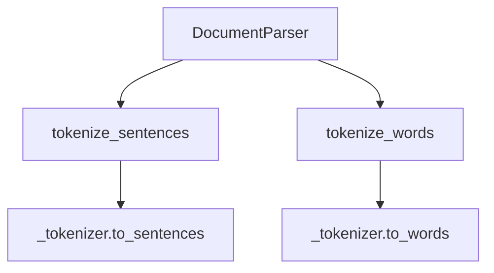

# `parser.py`

## `sumy.parsers.parser.DocumentParser` · *class*

## Summary:
Parses documents into sentences and words using a provided tokenizer.

## Description:
The DocumentParser class serves as an intermediary layer that provides convenient methods for parsing text into sentences and words. It wraps a tokenizer object and exposes simplified interfaces for common parsing operations. This class is designed to work with various tokenizer implementations while providing a consistent interface for sentence and word tokenization.

## State:
- _tokenizer: Tokenizer object used for actual tokenization operations
- SIGNIFICANT_WORDS: Class constant tuple containing Czech words considered significant
- STIGMA_WORDS: Class constant tuple containing Czech words considered as stigma words

## Lifecycle:
- Creation: Instantiate with a tokenizer object
- Usage: Call tokenize_sentences() and tokenize_words() methods as needed
- Destruction: No explicit cleanup required; relies on Python's garbage collection

## Method Map:


## Raises:
- None explicitly raised by __init__
- Exceptions may be raised by the underlying tokenizer's methods

## Example:
```python
# Assuming a tokenizer is available
parser = DocumentParser(tokenizer)
sentences = parser.tokenize_sentences("This is a paragraph. This is another sentence.")
words = parser.tokenize_words("This is a sentence.")
```

### `sumy.parsers.parser.DocumentParser.__init__` · *method*

## Summary:
Initializes a DocumentParser instance with the specified tokenizer for text processing.

## Description:
This constructor method sets up a DocumentParser object by storing the provided tokenizer instance for later use in parsing documents. The tokenizer is responsible for breaking text into tokens (words, sentences, etc.) during the document processing pipeline. This method is part of the document parsing workflow where text needs to be tokenized before further analysis.

## Args:
    tokenizer: An object implementing the expected tokenizer interface. Typically handles text tokenization operations such as sentence splitting and word tokenization. Expected to conform to a standard tokenizer protocol used within the sumy library.

## Returns:
    None: This method does not return a value.

## Raises:
    None: This method does not raise any exceptions.

## State Changes:
    Attributes READ: None
    Attributes WRITTEN: self._tokenizer

## Constraints:
    None: No specific preconditions or constraints are enforced by this method.

## Side Effects:
    None: This method performs no I/O operations or external service calls. It only stores a reference to the provided tokenizer object.

### `sumy.parsers.parser.DocumentParser.tokenize_sentences` · *method*

## Summary:
Splits a paragraph into individual sentences using the parser's tokenizer and filters out empty or whitespace-only sentences.

## Description:
This method takes a text paragraph and breaks it down into individual sentences using the configured tokenizer. It then filters out any empty or whitespace-only sentences to ensure clean output. This method is typically called during the text processing pipeline when preparing raw text for further analysis or summarization.

## Args:
    paragraph (str): The input text paragraph to be tokenized into sentences

## Returns:
    list[str]: A list of non-empty sentences extracted from the paragraph, with leading/trailing whitespace removed

## Raises:
    AttributeError: If self._tokenizer does not have a to_sentences method
    TypeError: If paragraph is not a string type

## State Changes:
    Attributes READ: self._tokenizer
    Attributes WRITTEN: None

## Constraints:
    Preconditions: 
    - self._tokenizer must be initialized and have a to_sentences method
    - paragraph must be a string
    Postconditions:
    - Returns a list of strings containing actual sentences (no empty strings)
    - All returned sentences have leading/trailing whitespace stripped

## Side Effects:
    None

### `sumy.parsers.parser.DocumentParser.tokenize_words` · *method*

## Summary:
Converts a sentence into a list of word tokens using the parser's configured tokenizer.

## Description:
This method takes a sentence string and applies word-level tokenization using the underlying tokenizer instance. It serves as a wrapper around the tokenizer's `to_words` method, providing a consistent interface for word tokenization within the document parsing pipeline. This method is typically called during text preprocessing when individual sentences need to be broken down into their constituent words for further analysis or summarization.

## Args:
    sentence (str): The input sentence to be tokenized into individual words

## Returns:
    list[str]: A list of word tokens extracted from the sentence

## Raises:
    AttributeError: If self._tokenizer does not have a to_words method
    TypeError: If sentence is not a string type

## State Changes:
    Attributes READ: self._tokenizer
    Attributes WRITTEN: None

## Constraints:
    Preconditions: 
    - self._tokenizer must be initialized and have a to_words method
    - sentence must be a string
    Postconditions:
    - Returns a list of word tokens (strings)
    - The returned list contains individual words from the input sentence

## Side Effects:
    None

