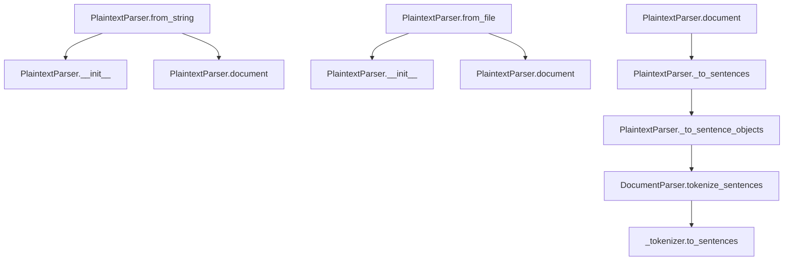

# `plaintext.py`

## `sumy.parsers.plaintext.PlaintextParser` · *class*

## Summary:
Parses plain text documents into structured document objects with support for headings and paragraph organization.

## Description:
The PlaintextParser class converts plain text content into a structured document model suitable for text summarization and analysis. It recognizes uppercase lines as headings and empty lines as paragraph separators, organizing text into paragraphs containing sentences and headings. This parser is particularly useful for processing unstructured text files or string inputs where semantic structure needs to be preserved.

## State:
- _text: str - The raw text content after Unicode conversion and stripping
- _tokenizer: Tokenizer object - Inherited from DocumentParser, used for sentence and word tokenization
- SIGNIFICANT_WORDS: Class constant tuple - Inherited from DocumentParser, contains significant words
- STIGMA_WORDS: Class constant tuple - Inherited from DocumentParser, contains stigma words

## Lifecycle:
- Creation: Instantiate using from_string() or from_file() class methods, or directly with __init__(text, tokenizer)
- Usage: Access the parsed document through the document property, or retrieve significant_words and stigma_words cached properties
- Destruction: No explicit cleanup required; relies on Python's garbage collection

## Method Map:


## Raises:
- UnicodeDecodeError: When reading from file fails due to encoding issues
- AttributeError: If the tokenizer doesn't have required methods
- TypeError: If input text is not a string-like object

## Example:
```python
# Parse from string
from sumy.parsers.plaintext import PlaintextParser
from sumy.nlp.tokenizers import Tokenizer

parser = PlaintextParser.from_string("Hello world.\n\nTHIS IS A HEADING\n\nAnother paragraph.", Tokenizer("english"))
document = parser.document  # Access parsed document structure

# Parse from file
parser = PlaintextParser.from_file("/path/to/text.txt", Tokenizer("english"))
significant_words = parser.significant_words  # Access cached properties
stigma_words = parser.stigma_words
```

### `sumy.parsers.plaintext.PlaintextParser.from_string` · *method*

## Summary:
Creates a new PlaintextParser instance from a text string and tokenizer.

## Description:
A class method that serves as a factory constructor for PlaintextParser objects, enabling instantiation from raw text content rather than file paths. This method provides a clean interface for creating parser instances when text is already available in memory, supporting the factory pattern for document parsing workflows.

## Args:
    string (str): Text content to parse, which will be converted to Unicode and stripped of leading/trailing whitespace
    tokenizer (Tokenizer): Tokenizer instance used for sentence and word tokenization operations

## Returns:
    PlaintextParser: A new instance of PlaintextParser initialized with the provided text and tokenizer

## Raises:
    UnicodeDecodeError: When the input string contains bytes that cannot be decoded using UTF-8 encoding
    Exception: Any exception that might occur during the Unicode conversion process in to_unicode

## State Changes:
    Attributes READ: None
    Attributes WRITTEN: 
    - self._text: Set to the Unicode-converted and stripped version of the input string
    - self._tokenizer: Set to the provided tokenizer instance

## Constraints:
    Preconditions:
    - The string parameter must be a valid Python object that can be processed by to_unicode
    - The tokenizer parameter must be a valid tokenizer instance compatible with DocumentParser
    
    Postconditions:
    - Returns a properly initialized PlaintextParser instance
    - The internal text storage (self._text) contains the Unicode-converted and stripped input string

## Side Effects:
    None

### `sumy.parsers.plaintext.PlaintextParser.from_file` · *method*

## Summary:
Creates a new PlaintextParser instance by reading text from a file and initializing it with the provided tokenizer.

## Description:
This class method implements a factory pattern for creating PlaintextParser instances from file content. It reads the entire contents of a UTF-8 encoded file and uses the content along with the provided tokenizer to initialize a new parser instance. This approach allows for easy creation of parsers from file sources without manually opening files or handling encoding.

The method is particularly useful in document processing pipelines where text needs to be parsed from external files rather than being provided as a string directly. It follows the same initialization pattern as the regular constructor but abstracts away the file I/O operation.

## Args:
    file_path (str): Absolute or relative path to the text file to be parsed
    tokenizer: Tokenizer object used for parsing sentences and words from the text

## Returns:
    PlaintextParser: A new instance of PlaintextParser initialized with the file content and tokenizer

## Raises:
    FileNotFoundError: If the specified file_path does not exist or cannot be accessed
    UnicodeDecodeError: If the file cannot be decoded using UTF-8 encoding

## State Changes:
    Attributes READ: None
    Attributes WRITTEN: None (creates new instance, doesn't modify existing object state)

## Constraints:
    Preconditions:
        - file_path must point to an existing, readable file
        - tokenizer must be a valid tokenizer object compatible with DocumentParser
    Postconditions:
        - Returns a properly initialized PlaintextParser instance
        - The returned instance's internal text representation contains the file content
        - The returned instance's tokenizer is set to the provided tokenizer

## Side Effects:
    - Performs file I/O operation to read the specified file
    - May raise file system related exceptions if file access fails

### `sumy.parsers.plaintext.PlaintextParser.__init__` · *method*

## Summary:
Initializes a PlaintextParser instance by setting up the tokenizer inheritance and processing the input text into a Unicode string with leading/trailing whitespace removed.

## Description:
This constructor method establishes the foundational state for a PlaintextParser object. It properly initializes the parent DocumentParser class with the provided tokenizer and processes the input text through the compatibility layer to ensure Unicode representation while removing extraneous whitespace. This method serves as the entry point for creating parser instances from raw text content.

## Args:
    text (str, bytes, or any object convertible to Unicode): The plain text content to be parsed. Can be a string, bytes object, or any other object that can be converted to Unicode using the compatibility layer.
    tokenizer (Tokenizer): A tokenizer instance that will be inherited from DocumentParser and used for sentence and word tokenization operations.

## Returns:
    None: This method initializes the object's state and does not return any value.

## Raises:
    UnicodeDecodeError: When the text bytes cannot be decoded using UTF-8 encoding during the to_unicode conversion process.
    AttributeError: When the tokenizer object lacks required methods expected by the parent DocumentParser class.
    Exception: Any exception that might occur during the to_unicode conversion process in instance_to_unicode.

## State Changes:
    Attributes READ: None
    Attributes WRITTEN: 
    - self._text: Stores the processed Unicode string with stripped whitespace
    - self._tokenizer: Inherited from DocumentParser parent class (set via super().__init__(tokenizer))

## Constraints:
    Preconditions:
    - The text parameter must be convertible to a Unicode string representation
    - The tokenizer parameter must be a valid Tokenizer instance compatible with DocumentParser
    - The method should be called only during object instantiation

    Postconditions:
    - The object's _text attribute contains a Unicode string with leading/trailing whitespace removed
    - The object's tokenizer is properly initialized through inheritance from DocumentParser
    - The object is ready for subsequent document parsing operations

## Side Effects:
    None: This method performs no I/O operations or external service calls. It only manipulates internal object state.

### `sumy.parsers.plaintext.PlaintextParser.significant_words` · *method*

## Summary:
Extracts significant words from document headings or returns a fallback set of significant words.

## Description:
This method collects all words from heading sentences within the document's paragraphs and returns them as a tuple. If no heading words are found, it returns the class constant SIGNIFICANT_WORDS which contains a default set of significant words.

The method is designed to provide access to important keywords or phrases that appear in document headings, which often represent key topics or sections. This functionality is particularly useful for document summarization or keyword extraction where heading content is especially valuable.

## Args:
    None

## Returns:
    tuple[str]: A tuple of significant words extracted from heading sentences, or the class constant SIGNIFICANT_WORDS if no heading words are found.

## Raises:
    None explicitly raised

## State Changes:
    Attributes READ: 
    - self.document (ObjectDocumentModel)
    - self.SIGNIFICANT_WORDS (class constant)
    
    Attributes WRITTEN: 
    - None

## Constraints:
    Preconditions:
    - self.document must be initialized and contain paragraphs
    - Each paragraph in self.document.paragraphs must have a valid headings property
    - Each heading in paragraph.headings must have a valid words property
    
    Postconditions:
    - Returns either a tuple of words from headings or the predefined SIGNIFICANT_WORDS constant
    - The returned tuple is immutable (due to tuple conversion)

## Side Effects:
    None

### `sumy.parsers.plaintext.PlaintextParser.stigma_words` · *method*

## Summary:
Returns the collection of Czech words considered as stigma words for document processing.

## Description:
This method provides access to the predefined set of Czech words classified as stigma words, which are typically excluded from text summarization or analysis due to their neutral or less informative nature. The method is implemented as a cached property to avoid repeated access to the class constant.

## Args:
    None

## Returns:
    tuple[str]: A tuple containing Czech words classified as stigma words, typically used for filtering in text processing pipelines.

## Raises:
    None

## State Changes:
    Attributes READ: self.STIGMA_WORDS
    Attributes WRITTEN: None

## Constraints:
    Preconditions:
    - The class must inherit from DocumentParser which defines STIGMA_WORDS
    - The STIGMA_WORDS constant must be properly initialized as a tuple of strings
    
    Postconditions:
    - Returns a tuple of strings representing stigma words
    - The returned tuple is immutable and should not be modified

## Side Effects:
    None

### `sumy.parsers.plaintext.PlaintextParser.document` · *method*

## Summary:
Converts plain text into a structured document model with paragraphs, sentences, and headings.

## Description:
Processes the internal text representation line-by-line to construct a hierarchical document structure. Identifies uppercase lines as headings, empty lines as paragraph separators, and normal text lines as content. This method is the core parsing logic that transforms raw plaintext into a structured document model suitable for further analysis and summarization.

The method is implemented as a cached property in the PlaintextParser class, ensuring that the document structure is computed only once and then reused for subsequent accesses. This approach optimizes performance for repeated access patterns common in document processing workflows.

## Args:
    None: This is a method without parameters beyond `self`.

## Returns:
    ObjectDocumentModel: A structured document model containing paragraphs with properly categorized sentences and headings.

## Raises:
    None explicitly raised by this method.
    However, underlying exceptions from tokenizer operations or internal processing may propagate up.

## State Changes:
    Attributes READ:
    - self._text: The raw text content to be parsed
    - self._tokenizer: The tokenizer used for sentence creation
    - self._to_sentences: Helper method for converting text lines to sentences
    Attributes WRITTEN: None

## Constraints:
    Preconditions:
    - The parser must have been initialized with valid text and tokenizer
    - The internal `_text` attribute must be properly set and stripped
    - The `_tokenizer` must be a valid tokenizer object capable of sentence tokenization
    Postconditions:
    - Returns a fully constructed ObjectDocumentModel with proper paragraph structure
    - All text lines are appropriately categorized as headings, content, or paragraph separators
    - The returned document model contains valid Paragraph and Sentence objects

## Side Effects:
    None: This method performs no I/O operations or external service calls. It only processes internal data structures and returns a constructed document model.

### `sumy.parsers.plaintext.PlaintextParser._to_sentences` · *method*

## Summary:
Converts a list of text lines and Sentence objects into a list of Sentence objects by processing mixed content types.

## Description:
Processes a sequence of lines that may contain either pre-existing Sentence objects or raw text strings. When encountering a Sentence object, it flushes accumulated text and appends the existing sentence. When encountering text strings, it accumulates them into larger text blocks that are later converted to sentences. This method enables the parser to handle mixed content types during document construction, particularly when building paragraphs from text lines.

This method is called during the document parsing process in the `document` property of the PlaintextParser class, specifically when processing paragraph content that may contain both pre-parsed sentences and raw text lines.

## Args:
    lines (list): A list containing either Sentence objects or string lines to be processed

## Returns:
    list[Sentence]: A list of Sentence objects constructed from the input lines

## Raises:
    None explicitly raised

## State Changes:
    Attributes READ: 
    - self._to_sentence_objects: Called to convert accumulated text into Sentence objects
    Attributes WRITTEN: None

## Constraints:
    Preconditions:
    - Input lines should be a list of strings or Sentence objects
    - The parser must have a valid tokenizer available for Sentence construction
    Postconditions:
    - All input lines are converted to Sentence objects in the returned list
    - Sentence objects are properly initialized with the parser's tokenizer

## Side Effects:
    None: This method performs no I/O operations or external service calls. It only processes internal data structures.

### `sumy.parsers.plaintext.PlaintextParser._to_sentence_objects` · *method*

## Summary:
Converts a text paragraph into a generator of Sentence objects using the parser's tokenizer.

## Description:
Transforms raw text into structured Sentence objects by first tokenizing the text into individual sentences and then wrapping each sentence with a Sentence class instance. This method serves as a bridge between raw text processing and the document object model, enabling downstream operations to work with rich sentence representations rather than plain strings.

The method is called during document parsing operations when converting text segments into structured sentence objects that can be analyzed or summarized. It's specifically used in the PlaintextParser's document creation pipeline, particularly in the `_to_sentences` method which processes paragraph-level text.

## Args:
    text (str): The input text paragraph to be converted into sentence objects

## Returns:
    generator[Sentence]: A generator yielding Sentence objects constructed from individual sentences in the input text

## Raises:
    AttributeError: If self._tokenizer does not have a to_sentences method (inherited from DocumentParser.tokenize_sentences)
    TypeError: If text is not a string type (inherited from DocumentParser.tokenize_sentences)

## State Changes:
    Attributes READ: 
    - self._tokenizer: Used for creating Sentence objects
    - self.tokenize_sentences: Called to split text into sentences
    Attributes WRITTEN: None

## Constraints:
    Preconditions:
    - self._tokenizer must be initialized and have a to_sentences method
    - text must be a string
    Postconditions:
    - Returns a generator of Sentence objects
    - Each Sentence object contains the original sentence text and is properly initialized with the tokenizer

## Side Effects:
    None: This method performs no I/O operations or external service calls. It only creates internal Sentence objects.

