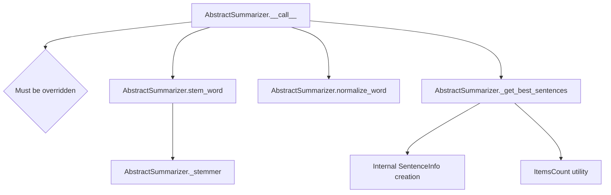

# `_summarizer.py`

## `sumy.summarizers._summarizer.AbstractSummarizer` · *class*

## Summary:
Abstract base class defining the interface and common utilities for text summarization algorithms.

## Description:
The AbstractSummarizer serves as the foundation for all concrete summarizer implementations in the sumy library. It provides shared functionality for text processing, including word stemming and normalization, while defining the contract that all concrete summarizer subclasses must implement through the __call__ method.

This class is designed to be inherited by specific summarization algorithms such as TextRank, LSA, or LexRank. It ensures consistent handling of text preprocessing and provides utility methods that are commonly needed across different summarization approaches.

## State:
- _stemmer: callable object used for stemming words; must be callable, defaults to null_stemmer
- The class maintains no other instance state beyond the stemmer

## Lifecycle:
- Creation: Instantiate with an optional callable stemmer parameter (defaults to null_stemmer)
- Usage: Call instances with (document, sentences_count) arguments to generate summaries
- Destruction: No special cleanup required; uses standard Python garbage collection

## Method Map:


## Raises:
- ValueError: Raised during initialization when the stemmer parameter is not callable

## Example:
```python
# Basic instantiation
summarizer = AbstractSummarizer()  # Uses default null_stemmer

# Custom stemmer usage
from nlp.stemmers import porter_stemmer
custom_summarizer = AbstractSummarizer(stemmer=porter_stemmer)

# Note: Direct instantiation would raise NotImplementedError when calling
# the __call__ method, as it's meant to be subclassed
```

### `sumy.summarizers._summarizer.AbstractSummarizer.__init__` · *method*

## Summary:
Initializes the abstract summarizer with a stemmer for text processing.

## Description:
Configures the summarizer instance with a stemmer function that will be used for text normalization during the summarization process. This method validates that the provided stemmer is callable before storing it as an instance attribute.

## Args:
    stemmer (callable): A callable object that performs stemming operations on text tokens. Defaults to null_stemmer from nlp.stemmers module.

## Returns:
    None: This method does not return any value.

## Raises:
    ValueError: Raised when the provided stemmer argument is not callable.

## State Changes:
    Attributes READ: None
    Attributes WRITTEN: self._stemmer

## Constraints:
    Preconditions: The stemmer parameter must be a callable object that accepts text tokens and returns stemmed versions.
    Postconditions: The instance will have its _stemmer attribute set to the provided callable stemmer.

## Side Effects:
    None: This method performs no I/O operations or external service calls.

### `sumy.summarizers._summarizer.AbstractSummarizer.__call__` · *method*

## Summary:
Abstract method implementing the core summarization algorithm that processes documents and returns sentence-based summaries.

## Description:
This abstract method serves as the primary interface for all summarizer implementations. As a callable method (due to the `__call__` magic method), it enables instances of concrete summarizer classes to be invoked directly with a document and sentence count. Subclasses must override this method to implement specific summarization strategies. The method processes the input document and returns a tuple of sentences that form the summary, typically ordered by importance or relevance.

## Args:
    document (Document): The input document to be summarized, containing sentences and associated metadata
    sentences_count (int or str): The target number of sentences for the summary. Can be an integer count or percentage string (e.g., "50%")

## Returns:
    tuple[Sentences]: A tuple of sentences selected from the input document to form the summary, ordered by the summarization algorithm's ranking criteria

## Raises:
    NotImplementedError: Raised by the base implementation to enforce that subclasses must provide their own implementation

## State Changes:
    Attributes READ: None
    Attributes WRITTEN: None

## Constraints:
    Preconditions:
    - The document parameter must be a valid Document object
    - The sentences_count parameter must be a positive integer or valid percentage string format
    - Subclasses must implement this method with their specific summarization algorithm
    
    Postconditions:
    - The returned sentences are from the original document
    - The sentences are ordered according to the summarization algorithm's importance scoring

## Side Effects:
    None

### `sumy.summarizers._summarizer.AbstractSummarizer.stem_word` · *method*

## Summary:
Applies stemming to a normalized word using the instance's stemmer.

## Description:
Normalizes the input word by converting it to Unicode and lowercasing it, then applies the instance's stemmer to produce a stemmed version of the word. This method serves as a standardized interface for word stemming throughout the summarization pipeline, ensuring consistent preprocessing of words before they are used in analysis or comparison operations.

## Args:
    word (Any): The input word to be stemmed. Can be of any type that is compatible with both the normalize_word utility and the instance's stemmer.

## Returns:
    str: The stemmed version of the normalized input word as produced by the instance's stemmer.

## Raises:
    None explicitly raised by this method, but may propagate exceptions from the underlying stemmer or normalize_word functions if they encounter incompatible input types.

## State Changes:
    Attributes READ: self._stemmer, self.normalize_word
    Attributes WRITTEN: None - this method doesn't modify object state

## Constraints:
    Preconditions: The instance must have a valid stemmer callable assigned to self._stemmer (this is enforced in __init__)
    Postconditions: The returned value is the result of applying the stemmer to the normalized input word

## Side Effects:
    None - this method has no side effects beyond the standard string operations and function calls

### `sumy.summarizers._summarizer.AbstractSummarizer.normalize_word` · *method*

## Summary:
Normalizes a word by converting it to Unicode and lowercasing it.

## Description:
This utility function processes a word by first converting it to Unicode representation using the to_unicode helper function, then converts it to lowercase for consistent text processing. It is typically used during text preprocessing steps in summarization algorithms to ensure uniform word representation regardless of input formatting.

## Args:
    word (Any): The input word to normalize. Can be of any type that can be processed by to_unicode.

## Returns:
    str: The normalized word as a Unicode string in lowercase.

## Raises:
    None explicitly raised, but may raise exceptions from to_unicode() if input is incompatible.

## State Changes:
    None - this is a pure function that doesn't modify any object state.

## Constraints:
    Preconditions: The input word should be compatible with the to_unicode function.
    Postconditions: The returned value is always a lowercase Unicode string.

## Side Effects:
    None - this function has no side effects beyond the standard string operations.

### `sumy.summarizers._summarizer.AbstractSummarizer._get_best_sentences` · *method*

## Summary:
Selects the highest-rated sentences from a collection based on a rating function or dictionary.

## Description:
This static method filters and ranks sentences according to their ratings, returning the top-ranked sentences in their original order. It serves as a utility for summarization algorithms to extract the most important sentences based on various scoring mechanisms. The method handles both callable rating functions and dictionary-based ratings.

## Args:
    sentences (iterable): Collection of sentences to rank and select from
    count (int, str, or callable): Number of sentences to return, can be an integer, percentage string (e.g., "50%"), or callable
    rating (callable or dict): Function that rates sentences or dictionary mapping sentences to ratings
    *args: Additional positional arguments passed to the rating function
    **kwargs: Additional keyword arguments passed to the rating function

## Returns:
    tuple: A tuple of selected sentences ordered by their original position in the input

## Raises:
    AssertionError: When rating is a dict and additional args/kwargs are provided
    ValueError: When ItemsCount encounters unsupported value types

## State Changes:
    None

## Constraints:
    Preconditions:
        - Sentences must be iterable
        - Rating must be either a callable function or dictionary
        - If rating is a dictionary, no additional args or kwargs can be provided
        - Count must be a valid value for ItemsCount constructor
    
    Postconditions:
        - Returns exactly the requested number of sentences (or fewer if insufficient input)
        - Sentences in result maintain their original relative ordering
        - Result is always a tuple

## Side Effects:
    None

## Implementation Details:
    - Uses SentenceInfo namedtuple with fields: sentence, order, and rating
    - Sorts sentences by rating in descending order first
    - Applies count limitation using ItemsCount
    - Re-sorts results by original order to maintain document structure

