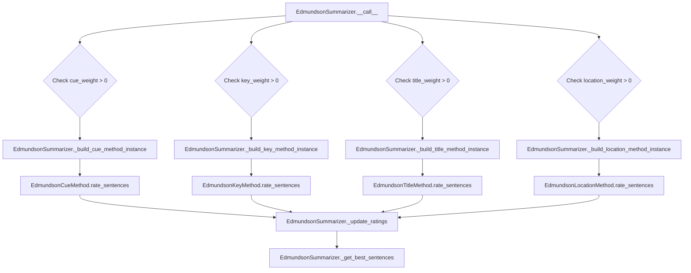

# `edmundson.py`

## `sumy.summarizers.edmundson.EdmundsonSummarizer` · *class*

## Summary:
EdmundsonSummarizer is a text summarization algorithm that combines multiple Edmundson-based scoring methods (cue, key, title, location) to rank sentences for summarization.

## Description:
The EdmundsonSummarizer implements a multi-criteria approach to text summarization by combining four different Edmundson-based methods: cue words, key words, title words, and location-based scoring. It allows users to configure weights for each method to control their influence on the final sentence rankings. This class is designed to be instantiated with specific word sets and weights, then called with a document and desired sentence count to generate a summary.

The summarizer supports four distinct scoring methods:
1. Cue method: Rates sentences based on bonus and stigma words
2. Key method: Rates sentences based on significant words identified from bonus words
3. Title method: Rates sentences based on words from document headings
4. Location method: Rates sentences based on their position in paragraphs and documents

## State:
- _bonus_words: frozenset of stemmed bonus words used for cue and key methods; initially empty
- _stigma_words: frozenset of stemmed stigma words used for cue method; initially empty  
- _null_words: frozenset of stemmed null words used for title and location methods; initially empty
- _cue_weight: float value representing the weight applied to cue method scores; defaults to 1.0
- _key_weight: float value representing the weight applied to key method scores; defaults to 0.0
- _title_weight: float value representing the weight applied to title method scores; defaults to 1.0
- _location_weight: float value representing the weight applied to location method scores; defaults to 1.0
- _stemmer: callable object used for stemming words; inherited from AbstractSummarizer

## Lifecycle:
- Creation: Instantiate with optional stemmer and weight parameters; bonus_words, stigma_words, and null_words must be set before calling methods that require them
- Usage: Call the instance with (document, sentences_count) to generate a summary, or call individual methods like cue_method(), key_method(), etc.
- Destruction: No special cleanup required; uses standard Python garbage collection

## Method Map:


## Raises:
- ValueError: Raised during __init__ when any weight parameter is negative, or when bonus_words, stigma_words, or null_words are empty and required by methods
- ValueError: Raised by key_method() when bonus_words haven't been set before calling
- ValueError: Raised by individual method builders (__check_*_words) when required word sets are empty

## Example:
```python
from sumy.summarizers.edmundson import EdmundsonSummarizer
from sumy.nlp.stemmers import null_stemmer

# Create summarizer with custom weights
summarizer = EdmundsonSummarizer(
    stemmer=null_stemmer,
    cue_weight=1.0,
    key_weight=0.5,
    title_weight=1.0,
    location_weight=0.8
)

# Set required word collections
summarizer.bonus_words = ["important", "significant", "crucial"]
summarizer.stigma_words = ["avoid", "discourage", "unwanted"]
summarizer.null_words = ["the", "and", "or"]

# Generate summary using main interface
summary = summarizer(document, 3)

# Or generate summary using specific methods
cue_summary = summarizer.cue_method(document, 3)
key_summary = summarizer.key_method(document, 3, weight=0.7)
title_summary = summarizer.title_method(document, 3)
location_summary = summarizer.location_method(document, 3, w_h=2.0, w_p1=1.5)
```

### `sumy.summarizers.edmundson.EdmundsonSummarizer.__init__` · *method*

## Summary:
Initializes an EdmundsonSummarizer instance with configurable weights for different Edmundson-based scoring methods and validates the weight parameters.

## Description:
The __init__ method constructs an EdmundsonSummarizer object by setting up the stemmer inheritance from the parent class and configuring the relative importance weights for four different Edmundson-based scoring methods: cue words, key words, title words, and location-based scoring. This method ensures that all weight parameters are non-negative values through validation before storing them as instance attributes.

The EdmundsonSummarizer combines multiple text analysis approaches to rank sentences for summarization. Each weight controls how much influence its respective method has in determining sentence scores. The method is separated from the main initialization logic to provide clear validation and encapsulation of weight management concerns.

## Args:
    stemmer (callable, optional): Stemming function to normalize words. Defaults to null_stemmer from nlp.stemmers.
    cue_weight (float, optional): Weight for cue word scoring method. Must be non-negative. Defaults to 1.0.
    key_weight (float, optional): Weight for key word scoring method. Must be non-negative. Defaults to 0.0.
    title_weight (float, optional): Weight for title word scoring method. Must be non-negative. Defaults to 1.0.
    location_weight (float, optional): Weight for location-based scoring method. Must be non-negative. Defaults to 1.0.

## Returns:
    None: This method initializes the instance but does not return any value.

## Raises:
    ValueError: Raised when any of the weight parameters (cue_weight, key_weight, title_weight, location_weight) is negative.

## State Changes:
    Attributes READ: None
    Attributes WRITTEN: 
    - self._cue_weight: stores the normalized float value of cue_weight
    - self._key_weight: stores the normalized float value of key_weight  
    - self._title_weight: stores the normalized float value of title_weight
    - self._location_weight: stores the normalized float value of location_weight

## Constraints:
    Preconditions:
    - All weight parameters must be numeric values
    - All weight parameters must be greater than or equal to zero
    - The stemmer parameter must be callable (validated by parent class)

    Postconditions:
    - Instance is properly initialized with validated weight values
    - All weight attributes are stored as float values
    - Parent class initialization is completed successfully

## Side Effects:
    None: This method performs only initialization and validation, with no external I/O or service calls.

### `sumy.summarizers.edmundson.EdmundsonSummarizer._ensure_correct_weights` · *method*

## Summary:
Validates that all provided weight values are non-negative, raising an error if any are negative.

## Description:
This private validation method ensures that all weight parameters passed to the EdmundsonSummarizer are non-negative values. It is called during object initialization to validate the initial weight settings and can also be used by other internal methods to validate weight parameters. The method prevents invalid negative weights from being set, which would cause unexpected behavior in the summarization process.

## Args:
    *weights (float): Variable number of weight values to validate. All weights must be non-negative numbers.

## Returns:
    None: This method does not return any value.

## Raises:
    ValueError: Raised when any of the provided weight values is less than 0.0.

## State Changes:
    Attributes READ: None
    Attributes WRITTEN: None

## Constraints:
    Preconditions: 
    - All arguments must be numeric values
    - No argument can be a negative number
    
    Postconditions:
    - All validated weights remain unchanged
    - Method completes without raising an exception if all weights are valid

## Side Effects:
    None: This method performs only validation and does not cause any I/O operations or external service calls.

### `sumy.summarizers.edmundson.EdmundsonSummarizer.bonus_words` · *method*

## Summary:
Sets the collection of bonus words for the Edmundson summarization algorithm by applying stemming to each word in the input collection.

## Description:
Configures the bonus words that will be used to enhance sentence scoring in the Edmundson summarization approach. This property setter processes the input collection by applying the instance's stemmer to each word and stores the result as an immutable frozenset for efficient lookup during summarization.

## Args:
    collection (Iterable): A collection of words (strings or other hashable types) to be used as bonus words in the summarization process.

## Returns:
    None: This method does not return a value.

## Raises:
    None explicitly raised by this method, but may propagate exceptions from the underlying stemmer or normalize_word functions if the input contains incompatible types.

## State Changes:
    Attributes READ: self.stem_word
    Attributes WRITTEN: self._bonus_words

## Constraints:
    Preconditions: The instance must have a valid stemmer callable assigned to self._stemmer (inherited from AbstractSummarizer)
    Postconditions: The _bonus_words attribute is updated to contain a frozenset of stemmed versions of all words in the input collection

## Side Effects:
    None - this method has no side effects beyond modifying the internal _bonus_words attribute

### `sumy.summarizers.edmundson.EdmundsonSummarizer.stigma_words` · *method*

## Summary:
Sets the stigma words for sentence scoring by applying stemming to the input collection and storing the result as an immutable frozenset.

## Description:
Configures the stigma words used by the Edmundson summarization algorithm to penalize sentences containing these terms. This method is invoked when setting the stigma_words property and transforms the input collection of words into their stemmed forms for consistent matching during sentence rating calculations.

## Args:
    collection (Iterable): A collection of words (strings or other hashable types) that should be treated as stigma words. These words will reduce the score of sentences containing them.

## Returns:
    None: This method does not return a value.

## Raises:
    None explicitly raised by this method, but may propagate exceptions from:
    - self.stem_word if the collection contains incompatible types
    - frozenset constructor if the collection contains unhashable elements

## State Changes:
    Attributes READ: self.stem_word
    Attributes WRITTEN: self._stigma_words

## Constraints:
    Preconditions: The EdmundsonSummarizer instance must have a valid stemmer configured (inherited from AbstractSummarizer)
    Postconditions: self._stigma_words is set to a frozenset containing the stemmed versions of all words in the input collection

## Side Effects:
    None: This method performs no I/O operations or external service calls. It only modifies the internal state of the object.

### `sumy.summarizers.edmundson.EdmundsonSummarizer.null_words` · *method*

## Summary:
Sets the collection of null words for the Edmundson summarizer by stemming each word in the input collection and storing them as an immutable frozenset.

## Description:
This method configures the null words used by the Edmundson summarization algorithm. Null words are terms that should be penalized or discounted when scoring sentences for inclusion in the summary. The method processes the input collection by applying the instance's stem_word method to each element, then stores the resulting stemmed words as a frozenset in the internal _null_words attribute.

This setter method is part of the EdmundsonSummarizer's configuration interface, allowing users to define which words should be treated as null words in the summarization process. The method follows the same pattern as the bonus_words and stigma_words setters, ensuring consistency in how these word collections are managed.

## Args:
    collection (Iterable): A collection of words or terms to be configured as null words. Each element in the collection will be processed through the instance's stem_word method.

## Returns:
    None: This method does not return a value.

## Raises:
    None explicitly raised by this method, but may propagate exceptions from the stem_word method or frozenset constructor if the input collection contains incompatible elements.

## State Changes:
    Attributes READ: self.stem_word
    Attributes WRITTEN: self._null_words

## Constraints:
    Preconditions: The instance must have a valid stemmer callable assigned to self._stemmer (inherited from AbstractSummarizer)
    Postconditions: The self._null_words attribute will contain a frozenset of stemmed versions of all items in the input collection

## Side Effects:
    None - this method has no side effects beyond modifying the internal state of the object

### `sumy.summarizers.edmundson.EdmundsonSummarizer.__call__` · *method*

## Summary:
Rates sentences using weighted Edmundson methods and returns the highest-rated sentences from a document.

## Description:
This method implements the core summarization logic of the EdmundsonSummarizer by applying multiple weighting strategies (cue, key, title, and location) to rate sentences in a document. It dynamically activates each method based on its configured weight and aggregates the resulting ratings to determine the most important sentences.

The method processes the document by:
1. Initializing an empty rating dictionary
2. For each enabled weighting method (where weight > 0.0), building the appropriate method instance via helper methods and collecting sentence ratings
3. Combining all ratings through summation
4. Selecting the best sentences based on aggregated ratings using the parent class's _get_best_sentences method

This method serves as the primary interface for generating summaries using the Edmundson approach and is called as an instance method (via `__call__`).

## Args:
    document: Document object containing sentences to summarize
    sentences_count: Integer count or percentage string specifying how many sentences to return

## Returns:
    tuple: A tuple of the highest-rated sentences from the document, ordered by their appearance in the original document

## Raises:
    ValueError: When any of the weighting methods require bonus/stigma/null words but they haven't been set, or when negative weights are provided during initialization

## State Changes:
    Attributes READ: 
        - self._cue_weight
        - self._key_weight  
        - self._title_weight
        - self._location_weight
        - self._stemmer
        - self._bonus_words
        - self._stigma_words
        - self._null_words

    Attributes WRITTEN: None

## Constraints:
    Preconditions:
        - Document must contain sentences to rate
        - All required word sets (bonus_words, stigma_words, null_words) must be properly initialized for their respective methods
        - Weight values must be non-negative (validated in __init__)

    Postconditions:
        - Returns exactly the requested number of sentences (or fewer if insufficient)
        - Sentences in result maintain their original relative ordering
        - All activated weighting methods are applied consistently
        - Ratings are properly aggregated through summation

## Side Effects:
    None

### `sumy.summarizers.edmundson.EdmundsonSummarizer._update_ratings` · *method*

## Summary:
Accumulates new sentence ratings by adding them to existing ratings in-place.

## Description:
Updates a dictionary of sentence ratings by adding corresponding ratings from a new set of ratings. This method is used internally by the EdmundsonSummarizer to combine scores from multiple weighting methods (cue, key, title, location) into a single cumulative rating for each sentence.

The method modifies the existing ratings dictionary in-place and returns it, making it suitable for chaining operations. It ensures consistency by asserting that either both dictionaries are empty or have the same number of sentences.

## Args:
    ratings (defaultdict(int)): Dictionary mapping sentences to their accumulated ratings
    new_ratings (dict): Dictionary mapping sentences to new ratings to be added

## Returns:
    defaultdict(int): The updated ratings dictionary with new ratings added to existing ones

## Raises:
    AssertionError: When len(ratings) != 0 and len(ratings) != len(new_ratings), indicating inconsistent dictionary sizes

## State Changes:
    Attributes READ: None
    Attributes WRITTEN: None

## Constraints:
    Preconditions:
        - Both ratings and new_ratings must be dictionaries
        - Either both dictionaries are empty or they contain the same number of sentences
        - Ratings should be initialized as defaultdict(int) to handle missing keys gracefully
    
    Postconditions:
        - All sentences in new_ratings will have their ratings added to ratings
        - Sentences not present in new_ratings will retain their original ratings
        - The returned dictionary is the same object as the ratings parameter

## Side Effects:
    None

### `sumy.summarizers.edmundson.EdmundsonSummarizer.cue_method` · *method*

## Summary:
Applies cue-based sentence scoring to rank sentences for summarization.

## Description:
This method implements the cue-based summarization approach by creating a configured EdmundsonCueMethod instance and applying it to rank sentences in the document. It uses bonus and stigma words to assign scores to sentences based on the presence of cue words.

## Args:
    document: The input document containing sentences to be summarized
    sentences_count: Number of top-ranked sentences to return, or a callable filter
    bonus_word_value (float): Weight multiplier for bonus words (default: 1.0)
    stigma_word_value (float): Weight multiplier for stigma words (default: 1.0)

## Returns:
    tuple: A tuple of the top-ranked sentences based on cue-based scoring

## Raises:
    ValueError: When bonus_words or stigma_words are not set (via __check_bonus_words and __check_stigma_words)

## State Changes:
    Attributes READ: self._bonus_words, self._stigma_words
    Attributes WRITTEN: None

## Constraints:
    Preconditions:
    - bonus_words must be set (not empty) via the bonus_words property
    - stigma_words must be set (not empty) via the stigma_words property
    
    Postconditions:
    - Returns a tuple of sentences ranked by cue-based scoring
    - The ranking considers both bonus and stigma word frequencies with provided weights

## Side Effects:
    None

### `sumy.summarizers.edmundson.EdmundsonSummarizer._build_cue_method_instance` · *method*

## Summary:
Creates and returns a configured EdmundsonCueMethod instance for cue-based sentence scoring.

## Description:
This method constructs an EdmundsonCueMethod instance using the summarizer's stemmer and word sets. It ensures that bonus and stigma words are properly initialized before creating the method instance. This method is used internally by the Edmundson summarization algorithm to apply cue-based weighting to sentences.

## Args:
    None

## Returns:
    EdmundsonCueMethod: A configured cue method instance ready for sentence rating

## Raises:
    ValueError: When bonus_words or stigma_words are empty (via __check_bonus_words and __check_stigma_words)

## State Changes:
    Attributes READ: self._stemmer, self._bonus_words, self._stigma_words
    Attributes WRITTEN: None

## Constraints:
    Preconditions: 
    - bonus_words must be set (not empty) 
    - stigma_words must be set (not empty)
    - These are validated by calling __check_bonus_words() and __check_stigma_words()

    Postconditions:
    - Returns a valid EdmundsonCueMethod instance
    - The returned instance is configured with current stemmer and word sets

## Side Effects:
    None

### `sumy.summarizers.edmundson.EdmundsonSummarizer.key_method` · *method*

## Summary:
Ranks sentences based on key word frequency and returns the specified number of top-ranked sentences.

## Description:
This method applies the Edmundson key word method to rate sentences in a document based on the frequency of significant words (bonus words) and returns the highest-rated sentences. It first builds a key method instance using the summarizer's configured stemmer and bonus words, then applies the ranking algorithm with the specified weight parameter.

The method supports flexible sentence count specifications including integer counts, percentage strings (e.g., "50%"), or callable predicates for filtering sentences. It integrates with the broader Edmundson summarization framework where key words are used to identify important sentences.

This method is called internally by the main `__call__` method when the key weight is greater than zero, and can also be invoked directly for standalone key-based summarization.

## Args:
    document: Document object containing sentences to be ranked and summarized
    sentences_count: Integer count, percentage string (e.g., "50%"), or callable predicate specifying how many sentences to return
    weight (float): Weight threshold for determining significant words (default: 0.5)

## Returns:
    tuple: A tuple of sentences ordered by their original position in the document, representing the top-ranked sentences based on key word frequency

## Raises:
    ValueError: When bonus words have not been set via the `bonus_words` property before calling this method

## State Changes:
    Attributes READ: 
    - self._bonus_words
    - self._stemmer
    
    Attributes WRITTEN: 
    - None

## Constraints:
    Preconditions:
    - Bonus words must be set via the `bonus_words` property before calling this method
    - The document must contain sentences to process
    - Weight parameter should be a non-negative numeric value
    
    Postconditions:
    - Returns exactly the requested number of sentences (or fewer if insufficient)
    - Sentences in result maintain their original relative ordering
    - All sentences are properly ranked based on key word frequency

## Side Effects:
    None

### `sumy.summarizers.edmundson.EdmundsonSummarizer._build_key_method_instance` · *method*

## Summary:
Creates and returns an EdmundsonKeyMethod instance configured with the summarizer's stemmer and bonus words.

## Description:
This method constructs an EdmundsonKeyMethod instance that can be used to rate sentences based on key word frequency. It first validates that bonus words have been set via the `__check_bonus_words()` method, then creates and returns a new EdmundsonKeyMethod instance initialized with the summarizer's stemmer and bonus words collection.

The method is called internally by the main `__call__` method when the key weight is greater than zero, and also by the public `key_method` method to build the appropriate scoring mechanism.

## Args:
    None

## Returns:
    EdmundsonKeyMethod: A configured instance of the key method class that can rate sentences based on significant words.

## Raises:
    ValueError: When bonus words have not been set (via `bonus_words` property setter) and `__check_bonus_words()` validation fails.

## State Changes:
    Attributes READ: 
    - self._bonus_words
    - self._stemmer
    
    Attributes WRITTEN: 
    - None

## Constraints:
    Preconditions:
    - Bonus words must be set via the `bonus_words` property before calling this method
    - The summarizer instance must have a valid stemmer configured
    
    Postconditions:
    - Returns a properly initialized EdmundsonKeyMethod instance
    - The returned instance is ready to be used for sentence rating operations

## Side Effects:
    None

### `sumy.summarizers.edmundson.EdmundsonSummarizer._build_title_method_instance` · *method*

## Summary:
Creates and returns an EdmundsonTitleMethod instance configured with the summarizer's stemmer and null words.

## Description:
This private method constructs an EdmundsonTitleMethod instance using the stemmer and null words configured in the EdmundsonSummarizer. It ensures that null words are properly initialized before creating the method instance. This method is part of the factory pattern used to create different scoring methods for text summarization based on the Edmundson approach.

The method is called during the summarization process when the title weight component is enabled (when `_title_weight > 0.0` in the `__call__` method).

## Args:
    None

## Returns:
    EdmundsonTitleMethod: An instance of the title-based scoring method configured with the summarizer's stemmer and null words.

## Raises:
    ValueError: When the null_words attribute is empty, triggered by the `__check_null_words()` validation method.

## State Changes:
    Attributes READ: self._stemmer, self._null_words
    Attributes WRITTEN: None

## Constraints:
    Preconditions: 
    - The null_words attribute must be set (not empty) before calling this method
    - The stemmer attribute must be properly initialized
    
    Postconditions:
    - Returns a valid EdmundsonTitleMethod instance
    - The returned instance is configured with the current stemmer and null_words

## Side Effects:
    None

### `sumy.summarizers.edmundson.EdmundsonSummarizer.location_method` · *method*

## Summary:
Computes a location-based summary of a document using weighted scoring of sentence positions and heading significance.

## Description:
This method implements the location-based summarization technique from Edmundson's approach, where sentence importance is determined by their position within paragraphs and sections, as well as their relationship to significant heading words. The method delegates to an `EdmundsonLocationMethod` instance that applies specific weighting rules to sentences based on their structural positions.

The method is typically called as part of the Edmundson summarization pipeline when the location_weight parameter is greater than zero, or can be invoked directly for standalone location-based summarization.

## Args:
    document (Document): The input document to summarize, containing sentences, paragraphs, and headings
    sentences_count (int or callable): Number of sentences to include in the summary, or a filter function
    w_h (float): Weight multiplier for heading significance (default: 1.0)
    w_p1 (float): Weight for first paragraph (default: 1.0)
    w_p2 (float): Weight for last paragraph (default: 1.0)
    w_s1 (float): Weight for first sentence in paragraph (default: 1.0)
    w_s2 (float): Weight for last sentence in paragraph (default: 1.0)

## Returns:
    tuple[Sentence]: A tuple of sentences forming the location-based summary, ordered by importance

## Raises:
    ValueError: If null words have not been set on the summarizer instance
    TypeError: If document or sentences_count parameters are invalid

## State Changes:
    Attributes READ: self._null_words, self._stemmer
    Attributes WRITTEN: None

## Constraints:
    Preconditions:
    - The EdmundsonSummarizer instance must have null_words set (typically via the null_words property)
    - Document must be a valid Document object with sentences, paragraphs, and headings
    - All weight parameters should be non-negative numbers
    Postconditions:
    - Returns a tuple of sentences from the input document
    - Sentence order reflects computed importance scores

## Side Effects:
    - Calls self._build_location_method_instance() which validates null words
    - May raise exceptions from the underlying EdmundsonLocationMethod implementation

### `sumy.summarizers.edmundson.EdmundsonSummarizer._build_location_method_instance` · *method*

## Summary:
Creates and returns a new EdmundsonLocationMethod instance configured with the summarizer's stemmer and null words.

## Description:
This private helper method constructs an EdmundsonLocationMethod object using the stemmer and null words already configured in the EdmundsonSummarizer instance. It first validates the null words through a call to `__check_null_words()` before creating the location-based summarization method instance.

## Args:
    None explicitly - relies on instance attributes

## Returns:
    EdmundsonLocationMethod: A configured instance of the location-based summarization method

## Raises:
    None explicitly documented - may raise exceptions from __check_null_words() or EdmundsonLocationMethod constructor if invalid parameters are provided

## State Changes:
    Attributes READ: self._stemmer, self._null_words
    Attributes WRITTEN: None

## Constraints:
    Preconditions: 
    - self._stemmer must be properly initialized (typically a stemmer object)
    - self._null_words must be properly initialized (typically a set or list of stop words)
    - The __check_null_words() method must succeed without raising exceptions
    Postconditions: 
    - Returns a valid EdmundsonLocationMethod instance
    - The returned instance is configured with the summarizer's stemmer and null words

## Side Effects:
    - Calls self.__check_null_words() which may validate or initialize null words
    - No external I/O or service calls

### `sumy.summarizers.edmundson.EdmundsonSummarizer.__check_bonus_words` · *method*

## Summary:
Validates that bonus words have been set for the Edmundson summarizer before proceeding with cue or key method processing.

## Description:
This private method performs a validation check to ensure that the bonus words collection has been properly initialized. It is called internally by the summarizer before building cue and key method instances to prevent operations on an empty bonus word set. The method serves as a guard clause to maintain consistency in the Edmundson summarization approach.

## Args:
    None

## Returns:
    None

## Raises:
    ValueError: When the internal `_bonus_words` attribute is empty or falsy, indicating that bonus words have not been set via the `bonus_words` property setter.

## State Changes:
    Attributes READ: self._bonus_words
    Attributes WRITTEN: None

## Constraints:
    Preconditions: The `bonus_words` property must be set with a collection of words before calling this method, otherwise a ValueError will be raised.
    Postconditions: If the method completes successfully, it guarantees that `self._bonus_words` contains at least one word.

## Side Effects:
    None

### `sumy.summarizers.edmundson.EdmundsonSummarizer.__check_stigma_words` · *method*

## Summary:
Validates that stigma words have been set before proceeding with cue-based summarization.

## Description:
Checks whether the stigma words collection has been initialized. This validation ensures that the Edmundson cue method can properly identify and rate sentences based on stigma word occurrences. The method is called internally by `_build_cue_method_instance()` during the summarization process.

## Args:
    None

## Returns:
    None

## Raises:
    ValueError: When the `_stigma_words` attribute is empty (falsy), indicating that stigma words have not been set via the `stigma_words` property setter.

## State Changes:
    Attributes READ: self._stigma_words
    Attributes WRITTEN: None

## Constraints:
    Preconditions: The `stigma_words` property must be set with a collection of words before calling this method, otherwise a ValueError will be raised.
    Postconditions: If the method completes successfully, it guarantees that `self._stigma_words` contains at least one word.

## Side Effects:
    None

### `sumy.summarizers.edmundson.EdmundsonSummarizer.__check_null_words` · *method*

## Summary:
Validates that null words collection is properly initialized before building title or location methods.

## Description:
Checks whether the null words collection has been set. This validation is required before constructing title-based and location-based summarization methods, as these methods depend on null words to identify important sentence positions and key terms.

## Args:
    None

## Returns:
    None

## Raises:
    ValueError: When the attribute '_null_words' is empty or falsy, indicating that null words have not been set.

## State Changes:
    Attributes READ: self._null_words
    Attributes WRITTEN: None

## Constraints:
    Preconditions: The '_null_words' attribute must be initialized with a collection of words before calling this method.
    Postconditions: If successful, guarantees that '_null_words' contains at least one word.

## Side Effects:
    None

