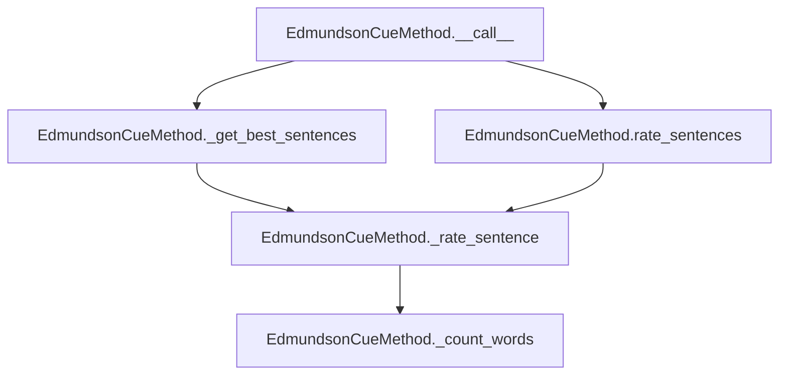

# `edmundson_cue.py`

## `sumy.summarizers.edmundson_cue.EdmundsonCueMethod` · *class*

## Summary:
Implements the Edmundson cue-word method for text summarization by rating sentences based on bonus and stigma words.

## Description:
This class implements a cue-word based summarization technique where sentences are scored according to the presence of predefined bonus words (positive cues) and stigma words (negative cues). It extends AbstractSummarizer to provide sentence rating capabilities for summarization purposes. The method evaluates sentence importance by counting occurrences of cue words and applying configurable weights.

## State:
- _bonus_words: set or list of words considered as positive cues for sentence importance
- _stigma_words: set or list of words considered as negative cues for sentence importance
- stemmer: stemming function inherited from AbstractSummarizer for word normalization

## Lifecycle:
- Creation: Instantiate with stemmer, bonus_words, and stigma_words parameters
- Usage: Call instance with document, sentences_count, bonus_word_weight, and stigma_word_weight to get summarized sentences
- Destruction: No special cleanup required; relies on Python's garbage collection

## Method Map:


## Raises:
- None explicitly raised in the provided implementation

## Example:
```python
# Create the summarizer with bonus and stigma words
bonus_words = {'important', 'significant', 'key'}
stigma_words = {'unimportant', 'irrelevant', 'minor'}
summarizer = EdmundsonCueMethod(stemmer, bonus_words, stigma_words)

# Rate sentences in a document
document = ... # some document object
ratings = summarizer.rate_sentences(document, bonus_word_weight=2, stigma_word_weight=1)

# Get top sentences
top_sentences = summarizer(document, sentences_count=3, bonus_word_weight=2, stigma_word_weight=1)
```

### `sumy.summarizers.edmundson_cue.EdmundsonCueMethod.__init__` · *method*

## Summary:
Initializes the Edmundson cue-word summarization method with stemmer and predefined bonus/stigma word collections.

## Description:
Configures the EdmundsonCueMethod instance by setting up the stemmer for word normalization and storing the collections of bonus words (positive cues) and stigma words (negative cues) that will be used to rate sentences during the summarization process. This initialization method establishes the core parameters needed for the cue-based sentence scoring algorithm.

The method inherits from AbstractSummarizer's initialization to set up the stemmer functionality, then stores the bonus and stigma word collections that define the semantic cues for determining sentence importance. This setup is essential for all subsequent sentence rating operations performed by the class.

## Args:
    stemmer (callable): A callable object used for stemming words during text processing; must be callable
    bonus_words (set or list): Collection of words considered as positive indicators for sentence importance
    stigma_words (set or list): Collection of words considered as negative indicators for sentence importance

## Returns:
    None: This method initializes the object's state but does not return a value

## Raises:
    ValueError: Raised by the parent AbstractSummarizer.__init__ when the stemmer parameter is not callable

## State Changes:
    Attributes READ:
        - None

    Attributes WRITTEN:
        - self._bonus_words: Stores the collection of bonus words for sentence scoring
        - self._stigma_words: Stores the collection of stigma words for sentence scoring

## Constraints:
    Preconditions:
        - The stemmer parameter must be callable
        - bonus_words and stigma_words should be iterable collections (sets, lists, etc.)
        - The collections should contain string representations of words to be matched

    Postconditions:
        - The instance is properly configured with stemmer and cue word collections
        - self._bonus_words contains the bonus word collection
        - self._stigma_words contains the stigma word collection

## Side Effects:
    None

### `sumy.summarizers.edmundson_cue.EdmundsonCueMethod.__call__` · *method*

## Summary:
Selects the most important sentences from a document using the Edmundson cue method based on bonus and stigma word weights.

## Description:
This method implements the Edmundson cue-based approach to text summarization by evaluating sentences based on the presence of bonus words (positive indicators) and stigma words (negative indicators). It leverages the parent class's `_get_best_sentences` utility to select the top-rated sentences according to the weighted difference between bonus and stigma word counts.

The method is typically called as part of the summarization pipeline where a document needs to be summarized to a specific number of sentences. It's designed to work with the EdmundsonCueMethod class which is initialized with predefined bonus and stigma word collections.

## Args:
    document (Document): The input document containing sentences to be rated and selected
    sentences_count (int): The desired number of sentences to include in the summary
    bonus_word_weight (float): Weight multiplier applied to bonus word occurrences
    stigma_word_weight (float): Weight multiplier applied to stigma word occurrences

## Returns:
    tuple: A tuple of selected sentences ordered by their original position in the document

## Raises:
    None explicitly raised by this method - any exceptions would come from underlying methods like _get_best_sentences

## State Changes:
    Attributes READ:
        - self._bonus_words: Collection of words considered positive indicators
        - self._stigma_words: Collection of words considered negative indicators
        - self._stemmer: Stemming function used for word normalization
    
    Attributes WRITTEN:
        - None

## Constraints:
    Preconditions:
        - Document must have a sentences attribute containing iterable sentences
        - Sentences_count must be a valid count for selecting sentences
        - Bonus_word_weight and stigma_word_weight must be numeric values
        - self._bonus_words and self._stigma_words must be accessible collections
    
    Postconditions:
        - Returns exactly the requested number of sentences (or fewer if insufficient)
        - Sentences in result maintain their original relative ordering
        - All sentences are rated using the cue method approach

## Side Effects:
    None

### `sumy.summarizers.edmundson_cue.EdmundsonCueMethod._rate_sentence` · *method*

## Summary:
Calculates a weighted rating for a sentence based on bonus and stigma word counts.

## Description:
Computes a numerical score for a sentence by counting occurrences of predefined bonus words (positive indicators) and stigma words (negative indicators), then applying configurable weights to produce a net rating. This rating reflects the sentence's importance according to the Edmundson cue-based summarization approach, where sentences with more positive cue words receive higher scores and those with more negative cue words receive lower scores.

The method is called internally by the EdmundsonCueMethod's `__call__` and `rate_sentences` methods during the sentence scoring phase of text summarization. It serves as the core scoring mechanism that evaluates each sentence's relevance based on its lexical content.

## Args:
    sentence (Sentence): The sentence to be rated, containing a `words` attribute with tokenized text
    bonus_word_weight (float): Weight multiplier applied to bonus word occurrences (default: 1.0)
    stigma_word_weight (float): Weight multiplier applied to stigma word occurrences (default: 1.0)

## Returns:
    float: The computed sentence rating, calculated as (bonus_count * bonus_word_weight) - (stigma_count * stigma_word_weight). 
           Positive values indicate more bonus words than stigma words, negative values indicate more stigma words than bonus words.

## Raises:
    None explicitly raised.

## State Changes:
    Attributes READ: 
        - self._bonus_words: Set of words considered as positive indicators for sentence importance
        - self._stigma_words: Set of words considered as negative indicators for sentence importance
        - self.stem_word: Method used to normalize words before comparison

## Constraints:
    Preconditions:
        - The sentence parameter must have a `words` attribute containing iterable tokens
        - Bonus and stigma word weights must be numeric values
        - Instance must have `_bonus_words` and `_stigma_words` collections properly initialized
        - Instance must have a valid `stem_word` method for word normalization
        
    Postconditions:
        - Returns a floating-point number representing the sentence's cue-based rating
        - The rating reflects the balance between positive and negative cue words in the sentence

## Side Effects:
    None.

### `sumy.summarizers.edmundson_cue.EdmundsonCueMethod._count_words` · *method*

## Summary:
Counts occurrences of bonus and stigma words in a list of words.

## Description:
This method analyzes a collection of words and determines how many belong to the predefined bonus word set and stigma word set. It's used in the Edmundson cue-based text summarization approach to calculate sentence ratings based on the presence of positive (bonus) and negative (stigma) cue words.

The method is called internally by `_rate_sentence` during the sentence scoring process, where each sentence is evaluated based on its bonus and stigma word counts. In the Edmundson approach, sentences containing more bonus words (positive cues) are rated higher, while those with more stigma words (negative cues) are rated lower.

## Args:
    words (iterable): An iterable of words (typically stemmed) to analyze for bonus and stigma word matches.

## Returns:
    tuple[int, int]: A tuple containing (bonus_words_count, stigma_words_count) representing the number of bonus words and stigma words found in the input collection.

## Raises:
    None explicitly raised.

## State Changes:
    Attributes READ: 
        - self._bonus_words: Set of words considered as bonus words for positive sentiment
        - self._stigma_words: Set of words considered as stigma words for negative sentiment

## Constraints:
    Preconditions:
        - The `words` parameter should be iterable containing string-like objects
        - `self._bonus_words` and `self._stigma_words` should be set-like objects supporting the `in` operator
    Postconditions:
        - Returns a tuple of two non-negative integers
        - The returned counts are bounded by the length of the input `words` iterable

## Side Effects:
    None.

### `sumy.summarizers.edmundson_cue.EdmundsonCueMethod.rate_sentences` · *method*

## Summary:
Rates all sentences in a document using bonus and stigma word weights, returning a mapping of sentences to their computed ratings.

## Description:
Processes each sentence in the provided document to compute individual cue-based ratings using the Edmundson method. This method serves as the core sentence scoring mechanism for cue-based text summarization, where sentences are evaluated based on their occurrence of predefined bonus words (positive indicators) and stigma words (negative indicators).

The method is typically called during the sentence scoring phase of the Edmundson summarization pipeline, either directly by users or indirectly through the main summarization workflow via the `__call__` method. It provides a complete sentence rating map that can be used for various summarization strategies requiring ranked sentence importance.

## Args:
    document (Document): The document object containing sentences to be rated
    bonus_word_weight (float): Weight multiplier applied to bonus word occurrences (default: 1.0)
    stigma_word_weight (float): Weight multiplier applied to stigma word occurrences (default: 1.0)

## Returns:
    dict[Sentence, float]: A dictionary mapping each sentence in the document to its computed cue-based rating. Ratings are floats where positive values indicate more bonus words than stigma words, and negative values indicate more stigma words than bonus words.

## Raises:
    None explicitly raised.

## State Changes:
    Attributes READ: 
        - self._bonus_words: Set of words considered as positive indicators for sentence importance
        - self._stigma_words: Set of words considered as negative indicators for sentence importance
        - self.stem_word: Method used to normalize words before comparison

## Constraints:
    Preconditions:
        - The document parameter must contain a `sentences` attribute with iterable sentence objects
        - Each sentence in the document must have a `words` attribute containing iterable tokens
        - Bonus and stigma word weights must be numeric values
        - Instance must have `_bonus_words` and `_stigma_words` collections properly initialized
        - Instance must have a valid `stem_word` method for word normalization
        
    Postconditions:
        - Returns a dictionary mapping all sentences in the document to their respective cue-based ratings
        - All returned ratings are floating-point numbers reflecting the balance between positive and negative cue words

## Side Effects:
    None.

