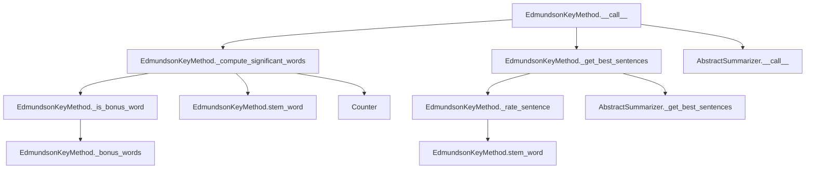

# `edmundson_key.py`

## `sumy.summarizers.edmundson_key.EdmundsonKeyMethod` · *class*

## Summary:
Implements the Edmundson key method for text summarization, which identifies significant words based on bonus word lists and rates sentences accordingly.

## Description:
The EdmundsonKeyMethod class is a concrete implementation of text summarization that leverages a set of bonus words to identify significant terms in a document. It extends AbstractSummarizer to provide a specific approach to sentence ranking based on the frequency and importance of bonus words within sentences. This method is particularly useful for identifying key content in documents where certain words are considered particularly important or indicative of main topics.

The class is intended to be instantiated with a stemmer for text normalization and a collection of bonus words that define what constitutes significant terminology for the summarization process. It operates by first identifying significant words based on bonus word frequency thresholds, then rates sentences based on how many significant words they contain.

## State:
- _bonus_words: set-like object containing words that are considered bonus words for significance calculation
  - Type: Set-like container of strings (typically frozenset or set)
  - Valid values: Strings representing important or key terms for document analysis
  - Invariant: Must be initialized in __init__ and remain constant during object lifetime

## Lifecycle:
- Creation: Instantiate with a stemmer callable and a collection of bonus words (typically a set or frozenset)
- Usage: Call the instance with (document, sentences_count, weight) to generate a summary, or use rate_sentences() to get detailed sentence ratings
- Destruction: Standard Python garbage collection; no special cleanup required

## Method Map:


## Raises:
- ValueError: Raised during initialization if the stemmer parameter is not callable (inherited from AbstractSummarizer)

## Example:
```python
# Create a summarizer with a stemmer and bonus words
from nltk.stem import PorterStemmer
stemmer = PorterStemmer()
bonus_words = {'important', 'key', 'main', 'significant'}
summarizer = EdmundsonKeyMethod(stemmer, bonus_words)

# Generate a summary of a document
# summary = summarizer(document, sentences_count=3, weight=0.5)

# Get detailed sentence ratings
# rated_sentences = summarizer.rate_sentences(document, weight=0.5)
```

### `sumy.summarizers.edmundson_key.EdmundsonKeyMethod.__init__` · *method*

## Summary:
Initializes an EdmundsonKeyMethod instance with a stemmer and bonus word collection for text summarization.

## Description:
Configures the EdmundsonKeyMethod object by initializing its parent AbstractSummarizer with a stemmer and storing the bonus word collection that defines significant terminology for sentence ranking. This constructor establishes the fundamental components required for the Edmundson key method algorithm to identify important words and rate sentences during text summarization.

The method is called during object instantiation and sets up the internal state necessary for subsequent summarization operations. It ensures proper inheritance from AbstractSummarizer while establishing the specific configuration needed for the Edmundson key approach.

## Args:
    stemmer (callable): A callable object used for stemming words during text processing; typically a stemming algorithm like PorterStemmer
    bonus_words (set-like): A collection of words considered important or significant for the summarization process; typically a set or frozenset of strings

## Returns:
    None: This method initializes the object's state but does not return a value

## Raises:
    ValueError: Raised by the parent AbstractSummarizer.__init__ method when the stemmer parameter is not callable

## State Changes:
    Attributes READ: None
    Attributes WRITTEN: 
    - self._bonus_words: Stores the bonus word collection for later use in significance calculations
    - self._stemmer: Inherited from AbstractSummarizer, set via parent constructor call

## Constraints:
    Preconditions:
    - The stemmer argument must be callable (support __call__ method)
    - The bonus_words argument must be a set-like object that supports iteration and membership testing
    
    Postconditions:
    - The object is properly initialized with a valid stemmer
    - The _bonus_words attribute is set to the provided bonus_words collection
    - The object inherits all functionality from AbstractSummarizer

## Side Effects:
    None: This method performs no I/O operations or external service calls

### `sumy.summarizers.edmundson_key.EdmundsonKeyMethod.__call__` · *method*

## Summary:
Computes significant words from a document using weighted frequency analysis and selects the most relevant sentences based on their significance scores.

## Description:
This method implements the Edmundson key method algorithm for text summarization. It first identifies significant words in the document based on their frequency and a provided weight threshold, then rates sentences based on how many significant words they contain, finally selecting the top-rated sentences to form a summary.

The Edmundson key method focuses on identifying important words (typically content words) and using their presence in sentences to determine sentence importance. This method is typically called during the summarization process when a summarizer instance needs to generate a summary of a given document with a specified sentence count.

## Args:
    document (object): A document object with sentences and words attributes for processing
    sentences_count (int): The desired number of sentences in the resulting summary
    weight (float): A threshold value between 0 and 1 that determines which words are considered significant based on their frequency

## Returns:
    tuple: A tuple of sentences that form the summary, ordered by their appearance in the original document

## Raises:
    None explicitly raised by this method, though underlying methods may raise exceptions

## State Changes:
    Attributes READ: 
    - self._bonus_words (used in _is_bonus_word method)
    - self._stemmer (used in stem_word method inherited from parent)
    
    Attributes WRITTEN: None

## Constraints:
    Preconditions:
    - Document must have a sentences attribute containing iterable sentences
    - Document must have a words attribute containing iterable words
    - Sentences_count must be a positive integer or valid count specifier
    - Weight must be a float between 0 and 1
    
    Postconditions:
    - Returns exactly sentences_count sentences (or fewer if document has insufficient sentences)
    - Sentences in result maintain their original relative ordering
    - All returned sentences are from the original document

## Side Effects:
    None

### `sumy.summarizers.edmundson_key.EdmundsonKeyMethod._compute_significant_words` · *method*

## Summary:
Extracts significant words from a document based on frequency ratios relative to maximum word frequency.

## Description:
Processes document words through stemming and bonus word filtering to identify significant terms. This method implements frequency-based significance scoring where words must exceed a minimum frequency threshold relative to the most frequent word in the document.

The algorithm works by:
1. Stemming all words in the document
2. Filtering to only include words that are bonus words
3. Counting word frequencies
4. Returning words whose frequency ratio (frequency/max_frequency) exceeds the provided weight threshold

This approach is central to the Edmundson key phrase extraction method used in text summarization.

## Args:
    document: Document object with .words attribute containing words to process
    weight (float): Minimum frequency ratio threshold (0.0 to 1.0) for significance

## Returns:
    tuple[str]: Words that meet the significance criteria, or empty tuple if none qualify

## Raises:
    None explicitly raised

## State Changes:
    Attributes READ: self.stem_word, self._is_bonus_word, self._bonus_words
    Attributes WRITTEN: None

## Constraints:
    Preconditions: 
    - Document must have a `words` attribute containing iterable of words
    - Weight must be a numeric value between 0.0 and 1.0 (inclusive)
    - Self must have `_bonus_words` attribute initialized with set-like structure
    - Words in document must be processable by self.stem_word
    
    Postconditions:
    - Returns a tuple of strings representing significant words
    - Empty tuple returned if no words meet the frequency threshold
    - All returned words have been stemmed and validated as bonus words

## Side Effects:
    None

### `sumy.summarizers.edmundson_key.EdmundsonKeyMethod._is_bonus_word` · *method*

## Summary:
Checks whether a given word is classified as a bonus word for text summarization purposes.

## Description:
Determines if a word belongs to the set of predefined bonus words that are considered particularly important for identifying significant content in text summarization. This method serves as a lookup mechanism to filter words during the significant word computation phase of the Edmundson key phrase extraction algorithm.

The method is called during the document processing pipeline when computing significant words, specifically in the `_compute_significant_words` method where it filters stemmed words to only include those that are bonus words before frequency analysis.

This logic is encapsulated in its own method rather than being inlined because:
1. It provides a clean abstraction for bonus word checking
2. It makes the intent of the filtering operation explicit
3. It allows for potential future extension of bonus word logic without modifying the main computation flow

## Args:
    word (str): The word to check for bonus word status

## Returns:
    bool: True if the word exists in the bonus words collection, False otherwise

## Raises:
    None explicitly raised

## State Changes:
    Attributes READ: self._bonus_words
    Attributes WRITTEN: None

## Constraints:
    Preconditions:
    - The method must be called on an instance of EdmundsonKeyMethod that has been properly initialized
    - The `word` parameter must be a string
    - The instance must have `_bonus_words` attribute initialized (typically as a set or similar container)
    
    Postconditions:
    - Returns a boolean value indicating membership in bonus words collection
    - Does not modify any object state

## Side Effects:
    None

### `sumy.summarizers.edmundson_key.EdmundsonKeyMethod._rate_sentence` · *method*

## Summary:
Rates a sentence by counting how many of its stemmed words appear in the set of significant words.

## Description:
This private method evaluates the importance of a sentence by determining how many of its words (after stemming) are present in the provided set of significant words. It's used internally by the Edmundson key method algorithm to rank sentences during the summarization process.

The method is called from two main contexts:
1. During the `__call__` method execution to get the best sentences for summarization
2. During the `rate_sentences` method execution to provide detailed sentence ratings

This logic is encapsulated in its own method to promote code reuse and maintainability, separating the sentence rating computation from the higher-level summarization workflow.

## Args:
    sentence: A sentence object containing a `words` attribute with raw words
    significant_words: A collection (likely tuple or set) of stemmed words considered significant for summarization

## Returns:
    int: The count of words from the sentence that appear in significant_words

## Raises:
    None explicitly raised

## State Changes:
    Attributes READ: self.stem_word (method reference)
    Attributes WRITTEN: None

## Constraints:
    Preconditions:
    - sentence.words must be iterable and contain string-like objects
    - significant_words must support the 'in' operator for membership testing
    - self.stem_word must be callable and accept string arguments
    
    Postconditions:
    - Returns a non-negative integer representing word matches
    - The returned value is bounded by the number of words in the sentence

## Side Effects:
    None

### `sumy.summarizers.edmundson_key.EdmundsonKeyMethod.rate_sentences` · *method*

## Summary:
Computes and returns importance ratings for all sentences in a document using the Edmundson key method approach.

## Description:
This method evaluates each sentence in the provided document by calculating how many of its stemmed words appear in the set of significant words identified from the document. It's designed to provide a complete ranking of all sentences in a document, making it useful for detailed analysis or when the full sentence rating information is needed rather than just the top-ranked sentences.

The method is typically called during the sentence scoring phase of the Edmundson key-based text summarization process. It leverages the same core algorithm as the `__call__` method but provides a more granular view by returning ratings for every sentence instead of just selecting the highest-rated ones.

## Args:
    document: Document object containing sentences to be rated
    weight (float): Minimum frequency ratio threshold (0.0 to 1.0) for identifying significant words. Defaults to 0.5

## Returns:
    dict[Sentence, int]: Dictionary mapping each sentence in the document to its computed rating (integer count of significant words found)

## Raises:
    None explicitly raised

## State Changes:
    Attributes READ: 
    - self._bonus_words: Set of words considered significant for key phrase identification
    - self.stem_word: Method used to normalize words before comparison
    - self._is_bonus_word: Method used to filter words as bonus words
    
    Attributes WRITTEN: None

## Constraints:
    Preconditions:
    - Document must have a `sentences` attribute containing iterable of sentence objects
    - Each sentence in document must have a `words` attribute containing iterable of words
    - Weight must be a numeric value between 0.0 and 1.0 (inclusive)
    - Self must have `_bonus_words` attribute initialized with set-like structure
    - Self must have a valid `stem_word` method for word normalization
    
    Postconditions:
    - Returns a dictionary with all sentences from the document as keys
    - Each value is a non-negative integer representing the count of significant words in that sentence
    - The dictionary size equals the number of sentences in the document

## Side Effects:
    None

