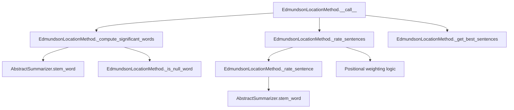

# `edmundson_location.py`

## `sumy.summarizers.edmundson_location.EdmundsonLocationMethod` · *class*

## Summary:
Implements Edmundson's location-based text summarization method that rates sentences based on their position within document structure and content significance.

## Description:
The EdmundsonLocationMethod class implements Edmundson's approach to text summarization, which assigns higher weights to sentences that appear in strategic locations within a document (such as beginning or end of paragraphs or sentences) while also considering the significance of words found in document headings. This method combines positional weighting with content-based significance to determine sentence importance.

This class is typically instantiated by summarization pipeline components or configuration factories that set up the appropriate stemmer and null word lists for the target language.

## State:
- _null_words: frozenset of words that should be filtered out during significant word computation; must be hashable and support membership testing
- Inherits _stemmer from AbstractSummarizer parent class for word stemming operations

## Lifecycle:
- Creation: Instantiate with a callable stemmer and frozenset of null words
- Usage: Call instance with document, desired sentence count, and weighting coefficients to generate summary
- Destruction: Standard Python garbage collection handles cleanup

## Method Map:


## Raises:
- TypeError: If stemmer parameter is not callable (inherited from AbstractSummarizer)
- ValueError: If stemmer parameter is not callable (inherited from AbstractSummarizer)

## Example:
```python
from sumy.summarizers.edmundson_location import EdmundsonLocationMethod
from sumy.nlp.stemmers import null_stemmer

# Initialize with stemmer and null words
null_words = frozenset(['the', 'a', 'an', 'and', 'or'])
summarizer = EdmundsonLocationMethod(null_stemmer, null_words)

# Rate sentences with custom weights - returns dict mapping sentences to ratings
document = ... # Document object with headings, paragraphs, sentences
ratings = summarizer.rate_sentences(
    document, 
    w_h=2.0,   # Heading weight
    w_p1=1.5,  # First paragraph weight
    w_p2=1.0,  # Last paragraph weight
    w_s1=1.2,  # First sentence weight
    w_s2=0.8   # Last sentence weight
)

# Generate summary with 3 sentences - returns list of sentences
summary = summarizer(document, 3, 2.0, 1.5, 1.0, 1.2, 0.8)
# summary is a list of the 3 highest-rated sentences from document.sentences
```

### `sumy.summarizers.edmundson_location.EdmundsonLocationMethod.__init__` · *method*

## Summary:
Initializes an EdmundsonLocationMethod instance with a stemmer and null words collection for filtering insignificant terms during text processing.

## Description:
Configures the Edmundson location-based summarization method by setting up the required stemmer for word normalization and establishing the collection of null words that will be filtered out during significant word computation. This method serves as the constructor for the EdmundsonLocationMethod class, preparing the instance for sentence rating and summarization operations.

The method calls the parent AbstractSummarizer constructor to initialize the stemmer functionality, then stores the provided null words collection for later use in identifying and excluding common stop words during text analysis.

## Args:
    stemmer (callable): A callable object used for stemming words during text processing; must be callable and typically implements a stemming algorithm
    null_words (frozenset): A collection of words that should be excluded from significant word computation; typically contains common stop words like articles, prepositions, and conjunctions

## Returns:
    None: This method initializes the object's state and does not return a value

## Raises:
    TypeError: If stemmer parameter is not callable (inherited from AbstractSummarizer)
    ValueError: If stemmer parameter is not callable (inherited from AbstractSummarizer)

## State Changes:
    Attributes READ: None
    Attributes WRITTEN: 
    - self._null_words: Set to the provided null_words parameter for later use in filtering insignificant terms
    - self._stemmer: Set via parent class constructor call with the provided stemmer parameter

## Constraints:
    Preconditions:
    - stemmer parameter must be callable (implements __call__ method)
    - null_words parameter must be hashable and support membership testing (typically frozenset or similar)
    
    Postconditions:
    - self._null_words is initialized to the provided null_words parameter
    - self._stemmer is properly initialized via parent class constructor

## Side Effects:
    None: This method performs no I/O operations or external service calls; it only initializes internal state attributes

### `sumy.summarizers.edmundson_location.EdmundsonLocationMethod.__call__` · *method*

## Summary:
Computes location-based sentence ratings using heading keywords and returns the highest-ranked sentences from a document.

## Description:
This method implements the Edmundson location-based summarization approach by analyzing document structure and sentence positions to assign importance scores. It identifies significant words from document headings, rates sentences based on these words plus positional weights (heading, paragraph start/end, sentence start/end), and selects the top sentences according to the computed ratings.

The method is the primary interface for executing location-based summarization with configurable weights for different positional factors. It is called during the summarization pipeline when a document needs to be summarized using the Edmundson location technique.

## Args:
    document: Document object containing sentences, paragraphs, and headings to summarize
    sentences_count: Number of top sentences to return (integer) or percentage string (e.g., "50%")
    w_h (float): Weight multiplier for heading significance factor (applied to all sentences)
    w_p1 (float): Weight added to sentences in the first paragraph
    w_p2 (float): Weight added to sentences in the last paragraph
    w_s1 (float): Weight added to sentences at the beginning of a paragraph
    w_s2 (float): Weight added to sentences at the end of a paragraph

## Returns:
    tuple: A tuple of sentence objects ordered by their original position in the document, representing the most important sentences according to the location-based scoring model

## Raises:
    None explicitly raised

## State Changes:
    Attributes READ: self._null_words, self.stem_word
    Attributes WRITTEN: None

## Constraints:
    Preconditions:
    - Document must have accessible .sentences, .paragraphs, and .headings attributes
    - All weight parameters must be numeric values
    - Sentences_count must be a valid count specification for _get_best_sentences
    
    Postconditions:
    - Returns exactly the requested number of sentences (or fewer if insufficient)
    - Sentences in result maintain their original relative ordering
    - All returned sentences have been rated using the location-based scoring model

## Side Effects:
    None

### `sumy.summarizers.edmundson_location.EdmundsonLocationMethod._compute_significant_words` · *method*

## Summary:
Extracts and processes significant words from document headings by applying stemming and filtering operations.

## Description:
Processes document headings to identify significant words for use in location-based text summarization. This method extracts words from all headings in the document, applies stemming to normalize word forms, filters out null words (common stop words or irrelevant terms), and returns a frozen set of unique significant words. This logic is separated into its own method to enable reuse in both the main summarization pipeline and the sentence rating process.

## Args:
    document (object): A document object containing headings with words attribute. The document must have a `headings` attribute that is iterable and contains objects with a `words` attribute.

## Returns:
    frozenset: An immutable set of significant words extracted from document headings, with each word stemmed and filtered of null words.

## Raises:
    AttributeError: If the document object lacks a `headings` attribute or if heading objects lack a `words` attribute.
    TypeError: If the document or heading objects are not of expected types.

## State Changes:
    Attributes READ: self._null_words, self._stemmer (through self.stem_word)
    Attributes WRITTEN: None

## Constraints:
    Preconditions:
    - The document parameter must have a `headings` attribute that is iterable
    - Each heading in document.headings must have a `words` attribute that is iterable
    - The instance must have a valid stemmer callable assigned to self._stemmer
    - The instance must have a _null_words collection (set, list, etc.) assigned to self._null_words
    
    Postconditions:
    - Returns a frozenset containing only stemmed, non-null words from document headings
    - All returned words are in lowercase due to stemming operation

## Side Effects:
    None: This method has no side effects beyond standard Python operations and function calls.

### `sumy.summarizers.edmundson_location.EdmundsonLocationMethod._is_null_word` · *method*

## Summary:
Checks whether a given word is contained in the collection of null words used for filtering.

## Description:
This method performs a membership test to determine if a word should be excluded from further processing based on whether it appears in the predefined set of null words. It is used primarily during text preprocessing to filter out common stop words or insignificant terms that do not contribute meaningfully to sentence scoring.

The method is part of the Edmundson summarization approach, where null words are typically common function words (like articles, prepositions, conjunctions) that are filtered out during the computation of significant words for sentence ranking.

## Args:
    word (str): The word to check for membership in the null words collection

## Returns:
    bool: True if the word exists in self._null_words, False otherwise

## State Changes:
    Attributes READ: self._null_words
    Attributes WRITTEN: None

## Constraints:
    Preconditions: 
    - self._null_words must be initialized as a collection (set, list, etc.) containing string elements
    - The word parameter must be a string
    
    Postconditions:
    - The method returns a boolean value indicating membership status
    - No modifications are made to the object's state

## Side Effects:
    None

### `sumy.summarizers.edmundson_location.EdmundsonLocationMethod._rate_sentences` · *method*

## Summary:
Rates sentences in a document based on content significance and positional factors, returning a mapping of sentences to their computed importance scores.

## Description:
Computes numerical importance ratings for all sentences in a document by combining content-based significance scores with positional weighting factors. This private method is responsible for the core sentence rating calculation in the Edmundson location-based summarization approach, where sentences are evaluated not only on their content (presence of significant words from headings) but also on their structural position within the document.

The method is called internally by the EdmundsonLocationMethod's `__call__` and `rate_sentences` methods during the sentence scoring phase of text summarization. It serves as the primary mechanism for assigning importance scores that reflect both semantic content and document structure.

## Args:
    document: Document object containing paragraphs and sentences to be rated
    significant_words: Collection of stemmed words considered significant for summarization (typically from document headings)
    w_h (float): Weight multiplier applied to the base content rating for all sentences
    w_p1 (float): Weight added to sentences in the first paragraph
    w_p2 (float): Weight added to sentences in the last paragraph
    w_s1 (float): Weight added to sentences at the beginning of a paragraph
    w_s2 (float): Weight added to sentences at the end of a paragraph

## Returns:
    dict: Dictionary mapping each sentence object to its computed rating (float), where higher values indicate greater importance

## Raises:
    None explicitly raised

## State Changes:
    Attributes READ: 
    - self._rate_sentence (method used for content-based rating)
    - document.paragraphs (accessed to iterate through document structure)
    - sentence.words (accessed through _rate_sentence method)
    - significant_words (used for content-based scoring)
    
    Attributes WRITTEN: None

## Constraints:
    Preconditions:
    - Document must have accessible .paragraphs attribute containing iterable paragraphs
    - Each paragraph must have accessible .sentences attribute containing iterable sentences
    - significant_words must support the 'in' operator for membership testing
    - All weight parameters (w_h, w_p1, w_p2, w_s1, w_s2) must be numeric values
    
    Postconditions:
    - Returns a dictionary with all sentences from the document as keys
    - Each rating value is a float representing the combined content and positional importance
    - The returned dictionary maintains the original sentence objects as keys

## Side Effects:
    None

### `sumy.summarizers.edmundson_location.EdmundsonLocationMethod._rate_sentence` · *method*

## Summary:
Rates a sentence by counting how many of its stemmed words appear in a set of significant words.

## Description:
Computes a numerical score for a given sentence by counting the number of its stemmed words that are present in the provided set of significant words. This scoring mechanism is central to the Edmundson location-based summarization approach, where sentences containing more significant words (typically from document headings) are considered more important.

The method is called internally by the _rate_sentences method during the sentence rating phase of the summarization process. It performs efficient set membership testing on stemmed word representations to determine sentence importance.

## Args:
    sentence: A sentence object with a `words` attribute that provides access to the sentence's constituent words (iterable of word strings)
    significant_words: A collection (typically frozenset) of stemmed words considered significant for summarization purposes

## Returns:
    int: The count of stemmed words from the sentence that are present in the significant_words collection (non-negative integer)

## Raises:
    None explicitly raised

## State Changes:
    Attributes READ: 
    - self.stem_word (method used for word stemming)
    - sentence.words (accessed to retrieve words)
    - significant_words (used for membership testing)
    
    Attributes WRITTEN: None

## Constraints:
    Preconditions:
    - sentence must have a words attribute that is iterable
    - significant_words must support the 'in' operator for membership testing  
    - self.stem_word must be callable
    
    Postconditions:
    - Returns a non-negative integer representing word overlap count
    - The returned value represents the number of significant words found in the sentence

## Side Effects:
    None

### `sumy.summarizers.edmundson_location.EdmundsonLocationMethod.rate_sentences` · *method*

## Summary:
Computes location-based ratings for sentences in a document using the Edmundson algorithm.

## Description:
This method implements the core sentence rating functionality for the Edmundson location-based summarization approach. It processes the input document to compute significant words and then applies the location-based scoring algorithm to rate each sentence based on its position within the document structure.

The method accepts configurable weights for different positional factors (heading, paragraph beginnings/endings, sentence beginnings/endings) that influence the final sentence ratings. This is typically used internally by the summarization pipeline to rank sentences before selection.

## Args:
    document (Document): The input document containing sentences to be rated
    w_h (float): Weight for heading position factor, defaults to 1.0
    w_p1 (float): Weight for first paragraph position factor, defaults to 1.0
    w_p2 (float): Weight for last paragraph position factor, defaults to 1.0
    w_s1 (float): Weight for first sentence position factor, defaults to 1.0
    w_s2 (float): Weight for last sentence position factor, defaults to 1.0

## Returns:
    list[tuple[Sentence, float]]: A list of (sentence, rating) tuples where each tuple contains a sentence and its computed location-based score

## Raises:
    None explicitly documented

## State Changes:
    Attributes READ: None
    Attributes WRITTEN: None

## Constraints:
    Preconditions:
        - Document must contain valid sentences
        - All weight parameters should be numeric values
        - The document should be properly tokenized and processed
    
    Postconditions:
        - Returns a list of sentence-rating pairs
        - Sentence order is preserved in the returned list

## Side Effects:
    None

