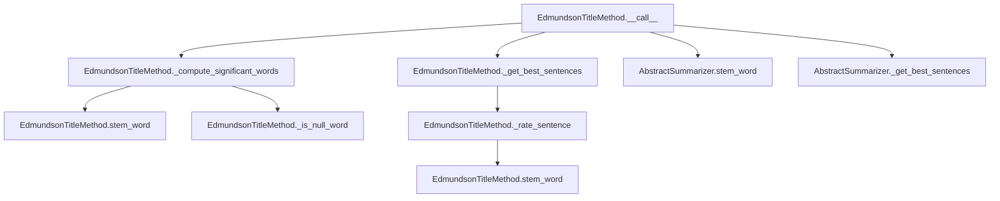

# `edmundson_title.py`

## `sumy.summarizers.edmundson_title.EdmundsonTitleMethod` · *class*

## Summary:
Implements the Edmundson Title method for text summarization, which rates sentences based on the presence of significant words found in document headings.

## Description:
The EdmundsonTitleMethod is a concrete summarization algorithm that leverages document headings to identify important content. It computes significant words from headings and rates sentences based on how many of these significant words they contain. This approach prioritizes sentences that share vocabulary with document headings, assuming such content is more informative or representative of the main topics.

This class is typically instantiated by summarization pipeline components or configuration factories that set up the appropriate stemmer and null word lists for the specific language or domain being summarized.

## State:
- _null_words: frozenset of words that should be filtered out during significant word computation; must be hashable and support membership testing
- Inherits _stemmer from AbstractSummarizer parent class, which is a callable used for word stemming operations

## Lifecycle:
- Creation: Instantiate with a stemmer callable and a collection of null words (typically a set or list of stop words)
- Usage: Call instances with (document, sentences_count) arguments to generate summaries
- Destruction: No special cleanup required; uses standard Python garbage collection

## Method Map:


## Raises:
- TypeError: If stemmer parameter is not callable (inherited from AbstractSummarizer)
- ValueError: If the stemmer parameter is not callable (inherited from AbstractSummarizer)

## Example:
```python
# Create summarizer with a stemmer and null words
from sumy.nlp.stemmers import PorterStemmer
from sumy.summarizers.edmundson_title import EdmundsonTitleMethod

stemmer = PorterStemmer()
null_words = {'the', 'and', 'or', 'but', 'in', 'on', 'at', 'to', 'for', 'of'}

summarizer = EdmundsonTitleMethod(stemmer, null_words)

# Generate summary of 3 sentences
summary = summarizer(document, 3)
```

### `sumy.summarizers.edmundson_title.EdmundsonTitleMethod.__init__` · *method*

## Summary:
Initializes an EdmundsonTitleMethod instance with a stemmer and null words collection.

## Description:
Configures the Edmundson title-based summarization method by setting up the required stemmer for word processing and storing the collection of null words that should be excluded from significant word computation. This initialization method establishes the fundamental preprocessing capabilities needed for the Edmundson approach to text summarization.

The method is called during object construction and prepares the instance for subsequent summarization operations by ensuring proper stemmer setup and null word storage. It follows the standard pattern of initializing parent class state before setting child-specific attributes.

## Args:
    stemmer: Callable object used for stemming words during text processing; must be callable
    null_words: Collection of words to exclude from significant word computation; typically a set or frozenset of stop words

## Returns:
    None: This method initializes the object state and returns nothing

## Raises:
    TypeError: If stemmer parameter is not callable (validated by AbstractSummarizer parent class)
    ValueError: If stemmer parameter is not callable (validated by AbstractSummarizer parent class)

## State Changes:
    Attributes READ: None
    Attributes WRITTEN: 
    - self._null_words: Stores the provided null_words collection for later use in significant word computation
    - self._stemmer: Inherited from AbstractSummarizer parent class, set through the parent constructor call

## Constraints:
    Preconditions:
    - stemmer parameter must be callable (function, method, or callable object)
    - null_words parameter should be a hashable collection supporting membership testing
    - null_words should contain words that are meaningful to filter out during significant word extraction
    
    Postconditions:
    - Instance is properly initialized with a valid stemmer
    - Instance stores the provided null_words collection for use in _compute_significant_words method
    - Instance inherits proper stemmer functionality from AbstractSummarizer parent class

## Side Effects:
    None

### `sumy.summarizers.edmundson_title.EdmundsonTitleMethod.__call__` · *method*

## Summary:
Selects the most important sentences from a document based on significant words extracted from document headings.

## Description:
Implements the Edmundson title-based summarization approach by identifying sentences that contain the most significant words from document headings. This method serves as the primary entry point for the Edmundson title summarizer, orchestrating the process of extracting significant words from headings and selecting the best sentences based on their overlap with these significant words.

The method follows a three-step process:
1. Extracts significant words from document headings using the `_compute_significant_words` helper method
2. Rates each sentence based on how many significant words it contains using the `_rate_sentence` helper method  
3. Selects the top-rated sentences using the inherited `_get_best_sentences` utility method

This method is typically called during the summarization pipeline when a user requests a summary with a specific sentence count. It's part of the Edmundson family of summarization methods that leverage structural elements like headings to identify important content.

## Args:
    document: Document object containing sentences and headings to summarize
    sentences_count: Integer specifying how many sentences to include in the summary

## Returns:
    tuple: A tuple of selected sentences ordered by their original position in the document

## Raises:
    None explicitly raised

## State Changes:
    Attributes READ: 
    - self._null_words (via _compute_significant_words)
    - self.stem_word (via _compute_significant_words and _rate_sentence)
    - self._stemmer (inherited from AbstractSummarizer, via stem_word)
    Attributes WRITTEN: None

## Constraints:
    Preconditions:
    - Document must have a `sentences` attribute containing iterable of sentences
    - Document must have a `headings` attribute containing iterable of heading objects
    - Heading objects must have a `words` attribute containing iterable of words
    - Sentences_count must be a valid count for the _get_best_sentences method
    - The instance must have a valid stemmer callable assigned to self._stemmer
    - The instance must have a _null_words collection (set, list, etc.) assigned to self._null_words
    
    Postconditions:
    - Returns exactly the requested number of sentences (or fewer if insufficient input)
    - Sentences in result maintain their original relative ordering
    - Result is always a tuple

## Side Effects:
    None

### `sumy.summarizers.edmundson_title.EdmundsonTitleMethod._compute_significant_words` · *method*

## Summary:
Extracts and normalizes significant words from document headings for Edmundson title-based summarization.

## Description:
Processes document headings to identify significant words that represent the main topics or themes. This method implements a key step in Edmundson's title-based summarization approach by extracting words from headings, applying stemming to normalize word forms, and filtering out null/stop words to create a set of meaningful keywords.

The method is typically called during the initialization or preprocessing phase of the Edmundson title summarization algorithm to build a vocabulary of important terms derived from document headings.

## Args:
    document: A document object containing a headings attribute that is iterable, where each heading has a words attribute containing a sequence of words

## Returns:
    frozenset: An immutable set of normalized significant words extracted from document headings, with each word stemmed and filtered for null/stop words

## Raises:
    AttributeError: If document does not have a headings attribute, or if any heading lacks a words attribute
    TypeError: If document.headings is not iterable, or if words in headings are not processable by stem_word method

## State Changes:
    Attributes READ: None - this method only reads from the document parameter
    Attributes WRITTEN: None - this method does not modify any instance attributes

## Constraints:
    Preconditions: 
    - Document must have a headings attribute that is iterable
    - Each heading in document.headings must have a words attribute containing a sequence of words
    - Words in headings should be compatible with the instance's stem_word method
    - The instance must have a _is_null_word method for filtering
    
    Postconditions:
    - Returns a frozenset containing only significant words (after filtering null words)
    - All returned words have been stemmed using the instance's stem_word method
    - Returned words are unique due to frozenset conversion

## Side Effects:
    None - this method performs no I/O operations or external service calls

### `sumy.summarizers.edmundson_title.EdmundsonTitleMethod._is_null_word` · *method*

## Summary:
Checks if a given word is contained in the collection of null words used for filtering.

## Description:
This method determines whether a word should be excluded from significant word processing based on whether it appears in the predefined set of null words. It is used during the computation of significant words from document headings to filter out common stop words or irrelevant terms.

## Args:
    word (str): The word to check for null word status

## Returns:
    bool: True if the word is in the null words collection, False otherwise

## State Changes:
    Attributes READ: self._null_words

## Constraints:
    Preconditions: The method assumes that self._null_words is properly initialized as a collection (list, set, etc.) containing null words
    Postconditions: The method returns a boolean value indicating membership in the null words collection

## Side Effects:
    None: This method performs only a membership test and has no side effects

### `sumy.summarizers.edmundson_title.EdmundsonTitleMethod._rate_sentence` · *method*

## Summary:
Rates a sentence by counting how many of its stemmed words appear in a set of significant words.

## Description:
This method computes a relevance score for a given sentence by comparing its stemmed words against a predefined set of significant words derived from document headings. It's used internally by the EdmundsonTitleMethod summarizer to rank sentences during the summarization process.

The method is called during the sentence scoring phase of text summarization, where sentences are evaluated based on their lexical overlap with important terms found in document headings. This scoring mechanism helps identify sentences that are most representative of the document's key topics.

## Args:
    sentence: An object representing a sentence with a `words` attribute containing individual words (list or iterable of strings)
    significant_words: A collection (typically frozenset) of stemmed words considered significant for summarization

## Returns:
    int: The count of stemmed words from the sentence that are present in the significant_words collection

## Raises:
    None explicitly raised

## State Changes:
    Attributes READ: self.stem_word (method)
    Attributes WRITTEN: None

## Constraints:
    Preconditions:
    - The sentence object must have a `words` attribute that is iterable
    - The significant_words parameter must support the `in` operator for membership testing
    - The self.stem_word method must be callable and accept individual words as arguments
    
    Postconditions:
    - Returns a non-negative integer representing the number of significant words found in the sentence
    - The returned value is bounded by the number of words in the sentence

## Side Effects:
    None

### `sumy.summarizers.edmundson_title.EdmundsonTitleMethod.rate_sentences` · *method*

## Summary:
Rates all sentences in a document based on their overlap with significant words extracted from document headings.

## Description:
Computes relevance scores for all sentences in a document by counting how many of their stemmed words appear in the set of significant words derived from document headings. This method is used to evaluate sentence importance in Edmundson's title-based text summarization approach.

The method is typically called during the sentence scoring phase of the summarization process to provide detailed sentence ratings for ranking purposes. It's particularly useful when users want to examine the individual sentence scores rather than just selecting the top-ranked sentences.

## Args:
    document: A document object containing sentences and headings attributes. The document must have:
        - A `sentences` attribute that is iterable, containing sentence objects with `words` attribute
        - A `headings` attribute that is iterable, containing heading objects with `words` attribute

## Returns:
    dict: A dictionary mapping each sentence object to its computed relevance score (integer count of significant words found)

## Raises:
    None explicitly raised

## State Changes:
    Attributes READ: 
        - self._null_words: Collection of words to filter out during significant word extraction
        - self.stem_word: Method used for normalizing words through stemming
    Attributes WRITTEN: None

## Constraints:
    Preconditions:
        - Document must have both `sentences` and `headings` attributes that are iterable
        - Each sentence in document.sentences must have a `words` attribute that is iterable
        - Each heading in document.headings must have a `words` attribute that is iterable
        - Self must have `_null_words` attribute properly initialized
        - Self must have a valid `stem_word` method for word normalization
        
    Postconditions:
        - Returns a dictionary with all sentences from the document as keys
        - Each value is a non-negative integer representing the count of significant words in that sentence
        - The returned dictionary maintains the same sentence objects as keys (no copying)

## Side Effects:
    None - this method performs no I/O operations or external service calls

