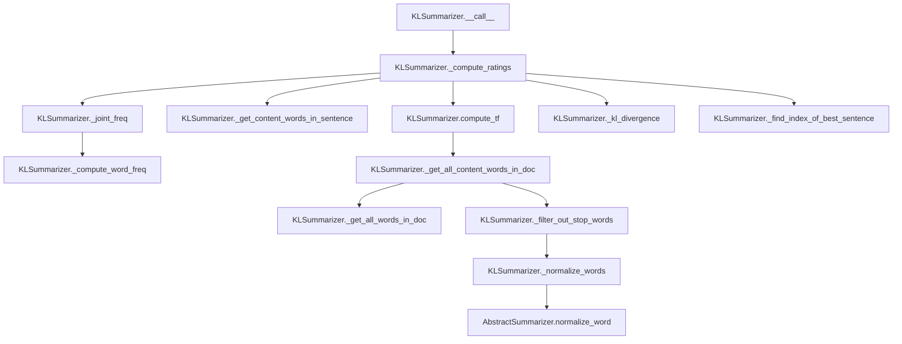

# `kl.py`

## `sumy.summarizers.kl.KLSummarizer` · *class*

## Summary:
KL Summarizer implements a text summarization algorithm based on Kullback-Leibler divergence to select the most informative sentences for a summary.

## Description:
The KLSummarizer class implements a summarization technique that uses Kullback-Leibler (KL) divergence as a metric to determine sentence relevance. It builds a summary incrementally by selecting sentences that contribute most to reducing the divergence between the summary's word distribution and the document's overall word distribution. This approach prioritizes sentences that introduce novel information rather than repeating existing content.

The class inherits from AbstractSummarizer and implements the required __call__ method to provide a standardized interface for text summarization. It operates on document objects containing sentences and returns a ranked list of sentences that form the summary.

## State:
- stop_words: frozenset - Set of stop words to filter out from content words. Defaults to empty frozenset.
- Inherited from AbstractSummarizer: _stemmer (callable for word stemming)

## Lifecycle:
- Creation: Instantiate with optional stemmer parameter (inherited from AbstractSummarizer)
- Usage: Call instance with (document, sentences_count) arguments to generate summary
- Destruction: Standard Python garbage collection

## Method Map:


## Raises:
- None explicitly raised by KLSummarizer constructor
- May raise exceptions from parent class AbstractSummarizer if invalid stemmer is provided
- May raise exceptions from document/sentence processing if input is malformed

## Example:
```python
from sumy.summarizers.kl import KLSummarizer
from sumy.parsers.plaintext import PlaintextParser
from sumy.nlp.tokenizers import Tokenizer

# Create summarizer instance
summarizer = KLSummarizer()

# Parse document
parser = PlaintextParser.from_file("document.txt", Tokenizer("english"))
document = parser.document

# Generate summary with 3 sentences
summary = summarizer(document, 3)

# Print summary sentences
for sentence in summary:
    print(sentence)
```

### `sumy.summarizers.kl.KLSummarizer.__call__` · *method*

## Summary:
Computes sentence ratings using KL divergence and selects the most informative sentences for summarization.

## Description:
This method implements the core summarization algorithm by computing KL divergence-based ratings for each sentence in the document and selecting the top-rated sentences. It serves as the main entry point for the KL summarization process, orchestrating the computation of sentence importance scores and extraction of the final summary.

The method follows a greedy approach where sentences are selected based on their contribution to minimizing the KL divergence between the summary and the full document distribution. This creates a coherent summary that preserves the most informative content.

## Args:
    document (Document): The input document containing sentences to summarize
    sentences_count (int): The number of sentences to include in the final summary

## Returns:
    tuple: A tuple containing the selected sentences ordered by their appearance in the original document

## Raises:
    ValueError: When sentences_count is negative or when ItemsCount encounters unsupported value types in _get_best_sentences
    TypeError: When document is not a valid document object or sentences_count is not an integer

## State Changes:
    Attributes READ: 
    - None (reads from parameters and calls other methods)

    Attributes WRITTEN: 
    - None (this method is read-only)

## Constraints:
    Preconditions:
    - Document must contain at least one sentence
    - Sentences_count must be a non-negative integer
    - Document object must have a sentences attribute that is iterable

    Postconditions:
    - Returns exactly sentences_count sentences (or fewer if document has fewer sentences)
    - Sentences in result maintain their original relative ordering
    - All returned sentences are from the original document

## Side Effects:
    None

### `sumy.summarizers.kl.KLSummarizer._get_all_words_in_doc` · *method*

## Summary:
Flattens all words from a collection of sentences into a single list of words.

## Description:
This static method takes a collection of sentence objects and extracts all words from each sentence, returning them as a flat list. It's used primarily in the KL divergence-based summarization algorithm to aggregate all words from the document for frequency calculations and other statistical operations.

The method is called by several other methods in the KLSummarizer class including `_get_all_content_words_in_doc`, `_compute_ratings`, and `_joint_freq` to build comprehensive word lists for various computations in the summarization process.

## Args:
    sentences (iterable): Collection of sentence objects, each expected to have a `words` attribute containing a sequence of word tokens.

## Returns:
    list: A flattened list containing all words from all sentences in the input collection, preserving order.

## Raises:
    AttributeError: If any sentence object in the input collection does not have a `words` attribute.

## State Changes:
    None

## Constraints:
    Preconditions:
    - Each item in the `sentences` iterable must have a `words` attribute that is iterable
    - The `sentences` parameter must be iterable
    
    Postconditions:
    - Returns a list with length equal to the sum of lengths of all `words` sequences in the input sentences
    - All elements in the returned list are word tokens from the input sentences

## Side Effects:
    None

### `sumy.summarizers.kl.KLSummarizer._get_content_words_in_sentence` · *method*

## Summary:
Extracts and normalizes content words from a single sentence by removing stop words.

## Description:
Processes an individual sentence to identify its content words by first normalizing all words (typically converting to lowercase) and then filtering out stop words (common words like "the", "and", "is", etc.). This method serves as a key component in the KL divergence-based text summarization algorithm, preparing sentence-level word representations for subsequent similarity calculations.

The method is called during the sentence processing phase of the summarization pipeline, specifically within `_compute_ratings` where it helps construct word lists for each sentence to compute KL divergence values.

This logic is encapsulated in its own method to enable reuse across different parts of the summarization process and to maintain clean separation between text normalization, stop word filtering, and content word extraction operations.

## Args:
    sentence: A sentence object containing a `words` attribute that provides access to the tokenized words in the sentence

## Returns:
    list[str]: A list of normalized content words (strings) from the input sentence, with stop words removed

## Raises:
    None explicitly raised - the method delegates to helper methods that don't raise exceptions

## State Changes:
    Attributes READ: self.stop_words
    Attributes WRITTEN: None - this method is immutable and doesn't modify object state

## Constraints:
    Preconditions: The input sentence must have a `words` attribute that is iterable and contains string elements
    Postconditions: The returned list contains only normalized words that are not present in self.stop_words, preserving the original order of words in the sentence

## Side Effects:
    None - this method is pure and has no side effects beyond returning a filtered list of words

### `sumy.summarizers.kl.KLSummarizer._normalize_words` · *method*

## Summary:
Normalizes a list of words by applying the class's Unicode and case conversion normalization to each word.

## Description:
Transforms a list of words by applying the inherited `normalize_word` method to each individual word, converting them to Unicode representation and lowercasing them for consistent text processing. This method serves as a utility for preparing word lists in the KL divergence-based text summarization algorithm.

The method is called during the text preprocessing phase of the summarization pipeline, specifically in `_get_content_words_in_sentence` and `_get_all_content_words_in_doc` methods where normalized words are needed for subsequent processing steps such as stop word filtering and frequency computations.

This logic is encapsulated in its own method to enable reuse across different parts of the summarization process and to maintain clean separation between text normalization and other text processing operations.

## Args:
    words (list): A list of words (typically strings) to be normalized

## Returns:
    list[str]: A list of normalized words, where each word has been converted to Unicode and lowercased

## Raises:
    None explicitly raised - the method delegates to `normalize_word` which may raise exceptions from underlying utility functions

## State Changes:
    Attributes READ: None - this method doesn't read any instance attributes
    Attributes WRITTEN: None - this method doesn't modify any instance attributes

## Constraints:
    Preconditions: The input `words` parameter must be iterable and contain elements that are compatible with the parent class's `normalize_word` method
    Postconditions: The returned list contains the same number of elements as the input, with each element normalized according to the class's Unicode and case conversion rules

## Side Effects:
    None - this method is pure and has no side effects beyond returning a transformed list of words

### `sumy.summarizers.kl.KLSummarizer._filter_out_stop_words` · *method*

## Summary:
Filters out stop words from a list of words by excluding any word that appears in the instance's stop words set.

## Description:
Removes stop words (common words like "the", "and", "is", etc.) from a collection of words to retain only content words that are meaningful for text summarization. This method is used as part of the text preprocessing pipeline to prepare words for further analysis in the KL divergence-based summarization algorithm.

The method is called during the content word extraction phase, specifically in two key locations:
1. `_get_content_words_in_sentence` - filters words from individual sentences
2. `_get_all_content_words_in_doc` - filters words from the entire document

This logic is separated into its own method to promote code reuse and maintainability, as stop word filtering is a fundamental preprocessing step that needs to be applied consistently across different parts of the summarization process.

## Args:
    words (list[str]): A list of words to filter, typically obtained from sentence tokenization or document processing

## Returns:
    list[str]: A filtered list containing only words that are not present in the instance's stop words set

## Raises:
    None explicitly raised - the method performs a simple list comprehension with membership testing

## State Changes:
    Attributes READ: self.stop_words
    Attributes WRITTEN: None - this method is immutable and doesn't modify object state

## Constraints:
    Preconditions: The input `words` parameter must be iterable and contain string elements
    Postconditions: The returned list contains only words that are not in self.stop_words, preserving order of original words

## Side Effects:
    None - this method is pure and has no side effects beyond returning a filtered list

### `sumy.summarizers.kl.KLSummarizer._compute_word_freq` · *method*

## Summary:
Computes the frequency count of each word in a list of words.

## Description:
A static utility method that takes a list of words and returns a dictionary mapping each unique word to its occurrence count. This method is used extensively throughout the KL (Kullback-Leibler) summarization algorithm to calculate term frequencies and joint probabilities needed for computing KL divergence between candidate summaries and the full document.

The method is called by several key methods in the KLSummarizer class:
- `compute_tf()` for computing term frequencies
- `_joint_freq()` for calculating joint word frequencies between word lists
- Other internal methods requiring word frequency computations

This separation allows for consistent frequency calculation across different parts of the KL summarization algorithm.

## Args:
    list_of_words (list[str]): A list of words (strings) for which to compute frequencies.

## Returns:
    dict[str, int]: A dictionary where keys are unique words from the input list and values are their respective occurrence counts.

## Raises:
    None: This method does not explicitly raise any exceptions.

## State Changes:
    None: This is a static method that does not modify any instance state.

## Constraints:
    Preconditions:
    - Input list should contain only string elements
    - Empty list input is handled gracefully, returning an empty dictionary
    
    Postconditions:
    - Output dictionary contains exactly one entry for each unique word in the input list
    - All values in the returned dictionary are non-negative integers

## Side Effects:
    None: This method performs no I/O operations or external service calls. It only processes the input list and returns a computed dictionary.

### `sumy.summarizers.kl.KLSummarizer._get_all_content_words_in_doc` · *method*

## Summary:
Extracts and normalizes all content words from a collection of sentences, filtering out stop words.

## Description:
Processes a collection of sentences to retrieve all unique words, removes stop words from the collection, and applies normalization (typically lowercasing) to the remaining words. This method serves as a key preprocessing step in the KL divergence-based summarization algorithm, providing a clean set of content words for frequency analysis and similarity calculations.

The method is called during the computation of term frequencies and joint probability distributions used in the KL divergence calculations that rank sentences for inclusion in the final summary.

## Args:
    sentences (Iterable[Sentence]): Collection of sentence objects containing words to process.

## Returns:
    list[str]: List of normalized content words (words that are not stop words) extracted from all sentences.

## Raises:
    None explicitly raised by this method.

## State Changes:
    Attributes READ: self.stop_words (frozenset of stop words to filter out)
    Attributes WRITTEN: None

## Constraints:
    Preconditions: The sentences parameter must be iterable and contain sentence objects with a words attribute.
    Postconditions: The returned list contains only normalized, non-stop words from the input sentences.

## Side Effects:
    None - this method has no side effects beyond standard Python operations.

### `sumy.summarizers.kl.KLSummarizer.compute_tf` · *method*

## Summary:
Computes term frequency for content words in a document by normalizing word frequencies by the total count of content words.

## Description:
Calculates the term frequency (TF) for each content word in the provided sentences. This method extracts all content words (non-stop words that have been normalized), computes their frequency counts, and then normalizes these counts by dividing by the total number of content words to produce term frequencies between 0 and 1. The resulting dictionary maps each unique content word to its normalized frequency in the document.

This method is a critical component of the KL (Kullback-Leibler) divergence-based summarization algorithm, providing the document-level term frequency distribution needed for computing KL divergence between candidate summaries and the full document.

## Args:
    sentences (Iterable[Sentence]): Collection of sentence objects containing words to process.

## Returns:
    dict[str, float]: Dictionary mapping each unique content word to its normalized term frequency (between 0 and 1). Empty dictionary is returned if no content words are found.

## Raises:
    None explicitly raised by this method.

## State Changes:
    Attributes READ: self.stop_words (frozenset of stop words to filter out)
    Attributes WRITTEN: None

## Constraints:
    Preconditions:
    - The sentences parameter must be iterable and contain sentence objects with a words attribute
    - Content words must be extractable from sentences (i.e., sentences should contain words)
    
    Postconditions:
    - Returned dictionary contains exactly one entry for each unique content word in the document
    - All values in the returned dictionary are floating-point numbers between 0 and 1 (inclusive)
    - If no content words are found, an empty dictionary is returned

## Side Effects:
    None - this method has no side effects beyond standard Python operations.

### `sumy.summarizers.kl.KLSummarizer._joint_freq` · *method*

## Summary:
Computes a joint probability distribution from two word frequency lists by combining their frequencies and normalizing by total length.

## Description:
This method calculates the joint frequency distribution of words from two input lists. It's used in the KL divergence computation to measure the similarity between a candidate sentence and the current summary during the summarization process. The method combines word frequencies from both lists and normalizes them by the total number of words in both lists to create a probability distribution.

## Args:
    word_list_1 (list[str]): First list of words for frequency calculation
    word_list_2 (list[str]): Second list of words for frequency calculation

## Returns:
    dict[str, float]: Dictionary mapping words to their joint probability frequencies, where probabilities sum to 1.0

## Raises:
    None explicitly raised

## State Changes:
    Attributes READ: None
    Attributes WRITTEN: None

## Constraints:
    Preconditions: Both input lists should contain words (can be empty)
    Postconditions: Returned dictionary contains normalized probabilities that sum to 1.0

## Side Effects:
    None

### `sumy.summarizers.kl.KLSummarizer._kl_divergence` · *method*

## Summary:
Computes the Kullback-Leibler divergence between a summary's word frequency distribution and the document's word frequency distribution.

## Description:
This static method calculates the KL divergence, a measure of how one probability distribution diverges from a second, expected probability distribution. In the context of text summarization, it quantifies how much information a sentence contributes to the overall document representation when added to an existing summary.

The method is called during the sentence rating process in the KL summarization algorithm, where sentences are ranked based on their divergence from the document's overall word frequency distribution.

## Args:
    summary_freq (dict): Dictionary mapping words to their frequency in the joint distribution of a candidate sentence and existing summary
    doc_freq (dict): Dictionary mapping words to their frequency in the entire document

## Returns:
    float: The computed KL divergence value, representing the divergence between the summary frequency distribution and document frequency distribution

## Raises:
    None explicitly raised, but may raise math domain errors if log(0) occurs due to invalid probability distributions

## State Changes:
    None - This is a static method that doesn't modify object state

## Constraints:
    Preconditions:
    - Both summary_freq and doc_freq should be dictionaries with string keys (words) and numeric values (frequencies)
    - All frequency values should be non-negative
    - The method assumes that frequencies represent valid probability distributions (though normalization isn't performed internally)
    
    Postconditions:
    - Returns a finite float value representing the KL divergence
    - The result is typically non-negative (though may be negative due to floating-point precision issues)

## Side Effects:
    None - Pure mathematical computation with no external dependencies or I/O operations

### `sumy.summarizers.kl.KLSummarizer._find_index_of_best_sentence` · *method*

## Summary:
Finds and returns the index of the sentence with the minimum KL divergence score from a collection of scores.

## Description:
This utility method identifies the optimal sentence in a set by locating the element with the smallest KL divergence value. It's designed to work with collections of KL divergence scores computed for candidate sentences during the summarization process. The method assumes that lower KL divergence values indicate better sentences for inclusion in the summary.

The method is typically called during the sentence selection phase of KL divergence-based text summarization algorithms, where each candidate sentence is scored based on its divergence from the overall document distribution.

## Args:
    kls (list-like): Collection containing KL divergence scores for sentences. Each element should be a numeric value representing the divergence of a sentence from the document's statistical model.

## Returns:
    int: Index position of the sentence with the minimum KL divergence score. Returns the index of the first occurrence if multiple elements have the same minimum value.

## Raises:
    ValueError: When the input collection is empty, causing min() to raise a ValueError.

## State Changes:
    None: This method is stateless and does not modify any object attributes.

## Constraints:
    Preconditions:
    - Input collection must not be empty
    - All elements in the collection must be comparable (numeric values)
    
    Postconditions:
    - Returns an integer index within the bounds of the input collection
    - The returned index corresponds to the element with the minimum value in the collection

## Side Effects:
    None: This method performs no I/O operations or external service calls. It only operates on the input parameter and returns a computed result.

### `sumy.summarizers.kl.KLSummarizer._compute_ratings` · *method*

## Summary:
Computes KL divergence-based ratings for sentences using a greedy selection algorithm to prioritize important sentences.

## Description:
This method implements a greedy sentence selection algorithm based on minimizing KL divergence between the document's word frequency distribution and the summary's word frequency distribution. It iteratively selects sentences that contribute most to reducing the divergence, assigning each sentence a negative integer rating based on selection order. This method is a core component of the KL divergence-based summarization approach, where sentences with higher (less negative) ratings were selected earlier in the greedy process.

## Args:
    sentences (iterable): An iterable of sentence objects to rate

## Returns:
    dict: A dictionary mapping each sentence to its computed rating (negative integer), where:
        - Higher absolute values indicate later selection in the summary
        - Sentences with less negative ratings (closer to -1) were selected earlier
        - The first selected sentence receives rating -1, second -2, etc.

## Raises:
    None explicitly raised

## State Changes:
    Attributes READ: None
    Attributes WRITTEN: None

## Constraints:
    Preconditions:
        - Input sentences must be valid sentence objects with appropriate attributes
        - The class must have implemented helper methods like compute_tf, _get_content_words_in_sentence, etc.
    
    Postconditions:
        - All input sentences will be assigned a unique negative integer rating
        - The returned dictionary will contain exactly one entry per input sentence
        - Sentences are ordered in the summary such that those with higher (less negative) ratings were selected earlier

## Side Effects:
    None

