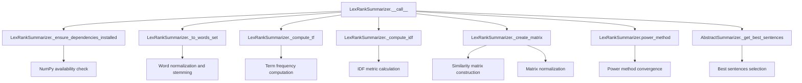

# `lex_rank.py`

## `sumy.summarizers.lex_rank.LexRankSummarizer` · *class*

## Summary:
Implements the LexRank algorithm for automatic text summarization by computing sentence importance scores based on similarity matrices.

## Description:
The LexRankSummarizer is a concrete summarization algorithm that ranks sentences based on their similarity to other sentences in a document. It constructs a similarity matrix using TF-IDF weighted cosine similarity and applies a power method to compute stationary probabilities representing sentence importance scores. This approach models the document as a graph where sentences are nodes and similarities are edges, with more important sentences having higher influence on others.

This class is typically instantiated by users who want to generate summaries using the LexRank algorithm. It is part of the sumy library's collection of text summarization algorithms and follows the AbstractSummarizer interface.

## State:
- threshold: float, default 0.1 - similarity threshold for matrix construction
- epsilon: float, default 0.1 - convergence threshold for power method
- _stop_words: frozenset - set of words to exclude from sentence processing
- _stemmer: callable - stemming function inherited from parent class

## Lifecycle:
- Creation: Instantiate with optional stemmer parameter (inherits from AbstractSummarizer)
- Usage: Call instance with (document, sentences_count) arguments to generate summaries
- Destruction: Standard Python garbage collection

## Method Map:


## Raises:
- ValueError: When NumPy dependency is not installed (during _ensure_dependencies_installed)
- ValueError: When the stemmer parameter is not callable (inherited from AbstractSummarizer)

## Example:
```python
from sumy.summarizers.lex_rank import LexRankSummarizer
from sumy.parsers.plaintext import PlaintextParser
from sumy.nlp.tokenizers import Tokenizer

# Create parser and tokenizer
parser = PlaintextParser.from_string("Your text here...", Tokenizer("english"))
summarizer = LexRankSummarizer()  # Uses default stemmer

# Set custom stop words if needed
summarizer.stop_words = ["the", "and", "or"]

# Generate summary with 3 sentences
summary = summarizer(parser.document, 3)
for sentence in summary:
    print(sentence)
```

### `sumy.summarizers.lex_rank.LexRankSummarizer.stop_words` · *method*

## Summary:
Configures the stop words collection for the LexRank summarizer by normalizing and storing the provided words as an immutable frozenset.

## Description:
This property setter initializes the stop words that will be filtered out during text processing in the LexRank summarization algorithm. It transforms each input word through the instance's normalize_word method and stores the result as an immutable frozenset in the internal _stop_words attribute. Stop words are typically common words like "the", "and", "is" that are filtered out during text analysis to focus on meaningful content. This method enables customization of the stop words list to improve summarization quality for specific domains or languages.

## Args:
    words (iterable): An iterable collection of words to be treated as stop words. Each word will be normalized using self.normalize_word() before storage. Common examples include lists of strings or other iterable objects containing textual words.

## Returns:
    None: This method does not return a value.

## Raises:
    None: This method does not explicitly raise exceptions, though it may propagate exceptions from self.normalize_word() if individual words are incompatible with the normalization process.

## State Changes:
    Attributes READ: None
    Attributes WRITTEN: self._stop_words

## Constraints:
    Preconditions: 
    - The input `words` should be iterable
    - Each word in `words` should be compatible with self.normalize_word()
    
    Postconditions:
    - self._stop_words is updated to a frozenset containing the normalized versions of all input words
    - The frozenset ensures immutability of the stop words collection for consistent performance
    - Normalized words are stored in a consistent format for efficient lookup during text processing

## Side Effects:
    None - this method only modifies the internal state of the object and has no external side effects.

### `sumy.summarizers.lex_rank.LexRankSummarizer.__call__` · *method*

## Summary:
Computes sentence importance scores using the LexRank algorithm and returns the most relevant sentences from a document.

## Description:
This method implements the core LexRank summarization algorithm by computing term frequency-inverse document frequency scores, constructing a similarity matrix between sentences, applying the power method to calculate sentence importance scores, and selecting the highest-ranked sentences. It serves as the primary interface for generating text summaries using the LexRank approach.

The method is designed to be called as an instance method on LexRankSummarizer objects, following the standard pattern for summarizer implementations in the sumy library. It processes documents through multiple stages of text analysis and ranking before returning the final summary.

## Args:
    document (Document): The input document containing sentences to summarize
    sentences_count (int): The number of sentences to include in the final summary

## Returns:
    tuple: A tuple of sentences ordered by their importance scores, representing the summary

## Raises:
    ValueError: When required NumPy dependency is not installed (via _ensure_dependencies_installed)

## State Changes:
    Attributes READ: 
        - self.threshold: Used in matrix creation for similarity thresholding
        - self.epsilon: Used in power method convergence criteria
        - self._stop_words: Used in word processing via _to_words_set

## Constraints:
    Preconditions:
        - Document must contain at least one sentence
        - NumPy must be installed (checked via _ensure_dependencies_installed)
        - Sentences_count must be a valid integer for _get_best_sentences
        
    Postconditions:
        - Returns exactly sentences_count sentences (or fewer if document has insufficient sentences)
        - Sentences in result maintain their original relative ordering
        - All returned sentences are from the original document

## Side Effects:
    - Checks for NumPy installation and raises ValueError if missing
    - May perform I/O operations during dependency checking
    - Uses NumPy for mathematical computations

### `sumy.summarizers.lex_rank.LexRankSummarizer._ensure_dependencies_installed` · *method*

## Summary:
Ensures NumPy dependency is available for LexRank summarization algorithm.

## Description:
This static method validates that the NumPy library is properly installed and importable. It is called during the summarization process to prevent runtime errors when the algorithm attempts to use NumPy operations. The method is invoked automatically by the summarizer's main processing pipeline before any numerical computations are performed.

## Args:
    None

## Returns:
    None

## Raises:
    ValueError: When NumPy is not importable or None, indicating the dependency is missing.

## State Changes:
    Attributes READ: None
    Attributes WRITTEN: None

## Constraints:
    Preconditions: The method assumes NumPy is either properly imported or None.
    Postconditions: If successful, guarantees NumPy is available for subsequent operations.

## Side Effects:
    None

### `sumy.summarizers.lex_rank.LexRankSummarizer._to_words_set` · *method*

## Summary:
Converts a sentence into a list of stemmed, normalized words while filtering out stop words.

## Description:
Processes a sentence by normalizing each word, applying stemming, and filtering out stop words to create a clean set of words for text analysis. This method is used during the LexRank summarization process to prepare sentences for similarity calculations and vector representations.

## Args:
    sentence (object): A sentence object with a `words` attribute that provides access to individual words in the sentence. Each word in the sentence should be compatible with the normalization and stemming functions.

## Returns:
    list[str]: A list of stemmed and normalized words from the sentence, excluding any words found in the stop words collection. Words are returned in the same order as they appear in the original sentence.

## Raises:
    None explicitly raised, but may propagate exceptions from `self.normalize_word()` or `self.stem_word()` if the sentence structure is invalid or contains incompatible word types.

## State Changes:
    Attributes READ: self.normalize_word, self.stem_word, self._stop_words
    Attributes WRITTEN: None

## Constraints:
    Preconditions:
    - The sentence object must have a `words` attribute that is iterable
    - Each item in sentence.words must be compatible with self.normalize_word()
    - self._stop_words must be a collection that supports the 'in' operator (typically a frozenset)
    
    Postconditions:
    - All returned words are normalized and stemmed using the instance's stemmer
    - No stop words are included in the returned list
    - The order of words in the returned list matches their order in the original sentence
    - Empty sentences will return an empty list

## Side Effects:
    None - this method has no side effects beyond standard string operations and function calls.

### `sumy.summarizers.lex_rank.LexRankSummarizer._compute_tf` · *method*

## Summary:
Computes normalized term frequency metrics for a collection of sentences.

## Description:
This method calculates normalized term frequencies for each sentence in the input collection. For each sentence, it determines the maximum term frequency and normalizes all term frequencies by dividing by this maximum value. This normalization ensures that term frequencies are scaled between 0 and 1, which is essential for the LexRank algorithm's similarity calculations.

The method is called during the preprocessing phase of the LexRank summarization process, specifically as part of the feature extraction pipeline that prepares term frequency and inverse document frequency metrics for sentence scoring.

## Args:
    sentences (list[list[str]]): A list of sentences, where each sentence is represented as a list of terms (words).

## Returns:
    list[dict[str, float]]: A list of dictionaries, where each dictionary maps terms to their normalized frequency values (between 0 and 1) for the corresponding sentence.

## Raises:
    None explicitly raised, but may encounter issues if sentences contain unexpected data types.

## State Changes:
    Attributes READ: None
    Attributes WRITTEN: None

## Constraints:
    Preconditions:
        - Input sentences should be tokenized lists of terms
        - Each sentence should be a list of strings
    Postconditions:
        - Returns a list of dictionaries with the same length as input sentences
        - Each dictionary contains term-frequency mappings for its corresponding sentence
        - All frequency values are in the range [0, 1]

## Side Effects:
    None

### `sumy.summarizers.lex_rank.LexRankSummarizer._find_tf_max` · *method*

## Summary:
Finds the maximum term frequency value in a term frequency dictionary, returning 1 for empty dictionaries.

## Description:
This method extracts the maximum value from the term frequency dictionary, which is used to normalize term frequencies in the LexRank summarization algorithm. When processing sentences for summarization, term frequencies must be normalized to ensure consistent scaling between 0 and 1. This method provides the maximum frequency value needed for such normalization.

The method is called during the term frequency computation phase of the LexRank algorithm, specifically within the `_compute_tf` method where it helps normalize term frequencies for each sentence.

## Args:
    terms (dict[str, int]): A dictionary mapping terms to their frequency counts.

## Returns:
    float: The maximum term frequency value from the dictionary, or 1 if the dictionary is empty.

## Raises:
    None

## State Changes:
    Attributes READ: None
    Attributes WRITTEN: None

## Constraints:
    Preconditions:
        - Input should be a dictionary-like object with numeric values
        - Terms should be hashable keys
    Postconditions:
        - Returns a positive numeric value
        - Handles empty dictionaries gracefully by returning 1

## Side Effects:
    None

### `sumy.summarizers.lex_rank.LexRankSummarizer._compute_idf` · *method*

## Summary:
Computes inverse document frequency (IDF) metrics for terms across a collection of sentences.

## Description:
Calculates IDF values for each unique term found in the provided sentences using the standard logarithmic IDF formula. This method is a core component of the LexRank summarization algorithm, providing term weighting that reduces the influence of frequently occurring terms while amplifying rare but potentially important terms.

The method is called internally by the LexRankSummarizer during the summarization process, specifically from the `__call__` method where it receives pre-processed sentences from `_to_words_set`.

## Args:
    sentences (list[list[str]]): A list of sentences, where each sentence is represented as a list of terms/words.

## Returns:
    dict[str, float]: A dictionary mapping each unique term to its computed IDF value, where IDF = log(N / (1 + n_j)) and N is the total number of sentences, n_j is the count of sentences containing term j.

## Raises:
    None explicitly raised by this method.

## State Changes:
    Attributes READ: None
    Attributes WRITTEN: None

## Constraints:
    Preconditions:
        - Input sentences must be a list of lists containing string terms
        - Each inner list represents a sentence with terms already processed (normalized, stemmed, stop words removed)
        
    Postconditions:
        - Returns a dictionary with one entry per unique term found in the sentences
        - All IDF values are positive floating-point numbers
        - The computation is deterministic for identical inputs

## Side Effects:
    None

### `sumy.summarizers.lex_rank.LexRankSummarizer._create_matrix` · *method*

## Summary:
Creates a normalized transition probability matrix for sentence similarity using cosine similarity with thresholding.

## Description:
Constructs a square transition probability matrix where each cell [i,j] represents the normalized similarity between sentence i and sentence j. The method computes cosine similarity between sentence pairs, applies a threshold to binarize similarities (setting values above threshold to 1.0, others to 0.0), and normalizes rows by their out-degree to create a stochastic matrix suitable for the power method calculation in LexRank algorithm.

This method is called during the LexRank summarization process by the `__call__` method to prepare the transition matrix used in calculating sentence importance scores. The resulting matrix has the property that each row sums to 1.0, making it a valid stochastic matrix for iterative computation.

## Args:
    sentences (list): List of sentence word lists to compare
    threshold (float): Similarity threshold above which values are set to 1.0
    tf_metrics (list): Term frequency metrics for each sentence
    idf_metrics (dict): Inverse document frequency metrics for terms

## Returns:
    numpy.ndarray: A normalized square matrix of shape (n_sentences, n_sentences) where each row sums to 1.0, representing transition probabilities between sentences

## Raises:
    None explicitly raised

## State Changes:
    Attributes READ: 
        - None
    
    Attributes WRITTEN:
        - None (modifies local variables only)

## Constraints:
    Preconditions:
        - Sentences list must not be empty
        - Threshold must be a valid numeric value
        - TF and IDF metrics must correspond to the sentences
        - All sentences must be valid word lists
    
    Postconditions:
        - Matrix dimensions equal number of input sentences
        - All matrix values are either 0.0 or 1.0 due to thresholding
        - Each row sums to 1.0 after normalization
        - Returned matrix is a valid stochastic matrix for power method computation

## Side Effects:
    - Uses NumPy for matrix operations
    - Calls self.cosine_similarity() method internally

### `sumy.summarizers.lex_rank.LexRankSummarizer.cosine_similarity` · *method*

## Summary:
Computes a weighted cosine similarity between two sentences using TF-IDF metrics.

## Description:
This utility function calculates a modified cosine similarity between two sentences by considering term frequencies and IDF weights. It's used internally by the LexRank summarizer to measure semantic similarity between sentences for ranking purposes.

## Args:
    sentence1 (iterable): First sentence represented as a collection of terms/words.
    sentence2 (iterable): Second sentence represented as a collection of terms/words.
    tf1 (dict): Term frequency mapping for the first sentence.
    tf2 (dict): Term frequency mapping for the second sentence.
    idf_metrics (dict): Inverse Document Frequency metrics for terms.

## Returns:
    float: Cosine similarity score between 0.0 and 1.0, where 0.0 indicates no similarity and 1.0 indicates identical sentences. Returns 0.0 when either sentence has zero magnitude.

## Raises:
    None explicitly raised.

## State Changes:
    None.

## Constraints:
    Preconditions:
        - Both sentences must be iterable collections of terms
        - tf1, tf2, and idf_metrics must be dictionaries with compatible keys
        - All terms referenced in sentences must exist as keys in tf1, tf2, and idf_metrics
    
    Postconditions:
        - Returns a float value in the range [0.0, 1.0]
        - If both sentences have zero magnitude, returns 0.0

## Side Effects:
    None.

### `sumy.summarizers.lex_rank.LexRankSummarizer.power_method` · *method*

## Summary:
Computes the principal eigenvector of a transition matrix using the power iteration method for sentence ranking in LexRank summarization.

## Description:
Implements the power iteration algorithm to find the dominant eigenvector of a transition matrix, which represents sentence importance scores. This method is used internally by LexRankSummarizer to calculate sentence weights based on lexical similarity between sentences. The algorithm iteratively applies the transition matrix to an initial probability vector until convergence.

## Args:
    matrix (numpy.ndarray): Square transition matrix of shape (n, n) representing sentence similarities, where each row sums to 1 (row-stochastic matrix).
    epsilon (float): Convergence threshold for the iterative process. Algorithm stops when the L2 norm of the difference between consecutive vectors is less than this value.

## Returns:
    numpy.ndarray: Probability vector of shape (n,) containing normalized sentence importance scores, where each element represents the weight of a sentence and all elements sum to 1.0.

## Raises:
    None explicitly raised, but may raise numpy-related exceptions if matrix operations fail.

## State Changes:
    None - This is a pure function that doesn't modify any object state.

## Constraints:
    Preconditions:
        - Matrix must be square (n×n dimensions)
        - Matrix must be row-stochastic (each row sums to 1)
        - Epsilon must be a positive float
    Postconditions:
        - Returned vector elements are non-negative
        - Elements sum to exactly 1.0 (normalized probability distribution)

## Side Effects:
    None - Pure mathematical computation with no external I/O or state mutations.

