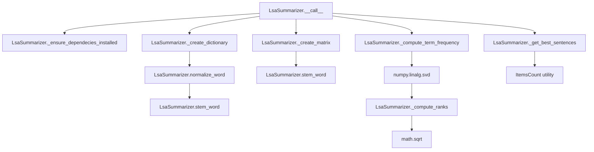

# `lsa.py`

## `sumy.summarizers.lsa.LsaSummarizer` · *class*

## Summary:
Latent Semantic Analysis (LSA) summarizer that uses singular value decomposition to identify and rank sentences based on semantic similarity.

## Description:
The LsaSummarizer implements a text summarization technique based on Latent Semantic Analysis, which analyzes the relationships between words and sentences in a document to identify the most informative content. It constructs a term-document matrix and applies singular value decomposition to reduce dimensionality and extract semantic patterns. This approach is particularly effective for identifying semantically similar sentences that represent key topics in the document.

This summarizer is typically instantiated by users who want to generate concise summaries using the LSA algorithm. It inherits from AbstractSummarizer and implements the required __call__ method to process documents and return ranked sentences.

## State:
- MIN_DIMENSIONS: Class constant (integer) representing minimum number of dimensions for SVD reduction, set to 3
- REDUCTION_RATIO: Class constant (float) controlling the proportion of dimensions retained in SVD, set to 1.0 (full retention)
- _stop_words: Instance attribute (frozenset) containing normalized and stemmed stop words to exclude from analysis
- _stemmer: Inherited from AbstractSummarizer, used for word stemming operations

## Lifecycle:
- Creation: Instantiate with optional stemmer parameter (defaults to null_stemmer from parent class)
- Usage: Call instance with (document, sentences_count) arguments where document is a Document object and sentences_count is the desired number of sentences in the summary
- Destruction: Standard Python garbage collection; no special cleanup required

## Method Map:


## Raises:
- ValueError: Raised by _ensure_dependecies_installed when NumPy is not installed
- ValueError: Raised by AbstractSummarizer.__init__ when stemmer parameter is not callable

## Example:
```python
from sumy.summarizers.lsa import LsaSummarizer
from sumy.parsers.plaintext import PlaintextParser
from sumy.nlp.tokenizers import Tokenizer

# Create parser and tokenizer
parser = PlaintextParser.from_file("document.txt", Tokenizer("english"))
summarizer = LsaSummarizer()  # Uses default null_stemmer

# Set custom stop words if needed
summarizer.stop_words = ["the", "and", "or"]

# Generate summary with 3 sentences
summary = summarizer(parser.document, 3)
for sentence in summary:
    print(sentence)
```

### `sumy.summarizers.lsa.LsaSummarizer.stop_words` · *method*

## Summary:
Setter for the stop words property that normalizes and stores stop words as an immutable frozenset.

## Description:
This method serves as the setter for the `stop_words` property in the LSA summarizer. It normalizes each word in the input iterable using the instance's `normalize_word` method and stores the result as an immutable frozenset in the private `_stop_words` attribute. The normalized stop words are used during document processing to filter out common words that do not contribute meaningfully to semantic analysis.

This property setter is typically invoked when configuring the summarizer instance, either during initialization or through direct assignment. The getter for this property returns the current frozenset of normalized stop words.

## Args:
    words (iterable): An iterable of words (strings) to be treated as stop words. Each word will be normalized using `self.normalize_word()` before storage.

## Returns:
    None: This method does not return a value.

## Raises:
    AttributeError: If `self.normalize_word` is not callable or does not accept the provided word types.
    TypeError: If `words` is not iterable or contains non-string elements that cause issues during normalization.

## State Changes:
    Attributes READ: None
    Attributes WRITTEN: self._stop_words

## Constraints:
    Preconditions: 
    - The `words` parameter must be iterable
    - Each item in `words` must be compatible with `self.normalize_word()`
    
    Postconditions:
    - `self._stop_words` is updated to contain normalized versions of all input words
    - The stored value is an immutable frozenset for efficient lookup
    - All words are normalized using the instance's `normalize_word` method

## Side Effects:
    None - this method has no external side effects beyond modifying the instance's internal state.

### `sumy.summarizers.lsa.LsaSummarizer.__call__` · *method*

## Summary:
Performs Latent Semantic Analysis (LSA) based text summarization by computing sentence rankings based on semantic similarity.

## Description:
This method implements the core LSA summarization algorithm by constructing a term-document matrix, applying term frequency weighting, performing singular value decomposition, and computing sentence ranks based on the latent semantic space. It selects the most representative sentences from the document based on their computed importance scores.

The method is designed to be called as part of the summarization pipeline, typically by higher-level components that manage document processing and result formatting. It leverages the parent class's text processing utilities for word normalization and stemming.

## Args:
    document (object): A document object containing sentences to summarize. Must have a `sentences` attribute and a `words` attribute for dictionary creation.
    sentences_count (int): The number of sentences to include in the final summary.

## Returns:
    tuple: A tuple containing the selected sentences in their original order, sorted by importance. Returns an empty tuple if no meaningful sentences can be processed.

## Raises:
    ValueError: Raised by `_ensure_dependecies_installed()` if NumPy is not available, or by `_get_best_sentences()` if the sentence count specification is invalid.

## State Changes:
    Attributes READ: 
        - None (reads from document object, not instance attributes)
    
    Attributes WRITTEN:
        - None (method is read-only with respect to instance state)

## Constraints:
    Preconditions:
        - Document must have valid sentences and words attributes
        - Sentences count must be a valid integer or convertible value
        - NumPy must be installed and available
        
    Postconditions:
        - Returns exactly the requested number of sentences (or fewer if insufficient)
        - Sentences in result maintain their original relative ordering
        - Method is idempotent - calling with same inputs produces same results

## Side Effects:
    - May issue warnings via `warnings.warn()` if word count is less than sentence count
    - Uses NumPy for matrix operations and SVD computation
    - Calls parent class methods for text processing and result selection

### `sumy.summarizers.lsa.LsaSummarizer._ensure_dependecies_installed` · *method*

## Summary:
Validates that the NumPy dependency is available for Latent Semantic Analysis (LSA) summarization.

## Description:
Checks whether the NumPy library is properly installed and available for use in LSA-based text summarization. This method is called internally by the summarization pipeline to ensure all required dependencies are present before proceeding with computations.

The method is invoked during the initialization phase of the summarization process, specifically within the `__call__` method of the LsaSummarizer class. It serves as a guard clause to prevent runtime errors that would occur if NumPy were missing when matrix operations are required.

## Args:
    None

## Returns:
    None

## Raises:
    ValueError: When NumPy is not available (though the current implementation has a logical flaw - it checks `numpy is None` which will never be true since numpy is imported at module level).

## State Changes:
    Attributes READ: 
        - None
    
    Attributes WRITTEN:
        - None

## Constraints:
    Preconditions:
        - The method should be called before any NumPy-dependent operations
        - The LsaSummarizer class must be properly initialized
        
    Postconditions:
        - Execution continues only if NumPy is available
        - No state changes occur on the LsaSummarizer instance

## Side Effects:
    - Raises an exception if NumPy is not available (but the current implementation has a logical error)

### `sumy.summarizers.lsa.LsaSummarizer._create_dictionary` · *method*

*No documentation generated.*

### `sumy.summarizers.lsa.LsaSummarizer._create_matrix` · *method*

## Summary:
Creates a term-document matrix for Latent Semantic Analysis by counting word occurrences in sentences.

## Description:
Constructs a numerical matrix representation where rows correspond to unique words from the dictionary and columns correspond to sentences in the document. Each cell [i,j] contains the frequency count of word i in sentence j. This matrix serves as input for Singular Value Decomposition (SVD) in the LSA summarization algorithm.

The method performs word stemming using the instance's stem_word method and only includes words that exist in the provided dictionary. When the number of unique words is less than the number of sentences, a warning is issued as this may affect LSA performance.

This method is called internally by the LsaSummarizer.__call__ method as part of the LSA summarization pipeline, which follows these steps: create dictionary → create matrix → compute term frequency → perform SVD → compute ranks → select best sentences.

## Args:
    document (Document): The input document containing sentences to process. Must have sentences and words properties.
    dictionary (dict): Mapping of stemmed words to row indices in the resulting matrix. Keys are stemmed words, values are integer indices.

## Returns:
    numpy.ndarray: A 2D matrix of shape (len(dictionary), len(document.sentences)) where each element represents word frequency in sentences. Matrix is initialized with zeros and populated with occurrence counts.

## Raises:
    None explicitly raised by this method. May issue a UserWarning via Python's warnings module when words_count < sentences_count.

## State Changes:
    Attributes READ: None
    Attributes WRITTEN: None

## Constraints:
    Preconditions: 
    - The document must have a sentences property containing iterable sentences
    - The dictionary must map stemmed words to integer indices
    - The dictionary size must be compatible with the number of sentences
    Postconditions:
    - Returns a numpy array with dimensions matching the dictionary and sentence count
    - All words in sentences are stemmed using self.stem_word before lookup in dictionary
    - Matrix elements are integer counts representing word frequencies

## Side Effects:
    Issues a warning via Python's warnings module when the number of words in dictionary is less than the number of sentences.

### `sumy.summarizers.lsa.LsaSummarizer._compute_term_frequency` · *method*

## Summary:
Normalizes term frequencies in a document-term matrix using log normalization with smoothing.

## Description:
This method applies term frequency normalization to a document-term matrix by dividing each term frequency by the maximum frequency in that column, then applying smoothing to prevent zero values. This normalization is a crucial preprocessing step in Latent Semantic Analysis (LSA) that ensures consistent scaling across different terms while maintaining the relative importance of terms within documents.

The method is called during the LSA summarization process, specifically after creating the initial document-term matrix but before performing singular value decomposition. This normalization helps improve the quality of semantic relationships captured by the LSA algorithm.

## Args:
    matrix (numpy.ndarray): A 2D array representing the document-term matrix where rows correspond to terms and columns to documents.
    smooth (float): Smoothing parameter for frequency normalization. Must be between 0.0 and 1.0 (exclusive of 1.0). Defaults to 0.4.

## Returns:
    numpy.ndarray: The normalized document-term matrix with smoothed term frequencies.

## Raises:
    AssertionError: When the smooth parameter is outside the valid range [0.0, 1.0).

## State Changes:
    Attributes READ: None
    Attributes WRITTEN: None

## Constraints:
    Preconditions:
        - The matrix parameter must be a valid 2D numpy array
        - The smooth parameter must satisfy 0.0 <= smooth < 1.0
    Postconditions:
        - All values in the returned matrix are between smooth and 1.0
        - Zero-frequency terms remain zero (no smoothing applied)
        - Matrix dimensions remain unchanged

## Side Effects:
    None

### `sumy.summarizers.lsa.LsaSummarizer._compute_ranks` · *method*

## Summary:
Computes rank scores for sentences using singular values and right singular vectors from SVD decomposition in LSA summarization.

## Description:
This private method implements the core ranking computation for the Latent Semantic Analysis (LSA) summarization algorithm. It processes the singular values (sigma) and right singular vectors (v_matrix) obtained from SVD decomposition to calculate importance scores for each sentence in the document.

The method performs dimensionality reduction by selecting the most significant singular values based on MIN_DIMENSIONS and REDUCTION_RATIO constants, then computes weighted sums for each sentence vector to determine their relative importance scores.

## Args:
    sigma (tuple): Singular values from SVD decomposition, sorted in descending order
    v_matrix (numpy.ndarray): Right singular vectors matrix from SVD decomposition with shape (n, m) where n is the number of singular values

## Returns:
    list[float]: Rank scores for each sentence in the document, representing their relative importance in the summarization process

## Raises:
    AssertionError: When the length of sigma doesn't match the number of rows in v_matrix

## State Changes:
    Attributes READ: None
    Attributes WRITTEN: None

## Constraints:
    Preconditions:
        - sigma must be a tuple/list containing singular values from SVD decomposition
        - v_matrix must be a numpy array with compatible dimensions (rows = len(sigma))
        - The method assumes proper SVD decomposition has been performed
    
    Postconditions:
        - Returns a list of rank scores with length equal to the number of columns in v_matrix
        - All returned values are non-negative real numbers representing sentence importance

## Side Effects:
    None

