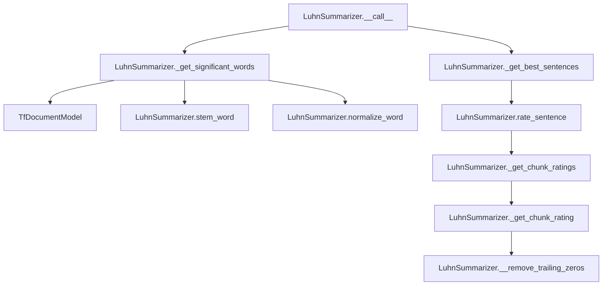

# `luhn.py`

## `sumy.summarizers.luhn.LuhnSummarizer` · *class*

## Summary:
Implements the Luhn summarization algorithm, which identifies important sentences based on significant word frequency and distribution patterns.

## Description:
The LuhnSummarizer is a concrete implementation of the text summarization algorithm proposed by Qing Lu and Chin-Yew Lin. It works by identifying significant words in a document based on term frequency and then rates sentences based on how many significant words they contain and how those words are distributed within the sentence. This approach prioritizes sentences that contain important words in meaningful sequences rather than just high-frequency words.

This summarizer is typically instantiated by users who want to generate concise summaries of documents using the Luhn algorithm. It inherits from AbstractSummarizer, which provides common text processing utilities like word stemming and normalization.

The algorithm operates in several phases:
1. Extract significant words from the document based on term frequency
2. Rate sentences based on the distribution of significant words within them
3. Select the highest-rated sentences to form the summary

Key characteristics of the Luhn algorithm:
- Words are normalized and stemmed before processing
- Stop words are filtered out before significance calculation
- Sentences are rated based on chunks of significant words separated by gaps
- A chunk is defined as a sequence of significant words with at most max_gap_size non-significant words between them
- Chunk ratings are calculated using a formula that rewards both the number of significant words and their density

## State:
- max_gap_size (int): Maximum number of consecutive non-significant words allowed in a chunk before ending it. Default is 4.
- significant_percentage (float): Percentage of most frequent terms to consider as significant. Default is 1.0 (all terms).
- _stop_words (frozenset): Set of normalized and stemmed words to exclude from consideration. Initially empty.
- _stemmer (callable): Stemming function used for word normalization. Inherited from AbstractSummarizer.

## Lifecycle:
- Creation: Instantiate with optional stemmer parameter (inherited from AbstractSummarizer). The default stemmer is null_stemmer.
- Usage: Call instances with (document, sentences_count) arguments where document is a document object with sentences and words attributes, and sentences_count is the desired number of sentences in the summary.
- Destruction: Standard Python garbage collection handles cleanup.

## Method Map:


## Raises:
- None explicitly raised by the constructor
- May raise exceptions from parent class methods when invalid arguments are passed to __call__

## Example:
```python
from sumy.summarizers.luhn import LuhnSummarizer
from sumy.parsers.plaintext import PlaintextParser
from sumy.nlp.tokenizers import Tokenizer

# Create parser and summarizer
parser = PlaintextParser.from_file("document.txt", Tokenizer("english"))
summarizer = LuhnSummarizer()

# Customize stop words if needed
summarizer.stop_words = ["the", "and", "or"]

# Generate summary with 3 sentences
summary = summarizer(parser.document, 3)

# Print the summary sentences
for sentence in summary:
    print(sentence)
```

### `sumy.summarizers.luhn.LuhnSummarizer.stop_words` · *method*

## Summary:
Sets the stop words collection for the Luhn summarizer by normalizing input words and storing them as an immutable frozenset.

## Description:
Configures the stop words that will be excluded from significant word computation during the Luhn summarization process. This setter method processes incoming words through normalization (Unicode conversion and lowercasing) before storing them as a frozenset in the internal `_stop_words` attribute. The frozenset provides efficient membership testing for filtering out common words during text analysis.

This method is called during the initialization or configuration phase of a LuhnSummarizer instance, typically when setting custom stop words for a specific summarization task. It's separate from inline processing logic to provide clean encapsulation of stop word management and ensure consistent word normalization across the summarizer.

## Args:
    words (Iterable[str]): A collection of words to be used as stop words. Each word will be normalized using the instance's normalize_word method.

## Returns:
    None: This method does not return a value.

## Raises:
    None explicitly raised, but may propagate exceptions from normalize_word() if input words are incompatible.

## State Changes:
    Attributes READ: None
    Attributes WRITTEN: self._stop_words

## Constraints:
    Preconditions: The words parameter should be iterable and contain elements that can be processed by normalize_word().
    Postconditions: The internal _stop_words attribute is updated to contain a frozenset of normalized words.

## Side Effects:
    None: This method performs no I/O operations or external service calls. It only modifies internal object state.

### `sumy.summarizers.luhn.LuhnSummarizer.__call__` · *method*

## Summary:
Processes a document to generate a summary by selecting the most important sentences based on significant word frequency and distribution using the Luhn algorithm.

## Description:
This method implements the core summarization logic for the Luhn algorithm, a classic text summarization technique that identifies important sentences based on the frequency and distribution of significant words. It first extracts significant words from the document using term frequency analysis, then rates each sentence based on how many significant words it contains in meaningful chunks, and finally selects the top-rated sentences to form the summary.

The method follows the standard summarizer interface by accepting a document and desired sentence count, returning a tuple of the most important sentences in their original order. This approach preserves the document's structural integrity while focusing on key information.

## Args:
    document (Document): The input document containing sentences to summarize
    sentences_count (int): The number of sentences to include in the final summary

## Returns:
    tuple: A tuple of sentences selected from the input document, ordered by their original positions

## Raises:
    None

## State Changes:
    Attributes READ: 
    - self._stop_words (via _get_significant_words)
    - self.significant_percentage (via _get_significant_words)
    - self.max_gap_size (via _get_chunk_ratings)
    - self._stemmer (via stem_word)
    - self._stop_words (via normalize_word)
    Attributes WRITTEN: None

## Constraints:
    Preconditions:
    - Document must contain sentences and words
    - Sentences count must be a valid integer (positive or zero)
    - Document words must be processable by the stemmer and normalizer
    
    Postconditions:
    - Returns exactly the requested number of sentences (or fewer if insufficient input)
    - Sentences in result maintain their original relative ordering
    - Result is always a tuple of sentences

## Side Effects:
    None

### `sumy.summarizers.luhn.LuhnSummarizer._get_significant_words` · *method*

## Summary:
Extracts significant words from a collection of words by normalizing, stemming, filtering stop words, and selecting most frequent terms based on a percentage threshold.

## Description:
This method processes a collection of words to identify the most significant terms for document summarization. It applies text normalization and stemming, removes common stop words, builds a term frequency model, selects the most frequent terms according to a configured percentage, and filters out terms that appear only once. This method is called during the summarization process to identify key terminology that represents the document's main topics.

## Args:
    words (iterable[str]): Collection of words to process for significance extraction

## Returns:
    tuple[str]: Tuple of significant words that meet the frequency criteria, ordered by frequency

## Raises:
    None explicitly raised

## State Changes:
    Attributes READ: self.normalize_word, self.stem_word, self._stop_words, self.significant_percentage
    Attributes WRITTEN: None

## Constraints:
    Preconditions: 
    - Input words should be valid string representations
    - Class must have properly initialized normalize_word, stem_word methods
    - Class must have _stop_words and significant_percentage attributes defined
    
    Postconditions:
    - Returned tuple contains only words that appear more than once in the input
    - Returned words are normalized and stemmed versions of input words
    - Number of returned words is limited by significant_percentage setting

## Side Effects:
    None

### `sumy.summarizers.luhn.LuhnSummarizer.rate_sentence` · *method*

## Summary:
Computes the quality rating for a sentence based on the maximum significance of its word chunks.

## Description:
Evaluates a sentence's importance by analyzing contiguous chunks of significant words and returning the highest quality rating among those chunks. This method implements a key component of the Luhn summarization algorithm, where sentences are scored based on how effectively they cluster significant words together.

The method delegates to `_get_chunk_ratings` to identify significant word chunks and compute individual chunk ratings, then returns the maximum rating. If no significant word chunks are found, it returns zero, indicating the sentence contains no meaningful clusters of important words.

This method is called internally by the summarization pipeline during sentence ranking, specifically by `_get_best_sentences` which uses it as a callback function to score sentences.

## Args:
    sentence (Sentence): The sentence object to rate, containing a `words` attribute with word strings
    significant_stems (set): Set of stemmed word forms considered significant for summarization purposes

## Returns:
    float: The maximum quality rating among all significant word chunks in the sentence. Returns 0 when no significant chunks are found.

## Raises:
    None explicitly raised

## State Changes:
    Attributes READ: 
    - self._get_chunk_ratings: Called to compute chunk ratings
    - self.max_gap_size: Referenced indirectly through _get_chunk_ratings method
    
    Attributes WRITTEN: 
    - None

## Constraints:
    Preconditions:
    - `sentence` must have a `words` attribute that is iterable
    - `significant_stems` must support membership testing ('in' operator)
    - `self` must be an instance of LuhnSummarizer with proper initialization
    
    Postconditions:
    - Returns a non-negative floating-point number
    - Value represents the highest quality score from significant word chunks
    - Zero return indicates no significant word clustering in the sentence

## Side Effects:
    None

### `sumy.summarizers.luhn.LuhnSummarizer._get_chunk_ratings` · *method*

## Summary:
Identifies contiguous chunks of significant words in a sentence and computes quality ratings for each chunk.

## Description:
Processes a sentence's words to detect contiguous sequences of significant words (those present in the significant_stems set) and assigns each such chunk a quality rating. The method groups consecutive significant words into chunks, automatically terminates chunks when encountering too many consecutive insignificant words (based on max_gap_size), and computes a normalized quality rating for each chunk using the _get_chunk_rating helper method.

This method is invoked by the rate_sentence method during the Luhn summarization algorithm to evaluate sentence quality based on significant word clustering.

## Args:
    sentence (Sentence): The sentence object containing words to process, with a words property returning an iterable of word strings
    significant_stems (set): Set of stemmed word forms considered significant for summarization purposes

## Returns:
    tuple[float]: A tuple of floating-point ratings, one for each identified chunk in the sentence. Returns an empty tuple when no chunks are found.

## Raises:
    None explicitly raised

## State Changes:
    Attributes READ: 
    - self.max_gap_size: Used to determine maximum gap size for terminating chunks
    - self.stem_word: Called to stem words for comparison against significant_stems
    
    Attributes WRITTEN: 
    - None

## Constraints:
    Preconditions:
    - sentence must have a words attribute containing iterable of words
    - significant_stems must be a set-like object supporting 'in' operations
    - self.max_gap_size must be a non-negative integer
    
    Postconditions:
    - Returns a tuple of non-negative floating-point numbers
    - Each number represents a chunk rating calculated by _get_chunk_rating method
    - Empty tuple returned when no significant word chunks are detected

## Side Effects:
    None

### `sumy.summarizers.luhn.LuhnSummarizer._get_chunk_rating` · *method*

## Summary:
Calculates a normalized significance rating for a chunk of words based on the number of significant words it contains.

## Description:
This method computes a rating for a word chunk by counting significant words and applying a mathematical formula that penalizes chunks with few significant words while rewarding those with many significant words. It's used in the Luhn summarization algorithm to score sentence fragments for ranking purposes.

The method removes trailing zero elements (non-significant words) from the chunk before processing, ensuring accurate calculation of significant word density.

## Args:
    chunk (list[int]): A list of integers representing word significance (1 for significant, 0 for non-significant) in a sentence fragment.

## Returns:
    float: The calculated chunk rating. Returns 0 when there is exactly one significant word in the chunk, otherwise returns (significant_words^2) / words_count.

## Raises:
    AssertionError: When the chunk contains no words after removing trailing zeros (words_count <= 0).

## State Changes:
    Attributes READ: None
    Attributes WRITTEN: None

## Constraints:
    Preconditions: 
    - The chunk parameter must be a non-empty list of integers (0 or 1)
    - Each integer represents word significance (1 = significant, 0 = non-significant)
    
    Postconditions:
    - Returns a non-negative float value
    - Returns 0 when exactly one significant word is present in the chunk
    - Returns a value greater than 0 when more than one significant word is present

## Side Effects:
    None

### `sumy.summarizers.luhn.LuhnSummarizer.__remove_trailing_zeros` · *method*

## Summary:
Removes trailing zero elements from a collection to prepare chunk data for rating calculations.

## Description:
This method removes trailing zeros from a collection, typically used to clean up word significance chunks before computing sentence ratings in the Luhn summarization algorithm. It ensures that trailing insignificant words (represented as zeros) don't affect the rating computation.

The method is called internally by `_get_chunk_rating` during the sentence scoring process, where chunks represent sequences of significant and insignificant words in a sentence.

## Args:
    collection (list or tuple): A sequence of integers (typically 0s and 1s) representing word significance, where 1 indicates a significant word and 0 indicates an insignificant word.

## Returns:
    list or tuple: A new collection with trailing zeros removed. If the input contains only zeros, an empty collection is returned.

## Raises:
    None explicitly raised, but may raise IndexError if collection is empty (though this would be a programming error in the calling code).

## State Changes:
    Attributes READ: None
    Attributes WRITTEN: None

## Constraints:
    Preconditions: 
    - Input collection should not be None
    - Collection should contain only integer values (typically 0s and 1s)
    
    Postconditions:
    - Returned collection will not have trailing zeros
    - Returned collection will have at least one non-zero element (unless input was all zeros)
    - Original collection is not modified (immutable operation)

## Side Effects:
    None

