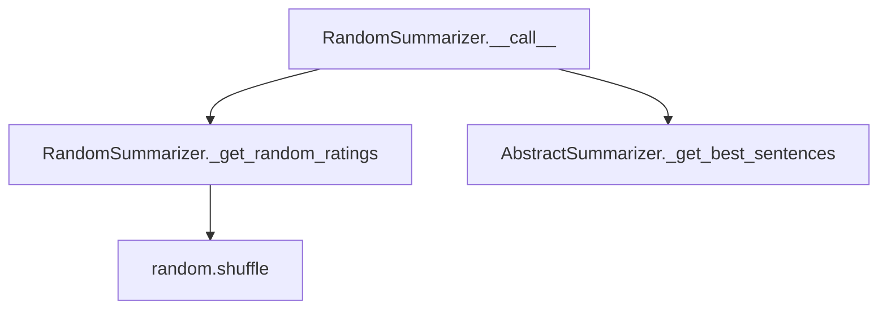

# `random.py`

## `sumy.summarizers.random.RandomSummarizer` · *class*

## Summary:
RandomSummarizer is a text summarization algorithm that selects sentences randomly for inclusion in the summary.

## Description:
The RandomSummarizer implements a simple yet effective summarization approach where sentences are assigned random ratings and then the highest-rated sentences are selected to form the summary. This approach serves as a baseline method for comparison with more sophisticated algorithms and demonstrates the concept of randomized selection in text summarization.

This class is typically instantiated by users seeking a quick, unbiased summarization method or as a control in comparative studies of summarization algorithms. It follows the standard AbstractSummarizer interface and can be used interchangeably with other summarizer implementations.

## State:
- Inherits all state from AbstractSummarizer including _stemmer
- No additional instance state is maintained
- The _get_random_ratings method generates temporary dictionaries mapping sentences to random integer ratings

## Lifecycle:
- Creation: Instantiate with optional stemmer parameter (inherits from AbstractSummarizer)
- Usage: Call instance with (document, sentences_count) arguments to generate a summary
- Destruction: Standard Python garbage collection; no special cleanup required

## Method Map:


## Raises:
- Inherited from AbstractSummarizer: ValueError when stemmer parameter is not callable
- No additional exceptions specific to RandomSummarizer

## Example:
```python
from sumy.summarizers.random import RandomSummarizer
from sumy.nlp.tokenizers import Tokenizer
from sumy.parsers.plaintext import PlaintextParser

# Create parser and tokenizer
parser = PlaintextParser.from_string("Your text content here...", Tokenizer("english"))
summarizer = RandomSummarizer()

# Generate summary with 3 sentences
summary = summarizer(parser.document, 3)
for sentence in summary:
    print(sentence)
```

### `sumy.summarizers.random.RandomSummarizer._get_random_ratings` · *method*

## Summary:
Generates a random rating for each sentence in a document to enable randomized summarization.

## Description:
This method creates a dictionary mapping each sentence to a random integer rating. The ratings are randomly shuffled integers from 0 to n-1 where n is the number of sentences. This randomization allows the summarizer to select sentences in a non-deterministic manner, providing varied summaries each time the algorithm runs.

## Args:
    sentences (list[str]): A list of sentence strings to be rated

## Returns:
    dict[str, int]: A dictionary mapping each sentence to a random integer rating between 0 and len(sentences)-1

## Raises:
    None explicitly raised

## State Changes:
    Attributes READ: None
    Attributes WRITTEN: None

## Constraints:
    Preconditions: 
    - Input sentences must be a non-empty list
    - Each sentence in the list must be a string
    
    Postconditions:
    - The returned dictionary will have exactly len(sentences) key-value pairs
    - Each sentence appears exactly once as a key
    - Ratings are unique integers in the range [0, len(sentences)-1]

## Side Effects:
    None

