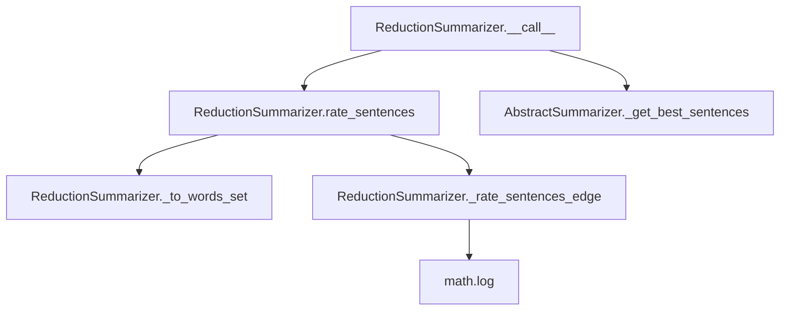

# `reduction.py`

## `sumy.summarizers.reduction.ReductionSummarizer` · *class*

## Summary:
ReductionSummarizer is a sentence-based text summarization algorithm that rates sentences based on their similarity to other sentences in the document using a pairwise comparison approach with logarithmic normalization.

## Description:
The ReductionSummarizer implements a reduction-based text summarization technique where sentences are rated according to their similarity with other sentences in the document. It calculates similarity by comparing word sets from different sentences and normalizes the scores using logarithmic scaling. This approach emphasizes sentences that share significant vocabulary with multiple other sentences in the document.

The algorithm works by:
1. Converting each sentence to a set of stemmed, normalized words (excluding stop words)
2. Comparing every pair of sentences using a similarity metric based on shared words
3. Accumulating similarity scores for each sentence
4. Selecting the highest-scoring sentences using the parent class's selection mechanism

This summarizer is typically used when a simple yet effective sentence selection mechanism is needed, particularly for documents where redundancy and shared vocabulary indicate important content. It's part of the sumy library's collection of text summarization algorithms.

## State:
- _stop_words: frozenset of normalized and stemmed words that should be excluded from sentence comparisons
- The class inherits stem_word and normalize_word methods from AbstractSummarizer for text processing

## Lifecycle:
- Creation: Instantiate with optional stemmer parameter (inherited from AbstractSummarizer)
- Usage: Call instance with (document, sentences_count) arguments where document contains sentences and sentences_count specifies how many sentences to return
- Destruction: Standard Python garbage collection; no special cleanup required

## Method Map:


## Raises:
- None explicitly raised by the class itself, though inherited methods may raise exceptions
- ValueError may be raised by parent class during initialization if stemmer is not callable

## Example:
```python
from sumy.summarizers.reduction import ReductionSummarizer
from sumy.nlp.tokenizers import Tokenizer
from sumy.parsers.plaintext import PlaintextParser

# Create summarizer
summarizer = ReductionSummarizer()

# Set custom stop words if needed
summarizer.stop_words = ["the", "and", "or"]

# Parse document
parser = PlaintextParser.from_string("Your long text here...", Tokenizer("english"))
document = parser.document

# Generate summary
summary = summarizer(document, sentences_count=3)
for sentence in summary:
    print(sentence)
```

### `sumy.summarizers.reduction.ReductionSummarizer.stop_words` · *method*

## Summary:
Sets the collection of stop words to be excluded from sentence analysis during text summarization.

## Description:
Configures the stop words that will be filtered out when processing sentences for summarization. This method normalizes each input word using the instance's normalize_word method before storing them as an immutable frozenset in the internal _stop_words attribute.

The stop words are used during sentence processing in the _to_words_set method to exclude common words that don't contribute meaningful content to the summary.

## Args:
    words (iterable): An iterable of words to be treated as stop words. These will be normalized using self.normalize_word before storage.

## Returns:
    None: This method does not return a value.

## Raises:
    None explicitly raised by this method, though underlying normalize_word or frozenset construction may raise exceptions for invalid inputs.

## State Changes:
    Attributes READ: None
    Attributes WRITTEN: self._stop_words

## Constraints:
    Preconditions: The input 'words' should be iterable containing elements that can be processed by self.normalize_word.
    Postconditions: self._stop_words is set to a frozenset of normalized words.

## Side Effects:
    None: This method performs no I/O operations or external service calls. It only modifies the internal state of the object.

### `sumy.summarizers.reduction.ReductionSummarizer.__call__` · *method*

## Summary:
Processes a document and returns the most important sentences based on pairwise similarity scoring.

## Description:
This method serves as the primary interface for the reduction-based text summarization algorithm. It orchestrates the summarization process by first computing similarity-based ratings for all sentences in the document, then selecting the highest-rated sentences to form the final summary. The method is invoked during the summarization pipeline when a user requests a summary with a specific sentence count.

The reduction algorithm works by calculating pairwise similarities between sentences and accumulating these similarities as sentence ratings. Sentences that share more common words with other sentences in the document are considered more important and receive higher ratings.

## Args:
    document (Document): The input document containing sentences to be summarized
    sentences_count (int or str): The target number of sentences for the summary. Can be an integer count or percentage string (e.g., "50%")

## Returns:
    tuple[Sentences]: A tuple of sentences selected from the input document to form the summary, ordered by their computed similarity ratings

## Raises:
    None explicitly raised by this method

## State Changes:
    Attributes READ: 
        - self._stop_words: Set of words to exclude from sentence comparisons
        - self.stem_word: Method used for normalizing words before comparison
        - self.normalize_word: Method used for normalizing words before comparison
    Attributes WRITTEN: None

## Constraints:
    Preconditions:
        - The document parameter must be a valid Document object with a sentences attribute
        - The sentences_count parameter must be a positive integer or valid percentage string format
        - The document must contain at least one sentence
        - Instance must have a valid stem_word and normalize_word methods
        
    Postconditions:
        - Returns a tuple of sentences from the original document
        - The sentences are ordered by their computed similarity ratings in descending order
        - The number of returned sentences matches the requested sentences_count

## Side Effects:
    None - this method performs no I/O operations or external service calls

### `sumy.summarizers.reduction.ReductionSummarizer.rate_sentences` · *method*

## Summary:
Rates sentences in a document by computing their accumulated similarity scores with all other sentences.

## Description:
Computes similarity ratings for all sentences in the provided document by comparing each sentence against every other sentence. This method implements a reduction-based approach where each sentence accumulates similarity scores from all other sentences in the document. The resulting ratings can be used to identify the most representative sentences for summarization.

This method is called internally by the `__call__` method as part of the complete summarization pipeline, specifically during the sentence scoring phase before selecting the best sentences.

## Args:
    document: A document object containing a `sentences` attribute with sentence objects to rate.

## Returns:
    dict: A dictionary mapping each sentence object to its accumulated similarity score (float). Higher scores indicate more representative sentences.

## Raises:
    AttributeError: If document does not have a `sentences` attribute.
    TypeError: If document.sentences is not iterable or contains non-sentence objects.

## State Changes:
    Attributes READ: self._stop_words, self.normalize_word, self.stem_word
    Attributes WRITTEN: None

## Constraints:
    Preconditions:
        - document must have a `sentences` attribute that is iterable
        - Each item in document.sentences must be a sentence object with appropriate attributes
        - self._stop_words must be properly initialized
        - self.normalize_word and self.stem_word must be callable
        
    Postconditions:
        - Returns a dictionary with keys being sentence objects from the document
        - All returned scores are non-negative floating-point numbers
        - Each sentence receives at least a score of 0.0 (when no similarities exist)

## Side Effects:
    None

### `sumy.summarizers.reduction.ReductionSummarizer._to_words_set` · *method*

## Summary:
Converts a sentence into a list of stemmed, normalized words, excluding stop words.

## Description:
Processes a sentence by applying normalization and stemming to each word while filtering out stop words. This method serves as a preprocessing step to extract meaningful words from sentences for summarization algorithms.

## Args:
    sentence: A sentence object with a `words` attribute containing the words to process.

## Returns:
    list[str]: A list of processed words where each word has been:
        - Normalized using self.normalize_word()
        - Stemmed using self.stem_word() 
        - Filtered to exclude words present in self._stop_words

## Raises:
    AttributeError: If sentence does not have a `words` attribute.
    TypeError: If sentence.words is not iterable or if normalize_word/stem_word methods fail on input.

## State Changes:
    Attributes READ: self._stop_words, self.normalize_word, self.stem_word
    Attributes WRITTEN: None

## Constraints:
    Preconditions: 
    - sentence must have a `words` attribute that is iterable
    - self.normalize_word must be callable and accept individual words
    - self.stem_word must be callable and accept normalized words
    - self._stop_words must be initialized and support membership testing
    
    Postconditions:
    - Returns a list of strings representing processed words
    - All returned words are normalized, stemmed, and not in stop words list
    - Order of words in result matches order of words in input sentence
    - Empty sentences return empty lists

## Side Effects:
    None

### `sumy.summarizers.reduction.ReductionSummarizer._rate_sentences_edge` · *method*

## Summary:
Computes a normalized similarity score between two sets of words using matching word count and logarithmic normalization.

## Description:
This private method calculates the similarity between two word sets by counting matching words and applying logarithmic normalization. It's used internally by the reduction-based summarization algorithm to determine sentence relationships and assign relevance scores.

The method is called during the sentence rating phase of the summarization process, specifically when computing pairwise similarities between sentences in the document.

## Args:
    words1 (list[str]): First set of words to compare
    words2 (list[str]): Second set of words to compare

## Returns:
    float: Normalized similarity score between 0.0 and 1.0, where 0.0 indicates no similarity and higher values indicate greater similarity. Returns 0.0 when there are no matching words between the sets.

## Raises:
    AssertionError: When either words1 or words2 is empty (though this is internally guaranteed by the calling code)

## State Changes:
    Attributes READ: None
    Attributes WRITTEN: None

## Constraints:
    Preconditions:
        - Both words1 and words2 must be non-empty lists
        - Words in both lists should be normalized (lowercase, stemmed) for consistent comparison
    Postconditions:
        - Returns a float value in the range [0.0, 1.0]
        - If no words match between the sets, returns exactly 0.0
        - If all words match and lengths are positive, returns a value greater than 0.0

## Side Effects:
    None

