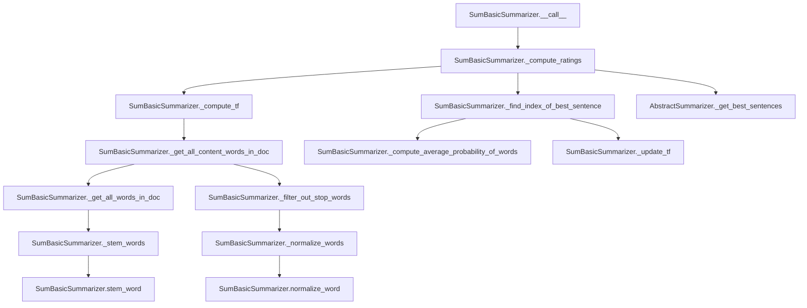

# `sum_basic.py`

## `sumy.summarizers.sum_basic.SumBasicSummarizer` · *class*

## Summary:
Implements the SumBasic summarization algorithm that selects sentences based on word frequency probabilities.

## Description:
The SumBasicSummarizer is a concrete implementation of the SumBasic text summarization algorithm. It works by iteratively selecting sentences that contain rare words, updating word frequencies after each selection, and continuing until the desired number of sentences is reached. This approach prioritizes sentences containing less frequent words, which tend to be more informative.

This summarizer inherits from AbstractSummarizer and implements the required __call__ method while providing specialized methods for computing word frequencies, filtering stop words, and ranking sentences based on their content word probabilities. The algorithm follows these steps:
1. Compute term frequencies for all content words in the document
2. Iteratively select sentences with the highest average word frequency probability
3. Update word frequencies by squaring them to reduce their influence in future selections
4. Continue until the desired number of sentences is selected

## State:
- _stop_words: frozenset of normalized stop words used for filtering out common words during content word extraction
- The class inherits _stemmer from AbstractSummarizer for word stemming operations

## Lifecycle:
- Creation: Instantiate with optional stemmer parameter (inherits from AbstractSummarizer)
- Usage: Call instance with (document, sentences_count) arguments to generate a summary
- Destruction: Standard Python garbage collection; no special cleanup required

## Method Map:


## Raises:
- None explicitly raised by the constructor
- May raise exceptions from parent class methods when invalid parameters are passed

## Example:
```python
from sumy.summarizers.sum_basic import SumBasicSummarizer
from sumy.parsers.plaintext import PlaintextParser
from sumy.nlp.tokenizers import Tokenizer

# Create summarizer instance
summarizer = SumBasicSummarizer()

# Set custom stop words if needed
summarizer.stop_words = ['the', 'and', 'or']

# Parse document
parser = PlaintextParser.from_file("document.txt", Tokenizer("english"))
document = parser.document

# Generate summary with 3 sentences
summary = summarizer(document, 3)
for sentence in summary:
    print(sentence)
```

### `sumy.summarizers.sum_basic.SumBasicSummarizer.stop_words` · *method*

## Summary:
Sets the stop words collection for the summarizer by normalizing and storing the provided words as an immutable frozenset.

## Description:
Configures the stop words that will be excluded from consideration during the summarization process. This method normalizes each input word using the inherited normalize_word utility before storing them in an immutable frozenset for efficient lookup.

## Args:
    words (iterable): An iterable of words to be treated as stop words. Each word will be normalized using the class's normalize_word method.

## Returns:
    None: This method does not return a value.

## Raises:
    None: This method does not explicitly raise exceptions, though underlying operations may raise exceptions from normalize_word or frozenset construction.

## State Changes:
    Attributes READ: None
    Attributes WRITTEN: self._stop_words - stores the normalized stop words as a frozenset

## Constraints:
    Preconditions: The input 'words' parameter should be iterable and contain elements that can be processed by normalize_word.
    Postconditions: The self._stop_words attribute is set to a frozenset containing the normalized versions of all input words.

## Side Effects:
    None: This method only modifies the internal state of the object and has no external side effects.

### `sumy.summarizers.sum_basic.SumBasicSummarizer.__call__` · *method*

## Summary:
Processes a document and returns a summary consisting of the specified number of highest-rated sentences using the SumBasic algorithm.

## Description:
This method implements the core functionality of the SumBasic summarization algorithm. It computes sentence ratings based on word frequency probabilities and selects the most informative sentences to form a coherent summary. The method orchestrates the entire summarization process by first computing ratings for all sentences in the document using the _compute_ratings helper method, then selecting the best sentences according to those ratings using the _get_best_sentences helper method.

The SumBasic algorithm works by iteratively selecting sentences with the lowest word frequency probabilities, updating the document's word frequencies after each selection, and assigning negative integer ratings to sentences based on their selection order. This greedy approach prioritizes sentences that contain rare words, assuming they carry more information.

This method is called during the summarization pipeline when a user requests a summary of a document with a specific sentence count. It serves as the main entry point for the SumBasic algorithm implementation and is typically invoked by the summarizer's main execution flow.

## Args:
    document (Document): The input document containing sentences to summarize
    sentences_count (int): The desired number of sentences in the resulting summary

## Returns:
    tuple: A tuple of sentence objects representing the summarized content, ordered by their appearance in the original document

## Raises:
    None explicitly raised

## State Changes:
    Attributes READ: None
    Attributes WRITTEN: None

## Constraints:
    Preconditions:
        - The document parameter must be a valid Document object with a sentences attribute
        - The sentences_count parameter must be a non-negative integer
        - The SumBasicSummarizer instance must be properly initialized with a valid stemmer
    
    Postconditions:
        - Returns exactly sentences_count sentences (or fewer if document contains insufficient sentences)
        - Sentences in the result maintain their original relative ordering from the input document
        - The returned sentences are ranked by importance according to the SumBasic algorithm

## Side Effects:
    None

### `sumy.summarizers.sum_basic.SumBasicSummarizer._get_all_words_in_doc` · *method*

## Summary:
Extracts and stems all words from a collection of sentences, preserving all words including stop words.

## Description:
Processes a collection of sentence objects to extract all word tokens, apply stemming to normalize word forms, and return a list of stemmed words. This method serves as a foundational utility in the SumBasic summarization algorithm, providing a standardized way to convert sentence collections into processed word lists for frequency analysis and other text processing operations.

The method is called during various stages of the summarization pipeline where all words (including stop words) need to be processed consistently. It leverages the inherited stemming functionality from the parent AbstractSummarizer class to ensure uniform word normalization across the entire document.

## Args:
    sentences (iterable): Collection of sentence objects, each expected to have a `words` attribute containing a sequence of word tokens.

## Returns:
    list[str]: A list of stemmed word tokens extracted from all sentences in the input collection, with each word normalized through the stemming process.

## Raises:
    AttributeError: If any sentence object in the input collection does not have a `words` attribute.
    TypeError: If the input `sentences` parameter is not iterable or if any word in the sentences is not a string.

## State Changes:
    Attributes READ: None
    Attributes WRITTEN: None

## Constraints:
    Preconditions:
    - Each item in the `sentences` iterable must have a `words` attribute that is iterable
    - The `sentences` parameter must be iterable
    - Words in the sentences should be compatible with the stemming process
    
    Postconditions:
    - Returns a list of stemmed words (normalized form)
    - Order of words in the returned list preserves their order in the original sentences
    - All words from all sentences are included in the result

## Side Effects:
    None - this method is pure and has no side effects beyond returning a processed list of words.

### `sumy.summarizers.sum_basic.SumBasicSummarizer._get_content_words_in_sentence` · *method*

## Summary:
Extracts and processes content words from a sentence by normalizing, filtering out stop words, and applying stemming to produce a list of stemmed content words.

## Description:
This method performs a three-step text processing pipeline on sentence words to extract meaningful content words suitable for summarization. It takes the raw words from a sentence, normalizes them to a consistent format, removes common stop words that don't contribute to meaning, and applies stemming to reduce words to their base forms. This method is a core component of the SumBasic summarization algorithm's preprocessing pipeline.

The method is called during the sentence ranking phase of the summarization process in `_compute_ratings` where it processes each sentence to compute word frequencies and determine sentence importance. It's also used in `_get_all_content_words_in_doc` to process words at the document level.

This logic is separated into its own method to enable reuse across different parts of the summarization process and to maintain clean separation between text normalization, stop word filtering, and stemming operations.

## Args:
    sentence (Sentence): A sentence object containing a `words` attribute that provides access to the raw words in the sentence.

## Returns:
    list[str]: A list of stemmed content words from the sentence, where each word has been normalized to lowercase Unicode, had stop words removed, and been reduced to its base stem form.

## Raises:
    None explicitly raised, but may propagate exceptions from underlying helper methods if the sentence object or its words are incompatible with the processing pipeline.

## State Changes:
    Attributes READ: 
    - self._normalize_words (via method call)
    - self._filter_out_stop_words (via method call)
    - self._stem_words (via method call)
    - self.stop_words (accessed via self._filter_out_stop_words)

    Attributes WRITTEN: None

## Constraints:
    Preconditions:
    - The input `sentence` parameter must be a valid sentence object with a `words` attribute
    - The `words` attribute must be iterable and contain elements compatible with the normalization and stemming processes
    - The instance must have a valid stemmer configured (inherited from AbstractSummarizer)

    Postconditions:
    - The returned list contains only content words (non-stop words) that have been normalized and stemmed
    - The order of words in the returned list matches their order in the input sentence
    - Each word in the returned list is in its base stem form

## Side Effects:
    None - this method is pure and has no side effects beyond returning a transformed list of words.

### `sumy.summarizers.sum_basic.SumBasicSummarizer._stem_words` · *method*

## Summary:
Applies stemming to a list of words using the instance's stemmer.

## Description:
Processes a list of words by applying the instance's stemming algorithm to each word. This method serves as a utility for consistent word preprocessing in the SumBasic summarization algorithm, ensuring that all words are normalized through stemming before being used in frequency calculations and sentence scoring.

The method is called during document processing phases where words need to be converted to their base forms for proper comparison and frequency analysis. It's particularly used when extracting content words from sentences and when building the complete vocabulary of a document.

## Args:
    words (list[str]): A list of words to be stemmed. Each word is processed individually through the instance's stem_word method.

## Returns:
    list[str]: A list of stemmed versions of the input words, maintaining the same order as the input.

## Raises:
    None explicitly raised by this method, but may propagate exceptions from the underlying stem_word method if words are incompatible with the stemmer.

## State Changes:
    Attributes READ: self.stem_word
    Attributes WRITTEN: None - this method doesn't modify object state

## Constraints:
    Preconditions: The instance must have a valid stemmer callable assigned to self._stemmer (inherited from AbstractSummarizer)
    Postconditions: All returned words are the result of applying the stemmer to the corresponding input words

## Side Effects:
    None - this method has no side effects beyond the standard string operations and function calls

### `sumy.summarizers.sum_basic.SumBasicSummarizer._normalize_words` · *method*

## Summary:
Applies word normalization to each word in a list, returning a new list of normalized words.

## Description:
This private method transforms a list of words by applying the instance's `normalize_word` method to each element. It serves as a utility for consistent word normalization throughout the SumBasicSummarizer class.

The method is primarily used in text processing pipelines where uniform word representation is required:
- During content word extraction in `_get_content_words_in_sentence`
- When preparing content words for frequency calculations in `_get_all_content_words_in_doc`
- In the stop words setter to normalize stop words before storage

This approach centralizes word normalization logic and ensures consistent preprocessing across different stages of the summarization process.

## Args:
    words (list[str]): A list of words to normalize

## Returns:
    list[str]: A new list containing normalized versions of all input words, preserving order and list length

## Raises:
    AttributeError: If the instance lacks a callable `normalize_word` attribute
    TypeError: If any element in `words` is not compatible with the `normalize_word` method

## State Changes:
    Attributes READ: self.normalize_word
    Attributes WRITTEN: None

## Constraints:
    Preconditions:
    - Input `words` must be iterable
    - Each item in `words` must be compatible with the instance's `normalize_word` method
    - Instance must have a callable `normalize_word` attribute
    
    Postconditions:
    - Output list contains the same number of elements as input list
    - Each output element is the result of `self.normalize_word(input_element)`
    - Order of elements is preserved

## Side Effects:
    None

### `sumy.summarizers.sum_basic.SumBasicSummarizer._filter_out_stop_words` · *method*

## Summary:
Filters out stop words from a list of words by excluding any word that appears in the summarizer's stop words set.

## Description:
This method implements a basic filtering operation that removes stop words (common words like articles, prepositions, conjunctions, etc.) from a collection of words. It is used throughout the SumBasicSummarizer to isolate content words that are more meaningful for text summarization purposes.

The method leverages the `self.stop_words` property, which contains a frozenset of normalized stop words. Words are compared directly against this set for efficient lookup performance.

Known callers:
- `_get_content_words_in_sentence`: Called during sentence-level content word extraction to remove stop words from individual sentences
- `_get_all_content_words_in_doc`: Called during document-level content word extraction to remove stop words from all words in the document

This logic is separated into its own method to promote code reuse and maintainability, avoiding duplication of the filtering logic in multiple locations within the summarizer class.

## Args:
    words (list[str]): A list of words to filter. Each word should be in normalized form (lowercase, Unicode) to match the stop words set format.

## Returns:
    list[str]: A new list containing only the words from the input that are not present in the summarizer's stop words set.

## Raises:
    None explicitly raised, but may raise exceptions from underlying operations if the input contains incompatible types.

## State Changes:
    Attributes READ: self.stop_words
    Attributes WRITTEN: None

## Constraints:
    Preconditions: 
    - Input `words` should be a list of strings
    - Words in the input list should be normalized (lowercase, Unicode) to match the format of stop words
    - `self.stop_words` should be a frozenset or set-like object supporting the `in` operator
    
    Postconditions:
    - Returned list contains only words not present in `self.stop_words`
    - Order of words in the returned list matches their order in the input list
    - No modification to the original input list or `self.stop_words` set

## Side Effects:
    None - this method is pure and has no side effects beyond returning a filtered list.

### `sumy.summarizers.sum_basic.SumBasicSummarizer._compute_word_freq` · *method*

## Summary:
Computes frequency counts for each word in a list of words.

## Description:
Calculates the occurrence count of each unique word in the provided list. This static utility method is used internally by the SumBasicSummarizer to compute word frequencies during the term frequency calculation process. The method processes a flat list of words and returns a dictionary mapping each word to its frequency count.

This method is called during the preprocessing phase of the SumBasic summarization algorithm when computing term frequencies for content words extracted from document sentences.

## Args:
    list_of_words (list[str]): A list of words (strings) for which to compute frequency counts.

## Returns:
    dict[str, int]: A dictionary mapping each unique word to its frequency count in the input list. Words appearing multiple times are counted accordingly.

## Raises:
    None explicitly raised by this method.

## State Changes:
    Attributes READ: None
    Attributes WRITTEN: None

## Constraints:
    Preconditions:
        - The input list_of_words parameter must be iterable
        - Each item in the list should be a string (though no explicit validation occurs)
    Postconditions:
        - Returns a dictionary with exactly one entry for each unique word in the input list
        - All frequency counts are non-negative integers
        - The returned dictionary is empty if the input list is empty

## Side Effects:
    None - this method has no side effects beyond standard Python dictionary operations.

### `sumy.summarizers.sum_basic.SumBasicSummarizer._get_all_content_words_in_doc` · *method*

## Summary:
Extracts and normalizes all content words from a collection of sentences, removing stop words and applying text normalization.

## Description:
Processes a collection of sentences to extract all words, filter out stop words, and normalize the remaining words for consistent text processing. This method serves as a key preprocessing step in the SumBasic summarization algorithm, providing a cleaned and standardized list of content words for frequency analysis and subsequent summarization operations.

The method is called during the term frequency computation phase of the SumBasic algorithm, specifically in the `_compute_tf` method. It orchestrates three core text processing operations: extracting all words from sentences, filtering out stop words, and normalizing the remaining words to ensure consistency in subsequent computations.

## Args:
    sentences (iterable): Collection of sentence objects, each expected to have a `words` attribute containing a sequence of word tokens.

## Returns:
    list[str]: A list of normalized content words extracted from all sentences, with stop words removed and words converted to lowercase Unicode format.

## Raises:
    AttributeError: If any sentence object in the input collection does not have a `words` attribute.
    TypeError: If the input `sentences` parameter is not iterable or if any word in the sentences is not a string.

## State Changes:
    Attributes READ: self.stop_words, self._stemmer
    Attributes WRITTEN: None

## Constraints:
    Preconditions:
    - Each item in the `sentences` iterable must have a `words` attribute that is iterable
    - The `sentences` parameter must be iterable
    - Words in the sentences should be compatible with the normalization process
    
    Postconditions:
    - Returns a list of normalized words (lowercase Unicode)
    - All returned words are content words (not stop words)
    - Order of words in the returned list preserves their order in the original sentences

## Side Effects:
    None - this method is pure and has no side effects beyond returning a processed list of words.

### `sumy.summarizers.sum_basic.SumBasicSummarizer._compute_tf` · *method*

## Summary:
Computes term frequency weights for content words extracted from a collection of sentences.

## Description:
Calculates the term frequency (TF) for each content word in the document by dividing the frequency of each word by the total count of content words. This method serves as a core component in the SumBasic summarization algorithm, providing word importance weights that influence sentence selection during the summarization process.

The method is typically called during the initialization or preprocessing phase of the summarization pipeline, before sentence scoring begins. It's separated into its own method to encapsulate the TF computation logic and make it reusable across different parts of the summarization process.

## Args:
    sentences (Iterable[Sentence]): Collection of sentence objects containing words to process.

## Returns:
    dict[str, float]: Dictionary mapping each content word to its term frequency weight (between 0 and 1), where the sum of all weights equals 1.0.

## Raises:
    None explicitly raised by this method.

## State Changes:
    Attributes READ: None
    Attributes WRITTEN: None

## Constraints:
    Preconditions: The sentences parameter must be iterable and contain sentence objects with a words attribute.
    Postconditions: The returned dictionary contains exactly one entry for each unique content word in the input sentences, with values representing normalized frequencies.

## Side Effects:
    None - this method has no side effects beyond standard Python operations.

### `sumy.summarizers.sum_basic.SumBasicSummarizer._compute_average_probability_of_words` · *method*

## Summary:
Computes the average frequency of content words in a sentence for summarization ranking.

## Description:
Calculates the mean frequency of content words within a sentence to determine its relevance for inclusion in a summary. This method is used in the SumBasic summarization algorithm to rank sentences based on word frequency characteristics.

## Args:
    word_freq_in_doc (dict): Dictionary mapping words to their frequencies in the document
    content_words_in_sentence (list): List of content words (normalized and stemmed) found in the sentence

## Returns:
    float: Average frequency of content words in the sentence, or 0 if no content words exist

## Raises:
    KeyError: If any word in content_words_in_sentence is not found in word_freq_in_doc

## State Changes:
    Attributes READ: None
    Attributes WRITTEN: None

## Constraints:
    Preconditions: 
    - word_freq_in_doc must be a dictionary with words as keys and numeric frequencies as values
    - content_words_in_sentence must be a list of words that exist as keys in word_freq_in_doc
    Postconditions:
    - Returns a non-negative float value representing average word frequency
    - Returns 0 when content_words_in_sentence is empty

## Side Effects:
    None

### `sumy.summarizers.sum_basic.SumBasicSummarizer._update_tf` · *method*

## Summary:
Squares the frequency values of specified words in a word frequency dictionary to reduce their influence in subsequent selections.

## Description:
This static method implements a key component of the SumBasic summarization algorithm. It takes a word frequency dictionary and a list of words, then squares the frequency value of each specified word. This operation reduces the probability of already-selected words being chosen again in subsequent iterations of the summarization process.

The method is called during the `_compute_ratings` phase of summarization, specifically when updating word frequencies after selecting a sentence. By squaring the frequencies, words that have already been selected become less likely to be selected again, which helps create diverse and non-repetitive summaries.

## Args:
    word_freq (dict): Dictionary mapping words to their frequency values (floats)
    words_to_update (list): List of words whose frequency values should be squared

## Returns:
    dict: The updated word_freq dictionary with specified word frequencies squared

## Raises:
    KeyError: If any word in words_to_update is not present as a key in word_freq

## State Changes:
    Attributes READ: None
    Attributes WRITTEN: None

## Constraints:
    Preconditions:
        - word_freq must be a dictionary with numeric frequency values
        - words_to_update must be a list of strings that exist as keys in word_freq
        - All frequency values in word_freq should be non-negative numbers
    
    Postconditions:
        - All specified words in words_to_update will have their frequency values squared
        - The returned dictionary is identical to the input word_freq dictionary (same reference)
        - No new keys are added to word_freq

## Side Effects:
    Mutates the input word_freq dictionary in-place by modifying the frequency values of specified words

### `sumy.summarizers.sum_basic.SumBasicSummarizer._find_index_of_best_sentence` · *method*

## Summary:
Finds the index of the sentence with the highest average word frequency probability in the SumBasic summarization algorithm.

## Description:
This method iterates through a list of sentences represented as word lists and determines which sentence has the highest average frequency probability based on word frequencies in the document. It's used in the iterative sentence selection process of the SumBasic algorithm to identify the most informative sentence at each step. The method is called during the ranking phase of summarization where sentences are evaluated based on their content word frequencies.

## Args:
    word_freq (dict): Dictionary mapping words to their frequency probabilities in the document
    sentences_as_words (list): List of sentences, each represented as a list of content words (normalized and stemmed)

## Returns:
    int: Index of the sentence with the highest average word frequency probability

## Raises:
    None explicitly raised

## State Changes:
    Attributes READ: None
    Attributes WRITTEN: None

## Constraints:
    Preconditions:
    - word_freq must be a dictionary with words as keys and numeric frequency values
    - sentences_as_words must be a list of lists, where inner lists contain words found in the document
    Postconditions:
    - Returns an integer index within the bounds of sentences_as_words
    - In case of ties, returns the index of the first sentence encountered with maximum value
    - If sentences_as_words is empty, returns 0 (though this case should not occur in normal execution)

## Side Effects:
    None

### `sumy.summarizers.sum_basic.SumBasicSummarizer._compute_ratings` · *method*

## Summary:
Computes sentence ratings using a sum-basic algorithm by iteratively selecting sentences with lowest word frequencies and assigning negative rankings.

## Description:
This method implements the core ranking algorithm for SumBasic summarization. It repeatedly selects sentences with the lowest average word frequencies, assigns them negative integer rankings (in reverse order of selection), and updates word frequencies to prevent re-selection. The process continues until all sentences are ranked.

The method is called during the summarization pipeline when computing sentence importance scores for selection. It's separated into its own method to encapsulate the iterative ranking logic and make the summarization process more modular and testable.

## Args:
    sentences (iterable): Collection of sentence objects to be rated

## Returns:
    dict: Mapping from sentence objects to negative integer ratings, where higher absolute values indicate later selection in the ranking process

## Raises:
    None explicitly raised, but may propagate exceptions from internal method calls

## State Changes:
    Attributes READ: None
    Attributes WRITTEN: None

## Constraints:
    Preconditions:
        - Input sentences should be valid sentence objects that can be processed by internal helper methods
        - Internal methods must be properly implemented and available
    
    Postconditions:
        - Returns a dictionary with all input sentences as keys
        - Each sentence is assigned exactly one negative integer rating
        - Ratings are unique integers in the range [-n, -1] where n is the number of sentences

## Side Effects:
    Modifies the word frequency dictionary in-place through calls to `_update_tf` during the iterative selection process, reducing word frequencies of selected sentences to prevent their re-selection in subsequent iterations

