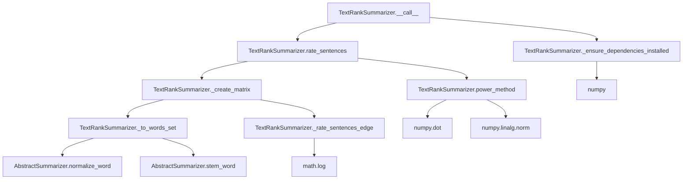

# `text_rank.py`

## `sumy.summarizers.text_rank.TextRankSummarizer` · *class*

## Summary:
Implements the TextRank algorithm for automatic text summarization by ranking sentences based on their importance in a weighted graph representation.

## Description:
The TextRankSummarizer is a concrete implementation of AbstractSummarizer that applies the TextRank algorithm to generate text summaries. It constructs a graph where nodes represent sentences and edges represent similarity between sentences, then computes node rankings using a power iteration method to determine sentence importance.

This summarizer is typically instantiated by application code or configuration systems that require automatic text summarization capabilities. It's particularly effective for extracting key information from documents while preserving the original sentence structure and order.

## State:
- epsilon (float): Convergence threshold for the power method, default is 1e-4
- damping (float): Damping factor for the PageRank-like algorithm, default is 0.85
- _ZERO_DIVISION_PREVENTION (float): Small value added to prevent division by zero, default is 1e-7
- _stop_words (frozenset): Set of normalized words to exclude from sentence processing, initially empty
- stop_words (property): Getter/setter for managing stop words, returns frozenset of normalized words

## Lifecycle:
- Creation: Instantiate with optional stemmer parameter (inherited from AbstractSummarizer)
- Usage: Call instance with (document, sentences_count) arguments where document contains sentences and sentences_count specifies how many sentences to return
- Destruction: Standard Python garbage collection; no special cleanup required

## Method Map:


## Raises:
- ValueError: Raised during initialization if NumPy dependency is not installed
- ValueError: Raised by _get_best_sentences when invalid count parameter is provided

## Example:
```python
from sumy.summarizers.text_rank import TextRankSummarizer
from sumy.parsers.plaintext import PlaintextParser
from sumy.nlp.tokenizers import Tokenizer

# Create summarizer instance
summarizer = TextRankSummarizer()

# Parse document
parser = PlaintextParser.from_file("document.txt", Tokenizer("english"))
document = parser.document

# Generate summary with 3 sentences
summary = summarizer(document, 3)

# Print summary sentences
for sentence in summary:
    print(sentence)
```

### `sumy.summarizers.text_rank.TextRankSummarizer.stop_words` · *method*

## Summary:
Sets the collection of stop words used to filter terms during text processing in the TextRank summarization algorithm.

## Description:
This property setter configures the stop words that will be excluded from consideration when processing sentences for text ranking. Stop words are common words (like "the", "and", "is") that typically carry less semantic meaning and are filtered out to improve summarization quality. The setter normalizes each provided word using the inherited normalize_word method before storing them as an immutable frozenset.

## Args:
    words (Iterable[str]): An iterable of words to be treated as stop words. Each word will be normalized to lowercase Unicode form.

## Returns:
    None: This method does not return a value.

## Raises:
    None: This method does not explicitly raise exceptions, though underlying operations may raise exceptions from the normalize_word method or frozenset construction.

## State Changes:
    Attributes READ: None
    Attributes WRITTEN: self._stop_words

## Constraints:
    Preconditions: The input iterable should contain elements that can be processed by the normalize_word method.
    Postconditions: The _stop_words attribute is updated to a frozenset containing the normalized versions of all provided words.

## Side Effects:
    None: This method performs no I/O operations or external service calls. It only modifies the internal state of the object.

### `sumy.summarizers.text_rank.TextRankSummarizer.__call__` · *method*

## Summary:
Processes a document and returns the most important sentences based on TextRank algorithm ratings.

## Description:
Implements the core summarization workflow for TextRank algorithm by validating dependencies, computing sentence importance scores, and selecting the highest-rated sentences. This method serves as the primary interface for generating text summaries using the TextRank approach.

The method follows a three-stage process: dependency validation, sentence rating computation, and best sentence selection. It's designed to be called directly on TextRankSummarizer instances with a document and desired sentence count.

## Args:
    document (Document): The input document containing sentences to summarize
    sentences_count (int or str): The target number of sentences for the summary. Can be an integer count or percentage string (e.g., "50%")

## Returns:
    tuple[Sentences]: A tuple of sentences selected from the input document, ordered by their TextRank importance scores. Returns an empty tuple when the document contains no sentences.

## Raises:
    ValueError: When NumPy dependency is not installed (raised by _ensure_dependencies_installed)

## State Changes:
    Attributes READ: 
        - self._stop_words: Used during sentence processing
    Attributes WRITTEN: None

## Constraints:
    Preconditions:
        - Document must have a `sentences` attribute that is iterable
        - Sentences_count must be a positive integer or valid percentage string format
        - NumPy must be installed and importable
        
    Postconditions:
        - Returns a tuple of sentences from the original document
        - Sentences are ordered by their computed TextRank importance scores
        - Empty documents return an empty tuple

## Side Effects:
    None

### `sumy.summarizers.text_rank.TextRankSummarizer._ensure_dependencies_installed` · *method*

## Summary:
Ensures NumPy dependency is available for TextRank summarization operations.

## Description:
Validates that the NumPy library is properly imported and available before proceeding with TextRank-based sentence ranking computations. This method is called during the summarization process to prevent runtime errors due to missing dependencies.

## Args:
    None

## Returns:
    None

## Raises:
    ValueError: When NumPy is not available (numpy is None), indicating that the LexRank summarizer requires NumPy to be installed.

## State Changes:
    Attributes READ: None
    Attributes WRITTEN: None

## Constraints:
    Preconditions: The method assumes that the numpy module is imported at the module level and available in the namespace.
    Postconditions: If execution continues past this method, NumPy is guaranteed to be available for subsequent operations.

## Side Effects:
    None

### `sumy.summarizers.text_rank.TextRankSummarizer.rate_sentences` · *method*

## Summary:
Computes normalized importance scores for all sentences in a document using the TextRank algorithm's power iteration method.

## Description:
This method implements the core sentence rating mechanism of the TextRank summarization algorithm. It constructs a transition probability matrix representing sentence relationships based on word overlap similarity, then applies the power iteration method to compute stationary probabilities that reflect each sentence's importance within the document. The resulting scores are returned as a mapping from sentences to their relative importance values.

The method is called during the TextRank summarization pipeline by the `__call__` method, which subsequently selects the highest-ranked sentences to form the final summary. This approach enables automatic extraction of key sentences without requiring manual feature engineering or external training data.

## Args:
    document (object): A document object containing sentences to rate. Must have a `sentences` attribute that is iterable and contains sentence objects with appropriate word access.

## Returns:
    dict: A dictionary mapping each sentence object in the document to its computed importance score (float between 0 and 1). Higher scores indicate more important sentences for inclusion in a summary.

## Raises:
    None explicitly raised, but may propagate exceptions from:
    - `self._create_matrix()` if document structure is invalid
    - `self.power_method()` if matrix operations fail

## State Changes:
    Attributes READ: 
        - self.epsilon (convergence threshold for power method)
        - self._create_matrix() (accesses class attributes like damping, _ZERO_DIVISION_PREVENTION)
        - self.power_method() (uses matrix and epsilon parameters)
    
    Attributes WRITTEN: None

## Constraints:
    Preconditions:
        - Document must have a `sentences` attribute that is iterable
        - Each sentence in document.sentences must be compatible with internal word processing methods
        - Document must contain at least one sentence for meaningful computation
        
    Postconditions:
        - Returned dictionary contains exactly one entry for each sentence in the document
        - All scores are non-negative floating-point values
        - Scores are normalized such that they represent a probability distribution over sentences

## Side Effects:
    - Uses NumPy for matrix operations and linear algebra computations
    - Performs iterative calculations that may involve significant computational overhead
    - May cause memory allocation for intermediate arrays during matrix computations

### `sumy.summarizers.text_rank.TextRankSummarizer._create_matrix` · *method*

## Summary:
Creates a normalized weight matrix for sentence similarity using TextRank algorithm principles, where each cell represents the weighted connection strength between two sentences.

## Description:
Constructs a square matrix representing sentence relationships in a document, where rows and columns correspond to sentences and matrix entries represent similarity scores. This matrix is specifically formatted for use with the power iteration method to compute sentence importance scores in the TextRank algorithm. The method processes all sentence pairs to compute their similarity ratings and normalizes them according to the TextRank transition probability formula.

The matrix construction follows the TextRank algorithm's mathematical formulation where:
- Sentence similarities are computed using cosine-like similarity based on shared words
- Matrix entries are normalized to ensure proper stochastic properties
- The damping factor controls the balance between random walk probability and actual sentence similarity
- Zero division prevention is applied to avoid numerical instability

This method is called during the sentence rating phase of TextRank summarization, specifically by the `rate_sentences` method which subsequently applies the power method to derive sentence importance scores.

## Args:
    document (object): A document object containing sentences to process. Must have a `sentences` attribute that is iterable and contains sentence objects with appropriate word access.

## Returns:
    numpy.ndarray: A square matrix of shape (n, n) where n is the number of sentences in the document. Each entry [i,j] represents the transition probability from sentence j to sentence i, properly normalized for the TextRank algorithm.

## Raises:
    None explicitly raised, but may propagate exceptions from:
    - `self._to_words_set()` if document structure is invalid
    - `self._rate_sentences_edge()` if word processing fails
    - `numpy` operations if memory allocation fails

## State Changes:
    Attributes READ: self.damping, self._ZERO_DIVISION_PREVENTION
    Attributes WRITTEN: None

## Constraints:
    Preconditions:
    - Document must have a `sentences` attribute that is iterable
    - Each sentence in document.sentences must be compatible with `self._to_words_set()`
    - `self.damping` must be a valid float between 0 and 1
    - `self._ZERO_DIVISION_PREVENTION` must be a small positive float to prevent division by zero
    
    Postconditions:
    - Returned matrix is square with dimensions equal to number of sentences
    - Matrix entries are non-negative floating-point values
    - Each row sums to approximately 1.0 (row-stochastic property)
    - Matrix is symmetric (sentence similarity is bidirectional)

## Side Effects:
    None - This method is pure and has no side effects beyond standard numpy operations.

### `sumy.summarizers.text_rank.TextRankSummarizer._to_words_set` · *method*

## Summary:
Converts a sentence into a filtered list of stemmed words by normalizing, stemming, and removing stop words.

## Description:
Processes a sentence object by normalizing each word, applying stemming, and filtering out stop words to create a clean word representation for TextRank sentence similarity calculations. This method is a core preprocessing step in the TextRank summarization algorithm, transforming raw sentence content into a standardized format suitable for mathematical computations.

The method is invoked during the matrix creation phase in `_create_matrix` to convert sentences into word sets that are compared to compute sentence similarities. It ensures consistent word representation by normalizing case and applying linguistic stemming while eliminating common stop words that would otherwise interfere with similarity measurements.

## Args:
    sentence (object): A sentence object with a `words` attribute that is iterable. Each element in `sentence.words` should be compatible with the `normalize_word` method.

## Returns:
    list[str]: A list of stemmed words (as strings) from the input sentence, with stop words removed. Each word has been normalized to lowercase Unicode and stemmed using the instance's stemmer.

## Raises:
    None explicitly raised by this method, but may propagate exceptions from:
    - `self.normalize_word()` if sentence.words contains incompatible elements
    - `self.stem_word()` if normalized words are incompatible with stemming

## State Changes:
    Attributes READ: 
        - self._stop_words: Frozenset of stop words to filter out
        - self.normalize_word: Method for normalizing words
        - self.stem_word: Method for stemming words
    
    Attributes WRITTEN: 
        - None

## Constraints:
    Preconditions:
        - The sentence object must have a `words` attribute that is iterable
        - Each element in sentence.words must be compatible with self.normalize_word()
        - self._stop_words must be a frozenset of normalized words
        - self.normalize_word and self.stem_word methods must be properly initialized
    
    Postconditions:
        - Returned list contains only stemmed words (strings)
        - All returned words are not present in self._stop_words
        - All returned words have been normalized and stemmed consistently
        - The order of words in the returned list matches their order in the original sentence

## Side Effects:
    None - This method is pure and has no side effects beyond standard Python operations.

### `sumy.summarizers.text_rank.TextRankSummarizer._rate_sentences_edge` · *method*

## Summary:
Computes a normalized similarity score between two sets of words for TextRank sentence weighting.

## Description:
Calculates a similarity rating between two word sequences using a logarithmic normalization approach. This method serves as the core edge weighting function in the TextRank algorithm, determining how closely related two sentences are based on their shared vocabulary.

## Args:
    words1 (list[str]): First sequence of words to compare
    words2 (list[str]): Second sequence of words to compare

## Returns:
    float: Normalized similarity score between 0.0 and 1.0, where 0.0 indicates no similarity and higher values indicate greater similarity

## Raises:
    AssertionError: When either input list is empty (though this should not occur in normal operation due to prior validation)

## State Changes:
    None

## Constraints:
    Preconditions:
        - Both input lists must contain at least one word
        - Input lists should contain string elements
    Postconditions:
        - Returns a float value in the range [0.0, 1.0]
        - If no words are shared between the lists, returns 0.0
        - If all words are shared and lists are non-empty, returns a positive value

## Side Effects:
    None

### `sumy.summarizers.text_rank.TextRankSummarizer.power_method` · *method*

## Summary:
Computes the principal eigenvector of a transition matrix using the power iteration method for TextRank-based sentence ranking.

## Description:
Implements the power iteration algorithm to find the dominant eigenvector of a given transition matrix. This method is used in the TextRank summarization algorithm to calculate sentence importance scores by iteratively applying the transition matrix to an initial probability vector until convergence is achieved.

The power method is called during the sentence rating phase of TextRank summarization, specifically by the `rate_sentences` method which prepares the transition matrix using `_create_matrix`. The resulting eigenvector represents the relative importance scores of sentences in the document.

## Args:
    matrix (numpy.ndarray): A square transition probability matrix of shape (n, n) where n is the number of sentences. Each row should sum to 1.0, representing valid transition probabilities between sentences.
    epsilon (float): Convergence threshold for the iterative process. The algorithm stops when the difference between successive iterations falls below this value. Typically set to a small positive value like 1e-4.

## Returns:
    numpy.ndarray: A probability vector of length n representing the relative importance scores of sentences. Each element corresponds to a sentence's rank score, with higher values indicating more important sentences.

## Raises:
    None explicitly raised, but may propagate exceptions from:
    - numpy operations if matrix dimensions are incompatible
    - numpy.linalg.norm if numerical issues occur during computation

## State Changes:
    Attributes READ: None
    Attributes WRITTEN: None

## Constraints:
    Preconditions:
    - Matrix must be a square numpy array with dimensions (n, n)
    - Matrix must represent a valid stochastic matrix (each row sums to 1.0)
    - Epsilon must be a positive float value
    - Matrix should be large enough to contain meaningful sentence relationships
    
    Postconditions:
    - Returned vector has the same length as the number of rows in the input matrix
    - All elements in the returned vector are non-negative
    - The vector represents a probability distribution (elements sum to 1.0)
    - Algorithm converges to a stable solution within the specified epsilon tolerance

## Side Effects:
    - Uses NumPy for matrix operations and linear algebra computations
    - Performs iterative calculations that may involve significant computational overhead for large matrices
    - May cause memory allocation for intermediate arrays during computation

