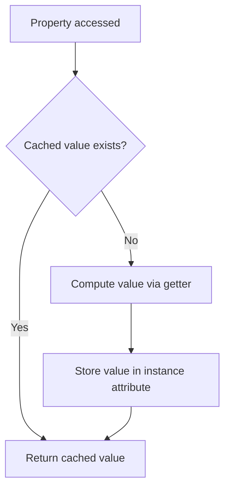
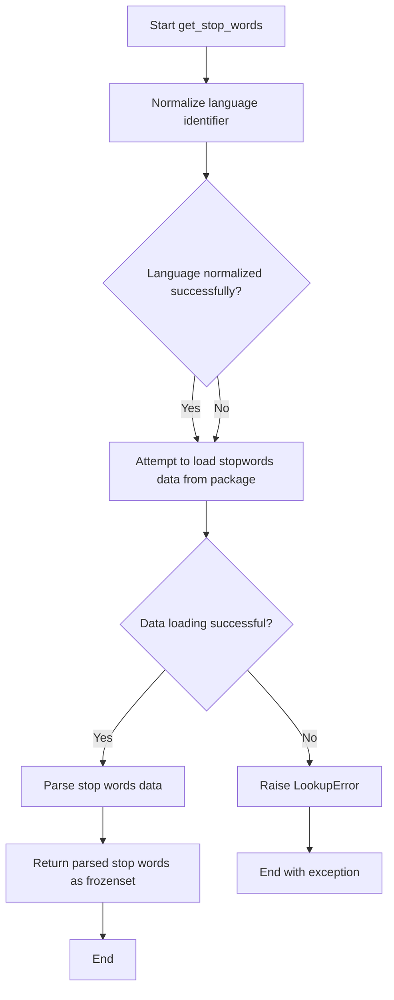
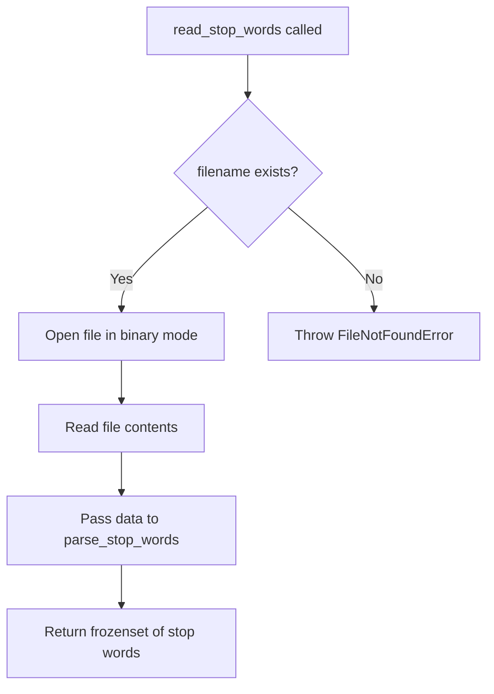

# `utils.py`

## `sumy.utils.normalize_language` · *function*

## Summary:
Normalizes language identifiers by converting alpha-2 or alpha-3 language codes to their full English names in lowercase.

## Description:
Converts language codes (such as 'en' or 'eng') to their standardized full names (like 'english'). This function attempts to resolve language identifiers using the pycountry library, first trying alpha-2 codes and then alpha-3 codes. If no matching language is found, it returns the original input unchanged. This extraction provides a clean interface for language normalization while encapsulating the lookup logic.

## Args:
    language (str): Language identifier that can be an alpha-2 code (2-letter), alpha-3 code (3-letter), or full language name.

## Returns:
    str: Full English name of the language in lowercase if found, otherwise returns the original language parameter unchanged.

## Raises:
    None explicitly raised, but KeyError exceptions from pycountry.languages.get are caught and ignored.

## Constraints:
    Preconditions:
        - Input must be a string
    Postconditions:
        - Returns either the normalized language name (lowercase) or the original input string

## Side Effects:
    None

## Control Flow:
```mermaid
flowchart TD
    A[Start normalize_language] --> B{language is string?}
    B -- Yes --> C[Iterate lookup_keys: alpha_2, alpha_3]
    B -- No --> D[Return language]
    C --> E[Try languages.get(**{lookup_key: language})]
    E --> F{KeyError raised?}
    F -- Yes --> G[Continue to next lookup_key]
    F -- No --> H{lang object returned?}
    H -- Yes --> I[language = lang.name.lower()]
    H -- No --> G[Continue to next lookup_key]
    G --> J{More lookup_keys?}
    J -- Yes --> C
    J -- No --> K[Return language]
    I --> J
    K --> L[End]
```

## Examples:
    >>> normalize_language('en')
    'english'
    >>> normalize_language('eng')
    'english'
    >>> normalize_language('French')
    'french'
    >>> normalize_language('xyz')
    'xyz'

## `sumy.utils.fetch_url` · *function*

## Summary:
Fetches raw content from a given URL using HTTP GET with automatic error handling and resource cleanup.

## Description:
Retrieves content from a specified web URL using HTTP GET request. This utility function encapsulates HTTP request logic with proper resource management using a context manager and automatic status code validation. The function is designed to handle network communication reliably.

## Args:
    url (str): The URL to fetch content from. Must be a valid HTTP or HTTPS URL string.

## Returns:
    bytes: Raw content bytes from the HTTP response body.

## Raises:
    requests.exceptions.RequestException: When the HTTP request fails due to network issues, invalid URL, or server errors (status codes >= 400).

## Constraints:
    Preconditions:
        - The input URL must be a valid string representing a reachable HTTP/HTTPS endpoint
        - The server at the URL must be accessible and respond appropriately
    
    Postconditions:
        - The HTTP connection is properly closed after the request
        - Any HTTP error status (4xx, 5xx) will raise an exception
        - Returns the complete raw content from the response body

## Side Effects:
    - Makes an outbound HTTP network request to the specified URL
    - May trigger DNS resolution and TCP connection establishment
    - No local file I/O or modification of external state

## Control Flow:
```mermaid
flowchart TD
    A[Start fetch_url] --> B[Make HTTP GET request to URL]
    B --> C[Use closing() context manager]
    C --> D{Request successful?}
    D -->|No| E[raise RequestException]
    D -->|Yes| F[response.raise_for_status()]
    F --> G{Status OK?}
    G -->|No| H[raise RequestException]
    G -->|Yes| I[Return response.content]
```

## Examples:
    # Basic usage
    content = fetch_url("https://example.com/page.html")
    
    # Error handling
    try:
        content = fetch_url("https://nonexistent.example.com")
    except requests.exceptions.RequestException as e:
        print(f"Failed to fetch URL: {e}")
``

## `sumy.utils.cached_property` · *function*

## Summary:
Creates a cached property decorator that stores computed values in instance attributes to avoid recomputation.

## Description:
A decorator factory that transforms a method into a cached property. When accessed, the decorated method computes its value once and stores it in a private instance attribute. Subsequent accesses return the cached value without re-executing the computation.

## Args:
    getter (callable): A method that takes 'self' as its only argument and returns the value to be cached.

## Returns:
    property: A property object that implements the cached property behavior.

## Raises:
    None explicitly raised.

## Constraints:
    Preconditions:
    - The getter function must accept exactly one argument (self)
    - The getter function should be idempotent (produce the same result when called multiple times with the same arguments)
    
    Postconditions:
    - The first access to the property will execute the getter and store the result
    - Subsequent accesses will return the cached value
    - The cached value is stored as an instance attribute with name "_cached_property_{getter_name}"

## Side Effects:
    - Modifies the instance object by adding a new private attribute on first access
    - No external I/O operations or state mutations beyond the instance's own attributes

## Control Flow:


## Examples:
```python
class MyClass:
    @cached_property
    def expensive_computation(self):
        # This will only run once
        return sum(range(1000000))
    
    @cached_property  
    def language_name(self):
        return "Python"

# Usage:
obj = MyClass()
result1 = obj.expensive_computation  # Computes and caches
result2 = obj.expensive_computation  # Returns cached value
```

## `sumy.utils.expand_resource_path` · *function*

## Summary:
Constructs an absolute file path to a resource within the sumy package's data directory using cross-version compatible string handling.

## Description:
This function resolves a relative resource path to an absolute filesystem path by joining it with the sumy package's data directory. It ensures that resource files can be located regardless of the current working directory by using the package's installation location as the base. The function uses cross-version string compatibility utilities to maintain compatibility between Python 2 and Python 3 environments.

## Args:
    path (str): A relative path to a resource file within the sumy package's data directory.

## Returns:
    str: An absolute filesystem path to the requested resource file, constructed by joining the sumy package directory with "data" and the provided path.

## Raises:
    None explicitly raised.

## Constraints:
    Preconditions:
    - The sumy package must be installed and importable
    - The path parameter must be a valid string
    - The data directory must exist within the sumy package installation
    
    Postconditions:
    - Returns an absolute path string
    - The returned path points to a location within the sumy package's data directory

## Side Effects:
    None.

## Control Flow:
```mermaid
flowchart TD
    A[expand_resource_path called with path] --> B{Get sumy module directory}
    B --> C{Convert to absolute path}
    C --> D{Join with "data" and path using to_string}
    D --> E[Return absolute path]
```

## Examples:
    >>> expand_resource_path("stopwords/english.txt")
    "/usr/local/lib/python3.8/site-packages/sumy/data/stopwords/english.txt"

## `sumy.utils.get_stop_words` · *function*

## Summary:
Retrieves and parses stop words for a specified language from packaged data files.

## Description:
Fetches pre-defined stop word lists for the given language from the package's data directory and converts them into a frozen set of strings. This function serves as a centralized interface for accessing stop word collections used in text processing and natural language analysis tasks.

## Args:
    language (str): Language identifier that can be an alpha-2 code (2-letter), alpha-3 code (3-letter), or full language name. The function normalizes this identifier before attempting to retrieve stop words.

## Returns:
    frozenset[str]: A frozen set containing all stop words for the specified language, with each word stripped of trailing whitespace and converted to lowercase.

## Raises:
    LookupError: When stop-word data files are not available for the specified language, indicating that the language is not supported or the data files are missing.

## Constraints:
    Preconditions:
        - Input language parameter must be a string
        - Language must have corresponding stop-word data files in the package
    Postconditions:
        - Returns a frozenset of strings representing stop words
        - Stop words are normalized to lowercase and stripped of whitespace

## Side Effects:
    None

## Control Flow:


## Examples:
    >>> get_stop_words('english')
    frozenset({'the', 'a', 'an', 'and', 'or', 'but', 'in', 'on', 'at', 'to', 'for', 'of', 'with', 'by'})
    >>> get_stop_words('en')
    frozenset({'the', 'a', 'an', 'and', 'or', 'but', 'in', 'on', 'at', 'to', 'for', 'of', 'with', 'by'})
    >>> get_stop_words('unknown')
    LookupError: Stop-words are not available for language unknown.
```

## `sumy.utils.read_stop_words` · *function*

## Summary:
Reads and parses stop words from a file into a frozen set of words for text processing.

## Description:
This function opens a file containing stop words in binary mode, reads its contents, and processes them into a frozenset of words. It serves as a utility for loading stop word lists used in text processing and natural language analysis, particularly in summarization algorithms. The function extracts stop words from files where each word appears on a separate line.

## Args:
    filename (str): Path to the file containing stop words, one per line.

## Returns:
    frozenset[str]: A frozen set of stop words with trailing whitespace removed.

## Raises:
    FileNotFoundError: If the specified file does not exist.
    IOError: If there is an issue reading the file.

## Constraints:
    Preconditions:
        - The filename parameter must be a valid path to an existing file.
        - The file must contain text with one stop word per line.
    Postconditions:
        - Returns a frozenset containing all stop words from the file.
        - All words in the returned set have trailing whitespace stripped.

## Side Effects:
    - Reads from the filesystem at the specified filename.
    - May raise file I/O related exceptions if the file cannot be accessed.

## Control Flow:


## Examples:
    >>> # Load English stop words
    >>> stop_words = read_stop_words("data/stopwords/english.txt")
    >>> "the" in stop_words
    True
    >>> len(stop_words)
    500
    
    >>> # Check if a word is a stop word
    >>> if "and" in stop_words:
    ...     print("Word is a stop word")
    ... else:
    ...     print("Word is not a stop word")

## `sumy.utils.parse_stop_words` · *function*

*No documentation generated.*

## `sumy.utils.ItemsCount` · *class*

## Summary:
A callable utility class that limits sequences to a specified number of items, supporting both absolute counts and percentage-based limits.

## Description:
The ItemsCount class provides a flexible way to truncate sequences (lists, tuples, etc.) to a specified number of elements. It accepts various input formats for specifying the limit: absolute integers, floating-point numbers, or percentage strings ending with "%". This class is commonly used in text summarization and data processing pipelines where it's necessary to limit the number of items in a collection.

## State:
- `_value`: The limit specification, which can be a string (with optional "%" suffix), integer, or float representing the maximum number of items to return from a sequence
- Valid ranges: 
  - For numeric values: any positive number (converted to integer)
  - For percentage strings: values ending with "%" (e.g., "50%")
  - For string representations: any valid integer/float that can be converted to int

## Lifecycle:
- Creation: Instantiate with a value parameter (string, int, or float)
- Usage: Call the instance with a sequence (list, tuple, etc.) to get a truncated version
- Destruction: No special cleanup required; uses standard Python garbage collection

## Method Map:
```mermaid
graph TD
    A[ItemsCount.__init__] --> B[ItemsCount.__call__]
    B --> C[sequence[:count]]
```

## Raises:
- ValueError: When the value parameter is not a supported type (string, int, or float) or when a percentage string contains invalid characters

## Example:
```python
# Create an ItemsCount instance with absolute limit
limit_5 = ItemsCount(5)
result = limit_5(['a', 'b', 'c', 'd', 'e', 'f'])  # Returns ['a', 'b', 'c', 'd', 'e']

# Create an ItemsCount instance with percentage limit
limit_50_percent = ItemsCount("50%")
result = limit_50_percent(['a', 'b', 'c', 'd', 'e'])  # Returns ['a', 'b', 'c'] (50% of 5 items)

# Create an ItemsCount instance with float limit
limit_2_5 = ItemsCount(2.5)
result = limit_2_5(['a', 'b', 'c', 'd'])  # Returns ['a', 'b']
```

### `sumy.utils.ItemsCount.__init__` · *method*

## Summary:
Initializes an ItemsCount instance with a limit specification that determines how sequences will be truncated.

## Description:
The constructor accepts a value parameter that defines the limiting behavior for the ItemsCount callable. This value can represent either an absolute count or a percentage-based limit, enabling flexible sequence truncation in text processing applications.

## Args:
    value: The limit specification, which can be:
        - An integer or float representing an absolute count of items to return
        - A string ending with "%" representing a percentage of items to return
        - A string representation of a number that will be converted to an integer

## Returns:
    None: This method initializes the instance and does not return a value.

## Raises:
    ValueError: When the value parameter is not a supported type (string, int, or float) or when a percentage string contains invalid characters.

## State Changes:
    Attributes READ: None
    Attributes WRITTEN: self._value (stores the limit specification for later use in sequence limiting operations)

## Constraints:
    Preconditions:
    - The value parameter must be one of the supported types: string, int, or float
    - If value is a string, it must either be a valid numeric representation or end with "%" for percentage calculation
    
    Postconditions:
    - The instance will store the provided value in self._value for future use
    - The stored value will be processed appropriately by the __call__ method

## Side Effects:
    None: This method performs no I/O operations or external service calls.

### `sumy.utils.ItemsCount.__call__` · *method*

## Summary:
Returns a slice of the input sequence limited by the configured count or percentage value.

## Description:
This method implements a flexible sequence limiting mechanism that can operate in two modes:
1. Percentage mode: When the configured value ends with "%", it calculates a percentage of the sequence length and returns that many elements
2. Count mode: When the configured value is numeric, it returns that many elements from the beginning of the sequence

The method is designed to be used as a callable interface for limiting text processing operations, such as extracting a specific number of sentences or words from a document.

## Args:
    sequence (list, tuple, or str): The input sequence to be sliced. Must support len() and indexing operations.

## Returns:
    Same type as sequence: A slice of the input sequence containing either:
    - The specified number of elements (when value is numeric)
    - A percentage of elements (when value ends with "%")

## Raises:
    ValueError: When the configured value is neither a string ending with "%" nor a numeric type.

## State Changes:
    Attributes READ: self._value
    Attributes WRITTEN: None

## Constraints:
    Preconditions:
    - The sequence must support len() and slicing operations
    - The configured value must be either a string ending with "%" or a numeric type
    - When using percentage mode, the percentage value must be convertible to integer
    
    Postconditions:
    - The returned sequence will contain at most the requested number of elements
    - In percentage mode, the result will contain at least 1 element (due to max(1, ...))

## Side Effects:
    None

### `sumy.utils.ItemsCount.__repr__` · *method*

## Summary:
Returns a string representation of the ItemsCount object showing its internal value.

## Description:
This special method provides a human-readable string representation of an ItemsCount instance. It is automatically invoked when the built-in `repr()` function is called on an ItemsCount object or when the object is displayed in interactive Python sessions. The method formats the object's internal `_value` attribute into a standardized representation.

## Args:
    None

## Returns:
    str: A string in the format "<ItemsCount: value>" where 'value' represents the internal `_value` attribute, properly converted to a cross-compatible string representation.

## Raises:
    None

## State Changes:
    Attributes READ: self._value
    Attributes WRITTEN: None

## Constraints:
    Preconditions:
    - The ItemsCount instance must have been initialized with a valid `_value` attribute
    - The `_value` attribute must be convertible to string representation
    
    Postconditions:
    - Returns a string representation that follows the pattern "<ItemsCount: value>"
    - The returned string is cross-compatible between Python 2 and Python 3

## Side Effects:
    None

