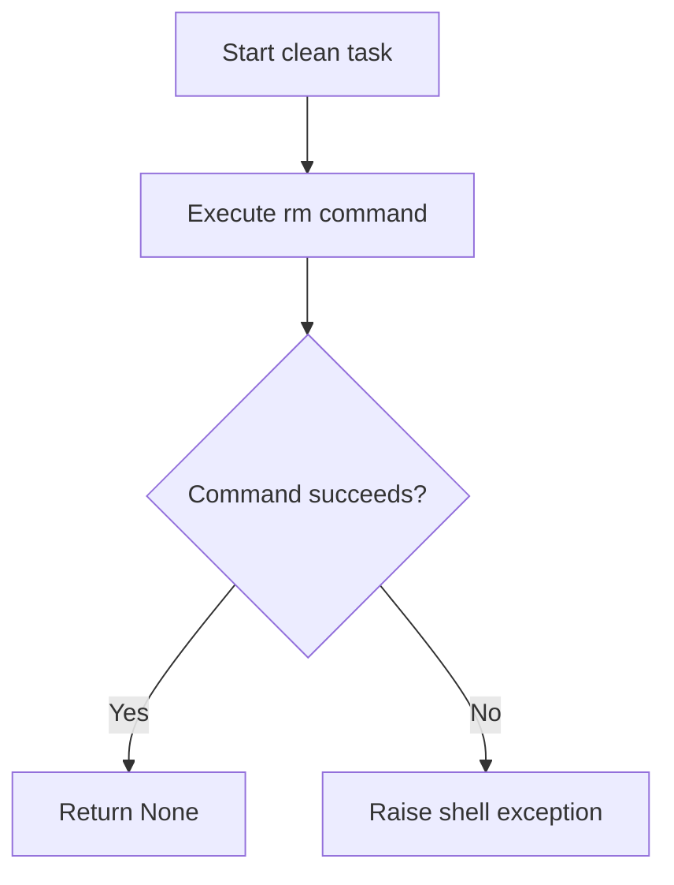
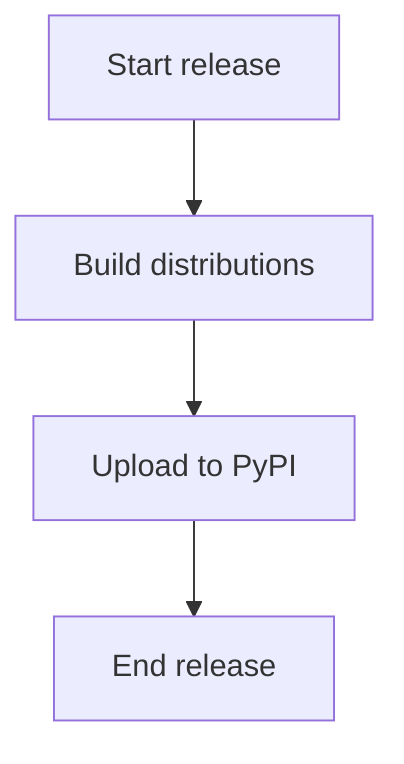
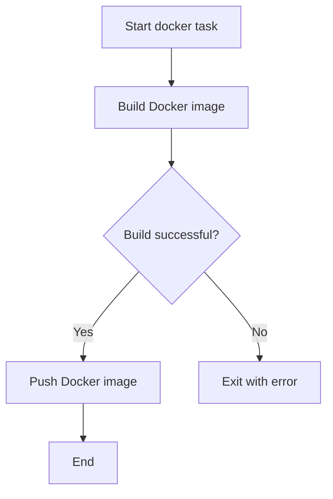

# `tasks.py`

## `clean` · *function*

## Summary:
Removes build artifacts and cache directories from the project workspace.

## Description:
This function cleans up temporary files and directories that are typically created during development and testing processes. It is designed to be used as an Invoke task to provide a standardized cleanup mechanism for the project environment.

The function is extracted into its own dedicated task to enforce a clear separation of concerns and provide a reusable cleanup operation that can be invoked independently or as part of larger workflows.

## Args:
    context: An Invoke context object that provides execution environment and methods for running shell commands.

## Returns:
    None: This function does not return any value.

## Raises:
    Exception: Propagates any exceptions raised by the underlying shell command execution if the removal fails.

## Constraints:
    Preconditions:
    - The context object must be properly initialized with an Invoke task runner
    - The directories and files to be removed must exist in the current working directory
    
    Postconditions:
    - All specified directories and files are removed from the filesystem
    - The working directory is left in a clean state

## Side Effects:
    - Filesystem modifications: Directories and files matching the specified patterns are deleted
    - No external services or global state changes occur

## Control Flow:


## Examples:
```python
# Typical usage in an Invokefile
from invoke import task

@task
def clean(context):
    context.run("rm -rf dist build .coverage .pytest_cache .mypy_cache")

# Invoked via command line:
# $ invoke clean
```

## `test` · *function*

## Summary:
Executes the pytest test suite using the invoke task runner.

## Description:
This function is an invoke task that executes pytest to run all tests in the current project. It provides a standardized interface for test execution through the invoke task automation system.

The function is decorated with @task from the invoke library, making it callable via the command line as "invoke test". It uses the context object's run method to execute the pytest command in the system shell.

## Args:
    context: The invoke context object automatically provided by the invoke task runner. Contains methods for executing shell commands and accessing configuration.

## Returns:
    Return value depends on the underlying context.run() implementation.

## Raises:
    Exceptions may originate from context.run() or pytest execution, such as command execution failures.

## Constraints:
    Preconditions:
    - pytest must be installed in the Python environment
    - invoke must be properly configured in the project
    - test files must exist in the project directory
    
    Postconditions:
    - pytest command executes with default arguments
    - Test output is displayed to console

## Side Effects:
    - Executes shell command "pytest"
    - Displays test results to stdout/stderr
    - May affect process state through test execution

## Control Flow:
```mermaid
flowchart TD
    A[Invoke test task] --> B[Execute context.run("pytest")]
    B --> C[Run pytest command]
    C --> D[Show test results]
```

## Examples:
    # Run tests via invoke:
    # invoke test
    
    # Equivalent to running:
    # pytest

## `install` · *function*

## Summary:
Installs a Python package in development mode using the "python setup.py develop" command.

## Description:
This function executes the "python setup.py develop" shell command to install the current package in development mode. It is designed to be used as an invoke task for automating package installation workflows. The development mode installation allows for editing source code changes without needing to reinstall the package.

## Args:
    context: An invoke context object that provides execution environment and the run() method for executing shell commands

## Returns:
    The result of context.run() which is typically an invoke Result object containing execution status, stdout, and stderr information

## Raises:
    Any exceptions that may be raised by the underlying context.run() implementation when executing shell commands, such as CommandError for failed commands

## Constraints:
    Preconditions:
    - The current working directory must contain a valid setup.py file
    - The python command must be available in the system PATH
    - The invoke context must be properly initialized
    
    Postconditions:
    - The package is installed in development mode in the current Python environment
    - The package can be imported and modified without reinstallation

## Side Effects:
    - Executes a shell command that modifies the Python environment
    - May create or modify files in the local filesystem during package installation
    - Writes to stdout/stderr through the shell command execution

## Control Flow:
```mermaid
flowchart TD
    A[install function called] --> B{context.run called with "python setup.py develop"}
    B --> C[Execute shell command in current directory]
    C --> D[Return Result object with execution details]
```

## Examples:
```python
# Typical usage in an invokefile
from invoke import task

@task
def install(context):
    context.run("python setup.py develop")

# Invoked via command line:
# $ invoke install
```

## `release` · *function*

## Summary:
Executes a Python package release workflow by building distribution artifacts and uploading them to PyPI.

## Description:
This function implements a standard Python package release process using the Invoke task framework. It sequentially executes two shell commands: first building source distribution and wheel packages using setup.py, then uploading those packages to the Python Package Index via twine. This function serves as a convenient automation task for releasing Python packages.

## Args:
    context: An Invoke context object that provides the run() method for executing shell commands

## Returns:
    None: This function performs side effects but returns no value

## Raises:
    Any exceptions that may occur during shell command execution or context.run() invocation
    Specifically, shell command failures, permission errors, or network connectivity issues

## Constraints:
    Preconditions:
    - The current working directory must contain a valid Python package with setup.py
    - The twine package must be installed in the environment
    - The dist/ directory must be writable
    - Network connectivity is required for PyPI upload
    
    Postconditions:
    - Distribution files are created in the dist/ directory
    - Package is uploaded to PyPI (if successful)

## Side Effects:
    - Creates distribution files in the local dist/ directory
    - Makes network requests to PyPI
    - May modify global Python package index state

## Control Flow:


## Examples:
```python
# Typical usage in an Invokefile
@task
def release(context):
    context.run("python setup.py register sdist bdist_wheel")
    context.run("twine upload dist/*")
```

## `bump` · *function*

## Summary:
Increments project version and amends the latest Git commit with the new version.

## Description:
Executes the bumpversion tool to update project version numbers and amends the most recent Git commit to include the new version. This function serves as a convenience wrapper for automated version management in development workflows.

## Args:
    context: The Invoke context object providing execution environment and run capabilities.
    version (str): Version increment type. Defaults to "patch". Common values include "major", "minor", "patch", "premajor", "preminor", "prepatch", "prerelease".

## Returns:
    None: This function does not return any value.

## Raises:
    Any exceptions raised by the underlying shell commands or context.run() method.

## Constraints:
    Preconditions:
    - The project must be a Git repository
    - The bumpversion tool must be installed and configured
    - The context object must have a valid run method
    - A previous Git commit must exist to amend

    Postconditions:
    - The version file(s) are updated with the new version number
    - The latest Git commit is amended with the version change
    - The working directory reflects the new version state

## Side Effects:
    - Modifies version files in the project directory
    - Amends the most recent Git commit
    - Executes shell commands via context.run()

## Control Flow:
```mermaid
flowchart TD
    A[Start bump()] --> B{version parameter}
    B --> C[bumpversion {version}]
    C --> D[git commit --amend]
    D --> E[End]
```

## Examples:
```python
# Bump patch version (default)
bump(context)

# Bump minor version
bump(context, version="minor")

# Bump major version
bump(context, version="major")
```

## `docker` · *function*

## Summary:
Builds and pushes a Docker container image with latest and version-specific tags to a remote registry.

## Description:
This function executes two sequential Docker operations: first building a container image with two tags (latest and 0.11.0) and then pushing all tags to the remote registry. It's designed to be used as an Invoke task to automate the container deployment workflow.

## Args:
    context: The Invoke context object containing execution environment and run methods

## Returns:
    None

## Raises:
    Any exceptions raised by the underlying context.run() method when executing shell commands

## Constraints:
    Preconditions:
    - Docker daemon must be running and accessible
    - Docker CLI must be installed and available in PATH
    - User must have appropriate permissions to build and push images to the registry
    - Must be executed from a directory containing a valid Dockerfile
    
    Postconditions:
    - A Docker image with tags 'misobelica/sumy:latest' and 'misobelica/sumy:0.11.0' is built locally
    - Both image tags are pushed to the remote registry

## Side Effects:
    - Executes shell commands that may modify local Docker environment
    - May cause network I/O when pushing images to remote registry
    - Modifies local Docker image cache

## Control Flow:


## Examples:
```python
# Typical usage in an Invokefile.py
from invoke import task

@task
def docker(context):
    context.run("docker build --no-cache --rm=true --tag misobelica/sumy:latest -t misobelica/sumy:0.11.0 .")
    context.run("docker push misobelica/sumy --all-tags")
```

