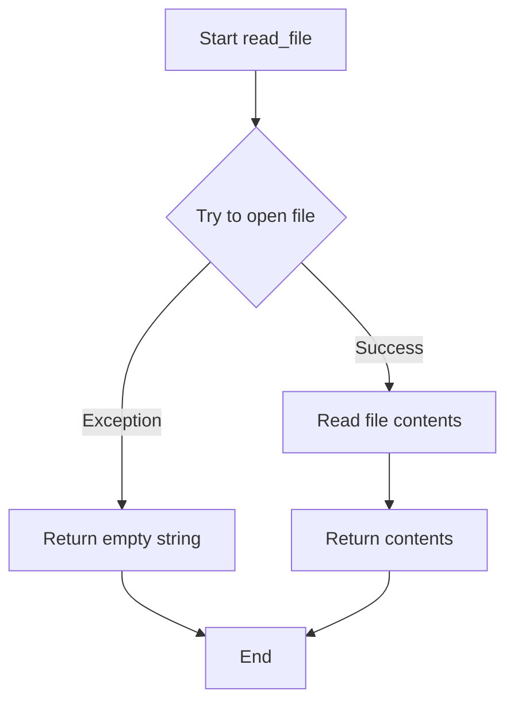

# `setup.py`

## `read_file` · *function*

## Summary:
Reads the contents of a file and returns it as a string, with graceful error handling for missing or inaccessible files.

## Description:
This function attempts to open and read the contents of a specified file. It is designed to handle file reading errors gracefully by returning an empty string when the file cannot be accessed, making it safe for use in environments where optional files might not exist. The function is commonly used in package setup scripts to read README files or other documentation files.

## Args:
    filename (str): The path to the file to be read. This can be a relative or absolute path.

## Returns:
    str: The contents of the file as a string if successful, or an empty string if the file cannot be read due to any error.

## Raises:
    None: This function does not explicitly raise exceptions, though it catches all exceptions internally.

## Constraints:
    Precondition: The filename parameter must be a valid string representing a file path.
    Postcondition: The function always returns a string value, either the file contents or an empty string.

## Side Effects:
    File I/O operation: Reads from the filesystem at the specified file path.
    No external state mutations or service calls.

## Control Flow:


## Examples:
```python
# Reading a README file
readme_content = read_file('README.md')
print(readme_content)

# Reading a non-existent file (returns empty string)
empty_content = read_file('nonexistent.txt')
print(empty_content)  # prints: ""
```

